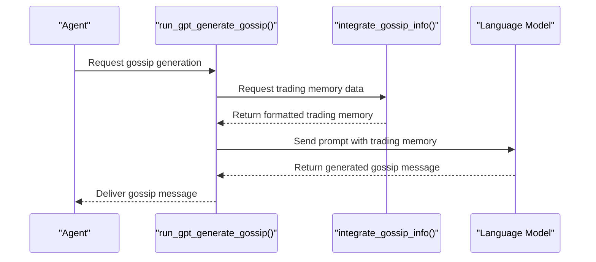
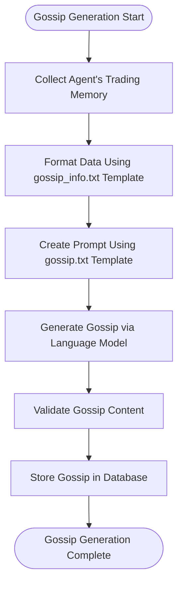
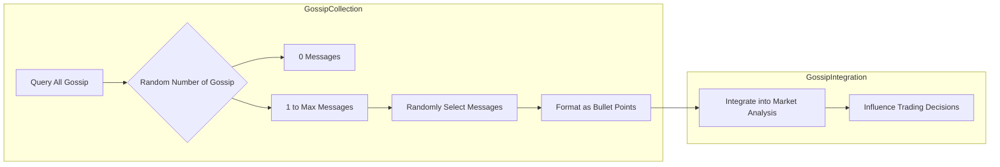
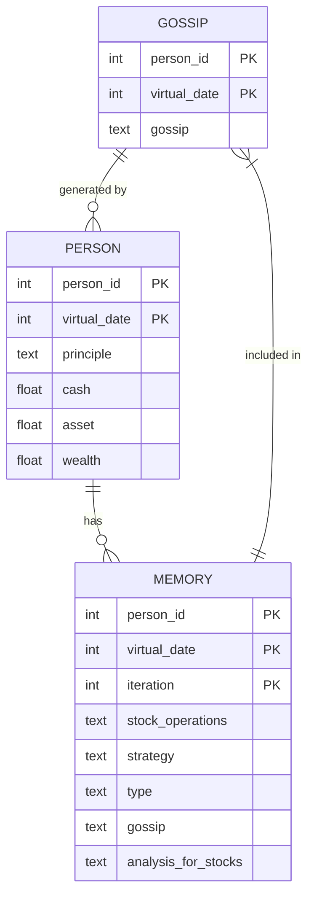
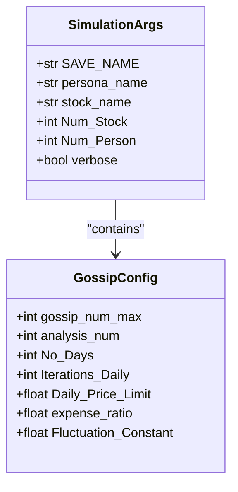

# Gossip System

<cite>
**Referenced Files in This Document**   
- [our_run_gpt_prompt.py](file://Agent-Trading-Arena/Stock_Main/content/our_run_gpt_prompt.py)
- [behavior.py](file://Agent-Trading-Arena/Stock_Main/behavior.py)
- [gossip.txt](file://Agent-Trading-Arena/Stock_Main/content/our_prompt_template/gossip.txt)
- [gossip_info.txt](file://Agent-Trading-Arena/Stock_Main/content/our_prompt_template/gossip_info.txt)
- [analysis.txt](file://Agent-Trading-Arena/Stock_Main/content/our_prompt_template/analysis.txt)
- [Person.py](file://Agent-Trading-Arena/Stock_Main/Person.py)
- [database_utils.py](file://Agent-Trading-Arena/Stock_Main/database_utils.py)
- [main.py](file://Agent-Trading-Arena/Stock_Main/main.py)
</cite>

## Table of Contents
1. [Introduction](#introduction)
2. [Gossip Generation Mechanism](#gossip-generation-mechanism)
3. [Gossip Integration and Selection](#gossip-integration-and-selection)
4. [System Architecture and Workflow](#system-architecture-and-workflow)
5. [Implementation Details](#implementation-details)
6. [Impact on Market Dynamics](#impact-on-market-dynamics)
7. [Configuration and Parameters](#configuration-and-parameters)
8. [Research Applications](#research-applications)
9. [Conclusion](#conclusion)

## Introduction
The gossip system in the Agent-Trading-Arena simulation enables agents to generate and share market insights through a structured gossip mechanism. This system facilitates information propagation and simulates herd behavior in financial markets by allowing agents to create and consume gossip messages based on their trading experiences and market observations. The gossip mechanism is designed to influence agents' market analysis and trading decisions, creating realistic market dynamics where information cascades and price volatility emerge from social interactions among agents.

**Section sources**
- [our_run_gpt_prompt.py](file://Agent-Trading-Arena/Stock_Main/content/our_run_gpt_prompt.py#L364-L412)
- [behavior.py](file://Agent-Trading-Arena/Stock_Main/behavior.py#L201-L209)

## Gossip Generation Mechanism

### run_gpt_generate_gossip Function
The `run_gpt_generate_gossip()` function in `our_run_gpt_prompt.py` serves as the core mechanism for creating gossip messages based on an agent's recent trading memory and market observations. This function orchestrates the generation of market insights that agents can share with others, simulating how traders might communicate market intelligence in real-world financial environments.

The function works by first preparing input data through the `integrate_gossip_info()` function, which compiles relevant information from the agent's recent trading activities. This includes details about virtual date, iteration, stock operations, financial situation, stock prices, analysis for stocks, and investment strategy. The compiled information is then used as input for a prompt that guides the language model in generating appropriate gossip content.



**Diagram sources**
- [our_run_gpt_prompt.py](file://Agent-Trading-Arena/Stock_Main/content/our_run_gpt_prompt.py#L364-L412)
- [our_run_gpt_prompt.py](file://Agent-Trading-Arena/Stock_Main/content/our_run_gpt_prompt.py#L22-L51)

**Section sources**
- [our_run_gpt_prompt.py](file://Agent-Trading-Arena/Stock_Main/content/our_run_gpt_prompt.py#L364-L412)

### Gossip Prompt Template Structure
The gossip generation process relies on a specific prompt template defined in `gossip.txt`. This template provides clear instructions to the language model about the nature of the task and the expected output format. The template establishes the context that agents are participating in a simulated stock trading challenge where prices are determined by participant bids.

Key elements of the prompt template include:
- Instructions that agents should generate gossip about stocks or the whole market
- Permission for agents to create real or fake gossip to influence other participants
- Constraints that fake gossip must not conflict with known stock and market information
- Focus on generating content that could influence other agents' stock operations

The template uses a structured format with variables that are replaced with actual data from the agent's trading history, ensuring that the generated gossip is grounded in the agent's recent experiences while allowing creative interpretation.



**Diagram sources**
- [gossip.txt](file://Agent-Trading-Arena/Stock_Main/content/our_prompt_template/gossip.txt#L1-L16)
- [gossip_info.txt](file://Agent-Trading-Arena/Stock_Main/content/our_prompt_template/gossip_info.txt#L1-L28)

**Section sources**
- [gossip.txt](file://Agent-Trading-Arena/Stock_Main/content/our_prompt_template/gossip.txt#L1-L16)
- [gossip_info.txt](file://Agent-Trading-Arena/Stock_Main/content/our_prompt_template/gossip_info.txt#L1-L28)

## Gossip Integration and Selection

### integrate_gossip and integrate_gossip_info Functions
The `integrate_gossip()` and `integrate_gossip_info()` functions work together to prepare and select gossip messages for integration into the market analysis process. These functions play a crucial role in determining how information flows between agents and influences their decision-making.

The `integrate_gossip_info()` function extracts relevant information from an agent's memory to create a comprehensive context for gossip generation. It processes data from recent trading iterations, including virtual date, iteration number, stock operations, financial situation, stock prices, analysis for stocks, and investment strategy. This information is formatted using the `gossip_info.txt` template to create a structured input for the gossip generation process.

The `integrate_gossip()` function handles the selection of gossip messages that an agent receives from others. It implements a randomized selection mechanism where the number of gossip messages an agent receives is determined by a random integer between 0 and a configurable maximum (`gossip_num_max`). This randomness simulates the unpredictable nature of information dissemination in real markets, where traders may encounter varying amounts of market rumors and insights.



**Diagram sources**
- [our_run_gpt_prompt.py](file://Agent-Trading-Arena/Stock_Main/content/our_run_gpt_prompt.py#L9-L19)
- [our_run_gpt_prompt.py](file://Agent-Trading-Arena/Stock_Main/content/our_run_gpt_prompt.py#L22-L51)

**Section sources**
- [our_run_gpt_prompt.py](file://Agent-Trading-Arena/Stock_Main/content/our_run_gpt_prompt.py#L9-L51)

## System Architecture and Workflow

### generate_gossip Function Orchestration
The `generate_gossip()` function in `behavior.py` orchestrates the gossip generation process for all active agents in the simulation. This function serves as the central coordinator that ensures gossip is generated systematically across the agent population.

The workflow begins at the start of each trading day, where the `generate_gossip()` function is called from the main simulation loop in `main.py`. For each active agent (identified by a person_id greater than -1), the function determines whether gossip should be generated based on the current virtual date. On the first day (virtual_date < 1), agents are initialized with "None" gossip to establish a baseline. From the second day onward, each agent generates gossip using the `run_gpt_generate_gossip()` function.

Once generated, the gossip message is stored in the database through the agent's `add_gossip()` method. This creates a repository of market insights that other agents can access during their market analysis phase. The function processes all agents in sequence, ensuring that each participant has the opportunity to contribute to the information ecosystem of the simulated market.

```mermaid
graph TD
A[Start of Trading Day] --> B[Call generate_gossip()]
B --> C{For Each Agent}
C --> D{Virtual Date < 1?}
D --> |Yes| E[Set Gossip to "None"]
D --> |No| F[Call run_gpt_generate_gossip()]
F --> G[Receive Gossip Message]
G --> H[Store via add_gossip()]
H --> I{Next Agent?}
I --> |Yes| C
I --> |No| J[Complete Gossip Generation]
J --> K[Proceed to Trading Iterations]
```

**Diagram sources**
- [behavior.py](file://Agent-Trading-Arena/Stock_Main/behavior.py#L201-L209)
- [main.py](file://Agent-Trading-Arena/Stock_Main/main.py#L95-L100)

**Section sources**
- [behavior.py](file://Agent-Trading-Arena/Stock_Main/behavior.py#L201-L209)

### Data Flow and Storage
The gossip system relies on a structured data flow and storage mechanism implemented through the database and agent classes. When an agent generates gossip, the message is stored in a dedicated "gossip" table in the SQLite database, which tracks the person_id, virtual_date, and gossip content.

Agents retrieve gossip from other participants using the `query_gossip()` method, which specifically excludes gossip from the querying agent (person_id != self.person_id). This ensures that agents only receive information from others, simulating the social nature of information exchange in financial markets.

The database schema for gossip storage is initialized in the `Database_operate` class, which creates the necessary tables at the start of the simulation. The `parse_gossip()` function in `database_utils.py` handles the transformation of raw database results into structured dictionaries that can be easily processed by the gossip integration functions.



**Diagram sources**
- [database_utils.py](file://Agent-Trading-Arena/Stock_Main/database_utils.py#L12-L24)
- [Person.py](file://Agent-Trading-Arena/Stock_Main/Person.py#L615-L628)
- [main.py](file://Agent-Trading-Arena/Stock_Main/main.py#L65-L70)

**Section sources**
- [database_utils.py](file://Agent-Trading-Arena/Stock_Main/database_utils.py#L12-L24)
- [Person.py](file://Agent-Trading-Arena/Stock_Main/Person.py#L615-L628)

## Implementation Details

### Gossip Selection Randomness
The gossip selection mechanism incorporates randomness to simulate the unpredictable nature of information dissemination in financial markets. The `integrate_gossip()` function uses `np.random.randint(0, gossip_num_max + 1)` to determine the number of gossip messages an agent will receive in each iteration.

This random selection process serves several important purposes:
- It prevents information overload by limiting the maximum number of gossip messages
- It creates variability in information access among agents, simulating different levels of market awareness
- It allows for the possibility of agents receiving no gossip (when the random number is 0), representing periods of information scarcity
- It maintains realism by avoiding deterministic information flow patterns

The randomness is balanced by the configurable `gossip_num_max` parameter, which sets an upper bound on information exposure. This prevents any single agent from being overwhelmed by excessive gossip while still allowing for the emergence of information cascades when multiple agents share similar insights.

**Section sources**
- [our_run_gpt_prompt.py](file://Agent-Trading-Arena/Stock_Main/content/our_run_gpt_prompt.py#L12-L16)

### Message Relevance and Context
Gossip messages are designed to be relevant to the current market context by being grounded in actual trading data and observations. The `integrate_gossip_info()` function ensures that gossip generation is based on concrete market facts rather than arbitrary speculation.

Each gossip message is derived from specific elements of an agent's recent trading experience:
- Virtual date and iteration number provide temporal context
- Stock operations reveal the agent's trading actions
- Financial situation details the agent's current economic status
- Stock prices and analysis provide market data points
- Investment strategy offers insight into the agent's decision-making framework

This contextual grounding ensures that gossip messages are meaningful and potentially valuable to other agents, rather than being random noise. The system strikes a balance between allowing creative interpretation (including the possibility of fake gossip) while maintaining connection to actual market conditions.

**Section sources**
- [our_run_gpt_prompt.py](file://Agent-Trading-Arena/Stock_Main/content/our_run_gpt_prompt.py#L22-L51)

### Information Overload Prevention
The system incorporates several mechanisms to prevent information overload in the prompts:
- The `gossip_num_max` parameter limits the maximum number of gossip messages that can be integrated
- Random selection ensures that agents don't receive the full set of available gossip
- The bullet-point format keeps individual messages concise
- The prompt template structure organizes gossip information clearly

These safeguards ensure that the market analysis process remains computationally feasible and that agents can effectively process the information they receive. By preventing information overload, the system maintains the quality of decision-making while still allowing for the social influence effects that the gossip mechanism is designed to simulate.

**Section sources**
- [our_run_gpt_prompt.py](file://Agent-Trading-Arena/Stock_Main/content/our_run_gpt_prompt.py#L9-L19)
- [analysis.txt](file://Agent-Trading-Arena/Stock_Main/content/our_prompt_template/analysis.txt#L22-L23)

## Impact on Market Dynamics

### Information Cascades
The gossip system facilitates the emergence of information cascades, where market insights spread rapidly through the agent population. When multiple agents generate similar gossip messages about a particular stock or market trend, this creates a reinforcing effect that can lead to coordinated trading behavior.

These cascades occur through the following mechanism:
1. An agent generates a gossip message based on their analysis
2. Other agents receive and incorporate this gossip into their own market analysis
3. These agents may then generate similar gossip messages, amplifying the original insight
4. The cycle continues, potentially leading to widespread consensus on market direction

The random selection mechanism adds complexity to this process, as not all agents receive the same information, creating pockets of differing market views that can lead to more realistic market dynamics.

**Section sources**
- [our_run_gpt_prompt.py](file://Agent-Trading-Arena/Stock_Main/content/our_run_gpt_prompt.py#L414-L430)
- [analysis.txt](file://Agent-Trading-Arena/Stock_Main/content/our_prompt_template/analysis.txt#L32-L37)

### Price Volatility
The gossip system contributes to price volatility by introducing additional information signals that influence trading decisions. When agents incorporate gossip into their market analysis, this affects their buying and selling behavior, which in turn impacts stock prices.

The volatility emerges from several factors:
- The potential for fake gossip to mislead agents and create false market signals
- The amplification of trends through information cascades
- The varying levels of information access among agents
- The timing of gossip dissemination relative to trading decisions

This creates market dynamics that more closely resemble real financial markets, where price movements are influenced not only by fundamental data but also by sentiment, rumors, and social influence.

**Section sources**
- [our_run_gpt_prompt.py](file://Agent-Trading-Arena/Stock_Main/content/our_run_gpt_prompt.py#L414-L430)
- [analysis.txt](file://Agent-Trading-Arena/Stock_Main/content/our_prompt_template/analysis.txt#L32-L37)

## Configuration and Parameters

### Configurable Parameters
The gossip system includes several configurable parameters that control its behavior:
- `gossip_num_max`: The maximum number of gossip messages an agent can receive in a single iteration
- `analysis_num`: The number of analysis results agents should generate, which indirectly affects gossip content
- `No_Days`: The total number of trading days in the simulation
- `Iterations_Daily`: The number of trading iterations per day

These parameters are typically set through command-line arguments in the main simulation script and can be adjusted to study different aspects of information dissemination and market behavior.



**Diagram sources**
- [main.py](file://Agent-Trading-Arena/Stock_Main/main.py#L30-L37)
- [our_run_gpt_prompt.py](file://Agent-Trading-Arena/Stock_Main/content/our_run_gpt_prompt.py#L9-L19)

**Section sources**
- [main.py](file://Agent-Trading-Arena/Stock_Main/main.py#L30-L37)

## Research Applications

### Studying Social Influence
The gossip system provides a valuable framework for studying social influence in financial markets. Researchers can use this system to investigate:
- How information spreads through trading communities
- The impact of misinformation on market stability
- The formation of market consensus and herd behavior
- The role of information access inequality in trading performance
- The effectiveness of different information verification strategies

By analyzing the patterns of gossip generation and consumption, researchers can gain insights into the social dynamics that underlie financial decision-making.

**Section sources**
- [our_run_gpt_prompt.py](file://Agent-Trading-Arena/Stock_Main/content/our_run_gpt_prompt.py#L364-L412)
- [behavior.py](file://Agent-Trading-Arena/Stock_Main/behavior.py#L201-L209)

### Market Behavior Simulation
The gossip mechanism enables realistic simulation of market behaviors that are difficult to model with traditional quantitative approaches. This includes:
- Sentiment-driven price movements
- Information cascades and market bubbles
- The impact of rumors on trading volume
- The formation and collapse of market trends
- The interaction between fundamental analysis and social information

These simulations can help researchers understand the complex interplay between rational analysis and social influence in financial markets.

**Section sources**
- [analysis.txt](file://Agent-Trading-Arena/Stock_Main/content/our_prompt_template/analysis.txt#L32-L37)
- [our_run_gpt_prompt.py](file://Agent-Trading-Arena/Stock_Main/content/our_run_gpt_prompt.py#L414-L430)

## Conclusion
The gossip system in the Agent-Trading-Arena simulation provides a sophisticated mechanism for modeling information propagation and social influence in financial markets. By enabling agents to generate and share market insights, the system creates realistic market dynamics where information cascades, herd behavior, and price volatility emerge from the interactions between agents.

The implementation combines several key components:
- A structured prompt-based system for generating meaningful gossip messages
- A randomized selection mechanism that prevents information overload
- A database-backed storage system for tracking gossip across agents
- Integration with market analysis processes that allow gossip to influence trading decisions

This system offers valuable research opportunities for studying social influence in financial markets and provides a more realistic simulation environment that captures the complex interplay between rational analysis and social information in trading behavior.

**Section sources**
- [our_run_gpt_prompt.py](file://Agent-Trading-Arena/Stock_Main/content/our_run_gpt_prompt.py#L9-L412)
- [behavior.py](file://Agent-Trading-Arena/Stock_Main/behavior.py#L201-L209)
- [gossip.txt](file://Agent-Trading-Arena/Stock_Main/content/our_prompt_template/gossip.txt#L1-L16)
- [analysis.txt](file://Agent-Trading-Arena/Stock_Main/content/our_prompt_template/analysis.txt#L1-L37)