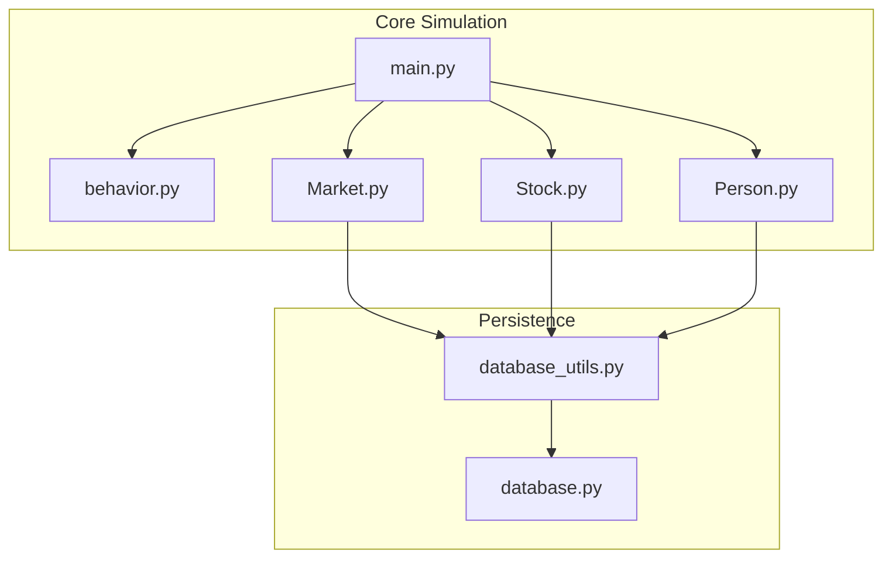
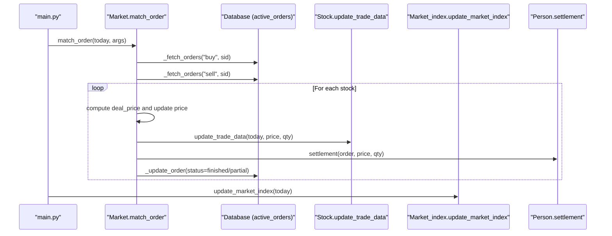
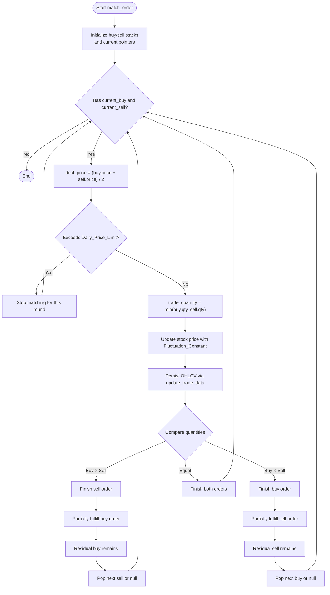
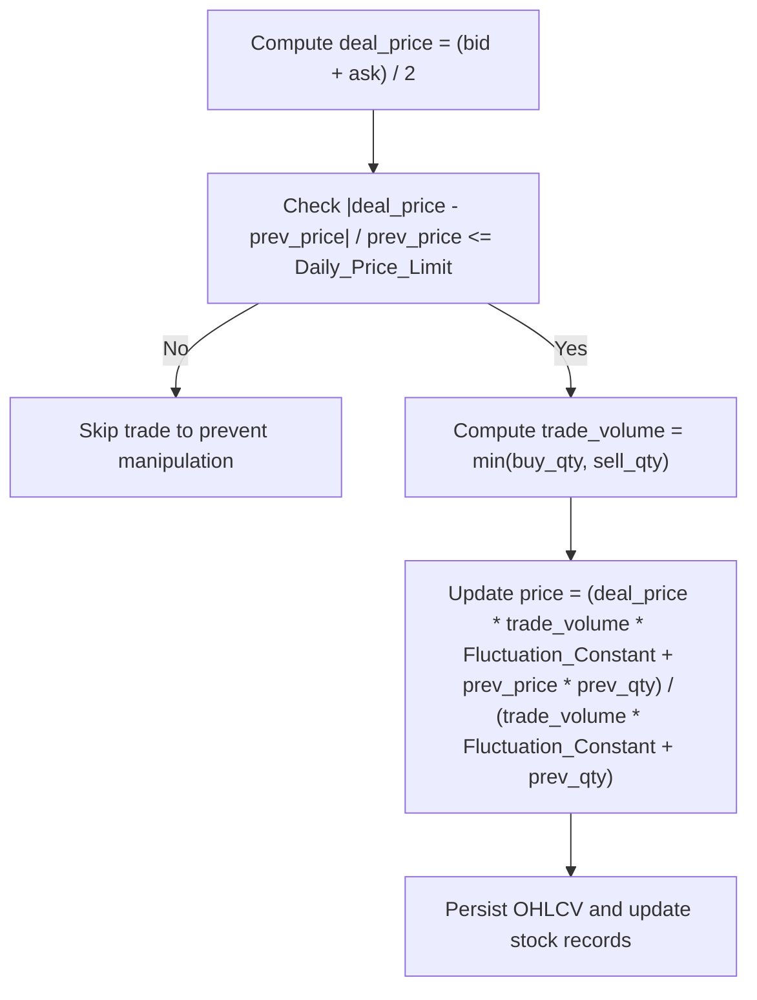
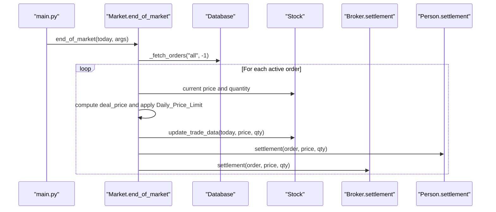
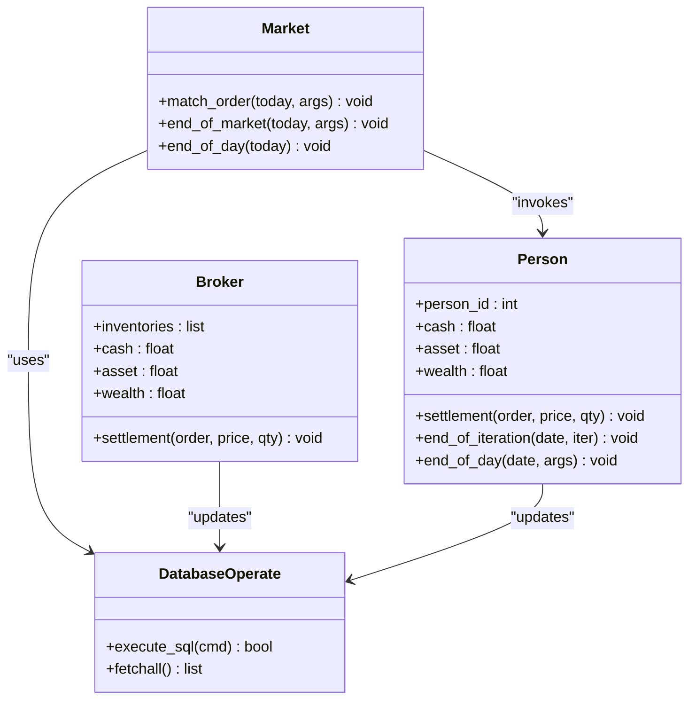
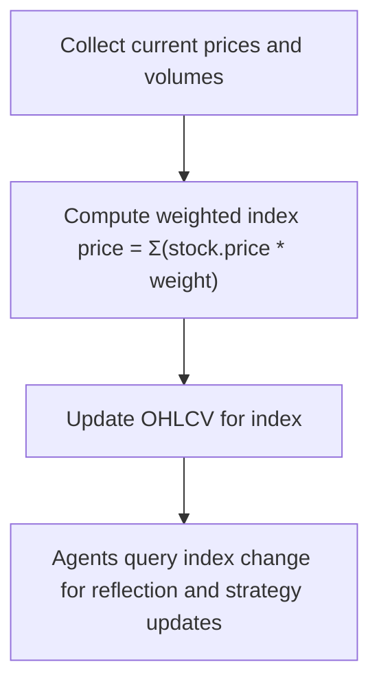
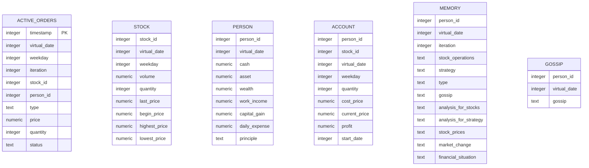
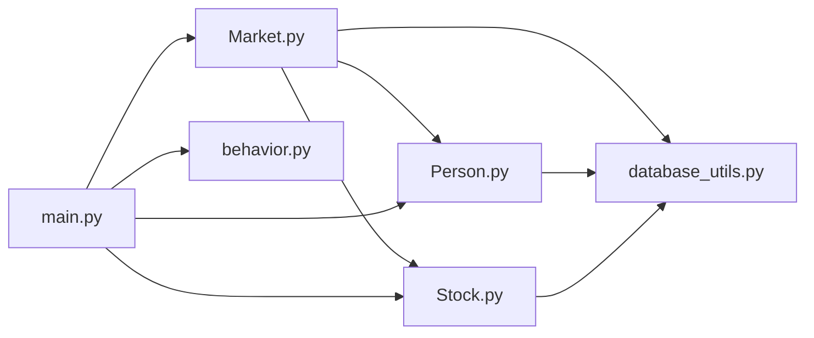

# Market Dynamics

<cite>
**Referenced Files in This Document**
- [Market.py](file://Agent-Trading-Arena/Stock_Main/Market.py)
- [Stock.py](file://Agent-Trading-Arena/Stock_Main/Stock.py)
- [Person.py](file://Agent-Trading-Arena/Stock_Main/Person.py)
- [database_utils.py](file://Agent-Trading-Arena/Stock_Main/database_utils.py)
- [database.py](file://Agent-Trading-Arena/Stock_Main/database.py)
- [main.py](file://Agent-Trading-Arena/Stock_Main/main.py)
- [behavior.py](file://Agent-Trading-Arena/Stock_Main/behavior.py)
- [constant.py](file://Agent-Trading-Arena/Stock_Main/constant.py)
- [load_json.py](file://Agent-Trading-Arena/Stock_Main/load_json.py)
</cite>

## Table of Contents
1. [Introduction](#introduction)
2. [Project Structure](#project-structure)
3. [Core Components](#core-components)
4. [Architecture Overview](#architecture-overview)
5. [Detailed Component Analysis](#detailed-component-analysis)
6. [Dependency Analysis](#dependency-analysis)
7. [Performance Considerations](#performance-considerations)
8. [Troubleshooting Guide](#troubleshooting-guide)
9. [Conclusion](#conclusion)

## Introduction
This document explains the advanced market dynamics implemented in the Agent-Trading-Arena simulation. It focuses on the Market module’s order matching engine, price formation mechanics, daily settlement, and the market index that influences agent decision-making. It also documents inventory management, order status tracking, and database persistence of trading activity. Implementation challenges such as partial order fulfillment, price manipulation prevention, and market stability under extreme conditions are addressed.

## Project Structure
The market simulation is organized around a central Market controller that coordinates order matching, price updates, and settlement. Supporting modules handle stock data, agent behavior, and persistent storage.

**Diagram sources**
- [main.py](file://Agent-Trading-Arena/Stock_Main/main.py#L84-L131)
- [Market.py](file://Agent-Trading-Arena/Stock_Main/Market.py#L12-L278)
- [Stock.py](file://Agent-Trading-Arena/Stock_Main/Stock.py#L14-L307)
- [Person.py](file://Agent-Trading-Arena/Stock_Main/Person.py#L18-L629)
- [database_utils.py](file://Agent-Trading-Arena/Stock_Main/database_utils.py#L245-L322)
- [database.py](file://Agent-Trading-Arena/Agent-Trading-Arena/Stock_Main/database.py#L44-L133)

**Section sources**
- [main.py](file://Agent-Trading-Arena/Stock_Main/main.py#L84-L131)

## Core Components
- Market: Central orchestrator for order matching, price updates, and end-of-day/end-of-market cleanup.
- Stock: Maintains per-stock OHLCV data, intraday history, and computes market index contributions.
- Person/Broker: Agents and the market maker (broker) that execute orders, manage inventories, and settle accounts.
- Database Utilities: Schema creation, SQL execution, parsing, and order/stock/account persistence.
- Behavior: Generates agent actions and market context used to drive order submission.

Key parameters controlling market dynamics:
- Fluctuation_Constant: Weighting factor for recent trades in price updates.
- Daily_Price_Limit: Maximum allowable percent change per trade to prevent wild swings.
- Iterations_Daily, No_Days, Num_Person, Num_Stock: Simulation configuration.

**Section sources**
- [Market.py](file://Agent-Trading-Arena/Stock_Main/Market.py#L12-L278)
- [Stock.py](file://Agent-Trading-Arena/Stock_Main/Stock.py#L14-L307)
- [Person.py](file://Agent-Trading-Arena/Stock_Main/Person.py#L18-L629)
- [database_utils.py](file://Agent-Trading-Arena/Stock_Main/database_utils.py#L245-L322)
- [main.py](file://Agent-Trading-Arena/Stock_Main/main.py#L16-L48)

## Architecture Overview
The simulation runs day-by-day with multiple iterations. Within each iteration:
- Agents submit buy/sell orders via Person.create_order.
- Market.match_order executes price-time priority matching.
- Prices update using a volume-weighted formula with a fluctuation constant.
- Market.index updates the aggregate market indicator.
- At the end of each iteration, Person.end_of_iteration persists positions and PnL.
- At the end of the trading day, Market.end_of_day closes active orders and Person.end_of_day settles agent finances.

**Diagram sources**
- [main.py](file://Agent-Trading-Arena/Stock_Main/main.py#L102-L112)
- [Market.py](file://Agent-Trading-Arena/Stock_Main/Market.py#L96-L199)
- [Stock.py](file://Agent-Trading-Arena/Stock_Main/Stock.py#L67-L112)
- [Person.py](file://Agent-Trading-Arena/Stock_Main/Person.py#L250-L308)

## Detailed Component Analysis

### Order Matching Engine: match_order()
The match_order() algorithm pairs buy and sell orders using a price-time priority system with bid-ask spread considerations.

- Fetching Orders:
  - Buy orders are sorted ascending by price and timestamp.
  - Sell orders are split into two groups:
    - Orders from the broker (person_id = -1) are sorted descending by price.
    - Orders from agents (person_id >= 0) are sorted descending by price.
  - Both groups are then ordered by timestamp ascending.

- Matching Loop:
  - Initialize current_buy and current_sell from the top of respective stacks.
  - Compute deal_price as the midpoint of the best bid and offer.
  - Enforce Daily_Price_Limit: if the absolute percent change exceeds the threshold, stop matching for this round.
  - Determine trade_quantity as the minimum of buyer and seller quantities.
  - Update stock price using a weighted average formula incorporating Fluctuation_Constant and previous quantity.
  - Persist OHLCV via update_trade_data.
  - Update order statuses:
    - If buyer quantity > seller quantity: mark seller finished, buyer partially fulfilled, and keep residual buyer.
    - If buyer quantity < seller quantity: mark buyer finished, seller partially fulfilled, and keep residual seller.
    - If equal: mark both finished.
  - After loop, persist any residual order as “update” with reduced quantity.

- Partial Fulfillment:
  - When an order is partially fulfilled, a new finished record is inserted for the executed portion, and the original order is updated to reflect remaining quantity.

- Bid-Ask Spread Considerations:
  - The algorithm uses the midpoint of the best bid and offer as the deal price, naturally reflecting bid-ask spread effects in price formation.

**Diagram sources**
- [Market.py](file://Agent-Trading-Arena/Stock_Main/Market.py#L96-L199)

**Section sources**
- [Market.py](file://Agent-Trading-Arena/Stock_Main/Market.py#L96-L199)

### Price Update Formula and Bid-Ask Spread
- Price Update:
  - The stock price is updated using a weighted average formula that blends the deal price with the previous price, weighted by trade volume and a fluctuation constant.
  - The formula ensures that recent trades have stronger influence on price, with Fluctuation_Constant controlling responsiveness.
- Daily_Price_Limit:
  - A strict cap prevents a single trade from causing excessive price movement beyond a configured percent threshold, protecting stability.

**Diagram sources**
- [Market.py](file://Agent-Trading-Arena/Stock_Main/Market.py#L112-L131)
- [Stock.py](file://Agent-Trading-Arena/Stock_Main/Stock.py#L67-L112)

**Section sources**
- [Market.py](file://Agent-Trading-Arena/Stock_Main/Market.py#L112-L131)
- [Stock.py](file://Agent-Trading-Arena/Stock_Main/Stock.py#L67-L112)

### Daily Settlement and Market Closure
- end_of_day():
  - Marks all active orders as closed at the end of the trading day, ensuring no lingering orders remain open.
- end_of_market():
  - Executes remaining active orders at the broker level to guarantee market closure.
  - Applies Daily_Price_Limit to avoid trades that would exceed the allowed percent change.
  - Handles partial fulfillment when broker inventories are insufficient.
  - Updates stock price and trade data, then settles both the broker and the original parties.

**Diagram sources**
- [Market.py](file://Agent-Trading-Arena/Stock_Main/Market.py#L30-L95)
- [Person.py](file://Agent-Trading-Arena/Stock_Main/Person.py#L65-L97)

**Section sources**
- [Market.py](file://Agent-Trading-Arena/Stock_Main/Market.py#L30-L95)
- [Person.py](file://Agent-Trading-Arena/Stock_Main/Person.py#L65-L97)

### Inventory Management and Order Status Tracking
- Broker Inventory:
  - The broker starts with initial inventories equal to the stock supply and tracks holdings per stock.
  - Settlement adjusts cash, asset, and inventories for both buy and sell transactions.
- Order Persistence:
  - Orders are stored in active_orders with fields for timestamp, virtual_date, weekday, iteration, stock_id, person_id, type, price, quantity, and status.
  - Status transitions:
    - finished: fully executed.
    - partially fulfilled: executed portion recorded as finished; original order updated with remaining quantity.
    - update: remaining quantity after partial fulfillment.
    - closed: marked at end of day.
- Person Account Records:
  - account table holds per-person holdings, cost price, current price, profit, and start date.
  - end_of_iteration and end_of_day update these records and compute daily gains/losses.

**Diagram sources**
- [Person.py](file://Agent-Trading-Arena/Stock_Main/Person.py#L18-L141)
- [Market.py](file://Agent-Trading-Arena/Stock_Main/Market.py#L12-L278)
- [database_utils.py](file://Agent-Trading-Arena/Stock_Main/database_utils.py#L245-L322)

**Section sources**
- [Person.py](file://Agent-Trading-Arena/Stock_Main/Person.py#L18-L141)
- [Market.py](file://Agent-Trading-Arena/Stock_Main/Market.py#L202-L265)
- [database_utils.py](file://Agent-Trading-Arena/Stock_Main/database_utils.py#L245-L322)

### Market Index Calculation and Agent Decision Influence
- Market_index:
  - Computes the aggregate market index as a weighted sum of constituent stocks’ current prices using book values as weights.
  - Updates OHLCV for the index daily and tracks intraday percentage changes.
- Agent Influence:
  - Agents integrate market index change into their reflections and strategies, affecting future order submissions.
  - Market index data is persisted alongside stock data for downstream analysis.

**Diagram sources**
- [Stock.py](file://Agent-Trading-Arena/Stock_Main/Stock.py#L227-L277)
- [Person.py](file://Agent-Trading-Arena/Stock_Main/Person.py#L525-L528)

**Section sources**
- [Stock.py](file://Agent-Trading-Arena/Stock_Main/Stock.py#L227-L277)
- [Person.py](file://Agent-Trading-Arena/Stock_Main/Person.py#L525-L528)

### Database Schema and Persistence
- Tables:
  - active_orders: live orders with status tracking.
  - stock: OHLCV and daily aggregates for each stock and the market index.
  - person: agent financials and daily summaries.
  - account: per-person holdings and PnL.
  - memory and gossip: behavioral traces for reflection and strategy updates.
- Parsing and Submission:
  - parse_orders, parse_stocks, parse_accounts, parse_persons, parse_gossip convert SQL results to typed dictionaries.
  - submit_order inserts new orders with timestamps and derived weekday.

**Diagram sources**
- [database_utils.py](file://Agent-Trading-Arena/Stock_Main/database_utils.py#L256-L300)
- [database.py](file://Agent-Trading-Arena/Agent-Trading-Arena/Stock_Main/database.py#L55-L61)

**Section sources**
- [database_utils.py](file://Agent-Trading-Arena/Stock_Main/database_utils.py#L256-L300)
- [database.py](file://Agent-Trading-Arena/Agent-Trading-Arena/Stock_Main/database.py#L55-L61)

## Dependency Analysis
- Market depends on:
  - Stock for current price and OHLCV persistence.
  - Person for settlement of executed trades.
  - Database utilities for fetching and updating orders/accounts.
- Person/Broker depend on:
  - Database utilities for account and person persistence.
  - Stock for market index and price queries.
- Behavior integrates:
  - Market index and stock data to inform agent decisions.

**Diagram sources**
- [main.py](file://Agent-Trading-Arena/Stock_Main/main.py#L84-L131)
- [Market.py](file://Agent-Trading-Arena/Stock_Main/Market.py#L12-L278)
- [Stock.py](file://Agent-Trading-Arena/Stock_Main/Stock.py#L14-L307)
- [Person.py](file://Agent-Trading-Arena/Stock_Main/Person.py#L18-L629)
- [database_utils.py](file://Agent-Trading-Arena/Stock_Main/database_utils.py#L245-L322)

**Section sources**
- [main.py](file://Agent-Trading-Arena/Stock_Main/main.py#L84-L131)
- [Market.py](file://Agent-Trading-Arena/Stock_Main/Market.py#L12-L278)

## Performance Considerations
- Matching Complexity:
  - The matching loop processes orders in stacks; worst-case complexity scales with total unmatched orders per stock.
- Price Update Cost:
  - Each trade triggers a price update and OHLCV persistence; batching or caching could reduce overhead.
- Database I/O:
  - Frequent INSERT/UPDATE operations on active_orders, stock, and account tables can be optimized with transaction batching and indexing on frequently queried columns (e.g., stock_id, status, person_id).
- Memory:
  - Storing intraday price lists per stock can grow; consider periodic pruning or moving averages.

## Troubleshooting Guide
- Orders Not Executing:
  - Verify Daily_Price_Limit thresholds and bid-ask spreads; if deal_price exceeds limits, matching stops for that round.
  - Check order status transitions: ensure “finished” vs “partially fulfilled” are handled correctly.
- Price Manipulation Prevention:
  - Confirm Daily_Price_Limit checks occur before price updates and that broker inventory constraints are enforced during end_of_market.
- Partial Fulfillment Issues:
  - Inspect _update_order logic for “partially fulfilled”: a new finished record is inserted and the original order is updated with remaining quantity.
- Inventory Discrepancies:
  - Review Broker.settlement for cash and inventory adjustments on both buy and sell sides.
- Market Index Drift:
  - Ensure Market_index.update_market_index uses correct weights and that OHLCV updates are consistent across stocks.

**Section sources**
- [Market.py](file://Agent-Trading-Arena/Stock_Main/Market.py#L112-L131)
- [Market.py](file://Agent-Trading-Arena/Stock_Main/Market.py#L230-L265)
- [Person.py](file://Agent-Trading-Arena/Stock_Main/Person.py#L65-L97)
- [Stock.py](file://Agent-Trading-Arena/Stock_Main/Stock.py#L227-L277)

## Conclusion
The Market module implements a robust, price-time priority matching system with bid-ask spread awareness and daily price limits to maintain stability. The price update formula, driven by Fluctuation_Constant and trade volume, realistically reflects market dynamics. Persistent order and account records enable detailed post-simulation analysis, while the market index provides macro-level signals influencing agent behavior. The broker ensures market closure by fulfilling remaining orders under constraints, and inventory management keeps the system balanced across agents and the marketplace.