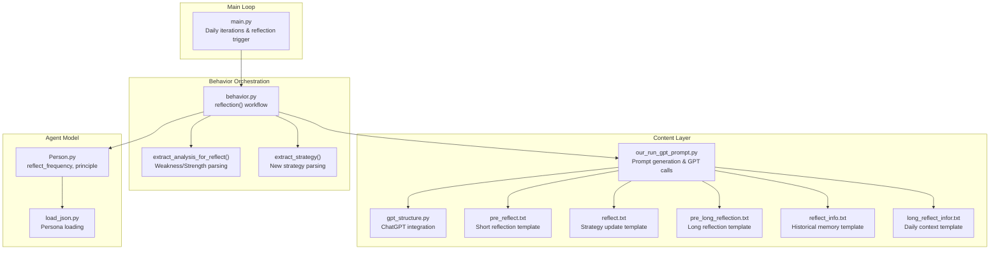
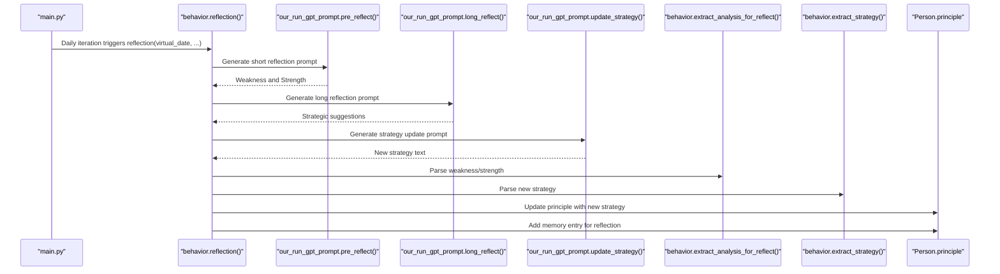
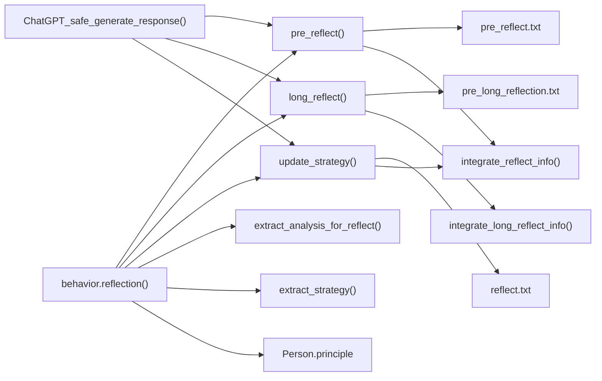

# Reflection Mechanism

<cite>
**Referenced Files in This Document**
- [our_run_gpt_prompt.py](file://Agent-Trading-Arena/Stock_Main/content/our_run_gpt_prompt.py)
- [behavior.py](file://Agent-Trading-Arena/Stock_Main/behavior.py)
- [gpt_structure.py](file://Agent-Trading-Arena/Stock_Main/content/gpt_structure.py)
- [utils.py](file://Agent-Trading-Arena/Stock_Main/content/utils.py)
- [pre_reflect.txt](file://Agent-Trading-Arena/Stock_Main/content/our_prompt_template/pre_reflect.txt)
- [reflect.txt](file://Agent-Trading-Arena/Stock_Main/content/our_prompt_template/reflect.txt)
- [pre_long_reflection.txt](file://Agent-Trading-Arena/Stock_Main/content/our_prompt_template/pre_long_reflection.txt)
- [reflect_info.txt](file://Agent-Trading-Arena/Stock_Main/content/our_prompt_template/reflect_info.txt)
- [long_reflect_infor.txt](file://Agent-Trading-Arena/Stock_Main/content/our_prompt_template/long_reflect_infor.txt)
- [main.py](file://Agent-Trading-Arena/Stock_Main/main.py)
- [Person.py](file://Agent-Trading-Arena/Stock_Main/Person.py)
- [load_json.py](file://Agent-Trading-Arena/Stock_Main/load_json.py)
</cite>

## Table of Contents
1. [Introduction](#introduction)
2. [Project Structure](#project-structure)
3. [Core Components](#core-components)
4. [Architecture Overview](#architecture-overview)
5. [Detailed Component Analysis](#detailed-component-analysis)
6. [Dependency Analysis](#dependency-analysis)
7. [Performance Considerations](#performance-considerations)
8. [Troubleshooting Guide](#troubleshooting-guide)
9. [Conclusion](#conclusion)

## Introduction
This document explains the reflection mechanism in the Agent-Trading-Arena simulation. It covers how agents perform both short-term and long-term reflection to analyze trading performance and update investment strategies. The implementation centers around two key functions—pre_reflect() and long_reflect()—which generate analysis prompts using historical memory data from the last three days. The behavior.py module orchestrates the reflection workflow through the reflection() function, which triggers strategy updates at configured frequencies. We also document how weakness/strength analysis is extracted via extract_analysis_for_reflect() and how new strategies are parsed using extract_strategy(), along with the prompt engineering approach, validation logic, and the role of reflection in agent evolution.

## Project Structure
The reflection mechanism spans several modules:
- Content layer: prompt templates and GPT integration
- Behavior orchestration: reflection scheduling and strategy updates
- Agent model: Person class with reflect_frequency configuration
- Main loop: daily iterations and reflection triggers

**Diagram sources**
- [our_run_gpt_prompt.py](file://Agent-Trading-Arena/Stock_Main/content/our_run_gpt_prompt.py#L1-L628)
- [behavior.py](file://Agent-Trading-Arena/Stock_Main/behavior.py#L1-L210)
- [gpt_structure.py](file://Agent-Trading-Arena/Stock_Main/content/gpt_structure.py#L1-L380)
- [pre_reflect.txt](file://Agent-Trading-Arena/Stock_Main/content/our_prompt_template/pre_reflect.txt#L1-L22)
- [reflect.txt](file://Agent-Trading-Arena/Stock_Main/content/our_prompt_template/reflect.txt#L1-L35)
- [pre_long_reflection.txt](file://Agent-Trading-Arena/Stock_Main/content/our_prompt_template/pre_long_reflection.txt#L1-L21)
- [reflect_info.txt](file://Agent-Trading-Arena/Stock_Main/content/our_prompt_template/reflect_info.txt#L1-L30)
- [long_reflect_infor.txt](file://Agent-Trading-Arena/Stock_Main/content/our_prompt_template/long_reflect_infor.txt#L1-L25)
- [main.py](file://Agent-Trading-Arena/Stock_Main/main.py#L1-L136)
- [Person.py](file://Agent-Trading-Arena/Stock_Main/Person.py#L143-L200)
- [load_json.py](file://Agent-Trading-Arena/Stock_Main/load_json.py#L9-L23)

**Section sources**
- [main.py](file://Agent-Trading-Arena/Stock_Main/main.py#L84-L136)
- [behavior.py](file://Agent-Trading-Arena/Stock_Main/behavior.py#L174-L199)

## Core Components
- Short-term reflection (pre_reflect): Evaluates weaknesses and strengths of the current investment strategy using recent iterations.
- Long-term reflection (long_reflect): Provides strategic suggestions based on multi-day trading activity and financial context.
- Strategy update (update_strategy): Generates a new macro investment strategy using the analysis and suggestions.
- Extraction utilities: extract_analysis_for_reflect() parses weakness/strength; extract_strategy() extracts the new strategy text.
- Reflection orchestration: reflection() schedules and executes reflection at configured frequencies.

**Section sources**
- [our_run_gpt_prompt.py](file://Agent-Trading-Arena/Stock_Main/content/our_run_gpt_prompt.py#L305-L361)
- [our_run_gpt_prompt.py](file://Agent-Trading-Arena/Stock_Main/content/our_run_gpt_prompt.py#L251-L303)
- [our_run_gpt_prompt.py](file://Agent-Trading-Arena/Stock_Main/content/our_run_gpt_prompt.py#L151-L212)
- [behavior.py](file://Agent-Trading-Arena/Stock_Main/behavior.py#L58-L80)
- [behavior.py](file://Agent-Trading-Arena/Stock_Main/behavior.py#L174-L199)

## Architecture Overview
The reflection workflow integrates prompt templates, GPT-safe generation, and agent memory to evolve investment strategies.

**Diagram sources**
- [main.py](file://Agent-Trading-Arena/Stock_Main/main.py#L118-L118)
- [behavior.py](file://Agent-Trading-Arena/Stock_Main/behavior.py#L174-L199)
- [our_run_gpt_prompt.py](file://Agent-Trading-Arena/Stock_Main/content/our_run_gpt_prompt.py#L305-L361)
- [our_run_gpt_prompt.py](file://Agent-Trading-Arena/Stock_Main/content/our_run_gpt_prompt.py#L251-L303)
- [our_run_gpt_prompt.py](file://Agent-Trading-Arena/Stock_Main/content/our_run_gpt_prompt.py#L151-L212)
- [behavior.py](file://Agent-Trading-Arena/Stock_Main/behavior.py#L58-L80)

## Detailed Component Analysis

### Short-Term Reflection: pre_reflect()
- Purpose: Evaluate the current investment strategy’s weaknesses and strengths using recent iterations.
- Data source: Historical memory from the last three days via integrate_reflect_info().
- Template: pre_reflect.txt instructs the agent to base evaluation on stock operations, financial situation, market index, stock availability, holdings, and current strategy.
- Validation: Uses a regex pattern to ensure both “Weakness” and “Strength” sections are present.
- Output: A structured string containing weakness and strength analysis.

Key implementation details:
- Memory integration: iterate backwards up to three days and collect memory entries.
- Prompt construction: generate_prompt() replaces placeholders with values from memory entries.
- Safety wrapper: ChatGPT_safe_generate_response() validates output format and retries on failure.

**Section sources**
- [our_run_gpt_prompt.py](file://Agent-Trading-Arena/Stock_Main/content/our_run_gpt_prompt.py#L114-L148)
- [our_run_gpt_prompt.py](file://Agent-Trading-Arena/Stock_Main/content/our_run_gpt_prompt.py#L305-L361)
- [pre_reflect.txt](file://Agent-Trading-Arena/Stock_Main/content/our_prompt_template/pre_reflect.txt#L1-L22)
- [reflect_info.txt](file://Agent-Trading-Arena/Stock_Main/content/our_prompt_template/reflect_info.txt#L1-L30)

### Long-Term Reflection: long_reflect()
- Purpose: Provide strategic suggestions for the investment approach based on multi-day performance and financial context.
- Data source: Daily-level facts collected via integrate_long_reflect_info(), focusing on the last three days’ iterations.
- Template: pre_long_reflection.txt instructs the agent to consider cash, wealth, market index, available stocks, holdings, and current strategy.
- Validation: Basic validation wrapper ensures a non-empty response.
- Output: Strategic suggestions for future trading behavior.

Key implementation details:
- Daily integration: collects memory entries where iteration equals a specific value (e.g., the last iteration of each day).
- Prompt construction: generate_prompt() injects daily financial and market context.
- Safety wrapper: ChatGPT_safe_generate_response() manages retries and validation.

**Section sources**
- [our_run_gpt_prompt.py](file://Agent-Trading-Arena/Stock_Main/content/our_run_gpt_prompt.py#L213-L249)
- [our_run_gpt_prompt.py](file://Agent-Trading-Arena/Stock_Main/content/our_run_gpt_prompt.py#L251-L303)
- [pre_long_reflection.txt](file://Agent-Trading-Arena/Stock_Main/content/our_prompt_template/pre_long_reflection.txt#L1-L21)
- [long_reflect_infor.txt](file://Agent-Trading-Arena/Stock_Main/content/our_prompt_template/long_reflect_infor.txt#L1-L25)

### Strategy Update: update_strategy()
- Purpose: Generate a new macro investment strategy by combining short-term analysis and long-term suggestions.
- Inputs: reflect_info (recent history), weakness/strength, and suggestions.
- Template: reflect.txt guides the agent to improve the current strategy without focusing on specific stocks.
- Validation: Ensures the output contains a “New investment strategy” section.
- Output: A concise, actionable strategy statement.

Key implementation details:
- Prompt composition: integrate_reflect_info() supplies recent context; weakness/strength and suggestions are passed as separate inputs.
- Safety wrapper: ChatGPT_safe_generate_response() enforces format validation and cleans up output.

**Section sources**
- [our_run_gpt_prompt.py](file://Agent-Trading-Arena/Stock_Main/content/our_run_gpt_prompt.py#L151-L212)
- [reflect.txt](file://Agent-Trading-Arena/Stock_Main/content/our_prompt_template/reflect.txt#L1-L35)

### Extraction Utilities
- extract_analysis_for_reflect(): Parses the short-term reflection output to extract weakness and strength.
- extract_strategy(): Extracts the new strategy text from the strategy update response.

Validation logic:
- Regex-based extraction with capture groups to ensure completeness.
- Returns False on parsing errors, enabling fallback behavior.

**Section sources**
- [behavior.py](file://Agent-Trading-Arena/Stock_Main/behavior.py#L58-L80)

### Reflection Orchestration: behavior.reflection()
- Frequency control: Uses Person.reflect_frequency to determine when to run reflection.
- Trigger condition: (iter + 1) % p.reflect_frequency == 0 ensures periodic execution.
- Workflow:
  - pre_reflect() → extract_analysis_for_reflect() → long_reflect() → update_strategy() → extract_strategy() → Person.principle update.
  - Adds a memory entry for the reflection event.

**Section sources**
- [behavior.py](file://Agent-Trading-Arena/Stock_Main/behavior.py#L174-L199)
- [Person.py](file://Agent-Trading-Arena/Stock_Main/Person.py#L169-L182)

### Prompt Engineering Approach
Template structure:
- Variables section defines placeholders for inputs.
- Instructions define the role and objective.
- Task specifies the required output format and constraints.
- Comment block marker separates template metadata from content.

Input integration:
- Memory-driven: integrate_reflect_info() and integrate_long_reflect_info() assemble historical context.
- Financial context: integrate_hold_info() and integrate_stock_info() enrich prompts with holdings and market data.
- Gossip integration: integrate_gossip() and integrate_gossip_info() incorporate social information.

Validation logic:
- Regex-based validators ensure required sections are present.
- ChatGPT_safe_generate_response() retries on validation failures and returns a fail-safe response when exhausted.

**Section sources**
- [gpt_structure.py](file://Agent-Trading-Arena/Stock_Main/content/gpt_structure.py#L291-L316)
- [gpt_structure.py](file://Agent-Trading-Arena/Stock_Main/content/gpt_structure.py#L167-L224)
- [our_run_gpt_prompt.py](file://Agent-Trading-Arena/Stock_Main/content/our_run_gpt_prompt.py#L9-L19)
- [our_run_gpt_prompt.py](file://Agent-Trading-Arena/Stock_Main/content/our_run_gpt_prompt.py#L22-L51)
- [our_run_gpt_prompt.py](file://Agent-Trading-Arena/Stock_Main/content/our_run_gpt_prompt.py#L54-L78)
- [our_run_gpt_prompt.py](file://Agent-Trading-Arena/Stock_Main/content/our_run_gpt_prompt.py#L81-L111)

### Role in Agent Evolution and Adaptive Behavior
- Periodic adaptation: Reflection allows agents to evolve strategies based on recent performance and external conditions.
- Macro-level guidance: New strategies are expressed as general principles rather than specific stock picks, promoting adaptability.
- Memory retention: Reflection results are stored in memory, enabling cumulative learning across iterations.

**Section sources**
- [behavior.py](file://Agent-Trading-Arena/Stock_Main/behavior.py#L174-L199)
- [reflect.txt](file://Agent-Trading-Arena/Stock_Main/content/our_prompt_template/reflect.txt#L28-L35)

### Implementation Challenges and Mitigation Strategies
- Managing memory context windows:
  - Short-term: integrate_reflect_info() limits to the last three days and iterates backward.
  - Long-term: integrate_long_reflect_info() focuses on specific iterations (e.g., the last iteration of each day).
- Ensuring strategy coherence:
  - extract_strategy() isolates the new strategy text; Person.principle is updated atomically.
  - Templates enforce macro-level guidance to avoid overly specific advice.
- Avoiding overfitting to recent performance:
  - Long-term reflection considers broader financial context (cash, wealth) and market trends.
  - Validation ensures structured outputs, reducing noise from ambiguous GPT responses.

**Section sources**
- [our_run_gpt_prompt.py](file://Agent-Trading-Arena/Stock_Main/content/our_run_gpt_prompt.py#L114-L148)
- [our_run_gpt_prompt.py](file://Agent-Trading-Arena/Stock_Main/content/our_run_gpt_prompt.py#L213-L249)
- [reflect.txt](file://Agent-Trading-Arena/Stock_Main/content/our_prompt_template/reflect.txt#L28-L35)

## Dependency Analysis
The reflection mechanism depends on:
- Prompt templates for structure and instruction
- GPT integration for response generation and validation
- Person model for strategy storage and reflection scheduling
- Memory integration for historical context

**Diagram sources**
- [our_run_gpt_prompt.py](file://Agent-Trading-Arena/Stock_Main/content/our_run_gpt_prompt.py#L114-L148)
- [our_run_gpt_prompt.py](file://Agent-Trading-Arena/Stock_Main/content/our_run_gpt_prompt.py#L213-L249)
- [our_run_gpt_prompt.py](file://Agent-Trading-Arena/Stock_Main/content/our_run_gpt_prompt.py#L305-L361)
- [our_run_gpt_prompt.py](file://Agent-Trading-Arena/Stock_Main/content/our_run_gpt_prompt.py#L251-L303)
- [our_run_gpt_prompt.py](file://Agent-Trading-Arena/Stock_Main/content/our_run_gpt_prompt.py#L151-L212)
- [behavior.py](file://Agent-Trading-Arena/Stock_Main/behavior.py#L174-L199)
- [gpt_structure.py](file://Agent-Trading-Arena/Stock_Main/content/gpt_structure.py#L167-L224)

**Section sources**
- [behavior.py](file://Agent-Trading-Arena/Stock_Main/behavior.py#L1-L12)
- [Person.py](file://Agent-Trading-Arena/Stock_Main/Person.py#L169-L182)

## Performance Considerations
- Prompt size and validation: Using regex validators prevents excessive retries and reduces API costs.
- Frequency tuning: Person.reflect_frequency controls how often reflection runs, balancing adaptation speed with computational overhead.
- Memory window: Limiting to three days keeps prompts concise and focused.

[No sources needed since this section provides general guidance]

## Troubleshooting Guide
Common issues and resolutions:
- Reflection not triggering:
  - Verify Person.reflect_frequency is set and (iter + 1) % p.reflect_frequency == 0.
- Validation failures:
  - Check regex patterns in pre_reflect() and update_strategy() for malformed outputs.
  - Review ChatGPT_safe_generate_response() retry logic and fail-safe behavior.
- Missing memory context:
  - Ensure persona.query_memory() returns entries for the target dates and iterations.

**Section sources**
- [behavior.py](file://Agent-Trading-Arena/Stock_Main/behavior.py#L177-L179)
- [our_run_gpt_prompt.py](file://Agent-Trading-Arena/Stock_Main/content/our_run_gpt_prompt.py#L319-L327)
- [our_run_gpt_prompt.py](file://Agent-Trading-Arena/Stock_Main/content/our_run_gpt_prompt.py#L168-L176)
- [Person.py](file://Agent-Trading-Arena/Stock_Main/Person.py#L169-L182)

## Conclusion
The reflection mechanism enables agents to continuously adapt their investment strategies by evaluating recent performance (short-term) and synthesizing multi-day insights (long-term). Through structured prompts, robust validation, and careful memory integration, agents evolve toward more effective, macro-level strategies. The modular design in behavior.py and content layers facilitates maintainability and extensibility, while safety wrappers protect against invalid outputs and reduce API usage risks.