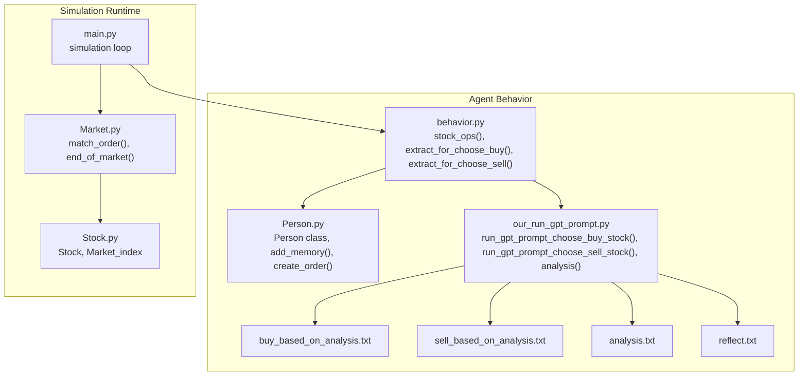
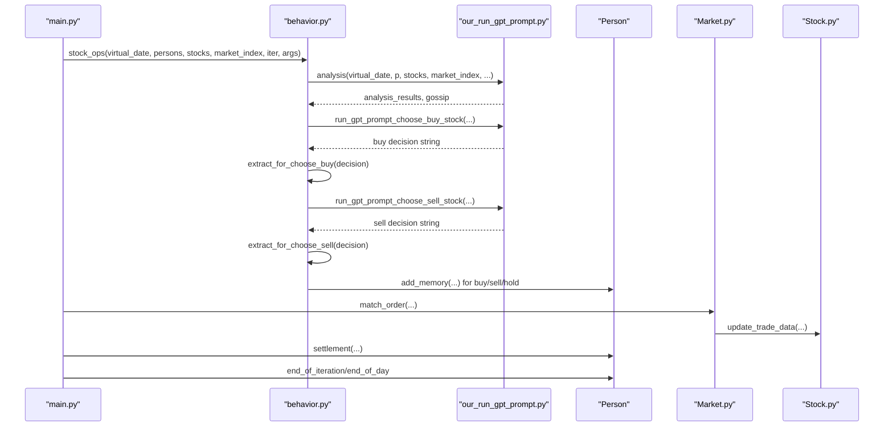
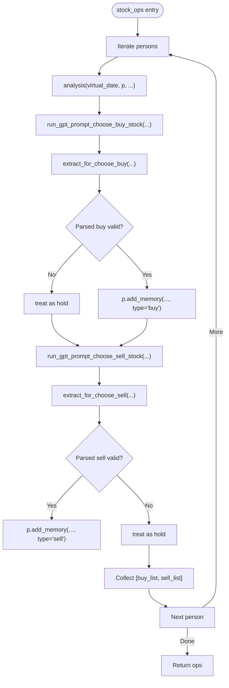
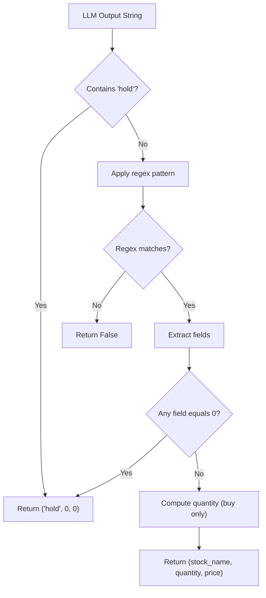
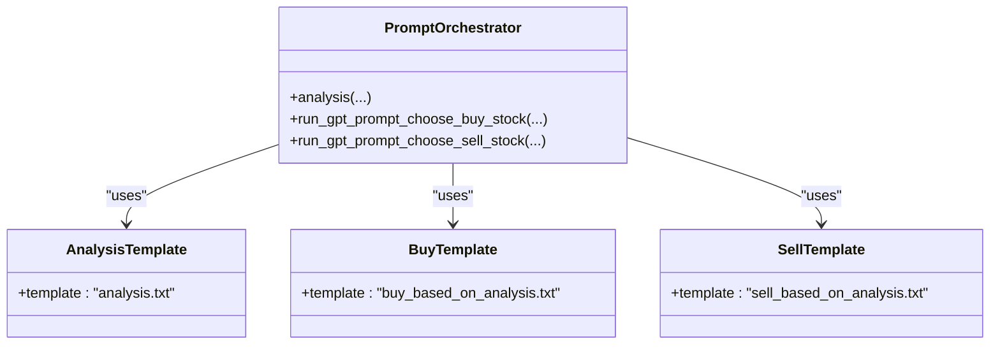
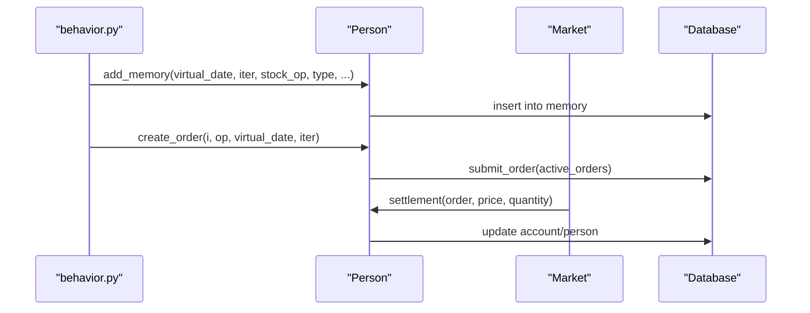
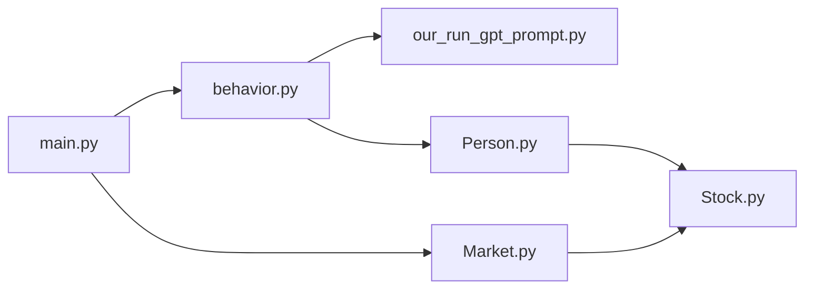

# Agent Behavior

<cite>
**Referenced Files in This Document**
- [behavior.py](file://Agent-Trading-Arena/Stock_Main/behavior.py)
- [Person.py](file://Agent-Trading-Arena/Stock_Main/Person.py)
- [our_run_gpt_prompt.py](file://Agent-Trading-Arena/Stock_Main/content/our_run_gpt_prompt.py)
- [buy_based_on_analysis.txt](file://Agent-Trading-Arena/Stock_Main/content/our_prompt_template/buy_based_on_analysis.txt)
- [sell_based_on_analysis.txt](file://Agent-Trading-Arena/Stock_Main/content/our_prompt_template/sell_based_on_analysis.txt)
- [analysis.txt](file://Agent-Trading-Arena/Stock_Main/content/our_prompt_template/analysis.txt)
- [reflect.txt](file://Agent-Trading-Arena/Stock_Main/content/our_prompt_template/reflect.txt)
- [main.py](file://Agent-Trading-Arena/Stock_Main/main.py)
- [Market.py](file://Agent-Trading-Arena/Stock_Main/Market.py)
- [Stock.py](file://Agent-Trading-Arena/Stock_Main/Stock.py)
</cite>

## Table of Contents
1. [Introduction](#introduction)
2. [Project Structure](#project-structure)
3. [Core Components](#core-components)
4. [Architecture Overview](#architecture-overview)
5. [Detailed Component Analysis](#detailed-component-analysis)
6. [Dependency Analysis](#dependency-analysis)
7. [Performance Considerations](#performance-considerations)
8. [Troubleshooting Guide](#troubleshooting-guide)
9. [Conclusion](#conclusion)

## Introduction
This document explains the Agent Behavior sub-component responsible for orchestrating trading decisions across multiple agents. It focuses on how the stock_ops function in behavior.py coordinates market analysis, generates buy/sell decisions via LLM prompts, parses structured outputs with regex, validates parsed results, and records decisions in agent memory. It also documents how Person objects encapsulate agent state and behavior, including memory logging via add_memory, and how prompt templates guide decision-making.

## Project Structure
The Agent Behavior module is centered around behavior.py, which integrates with Person agents, prompt orchestration utilities, and the simulation loop in main.py. Prompt templates define the structure of LLM requests for analysis, buying, and selling decisions.

**Diagram sources**
- [behavior.py](file://Agent-Trading-Arena/Stock_Main/behavior.py#L82-L171)
- [Person.py](file://Agent-Trading-Arena/Stock_Main/Person.py#L514-L545)
- [our_run_gpt_prompt.py](file://Agent-Trading-Arena/Stock_Main/content/our_run_gpt_prompt.py#L486-L618)
- [buy_based_on_analysis.txt](file://Agent-Trading-Arena/Stock_Main/content/our_prompt_template/buy_based_on_analysis.txt#L1-L33)
- [sell_based_on_analysis.txt](file://Agent-Trading-Arena/Stock_Main/content/our_prompt_template/sell_based_on_analysis.txt#L1-L31)
- [analysis.txt](file://Agent-Trading-Arena/Stock_Main/content/our_prompt_template/analysis.txt#L1-L37)
- [reflect.txt](file://Agent-Trading-Arena/Stock_Main/content/our_prompt_template/reflect.txt#L1-L35)
- [main.py](file://Agent-Trading-Arena/Stock_Main/main.py#L84-L131)
- [Market.py](file://Agent-Trading-Arena/Stock_Main/Market.py#L96-L265)
- [Stock.py](file://Agent-Trading-Arena/Stock_Main/Stock.py#L14-L307)

**Section sources**
- [main.py](file://Agent-Trading-Arena/Stock_Main/main.py#L84-L131)
- [behavior.py](file://Agent-Trading-Arena/Stock_Main/behavior.py#L82-L171)
- [Person.py](file://Agent-Trading-Arena/Stock_Main/Person.py#L514-L545)
- [our_run_gpt_prompt.py](file://Agent-Trading-Arena/Stock_Main/content/our_run_gpt_prompt.py#L486-L618)

## Core Components
- stock_ops orchestrates daily trading decisions for all agents:
  - Calls analysis to gather market insights and gossip
  - Generates buy and sell decisions via LLM prompts
  - Parses and validates LLM outputs with regex
  - Records decisions in agent memory via add_memory
- Person encapsulates agent state and behavior:
  - add_memory persists decisions, strategy, market context, and holdings
  - create_order translates parsed decisions into executable orders
- Prompt orchestration:
  - Templates define expected output formats for buy/sell decisions
  - Validation ensures outputs match required structure before proceeding

Key responsibilities:
- Market analysis integration
- Decision extraction and validation
- Memory logging for auditability and reflection
- Order creation and settlement

**Section sources**
- [behavior.py](file://Agent-Trading-Arena/Stock_Main/behavior.py#L82-L171)
- [Person.py](file://Agent-Trading-Arena/Stock_Main/Person.py#L514-L545)
- [our_run_gpt_prompt.py](file://Agent-Trading-Arena/Stock_Main/content/our_run_gpt_prompt.py#L486-L618)

## Architecture Overview
The Agent Behavior pipeline connects agents, prompts, and memory to produce actionable trades. The simulation loop drives daily iterations, where stock_ops produces buy/sell lists for each agent, orders are submitted, matched, and settled, and agents update their financial positions.

**Diagram sources**
- [main.py](file://Agent-Trading-Arena/Stock_Main/main.py#L102-L119)
- [behavior.py](file://Agent-Trading-Arena/Stock_Main/behavior.py#L82-L171)
- [our_run_gpt_prompt.py](file://Agent-Trading-Arena/Stock_Main/content/our_run_gpt_prompt.py#L414-L484)
- [Market.py](file://Agent-Trading-Arena/Stock_Main/Market.py#L96-L265)
- [Stock.py](file://Agent-Trading-Arena/Stock_Main/Stock.py#L67-L112)

## Detailed Component Analysis

### stock_ops: Decision Orchestration
- Iterates over agents and builds a list of buy/sell operations
- Calls analysis to produce structured insights and gossip
- Uses run_gpt_prompt_choose_buy_stock and run_gpt_prompt_choose_sell_stock to generate decisions
- Applies extract_for_choose_buy and extract_for_choose_sell to parse and validate outputs
- Logs decisions via Person.add_memory for each operation type

**Diagram sources**
- [behavior.py](file://Agent-Trading-Arena/Stock_Main/behavior.py#L82-L171)

**Section sources**
- [behavior.py](file://Agent-Trading-Arena/Stock_Main/behavior.py#L82-L171)

### Regex-Based Parsing of LLM Outputs
- extract_for_choose_buy validates buy decisions with a strict regex pattern that enforces:
  - Operation label
  - Stock name (single uppercase letter)
  - Investment amount (dollars)
  - Best buying price (dollars)
  - Guards against zero values and returns hold when invalid
  - Computes quantity using math.ceil(volume / price) to ensure integer share counts
- extract_for_choose_sell validates sell decisions with a strict regex pattern that enforces:
  - Operation label
  - Stock name (single uppercase letter)
  - Number of shares (integer)
  - Best selling price (dollars)
  - Guards against zero values and returns hold when invalid

**Diagram sources**
- [behavior.py](file://Agent-Trading-Arena/Stock_Main/behavior.py#L15-L56)

Concrete examples from the code:
- Buy parsing pattern enforcement and quantity calculation via math.ceil
  - See [behavior.py](file://Agent-Trading-Arena/Stock_Main/behavior.py#L20-L34)
- Sell parsing pattern enforcement
  - See [behavior.py](file://Agent-Trading-Arena/Stock_Main/behavior.py#L42-L55)

**Section sources**
- [behavior.py](file://Agent-Trading-Arena/Stock_Main/behavior.py#L15-L56)

### Prompt Templates and Decision-Making Integration
- analysis template constructs a prompt integrating stock info, market index, gossip, holdings, and strategy, returning a list of analysis items
- buy_based_on_analysis and sell_based_on_analysis templates guide LLMs to produce structured buy/sell decisions
- run_gpt_prompt_choose_buy_stock/run_gpt_prompt_choose_sell_stock wrap prompt generation, validation, and cleanup
- Validation functions ensure outputs conform to expected formats before parsing

**Diagram sources**
- [our_run_gpt_prompt.py](file://Agent-Trading-Arena/Stock_Main/content/our_run_gpt_prompt.py#L414-L484)
- [our_run_gpt_prompt.py](file://Agent-Trading-Arena/Stock_Main/content/our_run_gpt_prompt.py#L486-L618)
- [analysis.txt](file://Agent-Trading-Arena/Stock_Main/content/our_prompt_template/analysis.txt#L1-L37)
- [buy_based_on_analysis.txt](file://Agent-Trading-Arena/Stock_Main/content/our_prompt_template/buy_based_on_analysis.txt#L1-L33)
- [sell_based_on_analysis.txt](file://Agent-Trading-Arena/Stock_Main/content/our_prompt_template/sell_based_on_analysis.txt#L1-L31)

**Section sources**
- [our_run_gpt_prompt.py](file://Agent-Trading-Arena/Stock_Main/content/our_run_gpt_prompt.py#L414-L484)
- [our_run_gpt_prompt.py](file://Agent-Trading-Arena/Stock_Main/content/our_run_gpt_prompt.py#L486-L618)
- [analysis.txt](file://Agent-Trading-Arena/Stock_Main/content/our_prompt_template/analysis.txt#L1-L37)
- [buy_based_on_analysis.txt](file://Agent-Trading-Arena/Stock_Main/content/our_prompt_template/buy_based_on_analysis.txt#L1-L33)
- [sell_based_on_analysis.txt](file://Agent-Trading-Arena/Stock_Main/content/our_prompt_template/sell_based_on_analysis.txt#L1-L31)

### Person Objects and Memory Logging
- Person.add_memory persists decisions and contextual information:
  - stock_op: textual summary of the operation
  - type: "buy", "sell", "hold", or "reflect"
  - gossip, analysis_stocks, analysis_strategy, market_index, stocks_list
- Person.create_order converts parsed operations into executable orders and submits them to the market
- Person.settlement updates agent accounts after trades settle

**Diagram sources**
- [behavior.py](file://Agent-Trading-Arena/Stock_Main/behavior.py#L127-L167)
- [Person.py](file://Agent-Trading-Arena/Stock_Main/Person.py#L514-L545)
- [Person.py](file://Agent-Trading-Arena/Stock_Main/Person.py#L212-L248)
- [Person.py](file://Agent-Trading-Arena/Stock_Main/Person.py#L250-L308)

**Section sources**
- [Person.py](file://Agent-Trading-Arena/Stock_Main/Person.py#L514-L545)
- [Person.py](file://Agent-Trading-Arena/Stock_Main/Person.py#L212-L248)
- [Person.py](file://Agent-Trading-Arena/Stock_Main/Person.py#L250-L308)

### Relationship Between Person and Behavior Functions
- stock_ops iterates Person instances and calls analysis and decision functions
- Person.add_memory logs decisions produced by stock_ops
- Person.create_order executes parsed decisions and interacts with Market and Stock

**Section sources**
- [behavior.py](file://Agent-Trading-Arena/Stock_Main/behavior.py#L82-L171)
- [Person.py](file://Agent-Trading-Arena/Stock_Main/Person.py#L514-L545)

## Dependency Analysis
- behavior.py depends on:
  - content.our_run_gpt_prompt for analysis and decision prompts
  - Person.add_memory for logging
- Person depends on:
  - database_utils for persistence
  - Stock and Market_index for price and inventory data
- main.py orchestrates:
  - calling stock_ops and reflection
  - driving Market.match_order and Market.end_of_market
  - updating Person state

**Diagram sources**
- [behavior.py](file://Agent-Trading-Arena/Stock_Main/behavior.py#L1-L12)
- [main.py](file://Agent-Trading-Arena/Stock_Main/main.py#L12-L12)
- [Market.py](file://Agent-Trading-Arena/Stock_Main/Market.py#L12-L20)
- [Stock.py](file://Agent-Trading-Arena/Stock_Main/Stock.py#L14-L30)

**Section sources**
- [behavior.py](file://Agent-Trading-Arena/Stock_Main/behavior.py#L1-L12)
- [main.py](file://Agent-Trading-Arena/Stock_Main/main.py#L12-L12)
- [Market.py](file://Agent-Trading-Arena/Stock_Main/Market.py#L12-L20)
- [Stock.py](file://Agent-Trading-Arena/Stock_Main/Stock.py#L14-L30)

## Performance Considerations
- Iterative processing of multiple agents:
  - stock_ops loops over all persons and performs LLM calls per agent per iteration
  - Each LLM call involves prompt construction, validation, and cleanup
- Optimization opportunities:
  - Batch or parallelize LLM calls where safe and supported by the underlying provider
  - Cache repeated prompt integrations (stock info, gossip, holdings) to reduce redundant computations
  - Validate regex early and short-circuit invalid outputs to avoid unnecessary downstream processing
  - Consider rate limiting and backoff strategies for LLM providers to prevent throttling
  - Minimize database writes by batching memory inserts during a single iteration
- Quantity calculation:
  - Using math.ceil ensures integer share counts and avoids partial share errors
  - This reduces downstream validation overhead and prevents invalid order submissions

[No sources needed since this section provides general guidance]

## Troubleshooting Guide
Common issues and resolutions:
- Invalid LLM output parsing:
  - Symptom: extract_for_choose_buy/extract_for_choose_sell returns False or hold
  - Causes: Output does not match expected regex, contains zero values, or is missing required fields
  - Resolution: Review prompt templates and validation logic; ensure inputs (cash, holdings) meet thresholds; confirm regex patterns align with model output format
  - References:
    - [behavior.py](file://Agent-Trading-Arena/Stock_Main/behavior.py#L15-L56)
    - [our_run_gpt_prompt.py](file://Agent-Trading-Arena/Stock_Main/content/our_run_gpt_prompt.py#L505-L517)
    - [our_run_gpt_prompt.py](file://Agent-Trading-Arena/Stock_Main/content/our_run_gpt_prompt.py#L571-L583)
- Edge cases in quantity calculation:
  - Symptom: Unexpected fractional shares or zero quantity
  - Cause: Division of investment amount by price yields non-integer
  - Resolution: Use math.ceil to round up to nearest integer share
  - References:
    - [behavior.py](file://Agent-Trading-Arena/Stock_Main/behavior.py#L31-L31)
- Orders not executed:
  - Symptom: No trades occur despite valid buy/sell decisions
  - Causes: Price mismatch, insufficient cash or shares, or price change exceeding daily limit
  - Resolution: Verify Person.create_order conditions and Market.price limits; ensure sufficient funds and holdings
  - References:
    - [Person.py](file://Agent-Trading-Arena/Stock_Main/Person.py#L219-L248)
    - [Market.py](file://Agent-Trading-Arena/Stock_Main/Market.py#L44-L47)
    - [Market.py](file://Agent-Trading-Arena/Stock_Main/Market.py#L113-L117)
- Memory logging anomalies:
  - Symptom: Missing or incorrect memory entries
  - Resolution: Confirm add_memory is invoked for each decision type and that fields are correctly formatted
  - References:
    - [Person.py](file://Agent-Trading-Arena/Stock_Main/Person.py#L514-L545)

**Section sources**
- [behavior.py](file://Agent-Trading-Arena/Stock_Main/behavior.py#L15-L56)
- [our_run_gpt_prompt.py](file://Agent-Trading-Arena/Stock_Main/content/our_run_gpt_prompt.py#L505-L517)
- [our_run_gpt_prompt.py](file://Agent-Trading-Arena/Stock_Main/content/our_run_gpt_prompt.py#L571-L583)
- [Person.py](file://Agent-Trading-Arena/Stock_Main/Person.py#L219-L248)
- [Market.py](file://Agent-Trading-Arena/Stock_Main/Market.py#L44-L47)
- [Market.py](file://Agent-Trading-Arena/Stock_Main/Market.py#L113-L117)
- [Person.py](file://Agent-Trading-Arena/Stock_Main/Person.py#L514-L545)

## Conclusion
The Agent Behavior sub-component integrates market analysis, LLM-driven decision-making, robust parsing/validation, and persistent memory logging to drive realistic trading behavior across agents. The stock_ops function orchestrates this pipeline, while Person objects manage state transitions and order lifecycle. Prompt templates and validation functions ensure consistent, structured outputs suitable for automated processing. Performance can be improved by batching, caching, and optimizing regex checks, and by leveraging math.ceil for integer share quantities.