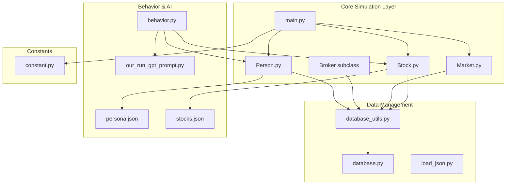
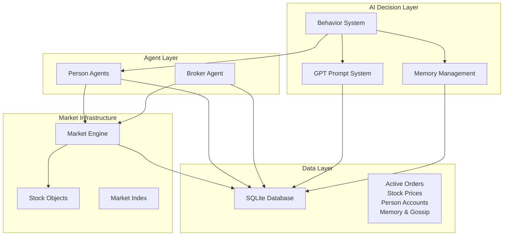
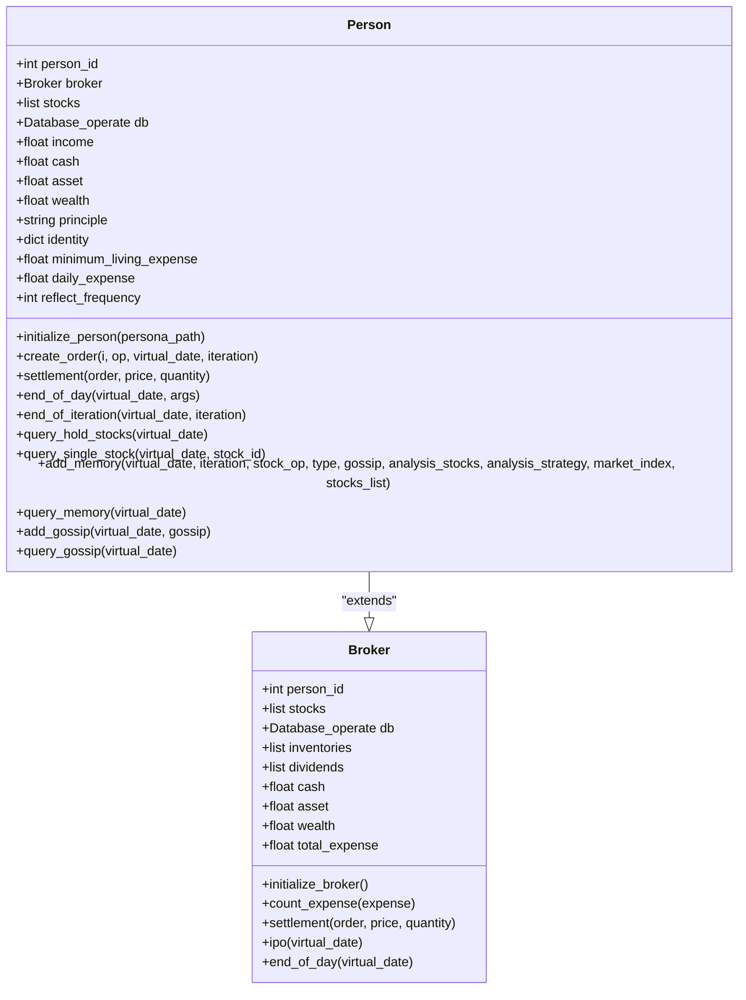
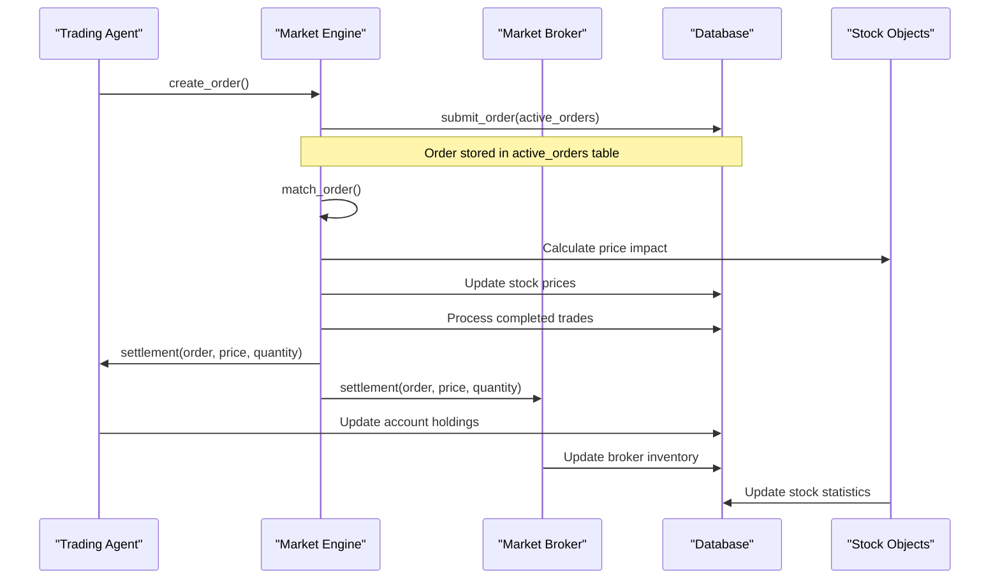
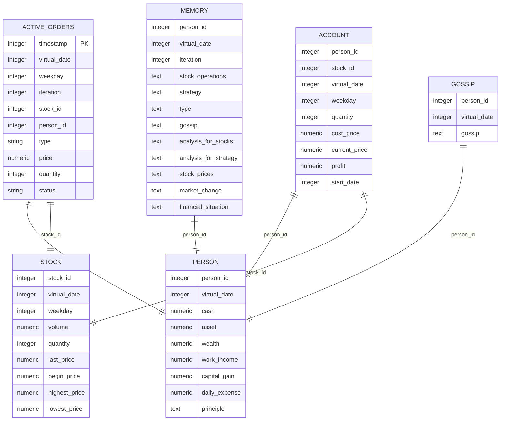
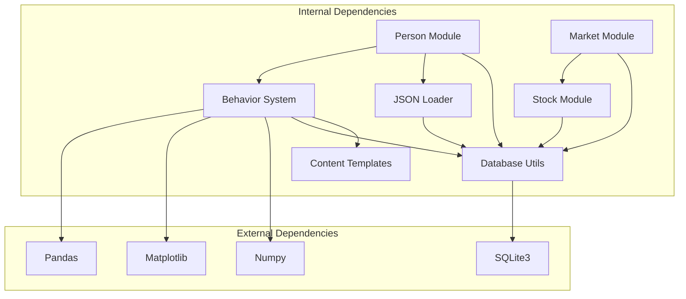

# Agent System

<cite>
**Referenced Files in This Document**
- [Person.py](file://Agent-Trading-Arena/Stock_Main/Person.py)
- [Market.py](file://Agent-Trading-Arena/Stock_Main/Market.py)
- [Stock.py](file://Agent-Trading-Arena/Stock_Main/Stock.py)
- [database.py](file://Agent-Trading-Arena/Stock_Main/database.py)
- [database_utils.py](file://Agent-Trading-Arena/Stock_Main/database_utils.py)
- [load_json.py](file://Agent-Trading-Arena/Stock_Main/load_json.py)
- [behavior.py](file://Agent-Trading-Arena/Stock_Main/behavior.py)
- [main.py](file://Agent-Trading-Arena/Stock_Main/main.py)
- [constant.py](file://Agent-Trading-Arena/Stock_Main/constant.py)
- [our_run_gpt_prompt.py](file://Agent-Trading-Arena/Stock_Main/content/our_run_gpt_prompt.py)
- [persona.json](file://Agent-Trading-Arena/Stock_Main/save/init/persona.json)
- [stocks.json](file://Agent-Trading-Arena/Stock_Main/save/init/stocks.json)
</cite>

## Table of Contents
1. [Introduction](#introduction)
2. [Project Structure](#project-structure)
3. [Core Components](#core-components)
4. [Architecture Overview](#architecture-overview)
5. [Detailed Component Analysis](#detailed-component-analysis)
6. [Dependency Analysis](#dependency-analysis)
7. [Performance Considerations](#performance-considerations)
8. [Troubleshooting Guide](#troubleshooting-guide)
9. [Conclusion](#conclusion)

## Introduction

The Agent Trading Arena is a sophisticated simulation system that models AI trading agents interacting with financial markets. This system creates autonomous agents (Person class) with distinct personalities, financial states, and investment philosophies, managed by a central Broker that handles market operations and IPO processes. The architecture demonstrates advanced concepts in agent-based modeling, database-driven state persistence, and market simulation mechanics.

The system operates on a virtual timeline where agents make trading decisions, execute orders, and experience daily financial settlements. Each agent maintains comprehensive financial records, personal memories, and social interactions through a sophisticated database schema that tracks every aspect of their trading activities.

## Project Structure

The project follows a modular architecture with clear separation of concerns:

**Diagram sources**
- [main.py](file://Agent-Trading-Arena/Stock_Main/main.py#L1-L136)
- [Person.py](file://Agent-Trading-Arena/Stock_Main/Person.py#L1-L629)
- [Market.py](file://Agent-Trading-Arena/Stock_Main/Market.py#L1-L278)
- [Stock.py](file://Agent-Trading-Arena/Stock_Main/Stock.py#L1-L307)

**Section sources**
- [main.py](file://Agent-Trading-Arena/Stock_Main/main.py#L1-L136)
- [Person.py](file://Agent-Trading-Arena/Stock_Main/Person.py#L1-L629)

## Core Components

### Person Class - AI Trading Agent Representation

The Person class serves as the primary agent model, representing AI trading agents with distinct characteristics:

**Key Attributes:**
- **Identity and Principles**: Each agent has a unique identity with occupation, investment philosophy, and behavioral patterns
- **Financial State**: Comprehensive tracking of cash, assets, wealth, income, and expenses
- **Portfolio Management**: Detailed stock holdings with cost basis, current prices, and profit calculations
- **Memory System**: Persistent record of trading decisions, reflections, and social interactions

**Core Methods:**
- `initialize_person()`: Loads persona data from JSON and establishes initial financial state
- `create_order()`: Processes trading decisions and submits orders to the market
- `settlement()`: Handles post-trade financial adjustments and portfolio updates
- `end_of_day()`: Manages daily financial settlements including dividends and expenses
- `add_memory()`: Records trading experiences and reflections for future learning

### Broker Subclass - Market Operations Manager

The Broker class extends Person to manage market-wide operations:

**Primary Responsibilities:**
- **IPO Management**: Handles initial public offerings and market inventory distribution
- **Market Settlement**: Processes trade executions and updates broker financial positions
- **Expense Tracking**: Monitors transaction costs and market operational expenses
- **Inventory Management**: Maintains market supply of available shares

**Key Operations:**
- `initialize_broker()`: Sets up market infrastructure and initial inventory
- `ipo()`: Executes initial stock distribution to market participants
- `settlement()`: Updates broker positions after trade executions
- `end_of_day()`: Prepares market data for next trading period

### Market Class - Trading Execution Engine

The Market class orchestrates the entire trading ecosystem:

**Core Functions:**
- **Order Matching**: Implements sophisticated matching algorithm for buy/sell orders
- **Price Discovery**: Calculates fair market prices based on supply/demand dynamics
- **Trade Execution**: Processes completed transactions and updates all parties
- **Market Surveillance**: Enforces trading rules and price limits

**Advanced Features:**
- Real-time order book management
- Price volatility control mechanisms
- Partial order fulfillment handling
- Market index calculation and tracking

**Section sources**
- [Person.py](file://Agent-Trading-Arena/Stock_Main/Person.py#L143-L629)
- [Market.py](file://Agent-Trading-Arena/Stock_Main/Market.py#L12-L278)

## Architecture Overview

The system employs a multi-layered architecture that separates concerns while maintaining tight integration between components:

**Diagram sources**
- [main.py](file://Agent-Trading-Arena/Stock_Main/main.py#L51-L136)
- [Person.py](file://Agent-Trading-Arena/Stock_Main/Person.py#L1-L629)
- [Market.py](file://Agent-Trading-Arena/Stock_Main/Market.py#L1-L278)

The architecture demonstrates several key design principles:

1. **Separation of Concerns**: Each component has a specific role in the trading ecosystem
2. **Data Persistence**: All state information is maintained in a relational database
3. **Extensibility**: New agent types and market mechanisms can be easily integrated
4. **Realism**: Market dynamics simulate real-world trading conditions

## Detailed Component Analysis

### Person Class Implementation

The Person class represents the fundamental AI trading agent with sophisticated state management:

**Diagram sources**
- [Person.py](file://Agent-Trading-Arena/Stock_Main/Person.py#L18-L629)

**Key Implementation Details:**

**Initialization Process:**
The Person class loads agent data from persona.json, establishing individual characteristics including investment philosophy, income levels, and initial cash positions. Each agent begins with zero stock holdings but full financial records in the database.

**Order Processing Workflow:**
Agents receive trading recommendations from the behavior system, process them through the `create_order()` method, which validates against available funds and existing holdings before submitting to the market.

**Financial Settlement Mechanisms:**
The settlement process handles both buy and sell transactions, updating portfolio quantities, cost bases, and profit calculations while maintaining accurate financial records.

**Memory and Reflection System:**
Agents maintain comprehensive memory of trading activities, reflections, and social interactions, enabling sophisticated learning and adaptation over time.

### Market Class Trading Engine

The Market class implements sophisticated trading mechanics:

**Diagram sources**
- [Market.py](file://Agent-Trading-Arena/Stock_Main/Market.py#L96-L278)
- [Person.py](file://Agent-Trading-Arena/Stock_Main/Person.py#L212-L427)

**Trading Algorithm Features:**
- Priority-based order matching (price-time priority)
- Price limit enforcement to prevent excessive volatility
- Partial order fulfillment handling
- Market impact calculation for large trades
- Real-time price discovery mechanisms

### Database Schema and State Persistence

The system uses a comprehensive database schema to maintain complete state information:

**Diagram sources**
- [database_utils.py](file://Agent-Trading-Arena/Stock_Main/database_utils.py#L253-L300)

**State Persistence Features:**
- Complete transaction history tracking
- Real-time portfolio updates
- Memory and reflection storage
- Social interaction logging
- Market statistics maintenance

**Section sources**
- [Person.py](file://Agent-Trading-Arena/Stock_Main/Person.py#L1-L629)
- [Market.py](file://Agent-Trading-Arena/Stock_Main/Market.py#L1-L278)
- [database_utils.py](file://Agent-Trading-Arena/Stock_Main/database_utils.py#L245-L322)

## Dependency Analysis

The system exhibits well-managed dependencies with clear interfaces:

**Diagram sources**
- [Person.py](file://Agent-Trading-Arena/Stock_Main/Person.py#L1-L16)
- [Market.py](file://Agent-Trading-Arena/Stock_Main/Market.py#L1-L9)
- [database_utils.py](file://Agent-Trading-Arena/Stock_Main/database_utils.py#L1-L10)

**Dependency Characteristics:**
- **Low Coupling**: Modules communicate through well-defined interfaces
- **High Cohesion**: Each module focuses on specific functionality
- **Clear Data Flow**: Information moves predictably through the system
- **Extensible Design**: New components can be added without disrupting existing functionality

**Section sources**
- [Person.py](file://Agent-Trading-Arena/Stock_Main/Person.py#L1-L16)
- [Market.py](file://Agent-Trading-Arena/Stock_Main/Market.py#L1-L9)

## Performance Considerations

The system is designed with several performance optimization strategies:

**Database Optimization:**
- Batch operations for order processing
- Efficient indexing on frequently queried columns
- Connection pooling for database operations
- Transaction batching to reduce I/O overhead

**Memory Management:**
- Lazy loading of historical data
- Efficient data structures for order books
- Periodic cleanup of old records
- Optimized query patterns for real-time operations

**Scalability Features:**
- Modular design allows for horizontal scaling
- Stateless components enable distributed deployment
- Configurable batch sizes for different load conditions
- Caching mechanisms for frequently accessed data

**Real-time Performance:**
- Asynchronous order processing
- Non-blocking database operations
- Efficient market matching algorithms
- Minimal latency in order execution

## Troubleshooting Guide

Common issues and their solutions:

**Order Processing Issues:**
- **Problem**: Orders not executing despite sufficient funds
- **Solution**: Verify order validation logic and database connectivity
- **Debug Steps**: Check active_orders table for pending orders

**Memory Corruption:**
- **Problem**: Inconsistent agent states after restart
- **Solution**: Implement proper state serialization/deserialization
- **Prevention**: Regular database backups and integrity checks

**Market Instability:**
- **Problem**: Excessive price volatility or unrealistic price movements
- **Solution**: Adjust market parameters and price limit configurations
- **Monitoring**: Track market index volatility and order book depth

**Performance Degradation:**
- **Problem**: Slow response times during peak trading hours
- **Solution**: Optimize database queries and implement connection pooling
- **Monitoring**: Track query execution times and database connection usage

**Section sources**
- [database_utils.py](file://Agent-Trading-Arena/Stock_Main/database_utils.py#L302-L310)
- [Person.py](file://Agent-Trading-Arena/Stock_Main/Person.py#L212-L248)

## Conclusion

The Agent Trading Arena demonstrates a sophisticated approach to AI agent simulation with several notable achievements:

**Architectural Strengths:**
- Clean separation of concerns with well-defined interfaces
- Comprehensive state persistence through relational databases
- Realistic market simulation with dynamic price discovery
- Extensible design supporting multiple agent types and market mechanisms

**Technical Innovations:**
- Integrated memory and reflection systems for agent learning
- Sophisticated order matching algorithms with price limits
- Comprehensive financial tracking and settlement mechanisms
- Social interaction system enabling agent-to-agent communication

**Design Philosophy:**
The system prioritizes realism, extensibility, and maintainability while providing a robust foundation for AI trading research and development. The modular architecture enables easy experimentation with different trading strategies, market conditions, and agent behaviors.

Future enhancements could include support for more complex trading instruments, advanced machine learning integration, and distributed deployment capabilities. The solid architectural foundation provides excellent opportunities for extending the system's capabilities while maintaining system stability and performance.