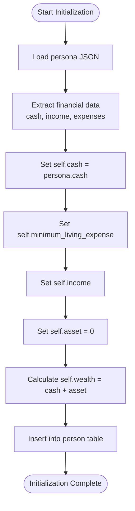
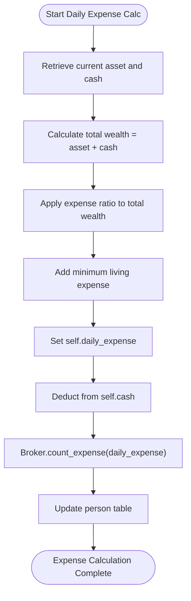
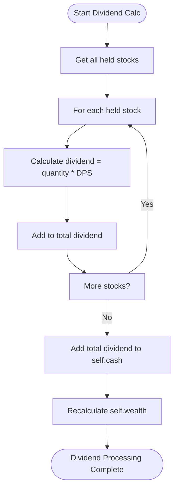
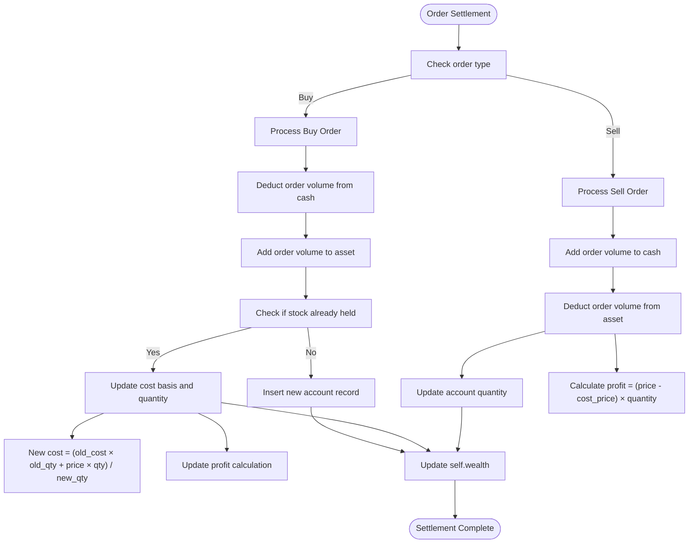
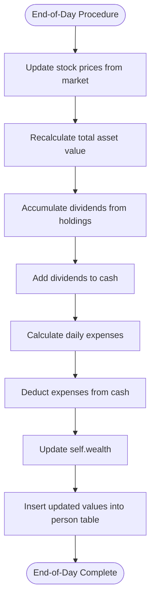
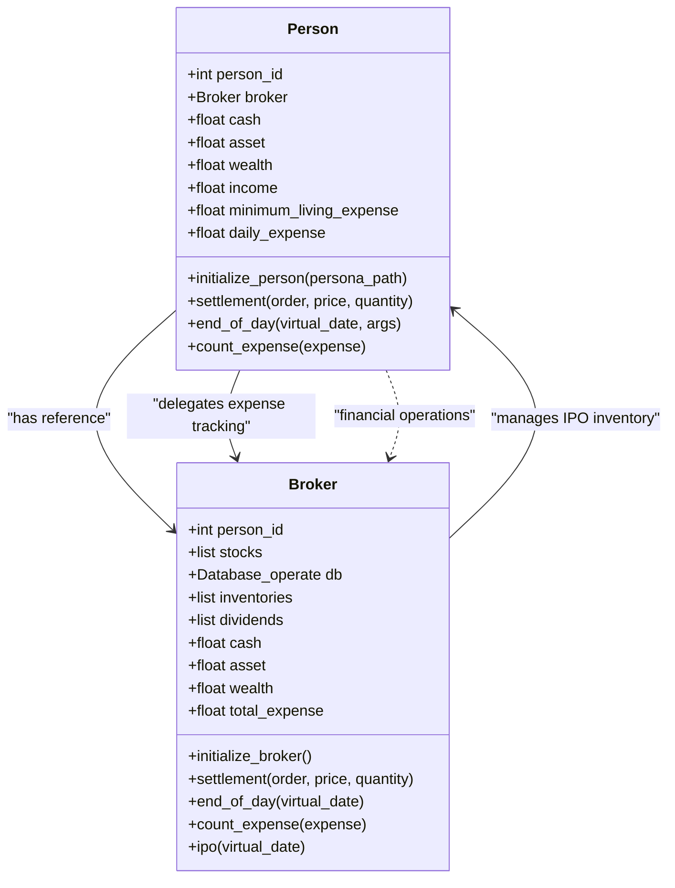
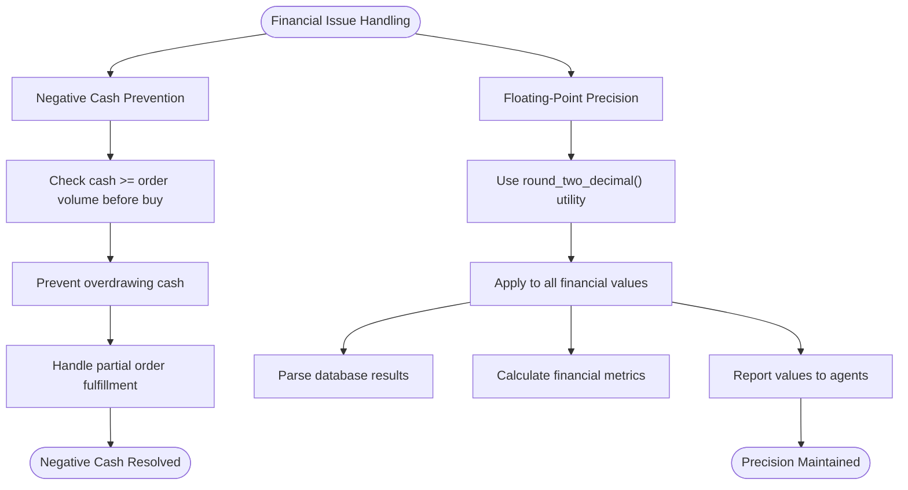

# Financial Management

<cite>
**Referenced Files in This Document**   
- [Person.py](file://Agent-Trading-Arena/Stock_Main/Person.py)
- [Stock.py](file://Agent-Trading-Arena/Stock_Main/Stock.py)
- [database_utils.py](file://Agent-Trading-Arena/Stock_Main/database_utils.py)
- [load_json.py](file://Agent-Trading-Arena/Stock_Main/load_json.py)
</cite>

## Table of Contents
1. [Financial Lifecycle Initialization](#financial-lifecycle-initialization)
2. [Daily Expense Calculation](#daily-expense-calculation)
3. [Dividend Accumulation](#dividend-accumulation)
4. [Order Settlement Process](#order-settlement-process)
5. [End-of-Day Procedures](#end-of-day-procedures)
6. [Person-Broker Financial Relationship](#person-broker-financial-relationship)
7. [Common Financial Issues](#common-financial-issues)

## Financial Lifecycle Initialization

The financial lifecycle of agents begins with initialization from persona JSON data. Each Person instance is initialized with financial parameters extracted from their corresponding persona JSON file, including initial cash balance, minimum living expenses, daily income from job, and investment principles. The initialization process in the `initialize_person` method of the Person class loads these values and sets up the agent's initial financial state.

The cash and asset values are initialized with the cash amount specified in the persona JSON, while assets start at zero since no stocks are held initially. The wealth is calculated as the sum of cash and assets. This initialization is reflected in the database through an insertion into the person table with the initial values.

**Diagram sources**
- [Person.py](file://Agent-Trading-Arena/Stock_Main/Person.py#L173-L200)

**Section sources**
- [Person.py](file://Agent-Trading-Arena/Stock_Main/Person.py#L173-L200)
- [load_json.py](file://Agent-Trading-Arena/Stock_Main/load_json.py#L9-L14)

## Daily Expense Calculation

Daily expenses are calculated based on the agent's wealth, cash position, and minimum living costs. The expense calculation occurs in the `end_of_day` method of the Person class, where the daily expense is determined by a combination of a percentage of total wealth and the agent's minimum living expense.

The formula used is: `daily_expense = (total_asset * 1.0 + self.cash) * args.expense_ratio + self.minimum_living_expense`. This approach ensures that agents with higher wealth incur proportionally higher expenses while still maintaining a baseline minimum living cost. The calculated expense is then deducted from the agent's cash balance, and the total expense is tracked by the Broker instance through the `count_expense` method.

This dynamic expense model creates a realistic financial behavior where agents' spending scales with their financial success, while ensuring basic survival costs are always covered.

**Diagram sources**
- [Person.py](file://Agent-Trading-Arena/Stock_Main/Person.py#L409-L414)

**Section sources**
- [Person.py](file://Agent-Trading-Arena/Stock_Main/Person.py#L409-L414)

## Dividend Accumulation

Dividend accumulation occurs when agents hold stocks that generate dividend payments. The system calculates dividends based on the Dividend Per Share (DPS) value of each stock and the quantity held by the agent. In the `end_of_day` method of the Person class, dividends are accumulated by iterating through all held stocks and calculating the total dividend as the sum of (quantity * DPS) for each stock.

The accumulated dividends are added to the agent's cash balance before daily expenses are deducted, effectively providing income from investments. This creates a positive feedback loop where successful investments generate additional capital that can be reinvested or used to cover living expenses.

The dividend calculation is integrated into the end-of-day asset valuation process, ensuring that dividend income is properly accounted for in the agent's daily financial updates.

**Diagram sources**
- [Person.py](file://Agent-Trading-Arena/Stock_Main/Person.py#L388-L389)

**Section sources**
- [Person.py](file://Agent-Trading-Arena/Stock_Main/Person.py#L388-L389)
- [Stock.py](file://Agent-Trading-Arena/Stock_Main/Stock.py#L22)

## Order Settlement Process

The settlement process for buy/sell orders handles the financial transactions when trades are executed. The `settlement` method in the Person class manages the accounting for both buy and sell operations, updating cash, asset, and wealth values accordingly.

For buy orders, the order volume (price × quantity) is deducted from cash and added to assets. The cost basis is calculated as a weighted average when purchasing additional shares of an already held stock. For sell orders, the order volume is added to cash and deducted from assets. The profit from the sale is calculated based on the difference between the selling price and the cost basis.

The settlement process also updates the database records in the account table, either inserting a new record for a first-time stock purchase or updating the existing record with the new quantity and cost basis.

**Diagram sources**
- [Person.py](file://Agent-Trading-Arena/Stock_Main/Person.py#L250-L307)

**Section sources**
- [Person.py](file://Agent-Trading-Arena/Stock_Main/Person.py#L250-L307)

## End-of-Day Procedures

The end-of-day procedure updates asset valuations based on current market prices and handles cash flows from dividends and expenses. The `end_of_day` method in the Person class orchestrates this process by first updating the current prices of all held stocks from the market data, then recalculating the total asset value, accumulating dividends, and processing daily expenses.

The procedure begins by querying all current stock prices and updating each held stock's current price and profit calculation. The total asset value is recalculated as the sum of (current_price × quantity) for all holdings. Dividends are then accumulated based on the DPS of each held stock and added to cash. Finally, daily expenses are calculated and deducted from the cash balance.

Throughout this process, the agent's wealth is continuously updated to reflect the changing financial position, and all changes are recorded in the database for historical tracking.

**Diagram sources**
- [Person.py](file://Agent-Trading-Arena/Stock_Main/Person.py#L364-L427)

**Section sources**
- [Person.py](file://Agent-Trading-Arena/Stock_Main/Person.py#L364-L427)

## Person-Broker Financial Relationship

The relationship between Person and Broker classes is central to the financial operations of the system. The Person class contains a reference to a Broker instance, creating a hierarchical financial management structure where the Broker oversees certain financial aspects while individual Persons manage their own portfolios.

The Broker class handles IPO inventory management, maintaining an inventory of available shares for initial offerings. It also tracks total expenses across all agents, providing a centralized view of spending in the economy. The Person class, on the other hand, manages individual financial accounts including cash, assets, and wealth calculations.

Financial operations flow through this relationship: when a Person incurs expenses, it notifies the Broker via the `count_expense` method. The Broker aggregates these expenses, providing a macroeconomic perspective on spending patterns. This separation of concerns allows for both individual financial autonomy and systemic financial monitoring.

**Diagram sources**
- [Person.py](file://Agent-Trading-Arena/Stock_Main/Person.py#L143-L629)

**Section sources**
- [Person.py](file://Agent-Trading-Arena/Stock_Main/Person.py#L18-L141)
- [Person.py](file://Agent-Trading-Arena/Stock_Main/Person.py#L143-L629)

## Common Financial Issues

The system addresses several common financial issues, particularly negative cash balances and floating-point precision in financial calculations. The code includes safeguards against negative cash balances through validation in the `create_order` method, which checks if a buy order can be covered by available cash before submitting it.

For floating-point precision, the system employs a `round_two_decimal` utility function that ensures all financial values are rounded to two decimal places, preventing accumulation of rounding errors in monetary calculations. This function is applied consistently across the codebase, particularly in database parsing functions and financial reporting methods.

The system also handles edge cases such as partial order fulfillment and zero-quantity holdings through assertion checks and conditional logic, ensuring financial integrity throughout the trading process.

**Diagram sources**
- [database_utils.py](file://Agent-Trading-Arena/Stock_Main/database_utils.py#L138-L145)
- [Person.py](file://Agent-Trading-Arena/Stock_Main/Person.py#L222-L223)

**Section sources**
- [database_utils.py](file://Agent-Trading-Arena/Stock_Main/database_utils.py#L138-L145)
- [Person.py](file://Agent-Trading-Arena/Stock_Main/Person.py#L222-L223)