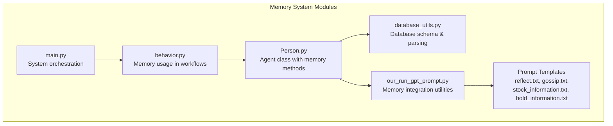
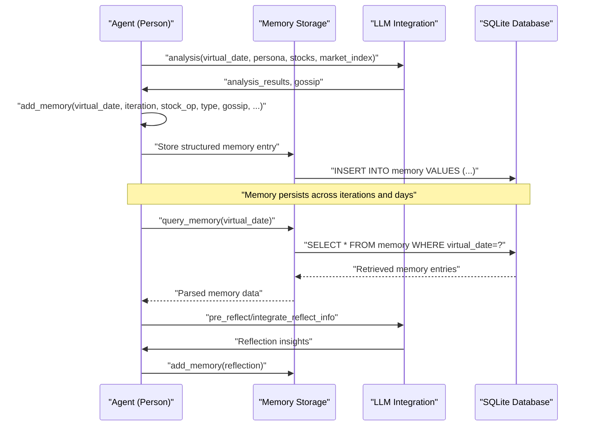
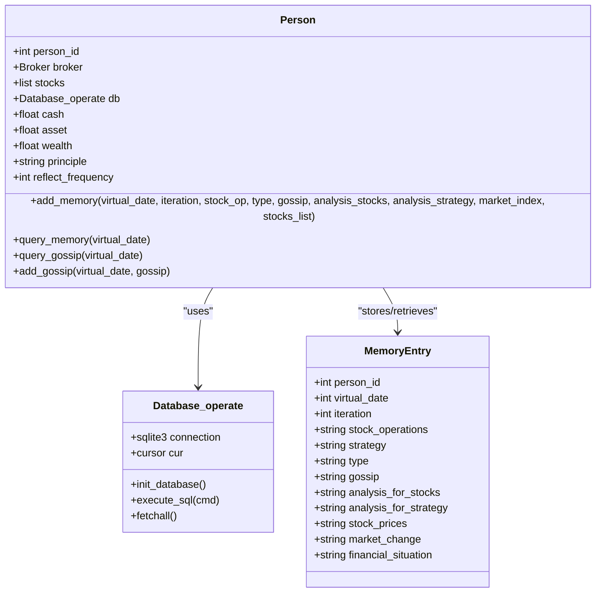
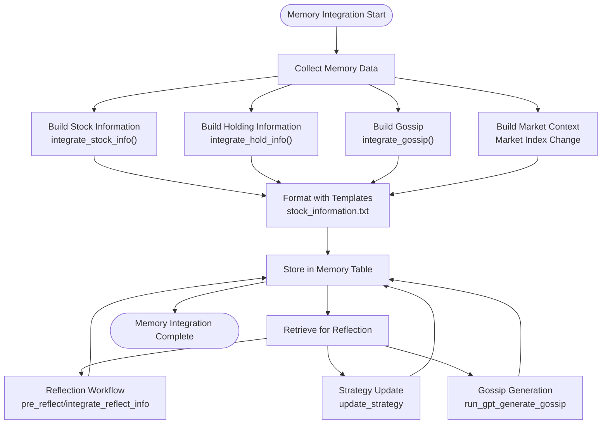
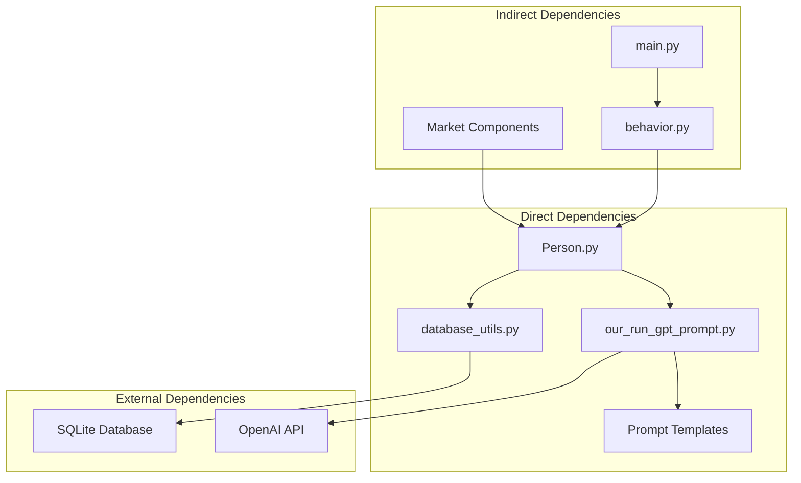

# Memory System

<cite>
**Referenced Files in This Document**
- [Person.py](file://Agent-Trading-Arena/Stock_Main/Person.py)
- [database_utils.py](file://Agent-Trading-Arena/Stock_Main/database_utils.py)
- [our_run_gpt_prompt.py](file://Agent-Trading-Arena/Stock_Main/content/our_run_gpt_prompt.py)
- [reflect.txt](file://Agent-Trading-Arena/Stock_Main/content/our_prompt_template/reflect.txt)
- [gossip.txt](file://Agent-Trading-Arena/Stock_Main/content/our_prompt_template/gossip.txt)
- [stock_information.txt](file://Agent-Trading-Arena/Stock_Main/content/our_prompt_template/stock_information.txt)
- [hold_information.txt](file://Agent-Trading-Arena/Stock_Main/content/our_prompt_template/hold_information.txt)
- [main.py](file://Agent-Trading-Arena/Stock_Main/main.py)
- [behavior.py](file://Agent-Trading-Arena/Stock_Main/behavior.py)
</cite>

## Table of Contents
1. [Introduction](#introduction)
2. [Project Structure](#project-structure)
3. [Core Components](#core-components)
4. [Architecture Overview](#architecture-overview)
5. [Detailed Component Analysis](#detailed-component-analysis)
6. [Dependency Analysis](#dependency-analysis)
7. [Performance Considerations](#performance-considerations)
8. [Troubleshooting Guide](#troubleshooting-guide)
9. [Conclusion](#conclusion)

## Introduction
This document provides comprehensive technical documentation for the Memory System sub-component within the Agent Trading Arena. The Memory System enables agents to persist and retrieve trading decisions, reflections, and gossip information using SQLite storage. It integrates tightly with Large Language Model (LLM) interactions to preserve historical context for reflection and gossip generation, forming a critical foundation for agent learning and inter-agent communication.

The system centers around two primary methods in the Person class:
- `add_memory`: Stores trading decisions, reflections, and contextual market information
- `query_memory`: Retrieves stored memories for LLM-driven reflection and strategy updates

## Project Structure
The Memory System spans multiple modules within the Stock_Main package:

**Diagram sources**
- [Person.py](file://Agent-Trading-Arena/Stock_Main/Person.py#L514-L581)
- [database_utils.py](file://Agent-Trading-Arena/Stock_Main/database_utils.py#L290-L300)
- [our_run_gpt_prompt.py](file://Agent-Trading-Arena/Stock_Main/content/our_run_gpt_prompt.py#L54-L111)
- [reflect.txt](file://Agent-Trading-Arena/Stock_Main/content/our_prompt_template/reflect.txt#L1-L35)
- [gossip.txt](file://Agent-Trading-Arena/Stock_Main/content/our_prompt_template/gossip.txt#L1-L16)

**Section sources**
- [Person.py](file://Agent-Trading-Arena/Stock_Main/Person.py#L1-L629)
- [database_utils.py](file://Agent-Trading-Arena/Stock_Main/database_utils.py#L1-L322)
- [main.py](file://Agent-Trading-Arena/Stock_Main/main.py#L1-L136)

## Core Components
The Memory System comprises three fundamental components:

### Database Schema
The memory table follows this structure:
- person_id: Integer identifier
- virtual_date: Integer representing simulation date
- iteration: Integer iteration counter within a day
- stock_operations: Text description of trading actions
- strategy: Agent's current investment philosophy
- type: Text classification (buy, sell, hold, reflect)
- gossip: Text containing market rumors/insights
- analysis_for_stocks: Text analysis of individual stocks
- analysis_for_strategy: Text analysis of overall strategy
- stock_prices: Integrated stock market information
- market_change: Current market index movement
- financial_situation: Portfolio holdings summary

### Memory Methods in Person Class
The Person class implements two primary memory operations:

**add_memory Method (lines 514-545)**: Inserts structured memory entries with:
- Trading decisions (buy/sell/hold operations)
- Reflection insights and strategy updates
- Market context (stock prices, market indices)
- Personal financial situation (holdings)

**query_memory Method (lines 547-580)**: Retrieves and parses memory entries for:
- Historical trading decisions
- Reflection contexts
- Market conditions
- Financial positions

### Memory Integration Utilities
The system provides three key utility functions for memory construction:

**integrate_stock_info (lines 54-78)**: Aggregates stock market information from all traded stocks, formatted according to stock_information.txt template.

**integrate_hold_info (lines 81-111)**: Summarizes current holdings, portfolio value, and performance metrics.

**integrate_gossip (lines 9-19)**: Selects and formats gossip from other agents for inclusion in memory.

**Section sources**
- [database_utils.py](file://Agent-Trading-Arena/Stock_Main/database_utils.py#L290-L300)
- [Person.py](file://Agent-Trading-Arena/Stock_Main/Person.py#L514-L581)
- [our_run_gpt_prompt.py](file://Agent-Trading-Arena/Stock_Main/content/our_run_gpt_prompt.py#L54-L111)

## Architecture Overview
The Memory System operates within a layered architecture that connects agent decision-making with persistent storage and LLM integration:

**Diagram sources**
- [Person.py](file://Agent-Trading-Arena/Stock_Main/Person.py#L514-L581)
- [our_run_gpt_prompt.py](file://Agent-Trading-Arena/Stock_Main/content/our_run_gpt_prompt.py#L414-L484)
- [behavior.py](file://Agent-Trading-Arena/Stock_Main/behavior.py#L82-L171)

## Detailed Component Analysis

### Memory Storage Implementation
The memory storage system uses a normalized approach to prevent redundancy and enable efficient querying:

**Diagram sources**
- [Person.py](file://Agent-Trading-Arena/Stock_Main/Person.py#L143-L200)
- [database_utils.py](file://Agent-Trading-Arena/Stock_Main/database_utils.py#L245-L322)

### Memory Integration with LLM Workflows
The system integrates memory with LLM interactions through carefully constructed prompt templates:

**Diagram sources**
- [our_run_gpt_prompt.py](file://Agent-Trading-Arena/Stock_Main/content/our_run_gpt_prompt.py#L54-L111)
- [reflect.txt](file://Agent-Trading-Arena/Stock_Main/content/our_prompt_template/reflect.txt#L1-L35)
- [gossip.txt](file://Agent-Trading-Arena/Stock_Main/content/our_prompt_template/gossip.txt#L1-L16)

### Memory Query Mechanisms
The system provides multiple query mechanisms for different use cases:

**Historical Decision Retrieval** (`query_memory`):
- Filters entries by virtual_date and person_id
- Excludes entries with empty stock operations
- Returns structured data for LLM consumption

**Inter-Agent Communication** (`query_gossip`):
- Retrieves gossip from other agents for the same date
- Enables information sharing between competing agents
- Supports market manipulation and strategic positioning

**Section sources**
- [Person.py](file://Agent-Trading-Arena/Stock_Main/Person.py#L547-L581)
- [Person.py](file://Agent-Trading-Arena/Stock_Main/Person.py#L621-L628)

### Memory Construction Examples
The memory system constructs entries with integrated information:

**Trading Decision Memory Entry**:
- stock_operations: "buy 10 shares of stock A at $150"
- type: "buy"
- stock_prices: Formatted stock market information
- market_change: Current market index movement
- financial_situation: Portfolio holdings summary

**Reflection Memory Entry**:
- stock_operations: "None"
- type: "reflect"
- analysis_for_strategy: Reflection insights
- strategy: Updated investment philosophy

**Gossip Memory Entry**:
- stock_operations: "None"
- type: "reflect"
- gossip: Generated market rumors

**Section sources**
- [Person.py](file://Agent-Trading-Arena/Stock_Main/Person.py#L514-L545)
- [behavior.py](file://Agent-Trading-Arena/Stock_Main/behavior.py#L127-L196)

## Dependency Analysis
The Memory System has well-defined dependencies that support modularity and maintainability:

**Diagram sources**
- [Person.py](file://Agent-Trading-Arena/Stock_Main/Person.py#L1-L16)
- [database_utils.py](file://Agent-Trading-Arena/Stock_Main/database_utils.py#L1-L10)
- [our_run_gpt_prompt.py](file://Agent-Trading-Arena/Stock_Main/content/our_run_gpt_prompt.py#L1-L7)

The dependency structure ensures:
- Clean separation between data persistence and business logic
- Modular prompt template system for easy customization
- Loose coupling between memory storage and LLM integration
- Scalable architecture supporting multiple agents and iterations

**Section sources**
- [main.py](file://Agent-Trading-Arena/Stock_Main/main.py#L1-L136)
- [behavior.py](file://Agent-Trading-Arena/Stock_Main/behavior.py#L1-L210)

## Performance Considerations
The Memory System faces several performance challenges in long-running simulations:

### Memory Growth Management
**Issue**: Memory tables grow exponentially with simulation duration
**Impact**: Query performance degrades, disk usage increases
**Solution**: Implement memory pruning strategies

### Query Optimization Strategies
**Indexing Recommendations**:
- Add composite indexes on (person_id, virtual_date) for frequent queries
- Consider partitioning strategies for large datasets
- Implement pagination for memory retrieval operations

**Query Pattern Optimization**:
- Use parameterized queries to prevent SQL injection
- Implement batch operations for memory insertion
- Cache frequently accessed memory segments

### Memory Pruning Strategies
**Temporal Decay**: Gradually reduce retention of older memories
**Strategic Filtering**: Remove redundant entries (duplicate operations)
**Content-Based Retention**: Preserve only significant events
**Size Limits**: Enforce maximum memory entries per agent

### Database-Level Optimizations
**Connection Pooling**: Reuse database connections across operations
**Transaction Batching**: Group multiple memory operations
**Vacuum Operations**: Regular maintenance for SQLite optimization

**Section sources**
- [database_utils.py](file://Agent-Trading-Arena/Stock_Main/database_utils.py#L302-L322)
- [Person.py](file://Agent-Trading-Arena/Stock_Main/Person.py#L514-L581)

## Troubleshooting Guide

### Common Memory Issues

**Memory Bloat Prevention**
- Monitor memory table sizes regularly
- Implement automatic pruning policies
- Set maximum retention periods per entry type

**Data Integrity Validation**
- Verify foreign key constraints between memory and other tables
- Validate memory entry completeness before insertion
- Implement checksums for critical memory fields

**LLM Integration Problems**
- Check prompt template formatting consistency
- Validate memory field types before LLM processing
- Monitor API rate limits and retry policies

### Debugging Memory Operations

**Query Debugging**:
- Enable SQL logging for memory queries
- Validate parameter binding for memory operations
- Test memory retrieval with explicit filters

**Integration Testing**:
- Verify memory entry serialization/deserialization
- Test cross-agent memory sharing scenarios
- Validate reflection workflow end-to-end

**Performance Monitoring**:
- Track memory insertion rates during simulations
- Monitor query response times for memory operations
- Analyze memory table growth patterns

### Recovery Procedures
**Data Corruption Handling**:
- Implement backup strategies for memory tables
- Validate memory entries after system restarts
- Establish recovery procedures for failed transactions

**System Resilience**:
- Design graceful degradation for memory failures
- Implement fallback mechanisms for LLM integration
- Ensure simulation continuity despite memory system issues

**Section sources**
- [Person.py](file://Agent-Trading-Arena/Stock_Main/Person.py#L514-L581)
- [database_utils.py](file://Agent-Trading-Arena/Stock_Main/database_utils.py#L302-L322)

## Conclusion
The Memory System represents a sophisticated integration of persistent storage, LLM-driven reflection, and inter-agent communication within the Agent Trading Arena. Its design successfully balances flexibility with performance, enabling agents to learn from past experiences while maintaining competitive market dynamics.

Key strengths of the system include:
- Comprehensive memory schema supporting diverse agent activities
- Seamless integration with LLM workflows for reflection and strategy updates
- Efficient query mechanisms for historical context retrieval
- Modular architecture supporting extensibility and maintenance

Future enhancements should focus on automated memory pruning, advanced indexing strategies, and performance monitoring to support large-scale agent simulations with extended horizons.