# Architecture and Design

<cite>
**Referenced Files in This Document**
- [main.py](file://Agent-Trading-Arena/Stock_Main/main.py)
- [Person.py](file://Agent-Trading-Arena/Stock_Main/Person.py)
- [Stock.py](file://Agent-Trading-Arena/Stock_Main/Stock.py)
- [Market.py](file://Agent-Trading-Arena/Stock_Main/Market.py)
- [behavior.py](file://Agent-Trading-Arena/Stock_Main/behavior.py)
- [database_utils.py](file://Agent-Trading-Arena/Stock_Main/database_utils.py)
- [database.py](file://Agent-Trading-Arena/Stock_Main/database.py)
- [load_json.py](file://Agent-Trading-Arena/Stock_Main/load_json.py)
- [constant.py](file://Agent-Trading-Arena/Stock_Main/constant.py)
- [run.sh](file://Agent-Trading-Arena/run.sh)
</cite>

## Table of Contents
1. [Introduction](#introduction)
2. [Project Structure](#project-structure)
3. [Core Components](#core-components)
4. [Architecture Overview](#architecture-overview)
5. [Detailed Component Analysis](#detailed-component-analysis)
6. [Dependency Analysis](#dependency-analysis)
7. [Performance Considerations](#performance-considerations)
8. [Troubleshooting Guide](#troubleshooting-guide)
9. [Conclusion](#conclusion)
10. [Appendices](#appendices)

## Introduction
This document describes the architecture and design of the Agent Trading Arena simulation. The system is an event-driven, discrete-time simulation orchestrated by main.py. It implements an Entity-Component pattern across Person, Stock, and Market classes, with behavior.py acting as the controller layer and a database-backed state model. The simulation runs a daily cycle of agent actions, order matching, settlement, and state persistence, with no dedicated view layer.

## Project Structure
The simulation is organized around a central orchestrator (main.py) and several focused modules:
- main.py: CLI argument parsing, initialization, and the daily trading loop
- Person.py: Person and Broker entities with financial state and order lifecycle
- Stock.py: Stock and Market_index entities with pricing and aggregation
- Market.py: Order matching engine and settlement coordinator
- behavior.py: Decision-making and reflection logic for agents
- database_utils.py: Database schema, CRUD helpers, and parsers
- database.py: Legacy operations table (not actively used in runtime)
- load_json.py: Serialization/deserialization of entities and runtime state
- constant.py: Global constants (e.g., stock names)

**Diagram sources**
- [main.py](file://Agent-Trading-Arena/Stock_Main/main.py#L51-L136)
- [Person.py](file://Agent-Trading-Arena/Stock_Main/Person.py#L18-L629)
- [Stock.py](file://Agent-Trading-Arena/Stock_Main/Stock.py#L14-L307)
- [Market.py](file://Agent-Trading-Arena/Stock_Main/Market.py#L12-L278)
- [behavior.py](file://Agent-Trading-Arena/Stock_Main/behavior.py#L82-L210)
- [database_utils.py](file://Agent-Trading-Arena/Stock_Main/database_utils.py#L245-L322)
- [load_json.py](file://Agent-Trading-Arena/Stock_Main/load_json.py#L45-L122)

**Section sources**
- [main.py](file://Agent-Trading-Arena/Stock_Main/main.py#L1-L136)
- [run.sh](file://Agent-Trading-Arena/run.sh#L1-L24)

## Core Components
- Person: An agent entity with identity, cash, asset, and wealth. Manages orders, settlements, and daily reflections. Persists state to the database.
- Broker: A special Person-like entity (-1 ID) that acts as the market maker and settlement counterparty. Holds inventories and settles trades.
- Stock: Represents a tradable instrument with intraday price history, book value, and daily OHLCV aggregates.
- Market_index: Aggregates stock prices into a composite index weighted by book value.
- Market: Centralized order matching engine that enforces price limits, computes clearing prices, and updates state.
- behavior: Controller logic that generates agent actions, reflections, and gossip.
- Database_operate: SQLite abstraction with schema for stock, person, account, active_orders, memory, and gossip tables.
- load_json: Serialization/deserialization of entities and runtime checkpointing.

**Section sources**
- [Person.py](file://Agent-Trading-Arena/Stock_Main/Person.py#L18-L629)
- [Stock.py](file://Agent-Trading-Arena/Stock_Main/Stock.py#L14-L307)
- [Market.py](file://Agent-Trading-Arena/Stock_Main/Market.py#L12-L278)
- [behavior.py](file://Agent-Trading-Arena/Stock_Main/behavior.py#L82-L210)
- [database_utils.py](file://Agent-Trading-Arena/Stock_Main/database_utils.py#L245-L322)
- [load_json.py](file://Agent-Trading-Arena/Stock_Main/load_json.py#L45-L122)

## Architecture Overview
The system follows an event-driven, discrete-time design:
- Time advances in virtual_days with multiple iterations per day.
- At each iteration, agents produce buy/sell orders based on analysis and gossip.
- Market matches orders, updates prices, and settles trades.
- Entities persist state to the database and update internal balances.
- Reflections adjust agent strategies periodically.

**Diagram sources**
- [main.py](file://Agent-Trading-Arena/Stock_Main/main.py#L84-L131)
- [behavior.py](file://Agent-Trading-Arena/Stock_Main/behavior.py#L82-L210)
- [Market.py](file://Agent-Trading-Arena/Stock_Main/Market.py#L96-L265)
- [Person.py](file://Agent-Trading-Arena/Stock_Main/Person.py#L212-L427)
- [Stock.py](file://Agent-Trading-Arena/Stock_Main/Stock.py#L67-L112)
- [database_utils.py](file://Agent-Trading-Arena/Stock_Main/database_utils.py#L224-L242)

## Detailed Component Analysis

### Event Orchestration in main.py
- Argument parsing defines simulation parameters and derived save paths.
- Initialization creates Database_operate, Stock[], Market_index, Broker, Person[], and Market.
- The daily loop:
  - IPO for initial issuance
  - Market_index update
  - Gossip generation
  - Iterative order creation and matching
  - Settlement and end-of-iteration updates
  - Reflection and persistence

Key instantiations and calls:
- Database_operate for schema creation and transactions
- Stock instances initialized from JSON
- Market_index constructed from stocks
- Broker created with inventories and initial account entries
- Person instances bound to Broker and Stocks
- Market coordinating order matching and settlement

**Section sources**
- [main.py](file://Agent-Trading-Arena/Stock_Main/main.py#L16-L136)
- [run.sh](file://Agent-Trading-Arena/run.sh#L10-L23)

### Entity-Component Pattern: Person, Stock, Market
- Person encapsulates identity, cash, asset, wealth, and order lifecycle. It interacts with the database for queries and updates.
- Stock tracks intraday prices, OHLCV aggregates, and book value. Provides historical queries and intraday metrics.
- Market_index aggregates prices across stocks using book-value weights.
- Broker acts as the market maker and settlement counterparty for unmatched trades.

**Diagram sources**
- [Person.py](file://Agent-Trading-Arena/Stock_Main/Person.py#L18-L629)
- [Stock.py](file://Agent-Trading-Arena/Stock_Main/Stock.py#L14-L307)
- [Market.py](file://Agent-Trading-Arena/Stock_Main/Market.py#L12-L278)

**Section sources**
- [Person.py](file://Agent-Trading-Arena/Stock_Main/Person.py#L18-L629)
- [Stock.py](file://Agent-Trading-Arena/Stock_Main/Stock.py#L14-L307)
- [Market.py](file://Agent-Trading-Arena/Stock_Main/Market.py#L12-L278)

### Controller Layer: behavior.py
- stock_ops: Generates agent actions by prompting analysis, extracting buy/sell decisions, and recording memory.
- reflection: Periodically updates agent strategies based on pre- and long-term reflections.
- generate_gossip: Collects and stores gossip messages per agent and day.

```mermaid
flowchart TD
Start(["Agent Decision Cycle"]) --> Analyze["Run analysis()<br/>with stocks and market_index"]
Analyze --> ChooseBuy["Prompt buy decision"]
Analyze --> ChooseSell["Prompt sell decision"]
ChooseBuy --> ExtractBuy["extract_for_choose_buy()"]
ChooseSell --> ExtractSell["extract_for_choose_sell()"]
ExtractBuy --> MemoryBuy["p.add_memory(..., type='buy')"]
ExtractSell --> MemorySell["p.add_memory(..., type='sell')"]
MemoryBuy --> OpsList["ops[i] = [buy_list, sell_list]"]
MemorySell --> OpsList
OpsList --> End(["Return ops to main.py"])
```

**Diagram sources**
- [behavior.py](file://Agent-Trading-Arena/Stock_Main/behavior.py#L82-L171)

**Section sources**
- [behavior.py](file://Agent-Trading-Arena/Stock_Main/behavior.py#L82-L210)

### State Persistence and Data Model
- Database schema includes tables for stock, person, account, active_orders, memory, and gossip.
- Entities write/read state via database_utils helpers:
  - submit_order inserts active_orders
  - query_all_stocks retrieves OHLCV snapshots
  - parse_* functions normalize database rows
- load_json serializes/deserializes entities and runtime checkpoints.

**Diagram sources**
- [database_utils.py](file://Agent-Trading-Arena/Stock_Main/database_utils.py#L256-L300)
- [Person.py](file://Agent-Trading-Arena/Stock_Main/Person.py#L212-L427)
- [Stock.py](file://Agent-Trading-Arena/Stock_Main/Stock.py#L67-L112)
- [Market.py](file://Agent-Trading-Arena/Stock_Main/Market.py#L202-L265)

**Section sources**
- [database_utils.py](file://Agent-Trading-Arena/Stock_Main/database_utils.py#L245-L322)
- [load_json.py](file://Agent-Trading-Arena/Stock_Main/load_json.py#L45-L122)

### Daily Trading Cycle Data Flow
- Initialization: Database created, stocks and market index initialized, broker and persons created, Market assembled.
- Daily loop:
  - Market_index update
  - Gossip generation
  - Iterations: stock_ops produces ops, Person.create_order submits orders, Market.match_order executes matches, Person/Broker settlement updates balances, Market.end_of_market finalizes clearing, Market_index update, Person.end_of_iteration updates assets, reflection updates strategies, save_all persists state.
  - End of day: Market.end_of_day closes active orders, Person/Broker/Stock/Market_index end_of_day snapshot and adjustments.

**Diagram sources**
- [main.py](file://Agent-Trading-Arena/Stock_Main/main.py#L84-L131)
- [behavior.py](file://Agent-Trading-Arena/Stock_Main/behavior.py#L201-L210)
- [Market.py](file://Agent-Trading-Arena/Stock_Main/Market.py#L96-L265)
- [Person.py](file://Agent-Trading-Arena/Stock_Main/Person.py#L250-L427)
- [Stock.py](file://Agent-Trading-Arena/Stock_Main/Stock.py#L52-L112)

**Section sources**
- [main.py](file://Agent-Trading-Arena/Stock_Main/main.py#L84-L131)

## Dependency Analysis
- Coupling:
  - main.py depends on Person, Stock, Market, behavior, load_json, and database_utils.
  - Person and Broker depend on Database_operate and Stock[].
  - Market depends on Database_operate, Stock[], Broker, and Person[].
  - behavior depends on content prompts and database_utils helpers.
  - load_json depends on database_utils for runtime queries.
- Cohesion:
  - Each module encapsulates a distinct responsibility: orchestration, modeling, matching, controller logic, persistence, and utilities.
- External dependencies:
  - SQLite for persistence
  - OpenAI API keys for content prompts (configured externally)

**Diagram sources**
- [main.py](file://Agent-Trading-Arena/Stock_Main/main.py#L8-L13)
- [Person.py](file://Agent-Trading-Arena/Stock_Main/Person.py#L2-L16)
- [Stock.py](file://Agent-Trading-Arena/Stock_Main/Stock.py#L1-L10)
- [Market.py](file://Agent-Trading-Arena/Stock_Main/Market.py#L1-L9)
- [behavior.py](file://Agent-Trading-Arena/Stock_Main/behavior.py#L1-L12)
- [database_utils.py](file://Agent-Trading-Arena/Stock_Main/database_utils.py#L1-L10)
- [load_json.py](file://Agent-Trading-Arena/Stock_Main/load_json.py#L1-L6)

**Section sources**
- [main.py](file://Agent-Trading-Arena/Stock_Main/main.py#L8-L13)

## Performance Considerations
- Order matching complexity: Market.match_order processes buy/sell queues per stock; worst-case complexity scales with number of orders and iterations. Consider indexing active_orders by stock_id, type, and status to reduce fetch costs.
- Database writes: Frequent INSERT/UPDATE operations during matching and settlement. Batch operations or transaction batching could reduce overhead.
- Reflection cadence: Reflection occurs every N iterations per agent; tune args.reflect_frequency to balance learning and compute cost.
- Price limit enforcement: args.Daily_Price_Limit prevents extreme moves; adjust to control volatility and reduce unnecessary partial fills.
- Scalability trade-offs:
  - Current design centralizes matching in Market; parallelization would require partitioning stocks and managing cross-stock liquidity.
  - Broker inventory constraints cap market maker risk but may limit matching throughput.
  - Serialization/deserialization of entities adds overhead; consider lazy loading or incremental checkpointing.

[No sources needed since this section provides general guidance]

## Troubleshooting Guide
- Database errors:
  - Database ERROR prints indicate SQL failures; verify table creation and constraints in Database_operate.init_database.
  - Ensure active_orders status transitions are handled correctly in Market._update_order.
- Order submission:
  - submit_order asserts positive quantity; ensure behavior extraction returns valid values.
- Asset computation:
  - Person.end_of_iteration and end_of_day update cash, asset, and wealth; verify query_all_stocks and query_hold_stocks correctness.
- Reflection and gossip:
  - Ensure reflection frequency and memory/gossip tables are populated as expected.

**Section sources**
- [database_utils.py](file://Agent-Trading-Arena/Stock_Main/database_utils.py#L302-L310)
- [Market.py](file://Agent-Trading-Arena/Stock_Main/Market.py#L230-L265)
- [Person.py](file://Agent-Trading-Arena/Stock_Main/Person.py#L309-L427)
- [behavior.py](file://Agent-Trading-Arena/Stock_Main/behavior.py#L174-L210)

## Conclusion
The Agent Trading Arena employs an event-driven, discrete-time architecture centered on main.py. Person and Stock embody models with rich state and behaviors, while Market coordinates order matching and settlement. behavior.py provides controller logic for agent decisions, reflections, and gossip. The database layer persists all state, enabling reproducibility and introspection. The design balances modularity and simplicity, with clear opportunities for performance improvements and future extensions.

[No sources needed since this section summarizes without analyzing specific files]

## Appendices

### MVC-like Separation
- Models: Person, Stock, Market_index, Broker
- Controller: behavior.py
- View: None (no dedicated view layer; state persisted to database for later visualization)

**Section sources**
- [Person.py](file://Agent-Trading-Arena/Stock_Main/Person.py#L18-L629)
- [Stock.py](file://Agent-Trading-Arena/Stock_Main/Stock.py#L14-L307)
- [Market.py](file://Agent-Trading-Arena/Stock_Main/Market.py#L12-L278)
- [behavior.py](file://Agent-Trading-Arena/Stock_Main/behavior.py#L82-L210)