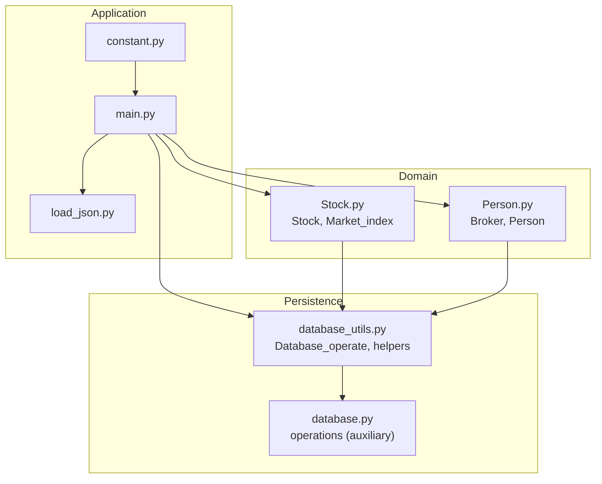
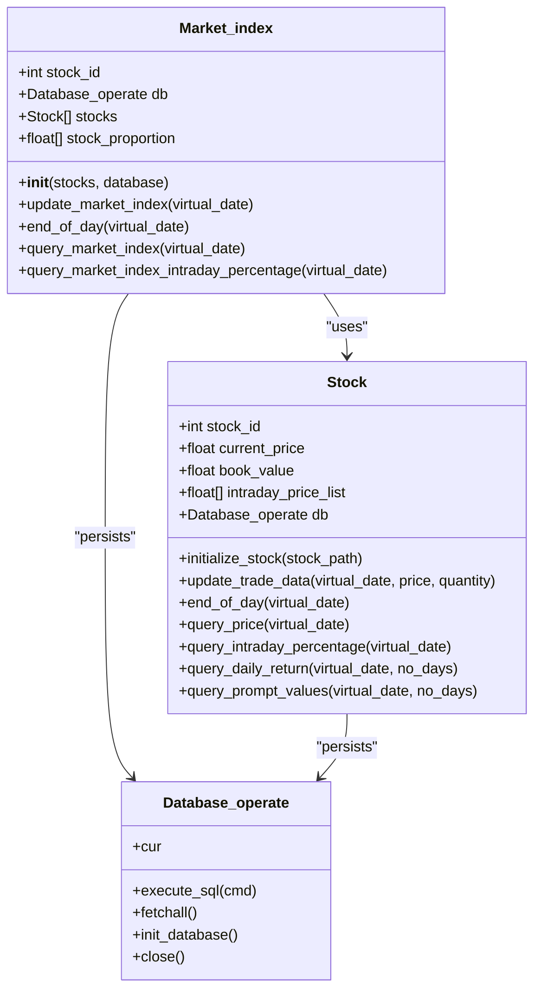
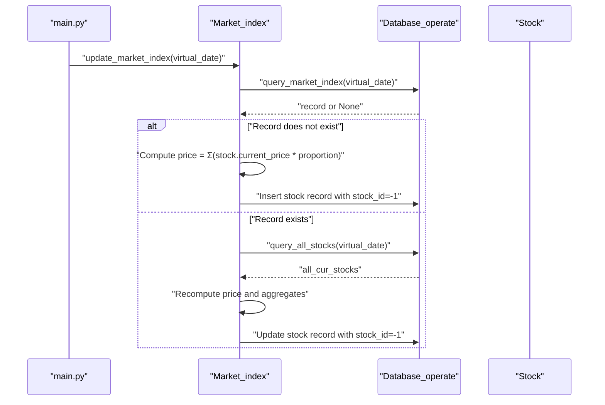
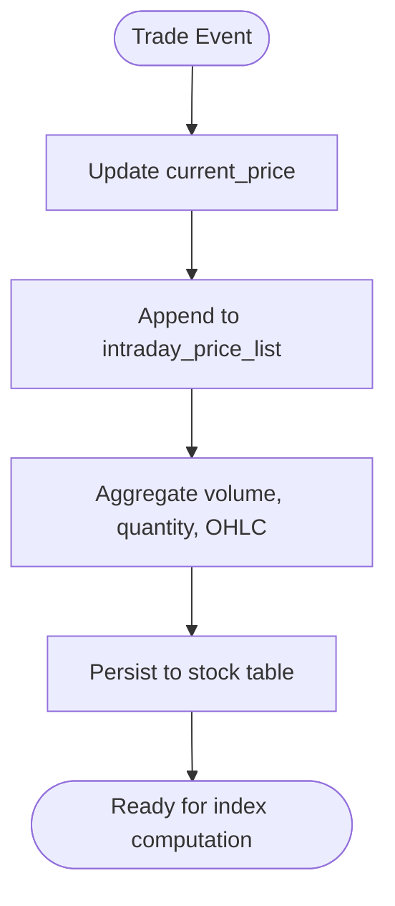
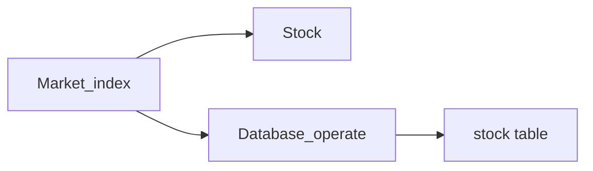

# Market Index

<cite>
**Referenced Files in This Document**
- [Stock.py](file://Agent-Trading-Arena/Stock_Main/Stock.py)
- [main.py](file://Agent-Trading-Arena/Stock_Main/main.py)
- [database_utils.py](file://Agent-Trading-Arena/Stock_Main/database_utils.py)
- [database.py](file://Agent-Trading-Arena/Stock_Main/database.py)
- [Person.py](file://Agent-Trading-Arena/Stock_Main/Person.py)
- [load_json.py](file://Agent-Trading-Arena/Stock_Main/load_json.py)
- [constant.py](file://Agent-Trading-Arena/Stock_Main/constant.py)
</cite>

## Table of Contents
1. [Introduction](#introduction)
2. [Project Structure](#project-structure)
3. [Core Components](#core-components)
4. [Architecture Overview](#architecture-overview)
5. [Detailed Component Analysis](#detailed-component-analysis)
6. [Dependency Analysis](#dependency-analysis)
7. [Performance Considerations](#performance-considerations)
8. [Troubleshooting Guide](#troubleshooting-guide)
9. [Conclusion](#conclusion)

## Introduction
This document explains the market index calculation system implemented in the trading simulation. It focuses on the Market_index class that computes a weighted average index based on the book value of constituent stocks. The document details how stock proportions are calculated during initialization, how the index is updated during trading sessions, how it is persisted to the database with a special stock_id, and how intraday percentage changes are queried. It also illustrates how individual stock performance contributes to overall market movements.

## Project Structure
The market index system is part of a larger stock trading simulation. Key files include:
- Market_index implementation and stock-related classes
- Database abstraction and schema creation
- Application orchestration and lifecycle management
- Person/Broker entities and their interactions
- Configuration constants

**Diagram sources**
- [main.py](file://Agent-Trading-Arena/Stock_Main/main.py#L1-L136)
- [Stock.py](file://Agent-Trading-Arena/Stock_Main/Stock.py#L1-L307)
- [Person.py](file://Agent-Trading-Arena/Stock_Main/Person.py#L1-L629)
- [database_utils.py](file://Agent-Trading-Arena/Stock_Main/database_utils.py#L1-L322)
- [database.py](file://Agent-Trading-Arena/Stock_Main/database.py#L1-L133)
- [constant.py](file://Agent-Trading-Arena/Stock_Main/constant.py#L1-L2)

**Section sources**
- [main.py](file://Agent-Trading-Arena/Stock_Main/main.py#L1-L136)
- [Stock.py](file://Agent-Trading-Arena/Stock_Main/Stock.py#L1-L307)
- [Person.py](file://Agent-Trading-Arena/Stock_Main/Person.py#L1-L629)
- [database_utils.py](file://Agent-Trading-Arena/Stock_Main/database_utils.py#L1-L322)
- [database.py](file://Agent-Trading-Arena/Stock_Main/database.py#L1-L133)
- [constant.py](file://Agent-Trading-Arena/Stock_Main/constant.py#L1-L2)

## Core Components
- Market_index: Computes a weighted average index using each stock’s book value as weights. It updates the index at the end of each trading day and persists it to the database under a special stock_id.
- Stock: Represents individual equities, tracks intraday prices, and provides utilities for querying and updating OHLCV data.
- Database_operate: Manages SQLite schema creation and SQL execution for persistence.
- Person/Broker: Agents that place orders and settle trades; they interact with the market index for reporting and memory.
- main: Orchestrates the simulation lifecycle, including index updates and day-end procedures.

**Section sources**
- [Stock.py](file://Agent-Trading-Arena/Stock_Main/Stock.py#L212-L296)
- [Stock.py](file://Agent-Trading-Arena/Stock_Main/Stock.py#L14-L127)
- [database_utils.py](file://Agent-Trading-Arena/Stock_Main/database_utils.py#L245-L322)
- [Person.py](file://Agent-Trading-Arena/Stock_Main/Person.py#L18-L141)
- [main.py](file://Agent-Trading-Arena/Stock_Main/main.py#L84-L132)

## Architecture Overview
The market index is computed as a weighted average of constituent stocks, where weights are proportional to each stock’s book value. The index is updated during trading iterations and finalized at day-end. The index is stored in the stock table with a special stock_id and tracked alongside OHLCV fields.

**Diagram sources**
- [Stock.py](file://Agent-Trading-Arena/Stock_Main/Stock.py#L212-L296)
- [Stock.py](file://Agent-Trading-Arena/Stock_Main/Stock.py#L14-L127)
- [database_utils.py](file://Agent-Trading-Arena/Stock_Main/database_utils.py#L245-L322)

## Detailed Component Analysis

### Market_index Class
The Market_index class encapsulates the market-wide index computation and persistence.

- Initialization and Weight Calculation
  - During construction, the class computes the total book value across all constituent stocks and derives a proportion vector where each element equals a stock’s book value divided by the total book value. These proportions remain fixed for the lifetime of the Market_index instance.
  - The stock_proportion list is used to compute a weighted average index value during updates.

- Day-End Update and Persistence
  - At the end of each trading day, the end_of_day method triggers update_market_index for the next day’s date. This ensures the index reflects the closing values of constituent stocks.

- Index Update Logic
  - update_market_index performs two steps:
    1. Query whether an index record already exists for the given virtual_date.
    2. If no record exists, compute the index as the dot product of each stock’s current_price and its corresponding proportion, then insert a new record with stock_id set to -1 and all OHLC fields initialized to the computed index value.
    3. If a record exists, recompute the index similarly, then update the existing record’s OHLC fields and cumulative volume/quantity across all constituents.

- Intraday Percentage Change
  - query_market_index_intraday_percentage returns the percentage change of the index within a trading day by comparing last_price and begin_price for the index record.

- Special stock_id Convention
  - The index is stored in the stock table with stock_id = -1, distinct from individual stock_id values. This convention allows the index to be queried alongside individual stocks and tracked consistently with OHLCV semantics.

**Diagram sources**
- [Stock.py](file://Agent-Trading-Arena/Stock_Main/Stock.py#L227-L277)
- [database_utils.py](file://Agent-Trading-Arena/Stock_Main/database_utils.py#L162-L172)

**Section sources**
- [Stock.py](file://Agent-Trading-Arena/Stock_Main/Stock.py#L212-L296)

### Stock Class and Intraday Tracking
The Stock class maintains per-day OHLCV data and intraday price history. It supports:
- Intraday price list updates during trading
- OHLCV aggregation per trading day
- Queries for intraday percentage change and historical returns

These capabilities enable the Market_index to compute accurate weighted averages and to track high/low prices throughout the trading day.

**Diagram sources**
- [Stock.py](file://Agent-Trading-Arena/Stock_Main/Stock.py#L67-L112)

**Section sources**
- [Stock.py](file://Agent-Trading-Arena/Stock_Main/Stock.py#L67-L112)

### Database Schema and Persistence
The Database_operate class creates and manages the stock table, which stores OHLCV data for both individual stocks and the market index. The schema includes:
- stock_id: Identifier (special value -1 for the index)
- virtual_date: Trading date identifier
- weekday: Computed day-of-week
- volume: Accumulated turnover
- quantity: Accumulated shares traded
- last_price, begin_price, highest_price, lowest_price: OHLCV fields

Index records are inserted/updated with stock_id = -1 and virtual_date aligned to the trading calendar.

**Section sources**
- [database_utils.py](file://Agent-Trading-Arena/Stock_Main/database_utils.py#L265-L271)
- [Stock.py](file://Agent-Trading-Arena/Stock_Main/Stock.py#L235-L237)
- [Stock.py](file://Agent-Trading-Arena/Stock_Main/Stock.py#L264-L275)

### Lifecycle Integration in main
The simulation orchestrator integrates Market_index updates:
- Initializes Market_index with the list of stocks
- Calls update_market_index at the start of each day and after each trading iteration
- Invokes end_of_day for Market_index at the end of each trading day

This ensures the index is continuously updated and finalized at day-end.

**Section sources**
- [main.py](file://Agent-Trading-Arena/Stock_Main/main.py#L72-L73)
- [main.py](file://Agent-Trading-Arena/Stock_Main/main.py#L99)
- [main.py](file://Agent-Trading-Arena/Stock_Main/main.py#L112)
- [main.py](file://Agent-Trading-Arena/Stock_Main/main.py#L130)

### Relationship Between Individual Stock Performance and Market Movements
- Weighted Average Composition: The index is a weighted average of constituent stocks, with weights derived from book value. Larger companies (higher book value) have greater influence on the index movement.
- Intraday Contribution: As individual stocks’ current_price changes during trading, the index updates accordingly because update_market_index recomputes the weighted sum using the fixed proportions.
- High/Low Tracking: The index’s OHLC fields are updated to reflect the highest and lowest index values observed during the trading day, mirroring the behavior of individual stocks.

**Section sources**
- [Stock.py](file://Agent-Trading-Arena/Stock_Main/Stock.py#L219-L222)
- [Stock.py](file://Agent-Trading-Arena/Stock_Main/Stock.py#L247-L250)
- [Stock.py](file://Agent-Trading-Arena/Stock_Main/Stock.py#L252-L261)

## Dependency Analysis
The Market_index depends on:
- Stock instances for current_price and book_value
- Database_operate for querying existing index records and persisting updates
- The stock table schema for storing OHLCV data with a special stock_id for the index

**Diagram sources**
- [Stock.py](file://Agent-Trading-Arena/Stock_Main/Stock.py#L212-L296)
- [database_utils.py](file://Agent-Trading-Arena/Stock_Main/database_utils.py#L245-L322)

**Section sources**
- [Stock.py](file://Agent-Trading-Arena/Stock_Main/Stock.py#L212-L296)
- [database_utils.py](file://Agent-Trading-Arena/Stock_Main/database_utils.py#L245-L322)

## Performance Considerations
- Complexity: Computing the index involves iterating over all constituent stocks once per update. With N stocks, this is O(N).
- Persistence: Each update writes a single record for the index. Batch operations could reduce overhead if multiple updates occur within a single iteration.
- Memory: Maintains a proportion list sized to the number of stocks. This is negligible compared to other data structures.

## Troubleshooting Guide
Common issues and resolutions:
- Missing index record at day-start: The first call to update_market_index for a given date inserts a new record. Ensure the stocks list passed to Market_index is populated before the first update.
- Incorrect proportions: Verify that each Stock’s book_value is initialized correctly and that the total book value is non-zero.
- Inconsistent OHLC: If begin_price is not set at the start of the day, intraday percentage calculations may be incorrect. Ensure update_market_index is called at the beginning of each trading day.
- Day-end finalization: Confirm that end_of_day is invoked so that the index reflects closing values and is ready for the next trading session.

**Section sources**
- [Stock.py](file://Agent-Trading-Arena/Stock_Main/Stock.py#L224-L225)
- [Stock.py](file://Agent-Trading-Arena/Stock_Main/Stock.py#L227-L277)

## Conclusion
The Market_index class provides a robust mechanism for computing a book-value-weighted market index within the trading simulation. Its design cleanly separates concerns between weight calculation, index updates, and persistence. By leveraging the stock table’s OHLCV semantics and the special stock_id convention, it integrates seamlessly with the broader system and enables meaningful intraday analytics and day-end reporting.