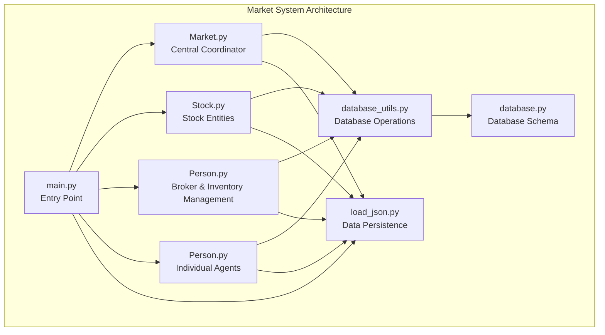
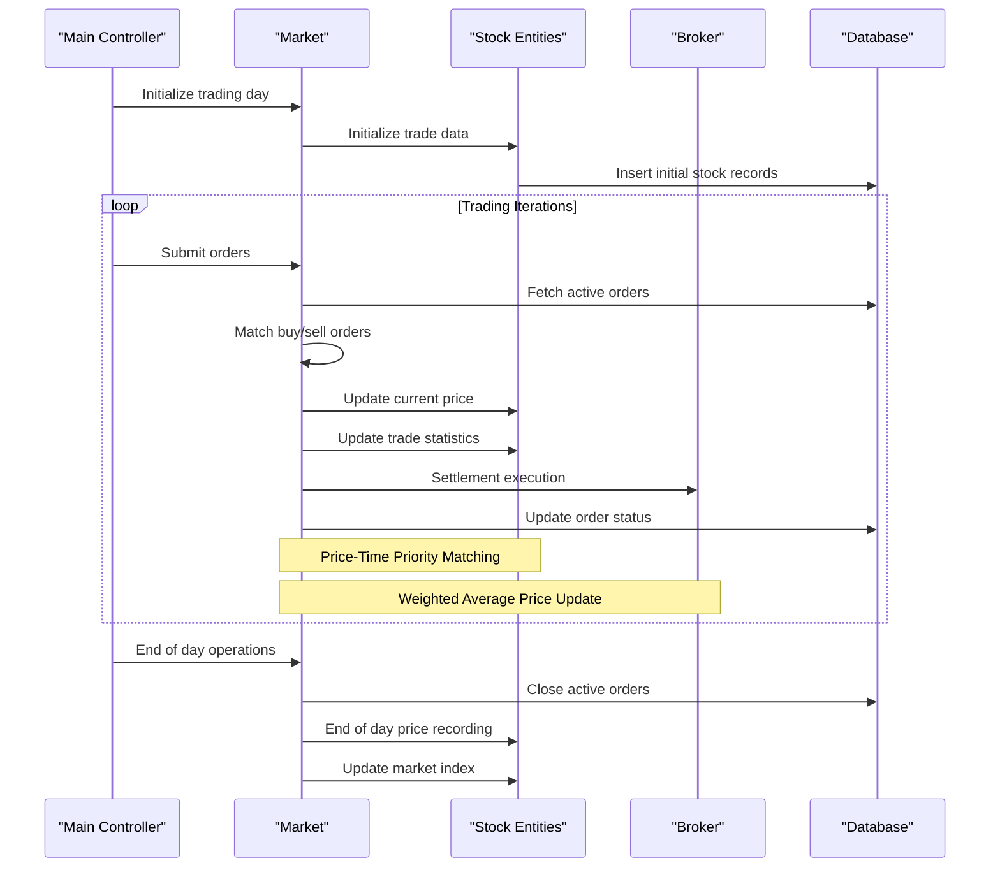
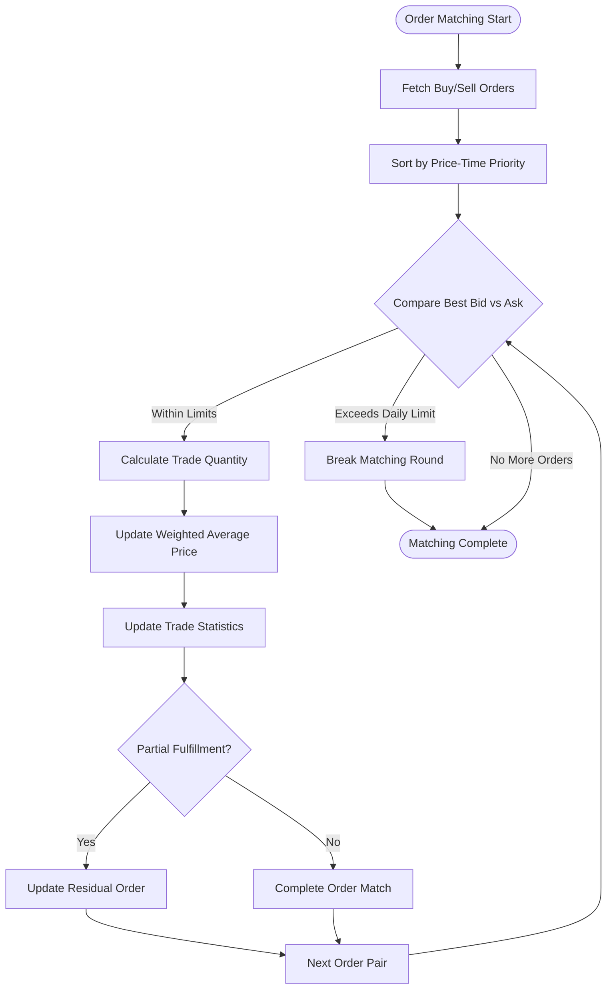
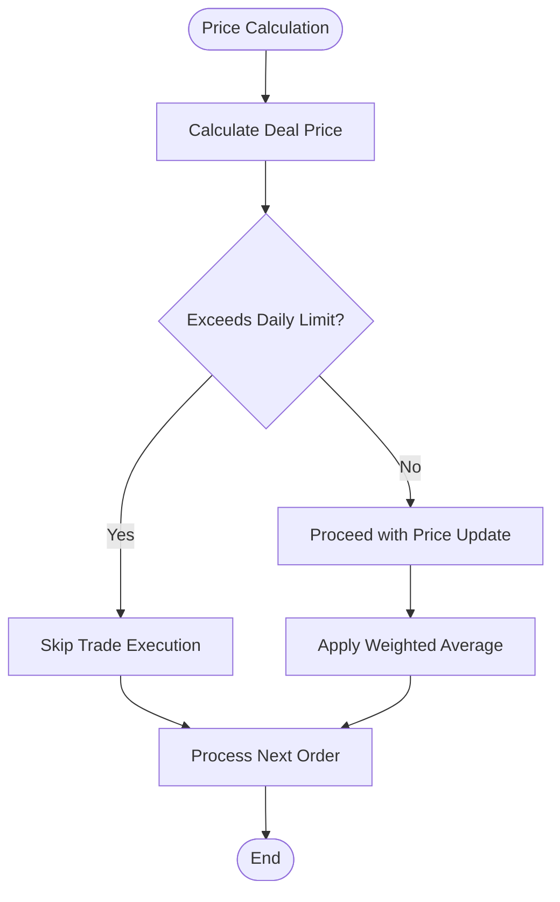
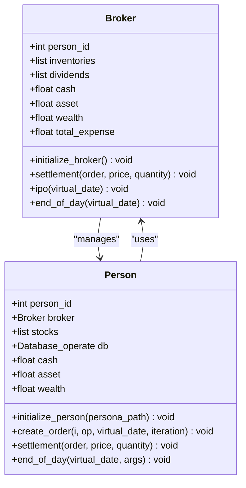
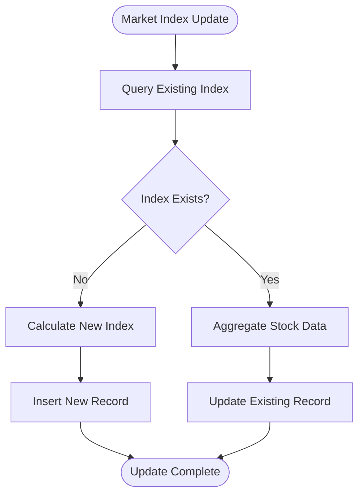
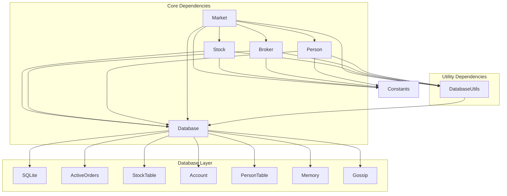

# Market System

<cite>
**Referenced Files in This Document**
- [Market.py](file://Agent-Trading-Arena/Stock_Main/Market.py)
- [Stock.py](file://Agent-Trading-Arena/Stock_Main/Stock.py)
- [Person.py](file://Agent-Trading-Arena/Stock_Main/Person.py)
- [main.py](file://Agent-Trading-Arena/Stock_Main/main.py)
- [database_utils.py](file://Agent-Trading-Arena/Stock_Main/database_utils.py)
- [database.py](file://Agent-Trading-Arena/Stock_Main/database.py)
- [load_json.py](file://Agent-Trading-Arena/Stock_Main/load_json.py)
</cite>

## Table of Contents
1. [Introduction](#introduction)
2. [Project Structure](#project-structure)
3. [Core Components](#core-components)
4. [Architecture Overview](#architecture-overview)
5. [Detailed Component Analysis](#detailed-component-analysis)
6. [Dependency Analysis](#dependency-analysis)
7. [Performance Considerations](#performance-considerations)
8. [Troubleshooting Guide](#troubleshooting-guide)
9. [Conclusion](#conclusion)

## Introduction
This document provides comprehensive architectural documentation for the Market system within the Agent Trading Arena simulation. The Market serves as the central coordinator for order matching and price formation, working in conjunction with Stock entities and the Broker for inventory management and settlement. The system implements a price-time priority matching algorithm with daily price limits to prevent extreme volatility, uses a weighted average formula for price updates incorporating a fluctuation constant, and manages market_index updates throughout trading days.

## Project Structure
The Market system follows a modular architecture with clear separation of concerns:



**Diagram sources**
- [main.py](file://Agent-Trading-Arena/Stock_Main/main.py#L84-L131)
- [Market.py](file://Agent-Trading-Arena/Stock_Main/Market.py#L12-L278)
- [Stock.py](file://Agent-Trading-Arena/Stock_Main/Stock.py#L14-L307)
- [Person.py](file://Agent-Trading-Arena/Stock_Main/Person.py#L18-L629)

**Section sources**
- [main.py](file://Agent-Trading-Arena/Stock_Main/main.py#L1-L136)
- [database_utils.py](file://Agent-Trading-Arena/Stock_Main/database_utils.py#L245-L322)

## Core Components

### Market Class
The Market class acts as the central coordinator for all trading activities. It manages order matching, price updates, and system-wide trading operations.

Key responsibilities:
- Order matching using price-time priority algorithm
- Price formation through weighted average calculations
- Daily price limit enforcement
- Market index updates
- Settlement coordination with Broker

### Stock Class
Represents individual stock entities with comprehensive price tracking and market data management.

Key responsibilities:
- Current price maintenance and historical tracking
- Daily price data updates (open, high, low, last)
- Intraday price list management
- Market index calculation and updates

### Broker Class
Manages inventory, settlement, and market operations as a specialized agent.

Key responsibilities:
- Initial public offering (IPO) operations
- Inventory tracking across all stocks
- Financial settlement for trades
- Dividend management
- Market liquidity provision

### Person Class
Represents individual trading agents with sophisticated trading behavior and portfolio management.

Key responsibilities:
- Order creation based on trading strategies
- Portfolio management and asset tracking
- Daily expense calculations and settlement
- Memory and reflection mechanisms

**Section sources**
- [Market.py](file://Agent-Trading-Arena/Stock_Main/Market.py#L12-L278)
- [Stock.py](file://Agent-Trading-Arena/Stock_Main/Stock.py#L14-L307)
- [Person.py](file://Agent-Trading-Arena/Stock_Main/Person.py#L18-L629)

## Architecture Overview



**Diagram sources**
- [main.py](file://Agent-Trading-Arena/Stock_Main/main.py#L95-L131)
- [Market.py](file://Agent-Trading-Arena/Stock_Main/Market.py#L96-L200)
- [Stock.py](file://Agent-Trading-Arena/Stock_Main/Stock.py#L52-L113)

The architecture demonstrates a clear separation between market coordination, entity management, and data persistence layers. The Market orchestrates all trading activities while maintaining loose coupling with Stock and Broker entities through well-defined interfaces.

## Detailed Component Analysis

### Market Order Matching Algorithm

The Market implements a sophisticated order matching system based on price-time priority:



**Diagram sources**
- [Market.py](file://Agent-Trading-Arena/Stock_Main/Market.py#L96-L199)

The algorithm ensures:
- **Price-Time Priority**: Buy orders sorted ascending by price, sell orders sorted descending by price
- **Daily Price Limits**: Prevents extreme volatility through configurable daily price limit enforcement
- **Weighted Average Updates**: Uses fluctuation constant for realistic price dynamics
- **Partial Order Fulfillment**: Handles unmatched quantities gracefully

### Price Update Mechanism

The Market employs a weighted average formula for price updates:

**Price Update Formula:**
```
New_Price = (Deal_Price × Quantity × Fluctuation_Constant + Old_Price × Total_Quantity) / (Quantity × Fluctuation_Constant + Total_Quantity)
```

Where:
- Deal_Price = (Buy_Price + Sell_Price) / 2
- Fluctuation_Constant = Configurable parameter controlling price sensitivity
- Quantity = Traded quantity in current match

This mechanism balances market sentiment with historical price stability, preventing excessive volatility while maintaining responsive price discovery.

### Daily Price Limits Implementation

The Market enforces daily price limits to prevent extreme volatility:



**Diagram sources**
- [Market.py](file://Agent-Trading-Arena/Stock_Main/Market.py#L112-L118)

The daily price limit prevents price jumps exceeding the configured threshold, ensuring market stability.

### Broker Inventory Management

The Broker maintains comprehensive inventory management:



**Diagram sources**
- [Person.py](file://Agent-Trading-Arena/Stock_Main/Person.py#L18-L629)

The Broker operates as a special agent with unlimited inventory for market liquidity provision, managing:
- IPO operations and initial inventory distribution
- Continuous settlement and cash flow management
- Dividend tracking and reporting
- Expense accounting and daily settlement

### Market Index Calculation

The Market_index class calculates and maintains market-wide performance metrics:



**Diagram sources**
- [Stock.py](file://Agent-Trading-Arena/Stock_Main/Stock.py#L227-L277)

The market index uses weighted averages based on stock book values, providing a comprehensive measure of overall market performance.

**Section sources**
- [Market.py](file://Agent-Trading-Arena/Stock_Main/Market.py#L96-L199)
- [Stock.py](file://Agent-Trading-Arena/Stock_Main/Stock.py#L212-L296)
- [Person.py](file://Agent-Trading-Arena/Stock_Main/Person.py#L18-L141)

## Dependency Analysis



**Diagram sources**
- [Market.py](file://Agent-Trading-Arena/Stock_Main/Market.py#L7-L8)
- [Stock.py](file://Agent-Trading-Arena/Stock_Main/Stock.py#L4-L10)
- [Person.py](file://Agent-Trading-Arena/Stock_Main/Person.py#L2-L16)

The dependency structure demonstrates:
- **High Cohesion**: Each component focuses on specific responsibilities
- **Low Coupling**: Components interact through well-defined interfaces
- **Database Abstraction**: All data operations go through Database_operate
- **Configuration Management**: Constants and parameters centralized in main controller

**Section sources**
- [database_utils.py](file://Agent-Trading-Arena/Stock_Main/database_utils.py#L245-L322)
- [main.py](file://Agent-Trading-Arena/Stock_Main/main.py#L16-L48)

## Performance Considerations

### Order Matching Efficiency
The Market uses efficient sorting and matching algorithms:
- **Time Complexity**: O(n log n) for order sorting, O(n) for matching
- **Memory Usage**: Minimal overhead through iterative processing
- **Database Optimization**: Indexed queries on active_orders table

### Price Update Optimization
Weighted average calculations minimize computational overhead:
- **Single Pass Updates**: Price updates calculated incrementally
- **Batch Processing**: Multiple matches processed in single transaction
- **Cache Utilization**: Recent price data cached in Stock entities

### Scalability Design
The system supports scalability through:
- **Modular Architecture**: Independent component development
- **Database Indexing**: Optimized queries for large datasets
- **Lazy Loading**: Objects loaded only when needed

## Troubleshooting Guide

### Common Issues and Solutions

**Issue**: Orders not matching despite price convergence
- **Cause**: Daily price limit exceeded
- **Solution**: Adjust Daily_Price_Limit parameter or wait for next trading cycle

**Issue**: Price volatility spikes
- **Cause**: Fluctuation_Constant too high
- **Solution**: Reduce Fluctuation_Constant value for more stable pricing

**Issue**: Broker inventory depletion
- **Cause**: Excessive market liquidity provision
- **Solution**: Monitor Broker.inventories and adjust IPO quantities

**Issue**: Database connection errors
- **Cause**: Concurrent access conflicts
- **Solution**: Ensure proper transaction handling and connection pooling

### Debugging Strategies

**Order Matching Debugging**:
1. Verify active_orders table contents
2. Check price-time priority sorting
3. Monitor daily price limit enforcement
4. Validate weighted average calculations

**Price Update Verification**:
1. Cross-reference deal_price calculations
2. Validate Fluctuation_Constant impact
3. Check total_quantity accumulation
4. Monitor intraday price list growth

**Settlement Validation**:
1. Confirm order status updates
2. Verify Broker inventory adjustments
3. Check Person account modifications
4. Validate cash flow calculations

**Section sources**
- [Market.py](file://Agent-Trading-Arena/Stock_Main/Market.py#L21-L95)
- [Stock.py](file://Agent-Trading-Arena/Stock_Main/Stock.py#L67-L113)
- [Person.py](file://Agent-Trading-Arena/Stock_Main/Person.py#L65-L141)

## Conclusion

The Market system demonstrates a robust, scalable architecture for simulating stock market operations. Its key strengths include:

**Architectural Excellence**:
- Clear separation of concerns with well-defined component boundaries
- Efficient order matching algorithm with price-time priority
- Comprehensive price update mechanism with volatility controls
- Robust settlement and inventory management through the Broker

**Design Strengths**:
- Modular design enabling easy extension and modification
- Comprehensive data persistence through SQLite database
- Realistic market simulation with configurable parameters
- Extensive logging and debugging capabilities

**System Reliability**:
- Daily price limits prevent extreme volatility
- Weighted average formulas ensure stable price formation
- Comprehensive settlement processes maintain financial accuracy
- Market index provides holistic market performance metrics

The system successfully balances computational efficiency with market realism, providing a solid foundation for agent-based trading simulations and market research applications.