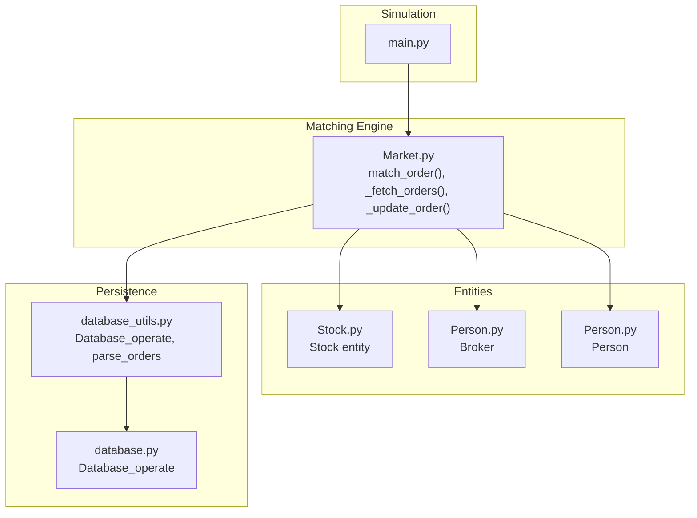
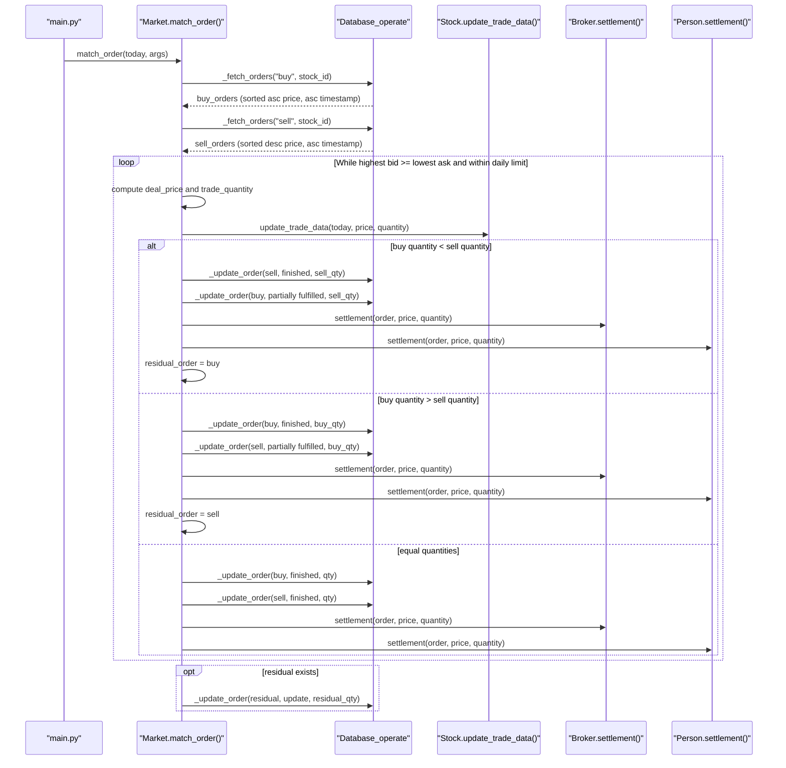
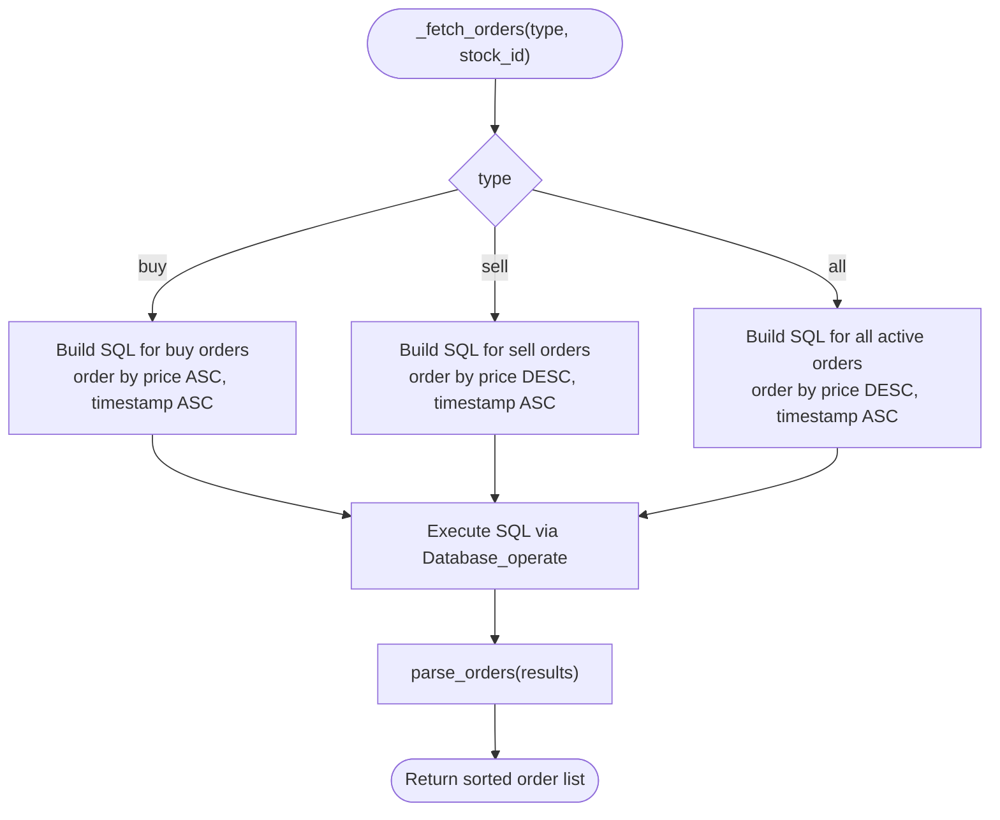
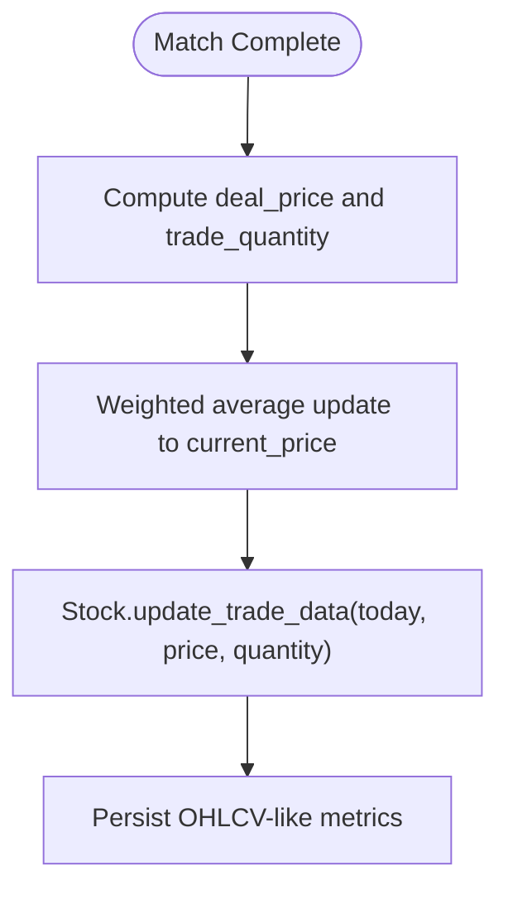
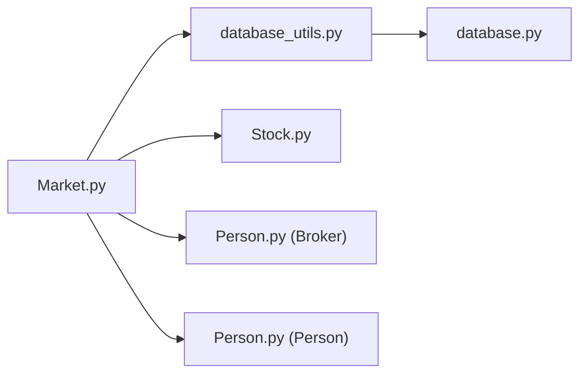

# Order Matching

<cite>
**Referenced Files in This Document**
- [Market.py](file://Agent-Trading-Arena/Stock_Main/Market.py)
- [Stock.py](file://Agent-Trading-Arena/Stock_Main/Stock.py)
- [Person.py](file://Agent-Trading-Arena/Stock_Main/Person.py)
- [database_utils.py](file://Agent-Trading-Arena/Stock_Main/database_utils.py)
- [database.py](file://Agent-Trading-Arena/Stock_Main/database.py)
- [main.py](file://Agent-Trading-Arena/Stock_Main/main.py)
- [load_json.py](file://Agent-Trading-Arena/Stock_Main/load_json.py)
</cite>

## Table of Contents
1. [Introduction](#introduction)
2. [Project Structure](#project-structure)
3. [Core Components](#core-components)
4. [Architecture Overview](#architecture-overview)
5. [Detailed Component Analysis](#detailed-component-analysis)
6. [Dependency Analysis](#dependency-analysis)
7. [Performance Considerations](#performance-considerations)
8. [Troubleshooting Guide](#troubleshooting-guide)
9. [Conclusion](#conclusion)

## Introduction
This document explains the order matching sub-system that powers price-time priority-driven trades among buy and sell orders. It focuses on the match_order method, detailing how buy orders are sorted ascending by price and sell orders descending by price, how the system iteratively matches the highest bid with the lowest ask until price limits are exceeded, and how partial order fulfillment is handled when inventory is insufficient. It also documents the _fetch_orders method’s role in retrieving and sorting active orders from the database, describes the interaction between Market and Stock entities during price updates after each match, and addresses common issues such as order book imbalance and residual orders. Finally, it provides performance considerations for scaling the matching engine with larger order volumes.

## Project Structure
The order matching subsystem resides primarily in the Market module and interacts with Stock, Person/Broker, and database utilities. The main simulation orchestration invokes Market.match_order each iteration to process active orders and update market state.

**Diagram sources**
- [main.py](file://Agent-Trading-Arena/Stock_Main/main.py#L102-L111)
- [Market.py](file://Agent-Trading-Arena/Stock_Main/Market.py#L96-L228)
- [Stock.py](file://Agent-Trading-Arena/Stock_Main/Stock.py#L67-L112)
- [Person.py](file://Agent-Trading-Arena/Stock_Main/Person.py#L18-L141)
- [database_utils.py](file://Agent-Trading-Arena/Stock_Main/database_utils.py#L245-L322)
- [database.py](file://Agent-Trading-Arena/Stock_Main/database.py#L44-L82)

**Section sources**
- [main.py](file://Agent-Trading-Arena/Stock_Main/main.py#L102-L111)
- [Market.py](file://Agent-Trading-Arena/Stock_Main/Market.py#L96-L228)

## Core Components
- Market.match_order: Implements the price-time priority matching loop across all stocks, fetching sorted buy/sell orders, computing deal price, updating stock price and intraday trade data, and handling partial/full fills and residuals.
- Market._fetch_orders: Retrieves active orders from the database, sorts buy orders ascending by price and timestamp, and sorts sell orders descending by price with timestamp tie-breaker. Also supports “all” fetch for end-of-day/end-of-market cleanup.
- Market._update_order: Updates order statuses and quantities in the database, triggers individual settlement for traders, and inserts partially fulfilled orders as new records when necessary.
- Stock.update_trade_data: Aggregates intraday OHLCV-like metrics and updates the stock ledger for the current trading day.
- Person/Broker settlement: Handles financial settlement for both retail traders and the broker, updating cash, assets, inventories, and account holdings.

**Section sources**
- [Market.py](file://Agent-Trading-Arena/Stock_Main/Market.py#L96-L265)
- [Stock.py](file://Agent-Trading-Arena/Stock_Main/Stock.py#L67-L112)
- [Person.py](file://Agent-Trading-Arena/Stock_Main/Person.py#L65-L97)

## Architecture Overview
The matching engine operates per stock, iterating through buy and sell queues derived from the database. Price updates are computed using a weighted formula that incorporates deal volume and a fluctuation constant, then propagated to the Stock entity for daily OHLCV aggregation. After each match, order statuses are updated and residuals are re-inserted as active orders when applicable.

**Diagram sources**
- [main.py](file://Agent-Trading-Arena/Stock_Main/main.py#L102-L111)
- [Market.py](file://Agent-Trading-Arena/Stock_Main/Market.py#L96-L198)
- [Stock.py](file://Agent-Trading-Arena/Stock_Main/Stock.py#L67-L112)
- [Person.py](file://Agent-Trading-Arena/Stock_Main/Person.py#L65-L97)

## Detailed Component Analysis

### Price-Time Priority Matching Algorithm
- Buy orders are sorted ascending by price and timestamp to prioritize lower prices and earlier submissions.
- Sell orders are sorted descending by price and timestamp to prioritize higher prices and earlier submissions.
- The algorithm computes a deal price as the midpoint of the top buy and top sell prices and checks against the daily price limit. If the deal price deviates beyond the allowed threshold, matching stops for that stock.
- Trade quantity is the minimum of the top buy and sell quantities. The stock’s current price is updated using a weighted average formula incorporating deal volume and a fluctuation constant, then persisted via Stock.update_trade_data.

Key behaviors:
- Partial fulfillment: When one side has smaller quantity, the matched amount equals the smaller side, and the remaining side becomes a residual order.
- Residual handling: The residual order is re-inserted as an active order with updated quantity and status.
- End-of-market fallback: Unmatched orders are closed or partially fulfilled depending on availability and price limits.

**Section sources**
- [Market.py](file://Agent-Trading-Arena/Stock_Main/Market.py#L96-L198)
- [Stock.py](file://Agent-Trading-Arena/Stock_Main/Stock.py#L67-L112)

### Fetching and Sorting Active Orders
- _fetch_orders retrieves active orders filtered by type and stock_id, then applies SQL ORDER BY clauses to achieve price-time priority:
  - Buy orders: price ASC, timestamp ASC
  - Sell orders: price DESC, timestamp ASC
  - All orders: price DESC, timestamp ASC (used for end-of-day/end-of-market)
- Results are parsed into normalized order dictionaries via parse_orders and returned as Python lists for efficient in-memory processing.

**Diagram sources**
- [Market.py](file://Agent-Trading-Arena/Stock_Main/Market.py#L202-L228)
- [database_utils.py](file://Agent-Trading-Arena/Stock_Main/database_utils.py#L73-L94)

**Section sources**
- [Market.py](file://Agent-Trading-Arena/Stock_Main/Market.py#L202-L228)
- [database_utils.py](file://Agent-Trading-Arena/Stock_Main/database_utils.py#L73-L94)

### Partial Order Fulfillment and Residual Orders
- When a buy order’s quantity is less than a sell order’s quantity, the buy is fully executed and the sell becomes a residual order with the remaining quantity.
- When a sell order’s quantity is less than a buy order’s quantity, the sell is fully executed and the buy becomes a residual order with the remaining quantity.
- When quantities are equal, both orders are fully executed.
- Residual orders are updated back to the database with status “update” and the reduced quantity.

Concrete example paths:
- Partial buy: [Market.py](file://Agent-Trading-Arena/Stock_Main/Market.py#L135-L155)
- Partial sell: [Market.py](file://Agent-Trading-Arena/Stock_Main/Market.py#L157-L174)
- Equal quantities: [Market.py](file://Agent-Trading-Arena/Stock_Main/Market.py#L176-L192)
- Residual update: [Market.py](file://Agent-Trading-Arena/Stock_Main/Market.py#L195-L198)

**Section sources**
- [Market.py](file://Agent-Trading-Arena/Stock_Main/Market.py#L135-L198)

### Price Updates and Stock Entity Interaction
- After each match, the stock’s current price is updated using a weighted average formula that blends the deal price with prior stock value, scaled by deal quantity and a fluctuation constant.
- Stock.update_trade_data aggregates intraday metrics (volume, quantity, high, low, last) and persists them to the stock ledger for the current trading day.

**Diagram sources**
- [Market.py](file://Agent-Trading-Arena/Stock_Main/Market.py#L120-L131)
- [Stock.py](file://Agent-Trading-Arena/Stock_Main/Stock.py#L67-L112)

**Section sources**
- [Market.py](file://Agent-Trading-Arena/Stock_Main/Market.py#L120-L131)
- [Stock.py](file://Agent-Trading-Arena/Stock_Main/Stock.py#L67-L112)

### End-of-Market and End-of-Day Cleanup
- End-of-market: Iterates through all active orders, computes a deal price as the midpoint between current stock price and order price, enforces daily price limit, checks broker inventory, and either closes or partially fulfills orders. Remaining quantities are re-inserted as active orders.
- End-of-day: Closes all active orders for the day.

**Section sources**
- [Market.py](file://Agent-Trading-Arena/Stock_Main/Market.py#L21-L28)
- [Market.py](file://Agent-Trading-Arena/Stock_Main/Market.py#L30-L95)

### Order Status Updates and Settlement
- _update_order handles three modes:
  - finished: Fully executed order; quantity is zeroed and status set to finished.
  - partially fulfilled: Inserts a new finished order record with the executed quantity and updates the original order’s quantity to remaining amount.
  - update: Updates the quantity of a residual order without changing status.
- Settlement:
  - Person.settlement adjusts cash, asset, and account holdings for individuals.
  - Broker.settlement adjusts cash, dividends, asset, and inventories for the broker.

**Section sources**
- [Market.py](file://Agent-Trading-Arena/Stock_Main/Market.py#L230-L265)
- [Person.py](file://Agent-Trading-Arena/Stock_Main/Person.py#L65-L97)

## Dependency Analysis
The matching engine depends on:
- Database layer for persistence and retrieval of active orders and stock state.
- Stock entity for price updates and OHLCV aggregation.
- Person/Broker for financial settlement and inventory adjustments.

**Diagram sources**
- [Market.py](file://Agent-Trading-Arena/Stock_Main/Market.py#L7-L8)
- [database_utils.py](file://Agent-Trading-Arena/Stock_Main/database_utils.py#L245-L322)
- [database.py](file://Agent-Trading-Arena/Stock_Main/database.py#L44-L82)
- [Stock.py](file://Agent-Trading-Arena/Stock_Main/Stock.py#L14-L26)
- [Person.py](file://Agent-Trading-Arena/Stock_Main/Person.py#L18-L60)

**Section sources**
- [Market.py](file://Agent-Trading-Arena/Stock_Main/Market.py#L7-L8)
- [database_utils.py](file://Agent-Trading-Arena/Stock_Main/database_utils.py#L245-L322)
- [Stock.py](file://Agent-Trading-Arena/Stock_Main/Stock.py#L14-L26)
- [Person.py](file://Agent-Trading-Arena/Stock_Main/Person.py#L18-L60)

## Performance Considerations
- Database queries:
  - _fetch_orders uses ORDER BY price and timestamp, which benefits from appropriate indices on type, stock_id, status, price, and timestamp. Without indices, large order books will incur significant sorting overhead.
  - Consider adding composite indexes for active_orders(type, stock_id, status, price, timestamp) and (stock_id, status, price, timestamp) to accelerate sorting and filtering.
- In-memory processing:
  - buy_orders and sell_orders are popped from the end after each match; ensure these remain Python lists or use collections.deque for O(1) pops to avoid shifting costs.
- Batch operations:
  - Group multiple _update_order calls per iteration to reduce commit overhead.
- Price limit enforcement:
  - Early exit on daily price limit prevents unnecessary computation when the market is outside allowable bands.
- Scalability:
  - For very large order volumes, consider partitioning active_orders by stock_id and date, and pre-sorting orders server-side to minimize repeated SQL sorts.
  - Offload heavy computations (e.g., weighted averages) to vectorized operations if orders are represented as arrays.

[No sources needed since this section provides general guidance]

## Troubleshooting Guide
Common issues and remedies:
- Order book imbalance:
  - Excess buy or sell orders can lead to frequent partial fills and residual orders. Monitor order book depth and adjust Fluctuation_Constant and Daily_Price_Limit to stabilize price movements.
- Price limit exceeded:
  - If deal price exceeds the daily price limit, matching halts for that stock. Verify Daily_Price_Limit configuration and consider adjusting for volatile scenarios.
- Inventory constraints:
  - Broker inventory may prevent full fulfillment of buy orders. Ensure sufficient initial inventory and monitor broker inventories post-IP0.
- Residual orders not appearing:
  - Confirm that residual orders are updated with status “update” and non-zero quantity. Check _update_order logic for “update” mode.
- Settlement discrepancies:
  - Verify Person/Broker settlement calculations for cash and asset changes after each match. Ensure order quantities and prices are correctly passed to settlement routines.

**Section sources**
- [Market.py](file://Agent-Trading-Arena/Stock_Main/Market.py#L113-L117)
- [Market.py](file://Agent-Trading-Arena/Stock_Main/Market.py#L195-L198)
- [Person.py](file://Agent-Trading-Arena/Stock_Main/Person.py#L65-L97)

## Conclusion
The order matching sub-system implements a robust price-time priority mechanism with explicit handling of partial fills and residual orders. By leveraging database-backed sorting and weighted price updates, it maintains realistic market dynamics while preserving financial integrity through individual and broker settlements. Proper indexing, batch updates, and careful tuning of price limits and fluctuation constants are essential for performance and stability at scale.