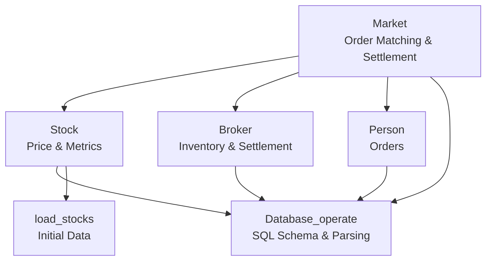
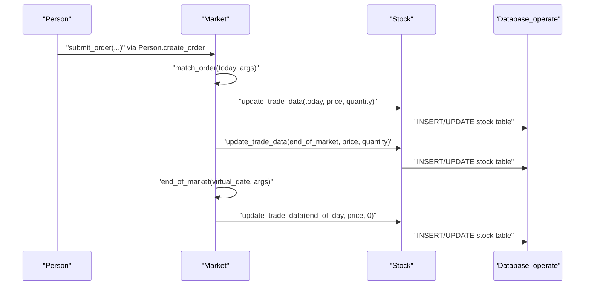
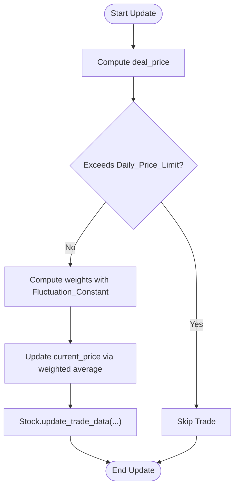
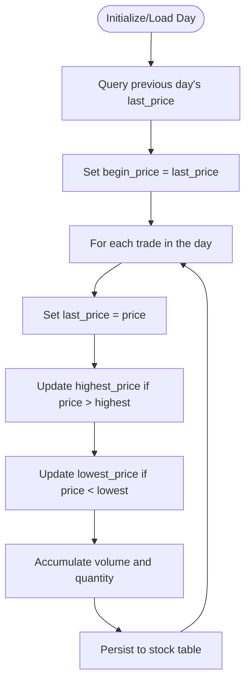
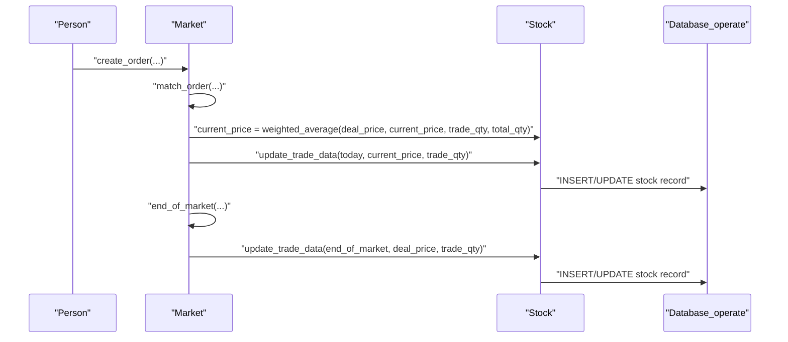
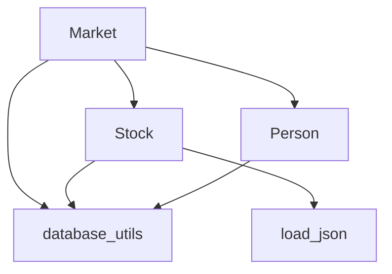

# Price Formation

<cite>
**Referenced Files in This Document**
- [main.py](file://Agent-Trading-Arena/Stock_Main/main.py)
- [Market.py](file://Agent-Trading-Arena/Stock_Main/Market.py)
- [Stock.py](file://Agent-Trading-Arena/Stock_Main/Stock.py)
- [database_utils.py](file://Agent-Trading-Arena/Stock_Main/database_utils.py)
- [load_json.py](file://Agent-Trading-Arena/Stock_Main/load_json.py)
- [Person.py](file://Agent-Trading-Arena/Stock_Main/Person.py)
- [test_market.py](file://Agent-Trading-Arena/Stock_Main/unit_test/test_market.py)
- [test_stock.py](file://Agent-Trading-Arena/Stock_Main/unit_test/test_stock.py)
</cite>

## Table of Contents
1. [Introduction](#introduction)
2. [Project Structure](#project-structure)
3. [Core Components](#core-components)
4. [Architecture Overview](#architecture-overview)
5. [Detailed Component Analysis](#detailed-component-analysis)
6. [Dependency Analysis](#dependency-analysis)
7. [Performance Considerations](#performance-considerations)
8. [Troubleshooting Guide](#troubleshooting-guide)
9. [Conclusion](#conclusion)

## Introduction
This document explains the price formation mechanism in the trading simulation. It covers how stock prices are updated during order matching and at the end of the market session, the weighted average formula used, the role of the Fluctuation_Constant parameter, and how daily price limits constrain trades. It also documents how intraday metrics (highest, lowest, last) are maintained and updated, and illustrates price evolution through multiple trades. Edge cases such as zero-quantity trades are addressed.

## Project Structure
The price formation logic spans several modules:
- Market orchestrates order matching and end-of-market settlement, applying the weighted average update and daily price limit checks.
- Stock encapsulates per-stock state and maintains intraday metrics and daily OHLCV-like records.
- database_utils defines the schema and parsing utilities for the stock table.
- load_json initializes stock metadata and sets the baseline current price.
- Person creates orders and triggers the market workflow.
- Tests validate the weighted average update and daily price limit behavior.

**Diagram sources**
- [Market.py](file://Agent-Trading-Arena/Stock_Main/Market.py#L12-L278)
- [Stock.py](file://Agent-Trading-Arena/Stock_Main/Stock.py#L14-L307)
- [database_utils.py](file://Agent-Trading-Arena/Stock_Main/database_utils.py#L245-L322)
- [load_json.py](file://Agent-Trading-Arena/Stock_Main/load_json.py#L17-L22)
- [Person.py](file://Agent-Trading-Arena/Stock_Main/Person.py#L18-L629)

**Section sources**
- [main.py](file://Agent-Trading-Arena/Stock_Main/main.py#L1-L136)
- [Market.py](file://Agent-Trading-Arena/Stock_Main/Market.py#L12-L278)
- [Stock.py](file://Agent-Trading-Arena/Stock_Main/Stock.py#L14-L307)
- [database_utils.py](file://Agent-Trading-Arena/Stock_Main/database_utils.py#L245-L322)
- [load_json.py](file://Agent-Trading-Arena/Stock_Main/load_json.py#L17-L22)
- [Person.py](file://Agent-Trading-Arena/Stock_Main/Person.py#L18-L629)

## Core Components
- Market.price_update_formula: Weighted average update combining the deal price with the prior stock price, controlled by Fluctuation_Constant and the traded quantity vs. total outstanding shares.
- Market.daily_price_limit_check: Prevents trades that exceed a threshold percentage from the current price.
- Stock.update_trade_data: Maintains intraday metrics (highest, lowest, last) and writes daily OHLC-like records.
- Stock.query_intraday_percentage: Computes intraday change percentage.
- Stock.query_daily_return: Retrieves recent daily prices for reporting.
- Market.match_order and Market.end_of_market: Drive the two update points in a trading iteration.

**Section sources**
- [Market.py](file://Agent-Trading-Arena/Stock_Main/Market.py#L30-L95)
- [Stock.py](file://Agent-Trading-Arena/Stock_Main/Stock.py#L67-L138)
- [main.py](file://Agent-Trading-Arena/Stock_Main/main.py#L29-L32)

## Architecture Overview
The price formation pipeline connects order creation, matching, and settlement to stock price updates and metric maintenance.

**Diagram sources**
- [Person.py](file://Agent-Trading-Arena/Stock_Main/Person.py#L212-L249)
- [Market.py](file://Agent-Trading-Arena/Stock_Main/Market.py#L96-L200)
- [Stock.py](file://Agent-Trading-Arena/Stock_Main/Stock.py#L67-L138)

## Detailed Component Analysis

### Weighted Average Price Update Formula
During order matching and end-of-market settlement, the stock’s current price is updated using a weighted average that blends the deal price with the previous current price. The formula is parameterized by:
- trade_quantity: the quantity matched in the current event
- total_quantity: the total outstanding shares for the stock
- deal_price: the price used to compute the weighted average
- Fluctuation_Constant: a tunable parameter controlling the influence of new trades

Key implementation points:
- Order matching: The deal price is the midpoint of the buyer and seller limit prices. The current price is updated using the weighted average formula with Fluctuation_Constant and trade_quantity.
- End-of-market: The deal price is the midpoint between the current stock price and the order’s limit price. The same weighted average formula applies.

Edge cases handled:
- Zero-quantity trades: The update proceeds only if trade_quantity > 0. Otherwise, the order is skipped.
- Insufficient broker inventory: Partial fulfillment adjusts trade_quantity and leaves the remainder active.

**Diagram sources**
- [Market.py](file://Agent-Trading-Arena/Stock_Main/Market.py#L112-L127)
- [Market.py](file://Agent-Trading-Arena/Stock_Main/Market.py#L42-L67)
- [Stock.py](file://Agent-Trading-Arena/Stock_Main/Stock.py#L67-L112)

**Section sources**
- [Market.py](file://Agent-Trading-Arena/Stock_Main/Market.py#L96-L199)
- [Market.py](file://Agent-Trading-Arena/Stock_Main/Market.py#L30-L95)
- [main.py](file://Agent-Trading-Arena/Stock_Main/main.py#L29-L32)

### Daily Price Limits
The system enforces a daily price limit to cap intraday volatility. The check compares the absolute percentage difference between the deal price and the current stock price against the configured Daily_Price_Limit. If exceeded, the trade is skipped.

- Order matching: The deal price is the midpoint of buyer and seller prices.
- End-of-market: The deal price is the midpoint between the current stock price and the order’s limit price.

This mechanism prevents extreme moves in a single iteration.

**Section sources**
- [Market.py](file://Agent-Trading-Arena/Stock_Main/Market.py#L113-L117)
- [Market.py](file://Agent-Trading-Arena/Stock_Main/Market.py#L44-L47)

### Intraday Metrics Maintenance
Stock.update_trade_data maintains and updates intraday metrics for each trading day:
- begin_price: initialized from the last price of the previous day
- highest_price: updated to the maximum of current price and previous highest
- lowest_price: updated to the minimum of current price and previous lowest
- last_price: set to the current price after each update
- volume: cumulative trade value (price × quantity)
- quantity: cumulative trade quantity

These values are persisted to the stock table and can be queried for intraday percentage change and daily returns.

**Diagram sources**
- [Stock.py](file://Agent-Trading-Arena/Stock_Main/Stock.py#L28-L51)
- [Stock.py](file://Agent-Trading-Arena/Stock_Main/Stock.py#L67-L112)
- [database_utils.py](file://Agent-Trading-Arena/Stock_Main/database_utils.py#L265-L269)

**Section sources**
- [Stock.py](file://Agent-Trading-Arena/Stock_Main/Stock.py#L67-L138)
- [database_utils.py](file://Agent-Trading-Arena/Stock_Main/database_utils.py#L52-L70)

### Data Flow from Executed Trades to Price Updates
The end-to-end flow from order creation to price updates:

**Diagram sources**
- [Person.py](file://Agent-Trading-Arena/Stock_Main/Person.py#L212-L249)
- [Market.py](file://Agent-Trading-Arena/Stock_Main/Market.py#L96-L199)
- [Stock.py](file://Agent-Trading-Arena/Stock_Main/Stock.py#L67-L112)

**Section sources**
- [Person.py](file://Agent-Trading-Arena/Stock_Main/Person.py#L212-L249)
- [Market.py](file://Agent-Trading-Arena/Stock_Main/Market.py#L96-L199)
- [Stock.py](file://Agent-Trading-Arena/Stock_Main/Stock.py#L67-L112)

### Examples: Price Evolution Through Multiple Trades
- Example 1: Two consecutive buy trades increase the price via the weighted average update.
- Example 2: A sell trade reduces the price while respecting the daily price limit.
- Example 3: End-of-market settlement uses the midpoint between current price and order price to update.

These scenarios are validated by unit tests that assert price changes and order closure behavior.

**Section sources**
- [test_market.py](file://Agent-Trading-Arena/Stock_Main/unit_test/test_market.py#L95-L145)
- [test_stock.py](file://Agent-Trading-Arena/Stock_Main/unit_test/test_stock.py#L65-L94)

### Impact of Fluctuation_Constant on Price Stability
- Higher Fluctuation_Constant: New trades have stronger influence on the current price, increasing short-term volatility.
- Lower Fluctuation_Constant: Past price dominates, reducing sensitivity to new trades and increasing stability.
- Combined with trade_quantity vs. total_quantity: Larger trades relative to total supply amplify price changes; smaller trades have less impact.

**Section sources**
- [Market.py](file://Agent-Trading-Arena/Stock_Main/Market.py#L124-L127)
- [Market.py](file://Agent-Trading-Arena/Stock_Main/Market.py#L64-L67)
- [main.py](file://Agent-Trading-Arena/Stock_Main/main.py#L31-L32)

### Edge Cases
- Zero-quantity trades: Orders with quantity ≤ 0 are skipped in both matching and end-of-market processing.
- Insufficient broker inventory: Partial fulfillment occurs, leaving the remainder order active.
- Daily price limit exceeded: Trades are skipped to prevent excessive intraday moves.
- First trade of the day: begin_price is initialized from the previous day’s last_price; intraday metrics are seeded accordingly.

**Section sources**
- [Market.py](file://Agent-Trading-Arena/Stock_Main/Market.py#L51-L53)
- [Market.py](file://Agent-Trading-Arena/Stock_Main/Market.py#L113-L117)
- [Stock.py](file://Agent-Trading-Arena/Stock_Main/Stock.py#L28-L51)

## Dependency Analysis
The price formation mechanism depends on:
- Market: orchestrates updates and applies constraints.
- Stock: holds state and persists metrics.
- database_utils: defines the stock table schema and parsing helpers.
- load_json: supplies initial stock metadata and baseline price.
- Person: generates orders that trigger updates.

**Diagram sources**
- [Market.py](file://Agent-Trading-Arena/Stock_Main/Market.py#L12-L278)
- [Stock.py](file://Agent-Trading-Arena/Stock_Main/Stock.py#L14-L307)
- [database_utils.py](file://Agent-Trading-Arena/Stock_Main/database_utils.py#L245-L322)
- [load_json.py](file://Agent-Trading-Arena/Stock_Main/load_json.py#L17-L22)
- [Person.py](file://Agent-Trading-Arena/Stock_Main/Person.py#L18-L629)

**Section sources**
- [Market.py](file://Agent-Trading-Arena/Stock_Main/Market.py#L12-L278)
- [Stock.py](file://Agent-Trading-Arena/Stock_Main/Stock.py#L14-L307)
- [database_utils.py](file://Agent-Trading-Arena/Stock_Main/database_utils.py#L245-L322)
- [load_json.py](file://Agent-Trading-Arena/Stock_Main/load_json.py#L17-L22)
- [Person.py](file://Agent-Trading-Arena/Stock_Main/Person.py#L18-L629)

## Performance Considerations
- Weighted average computation is O(1) per trade; the dominant cost is SQL INSERT/UPDATE operations.
- Daily price limit checks add minimal overhead but prevent unnecessary updates.
- Intraday metrics updates occur per trade; batching updates could reduce database writes if needed.

## Troubleshooting Guide
- Price not updating: Verify that trade_quantity > 0 and that the daily price limit is not exceeded.
- Unexpected price spikes: Reduce Fluctuation_Constant or ensure sufficient total_quantity relative to trade_quantity.
- Intraday metrics incorrect: Confirm that begin_price is initialized from the previous day’s last_price and that update_trade_data is invoked for each trade.

**Section sources**
- [Market.py](file://Agent-Trading-Arena/Stock_Main/Market.py#L113-L117)
- [Stock.py](file://Agent-Trading-Arena/Stock_Main/Stock.py#L28-L51)
- [Stock.py](file://Agent-Trading-Arena/Stock_Main/Stock.py#L67-L112)

## Conclusion
The price formation mechanism combines a weighted average update with daily price limits and a tunable Fluctuation_Constant to balance responsiveness and stability. Intraday metrics are maintained consistently through the Stock.update_trade_data method, and the Market coordinates updates during order matching and end-of-market settlement. Unit tests confirm the expected behavior under various scenarios, including partial fulfillment and daily price limit enforcement.