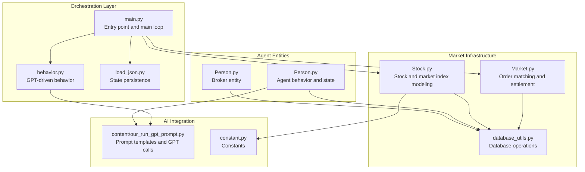
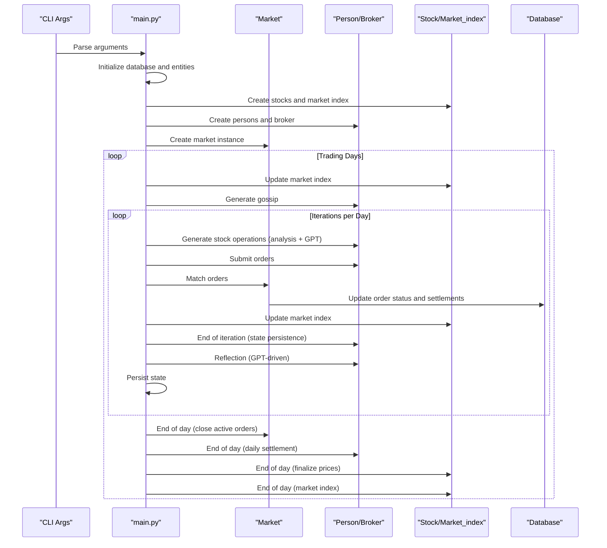
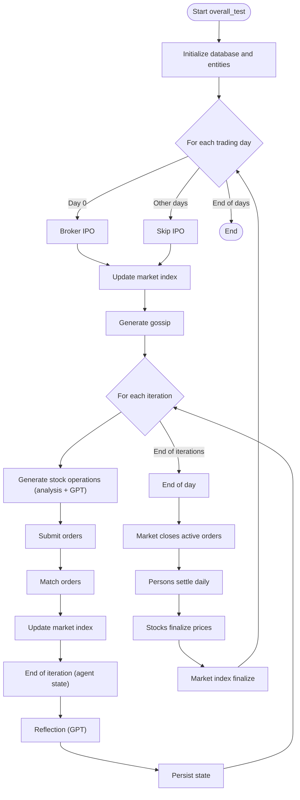
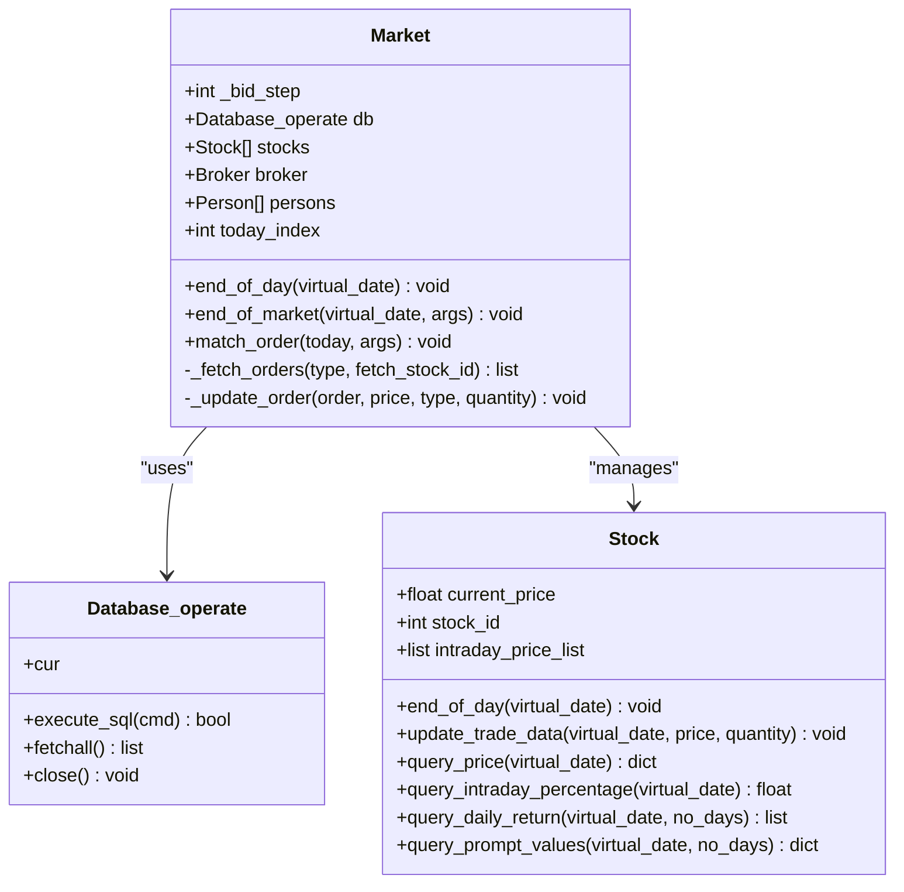
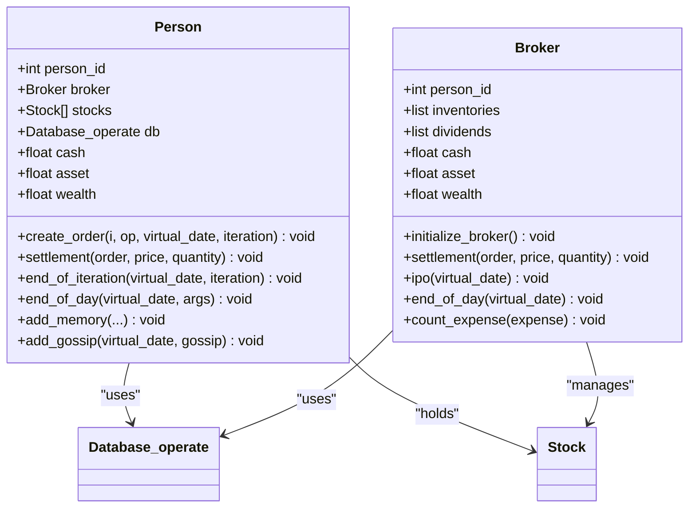
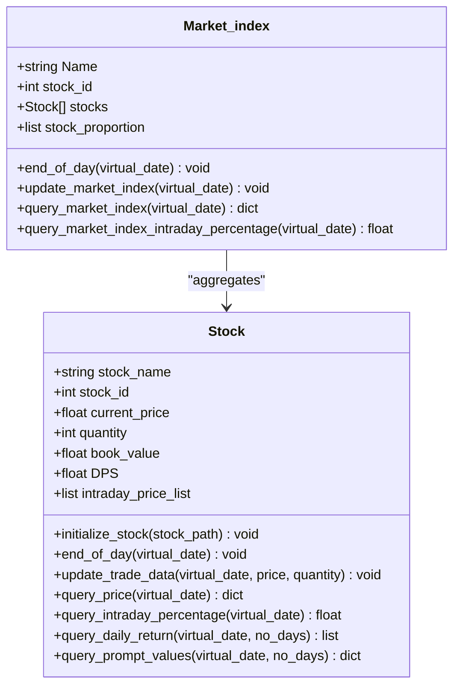
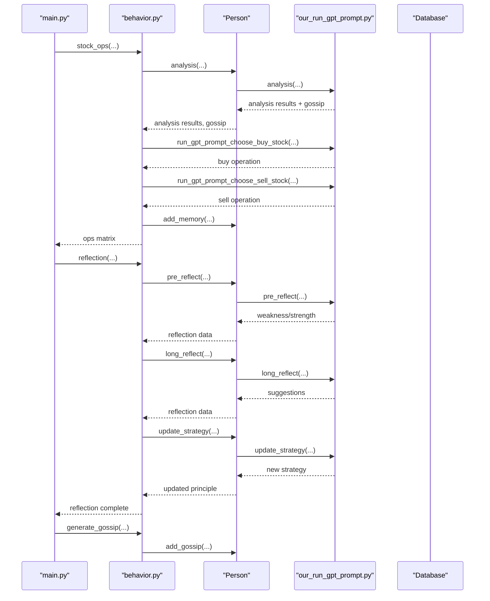
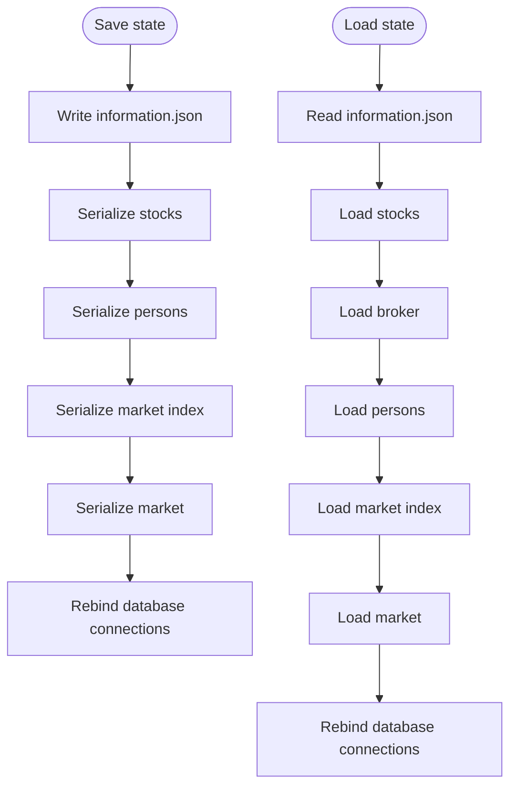
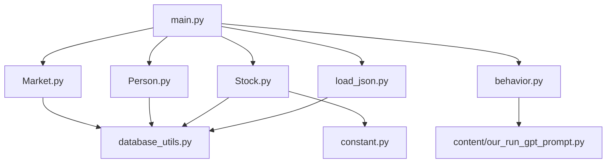

# Simulation Orchestration

<cite>
**Referenced Files in This Document**
- [main.py](file://Agent-Trading-Arena/Stock_Main/main.py)
- [Market.py](file://Agent-Trading-Arena/Stock_Main/Market.py)
- [Person.py](file://Agent-Trading-Arena/Stock_Main/Person.py)
- [Stock.py](file://Agent-Trading-Arena/Stock_Main/Stock.py)
- [behavior.py](file://Agent-Trading-Arena/Stock_Main/behavior.py)
- [database_utils.py](file://Agent-Trading-Arena/Stock_Main/database_utils.py)
- [load_json.py](file://Agent-Trading-Arena/Stock_Main/load_json.py)
- [constant.py](file://Agent-Trading-Arena/Stock_Main/constant.py)
- [our_run_gpt_prompt.py](file://Agent-Trading-Arena/Stock_Main/content/our_run_gpt_prompt.py)
</cite>

## Table of Contents
1. [Introduction](#introduction)
2. [Project Structure](#project-structure)
3. [Core Components](#core-components)
4. [Architecture Overview](#architecture-overview)
5. [Detailed Component Analysis](#detailed-component-analysis)
6. [Dependency Analysis](#dependency-analysis)
7. [Performance Considerations](#performance-considerations)
8. [Troubleshooting Guide](#troubleshooting-guide)
9. [Conclusion](#conclusion)

## Introduction
This document describes the simulation orchestration system for an agent-based trading arena. The system operates on a discrete-time model where each trading day comprises multiple iterative cycles of market analysis, order submission, matching, and settlement. The orchestration is driven by a central main loop that coordinates Market, Person, and Stock entities, with command-line arguments controlling simulation parameters such as trading iterations per day, number of trading days, agent count, and stock count.

The simulation emphasizes event-driven behavior with explicit state transitions at the end of each iteration and day. It integrates AI-driven decision-making through GPT prompts for market analysis, order generation, reflection, and gossip propagation, while maintaining a persistent state through an SQLite-backed database.

## Project Structure
The simulation is organized around a modular Python package with clear separation of concerns:
- Entry point and orchestration: main.py
- Market infrastructure: Market.py
- Agent entities: Person.py (including Broker)
- Asset modeling: Stock.py (including Market_index)
- Behavior orchestration: behavior.py
- Data persistence: database_utils.py, load_json.py
- Configuration constants: constant.py
- Prompt templates and GPT integration: content/our_run_gpt_prompt.py

**Diagram sources**
- [main.py](file://Agent-Trading-Arena/Stock_Main/main.py#L84-L136)
- [Market.py](file://Agent-Trading-Arena/Stock_Main/Market.py#L12-L278)
- [Person.py](file://Agent-Trading-Arena/Stock_Main/Person.py#L18-L629)
- [Stock.py](file://Agent-Trading-Arena/Stock_Main/Stock.py#L14-L307)
- [behavior.py](file://Agent-Trading-Arena/Stock_Main/behavior.py#L82-L210)
- [database_utils.py](file://Agent-Trading-Arena/Stock_Main/database_utils.py#L245-L322)
- [load_json.py](file://Agent-Trading-Arena/Stock_Main/load_json.py#L45-L122)
- [our_run_gpt_prompt.py](file://Agent-Trading-Arena/Stock_Main/content/our_run_gpt_prompt.py#L1-L628)
- [constant.py](file://Agent-Trading-Arena/Stock_Main/constant.py#L1-L2)

**Section sources**
- [main.py](file://Agent-Trading-Arena/Stock_Main/main.py#L1-L136)
- [Market.py](file://Agent-Trading-Arena/Stock_Main/Market.py#L1-L278)
- [Person.py](file://Agent-Trading-Arena/Stock_Main/Person.py#L1-L629)
- [Stock.py](file://Agent-Trading-Arena/Stock_Main/Stock.py#L1-L307)
- [behavior.py](file://Agent-Trading-Arena/Stock_Main/behavior.py#L1-L210)
- [database_utils.py](file://Agent-Trading-Arena/Stock_Main/database_utils.py#L1-L322)
- [load_json.py](file://Agent-Trading-Arena/Stock_Main/load_json.py#L1-L134)
- [constant.py](file://Agent-Trading-Arena/Stock_Main/constant.py#L1-L2)
- [our_run_gpt_prompt.py](file://Agent-Trading-Arena/Stock_Main/content/our_run_gpt_prompt.py#L1-L628)

## Core Components
- Command-line argument parsing and configuration: Defines simulation parameters and derived paths for saving state.
- Initialization routine: Creates database, stocks, market index, broker, persons, and market instance.
- Main orchestration loop: Iterates over trading days and iterations, coordinating market analysis, order generation, matching, settlement, reflection, and persistence.
- Market subsystem: Handles order fetching, matching, price updates, and settlement for both agents and broker.
- Person subsystem: Manages agent state, order creation, settlement, daily and iteration lifecycle events, and memory storage.
- Stock subsystem: Tracks intraday and daily price data, computes market index, and manages end-of-day state.
- Behavior orchestrator: Generates gossip, performs stock operations via GPT prompts, and handles reflection cycles.
- Persistence layer: Provides database schema, CRUD operations, and serialization/deserialization of simulation state.

**Section sources**
- [main.py](file://Agent-Trading-Arena/Stock_Main/main.py#L16-L82)
- [Market.py](file://Agent-Trading-Arena/Stock_Main/Market.py#L12-L278)
- [Person.py](file://Agent-Trading-Arena/Stock_Main/Person.py#L18-L629)
- [Stock.py](file://Agent-Trading-Arena/Stock_Main/Stock.py#L14-L307)
- [behavior.py](file://Agent-Trading-Arena/Stock_Main/behavior.py#L82-L210)
- [database_utils.py](file://Agent-Trading-Arena/Stock_Main/database_utils.py#L245-L322)
- [load_json.py](file://Agent-Trading-Arena/Stock_Main/load_json.py#L45-L122)

## Architecture Overview
The system follows an event-driven, discrete-time architecture:
- Each trading day is divided into multiple iterations.
- Within each iteration, agents generate market analysis and decide on buy/sell actions.
- Orders are submitted and matched by the Market subsystem.
- Settlement updates agent and broker accounts, and stock prices are updated.
- At the end of each iteration, agents persist state and memories.
- At the end of each day, agents and stocks finalize their state, and the market closes active orders.

**Diagram sources**
- [main.py](file://Agent-Trading-Arena/Stock_Main/main.py#L84-L136)
- [Market.py](file://Agent-Trading-Arena/Stock_Main/Market.py#L21-L131)
- [Person.py](file://Agent-Trading-Arena/Stock_Main/Person.py#L212-L427)
- [Stock.py](file://Agent-Trading-Arena/Stock_Main/Stock.py#L52-L296)
- [behavior.py](file://Agent-Trading-Arena/Stock_Main/behavior.py#L82-L210)
- [database_utils.py](file://Agent-Trading-Arena/Stock_Main/database_utils.py#L224-L242)

## Detailed Component Analysis

### Main Orchestration Loop
The main loop in overall_test coordinates the entire simulation:
- Initializes database and entities via init_all.
- Iterates over No_Days, handling IPO on day 0, updating market index, and generating gossip.
- Executes Iterations_Daily per day, generating stock operations, submitting orders, matching, updating market index, and ending market cycles.
- After each iteration, agents perform end_of_iteration, reflection, and state persistence.
- At day end, Market closes active orders, Persons settle daily finances, Stocks finalize prices, and Market_index updates.

**Diagram sources**
- [main.py](file://Agent-Trading-Arena/Stock_Main/main.py#L84-L136)
- [behavior.py](file://Agent-Trading-Arena/Stock_Main/behavior.py#L201-L210)
- [Market.py](file://Agent-Trading-Arena/Stock_Main/Market.py#L21-L131)
- [Person.py](file://Agent-Trading-Arena/Stock_Main/Person.py#L309-L427)
- [Stock.py](file://Agent-Trading-Arena/Stock_Main/Stock.py#L52-L296)

**Section sources**
- [main.py](file://Agent-Trading-Arena/Stock_Main/main.py#L84-L136)

### Market Matching and Settlement
The Market subsystem manages order lifecycle:
- match_order fetches buy and sell orders, sorts by price and timestamp, and executes trades until price deviation exceeds Daily_Price_Limit.
- end_of_market processes residual orders and performs broker settlement when necessary.
- _update_order updates order status and triggers agent settlement.
- _fetch_orders retrieves orders from the database with appropriate sorting and filtering.

**Diagram sources**
- [Market.py](file://Agent-Trading-Arena/Stock_Main/Market.py#L12-L278)
- [database_utils.py](file://Agent-Trading-Arena/Stock_Main/database_utils.py#L245-L322)
- [Stock.py](file://Agent-Trading-Arena/Stock_Main/Stock.py#L14-L307)

**Section sources**
- [Market.py](file://Agent-Trading-Arena/Stock_Main/Market.py#L96-L265)
- [database_utils.py](file://Agent-Trading-Arena/Stock_Main/database_utils.py#L224-L242)

### Person and Broker Lifecycle
Agents (Person) and the Broker manage financial and inventory state:
- Person.create_order validates funds and holdings, submits orders to the database.
- Person.settlement updates cash, assets, and account records after trades.
- Person.end_of_iteration updates asset values and persists state.
- Person.end_of_day settles daily expenses, dividends, and prepares next-day accounts.
- Broker handles IPO, inventory management, and settlement for unmatched orders.

**Diagram sources**
- [Person.py](file://Agent-Trading-Arena/Stock_Main/Person.py#L18-L629)
- [database_utils.py](file://Agent-Trading-Arena/Stock_Main/database_utils.py#L245-L322)
- [Stock.py](file://Agent-Trading-Arena/Stock_Main/Stock.py#L14-L307)

**Section sources**
- [Person.py](file://Agent-Trading-Arena/Stock_Main/Person.py#L212-L427)
- [Person.py](file://Agent-Trading-Arena/Stock_Main/Person.py#L36-L141)

### Stock and Market Index Modeling
Stock tracks intraday and daily price data, computes returns, and finalizes end-of-day records. Market_index aggregates stock prices weighted by book value to compute a composite index.

**Diagram sources**
- [Stock.py](file://Agent-Trading-Arena/Stock_Main/Stock.py#L14-L307)

**Section sources**
- [Stock.py](file://Agent-Trading-Arena/Stock_Main/Stock.py#L28-L296)

### Behavior Orchestration and GPT Integration
Behavior orchestrator coordinates:
- stock_ops: Generates analysis via GPT, extracts buy/sell decisions, and logs memories.
- reflection: Periodically triggers short and long reflection prompts to update agent strategies.
- generate_gossip: Collects and stores gossip messages for agents.

GPT integration uses prompt templates and structured extraction to produce actionable trading decisions and reflections.

**Diagram sources**
- [behavior.py](file://Agent-Trading-Arena/Stock_Main/behavior.py#L82-L210)
- [our_run_gpt_prompt.py](file://Agent-Trading-Arena/Stock_Main/content/our_run_gpt_prompt.py#L414-L618)
- [Person.py](file://Agent-Trading-Arena/Stock_Main/Person.py#L514-L629)

**Section sources**
- [behavior.py](file://Agent-Trading-Arena/Stock_Main/behavior.py#L82-L210)
- [our_run_gpt_prompt.py](file://Agent-Trading-Arena/Stock_Main/content/our_run_gpt_prompt.py#L414-L618)
- [Person.py](file://Agent-Trading-Arena/Stock_Main/Person.py#L514-L629)

### State Persistence and Loading
The system persists simulation state at each iteration and supports loading previous simulations:
- save_all serializes Market, Market_index, stocks, and persons to pickled files and writes metadata.
- load_all reconstructs the simulation state from saved files and rebinds database connections.
- Database_operate initializes schema for active_orders, stock, person, account, memory, and gossip tables.

**Diagram sources**
- [load_json.py](file://Agent-Trading-Arena/Stock_Main/load_json.py#L45-L122)
- [database_utils.py](file://Agent-Trading-Arena/Stock_Main/database_utils.py#L253-L301)

**Section sources**
- [load_json.py](file://Agent-Trading-Arena/Stock_Main/load_json.py#L45-L122)
- [database_utils.py](file://Agent-Trading-Arena/Stock_Main/database_utils.py#L253-L301)

## Dependency Analysis
The system exhibits clear layering:
- Orchestration depends on Market, Person, Stock, and behavior modules.
- Market and Person depend on database_utils for database operations.
- Stock depends on database_utils and constant for stock names.
- behavior depends on content/our_run_gpt_prompt.py for GPT-driven operations.
- load_json depends on database_utils for database operations.

**Diagram sources**
- [main.py](file://Agent-Trading-Arena/Stock_Main/main.py#L8-L13)
- [Market.py](file://Agent-Trading-Arena/Stock_Main/Market.py#L7-L9)
- [Person.py](file://Agent-Trading-Arena/Stock_Main/Person.py#L2-L15)
- [Stock.py](file://Agent-Trading-Arena/Stock_Main/Stock.py#L4-L10)
- [behavior.py](file://Agent-Trading-Arena/Stock_Main/behavior.py#L3-L11)
- [load_json.py](file://Agent-Trading-Arena/Stock_Main/load_json.py#L6-L6)
- [database_utils.py](file://Agent-Trading-Arena/Stock_Main/database_utils.py#L245-L322)
- [constant.py](file://Agent-Trading-Arena/Stock_Main/constant.py#L1-L2)
- [our_run_gpt_prompt.py](file://Agent-Trading-Arena/Stock_Main/content/our_run_gpt_prompt.py#L1-L7)

**Section sources**
- [main.py](file://Agent-Trading-Arena/Stock_Main/main.py#L8-L13)
- [Market.py](file://Agent-Trading-Arena/Stock_Main/Market.py#L7-L9)
- [Person.py](file://Agent-Trading-Arena/Stock_Main/Person.py#L2-L15)
- [Stock.py](file://Agent-Trading-Arena/Stock_Main/Stock.py#L4-L10)
- [behavior.py](file://Agent-Trading-Arena/Stock_Main/behavior.py#L3-L11)
- [load_json.py](file://Agent-Trading-Arena/Stock_Main/load_json.py#L6-L6)
- [database_utils.py](file://Agent-Trading-Arena/Stock_Main/database_utils.py#L245-L322)
- [constant.py](file://Agent-Trading-Arena/Stock_Main/constant.py#L1-L2)
- [our_run_gpt_prompt.py](file://Agent-Trading-Arena/Stock_Main/content/our_run_gpt_prompt.py#L1-L7)

## Performance Considerations
- Order matching complexity: The matching algorithm processes buy and sell orders with O(n log n) sorting and linear traversal per stock, where n is the number of orders. This scales with the number of agents and iterations.
- Database operations: Frequent INSERT/UPDATE operations occur during order submission, matching, and settlement. Using batch operations or transaction batching could reduce overhead.
- GPT calls: Each iteration triggers multiple GPT calls for analysis, buy/sell decisions, and reflection. Rate limiting and caching of repeated prompts can improve throughput.
- Memory usage: Serialization of Market, Market_index, stocks, and persons increases memory footprint. Consider lazy loading or incremental persistence.
- Price updates: Weighted aggregation for Market_index and rolling computations for returns can be optimized with precomputed arrays.

[No sources needed since this section provides general guidance]

## Troubleshooting Guide
Common issues and resolutions:
- Database errors: Verify schema initialization and connection handling in Database_operate. Check SQL commands and constraints.
- Order matching anomalies: Ensure price deviation limits and order sorting criteria align with expectations. Validate order statuses and timestamps.
- Agent settlement inconsistencies: Confirm cash and asset calculations in Person.settlement and Broker.settlement. Verify account updates and holdings queries.
- Reflection failures: Validate GPT response formats and extraction patterns for reflection and strategy updates.
- State persistence problems: Confirm serialization paths and database re-binding during load_all.

**Section sources**
- [database_utils.py](file://Agent-Trading-Arena/Stock_Main/database_utils.py#L302-L310)
- [Market.py](file://Agent-Trading-Arena/Stock_Main/Market.py#L113-L117)
- [Person.py](file://Agent-Trading-Arena/Stock_Main/Person.py#L250-L307)
- [behavior.py](file://Agent-Trading-Arena/Stock_Main/behavior.py#L174-L198)
- [load_json.py](file://Agent-Trading-Arena/Stock_Main/load_json.py#L81-L122)

## Conclusion
The simulation orchestration system implements a robust, event-driven framework for agent-based trading. The main loop coordinates discrete-time iterations within trading days, integrating GPT-driven decision-making with explicit market mechanics and state persistence. Design choices emphasize modularity, clear separation of market and agent update cycles, and realistic price dynamics through order matching and market index computation. Command-line configuration enables flexible experimentation with simulation parameters, while the persistence layer supports reproducibility and incremental analysis.