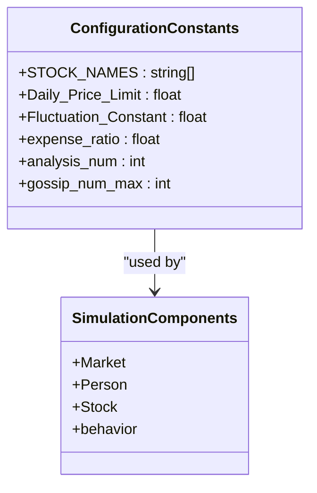
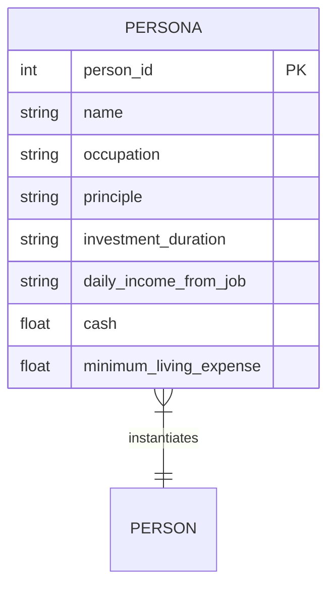
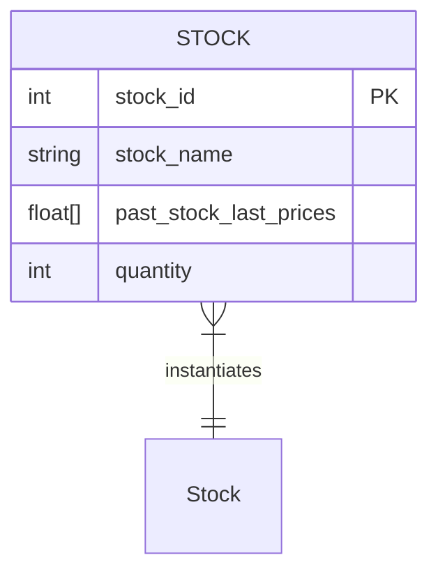
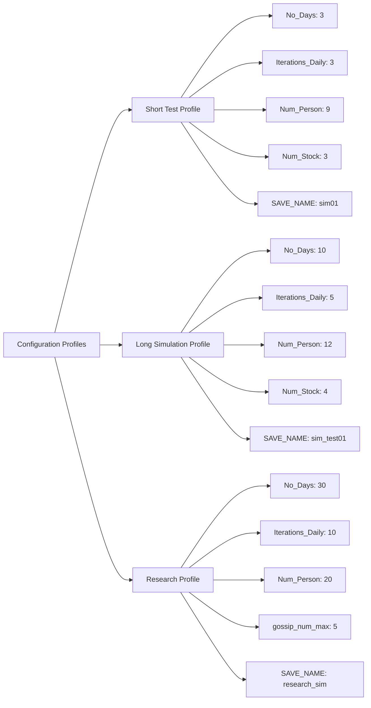
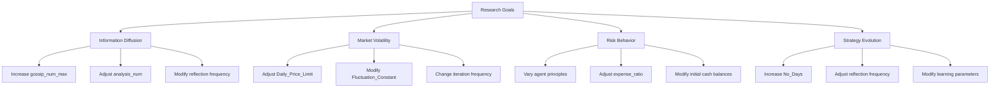
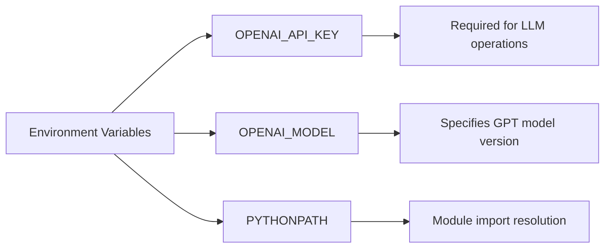
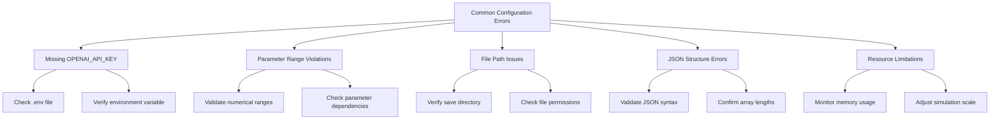

# Configuration and Parameters

<cite>
**Referenced Files in This Document**   
- [main.py](file://main.py)
- [constant.py](file://constant.py)
- [load_json.py](file://load_json.py)
- [Market.py](file://Market.py)
- [behavior.py](file://behavior.py)
- [Person.py](file://Person.py)
- [database_utils.py](file://database_utils.py)
- [our_run_gpt_prompt.py](file://content/our_run_gpt_prompt.py)
- [utils.py](file://content/utils.py)
- [persona.json](file://save/init/persona.json)
- [stocks.json](file://save/init/stocks.json)
- [run.sh](file://run.sh)
</cite>

## Table of Contents
1. [Command-Line Arguments](#command-line-arguments)
2. [Configuration Constants](#configuration-constants)
3. [Agent Persona Configuration](#agent-persona-configuration)
4. [Stock Configuration](#stock-configuration)
5. [Configuration Profiles](#configuration-profiles)
6. [Parameter Tuning for Research Goals](#parameter-tuning-for-research-goals)
7. [Environment Variables](#environment-variables)
8. [Common Configuration Errors](#common-configuration-errors)

## Command-Line Arguments

The simulation is controlled through command-line arguments defined in `main.py`. These parameters allow users to customize the simulation's scale, duration, and behavior without modifying the source code.

```mermaid
flowchart TD
A["Command-Line Arguments"] --> B["Simulation Scale"]
A --> C["Duration Parameters"]
A --> D["Behavior Controls"]
A --> E["File Management"]
B --> B1["Num_Person: Number of agents"]
B --> B2["Num_Stock: Number of stocks"]
B --> B3["STOCK_NAMES: Stock identifiers"]
C --> C1["No_Days: Trading days"]
C --> C2["Iterations_Daily: Iterations per day"]
D --> D1["analysis_num: Agents performing analysis"]
D --> D2["gossip_num_max: Maximum gossip entries"]
D --> D3["Daily_Price_Limit: Price change threshold"]
D --> D4["Fluctuation_Constant: Price sensitivity"]
D --> D5["expense_ratio: Capital cost rate"]
E --> E1["SAVE_NAME: Output directory"]
E --> E2["persona_name: Agent configuration file"]
E --> E3["stock_name: Stock configuration file"]
E --> E4["verbose: Debug output"]
```

**Diagram sources**
- [main.py](file://main.py#L19-L37)

**Section sources**
- [main.py](file://main.py#L19-L37)

### Simulation Scale Parameters

**Num_Person**: Specifies the number of trading agents in the simulation. Default value is 9. This parameter directly affects computational complexity and market dynamics, as more agents create more interactions and trading opportunities.

**Num_Stock**: Determines the number of stocks available for trading. Default value is 3. Increasing this parameter expands the investment universe, requiring agents to make more complex portfolio decisions.

**STOCK_NAMES**: A list of stock identifiers used in the simulation. Default value is ["0", "1", "2", "3", "4"]. These names are referenced throughout the codebase, including in agent memory and analysis functions.

### Duration Parameters

**No_Days**: Sets the total number of trading days in the simulation. Default value is 3. This parameter controls the overall simulation timeline and affects long-term strategies and agent learning.

**Iterations_Daily**: Specifies the number of trading iterations per day. Default value is 3. Each iteration represents a discrete trading period where agents can analyze the market, generate gossip, place orders, and reflect on their performance.

### Behavior Control Parameters

**Daily_Price_Limit**: Defines the maximum allowable price change percentage per day. Default value is 0.7 (70%). This parameter prevents extreme price movements and is used in `Market.py` to filter orders that would cause excessive price changes.

**expense_ratio**: Represents the daily capital cost rate. Default value is 0.03 (3%). This cost is deducted from each agent's cash balance daily and affects their overall wealth calculation in `Person.py`.

**Fluctuation_Constant**: Controls the sensitivity of stock price changes to trading volume. Default value is 20.0. This constant is used in the price update formula in `Market.py` to determine how much prices move based on trade volume and order matching.

### Analysis and Communication Parameters

**analysis_num**: Sets the number of agents that perform market analysis in each iteration. Default value is 3. This parameter influences the amount of market information generated and is validated in `our_run_gpt_prompt.py` to ensure the correct number of analysis results.

**gossip_num_max**: Specifies the maximum number of gossip entries generated per round. Default value is 3. This parameter controls information diffusion in the market, with higher values enabling faster spread of market sentiment and rumors.

### File Management Parameters

**SAVE_NAME**: Determines the name of the save directory under the `save/` folder. Default value is 'sim01'. This parameter creates a dedicated output directory for simulation results, including agent states, stock data, and transaction records.

**persona_name**: Specifies the filename for agent persona configuration. Default value is 'persona.json'. This file contains the initial attributes and characteristics of each trading agent.

**stock_name**: Sets the filename for stock configuration. Default value is 'stocks.json'. This file defines the initial state of each stock in the market.

**verbose**: A boolean flag that enables debug information output when present. This parameter provides detailed logging of simulation events for troubleshooting and analysis.

## Configuration Constants

The simulation uses several constants that are defined in configuration files and imported across modules. These constants provide default values and structural elements for the simulation.

**Diagram sources**
- [constant.py](file://constant.py#L2)
- [main.py](file://main.py#L29-L36)

**Section sources**
- [constant.py](file://constant.py#L2)
- [main.py](file://main.py#L29-L36)

### Stock Names Constant

The `STOCK_NAMES` constant in `constant.py` defines the default identifiers for stocks in the simulation. This list ["0", "1", "2", "3", "4"] is used as a fallback when stock names are not specified through command-line arguments. The stock names are referenced in various parts of the codebase, including the `query_prompt` method in `Person.py` where they are used to format agent memory and financial situation reports.

### Price and Market Dynamics Constants

While the primary market constants (Daily_Price_Limit, Fluctuation_Constant, expense_ratio) are defined as command-line arguments with default values, they function as configuration constants throughout the simulation. These values are referenced in multiple modules:

- **Daily_Price_Limit**: Used in `Market.py` to validate price changes during order matching and execution. Orders that would cause price movements exceeding this threshold are skipped.
- **Fluctuation_Constant**: Applied in `Market.py` when calculating new stock prices after trades. The constant appears in the price update formula, where it weights the trade price against the current price and total quantity.
- **expense_ratio**: Utilized in `Person.py` when calculating daily expenses. The ratio is applied to the agent's total assets (cash + investment value) to determine their daily capital cost.

## Agent Persona Configuration

Agent personas are configured through JSON files that define the characteristics and initial state of each trading agent. The default configuration is provided in `save/init/persona.json`.

**Diagram sources**
- [persona.json](file://save/init/persona.json#L1-L99)
- [Person.py](file://Person.py#L409-L411)

**Section sources**
- [persona.json](file://save/init/persona.json#L1-L99)
- [Person.py](file://Person.py#L409-L411)

### Persona Structure

The persona configuration file contains an array of agent definitions, each with the following properties:

- **person_id**: Unique identifier for the agent (0 to Num_Person-1)
- **name**: Personal name used for identification and reporting
- **occupation**: Professional background that may influence trading behavior
- **principle**: Investment strategy or risk profile (e.g., "conservative", "radical", "moderate", "aggressive")
- **investment_duration**: Time horizon for investment goals
- **daily_income_from_job**: Daily income from employment
- **cash**: Initial cash balance
- **minimum_living_expense**: Minimum daily expenses

### Customization Guidelines

To customize agent personas, users can modify the existing `persona.json` file or create a new one with a different name. The file should maintain the same structure with an array of agent objects. Each agent's principle parameter is particularly important as it influences their trading decisions through the LLM prompts.

When creating custom personas, ensure that:
- The number of personas matches the Num_Person parameter
- Cash balances are sufficient to cover minimum living expenses
- Principles are clearly defined to guide agent behavior
- Person IDs are sequential starting from 0

The system loads these personas through the `load_persona` function in `load_json.py`, which reads the JSON file and returns the parsed data structure for initialization.

## Stock Configuration

Stocks are configured through JSON files that define their initial state and historical prices. The default configuration is provided in `save/init/stocks.json`.

**Diagram sources**
- [stocks.json](file://save/init/stocks.json#L1-L21)
- [Stock.py](file://Stock.py)

**Section sources**
- [stocks.json](file://save/init/stocks.json#L1-L21)
- [Stock.py](file://Stock.py)

### Stock Structure

The stock configuration file contains an array of stock definitions, each with the following properties:

- **stock_id**: Unique identifier for the stock (0 to Num_Stock-1)
- **stock_name**: Symbol or name used to identify the stock
- **past_stock_last_prices**: Array of historical closing prices used to initialize the stock's price history
- **quantity**: Total number of shares available in the market

### Customization Guidelines

To customize stock configurations, users can modify the existing `stocks.json` file or create a new one. The file should maintain the array structure with stock objects. When creating custom stock configurations, consider:

- Ensuring the number of stocks matches the Num_Stock parameter
- Providing sufficient historical price data to support initial analysis
- Setting appropriate quantities to influence market liquidity
- Using consistent stock naming conventions

The system loads these stock configurations through the `load_stocks` function in `load_json.py`, which reads the JSON file and returns the parsed data structure for initialization.

## Configuration Profiles

The simulation supports different configuration profiles for various use cases, from quick tests to extensive research simulations. The `run.sh` script provides an example of a comprehensive configuration profile.

**Diagram sources**
- [run.sh](file://run.sh#L10-L23)
- [main.py](file://main.py#L19-L37)

**Section sources**
- [run.sh](file://run.sh#L10-L23)

### Short Test Profile

The default configuration in `main.py` serves as a short test profile suitable for verifying the simulation setup and basic functionality:

- No_Days: 3
- Iterations_Daily: 3
- Num_Person: 9
- Num_Stock: 3
- SAVE_NAME: sim01

This profile runs quickly and generates minimal output, making it ideal for initial testing and debugging.

### Long Simulation Profile

The example in `run.sh` demonstrates a more extensive simulation profile:

- No_Days: 10
- Iterations_Daily: 5
- Num_Person: 12
- Num_Stock: 4
- SAVE_NAME: sim_test01
- Daily_Price_Limit: 0.6
- expense_ratio: 0.02
- Fluctuation_Constant: 15.0
- analysis_num: 3
- gossip_num_max: 2

This profile provides a more realistic market environment with longer duration, more agents, and adjusted market parameters.

## Parameter Tuning for Research Goals

Researchers can tune parameters to study specific market phenomena and agent behaviors. The simulation's design allows for targeted experimentation by adjusting key parameters.

**Diagram sources**
- [main.py](file://main.py#L36)
- [behavior.py](file://behavior.py#L201-L209)
- [our_run_gpt_prompt.py](file://content/our_run_gpt_prompt.py#L413-L415)

**Section sources**
- [main.py](file://main.py#L36)
- [behavior.py](file://behavior.py#L201-L209)

### Studying Information Diffusion

To study information diffusion and market sentiment propagation, researchers should focus on the `gossip_num_max` parameter. Increasing this value from the default of 3 to higher values (5, 10, or more) enables more extensive information sharing among agents.

The gossip mechanism is implemented in `behavior.py` through the `generate_gossip` function, which calls `run_gpt_generate_gossip` to create gossip content. The `integrate_gossip` function in `our_run_gpt_prompt.py` controls how many gossip items are included in the analysis prompt, directly using the `gossip_num_max` parameter.

For comprehensive studies of information diffusion:
- Set gossip_num_max to 5-10 to enable extensive information sharing
- Increase No_Days to 20-30 to observe long-term effects
- Use diverse agent principles to study how different risk profiles respond to gossip
- Enable verbose output to track gossip propagation

### Analyzing Market Volatility

To study market volatility and price dynamics, researchers should adjust the market sensitivity parameters:

- **Daily_Price_Limit**: Lower values (0.3-0.5) create more constrained markets, while higher values (0.7-1.0) allow for greater price swings
- **Fluctuation_Constant**: Lower values (10.0-15.0) make prices less sensitive to trading volume, while higher values (25.0-30.0) increase price volatility
- **Iterations_Daily**: More iterations per day increase trading frequency and potential volatility

These parameters directly affect the price update formula in `Market.py`, where they determine how much prices change based on trade volume and order matching.

### Investigating Risk Behavior

To study risk behavior and investment strategies, researchers can:
- Vary the principle parameter in persona configurations to create diverse risk profiles
- Adjust the expense_ratio to influence financial pressure on agents
- Modify initial cash balances and minimum living expenses to study financial constraints
- Change the investment_duration to examine time horizon effects

The expense_ratio parameter is particularly important as it directly affects agent wealth calculations in `Person.py`, where it's applied to total assets to determine daily expenses.

## Environment Variables

The simulation relies on environment variables for external service configuration, particularly for accessing the OpenAI API.

**Diagram sources**
- [utils.py](file://content/utils.py#L19-L24)
- [run.sh](file://run.sh#L7)

**Section sources**
- [utils.py](file://content/utils.py#L19-L24)
- [run.sh](file://run.sh#L7)

### OPENAI_API_KEY

The OPENAI_API_KEY environment variable contains the authentication key for accessing OpenAI's API services. This key is loaded in `content/utils.py` using the `python-dotenv` package, which searches for a `.env` file in the project directory and parent directories.

Without a valid API key, the simulation cannot perform LLM-based operations such as market analysis, trading decisions, and agent reflection. The system provides a warning if the key is not found in the environment variables.

### OPENAI_MODEL

The OPENAI_MODEL environment variable specifies which GPT model version to use for LLM operations. The default value is 'gpt-4', but researchers can change this to other available models such as 'gpt-3.5-turbo' for cost reduction or experimentation with different model capabilities.

### PYTHONPATH

The run.sh script sets the PYTHONPATH environment variable to the current directory using `export PYTHONPATH=$(pwd)`. This ensures that Python can locate and import modules from the Stock_Main directory without requiring installation or complex import paths.

## Common Configuration Errors

Several common configuration errors can prevent the simulation from running correctly or produce unexpected results. Understanding these issues helps ensure successful simulation execution.

**Diagram sources**
- [utils.py](file://content/utils.py#L20-L21)
- [main.py](file://main.py#L41-L43)
- [load_json.py](file://load_json.py#L9-L22)

**Section sources**
- [utils.py](file://content/utils.py#L20-L21)
- [main.py](file://main.py#L41-L43)

### Missing OPENAI_API_KEY

The most common configuration error is a missing or invalid OPENAI_API_KEY. This prevents the simulation from accessing the LLM services required for agent decision-making.

**Symptoms**: Warning message "WARNING: OPENAI_API_KEY not found in environment variables!" and failure of LLM-based functions.

**Solutions**:
1. Create a `.env` file in the project root directory
2. Add `OPENAI_API_KEY=your_actual_key` to the file
3. Ensure the file is in the correct location (project root or up to three parent directories)
4. Verify the key format and validity

### Parameter Range and Consistency Issues

Several parameter relationships must be maintained for the simulation to function correctly:

- The number of personas in the JSON file must match the Num_Person parameter
- The number of stocks in the JSON file must match the Num_Stock parameter
- Stock names in the configuration must be consistent with those expected by agents
- Numerical parameters should be within reasonable ranges (positive values for financial parameters)

**Solutions**:
1. Verify that JSON configuration files have the correct number of entries
2. Check that all numerical parameters are positive and within expected ranges
3. Ensure file paths are correctly specified and directories exist

### File System and Permissions

The simulation creates output directories and files that may encounter file system issues:

**Symptoms**: Permission errors, inability to create save directories, or file write failures.

**Solutions**:
1. Ensure the user has write permissions in the project directory
2. Verify disk space availability
3. Check that the save directory path is valid and accessible
4. Ensure no file locking issues from previous simulation runs

### JSON Configuration Errors

Malformed JSON in configuration files can prevent proper loading:

**Symptoms**: JSON parsing errors, missing agent or stock data, or simulation crashes during initialization.

**Solutions**:
1. Validate JSON syntax using online tools or text editors
2. Ensure proper comma placement and bracket matching
3. Verify that all required fields are present in each object
4. Check that string values are properly quoted

### Resource Limitations

Large simulation configurations may exceed system resources:

**Symptoms**: Slow performance, memory exhaustion, or process termination.

**Solutions**:
1. Start with smaller configurations and gradually increase scale
2. Monitor system resource usage during simulation
3. Adjust parameters like No_Days and Num_Person based on available resources
4. Consider running simulations on more powerful hardware for large-scale studies