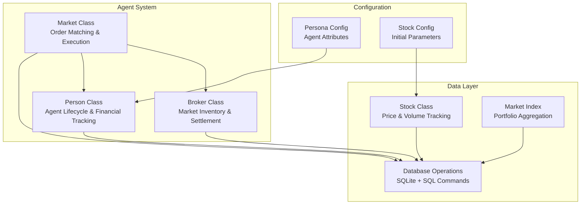
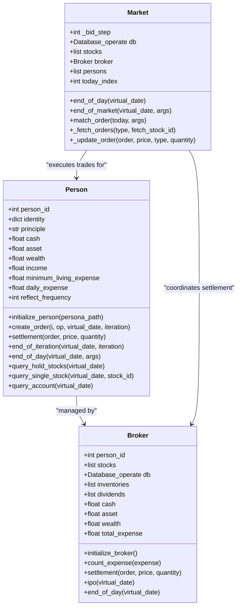
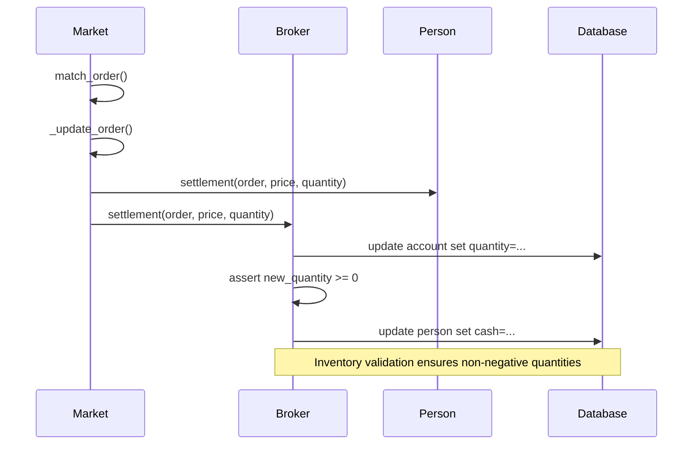
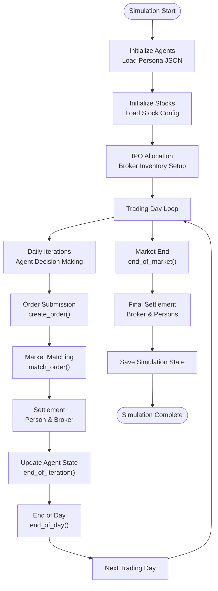
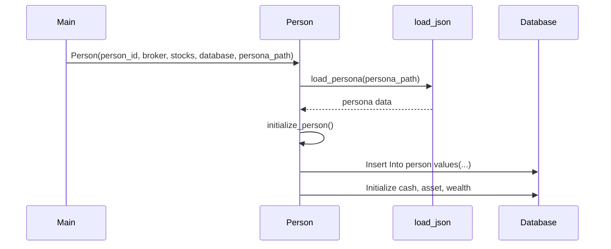
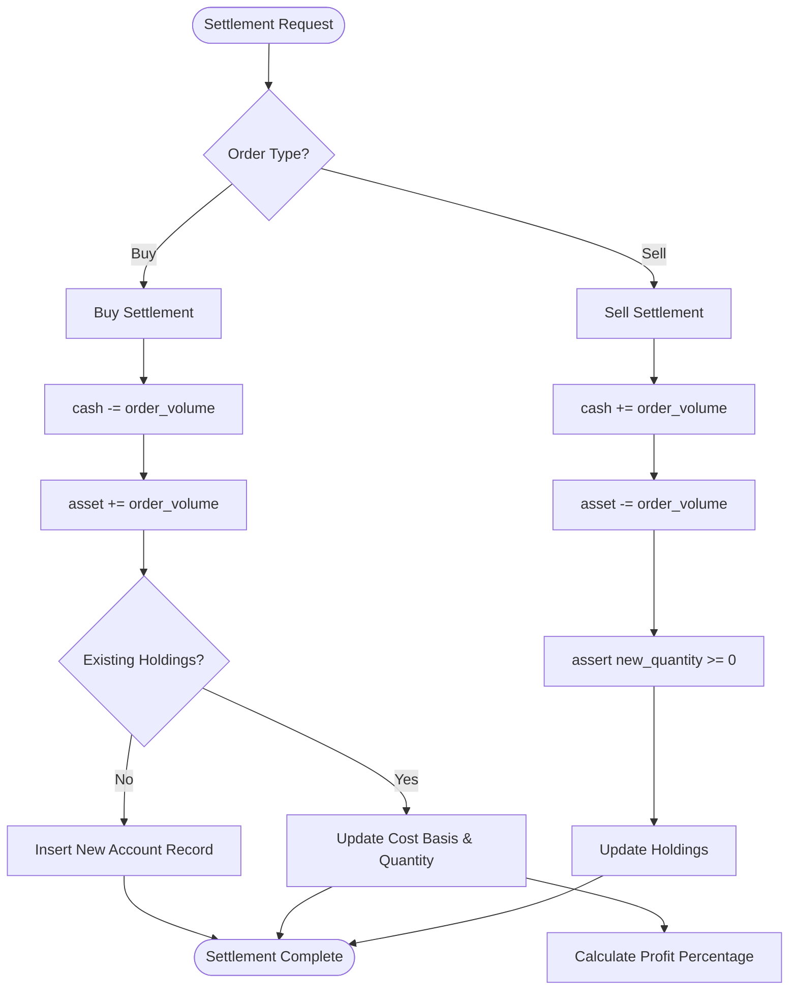
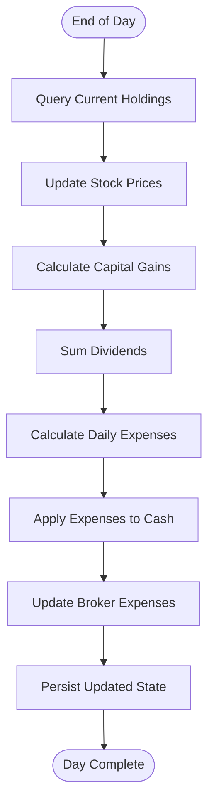
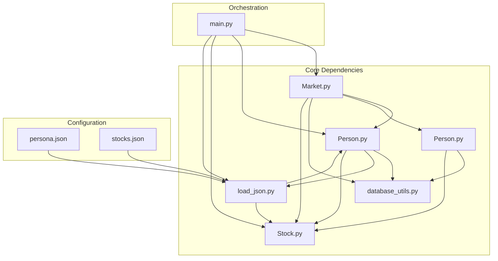

# Agent System

<cite>
**Referenced Files in This Document**
- [Person.py](file://Agent-Trading-Arena/Stock_Main/Person.py)
- [Market.py](file://Agent-Trading-Arena/Stock_Main/Market.py)
- [main.py](file://Agent-Trading-Arena/Stock_Main/main.py)
- [database_utils.py](file://Agent-Trading-Arena/Stock_Main/database_utils.py)
- [Stock.py](file://Agent-Trading-Arena/Stock_Main/Stock.py)
- [load_json.py](file://Agent-Trading-Arena/Stock_Main/load_json.py)
- [behavior.py](file://Agent-Trading-Arena/Stock_Main/behavior.py)
- [persona.json](file://Agent-Trading-Arena/Stock_Main/save/init/persona.json)
- [stocks.json](file://Agent-Trading-Arena/Stock_Main/save/init/stocks.json)
</cite>

## Table of Contents
1. [Introduction](#introduction)
2. [Project Structure](#project-structure)
3. [Core Components](#core-components)
4. [Architecture Overview](#architecture-overview)
5. [Detailed Component Analysis](#detailed-component-analysis)
6. [Dependency Analysis](#dependency-analysis)
7. [Performance Considerations](#performance-considerations)
8. [Troubleshooting Guide](#troubleshooting-guide)
9. [Conclusion](#conclusion)

## Introduction
This document provides comprehensive technical documentation for the Agent System component of the Agent Trading Arena. It focuses on the Person class representing AI trading agents and the Broker class managing market inventory and settlement for all agents. The documentation covers agent lifecycle methods, financial tracking mechanisms, and how agent personas are loaded from configuration files.

## Project Structure
The Agent System is organized around several key modules:
- Person.py: Implements the Person and Broker classes with agent lifecycle and financial tracking
- Market.py: Manages market matching, order execution, and settlement coordination
- Stock.py: Defines stock data structures and market index calculations
- database_utils.py: Provides database abstraction and data parsing utilities
- load_json.py: Handles loading and saving of agent personas and stock configurations
- behavior.py: Orchestrates agent decision-making and GPT-driven operations
- main.py: Coordinates the simulation lifecycle and agent interactions

**Diagram sources**
- [Person.py](file://Agent-Trading-Arena/Stock_Main/Person.py#L143-L629)
- [Market.py](file://Agent-Trading-Arena/Stock_Main/Market.py#L12-L278)
- [Stock.py](file://Agent-Trading-Arena/Stock_Main/Stock.py#L14-L307)
- [database_utils.py](file://Agent-Trading-Arena/Stock_Main/database_utils.py#L245-L322)
- [load_json.py](file://Agent-Trading-Arena/Stock_Main/load_json.py#L9-L23)

**Section sources**
- [main.py](file://Agent-Trading-Arena/Stock_Main/main.py#L1-L136)
- [Person.py](file://Agent-Trading-Arena/Stock_Main/Person.py#L1-L629)
- [Market.py](file://Agent-Trading-Arena/Stock_Main/Market.py#L1-L278)

## Core Components
This section examines the fundamental classes that implement the Agent System.

### Person Class Implementation
The Person class represents AI trading agents with comprehensive financial tracking capabilities:

Key Attributes:
- Identity and Principles: person_id, identity dictionary, principle (investment philosophy)
- Financial State: cash, asset, wealth, income, minimum_living_expense
- Operational Parameters: daily_expense calculation, reflect_frequency

Core Methods:
- Initialization: Loads persona from JSON, establishes initial financial state
- Order Management: create_order(), extract(), settlement()
- Lifecycle Management: end_of_iteration(), end_of_day()
- Data Access: query_hold_stocks(), query_single_stock(), query_account()

**Diagram sources**
- [Person.py](file://Agent-Trading-Arena/Stock_Main/Person.py#L143-L629)
- [Market.py](file://Agent-Trading-Arena/Stock_Main/Market.py#L12-L278)

**Section sources**
- [Person.py](file://Agent-Trading-Arena/Stock_Main/Person.py#L143-L629)

### Broker Class Implementation
The Broker class serves as the central market operator managing inventory and settlement:

Key Responsibilities:
- Initial Inventory Setup: Processes IPO allocations for all stocks
- Market Operations: Executes settlement for both buy and sell orders
- Expense Tracking: Manages broker-level expenses and dividends
- Daily Operations: Updates inventory and maintains market records

**Diagram sources**
- [Market.py](file://Agent-Trading-Arena/Stock_Main/Market.py#L230-L259)
- [Person.py](file://Agent-Trading-Arena/Stock_Main/Person.py#L250-L308)
- [Person.py](file://Agent-Trading-Arena/Stock_Main/Person.py#L65-L97)

**Section sources**
- [Person.py](file://Agent-Trading-Arena/Stock_Main/Person.py#L18-L141)

## Architecture Overview
The Agent System follows a coordinated architecture where Market orchestrates trading, Person executes agent actions, and Broker manages settlement:

**Diagram sources**
- [main.py](file://Agent-Trading-Arena/Stock_Main/main.py#L95-L131)
- [Market.py](file://Agent-Trading-Arena/Stock_Main/Market.py#L96-L131)
- [Person.py](file://Agent-Trading-Arena/Stock_Main/Person.py#L309-L427)

**Section sources**
- [main.py](file://Agent-Trading-Arena/Stock_Main/main.py#L84-L131)

## Detailed Component Analysis

### Agent Lifecycle Methods
The Person class implements a comprehensive lifecycle for agent management:

#### Initialization from Persona JSON
Agent initialization loads configuration from persona.json:
- Extracts person_id, name, occupation, and investment principles
- Sets daily income, initial cash, and minimum living expenses
- Establishes initial financial state with zero asset holdings

**Diagram sources**
- [Person.py](file://Agent-Trading-Arena/Stock_Main/Person.py#L173-L200)
- [load_json.py](file://Agent-Trading-Arena/Stock_Main/load_json.py#L9-L14)

#### Daily Settlement Process
The settlement method handles transaction completion:
- Calculates order volume (price × quantity)
- Updates agent cash and asset balances
- Manages inventory adjustments for stock holdings
- Maintains cost basis and profit calculations

**Diagram sources**
- [Person.py](file://Agent-Trading-Arena/Stock_Main/Person.py#L250-L308)

**Section sources**
- [Person.py](file://Agent-Trading-Arena/Stock_Main/Person.py#L250-L308)

#### Iteration-Based Status Updates
The end_of_iteration method updates agent state during trading iterations:
- Queries current stock prices from database
- Recalculates portfolio value and capital gains
- Updates profit margins for all holdings
- Persists updated state to database

**Section sources**
- [Person.py](file://Agent-Trading-Arena/Stock_Main/Person.py#L309-L362)

### Financial Tracking Mechanisms
The system implements comprehensive financial tracking:

#### Capital Gains Calculation
Capital gains are calculated as the difference between current and cost prices:
- Total capital gain = Σ((current_price - cost_price) × quantity)
- Individual stock profit = ((current_price - cost_price) / cost_price) × 100%

#### Dividend Tracking
Dividends are calculated based on stock DPS (Dividends Per Share):
- Dividend per stock = quantity × DPS
- Total dividends = Σ(dividends across all holdings)

#### Daily Expenses Calculation
Daily expenses follow the formula:
- daily_expense = (total_asset × expense_ratio) + minimum_living_expense
- Cash is reduced by daily_expense at end of day

**Diagram sources**
- [Person.py](file://Agent-Trading-Arena/Stock_Main/Person.py#L364-L427)

**Section sources**
- [Person.py](file://Agent-Trading-Arena/Stock_Main/Person.py#L364-L427)

### Agent Memory and Holdings Management
The Person class provides extensive query capabilities:

#### Query Methods
- query_hold_stocks(): Returns all currently held positions
- query_single_stock(): Retrieves specific stock holdings
- query_account(): Formats detailed account information
- query_prompt(): Prepares data for GPT analysis
- query_person(): Retrieves agent financial status

#### Memory Management
- add_memory(): Stores trading decisions and market analysis
- query_memory(): Retrieves historical trading decisions
- add_gossip(): Records market gossip and news
- query_gossip(): Retrieves relevant market information

**Section sources**
- [Person.py](file://Agent-Trading-Arena/Stock_Main/Person.py#L429-L629)

### Broker Operations
The Broker class manages market-wide inventory and settlement:

#### Inventory Management
- Initializes inventory for all stocks during IPO
- Tracks available quantities for trading
- Updates inventory after each transaction

#### Settlement Coordination
- Processes both buy and sell settlements
- Maintains dividend tracking
- Updates broker cash and asset positions

**Section sources**
- [Person.py](file://Agent-Trading-Arena/Stock_Main/Person.py#L18-L141)

## Dependency Analysis
The Agent System exhibits well-defined dependencies between components:

**Diagram sources**
- [Person.py](file://Agent-Trading-Arena/Stock_Main/Person.py#L1-L16)
- [Market.py](file://Agent-Trading-Arena/Stock_Main/Market.py#L1-L10)
- [main.py](file://Agent-Trading-Arena/Stock_Main/main.py#L8-L13)

**Section sources**
- [Person.py](file://Agent-Trading-Arena/Stock_Main/Person.py#L1-L16)
- [Market.py](file://Agent-Trading-Arena/Stock_Main/Market.py#L1-L10)

## Performance Considerations
The Agent System implements several performance optimization strategies:

### Database Efficiency
- Batch operations minimize database round-trips
- Prepared statements reduce SQL parsing overhead
- Efficient query patterns prevent unnecessary data retrieval

### Memory Management
- Object serialization for simulation persistence
- Controlled memory usage through selective data loading
- Efficient data structures for stock and agent tracking

### Computational Optimization
- Early termination conditions in order matching
- Cached stock price lookups
- Optimized profit calculation algorithms

## Troubleshooting Guide

### Common Issues and Solutions

#### Negative Cash Scenarios
The system prevents negative cash through multiple validation mechanisms:
- Order creation validates sufficient cash before submission
- Settlement assertions ensure inventory quantities remain non-negative
- Daily expense calculations consider available cash balance

#### Inventory Validation
- Broker settlement includes explicit assertions for inventory validation
- Person settlement validates stock holdings before execution
- Database constraints enforce data integrity

#### Assertion Failures
Common assertion failures and resolutions:
- `assert new_quantity >= 0`: Indicates insufficient stock holdings
- `cash >= order_volume`: Indicates insufficient cash balance
- Market price limits prevent unrealistic price fluctuations

#### Database Integrity Issues
- Unique constraints prevent duplicate records
- Foreign key relationships maintain referential integrity
- Transaction boundaries ensure atomic operations

**Section sources**
- [Person.py](file://Agent-Trading-Arena/Stock_Main/Person.py#L73-L73)
- [Person.py](file://Agent-Trading-Arena/Stock_Main/Person.py#L297-L297)
- [database_utils.py](file://Agent-Trading-Arena/Stock_Main/database_utils.py#L256-L300)

### Debugging Strategies
- Enable verbose mode for detailed logging
- Monitor database operations for SQL errors
- Validate JSON configuration files before simulation start
- Check market price limits and volatility constraints

## Conclusion
The Agent System provides a robust framework for AI trading agent simulation with comprehensive financial tracking, market coordination, and lifecycle management. The Person and Broker classes implement sophisticated trading mechanics with proper validation and error handling. The modular architecture enables extensible agent behaviors while maintaining system stability and performance.

The system's design supports realistic market simulation with proper financial calculations, inventory management, and agent decision-making processes. The configuration-driven approach allows for flexible agent customization through persona and stock configuration files.