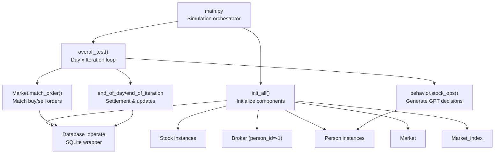
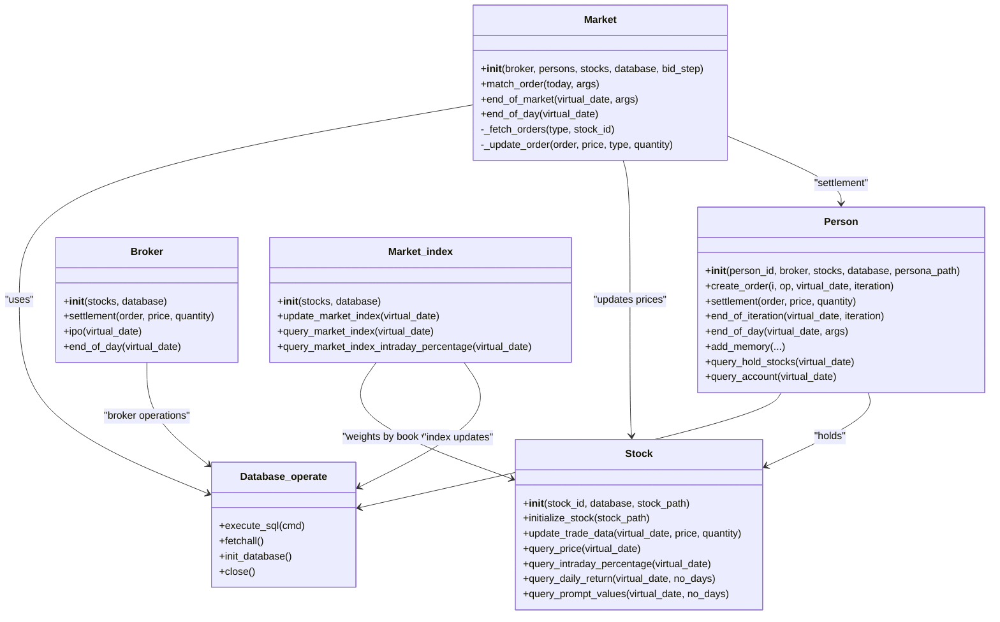
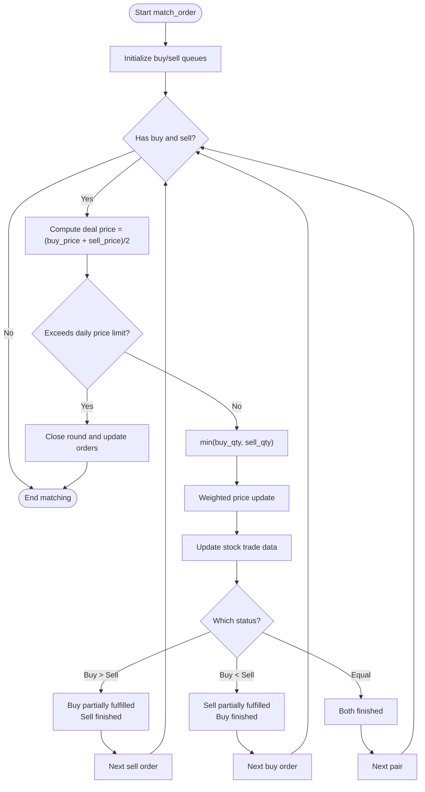
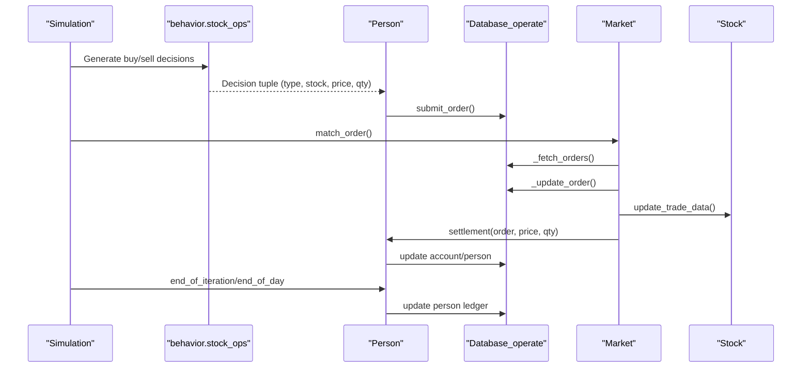
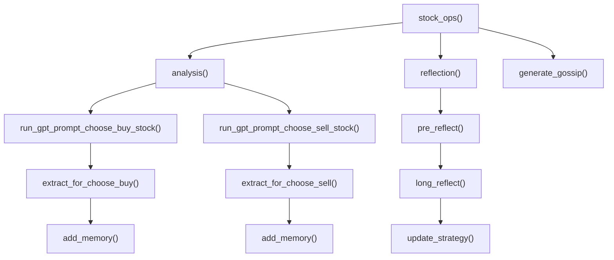
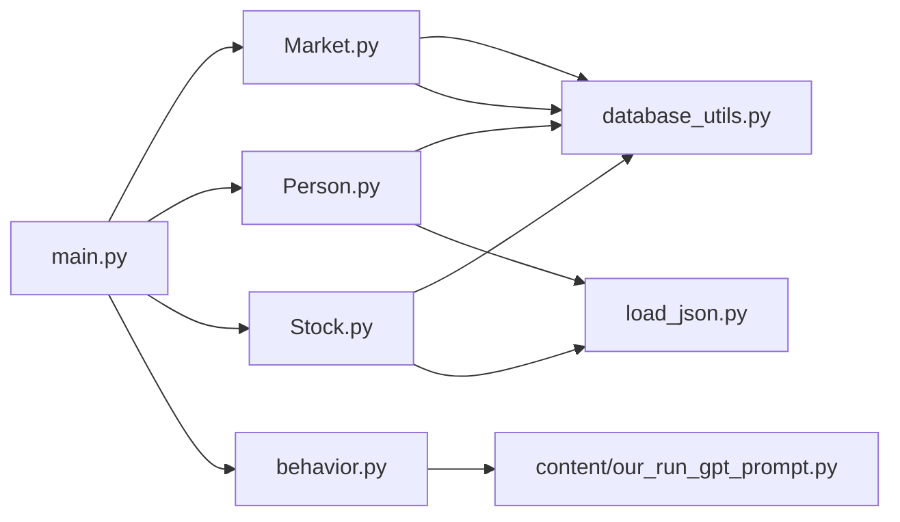

# Core Components

<cite>
**Referenced Files in This Document**
- [Market.py](file://Agent-Trading-Arena/Stock_Main/Market.py)
- [Person.py](file://Agent-Trading-Arena/Stock_Main/Person.py)
- [Stock.py](file://Agent-Trading-Arena/Stock_Main/Stock.py)
- [behavior.py](file://Agent-Trading-Arena/Stock_Main/behavior.py)
- [main.py](file://Agent-Trading-Arena/Stock_Main/main.py)
- [database_utils.py](file://Agent-Trading-Arena/Stock_Main/database_utils.py)
- [load_json.py](file://Agent-Trading-Arena/Stock_Main/load_json.py)
- [our_run_gpt_prompt.py](file://Agent-Trading-Arena/Stock_Main/content/our_run_gpt_prompt.py)
- [persona.json](file://Agent-Trading-Arena/Stock_Main/save/init/persona.json)
- [stocks.json](file://Agent-Trading-Arena/Stock_Main/save/init/stocks.json)
</cite>

## Table of Contents
1. [Introduction](#introduction)
2. [Project Structure](#project-structure)
3. [Core Components](#core-components)
4. [Architecture Overview](#architecture-overview)
5. [Detailed Component Analysis](#detailed-component-analysis)
6. [Dependency Analysis](#dependency-analysis)
7. [Performance Considerations](#performance-considerations)
8. [Troubleshooting Guide](#troubleshooting-guide)
9. [Conclusion](#conclusion)

## Introduction
This document explains the core components of the Agent Trading Arena system, focusing on how markets, agents, and stocks interact to simulate realistic trading behavior. It covers:
- Market class: order matching, price formation, and market index calculation
- Person class: AI traders with investment principles, financial status, and decision-making
- Stock class: price history, volatility, and fundamentals
- Behavior module: trading logic, reflection mechanisms, and gossip generation
- Interaction patterns among components and common stability and bankruptcy issues

## Project Structure
The system is organized around a simulation loop that runs multiple trading days and iterations per day. Data persistence is handled via SQLite, and AI-driven decisions are generated through templated prompts.

**Diagram sources**
- [main.py](file://Agent-Trading-Arena/Stock_Main/main.py#L51-L131)
- [Market.py](file://Agent-Trading-Arena/Stock_Main/Market.py#L12-L278)
- [Person.py](file://Agent-Trading-Arena/Stock_Main/Person.py#L18-L629)
- [Stock.py](file://Agent-Trading-Arena/Stock_Main/Stock.py#L14-L307)
- [database_utils.py](file://Agent-Trading-Arena/Stock_Main/database_utils.py#L245-L322)

**Section sources**
- [main.py](file://Agent-Trading-Arena/Stock_Main/main.py#L1-L136)

## Core Components

### Market
The Market class coordinates order matching, price updates, and end-of-day settlement. It maintains references to stocks, broker, and persons, and uses a database interface for persistent state.

Key responsibilities:
- Order fetching and sorting by type and price-time priority
- Matching buy and sell orders with price limits and fluctuation constants
- Updating stock prices using a weighted formula based on traded quantity and price
- Settlement for both broker and individual persons
- End-of-day and end-of-market cleanup

Implementation highlights:
- Order matching prioritizes price-time ordering and enforces daily price change limits
- Price formation uses a weighted average combining previous price and recent trades
- Partial fulfillment of orders is supported with residual order updates

Method signatures and usage patterns:
- [Market.__init__](file://Agent-Trading-Arena/Stock_Main/Market.py#L13-L19)
- [Market.match_order](file://Agent-Trading-Arena/Stock_Main/Market.py#L96-L199)
- [Market.end_of_market](file://Agent-Trading-Arena/Stock_Main/Market.py#L30-L95)
- [Market._fetch_orders](file://Agent-Trading-Arena/Stock_Main/Market.py#L202-L228)
- [Market._update_order](file://Agent-Trading-Arena/Stock_Main/Market.py#L230-L265)

**Section sources**
- [Market.py](file://Agent-Trading-Arena/Stock_Main/Market.py#L12-L278)

### Person
The Person class models AI traders with distinct investment principles, income, and expenses. It manages financial accounts, holdings, and memory of decisions and market conditions.

Key responsibilities:
- Initialize from persona JSON with identity, cash, and principles
- Create buy/sell orders based on GPT-generated decisions
- Settlement calculations for purchases and sales
- End-of-iteration and end-of-day financial updates including dividends and daily expenses
- Memory storage for stock operations, market conditions, and gossip
- Querying holdings, account status, and historical data

Method signatures and usage patterns:
- [Person.__init__](file://Agent-Trading-Arena/Stock_Main/Person.py#L144-L172)
- [Person.create_order](file://Agent-Trading-Arena/Stock_Main/Person.py#L212-L249)
- [Person.settlement](file://Agent-Trading-Arena/Stock_Main/Person.py#L250-L308)
- [Person.end_of_iteration](file://Agent-Trading-Arena/Stock_Main/Person.py#L309-L362)
- [Person.end_of_day](file://Agent-Trading-Arena/Stock_Main/Person.py#L364-L427)
- [Person.add_memory](file://Agent-Trading-Arena/Stock_Main/Person.py#L514-L545)
- [Person.query_hold_stocks](file://Agent-Trading-Arena/Stock_Main/Person.py#L429-L441)
- [Person.query_account](file://Agent-Trading-Arena/Stock_Main/Person.py#L453-L483)

Broker (internal):
- [Broker.__init__](file://Agent-Trading-Arena/Stock_Main/Person.py#L18-L32)
- [Broker.settlement](file://Agent-Trading-Arena/Stock_Main/Person.py#L65-L97)
- [Broker.ipo](file://Agent-Trading-Arena/Stock_Main/Person.py#L98-L111)

**Section sources**
- [Person.py](file://Agent-Trading-Arena/Stock_Main/Person.py#L18-L629)

### Stock
The Stock class encapsulates fundamental data, price history, and intraday metrics. It also computes market index weights based on book value.

Key responsibilities:
- Initialize from stocks JSON with historical prices and quantities
- Update trade data (volume, quantity, OHLC) during trading
- Compute intraday and multi-day returns and fluctuations
- Provide prompt-friendly summaries for GPT integration
- Market index computation using weighted stock prices

Method signatures and usage patterns:
- [Stock.__init__](file://Agent-Trading-Arena/Stock_Main/Stock.py#L14-L27)
- [Stock.initialize_stock](file://Agent-Trading-Arena/Stock_Main/Stock.py#L28-L51)
- [Stock.update_trade_data](file://Agent-Trading-Arena/Stock_Main/Stock.py#L67-L112)
- [Stock.query_price](file://Agent-Trading-Arena/Stock_Main/Stock.py#L114-L126)
- [Stock.query_intraday_percentage](file://Agent-Trading-Arena/Stock_Main/Stock.py#L128-L138)
- [Stock.query_daily_return](file://Agent-Trading-Arena/Stock_Main/Stock.py#L140-L171)
- [Stock.query_prompt_values](file://Agent-Trading-Arena/Stock_Main/Stock.py#L173-L209)

Market_index:
- [Market_index.__init__](file://Agent-Trading-Arena/Stock_Main/Stock.py#L212-L223)
- [Market_index.update_market_index](file://Agent-Trading-Arena/Stock_Main/Stock.py#L227-L276)
- [Market_index.query_market_index](file://Agent-Trading-Arena/Stock_Main/Stock.py#L278-L288)
- [Market_index.query_market_index_intraday_percentage](file://Agent-Trading-Arena/Stock_Main/Stock.py#L291-L295)

**Section sources**
- [Stock.py](file://Agent-Trading-Arena/Stock_Main/Stock.py#L14-L307)

### Behavior
The behavior module orchestrates AI-driven trading decisions, reflection, and gossip generation. It integrates with GPT prompts to produce actionable decisions.

Key responsibilities:
- Generate stock operations (buy/sell/hold) based on analysis and market conditions
- Extract structured results from GPT outputs
- Reflection mechanism to update investment principles periodically
- Gossip generation to influence agent behavior

Method signatures and usage patterns:
- [stock_ops](file://Agent-Trading-Arena/Stock_Main/behavior.py#L82-L171)
- [reflection](file://Agent-Trading-Arena/Stock_Main/behavior.py#L174-L198)
- [generate_gossip](file://Agent-Trading-Arena/Stock_Main/behavior.py#L201-L210)
- [extract_for_choose_buy](file://Agent-Trading-Arena/Stock_Main/behavior.py#L15-L35)
- [extract_for_choose_sell](file://Agent-Trading-Arena/Stock_Main/behavior.py#L37-L56)
- [extract_analysis_for_reflect](file://Agent-Trading-Arena/Stock_Main/behavior.py#L58-L70)
- [extract_strategy](file://Agent-Trading-Arena/Stock_Main/behavior.py#L72-L80)

Integration with prompts:
- [analysis](file://Agent-Trading-Arena/Stock_Main/content/our_run_gpt_prompt.py#L414-L483)
- [run_gpt_prompt_choose_buy_stock](file://Agent-Trading-Arena/Stock_Main/content/our_run_gpt_prompt.py#L486-L548)
- [run_gpt_prompt_choose_sell_stock](file://Agent-Trading-Arena/Stock_Main/content/our_run_gpt_prompt.py#L551-L618)
- [pre_reflect](file://Agent-Trading-Arena/Stock_Main/content/our_run_gpt_prompt.py#L305-L361)
- [long_reflect](file://Agent-Trading-Arena/Stock_Main/content/our_run_gpt_prompt.py#L251-L303)
- [update_strategy](file://Agent-Trading-Arena/Stock_Main/content/our_run_gpt_prompt.py#L151-L212)
- [run_gpt_generate_gossip](file://Agent-Trading-Arena/Stock_Main/content/our_run_gpt_prompt.py#L364-L411)

**Section sources**
- [behavior.py](file://Agent-Trading-Arena/Stock_Main/behavior.py#L1-L210)
- [our_run_gpt_prompt.py](file://Agent-Trading-Arena/Stock_Main/content/our_run_gpt_prompt.py#L1-L628)

## Architecture Overview
The system follows a modular architecture:
- Simulation loop in main orchestrates days and iterations
- Market coordinates order matching and price updates
- Person and Broker manage financial settlements and holdings
- Stock and Market_index track price history and composite index
- Database_operate persists state across sessions
- Behavior module integrates GPT prompts for decision-making

**Diagram sources**
- [Market.py](file://Agent-Trading-Arena/Stock_Main/Market.py#L12-L278)
- [Person.py](file://Agent-Trading-Arena/Stock_Main/Person.py#L18-L629)
- [Stock.py](file://Agent-Trading-Arena/Stock_Main/Stock.py#L14-L307)
- [database_utils.py](file://Agent-Trading-Arena/Stock_Main/database_utils.py#L245-L322)

## Detailed Component Analysis

### Market Order Matching and Price Formation
The Market.match_order method implements a continuous matching loop that:
- Fetches buy and sell orders sorted by price-time priority
- Computes a deal price as the midpoint of top buy and sell prices
- Enforces a daily price change limit to prevent instability
- Updates stock price using a weighted average formula incorporating traded quantity and fluctuation constant
- Handles partial fulfillment and residual orders

**Diagram sources**
- [Market.py](file://Agent-Trading-Arena/Stock_Main/Market.py#L96-L199)

**Section sources**
- [Market.py](file://Agent-Trading-Arena/Stock_Main/Market.py#L96-L199)

### Person Decision-Making and Financial Settlement
Person.create_order translates GPT decisions into executable orders:
- Buy orders adjust price up slightly and validate sufficient cash
- Sell orders adjust price down slightly and validate sufficient holdings
- Settlement updates cash, assets, and cost basis for holdings
- End-of-day processes dividends, daily expenses, and updates person ledger

**Diagram sources**
- [behavior.py](file://Agent-Trading-Arena/Stock_Main/behavior.py#L82-L171)
- [Person.py](file://Agent-Trading-Arena/Stock_Main/Person.py#L212-L308)
- [Market.py](file://Agent-Trading-Arena/Stock_Main/Market.py#L202-L265)
- [Stock.py](file://Agent-Trading-Arena/Stock_Main/Stock.py#L67-L112)

**Section sources**
- [behavior.py](file://Agent-Trading-Arena/Stock_Main/behavior.py#L82-L171)
- [Person.py](file://Agent-Trading-Arena/Stock_Main/Person.py#L212-L308)

### Stock Price History, Volatility, and Fundamentals
Stock.update_trade_data accumulates intraday OHLC and volume, while query methods expose returns and fluctuations. Market_index aggregates weighted stock prices to form a composite index.

Key behaviors:
- Intraday tracking and daily OHLC initialization
- Percentage changes and multi-day returns
- Prompt-friendly summaries for GPT integration

**Section sources**
- [Stock.py](file://Agent-Trading-Arena/Stock_Main/Stock.py#L67-L209)

### Behavior: Trading Logic, Reflection, and Gossip
The behavior module coordinates:
- Stock operations extraction from GPT outputs
- Periodic reflection to update investment principles
- Gossip generation to influence agent behavior

**Diagram sources**
- [behavior.py](file://Agent-Trading-Arena/Stock_Main/behavior.py#L82-L210)
- [our_run_gpt_prompt.py](file://Agent-Trading-Arena/Stock_Main/content/our_run_gpt_prompt.py#L414-L618)

**Section sources**
- [behavior.py](file://Agent-Trading-Arena/Stock_Main/behavior.py#L82-L210)
- [our_run_gpt_prompt.py](file://Agent-Trading-Arena/Stock_Main/content/our_run_gpt_prompt.py#L414-L618)

## Dependency Analysis
The system exhibits clear separation of concerns:
- main orchestrates lifecycle and delegates to Market, Person, Stock, and behavior
- Market depends on database utilities and Stock instances
- Person and Broker depend on database utilities and Stock instances
- Stock depends on database utilities and load_json for initialization
- behavior depends on content/our_run_gpt_prompt for AI decisions

**Diagram sources**
- [main.py](file://Agent-Trading-Arena/Stock_Main/main.py#L8-L13)
- [Market.py](file://Agent-Trading-Arena/Stock_Main/Market.py#L7-L9)
- [Person.py](file://Agent-Trading-Arena/Stock_Main/Person.py#L2-L16)
- [Stock.py](file://Agent-Trading-Arena/Stock_Main/Stock.py#L4-L10)
- [behavior.py](file://Agent-Trading-Arena/Stock_Main/behavior.py#L3-L12)
- [database_utils.py](file://Agent-Trading-Arena/Stock_Main/database_utils.py#L245-L322)
- [load_json.py](file://Agent-Trading-Arena/Stock_Main/load_json.py#L1-L134)
- [our_run_gpt_prompt.py](file://Agent-Trading-Arena/Stock_Main/content/our_run_gpt_prompt.py#L1-L7)

**Section sources**
- [main.py](file://Agent-Trading-Arena/Stock_Main/main.py#L8-L13)
- [database_utils.py](file://Agent-Trading-Arena/Stock_Main/database_utils.py#L245-L322)

## Performance Considerations
- Order matching complexity: The matching loop processes buy/sell queues and performs O(n) comparisons per iteration; consider indexing and limiting order counts per iteration for scalability.
- Database operations: Frequent INSERT/UPDATE operations can be batched or reduced by consolidating updates.
- GPT prompt generation: Each iteration triggers multiple GPT calls; caching or throttling may improve throughput.
- Price updates: Weighted averaging is linear in traded quantity; ensure quantities remain reasonable to avoid numerical drift.

## Troubleshooting Guide
Common issues and solutions:

- Market instability due to large price swings:
  - The daily price limit check prevents extreme moves; tune Daily_Price_Limit parameter to stabilize or increase volatility.
  - Verify that Fluctuation_Constant balances recent trades against historical price to avoid runaway dynamics.

- Agent bankruptcy or negative cash:
  - Person.end_of_day deducts daily expenses; ensure minimum_living_expense and cash buffers are adequate.
  - Cash checks before placing buy orders; if cash falls below threshold, Person returns "hold".

- Insufficient inventory for sell orders:
  - Person.create_order validates holdings; if insufficient, sell orders are rejected.

- Broker inventory exhaustion:
  - Market.end_of_market skips orders when broker inventories are low; ensure IPO sizing aligns with simulation goals.

- Data consistency:
  - Database_operate wraps SQL commands and commits; verify that all updates occur within transactions and that fetchall() is used after execute_sql().

**Section sources**
- [Market.py](file://Agent-Trading-Arena/Stock_Main/Market.py#L30-L95)
- [Person.py](file://Agent-Trading-Arena/Stock_Main/Person.py#L212-L308)
- [Stock.py](file://Agent-Trading-Arena/Stock_Main/Stock.py#L67-L112)
- [database_utils.py](file://Agent-Trading-Arena/Stock_Main/database_utils.py#L302-L311)

## Conclusion
The Agent Trading Arena integrates market mechanics, AI-driven decision-making, and financial modeling into a coherent simulation framework. Market ensures fair and bounded price formation, Person models realistic investor behavior with principles and expenses, Stock tracks fundamentals and returns, and behavior orchestrates reflection and gossip. Together, they provide a robust foundation for studying agent interactions and market dynamics under controlled conditions.