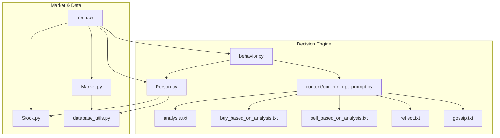
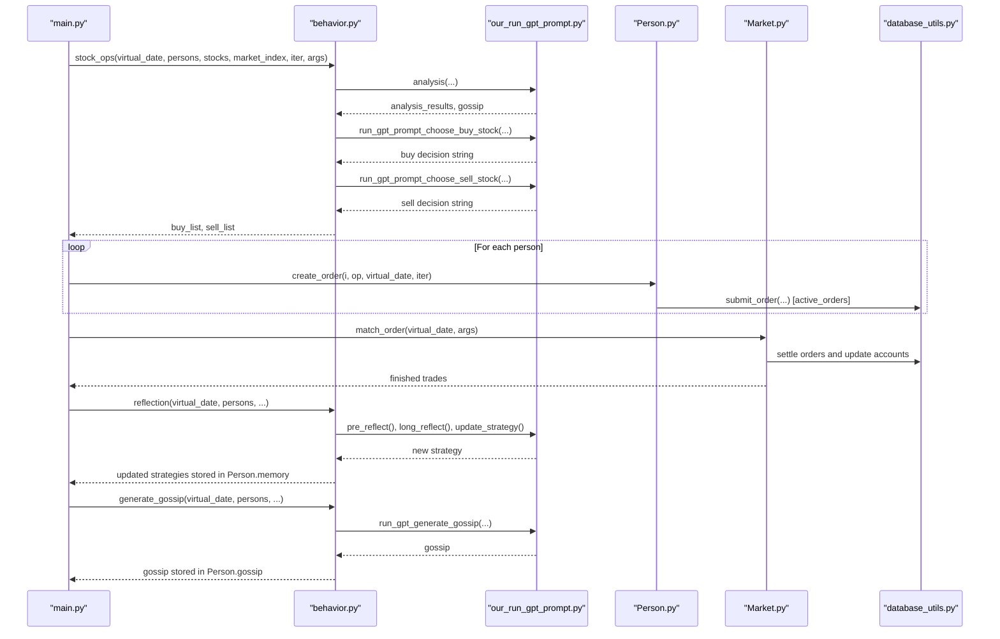
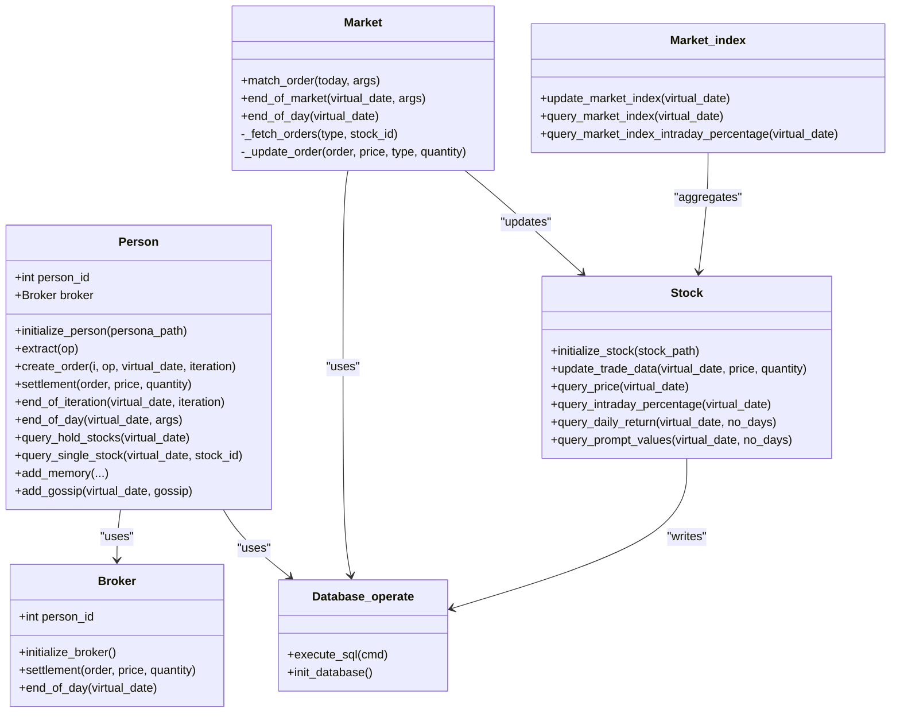
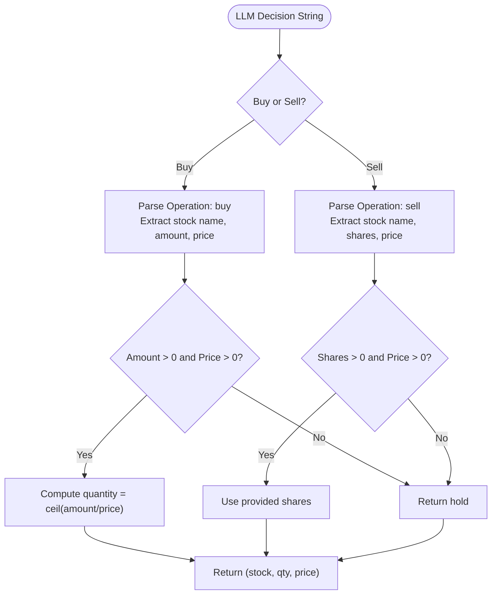
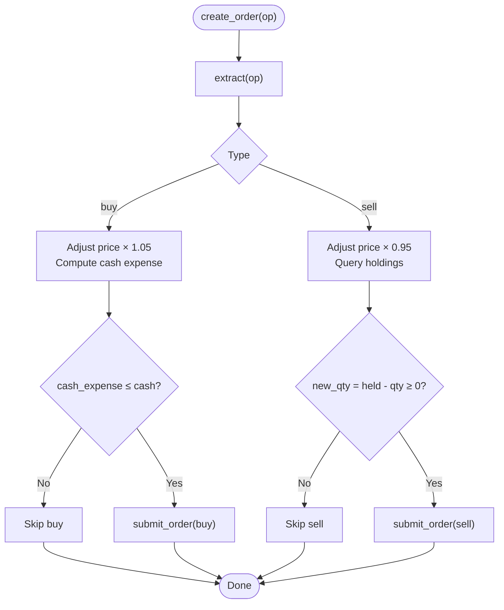
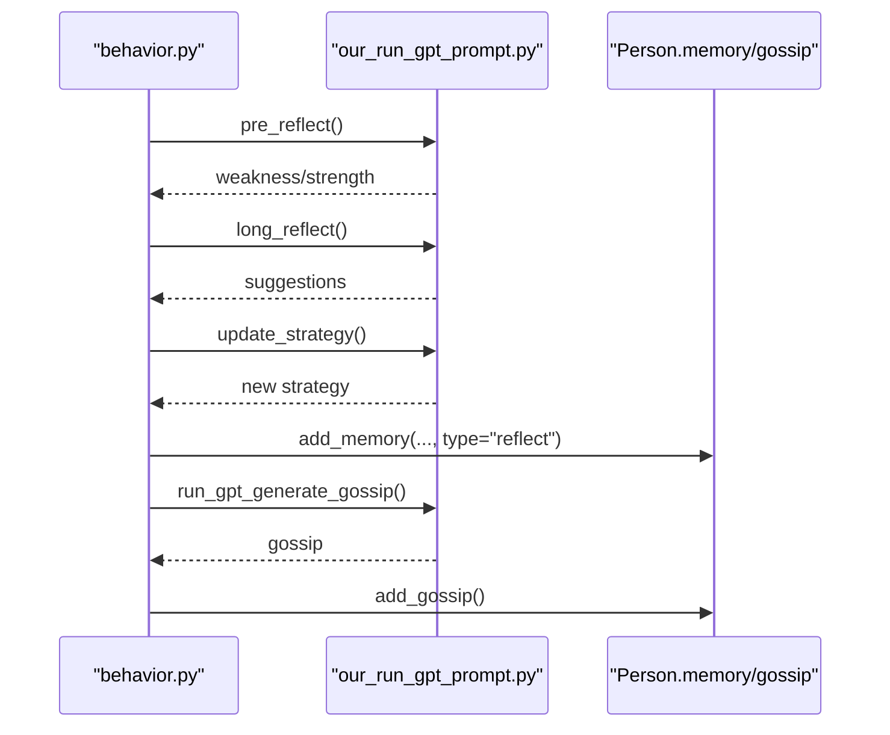
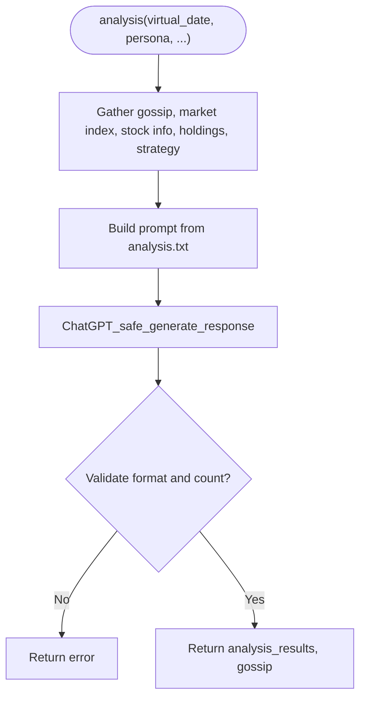
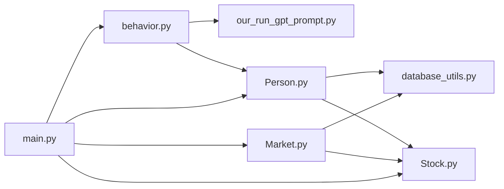

# Decision Engine

<cite>
**Referenced Files in This Document**
- [behavior.py](file://Agent-Trading-Arena/Stock_Main/behavior.py)
- [Person.py](file://Agent-Trading-Arena/Stock_Main/Person.py)
- [our_run_gpt_prompt.py](file://Agent-Trading-Arena/Stock_Main/content/our_run_gpt_prompt.py)
- [analysis.txt](file://Agent-Trading-Arena/Stock_Main/content/our_prompt_template/analysis.txt)
- [buy_based_on_analysis.txt](file://Agent-Trading-Arena/Stock_Main/content/our_prompt_template/buy_based_on_analysis.txt)
- [sell_based_on_analysis.txt](file://Agent-Trading-Arena/Stock_Main/content/our_prompt_template/sell_based_on_analysis.txt)
- [reflect.txt](file://Agent-Trading-Arena/Stock_Main/content/our_prompt_template/reflect.txt)
- [gossip.txt](file://Agent-Trading-Arena/Stock_Main/content/our_prompt_template/gossip.txt)
- [main.py](file://Agent-Trading-Arena/Stock_Main/main.py)
- [Market.py](file://Agent-Trading-Arena/Stock_Main/Market.py)
- [Stock.py](file://Agent-Trading-Arena/Stock_Main/Stock.py)
- [database_utils.py](file://Agent-Trading-Arena/Stock_Main/database_utils.py)
- [constant.py](file://Agent-Trading-Arena/Stock_Main/constant.py)
</cite>

## Table of Contents
1. [Introduction](#introduction)
2. [Project Structure](#project-structure)
3. [Core Components](#core-components)
4. [Architecture Overview](#architecture-overview)
5. [Detailed Component Analysis](#detailed-component-analysis)
6. [Dependency Analysis](#dependency-analysis)
7. [Performance Considerations](#performance-considerations)
8. [Troubleshooting Guide](#troubleshooting-guide)
9. [Conclusion](#conclusion)

## Introduction
This document explains the Decision Engine component responsible for agent trading decisions in the simulated stock trading arena. It covers how agents process buy, sell, and hold actions, how orders are created and validated, and how local decision-making integrates with LLM-powered cognition through prompt templates. It also documents cognitive functions like reflection, strategy updates, and gossip generation, and describes how market analysis and stock information feed into the decision pipeline.

## Project Structure
The Decision Engine spans several modules:
- Local decision logic and orchestration: behavior.py
- Agent order lifecycle and validation: Person.py
- LLM integration and prompt orchestration: content/our_run_gpt_prompt.py with prompt templates
- Market mechanics and order matching: Market.py
- Stock data and market index: Stock.py
- Database schema and order submission: database_utils.py
- Orchestration and scheduling: main.py

**Diagram sources**
- [behavior.py](file://Agent-Trading-Arena/Stock_Main/behavior.py#L82-L171)
- [Person.py](file://Agent-Trading-Arena/Stock_Main/Person.py#L212-L249)
- [our_run_gpt_prompt.py](file://Agent-Trading-Arena/Stock_Main/content/our_run_gpt_prompt.py#L414-L484)
- [Market.py](file://Agent-Trading-Arena/Stock_Main/Market.py#L96-L228)
- [Stock.py](file://Agent-Trading-Arena/Stock_Main/Stock.py#L14-L307)
- [database_utils.py](file://Agent-Trading-Arena/Stock_Main/database_utils.py#L224-L322)
- [main.py](file://Agent-Trading-Arena/Stock_Main/main.py#L84-L131)

**Section sources**
- [main.py](file://Agent-Trading-Arena/Stock_Main/main.py#L84-L131)
- [behavior.py](file://Agent-Trading-Arena/Stock_Main/behavior.py#L82-L171)
- [Person.py](file://Agent-Trading-Arena/Stock_Main/Person.py#L212-L249)
- [our_run_gpt_prompt.py](file://Agent-Trading-Arena/Stock_Main/content/our_run_gpt_prompt.py#L414-L484)
- [Market.py](file://Agent-Trading-Arena/Stock_Main/Market.py#L96-L228)
- [Stock.py](file://Agent-Trading-Arena/Stock_Main/Stock.py#L14-L307)
- [database_utils.py](file://Agent-Trading-Arena/Stock_Main/database_utils.py#L224-L322)

## Core Components
- Behavior orchestrator: Generates buy/sell decisions and manages reflection and gossip cycles.
- Person agent: Extracts decisions, validates quantities and cash availability, creates orders, and settles positions.
- GPT prompt integration: Assembles prompts from templates and validates LLM outputs.
- Market matcher: Executes trades, updates prices, and settles broker and agent accounts.
- Stock and market index: Provides stock data, intraday metrics, and market index updates.

**Section sources**
- [behavior.py](file://Agent-Trading-Arena/Stock_Main/behavior.py#L82-L210)
- [Person.py](file://Agent-Trading-Arena/Stock_Main/Person.py#L201-L249)
- [our_run_gpt_prompt.py](file://Agent-Trading-Arena/Stock_Main/content/our_run_gpt_prompt.py#L486-L618)
- [Market.py](file://Agent-Trading-Arena/Stock_Main/Market.py#L96-L228)
- [Stock.py](file://Agent-Trading-Arena/Stock_Main/Stock.py#L14-L307)

## Architecture Overview
The Decision Engine runs in iterations per day. At each iteration:
1. Market analysis is generated via LLM using stock, market, gossip, and personal holdings.
2. Agents receive buy/sell recommendations and memory is recorded.
3. Agents extract and validate decisions, then submit orders to the market.
4. Market matching executes trades, updates prices, and settles accounts.
5. Reflection and gossip cycles update strategies and influence future decisions.

**Diagram sources**
- [main.py](file://Agent-Trading-Arena/Stock_Main/main.py#L102-L118)
- [behavior.py](file://Agent-Trading-Arena/Stock_Main/behavior.py#L82-L171)
- [our_run_gpt_prompt.py](file://Agent-Trading-Arena/Stock_Main/content/our_run_gpt_prompt.py#L414-L484)
- [Person.py](file://Agent-Trading-Arena/Stock_Main/Person.py#L212-L249)
- [Market.py](file://Agent-Trading-Arena/Stock_Main/Market.py#L96-L228)
- [database_utils.py](file://Agent-Trading-Arena/Stock_Main/database_utils.py#L224-L242)

## Detailed Component Analysis

### Behavior Orchestrator (behavior.py)
Responsibilities:
- Generate buy/sell decisions using LLM prompts and extract structured results.
- Record agent memory for buy/sell/hold operations and reflection events.
- Manage periodic reflection cycles to update investment strategies.
- Generate gossip to influence other agents’ decisions.

Key functions:
- stock_ops: orchestrates analysis, buy/sell decisions, memory recording, and returns operation lists per agent.
- extract_for_choose_buy / extract_for_choose_sell: parse LLM outputs into stock name, quantity, and price.
- reflection: periodically triggers pre_reflect, long_reflect, and update_strategy to refine agent principles.
- generate_gossip: collects gossip from prior day memories and stores it.

Validation and extraction:
- Buy extraction enforces non-zero volume and price; computes quantity as ceil(volume/price).
- Sell extraction enforces non-zero quantity and price.
- Both extraction functions return "hold" when instructed by LLM or on parsing errors.

Memory integration:
- add_memory records stock operations, strategy, gossip, analysis, market index, stock prices, and financial situation.

**Section sources**
- [behavior.py](file://Agent-Trading-Arena/Stock_Main/behavior.py#L15-L80)
- [behavior.py](file://Agent-Trading-Arena/Stock_Main/behavior.py#L82-L171)
- [behavior.py](file://Agent-Trading-Arena/Stock_Main/behavior.py#L174-L210)

### Person Agent (Person.py)
Responsibilities:
- Extract structured decisions from behavior outputs.
- Validate decisions against available cash and holdings.
- Submit orders to the market with price adjustments.
- Settle trades and update personal financials.

Key methods:
- extract(op): converts operation tuple to typed components.
- create_order(i, op, virtual_date, iteration): validates and submits orders.
  - Buy: adjusts bid price by 1.05x, checks cash expense vs. available cash, then submits.
  - Sell: adjusts ask price by 0.95x, checks sufficient holdings, then submits.
  - Quantity validation: ensures non-negative remaining holdings after sell.
- settlement(order, price, quantity): updates account balances and positions after execution.
- end_of_iteration/end_of_day: updates assets, dividends, and daily expenses.

Order creation process:
- Price adjustment: buy price multiplied by 1.05, sell price multiplied by 0.95.
- Quantity validation: buy requires sufficient cash; sell requires sufficient shares.
- Order submission: uses submit_order to insert into active_orders.

**Section sources**
- [Person.py](file://Agent-Trading-Arena/Stock_Main/Person.py#L201-L249)
- [Person.py](file://Agent-Trading-Arena/Stock_Main/Person.py#L250-L308)
- [Person.py](file://Agent-Trading-Arena/Stock_Main/Person.py#L309-L427)
- [Person.py](file://Agent-Trading-Arena/Stock_Main/Person.py#L428-L629)

### LLM-Powered Cognition (our_run_gpt_prompt.py + Templates)
Responsibilities:
- Assemble contextual inputs (stock info, market index, gossip, holdings, strategy) into prompts.
- Validate LLM outputs to ensure structured, actionable results.
- Generate analysis, buy/sell decisions, reflection insights, and gossip.

Prompt templates:
- analysis.txt: asks for N most relevant analysis items aligned with strategy.
- buy_based_on_analysis.txt: guides buy decision with cash, minimum living expense, stock info, analysis, and strategy.
- sell_based_on_analysis.txt: guides sell decision with cash, minimum living expense, holdings, analysis, and strategy.
- reflect.txt: updates strategy based on reflection inputs.
- gossip.txt: generates gossip to influence others.

Integration helpers:
- integrate_stock_info, integrate_hold_info, integrate_gossip, integrate_gossip_info, integrate_reflect_info: assemble context from database and stock data.
- analysis, run_gpt_prompt_choose_buy_stock, run_gpt_prompt_choose_sell_stock, pre_reflect, long_reflect, update_strategy, run_gpt_generate_gossip: orchestrate prompts and validations.

Validation:
- analysis: validates multi-item bullet list with exact count.
- buy/sell prompts: validate structured Operation: buy/sell lines with required fields.
- reflection: validates Weakness/Strength format.

**Section sources**
- [our_run_gpt_prompt.py](file://Agent-Trading-Arena/Stock_Main/content/our_run_gpt_prompt.py#L414-L484)
- [our_run_gpt_prompt.py](file://Agent-Trading-Arena/Stock_Main/content/our_run_gpt_prompt.py#L486-L549)
- [our_run_gpt_prompt.py](file://Agent-Trading-Arena/Stock_Main/content/our_run_gpt_prompt.py#L551-L618)
- [our_run_gpt_prompt.py](file://Agent-Trading-Arena/Stock_Main/content/our_run_gpt_prompt.py#L151-L212)
- [our_run_gpt_prompt.py](file://Agent-Trading-Arena/Stock_Main/content/our_run_gpt_prompt.py#L364-L412)
- [analysis.txt](file://Agent-Trading-Arena/Stock_Main/content/our_prompt_template/analysis.txt#L1-L37)
- [buy_based_on_analysis.txt](file://Agent-Trading-Arena/Stock_Main/content/our_prompt_template/buy_based_on_analysis.txt#L1-L33)
- [sell_based_on_analysis.txt](file://Agent-Trading-Arena/Stock_Main/content/our_prompt_template/sell_based_on_analysis.txt#L1-L31)
- [reflect.txt](file://Agent-Trading-Arena/Stock_Main/content/our_prompt_template/reflect.txt#L1-L35)
- [gossip.txt](file://Agent-Trading-Arena/Stock_Main/content/our_prompt_template/gossip.txt#L1-L16)

### Market Matching and Settlement (Market.py)
Responsibilities:
- Fetch active orders and match buy/sell pairs.
- Enforce daily price limits and partial fulfillment rules.
- Update stock prices and volumes, settle broker and agent accounts.

Key processes:
- match_order: sorts orders by price/time, computes deal price, updates stock price, and settles matched orders.
- end_of_market: closes remaining active orders and settles broker inventory.
- _fetch_orders/_update_order: manage order lifecycle and settlement.

**Section sources**
- [Market.py](file://Agent-Trading-Arena/Stock_Main/Market.py#L96-L228)

### Stock Information and Market Index (Stock.py)
Responsibilities:
- Maintain stock OHLCV data and intraday metrics.
- Compute market index as weighted average of stock prices.
- Provide query utilities for prompt integration.

**Section sources**
- [Stock.py](file://Agent-Trading-Arena/Stock_Main/Stock.py#L14-L307)

### Database and Order Submission (database_utils.py)
Responsibilities:
- Define schema for active_orders, stock, person, account, memory, gossip.
- Provide submit_order to insert active orders with validation.
- Parse query results for downstream components.

Order submission:
- submit_order inserts into active_orders with type check and quantity > 0 assertion.

**Section sources**
- [database_utils.py](file://Agent-Trading-Arena/Stock_Main/database_utils.py#L224-L242)
- [database_utils.py](file://Agent-Trading-Arena/Stock_Main/database_utils.py#L256-L300)

## Architecture Overview

**Diagram sources**
- [Person.py](file://Agent-Trading-Arena/Stock_Main/Person.py#L143-L629)
- [Market.py](file://Agent-Trading-Arena/Stock_Main/Market.py#L12-L228)
- [Stock.py](file://Agent-Trading-Arena/Stock_Main/Stock.py#L14-L307)
- [database_utils.py](file://Agent-Trading-Arena/Stock_Main/database_utils.py#L245-L322)

## Detailed Component Analysis

### Decision Extraction and Validation
Behavior extracts structured buy/sell decisions:
- Buy extraction: parses Operation: buy with stock name, investment amount, and best buying price; computes quantity as ceil(amount/price); rejects zero values.
- Sell extraction: parses Operation: sell with stock name, number of shares, and best selling price; rejects zero values.
- Hold fallback: if LLM suggests hold or parsing fails, returns hold with null fields.

**Diagram sources**
- [behavior.py](file://Agent-Trading-Arena/Stock_Main/behavior.py#L15-L56)

**Section sources**
- [behavior.py](file://Agent-Trading-Arena/Stock_Main/behavior.py#L15-L56)

### Order Creation and Validation (Person.create_order)
Order creation logic:
- Convert order type to lowercase.
- Buy path:
  - Adjust bid price by 1.05x.
  - Compute cash expense = price × quantity.
  - Submit only if cash expense ≤ available cash.
- Sell path:
  - Adjust ask price by 0.95x.
  - Query current holdings; submit only if new quantity ≥ 0.
- Quantity validation ensures non-negative holdings post-trade.

**Diagram sources**
- [Person.py](file://Agent-Trading-Arena/Stock_Main/Person.py#L212-L249)
- [database_utils.py](file://Agent-Trading-Arena/Stock_Main/database_utils.py#L224-L242)

**Section sources**
- [Person.py](file://Agent-Trading-Arena/Stock_Main/Person.py#L212-L249)
- [database_utils.py](file://Agent-Trading-Arena/Stock_Main/database_utils.py#L224-L242)

### Cognitive Functions and Strategy Updates
Reflection and strategy update cycle:
- Pre-reflection: gathers recent memory to identify weaknesses and strengths.
- Long reflection: synthesizes recent financial and market context.
- Strategy update: produces a new concrete strategy statement.

Gossip generation:
- Integrates prior day’s gossip info and memory to produce new gossip messages.

**Diagram sources**
- [behavior.py](file://Agent-Trading-Arena/Stock_Main/behavior.py#L174-L210)
- [our_run_gpt_prompt.py](file://Agent-Trading-Arena/Stock_Main/content/our_run_gpt_prompt.py#L151-L212)
- [our_run_gpt_prompt.py](file://Agent-Trading-Arena/Stock_Main/content/our_run_gpt_prompt.py#L305-L361)
- [our_run_gpt_prompt.py](file://Agent-Trading-Arena/Stock_Main/content/our_run_gpt_prompt.py#L364-L412)

**Section sources**
- [behavior.py](file://Agent-Trading-Arena/Stock_Main/behavior.py#L174-L210)
- [our_run_gpt_prompt.py](file://Agent-Trading-Arena/Stock_Main/content/our_run_gpt_prompt.py#L151-L212)
- [our_run_gpt_prompt.py](file://Agent-Trading-Arena/Stock_Main/content/our_run_gpt_prompt.py#L305-L361)
- [our_run_gpt_prompt.py](file://Agent-Trading-Arena/Stock_Main/content/our_run_gpt_prompt.py#L364-L412)

### Market Analysis and Prompt Integration
Market analysis pipeline:
- Collects gossip, market index change, stock info, holdings, and strategy.
- Validates analysis output to ensure exact count of bullet items.
- Buy/Sell prompts validate structured Operation lines.

**Diagram sources**
- [our_run_gpt_prompt.py](file://Agent-Trading-Arena/Stock_Main/content/our_run_gpt_prompt.py#L414-L484)
- [analysis.txt](file://Agent-Trading-Arena/Stock_Main/content/our_prompt_template/analysis.txt#L1-L37)

**Section sources**
- [our_run_gpt_prompt.py](file://Agent-Trading-Arena/Stock_Main/content/our_run_gpt_prompt.py#L414-L484)
- [analysis.txt](file://Agent-Trading-Arena/Stock_Main/content/our_prompt_template/analysis.txt#L1-L37)

### Orchestration in main.py
Daily iteration flow:
- Initialize broker, market index, market, stocks, persons.
- For each day and iteration:
  - Generate gossip.
  - Run stock_ops to collect buy/sell decisions.
  - Submit orders via Person.create_order.
  - Match and settle orders via Market.
  - Update market index and agent stats.
  - Run reflection and save state.

**Section sources**
- [main.py](file://Agent-Trading-Arena/Stock_Main/main.py#L84-L131)

## Dependency Analysis

**Diagram sources**
- [behavior.py](file://Agent-Trading-Arena/Stock_Main/behavior.py#L1-L12)
- [Person.py](file://Agent-Trading-Arena/Stock_Main/Person.py#L1-L16)
- [Market.py](file://Agent-Trading-Arena/Stock_Main/Market.py#L1-L9)
- [main.py](file://Agent-Trading-Arena/Stock_Main/main.py#L8-L13)

**Section sources**
- [behavior.py](file://Agent-Trading-Arena/Stock_Main/behavior.py#L1-L12)
- [Person.py](file://Agent-Trading-Arena/Stock_Main/Person.py#L1-L16)
- [Market.py](file://Agent-Trading-Arena/Stock_Main/Market.py#L1-L9)
- [main.py](file://Agent-Trading-Arena/Stock_Main/main.py#L8-L13)

## Performance Considerations
- Prompt validation reduces retries by ensuring structured outputs.
- Order validation prevents unnecessary database writes for invalid decisions.
- Partial fulfillment and daily price limits prevent extreme volatility and reduce computational overhead.
- Iterative reflection frequency controlled by agent property avoids excessive LLM calls.

## Troubleshooting Guide
Common issues and validations:
- Invalid order type: Database schema enforces type check for orders; ensure lowercase "buy" or "sell".
- Quantity mismatch: Person.create_order enforces non-negative holdings after sell; verify query results for current holdings.
- Insufficient cash: Person.create_order checks cash expense vs. available cash before submitting buy orders.
- Parsing failures: Behavior extraction functions return hold on parsing errors; review LLM output format alignment with templates.
- Gossip and memory: Ensure Person.add_memory and Person.add_gossip are invoked to keep context for reflection and strategy updates.

**Section sources**
- [database_utils.py](file://Agent-Trading-Arena/Stock_Main/database_utils.py#L256-L261)
- [Person.py](file://Agent-Trading-Arena/Stock_Main/Person.py#L212-L249)
- [behavior.py](file://Agent-Trading-Arena/Stock_Main/behavior.py#L15-L56)
- [our_run_gpt_prompt.py](file://Agent-Trading-Arena/Stock_Main/content/our_run_gpt_prompt.py#L505-L517)
- [our_run_gpt_prompt.py](file://Agent-Trading-Arena/Stock_Main/content/our_run_gpt_prompt.py#L571-L583)

## Conclusion
The Decision Engine combines structured behavior orchestration with robust LLM integration and strict validation to produce reliable trading decisions. Agents extract, validate, and submit orders while reflection and gossip cycles continuously refine strategies. Market mechanics ensure fair and realistic price discovery, and database utilities provide a solid foundation for order lifecycle and account management.