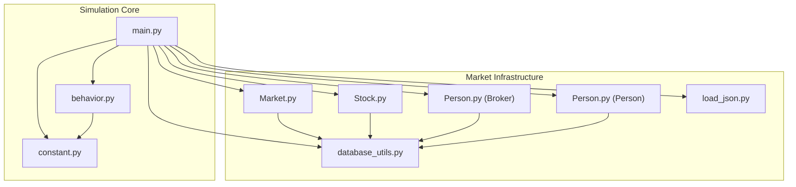
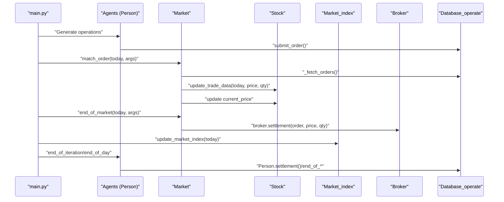
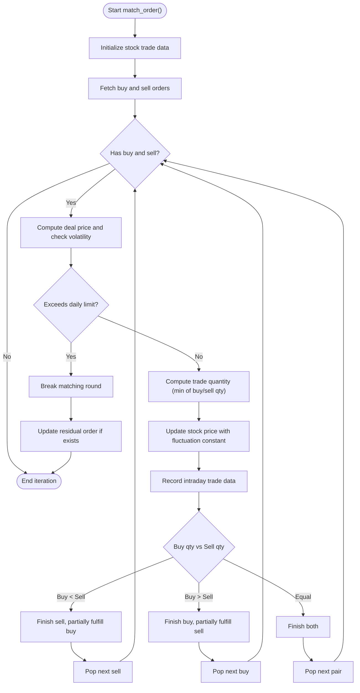
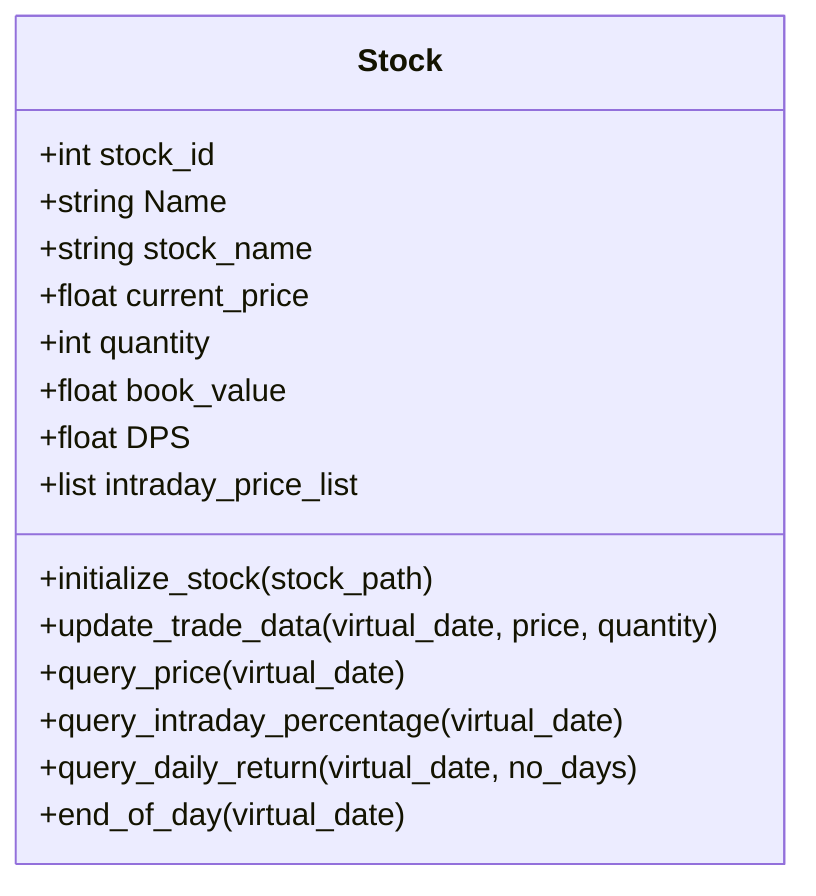
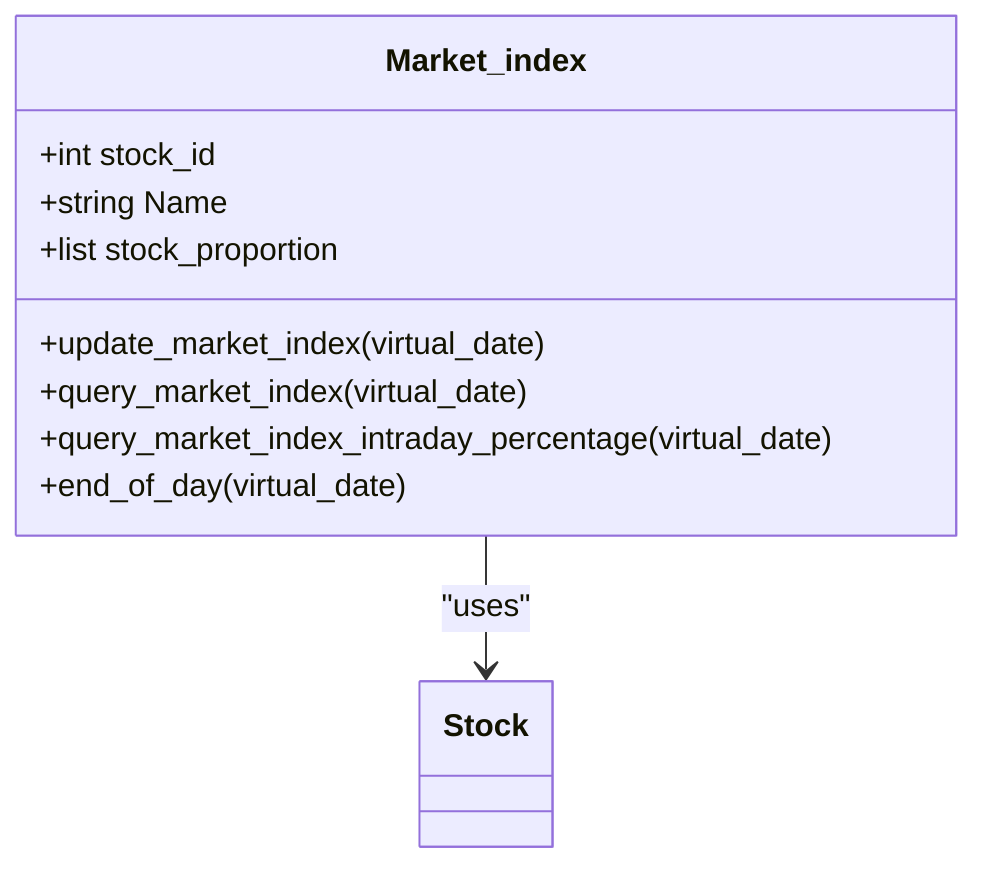
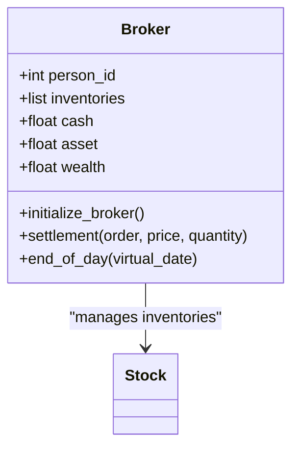
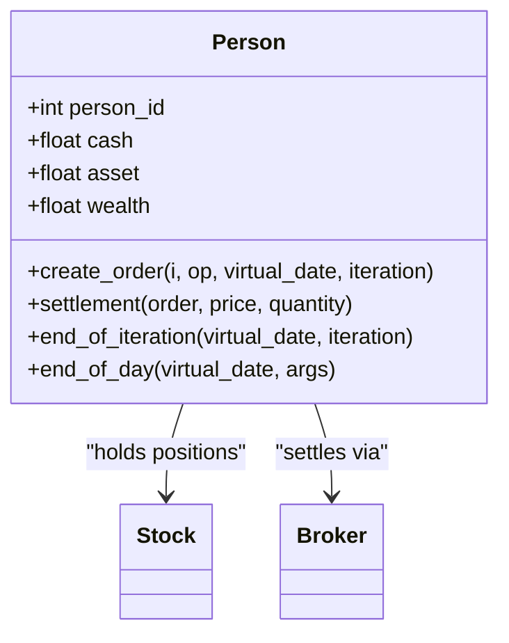
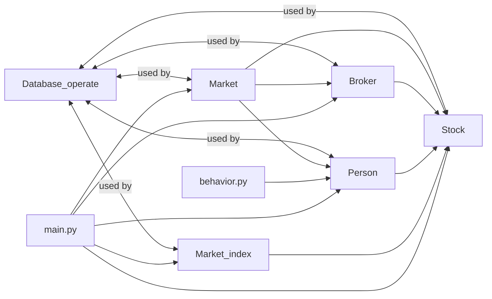

# Market System

<cite>
**Referenced Files in This Document**
- [Market.py](file://Agent-Trading-Arena/Stock_Main/Market.py)
- [Stock.py](file://Agent-Trading-Arena/Stock_Main/Stock.py)
- [Person.py](file://Agent-Trading-Arena/Stock_Main/Person.py)
- [database_utils.py](file://Agent-Trading-Arena/Stock_Main/database_utils.py)
- [load_json.py](file://Agent-Trading-Arena/Stock_Main/load_json.py)
- [main.py](file://Agent-Trading-Arena/Stock_Main/main.py)
- [constant.py](file://Agent-Trading-Arena/Stock_Main/constant.py)
- [behavior.py](file://Agent-Trading-Arena/Stock_Main/behavior.py)
</cite>

## Table of Contents
1. [Introduction](#introduction)
2. [Project Structure](#project-structure)
3. [Core Components](#core-components)
4. [Architecture Overview](#architecture-overview)
5. [Detailed Component Analysis](#detailed-component-analysis)
6. [Dependency Analysis](#dependency-analysis)
7. [Performance Considerations](#performance-considerations)
8. [Troubleshooting Guide](#troubleshooting-guide)
9. [Conclusion](#conclusion)

## Introduction
This document provides a comprehensive analysis of the Market System component in the Agent Trading Arena. It explains the Market class order matching algorithm, price formation mechanics, and daily market cycle management. It documents the Stock class design for individual stock properties and the Market_index class for calculating the overall market index. It also details the interactions between Market and Stock classes during trading iterations, including price propagation, and addresses volatility controls and partial order fulfillment. Finally, it describes the Broker class role in inventory management and settlement.

## Project Structure
The Market System resides under the Stock_Main directory and integrates several modules:
- Market.py: Implements Market class with order matching and daily lifecycle
- Stock.py: Defines Stock and Market_index classes for individual and composite market metrics
- Person.py: Contains Broker and Person classes for trading participants and settlement
- database_utils.py: Provides database abstraction and schema definitions
- load_json.py: Handles loading and saving simulation state
- main.py: Orchestrates the simulation lifecycle and trading iterations
- constant.py: Holds constants like stock names
- behavior.py: Generates agent operations and reflections

**Diagram sources**
- [main.py](file://Agent-Trading-Arena/Stock_Main/main.py#L1-L136)
- [Market.py](file://Agent-Trading-Arena/Stock_Main/Market.py#L1-L278)
- [Stock.py](file://Agent-Trading-Arena/Stock_Main/Stock.py#L1-L307)
- [Person.py](file://Agent-Trading-Arena/Stock_Main/Person.py#L1-L629)
- [database_utils.py](file://Agent-Trading-Arena/Stock_Main/database_utils.py#L1-L322)
- [behavior.py](file://Agent-Trading-Arena/Stock_Main/behavior.py#L1-L210)
- [constant.py](file://Agent-Trading-Arena/Stock_Main/constant.py#L1-L2)
- [load_json.py](file://Agent-Trading-Arena/Stock_Main/load_json.py#L1-L134)

**Section sources**
- [main.py](file://Agent-Trading-Arena/Stock_Main/main.py#L1-L136)

## Core Components
- Market: Central orchestrator for order matching, price updates, and daily lifecycle events
- Stock: Individual stock entity with price history, intraday tracking, and daily OHLCV persistence
- Market_index: Composite index derived from weighted stock book values
- Broker: Inventory manager and settlement agent for market operations
- Person: Individual traders with account holdings and daily settlement
- Database_operate and parsing utilities: Data persistence and query parsing

Key implementation references:
- Market.match_order(): Order matching engine and price updates
- Market.end_of_market(): Finalization of remaining orders and settlement
- Stock.update_trade_data(): Intraday and daily OHLCV aggregation
- Market_index.update_market_index(): Composite index calculation and persistence

**Section sources**
- [Market.py](file://Agent-Trading-Arena/Stock_Main/Market.py#L96-L200)
- [Market.py](file://Agent-Trading-Arena/Stock_Main/Market.py#L30-L95)
- [Stock.py](file://Agent-Trading-Arena/Stock_Main/Stock.py#L67-L113)
- [Stock.py](file://Agent-Trading-Arena/Stock_Main/Stock.py#L227-L277)
- [Person.py](file://Agent-Trading-Arena/Stock_Main/Person.py#L18-L141)

## Architecture Overview
The Market System follows a layered architecture:
- Simulation orchestration (main.py) drives daily iterations and agent actions
- Market coordinates order matching and price updates
- Stock maintains per-stock state and OHLCV records
- Market_index aggregates composite market metrics
- Broker and Person manage inventory, cash, and settlement
- Database layer persists all state and enables historical queries

**Diagram sources**
- [main.py](file://Agent-Trading-Arena/Stock_Main/main.py#L100-L120)
- [Market.py](file://Agent-Trading-Arena/Stock_Main/Market.py#L96-L200)
- [Stock.py](file://Agent-Trading-Arena/Stock_Main/Stock.py#L67-L113)
- [Person.py](file://Agent-Trading-Arena/Stock_Main/Person.py#L250-L362)
- [database_utils.py](file://Agent-Trading-Arena/Stock_Main/database_utils.py#L224-L243)

## Detailed Component Analysis

### Market Class: Order Matching and Lifecycle
The Market class coordinates trading within each iteration and manages the daily lifecycle.

- Order fetching and sorting:
  - Buy orders sorted by price ascending and timestamp ascending
  - Sell orders sorted by price descending and timestamp ascending
  - All orders query for end-of-market processing

- Price formation mechanics:
  - Deal price computed as average of buyer and seller prices
  - Current stock price updated using a weighted formula incorporating a fluctuation constant and total quantity
  - Intraday trade data recorded via Stock.update_trade_data()

- Volatility control:
  - Daily price change limit enforced against the previous close
  - Excessive moves halt matching for that iteration

- Partial order fulfillment:
  - When broker inventory is insufficient for a buy order, the order becomes partially fulfilled
  - Remaining quantity is re-inserted as a new active order

- Settlement:
  - Individual traders settle via Person.settlement()
  - Broker settles via Broker.settlement()

Key implementation references:
- [Market.match_order()](file://Agent-Trading-Arena/Stock_Main/Market.py#L96-L199)
- [Market.end_of_market()](file://Agent-Trading-Arena/Stock_Main/Market.py#L30-L95)
- [Market._fetch_orders()](file://Agent-Trading-Arena/Stock_Main/Market.py#L202-L228)
- [Market._update_order()](file://Agent-Trading-Arena/Stock_Main/Market.py#L230-L265)

**Diagram sources**
- [Market.py](file://Agent-Trading-Arena/Stock_Main/Market.py#L96-L199)

**Section sources**
- [Market.py](file://Agent-Trading-Arena/Stock_Main/Market.py#L96-L200)
- [Market.py](file://Agent-Trading-Arena/Stock_Main/Market.py#L202-L265)

### Stock Class: Properties and Trade Data
The Stock class encapsulates individual stock attributes and maintains OHLCV records.

- Initialization:
  - Loads initial quantities, names, and last known prices from JSON
  - Seeds historical stock table with past prices

- Intraday tracking:
  - Maintains intraday price list
  - Records daily OHLCV via update_trade_data()

- Queries:
  - query_price(): Retrieve daily OHLCV row
  - query_intraday_percentage(): Today’s price change vs opening
  - query_daily_return(): N-day returns and volume fluctuations

- End-of-day persistence:
  - Resets intraday list and inserts closing OHLCV record

Key implementation references:
- [Stock.__init__() and initialization](file://Agent-Trading-Arena/Stock_Main/Stock.py#L28-L51)
- [Stock.update_trade_data()](file://Agent-Trading-Arena/Stock_Main/Stock.py#L67-L113)
- [Stock.query_price()](file://Agent-Trading-Arena/Stock_Main/Stock.py#L114-L127)
- [Stock.query_intraday_percentage()](file://Agent-Trading-Arena/Stock_Main/Stock.py#L128-L139)
- [Stock.query_daily_return()](file://Agent-Trading-Arena/Stock_Main/Stock.py#L140-L172)
- [Stock.end_of_day()](file://Agent-Trading-Arena/Stock_Main/Stock.py#L52-L66)

**Diagram sources**
- [Stock.py](file://Agent-Trading-Arena/Stock_Main/Stock.py#L14-L307)

**Section sources**
- [Stock.py](file://Agent-Trading-Arena/Stock_Main/Stock.py#L14-L307)

### Market_index Class: Composite Index Calculation
The Market_index class computes a weighted composite index based on stock book values.

- Initialization:
  - Sums all stock book values and computes proportions

- Daily update:
  - Calculates index as weighted sum of current prices
  - Updates OHLCV fields and persists to database

- Queries:
  - query_market_index(): Retrieve current index OHLCV
  - query_market_index_intraday_percentage(): Today’s index change vs opening

Key implementation references:
- [Market_index.__init__()](file://Agent-Trading-Arena/Stock_Main/Stock.py#L212-L223)
- [Market_index.update_market_index()](file://Agent-Trading-Arena/Stock_Main/Stock.py#L227-L277)
- [Market_index.query_market_index()](file://Agent-Trading-Arena/Stock_Main/Stock.py#L278-L289)
- [Market_index.query_market_index_intraday_percentage()](file://Agent-Trading-Arena/Stock_Main/Stock.py#L291-L296)

**Diagram sources**
- [Stock.py](file://Agent-Trading-Arena/Stock_Main/Stock.py#L212-L296)

**Section sources**
- [Stock.py](file://Agent-Trading-Arena/Stock_Main/Stock.py#L212-L296)

### Broker Class: Inventory Management and Settlement
The Broker acts as the market maker and settlement agent.

- Initialization:
  - Allocates IPO quantities to broker inventories
  - Initializes account rows for each stock

- Settlement:
  - For sells: credits cash, debits asset, decrements inventory
  - For buys: debits cash, credits asset, increments inventory
  - Updates account quantities and dividends

- End-of-day:
  - Carries forward inventories to next day
  - Recomputes asset and wealth

Key implementation references:
- [Broker.__init__() and initialize_broker()](file://Agent-Trading-Arena/Stock_Main/Person.py#L33-L60)
- [Broker.settlement()](file://Agent-Trading-Arena/Stock_Main/Person.py#L65-L97)
- [Broker.end_of_day()](file://Agent-Trading-Arena/Stock_Main/Person.py#L112-L141)

**Diagram sources**
- [Person.py](file://Agent-Trading-Arena/Stock_Main/Person.py#L18-L141)

**Section sources**
- [Person.py](file://Agent-Trading-Arena/Stock_Main/Person.py#L18-L141)

### Person Class: Trader Accounts and Daily Settlement
The Person class manages individual trader accounts and daily financial updates.

- Initialization:
  - Loads persona data and initializes account/person rows

- Order creation:
  - Creates buy/sell orders with adjusted bid prices
  - Submits to active_orders via submit_order()

- Settlement:
  - For buys: debits cash, credits asset, updates cost basis and profit
  - For sells: credits cash, debits asset, updates quantities and profit

- End-of-iteration and end-of-day:
  - Recomputes assets, wealth, and daily expenses
  - Carries forward holdings to next day

Key implementation references:
- [Person.create_order()](file://Agent-Trading-Arena/Stock_Main/Person.py#L212-L249)
- [Person.settlement()](file://Agent-Trading-Arena/Stock_Main/Person.py#L250-L308)
- [Person.end_of_iteration()](file://Agent-Trading-Arena/Stock_Main/Person.py#L309-L362)
- [Person.end_of_day()](file://Agent-Trading-Arena/Stock_Main/Person.py#L364-L428)

**Diagram sources**
- [Person.py](file://Agent-Trading-Arena/Stock_Main/Person.py#L143-L428)

**Section sources**
- [Person.py](file://Agent-Trading-Arena/Stock_Main/Person.py#L143-L428)

## Dependency Analysis
The Market System exhibits clear separation of concerns with explicit dependencies:

**Diagram sources**
- [Market.py](file://Agent-Trading-Arena/Stock_Main/Market.py#L1-L278)
- [Stock.py](file://Agent-Trading-Arena/Stock_Main/Stock.py#L1-L307)
- [Person.py](file://Agent-Trading-Arena/Stock_Main/Person.py#L1-L629)
- [database_utils.py](file://Agent-Trading-Arena/Stock_Main/database_utils.py#L245-L322)
- [main.py](file://Agent-Trading-Arena/Stock_Main/main.py#L1-L136)
- [behavior.py](file://Agent-Trading-Arena/Stock_Main/behavior.py#L1-L210)

**Section sources**
- [Market.py](file://Agent-Trading-Arena/Stock_Main/Market.py#L1-L278)
- [Stock.py](file://Agent-Trading-Arena/Stock_Main/Stock.py#L1-L307)
- [Person.py](file://Agent-Trading-Arena/Stock_Main/Person.py#L1-L629)
- [database_utils.py](file://Agent-Trading-Arena/Stock_Main/database_utils.py#L245-L322)
- [main.py](file://Agent-Trading-Arena/Stock_Main/main.py#L1-L136)
- [behavior.py](file://Agent-Trading-Arena/Stock_Main/behavior.py#L1-L210)

## Performance Considerations
- Order fetching and sorting:
  - Orders are fetched per stock and sorted by price/time; ensure indices exist on active_orders for efficient sorting
- Price updates:
  - Weighted averaging reduces computational overhead compared to full history recalculation
- Fluctuation constant:
  - Tuning Fluctuation_Constant balances realism and stability
- Database operations:
  - Batched updates and minimal round-trips improve throughput
- Memory footprint:
  - Intraday price lists should be trimmed at end-of-day to prevent growth

## Troubleshooting Guide
Common issues and resolutions:

- Price volatility limits:
  - Symptom: Matching halts mid-round
  - Cause: Deal price exceeds Daily_Price_Limit relative to previous close
  - Resolution: Adjust Daily_Price_Limit or reduce order sizes/prices

- Partial order fulfillment:
  - Symptom: Active order remains after matching
  - Cause: Insufficient broker inventory for full buy quantity
  - Resolution: Monitor broker inventories and adjust IPO quantities

- Order status inconsistencies:
  - Symptom: Orders remain active beyond expectations
  - Cause: Missing or incorrect status transitions
  - Resolution: Verify _update_order() logic and database constraints

- Settlement discrepancies:
  - Symptom: Cash or asset mismatches
  - Cause: Incorrect sign or quantity adjustments
  - Resolution: Review Broker.settlement() and Person.settlement() calculations

- Database errors:
  - Symptom: SQL exceptions or constraint violations
  - Cause: Schema mismatches or invalid data types
  - Resolution: Validate Database_operate schema and constraints

**Section sources**
- [Market.py](file://Agent-Trading-Arena/Stock_Main/Market.py#L44-L53)
- [Market.py](file://Agent-Trading-Arena/Stock_Main/Market.py#L55-L61)
- [Market.py](file://Agent-Trading-Arena/Stock_Main/Market.py#L230-L265)
- [Person.py](file://Agent-Trading-Arena/Stock_Main/Person.py#L65-L97)
- [Person.py](file://Agent-Trading-Arena/Stock_Main/Person.py#L250-L308)
- [database_utils.py](file://Agent-Trading-Arena/Stock_Main/database_utils.py#L256-L300)

## Conclusion
The Market System integrates Market, Stock, Market_index, Broker, and Person classes with a robust database layer to simulate realistic trading dynamics. The Market class implements a fair and efficient order matching algorithm with volatility controls and partial fulfillment. The Stock class maintains granular intraday and daily records, while Market_index aggregates composite market metrics. Broker and Person classes handle inventory and financial settlements, ensuring a complete lifecycle from order placement to daily accounting. Proper tuning of parameters like Daily_Price_Limit and Fluctuation_Constant, along with careful database schema maintenance, ensures stable and accurate simulations.