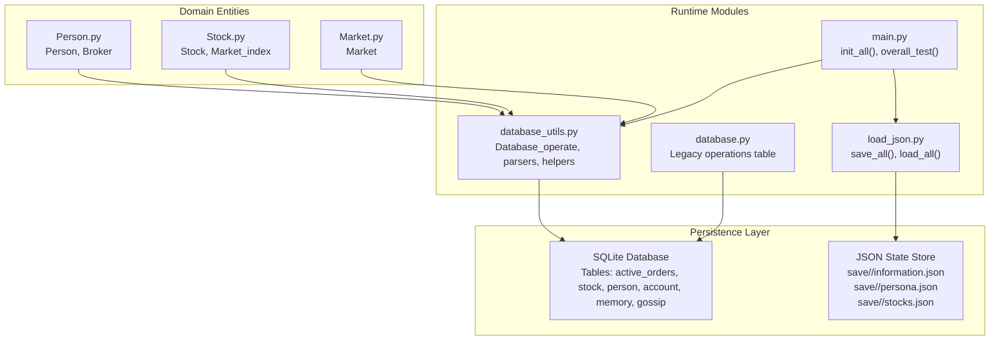
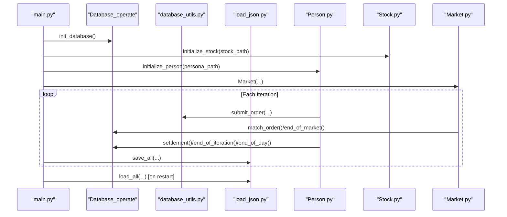
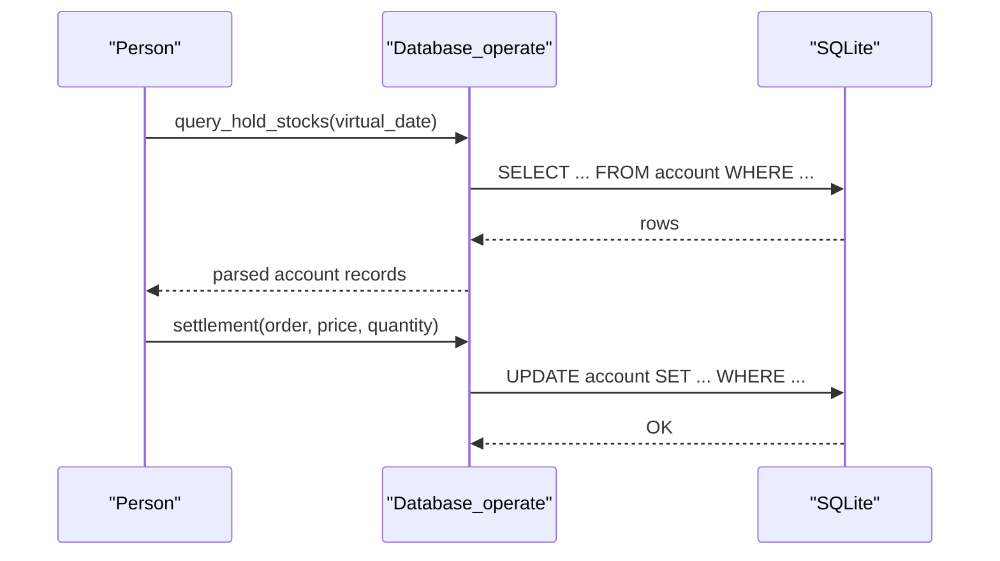
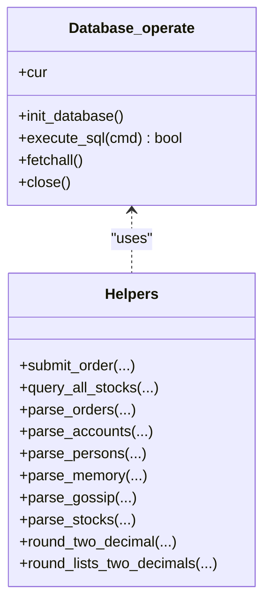
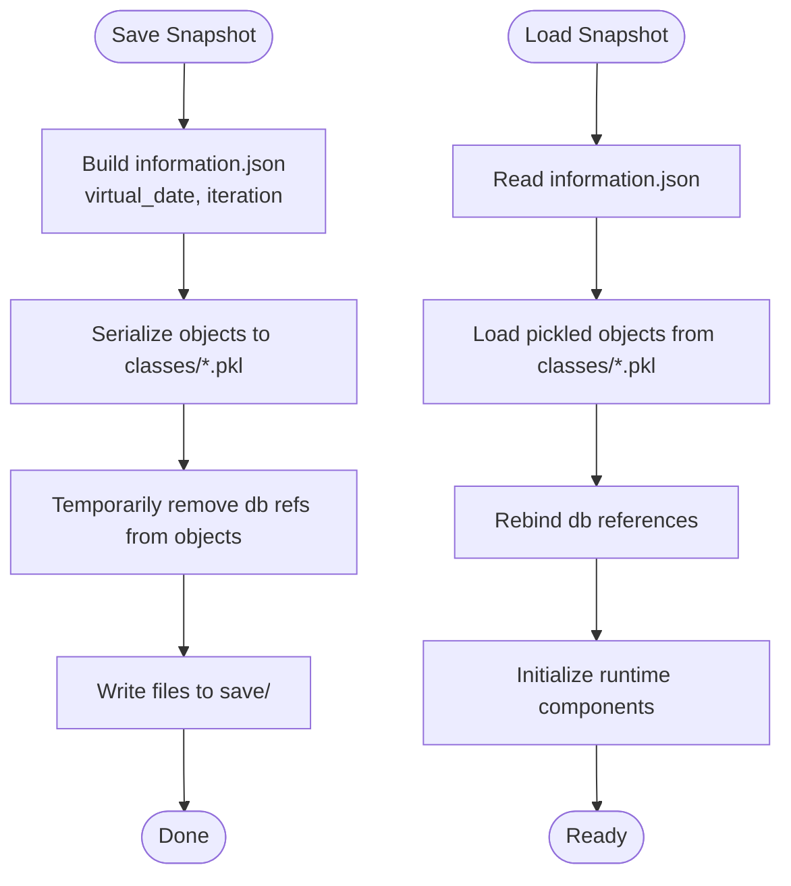
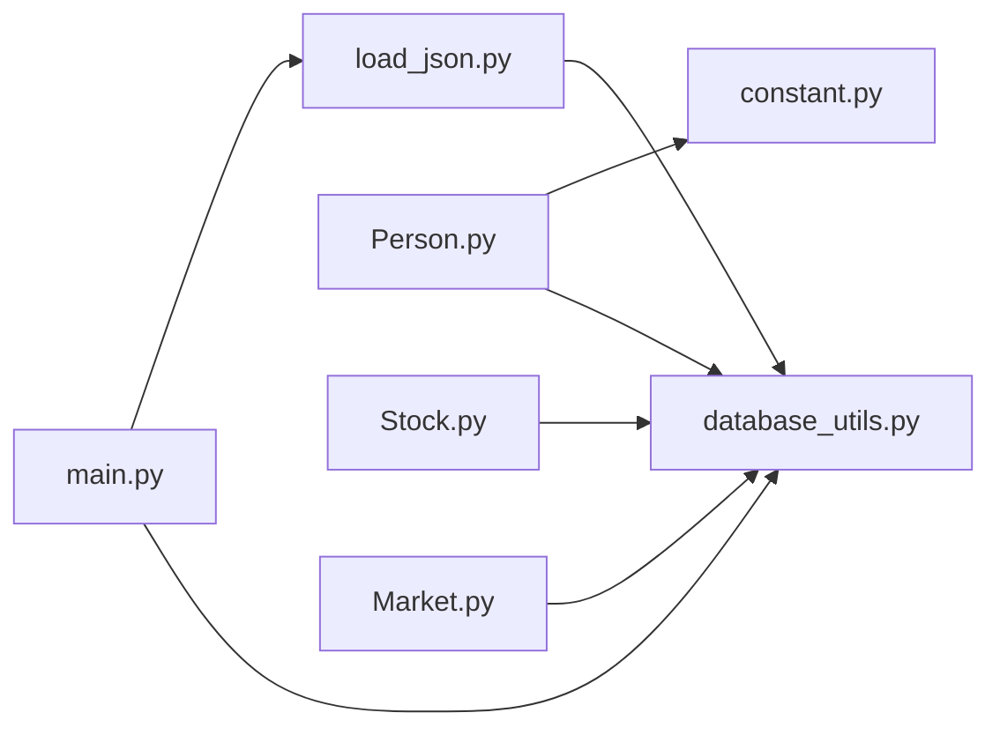
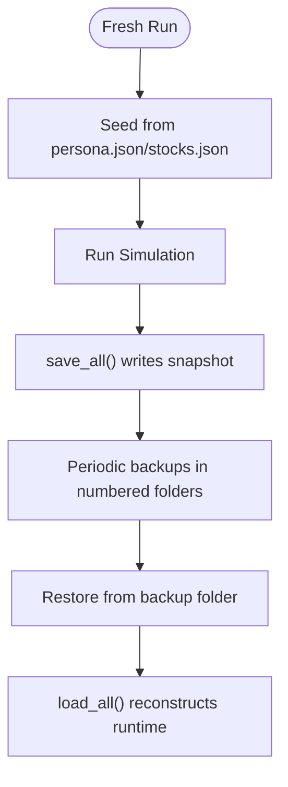

# Data Management

<cite>
**Referenced Files in This Document**
- [database.py](file://Agent-Trading-Arena/Stock_Main/database.py)
- [database_utils.py](file://Agent-Trading-Arena/Stock_Main/database_utils.py)
- [load_json.py](file://Agent-Trading-Arena/Stock_Main/load_json.py)
- [main.py](file://Agent-Trading-Arena/Stock_Main/main.py)
- [Person.py](file://Agent-Trading-Arena/Stock_Main/Person.py)
- [Stock.py](file://Agent-Trading-Arena/Stock_Main/Stock.py)
- [Market.py](file://Agent-Trading-Arena/Stock_Main/Market.py)
- [constant.py](file://Agent-Trading-Arena/Stock_Main/constant.py)
- [save/init/persona.json](file://Agent-Trading-Arena/Stock_Main/save/init/persona.json)
- [save/init/stocks.json](file://Agent-Trading-Arena/Stock_Main/save/init/stocks.json)
</cite>

## Table of Contents
1. [Introduction](#introduction)
2. [Project Structure](#project-structure)
3. [Core Components](#core-components)
4. [Architecture Overview](#architecture-overview)
5. [Detailed Component Analysis](#detailed-component-analysis)
6. [Dependency Analysis](#dependency-analysis)
7. [Performance Considerations](#performance-considerations)
8. [Troubleshooting Guide](#troubleshooting-guide)
9. [Conclusion](#conclusion)
10. [Appendices](#appendices)

## Introduction
This document describes the data model and persistence layer of the Agent Trading Arena simulation. It covers the SQLite database schema, the JSON-based state saving system, and the roles of key modules that handle CRUD operations, transactions, and state serialization. It also explains how agents retrieve financial status and market data, and outlines data lifecycle management, backup strategies, and recovery procedures.

## Project Structure
The persistence layer spans two complementary mechanisms:
- SQLite database for real-time operational data and historical market records
- JSON-based state serialization for snapshots and recovery



**Diagram sources**
- [database.py](file://Agent-Trading-Arena/Stock_Main/database.py#L44-L133)
- [database_utils.py](file://Agent-Trading-Arena/Stock_Main/database_utils.py#L245-L322)
- [load_json.py](file://Agent-Trading-Arena/Stock_Main/load_json.py#L45-L122)
- [main.py](file://Agent-Trading-Arena/Stock_Main/main.py#L51-L81)
- [Person.py](file://Agent-Trading-Arena/Stock_Main/Person.py#L18-L629)
- [Stock.py](file://Agent-Trading-Arena/Stock_Main/Stock.py#L14-L307)
- [Market.py](file://Agent-Trading-Arena/Stock_Main/Market.py#L12-L278)

**Section sources**
- [main.py](file://Agent-Trading-Arena/Stock_Main/main.py#L51-L81)
- [database_utils.py](file://Agent-Trading-Arena/Stock_Main/database_utils.py#L245-L322)
- [load_json.py](file://Agent-Trading-Arena/Stock_Main/load_json.py#L45-L122)

## Core Components
- Database_operate: Initializes and manages SQLite tables, executes SQL statements, and exposes a cursor for queries.
- Parsers: Convert raw SQL results into structured dictionaries for each domain entity.
- Order submission and matching: Manage active_orders and settle trades, updating person/account records.
- JSON state management: Serialize/deserialize runtime objects and metadata for snapshots and recovery.

Key responsibilities:
- Define and maintain schema for active_orders, stock, person, account, memory, gossip
- Provide CRUD helpers and transactional execution
- Persist and restore simulation state via JSON and pickled objects

**Section sources**
- [database_utils.py](file://Agent-Trading-Arena/Stock_Main/database_utils.py#L245-L322)
- [database.py](file://Agent-Trading-Arena/Stock_Main/database.py#L44-L133)
- [load_json.py](file://Agent-Trading-Arena/Stock_Main/load_json.py#L45-L122)

## Architecture Overview
The system maintains a dual-layer persistence strategy:
- Real-time operational data in SQLite tables
- Snapshot-based state stored as JSON and pickled objects



**Diagram sources**
- [main.py](file://Agent-Trading-Arena/Stock_Main/main.py#L51-L131)
- [database_utils.py](file://Agent-Trading-Arena/Stock_Main/database_utils.py#L224-L242)
- [Person.py](file://Agent-Trading-Arena/Stock_Main/Person.py#L212-L248)
- [Market.py](file://Agent-Trading-Arena/Stock_Main/Market.py#L96-L200)
- [load_json.py](file://Agent-Trading-Arena/Stock_Main/load_json.py#L45-L122)

## Detailed Component Analysis

### SQLite Schema and Entity Relationships
The system defines six core tables with explicit constraints and relationships:

- active_orders
  - Purpose: Track live buy/sell orders with timestamps and statuses
  - Primary key: timestamp (integer)
  - Constraints: type check ('sell','buy'), status check ('active','closed','finished')
  - Foreign keys: stock_id, person_id reference stock and person tables
  - Additional fields: virtual_date, weekday, iteration, price, quantity

- stock
  - Purpose: Historical OHLCV and intraday aggregates for each trading day
  - Primary key: composite (stock_id, virtual_date)
  - Additional fields: volume, quantity, last_price, begin_price, highest_price, lowest_price

- person
  - Purpose: Agent financial profile and daily balances
  - Primary key: composite (person_id, virtual_date)
  - Additional fields: cash, asset, wealth, work_income, capital_gain, daily_expense, principle

- account
  - Purpose: Per-agent holdings per stock per day
  - Primary key: composite (person_id, stock_id, virtual_date)
  - Additional fields: quantity, cost_price, current_price, profit, start_date

- memory
  - Purpose: Agent reflective notes and contextual data per iteration
  - Primary key: composite (person_id, virtual_date, iteration)
  - Additional fields: stock_operations, strategy, type, gossip, analysis_for_stocks, analysis_for_strategy, stock_prices, market_change, financial_situation

- gossip
  - Purpose: Agent-to-agent information exchange
  - Primary key: composite (person_id, virtual_date)
  - Additional fields: gossip text

Constraints and checks:
- ENUM checks on type/status fields
- Decimal rounding via helper functions for precision consistency

```mermaid
erDiagram
ACTIVE_ORDERS {
integer timestamp PK
integer virtual_date
integer weekday
integer iteration
integer stock_id
integer person_id
text type CK
numeric price
integer quantity
text status CK
}
STOCK {
integer stock_id
integer virtual_date
integer weekday
numeric volume
integer quantity
numeric last_price
numeric begin_price
numeric highest_price
numeric lowest_price
}
PERSON {
integer person_id
integer virtual_date
numeric cash
numeric asset
numeric wealth
numeric work_income
numeric capital_gain
numeric daily_expense
text principle
}
ACCOUNT {
integer person_id
integer stock_id
integer virtual_date
integer weekday
integer quantity
numeric cost_price
numeric current_price
numeric profit
integer start_date
}
MEMORY {
integer person_id
integer virtual_date
integer iteration
text stock_operations
text strategy
text type CK
text gossip
text analysis_for_stocks
text analysis_for_strategy
text stock_prices
text market_change
text financial_situation
}
GOSSIP {
integer person_id
integer virtual_date
text gossip
}
ACTIVE_ORDERS }o--|| STOCK : "stock_id"
ACTIVE_ORDERS }o--|| PERSON : "person_id"
ACCOUNT }o--|| PERSON : "person_id"
ACCOUNT }o--|| STOCK : "stock_id"
MEMORY }o--|| PERSON : "person_id"
GOSSIP }o--|| PERSON : "person_id"
```

**Diagram sources**
- [database_utils.py](file://Agent-Trading-Arena/Stock_Main/database_utils.py#L256-L300)

**Section sources**
- [database_utils.py](file://Agent-Trading-Arena/Stock_Main/database_utils.py#L256-L300)

### Data Access Patterns
Agents and market logic access data through:
- Query helpers: query_all_stocks, parse_* functions
- CRUD operations: insert/update/delete via Database_operate.execute_sql
- Order lifecycle: submit_order, match_order, end_of_market, settlement

Examples of access patterns:
- Agent financial status: Person.query_person, Person.query_hold_stocks, Person.query_account
- Market data: Stock.query_price, Stock.query_daily_return, Market_index.query_market_index
- Memory and gossip: Person.add_memory, Person.query_memory, Person.add_gossip, Person.query_gossip



**Diagram sources**
- [Person.py](file://Agent-Trading-Arena/Stock_Main/Person.py#L429-L451)
- [Person.py](file://Agent-Trading-Arena/Stock_Main/Person.py#L250-L307)

**Section sources**
- [Person.py](file://Agent-Trading-Arena/Stock_Main/Person.py#L429-L451)
- [Person.py](file://Agent-Trading-Arena/Stock_Main/Person.py#L250-L307)
- [Stock.py](file://Agent-Trading-Arena/Stock_Main/Stock.py#L114-L126)
- [Stock.py](file://Agent-Trading-Arena/Stock_Main/Stock.py#L140-L171)
- [Market.py](file://Agent-Trading-Arena/Stock_Main/Market.py#L202-L228)

### Role of database_utils.py
- Provides Database_operate with init_database that creates all six tables
- Offers parsing functions to transform SQL results into typed dictionaries
- Exposes helpers like submit_order, query_all_stocks, and rounding utilities
- Centralizes transactional execution and error logging



**Diagram sources**
- [database_utils.py](file://Agent-Trading-Arena/Stock_Main/database_utils.py#L245-L322)
- [database_utils.py](file://Agent-Trading-Arena/Stock_Main/database_utils.py#L12-L153)

**Section sources**
- [database_utils.py](file://Agent-Trading-Arena/Stock_Main/database_utils.py#L245-L322)
- [database_utils.py](file://Agent-Trading-Arena/Stock_Main/database_utils.py#L12-L153)

### Role of load_json.py
- save_all: Serializes runtime objects (persons, stocks, market, market_index) to pickled files under save/<save_name>/classes/, writes information.json with virtual_date and iteration
- load_all: Restores saved objects and rebinds database references



**Diagram sources**
- [load_json.py](file://Agent-Trading-Arena/Stock_Main/load_json.py#L45-L122)

**Section sources**
- [load_json.py](file://Agent-Trading-Arena/Stock_Main/load_json.py#L45-L122)

### Legacy Operations Table (database.py)
The legacy operations table is defined and used for prompt generation and historical operation parsing. While not part of the core persistence layer, it demonstrates the parsing infrastructure used across the system.

**Section sources**
- [database.py](file://Agent-Trading-Arena/Stock_Main/database.py#L44-L133)

### Sample Data Structures
- persona.json: Defines agent identities and initial financial attributes
- stocks.json: Defines stock metadata and initial price history

Representative structures:
- persona.json: Array of objects with fields such as person_id, name, occupation, principle, investment_duration, daily_income_from_job, cash, minimum_living_expense
- stocks.json: Array of objects with fields such as stock_id, stock_name, past_stock_last_prices, quantity

These files are loaded during initialization and used to seed the database with initial person and stock records.

**Section sources**
- [save/init/persona.json](file://Agent-Trading-Arena/Stock_Main/save/init/persona.json#L1-L99)
- [save/init/stocks.json](file://Agent-Trading-Arena/Stock_Main/save/init/stocks.json#L1-L21)

## Dependency Analysis
- main.py orchestrates initialization, runs simulations, and triggers save_all
- Person.py, Stock.py, Market.py depend on database_utils.py for database operations and parsing
- load_json.py depends on database_utils for schema creation and on pickle/json for serialization
- constant.py provides stock name constants used in queries



**Diagram sources**
- [main.py](file://Agent-Trading-Arena/Stock_Main/main.py#L8-L13)
- [Person.py](file://Agent-Trading-Arena/Stock_Main/Person.py#L1-L16)
- [Stock.py](file://Agent-Trading-Arena/Stock_Main/Stock.py#L1-L11)
- [Market.py](file://Agent-Trading-Arena/Stock_Main/Market.py#L1-L10)
- [constant.py](file://Agent-Trading-Arena/Stock_Main/constant.py#L1-L2)

**Section sources**
- [main.py](file://Agent-Trading-Arena/Stock_Main/main.py#L8-L13)
- [Person.py](file://Agent-Trading-Arena/Stock_Main/Person.py#L1-L16)
- [Stock.py](file://Agent-Trading-Arena/Stock_Main/Stock.py#L1-L11)
- [Market.py](file://Agent-Trading-Arena/Stock_Main/Market.py#L1-L10)
- [constant.py](file://Agent-Trading-Arena/Stock_Main/constant.py#L1-L2)

## Performance Considerations
- Transaction batching: Group related updates to minimize commits
- Indexing: Consider adding indexes on frequently queried columns (e.g., person_id, stock_id, virtual_date) to improve join performance
- Decimal precision: Rounding utilities ensure consistent precision across calculations
- Query granularity: Use targeted queries (e.g., per-person or per-stock) to reduce result sizes

[No sources needed since this section provides general guidance]

## Troubleshooting Guide
Common issues and remedies:
- Database errors: Database_operate.execute_sql prints errors and returns False; inspect command and constraints
- Missing data: Verify that information.json exists and contains expected virtual_date and iteration
- Serialization failures: Ensure classes directory exists and is writable; confirm pickle/unpickle compatibility
- Constraint violations: Check ENUM values (type/status) and foreign keys before inserts/updates

**Section sources**
- [database_utils.py](file://Agent-Trading-Arena/Stock_Main/database_utils.py#L302-L310)
- [load_json.py](file://Agent-Trading-Arena/Stock_Main/load_json.py#L25-L42)

## Conclusion
The Agent Trading Arena employs a robust dual-layer persistence strategy combining SQLite for operational and historical data with JSON/pickle-based snapshots for state recovery. The schema and helper functions provide a clear foundation for agents to query financial status and market data, while the snapshot mechanism enables reliable lifecycle management and recovery.

[No sources needed since this section summarizes without analyzing specific files]

## Appendices

### Data Lifecycle Management and Backup Strategies
- Initialization: On fresh runs, main.py drops and recreates tables, then seeds data from persona.json and stocks.json
- Snapshots: save_all writes information.json and pickled objects; load_all restores state
- Backup folders: The save directory includes numbered backup folders (backup_1..backup_8) containing information.json, persona.json, and stocks.json
- Recovery: To recover, copy desired backup folder contents into the target save directory and load_all will reconstruct runtime objects



**Diagram sources**
- [main.py](file://Agent-Trading-Arena/Stock_Main/main.py#L51-L81)
- [load_json.py](file://Agent-Trading-Arena/Stock_Main/load_json.py#L45-L122)

**Section sources**
- [main.py](file://Agent-Trading-Arena/Stock_Main/main.py#L51-L81)
- [load_json.py](file://Agent-Trading-Arena/Stock_Main/load_json.py#L45-L122)