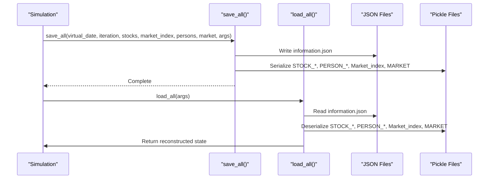
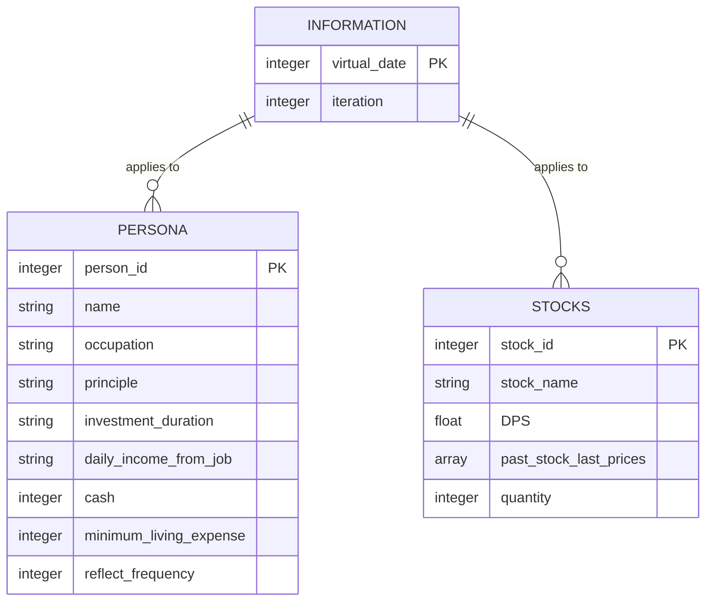
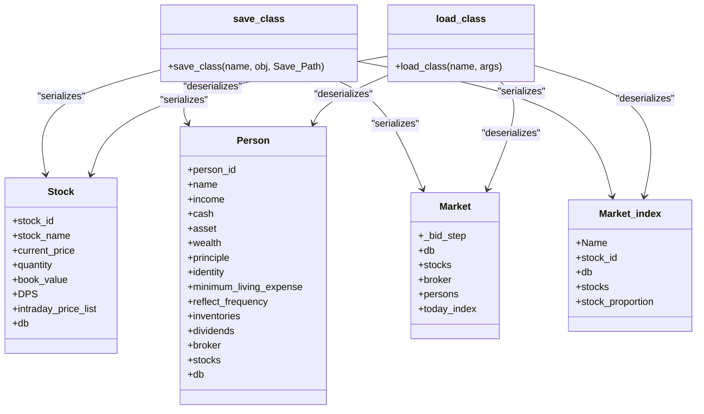
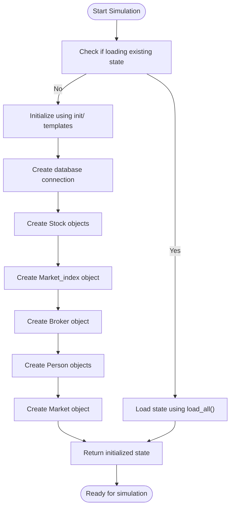
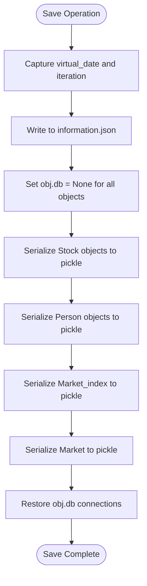
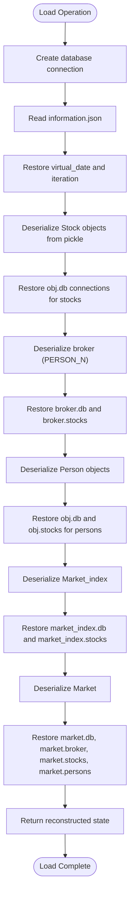

# Data Persistence

<cite>
**Referenced Files in This Document**   
- [load_json.py](file://Stock_Main/load_json.py)
- [Person.py](file://Stock_Main/Person.py)
- [Stock.py](file://Stock_Main/Stock.py)
- [Market.py](file://Stock_Main/Market.py)
- [database_utils.py](file://Stock_Main/database_utils.py)
- [main.py](file://Stock_Main/main.py)
- [save/init/persona.json](file://Stock_Main/save/init/persona.json)
- [save/init/stocks.json](file://Stock_Main/save/init/stocks.json)
- [save/sim01/information.json](file://Stock_Main/save/sim01/information.json)
- [save/sim01/persona.json](file://Stock_Main/save/sim01/persona.json)
- [save/sim01/stocks.json](file://Stock_Main/save/sim01/stocks.json)
- [save/backup_1/information.json](file://Stock_Main/save/backup_1/information.json)
</cite>

## Table of Contents
1. [Introduction](#introduction)
2. [JSON-Based State Persistence System](#json-based-state-persistence-system)
3. [Core Serialization Functions](#core-serialization-functions)
4. [JSON File Structure](#json-file-structure)
5. [Pickle-Based Object Serialization](#pickle-based-object-serialization)
6. [Initialization Process](#initialization-process)
7. [Backup Strategy](#backup-strategy)
8. [Virtual Date and Iteration Management](#virtual-date-and-iteration-management)
9. [Data Flow During Save Operations](#data-flow-during-save-operations)
10. [Data Flow During Load Operations](#data-flow-during-load-operations)
11. [Database Handle Management](#database-handle-management)
12. [Object Relationship Restoration](#object-relationship-restoration)
13. [Creating New Simulation Runs](#creating-new-simulation-runs)
14. [Conclusion](#conclusion)

## Introduction
The Agent Trading Arena simulation employs a comprehensive state persistence system to maintain simulation continuity across sessions. This system combines JSON serialization for basic configuration data with pickle serialization for complex Python objects, enabling the simulation to save and restore its complete state. The persistence mechanism ensures that virtual trading days, iteration counts, agent states, stock prices, and market conditions are preserved, allowing simulations to be paused and resumed without losing progress. This documentation details the architecture and implementation of this persistence system, focusing on the interplay between JSON and pickle serialization, the structure of saved data, and the processes for initialization, backup, and state restoration.

## JSON-Based State Persistence System
The simulation's state persistence system uses a hybrid approach combining JSON and pickle serialization to handle different types of data. JSON files store configuration data and basic state information in human-readable format, while pickle handles complex Python objects that cannot be easily serialized to JSON. The system is centered around the `save/` directory, which contains simulation data organized into subdirectories for different simulation runs, initialization templates, and backups. This dual-format approach allows for both human accessibility to key parameters and complete preservation of the simulation's complex object state, including database connections and inter-object relationships.

**Section sources**
- [load_json.py](file://Stock_Main/load_json.py#L1-L134)
- [main.py](file://Stock_Main/main.py#L1-L136)

## Core Serialization Functions
The `load_json.py` module provides the core functions for state persistence: `save_all()` and `load_all()`. The `save_all()` function captures the current simulation state by serializing the virtual date, iteration count, and all major objects (stocks, market index, persons, and market) to disk. It creates a JSON file for basic information and uses pickle to serialize complex objects. The `load_all()` function performs the reverse operation, reconstructing the entire simulation state from saved files. These functions work in tandem to provide a complete save/load cycle that preserves the simulation's state across sessions.

**Diagram sources**
- [load_json.py](file://Stock_Main/load_json.py#L45-L122)

**Section sources**
- [load_json.py](file://Stock_Main/load_json.py#L45-L122)

## JSON File Structure
The JSON-based persistence system uses three primary files: `information.json`, `persona.json`, and `stocks.json`. The `information.json` file stores the simulation's temporal state with `virtual_date` and `iteration` fields. The `persona.json` file contains agent profiles with attributes like `person_id`, `name`, `occupation`, `principle`, `cash`, and `minimum_living_expense`. The `stocks.json` file defines stock properties including `stock_id`, `stock_name`, `past_stock_last_prices`, `quantity`, and `DPS` (dividend per share). These files use standard JSON format with arrays of objects, making them both machine-readable and human-editable.

**Diagram sources**
- [save/sim01/information.json](file://Stock_Main/save/sim01/information.json)
- [save/sim01/persona.json](file://Stock_Main/save/sim01/persona.json)
- [save/sim01/stocks.json](file://Stock_Main/save/sim01/stocks.json)

**Section sources**
- [save/sim01/information.json](file://Stock_Main/save/sim01/information.json)
- [save/sim01/persona.json](file://Stock_Main/save/sim01/persona.json)
- [save/sim01/stocks.json](file://Stock_Main/save/sim01/stocks.json)

## Pickle-Based Object Serialization
For complex Python objects that cannot be serialized to JSON, the system uses pickle serialization through the `save_class()` and `load_class()` functions in `load_json.py`. These functions handle the serialization of `Person`, `Stock`, `Market`, and `Market_index` objects to the `classes/` subdirectory within each simulation folder. During serialization, the database connection (`db`) is temporarily set to `None` to prevent issues with serializing database handles. After deserialization, the database connection is restored, and object relationships are reestablished. This approach allows for complete preservation of object state, including methods, properties, and internal data structures that would be lost in JSON serialization.

**Diagram sources**
- [load_json.py](file://Stock_Main/load_json.py#L25-L42)
- [Stock.py](file://Stock_Main/Stock.py#L14-L38)
- [Person.py](file://Stock_Main/Person.py#L143-L152)
- [Market.py](file://Stock_Main/Market.py#L12-L19)
- [Stock.py](file://Stock_Main/Stock.py#L212-L217)

**Section sources**
- [load_json.py](file://Stock_Main/load_json.py#L25-L42)

## Initialization Process
The simulation initialization process uses the `init/` directory as a template for new simulation runs. This directory contains `persona.json` and `stocks.json` files that define the starting state for agents and stocks. When a new simulation is created, these initialization files are used to configure the initial state of the simulation. The `init_all()` function in `main.py` handles the initialization process, creating database connections and instantiating all simulation objects based on the initialization data. This approach ensures consistency across simulation runs while allowing for customization through different initialization templates.

**Diagram sources**
- [main.py](file://Stock_Main/main.py#L51-L81)
- [save/init/persona.json](file://Stock_Main/save/init/persona.json)
- [save/init/stocks.json](file://Stock_Main/save/init/stocks.json)

**Section sources**
- [main.py](file://Stock_Main/main.py#L51-L81)
- [save/init/persona.json](file://Stock_Main/save/init/persona.json)
- [save/init/stocks.json](file://Stock_Main/save/init/stocks.json)

## Backup Strategy
The system implements a backup strategy using numbered directories (`backup_1/`, `backup_2/`, etc.) within the `save/` directory. These backup directories contain copies of the JSON state files (`information.json`, `persona.json`, `stocks.json`) at various points in the simulation. This incremental backup approach allows for recovery from specific points in the simulation timeline. The backup process appears to be manual or triggered by specific events rather than automatic, as the backup directories contain static copies of the state files rather than being dynamically updated during simulation execution.

**Section sources**
- [save/backup_1/information.json](file://Stock_Main/save/backup_1/information.json)
- [save/backup_1/persona.json](file://Stock_Main/save/backup_1/persona.json)
- [save/backup_1/stocks.json](file://Stock_Main/save/backup_1/stocks.json)

## Virtual Date and Iteration Management
The simulation tracks temporal progression through the `virtual_date` and `iteration` fields in the `information.json` file. The `virtual_date` represents the current trading day, while `iteration` tracks the current iteration within that day. These values are updated and saved during each simulation cycle, allowing the simulation to resume from the exact point where it left off. The `save_all()` function captures these values before serializing the rest of the state, ensuring that the temporal context is preserved. When loading a saved state, the `load_all()` function extracts these values to restore the simulation's temporal position.

**Section sources**
- [load_json.py](file://Stock_Main/load_json.py#L46-L49)
- [load_json.py](file://Stock_Main/load_json.py#L83-L86)
- [save/sim01/information.json](file://Stock_Main/save/sim01/information.json)

## Data Flow During Save Operations
During save operations, the simulation state flows from live objects to serialized files through a coordinated process. The `save_all()` function first captures the `virtual_date` and `iteration` values, writing them to `information.json`. It then temporarily disconnects database handles by setting `obj.db = None` for all objects to prevent serialization issues. The function iterates through all `Stock`, `Person`, `Market_index`, and `Market` objects, serializing each to pickle files in the `classes/` subdirectory with naming conventions like `STOCK_0.pkl`, `PERSON_0.pkl`, etc. After serialization, database connections are restored to all objects, ensuring they remain functional for continued simulation.

**Diagram sources**
- [load_json.py](file://Stock_Main/load_json.py#L45-L76)

**Section sources**
- [load_json.py](file://Stock_Main/load_json.py#L45-L76)

## Data Flow During Load Operations
During load operations, the data flow reverses, reconstructing objects from serialized files. The `load_all()` function first creates a new database connection using the path specified in `args.Save_Path`. It then reads the `information.json` file to restore the `virtual_date` and `iteration` values. The function deserializes each `Stock` object from its pickle file, restores the database connection, and adds it to the stocks list. It then deserializes the `PERSON_*` objects, including the broker, restoring their database connections and establishing relationships with stocks and each other. Finally, it deserializes the `Market_index` and `Market` objects, restoring their connections and relationships to complete the simulation state reconstruction.

**Diagram sources**
- [load_json.py](file://Stock_Main/load_json.py#L81-L122)

**Section sources**
- [load_json.py](file://Stock_Main/load_json.py#L81-L122)

## Database Handle Management
The system addresses database handle management through a specific pattern in the `save_all()` function. Before serializing any object, the function sets `obj.db = None` to disconnect the database handle, as database connections cannot be pickled. This prevents serialization errors and ensures clean object serialization. After all objects have been serialized, the function restores the database connection by setting `obj.db = database` for each object. This pattern is applied consistently to all objects that have a database connection, including `Stock`, `Person`, `Market_index`, and `Market`. This approach ensures that objects can be serialized without issues while maintaining their functionality after deserialization.

**Section sources**
- [load_json.py](file://Stock_Main/load_json.py#L29-L30)
- [load_json.py](file://Stock_Main/load_json.py#L53-L55)
- [load_json.py](file://Stock_Main/load_json.py#L57-L61)
- [load_json.py](file://Stock_Main/load_json.py#L63-L69)
- [load_json.py](file://Stock_Main/load_json.py#L71-L76)

## Object Relationship Restoration
After deserialization, the system restores object relationships through explicit assignment in the `load_all()` function. The broker object is deserialized first, and its `stocks` attribute is set to the list of deserialized stock objects. Each person object is then configured with references to the stocks list, the broker, and the database connection. The `Market_index` object is configured with the stocks list and database connection. Finally, the `Market` object is configured with references to the broker, persons list, stocks list, and database connection. This sequential restoration ensures that all inter-object relationships are properly reestablished, recreating the original object graph.

**Section sources**
- [load_json.py](file://Stock_Main/load_json.py#L97-L98)
- [load_json.py](file://Stock_Main/load_json.py#L105-L107)
- [load_json.py](file://Stock_Main/load_json.py#L114-L115)
- [load_json.py](file://Stock_Main/load_json.py#L120-L121)

## Creating New Simulation Runs
New simulation runs are created by copying initialization data to new simulation folders like `sim01/`. The process begins with the `get_args()` function in `main.py`, which determines the save path based on the `SAVE_NAME` argument. If the specified directory doesn't exist, it is created. The initialization files from the `init/` directory (`persona.json` and `stocks.json`) are used as templates for the new simulation. When the simulation starts with `load=False`, the `init_all()` function creates a new database and initializes all objects based on these files. This approach allows for multiple independent simulation runs with consistent starting conditions while maintaining separation between runs.

**Section sources**
- [main.py](file://Stock_Main/main.py#L40-L48)
- [main.py](file://Stock_Main/main.py#L63-L81)
- [save/init/persona.json](file://Stock_Main/save/init/persona.json)
- [save/init/stocks.json](file://Stock_Main/save/init/stocks.json)

## Conclusion
The JSON-based state persistence system in the Agent Trading Arena simulation provides a robust mechanism for saving and restoring simulation state. By combining JSON serialization for configuration data with pickle serialization for complex objects, the system achieves a balance between human accessibility and complete state preservation. The careful management of database connections and object relationships ensures that simulations can be reliably paused and resumed. The initialization and backup strategies provide additional layers of data management, enabling consistent simulation runs and recovery from specific points in time. This comprehensive persistence system is essential for conducting extended trading simulations and analyzing agent behavior over time.