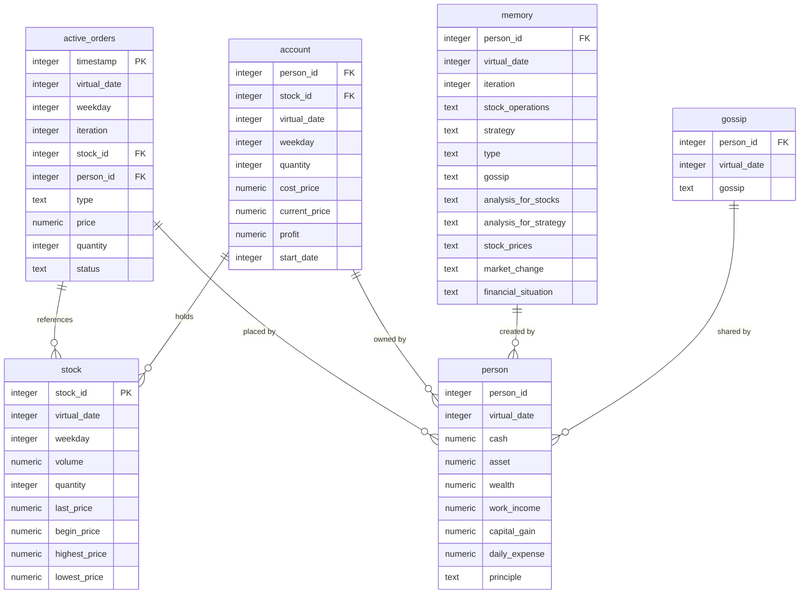
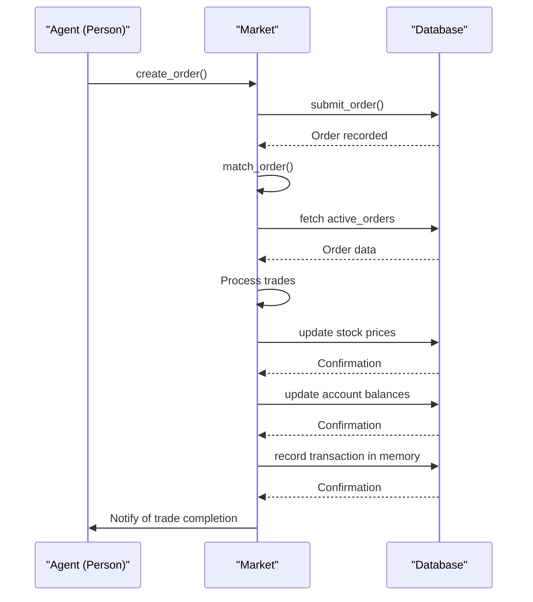

# Database Schema

<cite>
**Referenced Files in This Document**   
- [database_utils.py](file://Agent-Trading-Arena/Stock_Main/database_utils.py)
- [database.py](file://Agent-Trading-Arena/Stock_Main/database.py)
- [main.py](file://Agent-Trading-Arena/Stock_Main/main.py)
- [Stock.py](file://Agent-Trading-Arena/Stock_Main/Stock.py)
- [Person.py](file://Agent-Trading-Arena/Stock_Main/Person.py)
- [Market.py](file://Agent-Trading-Arena/Stock_Main/Market.py)
</cite>

## Table of Contents
1. [Introduction](#introduction)
2. [Core Tables](#core-tables)
3. [Table Relationships and Data Flow](#table-relationships-and-data-flow)
4. [Simulation State Tracking](#simulation-state-tracking)
5. [Data Access Patterns](#data-access-patterns)
6. [Schema Design Analysis](#schema-design-analysis)
7. [Conclusion](#conclusion)

## Introduction

The Agent-Trading-Arena system utilizes a SQLite database to model a simulated stock trading environment with autonomous agents. The database schema is designed to track trading activities, agent financial status, market conditions, and information propagation among agents. The schema consists of six core tables: active_orders, stock, person, account, memory, and gossip, all initialized through the Database_operate.init_database() method. This documentation provides a comprehensive analysis of the database structure, including field definitions, constraints, relationships, and operational patterns within the simulation framework.

**Section sources**
- [database_utils.py](file://Agent-Trading-Arena/Stock_Main/database_utils.py#L253-L300)

## Core Tables

### active_orders Table

The active_orders table tracks pending buy and sell orders in the trading system. Each order remains active until matched or closed at the end of the trading day.

**Fields:**
- timestamp: Integer, NOT NULL - Millisecond timestamp serving as a unique identifier for each order
- virtual_date: Integer - Simulation date when the order was created
- weekday: Integer - Day of the week derived from virtual_date (0-6)
- iteration: Integer - Iteration number within the current trading day
- stock_id: Integer - Identifier of the stock being traded
- person_id: Integer - Identifier of the agent placing the order
- type: Text - Order type with constraint to 'sell' or 'buy'
- price: Numeric - Bid price for the order
- quantity: Integer - Number of shares to trade
- status: Text - Order status constrained to 'active', 'closed', or 'finished'

The table has no explicit primary key, but the timestamp field effectively serves as a unique identifier. Orders are submitted through the submit_order function and processed during market matching operations.

**Section sources**
- [database_utils.py](file://Agent-Trading-Arena/Stock_Main/database_utils.py#L256-L263)
- [database_utils.py](file://Agent-Trading-Arena/Stock_Main/database_utils.py#L224-L243)

### stock Table

The stock table maintains historical price data and trading volume for each stock in the simulation.

**Fields:**
- stock_id: Integer, NOT NULL - Unique identifier for the stock
- virtual_date: Integer - Simulation date for the price data
- weekday: Integer - Day of the week (0-6)
- volume: Numeric - Total trading volume (price × quantity) for the day
- quantity: Integer - Total number of shares traded
- last_price: Numeric - Most recent trading price
- begin_price: Numeric - Opening price for the day
- highest_price: Numeric - Highest price reached during the day
- lowest_price: Numeric - Lowest price reached during the day

This table is updated throughout the trading day as transactions occur, with the Stock class responsible for maintaining intraday price data and updating the corresponding records. The market index is also stored in this table with stock_id = -1.

**Section sources**
- [database_utils.py](file://Agent-Trading-Arena/Stock_Main/database_utils.py#L265-L271)
- [Stock.py](file://Agent-Trading-Arena/Stock_Main/Stock.py#L54-L64)

### person Table

The person table tracks the financial status of each agent (person) in the simulation, including cash, assets, and wealth.

**Fields:**
- person_id: Integer - Unique identifier for the agent
- virtual_date: Integer - Simulation date for the financial snapshot
- cash: Numeric - Available cash balance
- asset: Numeric - Total value of held stocks
- wealth: Numeric - Total wealth (cash + assets)
- work_income: Numeric - Income from employment
- capital_gain: Numeric - Gains from capital investments
- daily_expense: Numeric - Daily expenses
- principle: Text - Investment strategy or principle

This table provides a daily snapshot of each agent's financial situation, updated at the end of each trading day. The Broker class (with person_id = -1) also maintains its financial status in this table.

**Section sources**
- [database_utils.py](file://Agent-Trading-Arena/Stock_Main/database_utils.py#L273-L279)
- [Person.py](file://Agent-Trading-Arena/Stock_Main/Person.py#L56-L59)

### account Table

The account table tracks individual stock holdings for each agent, including cost basis and profit calculations.

**Fields:**
- person_id: Integer - Identifier of the agent holding the stock
- stock_id: Integer - Identifier of the held stock
- virtual_date: Integer - Simulation date for the holding
- weekday: Integer - Day of the week (0-6)
- quantity: Integer - Number of shares held
- cost_price: Numeric - Average cost price per share
- current_price: Numeric - Current market price per share
- profit: Numeric - Calculated profit on the holding
- start_date: Integer - Date when the position was opened

This table is updated whenever an agent buys or sells stocks, with the settlement method in the Person class responsible for maintaining accurate holding information. The table enables tracking of investment performance over time.

**Section sources**
- [database_utils.py](file://Agent-Trading-Arena/Stock_Main/database_utils.py#L282-L287)
- [Person.py](file://Agent-Trading-Arena/Stock_Main/Person.py#L259-L272)

### memory Table

The memory table stores decision logs and reflections for each agent, capturing their thought processes and analyses.

**Fields:**
- person_id: Integer - Identifier of the agent
- virtual_date: Integer - Simulation date of the memory
- iteration: Integer - Iteration number within the day
- stock_operations: Text - Description of stock trading operations
- strategy: Text - Current investment strategy
- type: Text - Type of action with constraint to 'sell', 'buy', 'hold', or 'reflect'
- gossip: Text - Information received from other agents
- analysis_for_stocks: Text - Analysis of stock market conditions
- analysis_for_strategy: Text - Analysis of investment strategy effectiveness
- stock_prices: Text - Current stock price information
- market_change: Text - Market index changes
- financial_situation: Text - Agent's financial status

This table serves as a cognitive log for each agent, recording their decision-making process, market analysis, and reflections on their performance. The memory is used in subsequent iterations for strategic adjustments.

**Section sources**
- [database_utils.py](file://Agent-Trading-Arena/Stock_Main/database_utils.py#L290-L294)
- [Person.py](file://Agent-Trading-Arena/Stock_Main/Person.py#L530-L544)

### gossip Table

The gossip table tracks information propagation between agents in the simulation.

**Fields:**
- person_id: Integer - Identifier of the agent sharing information
- virtual_date: Integer - Simulation date when the gossip was shared
- gossip: Text - Content of the information shared

This table models the spread of information and rumors among agents, influencing their trading decisions. Agents generate gossip through interactions, which is then stored and potentially shared with other agents in subsequent iterations.

**Section sources**
- [database_utils.py](file://Agent-Trading-Arena/Stock_Main/database_utils.py#L297-L299)
- [Person.py](file://Agent-Trading-Arena/Stock_Main/Person.py#L616-L619)

## Table Relationships and Data Flow

**Diagram sources**
- [database_utils.py](file://Agent-Trading-Arena/Stock_Main/database_utils.py#L253-L300)
- [Market.py](file://Agent-Trading-Arena/Stock_Main/Market.py#L97-L199)
- [Person.py](file://Agent-Trading-Arena/Stock_Main/Person.py#L250-L280)

The database schema follows a star-like structure with the person table at the center, connected to various aspect tables that track different dimensions of agent behavior and market conditions. During trading operations, data flows through multiple tables in a coordinated sequence. When an agent decides to trade, the active_orders table receives a new record. As trades are matched by the Market class, the stock table is updated with new price and volume information. Successful trades trigger settlement operations that update the account table with new holding information and modify the person table to reflect changes in cash and asset values. Simultaneously, the agent's decision-making process is recorded in the memory table, and information shared with other agents is stored in the gossip table.

The trading workflow begins with agents submitting orders to the active_orders table. The Market.match_order method processes these orders, matching buy and sell orders based on price and quantity. When a match occurs, the system updates the stock prices in the stock table, settles the transaction by updating account balances and holdings, and records the transaction details. At the end of each trading day, the system closes any remaining active orders and updates all financial records to reflect the day's activities.

## Simulation State Tracking

The database schema incorporates two key fields for tracking the simulation state: virtual_date and iteration. These fields enable the system to model a temporal progression of events and capture the evolution of agent behavior and market conditions over time.

**virtual_date** represents the simulated calendar date in the trading environment. It serves as a temporal anchor for all time-series data in the database, allowing the system to maintain historical records of prices, financial positions, and agent decisions. The virtual_date field is present in all core tables, enabling temporal analysis of the simulation. This field is particularly important for calculating daily price changes, tracking investment performance over time, and implementing time-based trading strategies. The weekday field, derived from virtual_date using modulo 7 arithmetic, allows for modeling weekly patterns in market behavior.

**iteration** represents discrete time steps within a single trading day. With multiple iterations per day (configurable via the Iterations_Daily parameter), the simulation can model intraday dynamics and allow agents to make multiple decisions within a single market session. This field is present in tables that track decision-level data (active_orders and memory), enabling fine-grained analysis of agent behavior throughout the trading day. The combination of virtual_date and iteration creates a two-dimensional temporal coordinate system that precisely locates each event in the simulation timeline.

These fields work together to support the simulation's temporal mechanics, allowing for the analysis of both long-term trends (across multiple virtual dates) and short-term dynamics (within a single day across multiple iterations). They also enable the implementation of time-based constraints and rules, such as limiting the frequency of certain actions or modeling the decay of information over time.

**Section sources**
- [main.py](file://Agent-Trading-Arena/Stock_Main/main.py#L95-L120)
- [database_utils.py](file://Agent-Trading-Arena/Stock_Main/database_utils.py#L230-L231)

## Data Access Patterns

The database schema supports several key data access patterns through dedicated query functions and parsing utilities. These patterns reflect the core analytical needs of the simulation system.

The **query_all_stocks** function demonstrates a typical data retrieval pattern for market analysis. This function queries the stock table for all stocks on a specific virtual_date, ordered by stock_id. The results are then parsed using the parse_stocks function, which converts raw database tuples into structured dictionaries with field names. This pattern of query-then-parse is consistent across the system, with specialized parsing functions (parse_orders, parse_persons, parse_accounts, parse_memory, parse_gossip) for each table.

**Diagram sources**
- [Market.py](file://Agent-Trading-Arena/Stock_Main/Market.py#L97-L199)
- [database_utils.py](file://Agent-Trading-Arena/Stock_Main/database_utils.py#L224-L243)
- [Person.py](file://Agent-Trading-Arena/Stock_Main/Person.py#L250-L280)

The **parse_* functions** implement a consistent pattern for transforming database results into usable data structures. Each function takes raw query results and returns a list of dictionaries, with each dictionary representing a single record and containing field names as keys. This abstraction layer decouples the database schema from the application logic, making it easier to modify field names or add new fields without affecting the rest of the codebase.

Another important data access pattern involves temporal queries that retrieve information across multiple time points. For example, agents may need to analyze price trends over several virtual_dates, requiring queries that span multiple days of stock data. Similarly, agents may examine their own decision history by querying the memory table across multiple virtual_dates and iterations to identify patterns in their trading behavior.

The system also implements information propagation patterns through the gossip table. Agents query gossip from other agents on the same virtual_date, allowing them to incorporate information from their peers into their decision-making process. This creates a network effect where information spreads through the agent population over time, influencing market dynamics.

**Section sources**
- [database_utils.py](file://Agent-Trading-Arena/Stock_Main/database_utils.py#L162-L172)
- [database_utils.py](file://Agent-Trading-Arena/Stock_Main/database_utils.py#L12-L49)
- [Market.py](file://Agent-Trading-Arena/Stock_Main/Market.py#L23-L28)

## Schema Design Analysis

The database schema for the Agent-Trading-Arena system demonstrates several thoughtful design choices that support the simulation's requirements, while also presenting some limitations that could be addressed in future iterations.

**Normalization Considerations:** The schema exhibits mixed normalization levels. The person and stock tables follow good normalization practices by storing atomic values and avoiding redundancy. However, several tables contain text fields that store structured data in serialized form, representing a denormalization choice that prioritizes write performance and simplicity over data integrity. For example, the memory table's analysis_for_stocks, analysis_for_strategy, and financial_situation fields store complex textual analyses rather than structured data. Similarly, the gossip field in both memory and gossip tables stores free-form text rather than structured information. This design choice reflects the system's focus on agent-based simulation where the content of these fields is primarily used for prompting AI models rather than for relational queries.

**Performance Implications:** The schema design favors write-heavy operations, which is appropriate for a simulation system that continuously generates new data. The absence of explicit primary keys on most tables (except timestamp in active_orders) reduces indexing overhead but could impact query performance for large datasets. The use of text fields for storing what could be structured data avoids the complexity of multiple related tables but makes it difficult to perform analytical queries on the content of these fields. The virtual_date and iteration fields are used as de facto clustering keys, with queries typically filtering on these temporal dimensions, which supports efficient time-series analysis.

**Design Strengths:** The schema effectively supports the simulation's core requirements by providing comprehensive tracking of agent behavior, market dynamics, and information flow. The inclusion of the memory table is particularly noteworthy, as it enables the modeling of agent learning and adaptation over time. The separation of active_orders from settled transactions (recorded in account and person tables) provides a clear distinction between pending and completed trades. The use of virtual_date and iteration fields creates a robust temporal framework for the simulation.

**Potential Improvements:** Future iterations of the schema could benefit from increased normalization, particularly for the text fields that currently store structured data. For example, the analysis_for_stocks field could be split into a separate table with structured fields for different aspects of market analysis. Adding explicit primary keys and indexes on frequently queried fields (such as virtual_date and person_id) would improve query performance. The schema could also benefit from foreign key constraints to enforce referential integrity, although this might be intentionally omitted to reduce overhead in the simulation environment.

**Section sources**
- [database_utils.py](file://Agent-Trading-Arena/Stock_Main/database_utils.py#L253-L300)
- [Person.py](file://Agent-Trading-Arena/Stock_Main/Person.py#L514-L578)
- [Market.py](file://Agent-Trading-Arena/Stock_Main/Market.py#L97-L199)

## Conclusion

The SQLite database schema in the Agent-Trading-Arena system provides a comprehensive foundation for simulating a complex trading environment with autonomous agents. The six core tables—active_orders, stock, person, account, memory, and gossip—work together to track all aspects of the simulation, from individual trades to agent decision-making processes and information propagation. The schema effectively supports the system's requirements through a combination of relational structure for financial data and flexible text fields for cognitive and informational data.

The use of virtual_date and iteration fields creates a robust temporal framework that enables both long-term trend analysis and intraday dynamics modeling. The data access patterns, centered around query functions and parsing utilities, provide a consistent interface between the database and the simulation logic. While the schema makes some denormalization choices that prioritize simplicity and write performance, it successfully balances the need for data integrity with the flexibility required for agent-based simulation.

The database design reflects a deep understanding of the simulation's requirements, particularly in its treatment of agent cognition through the memory table and information flow through the gossip table. These features enable the modeling of complex emergent behaviors that arise from agent interactions and learning over time. As the system evolves, opportunities exist to enhance the schema with additional normalization, indexing, and constraint enforcement, but the current design provides a solid foundation for the agent-based trading simulation.