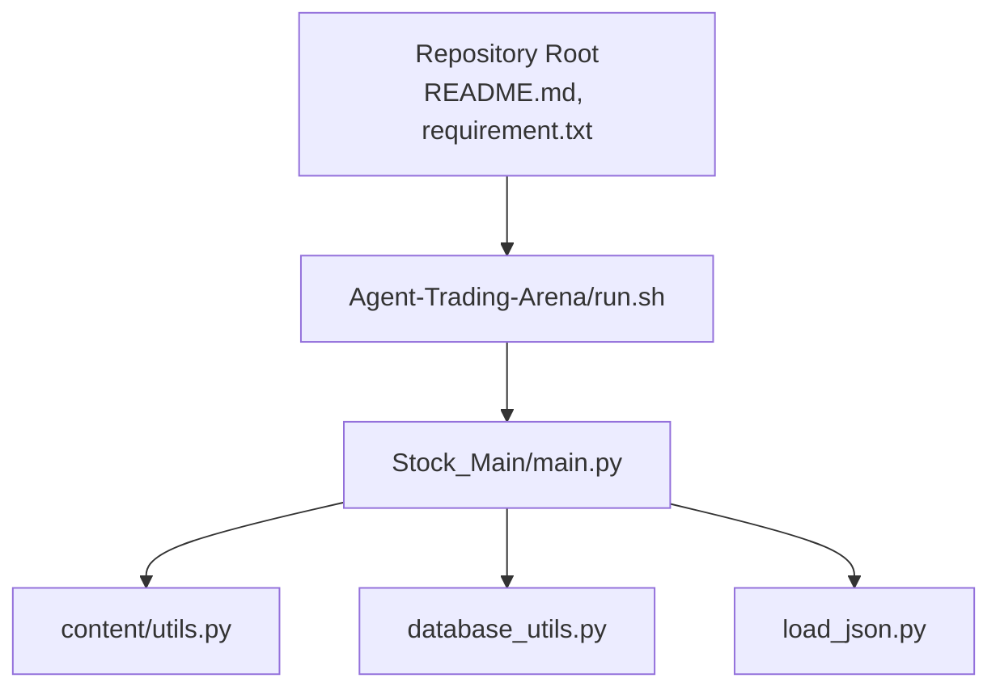
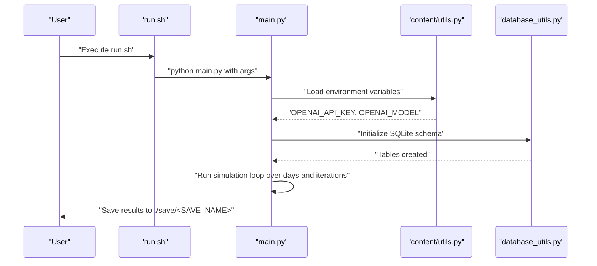
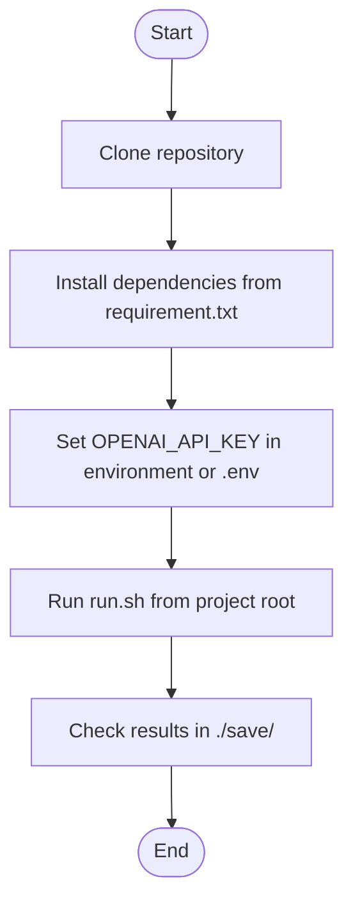
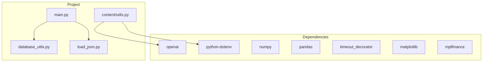

# Getting Started

<cite>
**Referenced Files in This Document**
- [README.md](file://README.md)
- [requirement.txt](file://requirement.txt)
- [run.sh](file://Agent-Trading-Arena/run.sh)
- [main.py](file://Agent-Trading-Arena/Stock_Main/main.py)
- [utils.py](file://Agent-Trading-Arena/Stock_Main/content/utils.py)
- [database_utils.py](file://Agent-Trading-Arena/Stock_Main/database_utils.py)
- [load_json.py](file://Agent-Trading-Arena/Stock_Main/load_json.py)
</cite>

## Table of Contents
1. [Introduction](#introduction)
2. [Project Structure](#project-structure)
3. [Core Components](#core-components)
4. [Architecture Overview](#architecture-overview)
5. [Detailed Component Analysis](#detailed-component-analysis)
6. [Dependency Analysis](#dependency-analysis)
7. [Performance Considerations](#performance-considerations)
8. [Troubleshooting Guide](#troubleshooting-guide)
9. [Conclusion](#conclusion)
10. [Appendices](#appendices)

## Introduction
This Getting Started guide walks you through setting up the Agent Trading Arena project from cloning the repository to running your first simulation. You will learn how to install dependencies, configure the OpenAI API key, run the simulation via the provided shell script, and customize parameters using command-line arguments. We explain the default configuration values in the run script and show how to adjust them for different simulation scenarios. Finally, we provide troubleshooting tips for common setup issues.

## Project Structure
The repository is organized around a simulation framework that runs a stock market environment with agent-driven trading behavior. The key directories and files you will interact with during setup and execution are:

- Root level:
  - README.md: Project overview and quick-start instructions
  - requirement.txt: Python dependencies to install
  - Agent-Trading-Arena/run.sh: Shell script to launch the simulation
- Simulation core:
  - Agent-Trading-Arena/Stock_Main/main.py: Entry point for the simulation
  - Agent-Trading-Arena/Stock_Main/content/utils.py: OpenAI API key loading and environment configuration
  - Agent-Trading-Arena/Stock_Main/database_utils.py: Database initialization and schema
  - Agent-Trading-Arena/Stock_Main/load_json.py: Save/load mechanisms for simulation state

**Diagram sources**
- [README.md](file://README.md#L1-L52)
- [requirement.txt](file://requirement.txt#L1-L8)
- [run.sh](file://Agent-Trading-Arena/run.sh#L1-L24)
- [main.py](file://Agent-Trading-Arena/Stock_Main/main.py#L1-L136)
- [utils.py](file://Agent-Trading-Arena/Stock_Main/content/utils.py#L1-L39)
- [database_utils.py](file://Agent-Trading-Arena/Stock_Main/database_utils.py#L1-L322)
- [load_json.py](file://Agent-Trading-Arena/Stock_Main/load_json.py#L1-L134)

**Section sources**
- [README.md](file://README.md#L1-L52)
- [requirement.txt](file://requirement.txt#L1-L8)
- [run.sh](file://Agent-Trading-Arena/run.sh#L1-L24)

## Core Components
This section explains the essential steps to get the project running and highlights the key configuration points.

- Clone the repository and navigate to the project root
- Install dependencies using requirement.txt
- Configure the OpenAI API key in utils.py
- Run the simulation using run.sh
- Customize parameters via command-line arguments passed to main.py

Key configuration points:
- Dependencies are defined in requirement.txt
- OpenAI API key is loaded from environment variables in utils.py
- Default simulation parameters are set in run.sh and parsed by main.py

**Section sources**
- [README.md](file://README.md#L18-L40)
- [requirement.txt](file://requirement.txt#L1-L8)
- [utils.py](file://Agent-Trading-Arena/Stock_Main/content/utils.py#L1-L39)
- [run.sh](file://Agent-Trading-Arena/run.sh#L1-L24)
- [main.py](file://Agent-Trading-Arena/Stock_Main/main.py#L16-L48)

## Architecture Overview
The simulation is launched via a shell script that sets the working directory and passes command-line arguments to the Python entry point. The entry point parses arguments, initializes the market, agents, and database, then runs the simulation loop over days and iterations.

**Diagram sources**
- [run.sh](file://Agent-Trading-Arena/run.sh#L1-L24)
- [main.py](file://Agent-Trading-Arena/Stock_Main/main.py#L16-L136)
- [utils.py](file://Agent-Trading-Arena/Stock_Main/content/utils.py#L1-L39)
- [database_utils.py](file://Agent-Trading-Arena/Stock_Main/database_utils.py#L245-L322)

## Detailed Component Analysis

### Step-by-Step Setup and Execution

- Clone the repository and install dependencies
  - Clone the repository using the URL provided in the README
  - Navigate to the project root
  - Install dependencies from requirement.txt

- Configure the OpenAI API key
  - The project expects an environment variable OPENAI_API_KEY
  - utils.py loads the key from environment variables and prints a warning if not found
  - You can set the environment variable in your shell session or create a .env file in the project root

- Run the simulation
  - From the project root, execute the run script
  - The script changes to the Stock_Main directory, sets the Python path, and launches the Python entry point with default arguments

- Customize parameters
  - The run script passes default values for several parameters to main.py
  - main.py defines argument parsers for all configurable parameters
  - You can override defaults by adding additional arguments to run.sh or by editing the script

**Section sources**
- [README.md](file://README.md#L18-L40)
- [requirement.txt](file://requirement.txt#L1-L8)
- [utils.py](file://Agent-Trading-Arena/Stock_Main/content/utils.py#L1-L39)
- [run.sh](file://Agent-Trading-Arena/run.sh#L1-L24)
- [main.py](file://Agent-Trading-Arena/Stock_Main/main.py#L16-L48)

### Parameter Reference and Defaults

The run script provides default values for the following parameters. These are parsed by main.py and used to configure the simulation:

- Iterations_Daily: Number of iterations per day
- No_Days: Number of trading days
- Num_Person: Number of agents
- Num_Stock: Number of stocks
- SAVE_NAME: Name of the save folder under ./save
- persona_name: Filename for personas JSON
- stock_name: Filename for stocks JSON
- Daily_Price_Limit: Daily price change limit
- expense_ratio: Capital cost rate
- Fluctuation_Constant: Price fluctuation constant
- analysis_num: Number of agents performing analysis
- gossip_num_max: Maximum number of gossip entries per round
- verbose: Print debug information

How to modify:
- Edit run.sh to change defaults or add new arguments
- Pass additional arguments to main.py when invoking run.sh

**Section sources**
- [run.sh](file://Agent-Trading-Arena/run.sh#L10-L23)
- [main.py](file://Agent-Trading-Arena/Stock_Main/main.py#L16-L48)

### Example Workflow: From Installation to Execution

- Clone the repository and navigate to the project root
- Install dependencies
- Export or set the OPENAI_API_KEY environment variable
- Optionally create a .env file in the project root containing OPENAI_API_KEY
- Run the simulation using the run script
- Inspect results in the save directory under the configured SAVE_NAME

**Diagram sources**
- [README.md](file://README.md#L18-L40)
- [requirement.txt](file://requirement.txt#L1-L8)
- [utils.py](file://Agent-Trading-Arena/Stock_Main/content/utils.py#L1-L39)
- [run.sh](file://Agent-Trading-Arena/run.sh#L1-L24)

## Dependency Analysis
The simulation depends on a set of Python packages defined in requirement.txt. These include libraries for AI/LLM integration, data manipulation, and visualization.

**Diagram sources**
- [requirement.txt](file://requirement.txt#L1-L8)
- [main.py](file://Agent-Trading-Arena/Stock_Main/main.py#L1-L14)
- [utils.py](file://Agent-Trading-Arena/Stock_Main/content/utils.py#L1-L39)
- [database_utils.py](file://Agent-Trading-Arena/Stock_Main/database_utils.py#L1-L322)
- [load_json.py](file://Agent-Trading-Arena/Stock_Main/load_json.py#L1-L134)

**Section sources**
- [requirement.txt](file://requirement.txt#L1-L8)
- [main.py](file://Agent-Trading-Arena/Stock_Main/main.py#L1-L14)
- [utils.py](file://Agent-Trading-Arena/Stock_Main/content/utils.py#L1-L39)
- [database_utils.py](file://Agent-Trading-Arena/Stock_Main/database_utils.py#L245-L322)
- [load_json.py](file://Agent-Trading-Arena/Stock_Main/load_json.py#L1-L134)

## Performance Considerations
- Adjust Num_Person and Num_Stock to balance realism and runtime
- Reduce No_Days or Iterations_Daily for faster initial runs
- Use verbose mode for debugging but disable it for production runs
- Monitor database growth; large simulations produce substantial data

[No sources needed since this section provides general guidance]

## Troubleshooting Guide

Common issues and resolutions:

- Missing dependencies
  - Symptom: ImportError or ModuleNotFoundError when running the script
  - Resolution: Ensure all packages in requirement.txt are installed in your Python environment

- OpenAI API key errors
  - Symptom: Warning about missing OPENAI_API_KEY or failures when using OpenAI features
  - Resolution: Set OPENAI_API_KEY in your environment or create a .env file in the project root with the key

- Database initialization issues
  - Symptom: Errors related to SQLite tables or schema creation
  - Resolution: Verify that the script has write permissions to the save directory and that the database initialization completes without exceptions

- Permission errors when saving results
  - Symptom: Failures to create or write to the save directory
  - Resolution: Ensure the user running the script has write permissions to the save directory

**Section sources**
- [requirement.txt](file://requirement.txt#L1-L8)
- [utils.py](file://Agent-Trading-Arena/Stock_Main/content/utils.py#L18-L25)
- [database_utils.py](file://Agent-Trading-Arena/Stock_Main/database_utils.py#L253-L301)
- [load_json.py](file://Agent-Trading-Arena/Stock_Main/load_json.py#L45-L77)

## Conclusion
You now have the essentials to set up the Agent Trading Arena, configure the OpenAI API key, run the simulation, and customize parameters for different scenarios. Start with the default configuration, then gradually adjust parameters to explore various simulation setups. If you encounter issues, consult the troubleshooting section and verify your environment variables and dependencies.

[No sources needed since this section summarizes without analyzing specific files]

## Appendices

### Appendix A: Command-Line Arguments Reference
The following arguments are supported by main.py and can be passed to the simulation:

- Iterations_Daily: Number of iterations per day
- No_Days: Number of trading days
- Num_Person: Number of agents
- Num_Stock: Number of stocks
- SAVE_NAME: Name of save folder
- persona_name: Filename for personas
- stock_name: Filename for stocks
- Daily_Price_Limit: Daily price change limit
- expense_ratio: Capital cost rate
- Fluctuation_Constant: Price fluctuation constant
- verbose: Print debug information
- analysis_num: Number of agents performing analysis
- gossip_num_max: Maximum number of gossip entries per round

These arguments are parsed by the argument parser and used to configure the simulation runtime.

**Section sources**
- [main.py](file://Agent-Trading-Arena/Stock_Main/main.py#L16-L48)