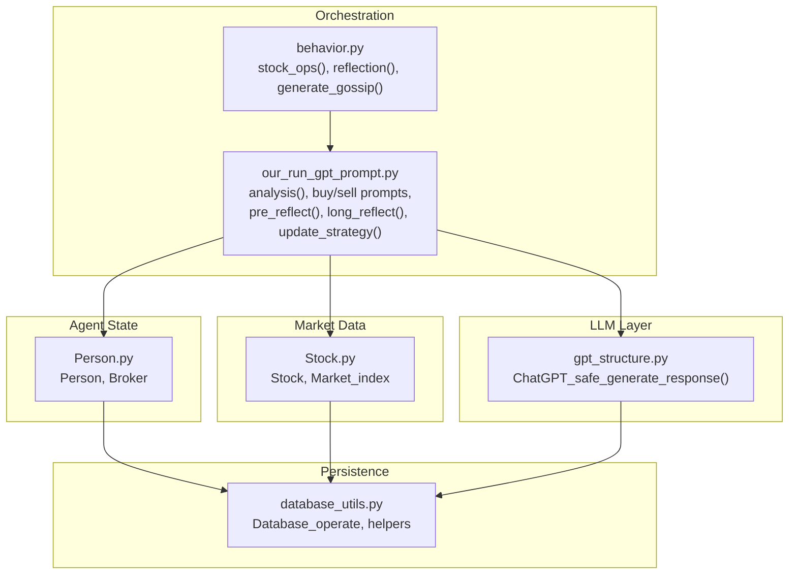
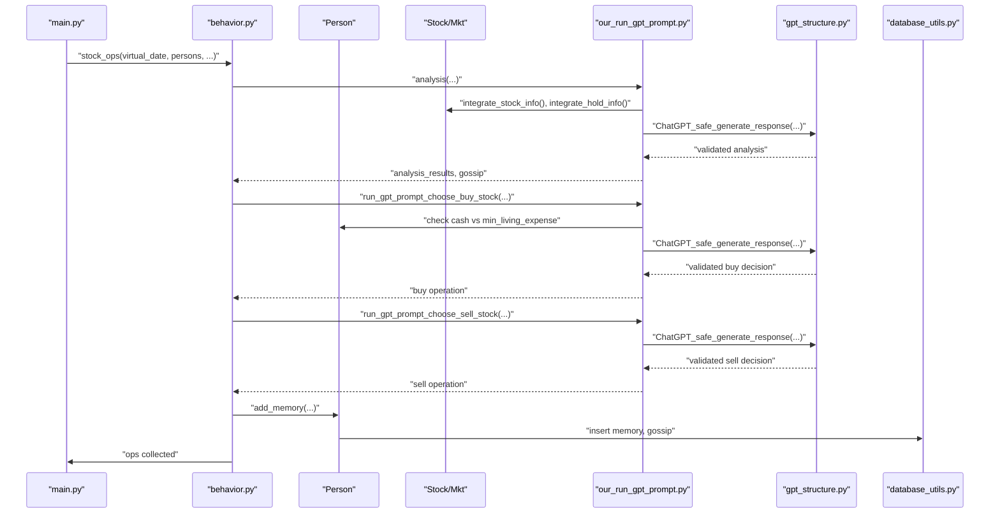
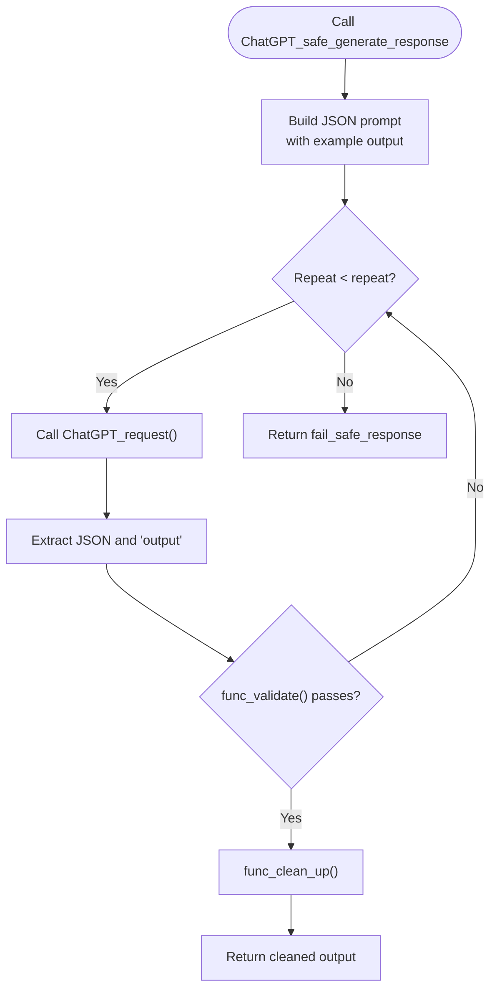
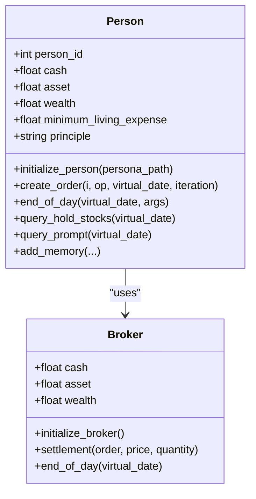
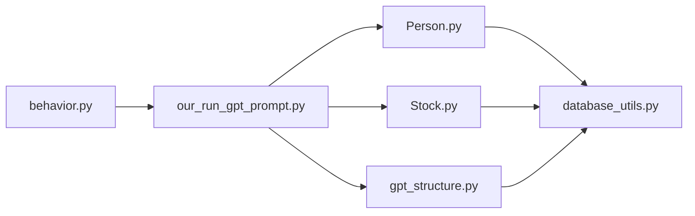

# Agent Cognition

<cite>
**Referenced Files in This Document**
- [our_run_gpt_prompt.py](file://Agent-Trading-Arena/Stock_Main/content/our_run_gpt_prompt.py)
- [gpt_structure.py](file://Agent-Trading-Arena/Stock_Main/content/gpt_structure.py)
- [Person.py](file://Agent-Trading-Arena/Stock_Main/Person.py)
- [Stock.py](file://Agent-Trading-Arena/Stock_Main/Stock.py)
- [behavior.py](file://Agent-Trading-Arena/Stock_Main/behavior.py)
- [main.py](file://Agent-Trading-Arena/Stock_Main/main.py)
- [database_utils.py](file://Agent-Trading-Arena/Stock_Main/database_utils.py)
- [analysis.txt](file://Agent-Trading-Arena/Stock_Main/content/our_prompt_template/analysis.txt)
- [buy_based_on_analysis.txt](file://Agent-Trading-Arena/Stock_Main/content/our_prompt_template/buy_based_on_analysis.txt)
- [sell_based_on_analysis.txt](file://Agent-Trading-Arena/Stock_Main/content/our_prompt_template/sell_based_on_analysis.txt)
</cite>

## Table of Contents
1. [Introduction](#introduction)
2. [Project Structure](#project-structure)
3. [Core Components](#core-components)
4. [Architecture Overview](#architecture-overview)
5. [Detailed Component Analysis](#detailed-component-analysis)
6. [Dependency Analysis](#dependency-analysis)
7. [Performance Considerations](#performance-considerations)
8. [Troubleshooting Guide](#troubleshooting-guide)
9. [Conclusion](#conclusion)

## Introduction
This document explains the agent cognition system that orchestrates trading agents’ decision-making through a structured cognitive workflow. It focuses on how the orchestration module coordinates functions for market analysis, buying/selling decisions, reflection, and strategy updates, and how the ChatGPT-safe response wrapper manages API communication, validation, and error recovery. It also documents the integration with persona and stock objects for context gathering, the retry mechanism and fail-safe responses, enforcement of financial constraints (e.g., minimum living expenses), and performance considerations for parallel execution.

## Project Structure
The agent cognition system spans several modules:
- Orchestration and prompting: content/our_run_gpt_prompt.py
- LLM API wrapper and safety: content/gpt_structure.py
- Agent state and financial constraints: Person.py
- Market and stock data: Stock.py
- Behavior pipeline: behavior.py
- Main simulation loop: main.py
- Database utilities: database_utils.py
- Prompt templates: content/our_prompt_template/*.txt

**Diagram sources**
- [behavior.py](file://Agent-Trading-Arena/Stock_Main/behavior.py#L82-L171)
- [our_run_gpt_prompt.py](file://Agent-Trading-Arena/Stock_Main/content/our_run_gpt_prompt.py#L414-L619)
- [gpt_structure.py](file://Agent-Trading-Arena/Stock_Main/content/gpt_structure.py#L167-L224)
- [Person.py](file://Agent-Trading-Arena/Stock_Main/Person.py#L143-L200)
- [Stock.py](file://Agent-Trading-Arena/Stock_Main/Stock.py#L14-L51)
- [database_utils.py](file://Agent-Trading-Arena/Stock_Main/database_utils.py#L245-L322)

**Section sources**
- [main.py](file://Agent-Trading-Arena/Stock_Main/main.py#L84-L131)
- [behavior.py](file://Agent-Trading-Arena/Stock_Main/behavior.py#L82-L210)

## Core Components
- Orchestration pipeline: behavior.py coordinates the cognitive cycle per agent per iteration.
- Cognitive prompts: our_run_gpt_prompt.py builds prompts and validates responses for analysis, buying, selling, reflection, and strategy updates.
- LLM safety wrapper: gpt_structure.py encapsulates API requests, retries, JSON extraction, and validation/cleanup hooks.
- Agent state and constraints: Person.py maintains cash, assets, minimum living expenses, and enforces financial limits during orders.
- Market context: Stock.py and Market_index provide stock prices, returns, and market index changes.
- Persistence: database_utils.py defines schemas and helpers for storing agent actions, memories, and market data.

**Section sources**
- [behavior.py](file://Agent-Trading-Arena/Stock_Main/behavior.py#L82-L210)
- [our_run_gpt_prompt.py](file://Agent-Trading-Arena/Stock_Main/content/our_run_gpt_prompt.py#L414-L619)
- [gpt_structure.py](file://Agent-Trading-Arena/Stock_Main/content/gpt_structure.py#L167-L224)
- [Person.py](file://Agent-Trading-Arena/Stock_Main/Person.py#L143-L200)
- [Stock.py](file://Agent-Trading-Arena/Stock_Main/Stock.py#L14-L51)
- [database_utils.py](file://Agent-Trading-Arena/Stock_Main/database_utils.py#L245-L322)

## Architecture Overview
The cognitive workflow follows a deterministic pipeline per iteration:
1. Market context aggregation (stock prices, market index, gossip, holdings).
2. Analysis generation via LLM with validation.
3. Buy/sell decision prompts with financial constraint checks.
4. Memory logging of decisions and context.
5. Reflection and strategy update at configured intervals.
6. Order submission and settlement.

**Diagram sources**
- [behavior.py](file://Agent-Trading-Arena/Stock_Main/behavior.py#L82-L171)
- [our_run_gpt_prompt.py](file://Agent-Trading-Arena/Stock_Main/content/our_run_gpt_prompt.py#L414-L619)
- [gpt_structure.py](file://Agent-Trading-Arena/Stock_Main/content/gpt_structure.py#L167-L224)
- [Person.py](file://Agent-Trading-Arena/Stock_Main/Person.py#L514-L545)
- [database_utils.py](file://Agent-Trading-Arena/Stock_Main/database_utils.py#L224-L242)

## Detailed Component Analysis

### Orchestration Pipeline (behavior.py)
- stock_ops(): Executes the cognitive loop for each agent:
  - Calls analysis() to generate market insights.
  - Calls run_gpt_prompt_choose_buy_stock() and run_gpt_prompt_choose_sell_stock().
  - Extracts and validates responses, logs memory, and prepares orders.
- reflection(): At configured intervals, runs pre_reflect(), long_reflect(), and update_strategy() to evolve the agent’s principle.
- generate_gossip(): Generates gossip entries for the current day.

Key behaviors:
- Validation and extraction helpers ensure robust parsing of LLM outputs.
- Memory logging captures decisions, context, and outcomes for later reflection.

**Section sources**
- [behavior.py](file://Agent-Trading-Arena/Stock_Main/behavior.py#L82-L210)

### Cognitive Prompt Functions (our_run_gpt_prompt.py)
- analysis(): Builds a prompt integrating stock info, market index change, gossip, and holdings; validates that the number of analysis items matches the requested count.
- run_gpt_prompt_choose_buy_stock(): Enforces financial constraints before prompting:
  - If cash is below threshold (multiple of minimum_living_expense), returns “hold”.
  - Otherwise prompts for buy decision with validation for either “hold” or a buy instruction with stock name, investment amount, and best buying price.
- run_gpt_prompt_choose_sell_stock(): Similar to buy, but validates either “hold” or a sell instruction with stock name, number of shares, and best selling price.
- pre_reflect(), long_reflect(), update_strategy(): Reflection prompts and strategy update with validation and cleanup hooks.
- Helper integrators:
  - integrate_stock_info(), integrate_hold_info(), integrate_gossip(), integrate_gossip_info(), integrate_reflect_info(), integrate_long_reflect_info().

Validation and cleanup hooks:
- __chat_func_validate(): Regex-based validators ensure response format compliance.
- __chat_func_clean_up(): Post-processes responses (e.g., stripping prefixes, splitting lists).

Prompt templates:
- analysis.txt, buy_based_on_analysis.txt, sell_based_on_analysis.txt define the structure and constraints for each stage.

**Section sources**
- [our_run_gpt_prompt.py](file://Agent-Trading-Arena/Stock_Main/content/our_run_gpt_prompt.py#L414-L619)
- [analysis.txt](file://Agent-Trading-Arena/Stock_Main/content/our_prompt_template/analysis.txt#L1-L37)
- [buy_based_on_analysis.txt](file://Agent-Trading-Arena/Stock_Main/content/our_prompt_template/buy_based_on_analysis.txt#L1-L33)
- [sell_based_on_analysis.txt](file://Agent-Trading-Arena/Stock_Main/content/our_prompt_template/sell_based_on_analysis.txt#L1-L31)

### LLM Safety Wrapper (gpt_structure.py)
- ChatGPT_safe_generate_response(): Core wrapper that:
  - Constructs a JSON-formatted prompt with example output and special instruction.
  - Repeatedly calls ChatGPT_request() up to repeat times.
  - Attempts to extract a JSON object and retrieve the “output” field.
  - Validates the extracted response using func_validate() and cleans it with func_clean_up().
  - Returns fail_safe_response on repeated failures.
- ChatGPT_request(): Makes a single OpenAI API call and returns the assistant message content.
- GPT4_request(): Alternative request method with explicit model selection.
- Retry and error handling:
  - Catches exceptions during request and JSON parsing.
  - Continues attempts until success or exhaustion of repeat count.
- Response validation and cleanup:
  - func_validate() and func_clean_up() are supplied by each prompt function to enforce format and normalize output.

**Diagram sources**
- [gpt_structure.py](file://Agent-Trading-Arena/Stock_Main/content/gpt_structure.py#L167-L224)

**Section sources**
- [gpt_structure.py](file://Agent-Trading-Arena/Stock_Main/content/gpt_structure.py#L167-L224)

### Agent State and Financial Constraints (Person.py)
- Person holds identity, cash, asset, wealth, and minimum_living_expense.
- create_order(): Submits orders to the market with:
  - Buy: checks cash_expense < cash before submitting.
  - Sell: verifies sufficient shares before submitting.
- end_of_day(): Updates daily expenses based on assets and minimum_living_expense, deducts daily_expense from cash, and persists state.
- query_*(): Helpers to retrieve holdings, account positions, and memory for prompt construction.

**Diagram sources**
- [Person.py](file://Agent-Trading-Arena/Stock_Main/Person.py#L143-L200)
- [Person.py](file://Agent-Trading-Arena/Stock_Main/Person.py#L18-L141)

**Section sources**
- [Person.py](file://Agent-Trading-Arena/Stock_Main/Person.py#L143-L200)
- [Person.py](file://Agent-Trading-Arena/Stock_Main/Person.py#L212-L249)
- [Person.py](file://Agent-Trading-Arena/Stock_Main/Person.py#L364-L427)

### Market Context and Data (Stock.py)
- Stock: Provides current prices, intraday lists, returns, and daily returns for prompts.
- Market_index: Aggregates weighted stock prices to compute market index and intraday percentage changes.
- Integration with database_utils: Queries and updates stock tables for persistence.

**Section sources**
- [Stock.py](file://Agent-Trading-Arena/Stock_Main/Stock.py#L14-L51)
- [Stock.py](file://Agent-Trading-Arena/Stock_Main/Stock.py#L128-L209)
- [Stock.py](file://Agent-Trading-Arena/Stock_Main/Stock.py#L212-L295)

### Persistence and Utilities (database_utils.py)
- Database_operate: Creates and manages tables for stock, person, account, memory, gossip, and active_orders.
- Helpers: submit_order(), query_all_stocks(), parse_*(), round_two_decimal(), round_lists_two_decimals(), stock_name_to_id().
- Used extensively by Person and Stock for state and market data persistence.

**Section sources**
- [database_utils.py](file://Agent-Trading-Arena/Stock_Main/database_utils.py#L245-L322)
- [database_utils.py](file://Agent-Trading-Arena/Stock_Main/database_utils.py#L224-L242)
- [database_utils.py](file://Agent-Trading-Arena/Stock_Main/database_utils.py#L138-L153)

## Dependency Analysis
- Orchestration depends on:
  - Prompt functions for cognitive tasks.
  - LLM wrapper for API communication and validation.
  - Person and Stock for context and financial constraints.
- Prompt functions depend on:
  - Integrators for assembling context from Person and Stock.
  - LLM wrapper for safe API calls.
- LLM wrapper depends on:
  - OpenAI client and database utilities for URL/image support.
- Person and Stock depend on:
  - Database_operate for persistence and queries.

**Diagram sources**
- [behavior.py](file://Agent-Trading-Arena/Stock_Main/behavior.py#L3-L11)
- [our_run_gpt_prompt.py](file://Agent-Trading-Arena/Stock_Main/content/our_run_gpt_prompt.py#L1-L7)
- [gpt_structure.py](file://Agent-Trading-Arena/Stock_Main/content/gpt_structure.py#L1-L11)
- [Person.py](file://Agent-Trading-Arena/Stock_Main/Person.py#L2-L14)
- [Stock.py](file://Agent-Trading-Arena/Stock_Main/Stock.py#L1-L10)
- [database_utils.py](file://Agent-Trading-Arena/Stock_Main/database_utils.py#L1-L11)

**Section sources**
- [behavior.py](file://Agent-Trading-Arena/Stock_Main/behavior.py#L3-L11)
- [our_run_gpt_prompt.py](file://Agent-Trading-Arena/Stock_Main/content/our_run_gpt_prompt.py#L1-L7)
- [gpt_structure.py](file://Agent-Trading-Arena/Stock_Main/content/gpt_structure.py#L1-L11)
- [Person.py](file://Agent-Trading-Arena/Stock_Main/Person.py#L2-L14)
- [Stock.py](file://Agent-Trading-Arena/Stock_Main/Stock.py#L1-L10)
- [database_utils.py](file://Agent-Trading-Arena/Stock_Main/database_utils.py#L1-L11)

## Performance Considerations
- Parallelization opportunities:
  - Multiple agents can run analysis and decision prompts concurrently within an iteration.
  - Consider thread/process pools for independent agents to reduce wall-clock time.
- API throttling and retries:
  - The LLM wrapper retries on failure; tune repeat and backoff to balance latency and reliability.
- Database contention:
  - Batch writes and minimize frequent round-trips; group submit_order() calls per iteration.
- Prompt caching:
  - Cache static parts of prompts (e.g., templates) to reduce string manipulation overhead.
- Validation overhead:
  - Keep regex validations efficient; avoid overly complex patterns.
- Memory footprint:
  - Limit stored memory entries per agent per iteration to control growth.

[No sources needed since this section provides general guidance]

## Troubleshooting Guide
Common issues and remedies:
- API failures:
  - ChatGPT_safe_generate_response() catches exceptions and falls back to fail_safe_response. Increase repeat count or adjust special_instruction to improve JSON extraction.
- Response format mismatches:
  - __chat_func_validate() ensures strict format compliance. Adjust regex patterns in prompt functions to match expected outputs.
- Insufficient cash for buy:
  - run_gpt_prompt_choose_buy_stock() returns “hold” when cash is below threshold (multiple of minimum_living_expense). Verify persona initialization and daily_expense computation.
- No holdings for sell:
  - run_gpt_prompt_choose_sell_stock() returns “hold” when no holdings exist. Confirm query_hold_stocks() and query_prompt() correctness.
- Database errors:
  - Database_operate.execute_sql() prints errors and returns False. Check SQL commands and table schemas.

**Section sources**
- [gpt_structure.py](file://Agent-Trading-Arena/Stock_Main/content/gpt_structure.py#L167-L224)
- [our_run_gpt_prompt.py](file://Agent-Trading-Arena/Stock_Main/content/our_run_gpt_prompt.py#L486-L549)
- [our_run_gpt_prompt.py](file://Agent-Trading-Arena/Stock_Main/content/our_run_gpt_prompt.py#L551-L618)
- [database_utils.py](file://Agent-Trading-Arena/Stock_Main/database_utils.py#L302-L310)

## Conclusion
The agent cognition system integrates structured prompting, robust LLM safety wrappers, and agent-centric financial constraints to enable reliable, validated decision-making. The orchestration pipeline coordinates analysis, buying/selling decisions, and reflection, while the LLM wrapper ensures resilient API communication and response validation. Financial safeguards (minimum_living_expense thresholds) prevent agents from depleting essential funds, and the modular design supports scalability and parallel execution.