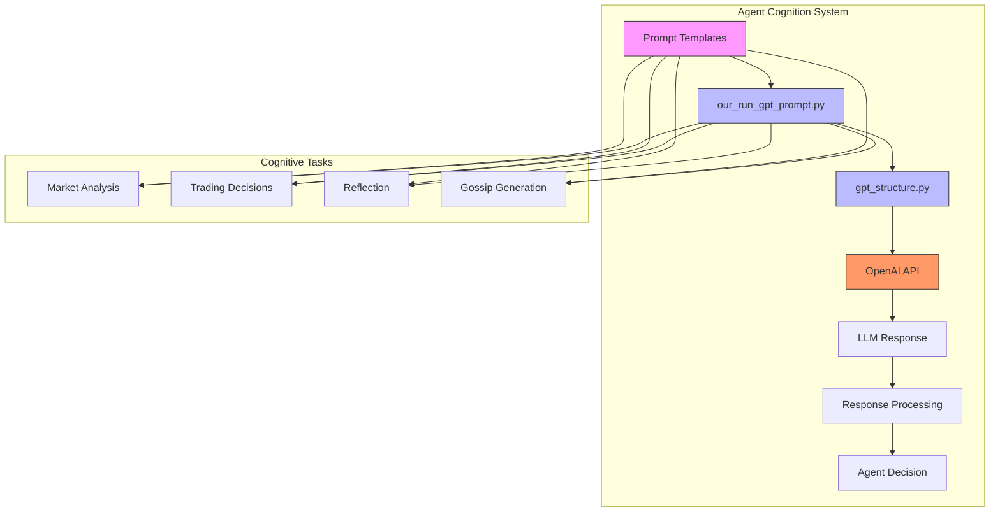
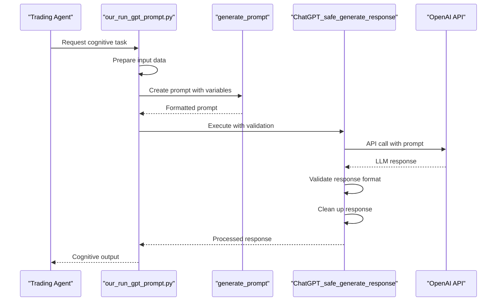
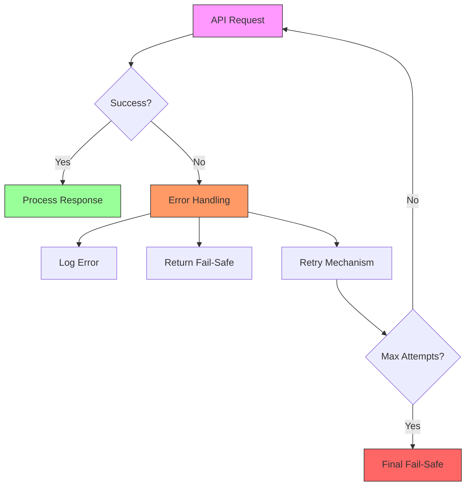

# LLM Integration

<cite>
**Referenced Files in This Document**   
- [gpt_structure.py](file://Agent-Trading-Arena/Stock_Main/content/gpt_structure.py)
- [our_run_gpt_prompt.py](file://Agent-Trading-Arena/Stock_Main/content/our_run_gpt_prompt.py)
- [analysis.txt](file://Agent-Trading-Arena/Stock_Main/content/our_prompt_template/analysis.txt)
- [reflect.txt](file://Agent-Trading-Arena/Stock_Main/content/our_prompt_template/reflect.txt)
- [buy_based_on_analysis.txt](file://Agent-Trading-Arena/Stock_Main/content/our_prompt_template/buy_based_on_analysis.txt)
- [sell_based_on_analysis.txt](file://Agent-Trading-Arena/Stock_Main/content/our_prompt_template/sell_based_on_analysis.txt)
- [gossip.txt](file://Agent-Trading-Arena/Stock_Main/content/our_prompt_template/gossip.txt)
- [utils.py](file://Agent-Trading-Arena/Stock_Main/content/utils.py)
</cite>

## Table of Contents
1. [Introduction](#introduction)
2. [LLM Integration Architecture](#llm-integration-architecture)
3. [Prompt Engineering Strategy](#prompt-engineering-strategy)
4. [Prompt Template Structure](#prompt-template-structure)
5. [GPT Execution Framework](#gpt-execution-framework)
6. [Conversation History Management](#conversation-history-management)
7. [Error Handling and Reliability](#error-handling-and-reliability)
8. [Performance Considerations](#performance-considerations)
9. [Best Practices for Prompt Modification](#best-practices-for-prompt-modification)
10. [Conclusion](#conclusion)

## Introduction
The LLM Integration system in the Agent Trading Arena framework leverages OpenAI's API to power agent cognition and decision-making in a simulated stock trading environment. This document provides a comprehensive analysis of how the system uses large language models to enable intelligent trading behavior through sophisticated prompt engineering, structured API interactions, and cognitive processes including market analysis, trading decisions, reflection, and strategic gossip generation.

The system enables autonomous agents to analyze market conditions, make buy/sell decisions, reflect on past performance, and influence other agents through generated gossip. This is achieved through a well-structured integration of OpenAI's API with custom prompt templates and execution logic that guides the LLM's reasoning process for specific cognitive tasks.

## LLM Integration Architecture

**Diagram sources**
- [gpt_structure.py](file://Agent-Trading-Arena/Stock_Main/content/gpt_structure.py#L1-L380)
- [our_run_gpt_prompt.py](file://Agent-Trading-Arena/Stock_Main/content/our_run_gpt_prompt.py#L1-L628)

**Section sources**
- [gpt_structure.py](file://Agent-Trading-Arena/Stock_Main/content/gpt_structure.py#L1-L380)
- [our_run_gpt_prompt.py](file://Agent-Trading-Arena/Stock_Main/content/our_run_gpt_prompt.py#L1-L628)

## Prompt Engineering Strategy

The framework employs a comprehensive prompt engineering strategy using specialized template files in the `our_prompt_template/` directory for different cognitive tasks. Each template is designed to guide the LLM's reasoning process for specific trading-related activities, ensuring consistent and focused responses.

The system implements a modular approach where different prompt templates serve distinct cognitive functions:

- **Market Analysis**: `analysis.txt` guides the agent in synthesizing market information to identify key investment opportunities
- **Trading Decisions**: `buy_based_on_analysis.txt` and `sell_based_on_analysis.txt` direct the agent to make specific buy/sell decisions based on analysis
- **Reflection**: `reflect.txt`, `pre_reflect.txt`, and `pre_long_reflection.txt` enable agents to evaluate their performance and refine strategies
- **Gossip Generation**: `gossip.txt` allows agents to create market-influencing information that can affect other agents' behavior

Each template follows a consistent structure with clearly defined variables, instructions, and task specifications, ensuring that the LLM understands its role and the expected output format.

**Section sources**
- [analysis.txt](file://Agent-Trading-Arena/Stock_Main/content/our_prompt_template/analysis.txt#L1-L37)
- [buy_based_on_analysis.txt](file://Agent-Trading-Arena/Stock_Main/content/our_prompt_template/buy_based_on_analysis.txt#L1-L33)
- [sell_based_on_analysis.txt](file://Agent-Trading-Arena/Stock_Main/content/our_prompt_template/sell_based_on_analysis.txt#L1-L31)
- [reflect.txt](file://Agent-Trading-Arena/Stock_Main/content/our_prompt_template/reflect.txt#L1-L35)
- [gossip.txt](file://Agent-Trading-Arena/Stock_Main/content/our_prompt_template/gossip.txt#L1-L16)

## Prompt Template Structure

The prompt templates follow a standardized structure that includes variable definitions, instructions, and task specifications. This consistent format ensures that the LLM can reliably parse and respond to different cognitive tasks.

```mermaid
flowchart TD
A["Template Structure"] --> B["Variables Section"]
A --> C["Instructions Section"]
A --> D["Task Section"]
B --> E["!<INPUT 0>! -- Variable 1"]
B --> F["!<INPUT 1>! -- Variable 2"]
B --> G["..."]
C --> H["Role Definition"]
C --> I["Context Information"]
C --> J["Objective Statement"]
D --> K["Specific Task"]
D --> L["Required Information Sources"]
D --> M["Output Format Expectations"]
style A fill:#f9f,stroke:#333
style B fill:#bbf,stroke:#333
style C fill:#bbf,stroke:#333
style D fill:#bbf,stroke:#333
```

**Diagram sources**
- [analysis.txt](file://Agent-Trading-Arena/Stock_Main/content/our_prompt_template/analysis.txt#L1-L37)
- [reflect.txt](file://Agent-Trading-Arena/Stock_Main/content/our_prompt_template/reflect.txt#L1-L35)

### Example: Market Analysis Template
The `analysis.txt` template demonstrates the framework's approach to guiding the LLM through complex financial analysis:

- **Variables**: Stock information, market information, gossip, existing investments, investment strategy, and analysis count
- **Instructions**: Defines the agent's role as a player in a simulated stock trading challenge with the objective of maximizing profit
- **Task**: Requires the agent to produce a specific number of analysis results that connect various information sources to the investment strategy

### Example: Reflection Template
The `reflect.txt` template illustrates how the system facilitates strategic self-improvement:

- **Variables**: Historical performance data, weakness assessment, strength assessment, and strategy suggestions
- **Instructions**: Positions the agent as needing to adjust investment strategies over multiple days to maximize returns
- **Task**: Focuses on macro-level strategy improvement rather than specific stock recommendations

**Section sources**
- [analysis.txt](file://Agent-Trading-Arena/Stock_Main/content/our_prompt_template/analysis.txt#L1-L37)
- [reflect.txt](file://Agent-Trading-Arena/Stock_Main/content/our_prompt_template/reflect.txt#L1-L35)
- [gpt_structure.py](file://Agent-Trading-Arena/Stock_Main/content/gpt_structure.py#L291-L316)

## GPT Execution Framework

The `our_run_gpt_prompt.py` module serves as the central component for constructing and executing API calls to OpenAI's services. This module orchestrates the entire LLM interaction process, from prompt construction to response handling.

**Diagram sources**
- [our_run_gpt_prompt.py](file://Agent-Trading-Arena/Stock_Main/content/our_run_gpt_prompt.py#L1-L628)
- [gpt_structure.py](file://Agent-Trading-Arena/Stock_Main/content/gpt_structure.py#L167-L223)

The execution framework follows a systematic process:

1. **Input Integration**: Functions like `integrate_stock_info()`, `integrate_hold_info()`, and `integrate_gossip()` gather relevant data from the trading environment
2. **Prompt Construction**: The `create_prompt_input()` functions prepare the variables that will be injected into the template
3. **Template Generation**: The `generate_prompt()` function from `gpt_structure.py` replaces variable placeholders with actual values
4. **API Execution**: `ChatGPT_safe_generate_response()` handles the API call with error handling and response validation
5. **Response Processing**: Validation and cleanup functions ensure the response meets the required format

Key functions in the execution framework include:
- `analysis()`: Performs market analysis based on multiple information sources
- `run_gpt_prompt_choose_buy_stock()`: Makes buy decisions based on analysis
- `run_gpt_prompt_choose_sell_stock()`: Makes sell decisions based on analysis
- `pre_reflect()` and `long_reflect()`: Facilitate short-term and long-term strategic reflection
- `run_gpt_generate_gossip()`: Creates market-influencing gossip

**Section sources**
- [our_run_gpt_prompt.py](file://Agent-Trading-Arena/Stock_Main/content/our_run_gpt_prompt.py#L1-L628)
- [gpt_structure.py](file://Agent-Trading-Arena/Stock_Main/content/gpt_structure.py#L167-L223)

## Conversation History Management

The system manages conversation history through a structured approach that provides the LLM with relevant historical context without overwhelming it with excessive information. This is particularly evident in the reflection and gossip generation processes.

For reflection tasks, the system implements temporal windowing to limit the amount of historical data considered:

- **Short-term reflection**: `pre_reflect()` examines the previous three days of trading activity
- **Long-term reflection**: `long_reflect()` analyzes performance over an extended period

The `integrate_reflect_info()` and `integrate_long_reflect_info()` functions retrieve and format historical trading data from the agent's memory, creating a comprehensive context for strategic evaluation. This approach allows agents to identify patterns in their performance, recognize successful strategies, and correct ineffective approaches.

Gossip generation also leverages historical context through the `integrate_gossip_info()` function, which compiles information from previous trading iterations to create believable market rumors. This enables agents to strategically influence other participants by sharing (or fabricating) information that aligns with their trading objectives.

The system stores generated prompts and responses in debug directories (e.g., `debug_prompts/`), allowing for post-hoc analysis of the LLM's decision-making process and facilitating iterative improvement of the prompt engineering strategy.

**Section sources**
- [our_run_gpt_prompt.py](file://Agent-Trading-Arena/Stock_Main/content/our_run_gpt_prompt.py#L114-L249)
- [our_run_gpt_prompt.py](file://Agent-Trading-Arena/Stock_Main/content/our_run_gpt_prompt.py#L364-L412)

## Error Handling and Reliability

The LLM integration system implements robust error handling to ensure reliability in the face of API failures, network issues, and invalid responses. This is primarily managed through the `gpt_structure.py` module.

**Diagram sources**
- [gpt_structure.py](file://Agent-Trading-Arena/Stock_Main/content/gpt_structure.py#L48-L60)
- [gpt_structure.py](file://Agent-Trading-Arena/Stock_Main/content/gpt_structure.py#L193-L223)

Key error handling mechanisms include:

- **Exception Handling**: The `GPT4_request()` and `ChatGPT_request()` functions wrap API calls in try-except blocks to catch and log errors
- **Fail-Safe Responses**: Functions like `get_fail_safe()` provide default responses when the LLM fails to generate valid output
- **Response Validation**: The `__chat_func_validate()` functions use regular expressions to verify that responses meet the expected format
- **Retry Logic**: The `repeat` parameter in `ChatGPT_safe_generate_response()` enables multiple attempts to obtain a valid response
- **Input Validation**: Financial values are processed with `round_two_decimal()` to ensure consistency

The system also includes a timeout mechanism (commented out in the code with `#@timeout(150)`) that would prevent indefinite blocking on API calls, although this feature is currently disabled.

**Section sources**
- [gpt_structure.py](file://Agent-Trading-Arena/Stock_Main/content/gpt_structure.py#L48-L60)
- [gpt_structure.py](file://Agent-Trading-Arena/Stock_Main/content/gpt_structure.py#L193-L223)
- [our_run_gpt_prompt.py](file://Agent-Trading-Arena/Stock_Main/content/our_run_gpt_prompt.py#L162-L177)

## Performance Considerations

The system addresses performance considerations for making multiple concurrent LLM calls through several design choices:

- **Rate Limiting**: The `temp_sleep()` function introduces deliberate delays between API calls to avoid rate limiting
- **Efficient Prompt Design**: Templates are optimized to minimize token usage while maintaining effectiveness
- **Caching Strategy**: Generated prompts and responses are saved to disk for debugging and analysis, reducing the need for repeated calls during development
- **Selective Information Provision**: The system carefully curates the information provided to the LLM, avoiding information overload

For concurrent operations, the framework would benefit from implementing asynchronous API calls, though the current implementation appears to be synchronous. The modular design of the prompt execution functions allows for relatively easy refactoring to support concurrency.

Performance is further optimized through:
- **Template Reuse**: Common template structures reduce development and maintenance overhead
- **Variable Injection**: The `generate_prompt()` function efficiently replaces placeholders with actual values
- **Focused Cognitive Tasks**: Each prompt template addresses a specific cognitive function, reducing processing complexity

The system also includes debugging capabilities with the `save_path` parameter in various functions, allowing developers to inspect the exact prompts sent to the LLM and the responses received, facilitating performance tuning and prompt optimization.

**Section sources**
- [gpt_structure.py](file://Agent-Trading-Arena/Stock_Main/content/gpt_structure.py#L16-L17)
- [our_run_gpt_prompt.py](file://Agent-Trading-Arena/Stock_Main/content/our_run_gpt_prompt.py#L182-L187)
- [our_run_gpt_prompt.py](file://Agent-Trading-Arena/Stock_Main/content/our_run_gpt_prompt.py#L275-L280)

## Best Practices for Prompt Modification

When modifying prompts to change agent behavior, the following best practices should be observed:

1. **Maintain Consistent Structure**: Preserve the variables, instructions, and task sections to ensure compatibility with the execution framework
2. **Clear Variable Definitions**: Use descriptive names in the variables section and ensure the number of variables matches the expected inputs
3. **Specific Instructions**: Clearly define the agent's role, context, and objectives to guide appropriate behavior
4. **Precise Task Specifications**: Define exactly what information should be considered and the expected output format
5. **Validation Compatibility**: Ensure that modifications do not break the response validation logic in `__chat_func_validate()`
6. **Example-Based Guidance**: Include clear examples of the expected output format
7. **Incremental Changes**: Make small, focused modifications and test their impact on agent behavior
8. **Preserve Special Markers**: Maintain the `<commentblockmarker>###</commentblockmarker>` delimiter used for template processing

When creating new prompt templates, follow the established patterns in existing templates and ensure they integrate with the `generate_prompt()` function's variable replacement mechanism. Test new prompts thoroughly to verify that they produce reliable and predictable agent behavior in the trading environment.

**Section sources**
- [analysis.txt](file://Agent-Trading-Arena/Stock_Main/content/our_prompt_template/analysis.txt#L1-L37)
- [reflect.txt](file://Agent-Trading-Arena/Stock_Main/content/our_prompt_template/reflect.txt#L1-L35)
- [gpt_structure.py](file://Agent-Trading-Arena/Stock_Main/content/gpt_structure.py#L291-L316)

## Conclusion

The LLM integration system in the Agent Trading Arena framework represents a sophisticated implementation of large language models for autonomous trading agents. By combining specialized prompt templates with a robust execution framework, the system enables agents to perform complex cognitive tasks including market analysis, trading decisions, strategic reflection, and market influence through gossip generation.

The architecture effectively leverages OpenAI's API through the `gpt_structure.py` module, which handles API calls, response processing, and error management. The `our_run_gpt_prompt.py` module orchestrates the cognitive processes, integrating relevant data and constructing prompts using templates from the `our_prompt_template/` directory.

Key strengths of the system include its modular design, comprehensive error handling, and structured approach to prompt engineering. The system provides a solid foundation for agent cognition in the trading environment, with opportunities for further optimization in areas such as concurrent API calls and more sophisticated conversation history management.

This integration demonstrates how LLMs can be effectively harnessed for complex decision-making tasks in simulated environments, providing a template for similar applications in other domains requiring autonomous agents with advanced cognitive capabilities.