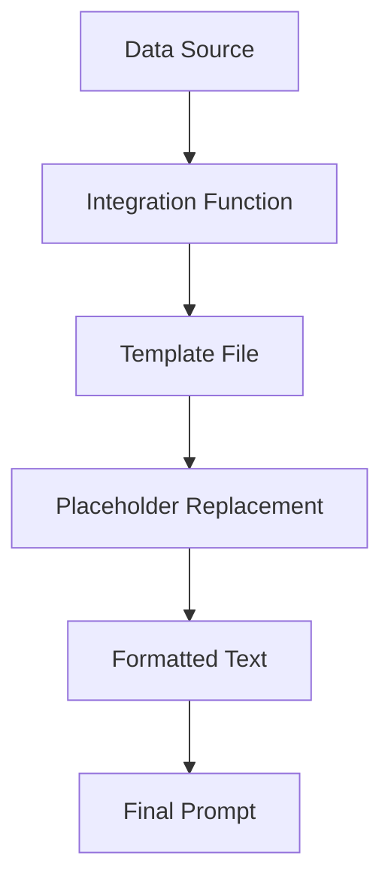
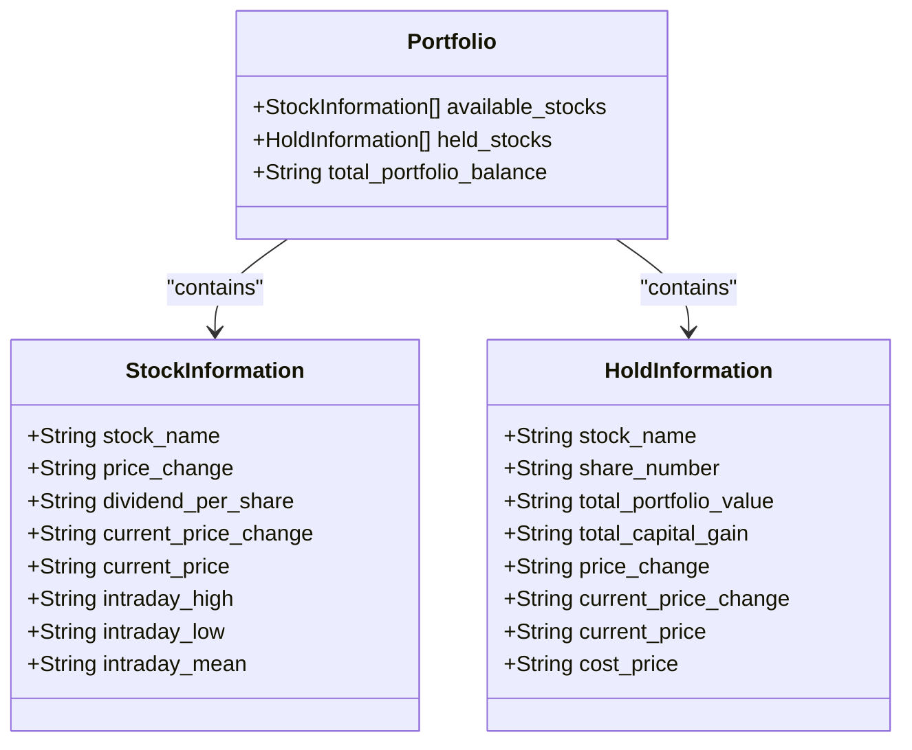
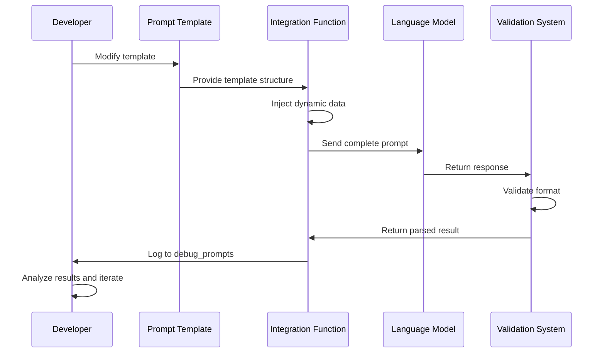

# Prompt Engineering

<cite>
**Referenced Files in This Document**   
- [analysis.txt](file://Stock_Main/content/our_prompt_template/analysis.txt)
- [buy_based_on_analysis.txt](file://Stock_Main/content/our_prompt_template/buy_based_on_analysis.txt)
- [sell_based_on_analysis.txt](file://Stock_Main/content/our_prompt_template/sell_based_on_analysis.txt)
- [gossip.txt](file://Stock_Main/content/our_prompt_template/gossip.txt)
- [gossip_info.txt](file://Stock_Main/content/our_prompt_template/gossip_info.txt)
- [reflect.txt](file://Stock_Main/content/our_prompt_template/reflect.txt)
- [pre_reflect.txt](file://Stock_Main/content/our_prompt_template/pre_reflect.txt)
- [pre_long_reflection.txt](file://Stock_Main/content/our_prompt_template/pre_long_reflection.txt)
- [long_reflect_infor.txt](file://Stock_Main/content/our_prompt_template/long_reflect_infor.txt)
- [hold_information.txt](file://Stock_Main/content/our_prompt_template/hold_information.txt)
- [stock_information.txt](file://Stock_Main/content/our_prompt_template/stock_information.txt)
- [our_run_gpt_prompt.py](file://Stock_Main/content/our_run_gpt_prompt.py)
- [gpt_structure.py](file://Stock_Main/content/gpt_structure.py)
- [Person.py](file://Stock_Main/Person.py)
- [sim_test01/debug_prompts/day0_iter0_market_analysis_prompt.txt](file://Stock_Main/save/sim_test01/debug_prompts/day0_iter0_market_analysis_prompt.txt)
</cite>

## Table of Contents
1. [Introduction](#introduction)
2. [Prompt Template Cognitive Functions](#prompt-template-cognitive-functions)
3. [Template Syntax and Placeholder System](#template-syntax-and-placeholder-system)
4. [Data Integration Functions](#data-integration-functions)
5. [Stock and Portfolio Information Formatting](#stock-and-portfolio-information-formatting)
6. [Comment Block Marker Functionality](#comment-block-marker-functionality)
7. [Best Practices for Template Modification](#best-practices-for-template-modification)
8. [Testing and Debugging Prompt Changes](#testing-and-debugging-prompt-changes)
9. [Conclusion](#conclusion)

## Introduction
The Agent Trading Arena employs a sophisticated prompt engineering system that guides AI agents through various cognitive functions in a simulated stock trading environment. This system uses specialized prompt templates to direct agents through market analysis, investment decisions, strategic reflection, and information dissemination. Each template serves a distinct role in the agent's decision-making lifecycle, with dynamic data injection through integration functions that pull real-time information from agents, stocks, and market conditions.

**Section sources**
- [analysis.txt](file://Stock_Main/content/our_prompt_template/analysis.txt)
- [our_run_gpt_prompt.py](file://Stock_Main/content/our_run_gpt_prompt.py)

## Prompt Template Cognitive Functions

### Market Analysis (analysis.txt)
The market analysis template enables agents to synthesize information from multiple sources to generate strategic insights. It processes stock information, market trends, gossip from other agents, existing investments, and the agent's investment strategy to produce a specified number of valuable analysis results. These results form the foundation for subsequent buy and sell decisions, ensuring that trading actions are grounded in comprehensive market understanding.

**Section sources**
- [analysis.txt](file://Stock_Main/content/our_prompt_template/analysis.txt)

### Buy Decisions (buy_based_on_analysis.txt)
This template guides agents through the decision-making process for purchasing stocks. It incorporates the agent's financial situation (cash amount and minimum living expense), available stock information, market analysis results, and investment strategy to determine optimal buying decisions. The template ensures that agents balance profit maximization with financial sustainability by maintaining minimum cash reserves.

**Section sources**
- [buy_based_on_analysis.txt](file://Stock_Main/content/our_prompt_template/buy_based_on_analysis.txt)

### Sell Decisions (sell_based_on_analysis.txt)
The sell decision template facilitates strategic divestment by considering the agent's financial position, existing investments, market analysis, and investment strategy. It enables agents to determine when and how to sell holdings to maximize returns while maintaining financial stability. The template specifically addresses the agent's need to preserve minimum living expenses while optimizing portfolio performance.

**Section sources**
- [sell_based_on_analysis.txt](file://Stock_Main/content/our_prompt_template/sell_based_on_analysis.txt)

### Gossip Generation (gossip.txt)
This template empowers agents to generate market-influencing information that can affect other agents' trading behavior. Agents use their previous day's trading information to create gossip about specific stocks or the overall market. The gossip can be factual or intentionally misleading, allowing agents to potentially manipulate market dynamics to their advantage, provided the misinformation doesn't contradict known market facts.

**Section sources**
- [gossip.txt](file://Stock_Main/content/our_prompt_template/gossip.txt)

### Reflection (reflect.txt, pre_reflect.txt)
The reflection system consists of two complementary templates that enable agents to evaluate and improve their investment strategies. The pre_reflect.txt template analyzes the strengths and weaknesses of the current strategy based on historical performance data, identifying patterns of success and failure. The reflect.txt template then uses this analysis to generate improved investment strategies, transforming tactical observations into strategic guidance for future trading decisions.

**Section sources**
- [reflect.txt](file://Stock_Main/content/our_prompt_template/reflect.txt)
- [pre_reflect.txt](file://Stock_Main/content/our_prompt_template/pre_reflect.txt)

### Long-term Strategy Evolution (pre_long_reflection.txt, long_reflect_infor.txt)
This template system supports agents in developing long-term strategic adaptations based on multi-day trading performance. By analyzing trading activities over several consecutive days, agents can identify broader patterns and trends that inform significant strategic shifts. The long_reflect_infor.txt template structures the historical data presentation, while pre_long_reflection.txt guides the synthesis of this information into strategic recommendations for maximizing investment returns over extended periods.

**Section sources**
- [pre_long_reflection.txt](file://Stock_Main/content/our_prompt_template/pre_long_reflection.txt)
- [long_reflect_infor.txt](file://Stock_Main/content/our_prompt_template/long_reflect_infor.txt)

## Template Syntax and Placeholder System

### Placeholder Syntax (!<INPUT {count}>!)
The prompt templates use a consistent placeholder system with the syntax `!<INPUT {count}>!` where {count} is a zero-based integer index. These placeholders are systematically replaced with dynamic data by the integration functions in our_run_gpt_prompt.py. Each placeholder corresponds to a specific data type or information category, ensuring structured and predictable data injection. The numbering sequence maintains consistency across templates, allowing for systematic data flow throughout the agent's decision-making process.

### Variables Section
Each template begins with a "Variables" section that documents the placeholder-to-data mapping, providing clear documentation of what each `!<INPUT {count}>!` represents. This section serves as internal documentation, making the template structure transparent and maintainable. The comments following each placeholder (after the "--" delimiter) describe the nature of the data that will be injected, facilitating understanding and modification of the templates.

**Section sources**
- [analysis.txt](file://Stock_Main/content/our_prompt_template/analysis.txt)
- [buy_based_on_analysis.txt](file://Stock_Main/content/our_prompt_template/buy_based_on_analysis.txt)
- [gpt_structure.py](file://Stock_Main/content/gpt_structure.py)

## Data Integration Functions

### Integration Function Architecture
The our_run_gpt_prompt.py file contains a suite of integration functions that retrieve and format data for injection into prompt templates. These functions act as middleware between the raw data sources (agents, stocks, market conditions) and the prompt templates, transforming structured data into natural language formats suitable for LLM processing.

### Key Integration Functions
- **integrate_stock_info()**: Retrieves and formats stock data using the stock_information.txt template
- **integrate_hold_info()**: Structures portfolio status information using the hold_information.txt template
- **integrate_gossip_info()**: Compiles historical trading data for gossip generation
- **integrate_reflect_info()**: Aggregates historical performance data for reflection processes

These functions follow a consistent pattern: they read the appropriate template file, replace placeholders with actual data values, and return the formatted text for inclusion in the final prompt.



**Diagram sources**
- [our_run_gpt_prompt.py](file://Stock_Main/content/our_run_gpt_prompt.py)
- [gpt_structure.py](file://Stock_Main/content/gpt_structure.py)

**Section sources**
- [our_run_gpt_prompt.py](file://Stock_Main/content/our_run_gpt_prompt.py)

## Stock and Portfolio Information Formatting

### Stock Information Structure (stock_information.txt)
The stock_information.txt template formats stock data with comprehensive metrics including historical price trends, dividend information, and intraday performance. It presents:
- Closing prices from the past five days
- Dividend per share
- Current price change percentage and value
- Intraday high, low, and mean prices

The template uses seven placeholders to structure this information, ensuring consistent presentation across all stocks in the market. Special formatting is applied to price changes, with positive values prefixed with "+" and negative values with "-" for clarity.

**Section sources**
- [stock_information.txt](file://Stock_Main/content/our_prompt_template/stock_information.txt)

### Portfolio Status Structure (hold_information.txt)
The hold_information.txt template structures portfolio information to provide agents with a clear view of their current holdings. For each held stock, it includes:
- Number of shares owned
- Total portfolio value and capital gain/loss
- Historical price trends (past five days)
- Current price change percentage and value
- Current price and cost basis

This template uses eight placeholders to create detailed holding summaries, enabling agents to assess the performance of their investments and make informed decisions about buying, selling, or holding positions.



**Diagram sources**
- [stock_information.txt](file://Stock_Main/content/our_prompt_template/stock_information.txt)
- [hold_information.txt](file://Stock_Main/content/our_prompt_template/hold_information.txt)

**Section sources**
- [stock_information.txt](file://Stock_Main/content/our_prompt_template/stock_information.txt)
- [hold_information.txt](file://Stock_Main/content/our_prompt_template/hold_information.txt)

## Comment Block Marker Functionality

### Purpose of <commentblockmarker>###</commentblockmarker>
The `<commentblockmarker>###</commentblockmarker>` delimiter serves a critical function in the prompt generation process. It separates template documentation and variable definitions from the actual prompt content that is sent to the LLM. When the generate_prompt function in gpt_structure.py processes a template, it splits the content at this marker and uses only the portion after the marker as the final prompt.

### Implementation in Code
The generate_prompt function in gpt_structure.py explicitly checks for this marker and processes the template accordingly:
```python
if "<commentblockmarker>###</commentblockmarker>" in prompt:
    prompt = prompt.split("<commentblockmarker>###</commentblockmarker>")[1]
```

This design pattern allows developers to include extensive documentation, variable definitions, and comments within the template files without exposing this metadata to the LLM. It creates a clean separation between template development artifacts and the operational prompt content.

**Section sources**
- [gpt_structure.py](file://Stock_Main/content/gpt_structure.py)
- [analysis.txt](file://Stock_Main/content/our_prompt_template/analysis.txt)

## Best Practices for Template Modification

### Maintaining Response Validity
When modifying prompt templates, it's essential to preserve the expected response format to ensure parsing validity. The system relies on specific validation functions (e.g., __chat_func_validate in our_run_gpt_prompt.py) that expect responses in particular formats. Changes to templates should not alter the expected output structure unless corresponding updates are made to the validation and cleanup functions.

### Strategic Behavior Modification
Templates can be modified to alter agent behavior by adjusting:
- Instruction emphasis (e.g., prioritizing risk aversion vs. aggressive growth)
- Information presentation order (affecting cognitive salience)
- Decision criteria weighting
- Response format requirements

However, such modifications should be made incrementally and tested thoroughly to avoid unintended behavioral consequences.

### Validation and Error Handling
The system incorporates robust validation mechanisms to ensure response quality:
- **func_validate functions**: Check response format and content validity
- **func_clean_up functions**: Normalize and extract relevant information from responses
- **fail_safe mechanisms**: Provide fallback responses when validation fails
- **repeat attempts**: Retry prompt generation multiple times before failing

**Section sources**
- [our_run_gpt_prompt.py](file://Stock_Main/content/our_run_gpt_prompt.py)
- [gpt_structure.py](file://Stock_Main/content/gpt_structure.py)

## Testing and Debugging Prompt Changes

### Debug Output System
The system includes comprehensive debugging capabilities through the save/sim_test01/debug_prompts/ directory. When the save_path parameter is provided to integration functions, the system generates detailed debug files including:
- Complete prompt inputs (e.g., day0_iter0_market_analysis_prompt.txt)
- Generated responses (e.g., day0_short_reflection_result.txt)
- Strategy update prompts and results

These files enable developers to trace the complete prompt generation and response cycle, facilitating systematic testing and refinement of template modifications.

### Testing Methodology
To effectively test prompt changes:
1. Examine the debug prompt files to verify that placeholders are correctly replaced with actual data
2. Review the generated responses to ensure they conform to expected formats
3. Validate that the parsing functions correctly extract and interpret the responses
4. Monitor agent behavior in the simulation to assess the impact of template changes
5. Iterate on modifications based on observed performance and response quality

The presence of multiple iteration files (day0_iter0 through day0_iter11) suggests a comprehensive testing regimen that evaluates prompt performance across various market conditions and agent states.



**Diagram sources**
- [our_run_gpt_prompt.py](file://Stock_Main/content/our_run_gpt_prompt.py)
- [sim_test01/debug_prompts/day0_iter0_market_analysis_prompt.txt](file://Stock_Main/save/sim_test01/debug_prompts/day0_iter0_market_analysis_prompt.txt)

**Section sources**
- [our_run_gpt_prompt.py](file://Stock_Main/content/our_run_gpt_prompt.py)
- [sim_test01/debug_prompts](file://Stock_Main/save/sim_test01/debug_prompts)

## Conclusion
The prompt engineering system in the Agent Trading Arena represents a sophisticated framework for guiding AI agent behavior in a simulated financial market. Through specialized templates for different cognitive functions, a consistent placeholder system, and robust data integration mechanisms, the system enables agents to perform complex trading activities including market analysis, investment decisions, strategic reflection, and information dissemination. The inclusion of debugging capabilities and validation mechanisms ensures that template modifications can be tested and refined systematically, allowing for continuous improvement of agent performance and behavior.