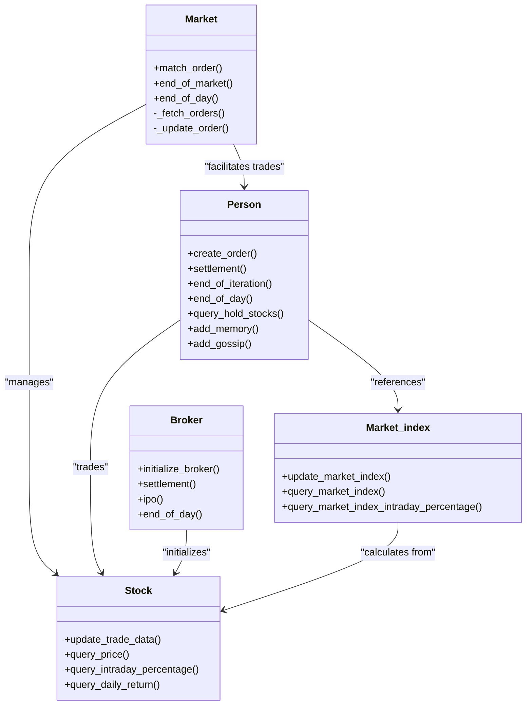
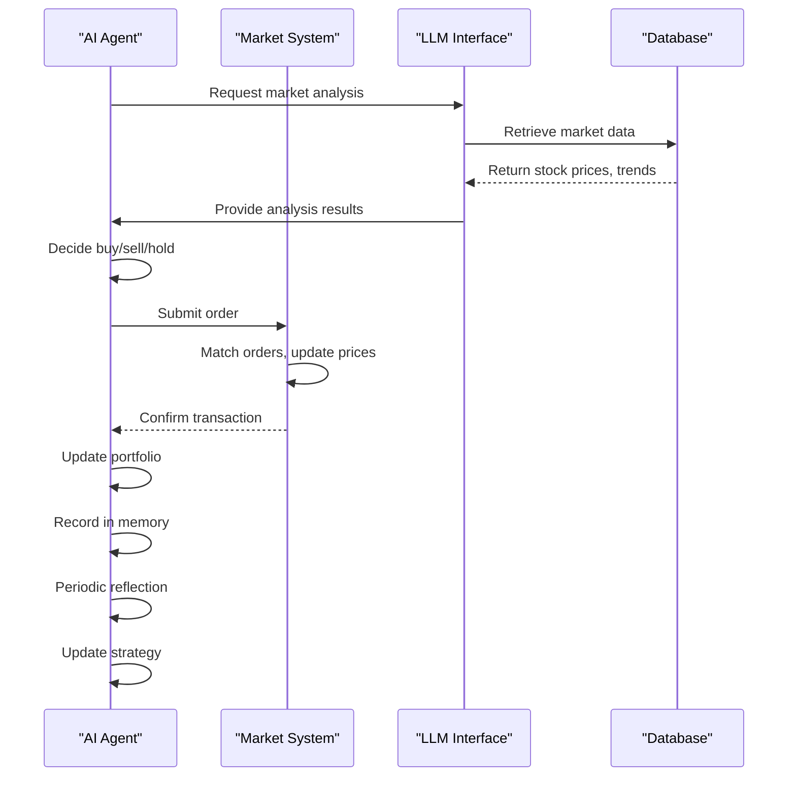
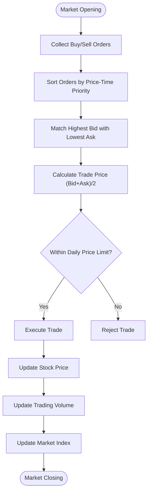
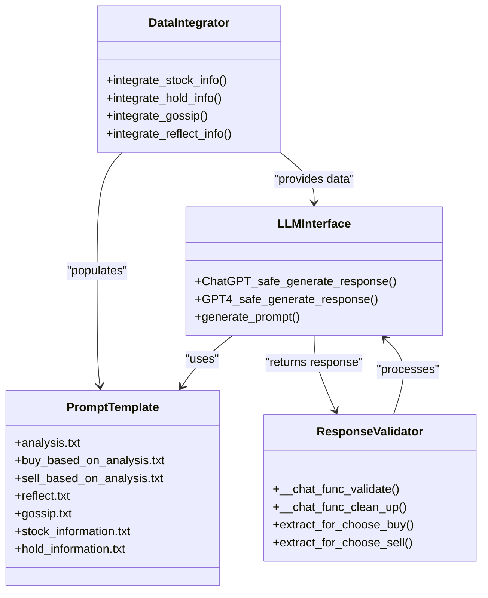

# Project Overview

<cite>
**Referenced Files in This Document**   
- [README.md](file://README.md)
- [main.py](file://Agent-Trading-Arena/Stock_Main/main.py)
- [Market.py](file://Agent-Trading-Arena/Stock_Main/Market.py)
- [Person.py](file://Agent-Trading-Arena/Stock_Main/Person.py)
- [Stock.py](file://Agent-Trading-Arena/Stock_Main/Stock.py)
- [behavior.py](file://Agent-Trading-Arena/Stock_Main/behavior.py)
- [our_run_gpt_prompt.py](file://Agent-Trading-Arena/Stock_Main/content/our_run_gpt_prompt.py)
- [gpt_structure.py](file://Agent-Trading-Arena/Stock_Main/content/gpt_structure.py)
- [requirement.txt](file://requirement.txt)
</cite>

## Table of Contents
1. [Introduction](#introduction)
2. [Core Concept and Research Significance](#core-concept-and-research-significance)
3. [System Architecture](#system-architecture)
4. [Agent Behavior and Decision-Making](#agent-behavior-and-decision-making)
5. [Market Dynamics](#market-dynamics)
6. [LLM Integration and Prompt Engineering](#llm-integration-and-prompt-engineering)
7. [Setup and Usage](#setup-and-usage)
8. [Research Applications and Extensions](#research-applications-and-extensions)
9. [Conclusion](#conclusion)

## Introduction

The Agent Trading Arena is a closed-loop, prior-free simulation environment designed to evaluate and advance self-play-capable financial agents based on Large Language Models (LLMs). This project creates a human-like trading environment where AI agents make investment decisions, reflect on their performance, and share information through gossip mechanisms. The system enables researchers to study numerical understanding and decision-making capabilities in LLM-based agents within a realistic financial market context.

The simulation features multiple AI agents that interact with a dynamic market, make buy/sell/hold decisions based on market analysis, and adapt their strategies through reflection. Agents maintain portfolios, experience financial gains and losses, pay daily expenses, and adjust their investment principles based on performance evaluation. The environment supports complex interactions between agents and market dynamics, creating a rich testbed for evaluating LLM capabilities in financial reasoning.

**Section sources**
- [README.md](file://README.md#L1-L52)
- [main.py](file://Agent-Trading-Arena/Stock_Main/main.py#L1-L136)

## Core Concept and Research Significance

The Agent Trading Arena represents a novel approach to evaluating LLM-based financial agents through a self-contained simulation environment. At its core, the system creates a closed-loop ecosystem where AI agents function as autonomous traders with distinct personalities, financial constraints, and investment strategies. These agents operate in a simulated stock market, making trading decisions based on market conditions, portfolio status, and information shared through social interactions.

The research significance lies in its ability to systematically study numerical understanding and decision-making in LLM agents. Unlike traditional financial simulations, this environment specifically evaluates how well LLMs comprehend and reason with numerical data in the context of investment decisions. The agents must interpret stock prices, calculate potential returns, assess risk, and make quantitative decisions—all while adapting to changing market conditions.

A key innovation is the implementation of self-play capabilities, where multiple agents coexist and interact within the same market environment. This creates emergent behaviors as agents influence market dynamics through their collective actions. The system also incorporates reflection mechanisms that allow agents to analyze their performance, identify strengths and weaknesses, and update their investment strategies accordingly.

The gossip mechanism introduces a social dimension to the simulation, enabling agents to share insights and observations with each other. This information exchange creates a knowledge diffusion process that mimics real-world financial networks, allowing researchers to study how information spreads and influences decision-making in agent populations.

**Section sources**
- [README.md](file://README.md#L15-L17)
- [Person.py](file://Agent-Trading-Arena/Stock_Main/Person.py#L143-L629)
- [behavior.py](file://Agent-Trading-Arena/Stock_Main/behavior.py#L149-L198)

## System Architecture

The Agent Trading Arena follows a modular architecture with clearly defined components that interact to create the simulation environment. The system consists of agents (traders), market infrastructure, stock entities, and LLM integration layers that work together to simulate financial trading activities.



**Diagram sources**
- [Market.py](file://Agent-Trading-Arena/Stock_Main/Market.py#L12-L278)
- [Stock.py](file://Agent-Trading-Arena/Stock_Main/Stock.py#L14-L307)
- [Person.py](file://Agent-Trading-Arena/Stock_Main/Person.py#L143-L629)

The architecture follows an event-driven simulation model where time progresses in discrete iterations representing trading periods. Each iteration follows a sequence: agents analyze the market, submit orders, the market matches orders and updates prices, agents settle transactions, and then reflect on their performance. This cycle repeats for multiple days, creating a longitudinal study of agent behavior and adaptation.

The system uses SQLite databases to persistently store market data, agent portfolios, transaction histories, and memory records. This allows for detailed analysis of agent behavior over time and enables the simulation to be paused and resumed. The database schema includes tables for active orders, stock prices, agent accounts, memory records, and gossip exchanges, providing a comprehensive record of all simulation activities.

**Section sources**
- [main.py](file://Agent-Trading-Arena/Stock_Main/main.py#L51-L136)
- [Market.py](file://Agent-Trading-Arena/Stock_Main/Market.py#L12-L278)
- [database_utils.py](file://Agent-Trading-Arena/Stock_Main/database_utils.py#L245-L322)

## Agent Behavior and Decision-Making

The AI agents in the Agent Trading Arena exhibit sophisticated decision-making behaviors that simulate human-like trading activities. Each agent operates as an autonomous entity with financial resources, investment goals, and personal constraints. The agents follow a structured decision-making process that involves market analysis, trade execution, performance reflection, and strategy adaptation.

Agents make trading decisions based on multiple factors including current market conditions, their portfolio status, financial needs, and information gathered from other agents. The decision process begins with market analysis, where agents evaluate stock performance, market trends, and economic indicators. Based on this analysis, agents decide whether to buy, sell, or hold stocks, specifying both the quantity and target price for transactions.

A distinctive feature of the agents is their ability to reflect on their performance and adapt their strategies. After a series of trading iterations, agents conduct self-reflection to identify strengths and weaknesses in their decision-making. This reflection process analyzes past trades, assesses financial outcomes, and evaluates the effectiveness of their investment principles. Based on this analysis, agents update their investment strategies to improve future performance.



**Diagram sources**
- [behavior.py](file://Agent-Trading-Arena/Stock_Main/behavior.py#L82-L171)
- [Person.py](file://Agent-Trading-Arena/Stock_Main/Person.py#L212-L249)
- [our_run_gpt_prompt.py](file://Agent-Trading-Arena/Stock_Main/content/our_run_gpt_prompt.py#L486-L619)

The agents also participate in information sharing through a gossip mechanism. After trading periods, agents generate and exchange insights about market conditions, successful strategies, and observed patterns. This social interaction creates a knowledge network where information diffuses across the agent population, influencing collective behavior and market dynamics. The gossip system simulates how financial information spreads in real markets through informal networks.

Financial management is another critical aspect of agent behavior. Agents must balance investment activities with daily living expenses, which are deducted from their cash reserves. This constraint forces agents to maintain liquidity and consider risk management in their trading decisions. The expense ratio parameter determines the proportion of wealth allocated to daily expenses, creating pressure to generate returns while preserving capital.

**Section sources**
- [Person.py](file://Agent-Trading-Arena/Stock_Main/Person.py#L143-L629)
- [behavior.py](file://Agent-Trading-Arena/Stock_Main/behavior.py#L82-L210)
- [our_run_gpt_prompt.py](file://Agent-Trading-Arena/Stock_Main/content/our_run_gpt_prompt.py#L1-L628)

## Market Dynamics

The market system in the Agent Trading Arena simulates realistic financial market dynamics through a combination of supply-demand mechanics, price discovery algorithms, and market index calculations. The market operates as a central exchange where buy and sell orders are matched, prices are updated based on trading activity, and market indicators are calculated to reflect overall economic conditions.

The price discovery mechanism follows a continuous double auction model where buy orders are matched with sell orders based on price-time priority. Buy orders are sorted in descending order of bid price, while sell orders are sorted in ascending order of ask price. The market matches the highest bid with the lowest ask, executing trades at a price that splits the difference between the bid and ask. This mechanism creates realistic price formation dynamics that respond to supply and demand imbalances.

Price volatility is controlled through several parameters that prevent extreme fluctuations. The Daily_Price_Limit parameter restricts how much a stock's price can change within a single trading period, preventing unrealistic swings. The Fluctuation_Constant parameter smooths price changes by weighting new trade prices against the existing price based on trading volume. This creates momentum effects where prices gradually adjust to new information rather than jumping abruptly.



**Diagram sources**
- [Market.py](file://Agent-Trading-Arena/Stock_Main/Market.py#L96-L193)
- [Stock.py](file://Agent-Trading-Arena/Stock_Main/Stock.py#L67-L112)
- [main.py](file://Agent-Trading-Arena/Stock_Main/main.py#L102-L110)

The market index provides a macroeconomic indicator that reflects the overall health of the simulated economy. Calculated as a weighted average of all stock prices, the market index gives agents a benchmark for assessing market conditions. The weighting is based on the book value of each stock, creating a capitalization-weighted index similar to real-world indices like the S&P 500. Agents use changes in the market index to inform their investment decisions and risk assessments.

Market sessions follow a structured timeline with multiple trading iterations per day. At the beginning of each trading day, the broker conducts an IPO (Initial Public Offering) to list stocks for trading. Throughout the day, agents submit orders in multiple iterations, allowing for dynamic price discovery and strategic adjustments. At the end of each day, the market settles all transactions, updates agent portfolios, and prepares for the next trading session.

**Section sources**
- [Market.py](file://Agent-Trading-Arena/Stock_Main/Market.py#L12-L278)
- [Stock.py](file://Agent-Trading-Arena/Stock_Main/Stock.py#L212-L295)
- [main.py](file://Agent-Trading-Arena/Stock_Main/main.py#L95-L131)

## LLM Integration and Prompt Engineering

The Agent Trading Arena integrates Large Language Models through a sophisticated prompt engineering framework that enables natural language interaction between the simulation environment and the LLM. This integration allows agents to process complex financial information, generate trading decisions, and articulate investment rationales using natural language reasoning.

The system uses a template-based prompt engineering approach where structured data from the simulation is injected into predefined prompt templates. These templates guide the LLM to produce responses in specific formats that can be easily parsed and executed by the system. For example, buy order prompts require the LLM to specify the stock name, investment amount, and target price in a standardized format that the system can extract and validate.



**Diagram sources**
- [our_run_gpt_prompt.py](file://Agent-Trading-Arena/Stock_Main/content/our_run_gpt_prompt.py#L1-L628)
- [gpt_structure.py](file://Agent-Trading-Arena/Stock_Main/content/gpt_structure.py#L1-L380)
- [content/our_prompt_template/](file://Agent-Trading-Arena/Stock_Main/content/our_prompt_template/)

The prompt engineering framework includes several specialized templates for different cognitive tasks:
- **Market analysis prompts** that provide agents with current stock prices, market trends, and portfolio information to generate investment insights
- **Trading decision prompts** that elicit specific buy/sell/hold actions with precise parameters
- **Reflection prompts** that guide agents to evaluate their performance and identify areas for improvement
- **Gossip generation prompts** that encourage agents to share market observations and investment ideas

To ensure reliable integration, the system implements robust response validation and error handling. Each LLM response is validated against expected formats using regular expressions and semantic checks. If a response fails validation, the system can retry the request or apply fallback behaviors. The ChatGPT_safe_generate_response function implements retry logic with multiple attempts, ensuring reliable operation even when the LLM service experiences temporary issues.

The integration also includes debugging and logging capabilities that save all generated prompts and LLM responses to disk. This feature, enabled through the Save_Path parameter, allows researchers to analyze the decision-making process of agents, trace the evolution of investment strategies, and debug issues in the prompt engineering framework.

**Section sources**
- [our_run_gpt_prompt.py](file://Agent-Trading-Arena/Stock_Main/content/our_run_gpt_prompt.py#L1-L628)
- [gpt_structure.py](file://Agent-Trading-Arena/Stock_Main/content/gpt_structure.py#L1-L380)
- [content/our_prompt_template/](file://Agent-Trading-Arena/Stock_Main/content/our_prompt_template/)

## Setup and Usage

Setting up and running the Agent Trading Arena requires several straightforward steps. The system is designed to be accessible to researchers and developers with basic Python programming skills.

### Installation and Configuration

To install the Agent Trading Arena, clone the repository and install the required dependencies:

```bash
git clone https://github.com/wekjsdvnm/Agent-Trading-Arena
cd Agent-Trading-Arena
pip install -r requirement.txt
```

The system requires an OpenAI API key for LLM integration. Set your API key in the configuration file:

```bash
cd Agent-Trading-Arena/Stock_Main/content/utils.py
openai_api_key = "your_OpenAI_API_key"
```

Replace "your_OpenAI_API_key" with your actual OpenAI API key obtained from the OpenAI platform.

### Running Simulations

Execute the simulation using the provided run script:

```bash
cd Agent-Trading-Arena
sh run.sh
```

The simulation accepts several command-line arguments to customize the environment:
- `--Iterations_Daily`: Number of trading iterations per day (default: 3)
- `--No_Days`: Number of trading days to simulate (default: 3)
- `--Num_Person`: Number of agents in the simulation (default: 9)
- `--Num_Stock`: Number of stocks available for trading (default: 3)
- `--SAVE_NAME`: Name of the save folder for simulation results (default: 'sim01')

### Configuration Parameters

Key parameters that control market behavior include:
- `Daily_Price_Limit`: Maximum percentage change allowed in stock prices per trading period (default: 0.7)
- `expense_ratio`: Proportion of wealth allocated to daily expenses (default: 0.03)
- `Fluctuation_Constant`: Smoothing factor for price changes (default: 20.0)
- `analysis_num`: Number of agents performing market analysis per iteration (default: 3)
- `gossip_num_max`: Maximum number of gossip items shared per round (default: 3)

**Section sources**
- [README.md](file://README.md#L18-L42)
- [main.py](file://Agent-Trading-Arena/Stock_Main/main.py#L16-L38)
- [requirement.txt](file://requirement.txt#L1-L8)

## Research Applications and Extensions

The Agent Trading Arena serves as a versatile platform for multiple research applications in artificial intelligence, behavioral economics, and financial technology. Its primary application is in evaluating the numerical reasoning and decision-making capabilities of Large Language Models in complex, dynamic environments.

Researchers can use the platform to study various aspects of LLM behavior, including:
- **Numerical understanding**: How well LLMs comprehend and reason with quantitative financial data
- **Strategic adaptation**: How agents modify their investment strategies based on performance feedback
- **Risk assessment**: How agents balance potential returns against financial risks and constraints
- **Information processing**: How agents integrate multiple data sources (market data, portfolio status, gossip) to make decisions
- **Social learning**: How information diffusion through gossip mechanisms influences collective behavior

The system can be extended in several directions to support additional research questions:
- **Multi-modal integration**: Incorporating visual data such as stock charts and economic indicators
- **Alternative market structures**: Implementing different trading mechanisms like limit order books or dark pools
- **Behavioral economics models**: Integrating cognitive biases and heuristics into agent decision-making
- **Regulatory frameworks**: Simulating market regulations, taxes, and compliance requirements
- **Cross-domain applications**: Adapting the framework for other domains like supply chain management or energy trading

Potential extensions include:
- Adding more sophisticated financial instruments (options, futures, bonds)
- Implementing machine learning models for price prediction
- Creating heterogeneous agent populations with different risk profiles
- Integrating real-world financial data feeds
- Developing visualization tools for analyzing agent behavior patterns

The platform's modular architecture makes it relatively straightforward to implement these extensions while maintaining the core simulation framework.

**Section sources**
- [README.md](file://README.md#L1-L52)
- [main.py](file://Agent-Trading-Arena/Stock_Main/main.py#L1-L136)
- [behavior.py](file://Agent-Trading-Arena/Stock_Main/behavior.py#L1-L210)

## Conclusion

The Agent Trading Arena represents a significant contribution to the evaluation of LLM-based financial agents through its comprehensive simulation environment. By creating a closed-loop system where AI agents engage in realistic trading activities, reflect on their performance, and share information through gossip mechanisms, the platform provides valuable insights into the numerical understanding and decision-making capabilities of large language models.

The system's architecture effectively integrates multiple components—agents, market dynamics, and LLM interfaces—into a cohesive framework that simulates complex financial behaviors. The modular design allows researchers to study specific aspects of agent behavior while maintaining a realistic market context. The combination of quantitative constraints, strategic decision-making, and social interactions creates a rich environment for evaluating AI capabilities in financial reasoning.

As LLMs continue to advance, platforms like the Agent Trading Arena will play a crucial role in assessing their practical applications in high-stakes domains like finance. The insights gained from this research can inform the development of more reliable, transparent, and effective AI systems for financial decision-making, while also contributing to our understanding of artificial general intelligence in complex, dynamic environments.

**Section sources**
- [README.md](file://README.md#L1-L52)
- [main.py](file://Agent-Trading-Arena/Stock_Main/main.py#L1-L136)