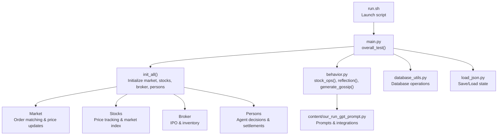
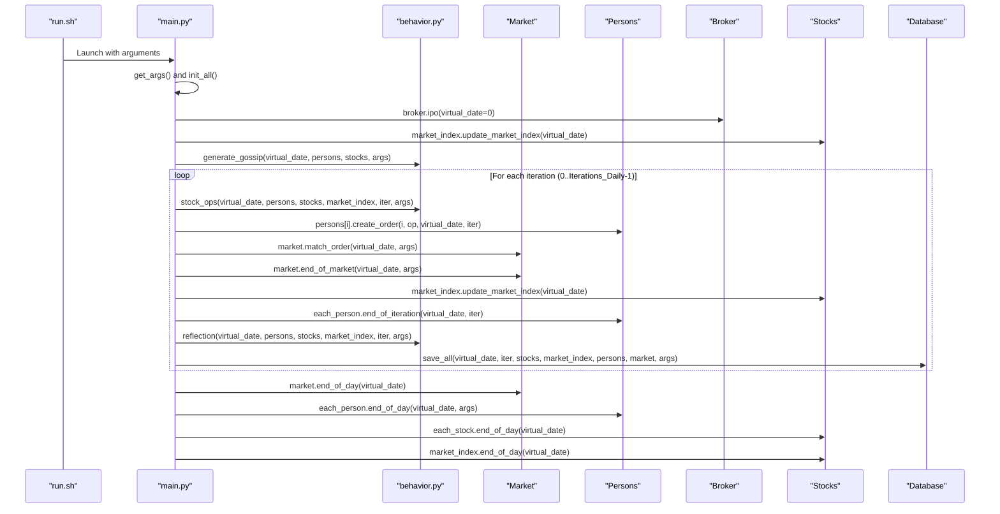
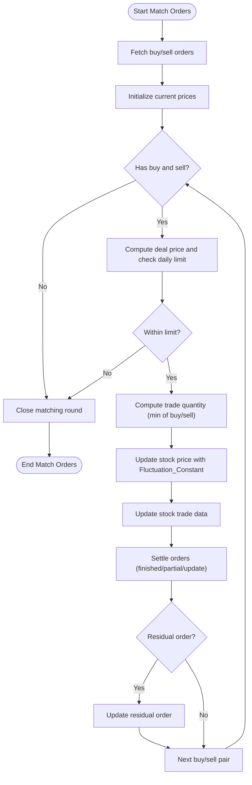
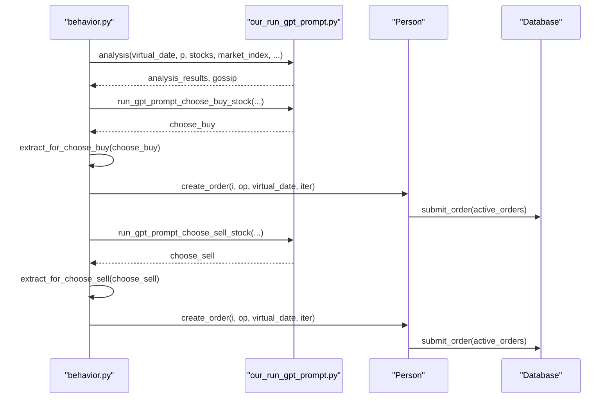
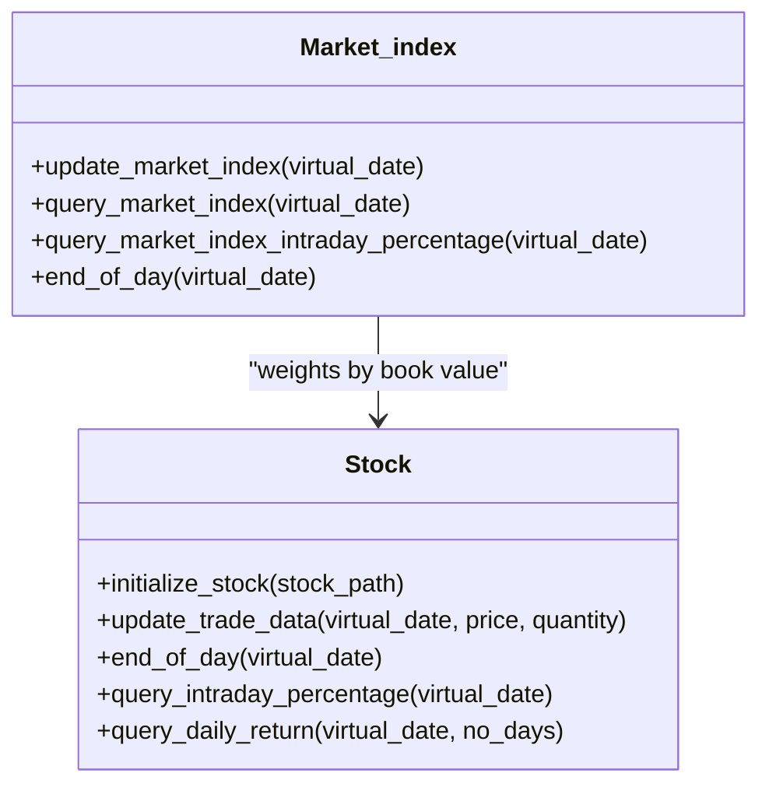
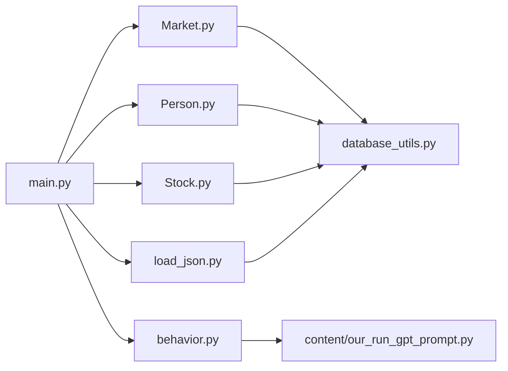

# Simulation Workflow

<cite>
**Referenced Files in This Document**
- [run.sh](file://run.sh)
- [main.py](file://Agent-Trading-Arena/Stock_Main/main.py)
- [behavior.py](file://Agent-Trading-Arena/Stock_Main/behavior.py)
- [Market.py](file://Agent-Trading-Arena/Stock_Main/Market.py)
- [Person.py](file://Agent-Trading-Arena/Stock_Main/Person.py)
- [Stock.py](file://Agent-Trading-Arena/Stock_Main/Stock.py)
- [database_utils.py](file://Agent-Trading-Arena/Stock_Main/database_utils.py)
- [load_json.py](file://Agent-Trading-Arena/Stock_Main/load_json.py)
- [our_run_gpt_prompt.py](file://Agent-Trading-Arena/Stock_Main/content/our_run_gpt_prompt.py)
- [README.md](file://README.md)
</cite>

## Table of Contents
1. [Introduction](#introduction)
2. [Project Structure](#project-structure)
3. [Core Components](#core-components)
4. [Architecture Overview](#architecture-overview)
5. [Detailed Component Analysis](#detailed-component-analysis)
6. [Dependency Analysis](#dependency-analysis)
7. [Performance Considerations](#performance-considerations)
8. [Troubleshooting Guide](#troubleshooting-guide)
9. [Conclusion](#conclusion)

## Introduction
This document explains the complete simulation workflow from launching the run script to the termination of the simulation. It focuses on the daily cycle: market initialization, IPO processing, multiple trading iterations, gossip generation, and reflection phases. The control flow is centered around the overall_test function in main.py, which orchestrates the daily and iterative steps, including market analysis, agent decision-making, order execution, price updates, and performance evaluation. Timing considerations and virtual date progression are documented, along with a timeline diagram and common workflow issues and their debugging strategies.

## Project Structure
The simulation is organized around a main driver script and a set of core modules:
- Shell script to launch the simulation with configurable parameters
- Main orchestration module that defines the daily and iterative control flow
- Market engine for order matching and price updates
- Agent model for decision-making and financial accounting
- Stock model for price tracking and market index computation
- Behavior module for GPT-driven analysis, gossip, and reflection
- Database utilities for persistence and query parsing
- JSON loading/saving for state serialization
- Content prompts for GPT-based reasoning

**Diagram sources**
- [run.sh](file://run.sh#L1-L24)
- [main.py](file://Agent-Trading-Arena/Stock_Main/main.py#L84-L136)
- [behavior.py](file://Agent-Trading-Arena/Stock_Main/behavior.py#L82-L210)
- [Market.py](file://Agent-Trading-Arena/Stock_Main/Market.py#L12-L278)
- [Person.py](file://Agent-Trading-Arena/Stock_Main/Person.py#L18-L629)
- [Stock.py](file://Agent-Trading-Arena/Stock_Main/Stock.py#L14-L307)
- [database_utils.py](file://Agent-Trading-Arena/Stock_Main/database_utils.py#L245-L322)
- [load_json.py](file://Agent-Trading-Arena/Stock_Main/load_json.py#L45-L122)
- [our_run_gpt_prompt.py](file://Agent-Trading-Arena/Stock_Main/content/our_run_gpt_prompt.py#L1-L200)

**Section sources**
- [run.sh](file://run.sh#L1-L24)
- [README.md](file://README.md#L34-L41)

## Core Components
- overall_test: Orchestrates the simulation loop across virtual days and iterations, invoking IPO, market index updates, gossip generation, trading iterations, order matching, price updates, reflection, and saving.
- Market: Manages order matching, price updates, and end-of-day/closing procedures with constraints on daily price limits and broker inventory.
- Person/Broker: Implements agent decision-making, order submission, financial settlements, and daily/end-of-iteration updates.
- Stock/Market_index: Tracks intraday and daily prices, computes market index, and maintains end-of-day snapshots.
- behavior: Drives GPT-based analysis, decision extraction, gossip generation, and reflection cycles.
- database_utils: Provides database schema creation, SQL execution, and parsing utilities for orders, accounts, persons, memory, and gossip.
- load_json: Serializes and deserializes simulation state for checkpointing and resuming.

**Section sources**
- [main.py](file://Agent-Trading-Arena/Stock_Main/main.py#L84-L136)
- [Market.py](file://Agent-Trading-Arena/Stock_Main/Market.py#L12-L278)
- [Person.py](file://Agent-Trading-Arena/Stock_Main/Person.py#L18-L629)
- [Stock.py](file://Agent-Trading-Arena/Stock_Main/Stock.py#L14-L307)
- [behavior.py](file://Agent-Trading-Arena/Stock_Main/behavior.py#L82-L210)
- [database_utils.py](file://Agent-Trading-Arena/Stock_Main/database_utils.py#L245-L322)
- [load_json.py](file://Agent-Trading-Arena/Stock_Main/load_json.py#L45-L122)

## Architecture Overview
The simulation follows a structured daily cycle controlled by the overall_test function. Each day begins with IPO processing (on day 0), followed by market index updates and gossip generation. Within each day, multiple trading iterations occur, each driven by agent decisions, order submissions, matching, price updates, and reflection. At the end of each day, the market closes, agents settle, stocks finalize, and the market index ends the day.

**Diagram sources**
- [run.sh](file://run.sh#L1-L24)
- [main.py](file://Agent-Trading-Arena/Stock_Main/main.py#L84-L136)
- [behavior.py](file://Agent-Trading-Arena/Stock_Main/behavior.py#L82-L210)
- [Market.py](file://Agent-Trading-Arena/Stock_Main/Market.py#L21-L278)
- [Person.py](file://Agent-Trading-Arena/Stock_Main/Person.py#L364-L428)
- [Stock.py](file://Agent-Trading-Arena/Stock_Main/Stock.py#L52-L66)
- [database_utils.py](file://Agent-Trading-Arena/Stock_Main/database_utils.py#L45-L77)

## Detailed Component Analysis

### Daily Cycle Control Flow
The daily cycle is orchestrated by overall_test:
- Day 0: IPO processing via broker.ipo
- Market index update and gossip generation
- Iterative trading loop controlled by Iterations_Daily parameter
- End-of-day procedures for market, persons, stocks, and market index

Key operations within each iteration:
- Market index update
- GPT-driven stock_ops to produce buy/sell decisions
- Randomized agent order submission
- Order matching and end-of-market price updates
- Individual agent end-of-iteration updates
- Reflection phase based on reflect_frequency
- Periodic saving of state

Timing and virtual dates:
- Virtual date increments per day
- Iteration increments within a day
- Market index and stock intraday price lists are maintained per day

**Section sources**
- [main.py](file://Agent-Trading-Arena/Stock_Main/main.py#L95-L131)

### Market Engine: Order Matching and Price Updates
The Market class manages:
- Order fetching and sorting by price and timestamp
- Continuous matching until price change exceeds Daily_Price_Limit
- Price update using a weighted formula incorporating Fluctuation_Constant
- Settlement for both traders and broker
- End-of-day closure of active orders

Constraints:
- Daily price change limit prevents extreme moves
- Broker inventory limits fill-or-partial fulfillment
- Orders are partially fulfilled when inventory is insufficient

**Diagram sources**
- [Market.py](file://Agent-Trading-Arena/Stock_Main/Market.py#L96-L199)

**Section sources**
- [Market.py](file://Agent-Trading-Arena/Stock_Main/Market.py#L30-L95)
- [Market.py](file://Agent-Trading-Arena/Stock_Main/Market.py#L96-L199)

### Agent Decision-Making and Execution
Agents use GPT prompts to decide buy/sell actions:
- analysis integrates stock info, market index, gossip, and holdings
- run_gpt_prompt_choose_buy_stock and run_gpt_prompt_choose_sell_stock generate decisions
- extract_for_choose_buy and extract_for_choose_sell parse GPT outputs
- Person.create_order submits orders to the database with timestamps and iteration metadata
- Person.settlement updates cash, assets, and account holdings after order execution

Reflection and gossip:
- generate_gossip creates gossip messages stored per agent
- reflection triggers periodically based on reflect_frequency to update strategy

**Diagram sources**
- [behavior.py](file://Agent-Trading-Arena/Stock_Main/behavior.py#L82-L171)
- [our_run_gpt_prompt.py](file://Agent-Trading-Arena/Stock_Main/content/our_run_gpt_prompt.py#L1-L200)
- [Person.py](file://Agent-Trading-Arena/Stock_Main/Person.py#L212-L249)

**Section sources**
- [behavior.py](file://Agent-Trading-Arena/Stock_Main/behavior.py#L82-L171)
- [Person.py](file://Agent-Trading-Arena/Stock_Main/Person.py#L212-L249)

### Stock Tracking and Market Index
Stock maintains:
- Intraday price list and daily OHLCV updates
- End-of-day snapshot insertion
- Historical price queries and intraday percentage calculations

Market_index computes:
- Weighted index based on stock book values
- Updates index values daily and tracks intraday changes

**Diagram sources**
- [Stock.py](file://Agent-Trading-Arena/Stock_Main/Stock.py#L14-L307)

**Section sources**
- [Stock.py](file://Agent-Trading-Arena/Stock_Main/Stock.py#L67-L113)
- [Stock.py](file://Agent-Trading-Arena/Stock_Main/Stock.py#L227-L277)

### End-of-Day and End-of-Iteration Procedures
- Market.end_of_day closes all active orders
- Person.end_of_iteration updates asset and wealth based on current prices
- Person.end_of_day settles daily expenses, dividends, and prepares next-day account entries
- Stock.end_of_day resets intraday lists and inserts end-of-day OHLCV
- Market_index.end_of_day prepares next-day index snapshot

**Section sources**
- [Market.py](file://Agent-Trading-Arena/Stock_Main/Market.py#L21-L29)
- [Person.py](file://Agent-Trading-Arena/Stock_Main/Person.py#L309-L428)
- [Stock.py](file://Agent-Trading-Arena/Stock_Main/Stock.py#L52-L66)

## Dependency Analysis
The simulation relies on a tight coupling between the main controller and its subsystems:
- main.py depends on Market, Person, Stock, behavior, and load_json
- behavior.py depends on content/our_run_gpt_prompt.py for GPT prompts
- Market and Person depend on database_utils for SQL operations and parsing
- load_json serializes/deserializes Market, Stocks, Persons, and Market_index

**Diagram sources**
- [main.py](file://Agent-Trading-Arena/Stock_Main/main.py#L8-L13)
- [behavior.py](file://Agent-Trading-Arena/Stock_Main/behavior.py#L3-L11)
- [Market.py](file://Agent-Trading-Arena/Stock_Main/Market.py#L7-L9)
- [Person.py](file://Agent-Trading-Arena/Stock_Main/Person.py#L2-L16)
- [Stock.py](file://Agent-Trading-Arena/Stock_Main/Stock.py#L3-L10)
- [load_json.py](file://Agent-Trading-Arena/Stock_Main/load_json.py#L6-L7)

**Section sources**
- [main.py](file://Agent-Trading-Arena/Stock_Main/main.py#L8-L13)
- [behavior.py](file://Agent-Trading-Arena/Stock_Main/behavior.py#L3-L11)
- [database_utils.py](file://Agent-Trading-Arena/Stock_Main/database_utils.py#L245-L322)

## Performance Considerations
- Iterations_Daily controls intra-day activity; higher values increase computational load due to repeated order matching and updates.
- Daily_Price_Limit and Fluctuation_Constant influence price stability and convergence speed; tighter limits reduce extreme moves but may slow price discovery.
- Broker inventory affects partial fulfillment scenarios; ensure sufficient initial supply for desired liquidity.
- Reflection frequency impacts agent learning overhead; setting reflect_frequency to 0 disables reflection.
- Database operations are executed per iteration; consider batching or indexing strategies if scaling up.

[No sources needed since this section provides general guidance]

## Troubleshooting Guide
Common workflow issues and debugging strategies:
- Infinite loops or premature termination
  - Verify the outer loop bounds: virtual_date from 0 to No_Days-1 and inner loop from 0 to Iterations_Daily-1.
  - Ensure end_of_day procedures are reached to avoid stuck states.
  - Check that save_all is invoked to persist state and avoid inconsistent restarts.

- Excessive price volatility or no trades
  - Adjust Daily_Price_Limit to constrain price changes per iteration.
  - Tune Fluctuation_Constant to control sensitivity of price updates.
  - Review broker inventory and initial supply for adequate liquidity.

- Reflection not triggering
  - Confirm reflect_frequency is set appropriately; 0 disables reflection.
  - Ensure memory entries exist for reflection windows.

- GPT-related errors
  - Validate OpenAI API key export and prompt template integrity.
  - Inspect generated prompts saved under save_path/debug_prompts for malformed inputs.

- Database anomalies
  - Confirm schema creation and table existence before execution.
  - Check SQL execution logs for constraint violations or missing records.

**Section sources**
- [main.py](file://Agent-Trading-Arena/Stock_Main/main.py#L95-L131)
- [Market.py](file://Agent-Trading-Arena/Stock_Main/Market.py#L44-L47)
- [behavior.py](file://Agent-Trading-Arena/Stock_Main/behavior.py#L174-L199)
- [database_utils.py](file://Agent-Trading-Arena/Stock_Main/database_utils.py#L302-L310)

## Conclusion
The simulation workflow is a tightly integrated daily cycle governed by overall_test. Each day begins with IPO and gossip, followed by Iterations_Daily trading iterations that combine GPT-driven decision-making, order execution, and price updates constrained by daily limits. Agents settle at the end of each iteration and day, while stocks and the market index finalize their state. Proper configuration of parameters and robust state persistence enable reliable long-running simulations with meaningful agent learning and market dynamics.