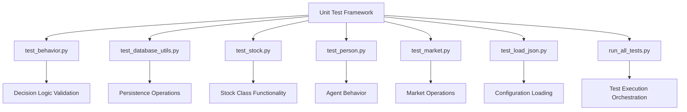
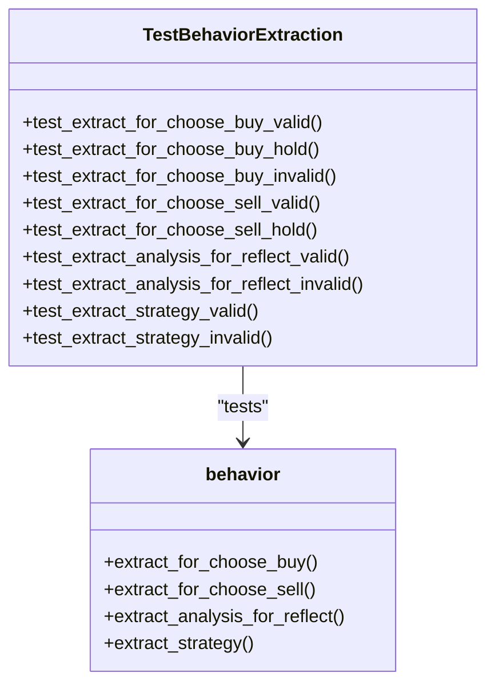
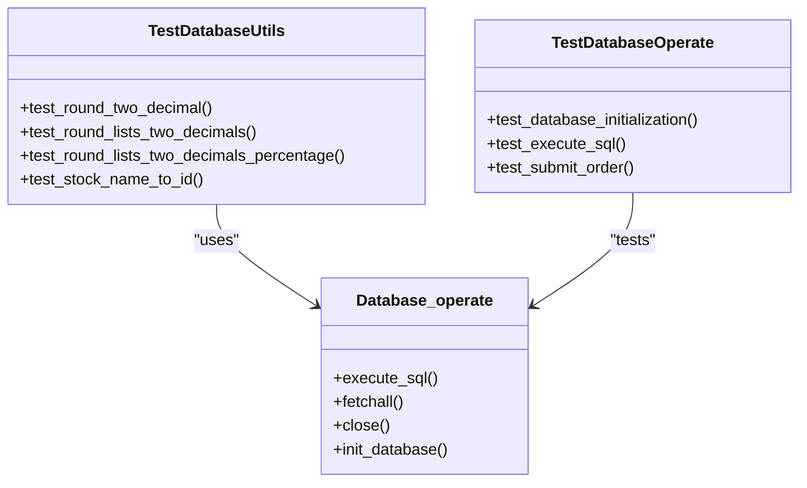
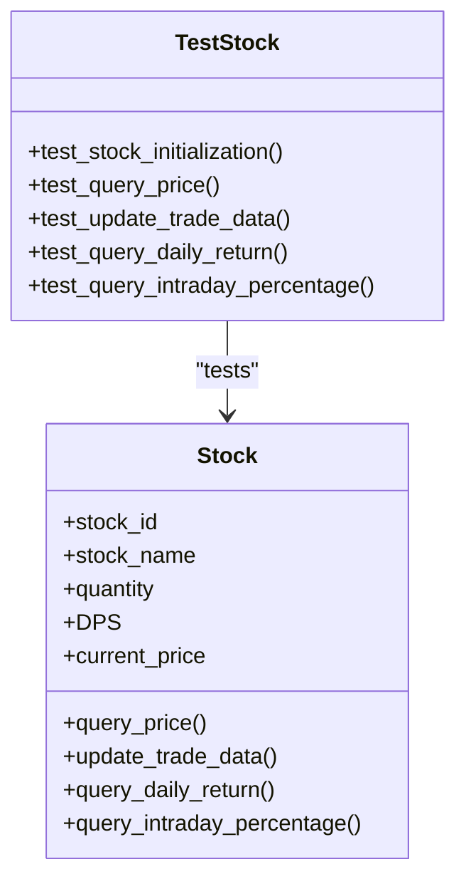
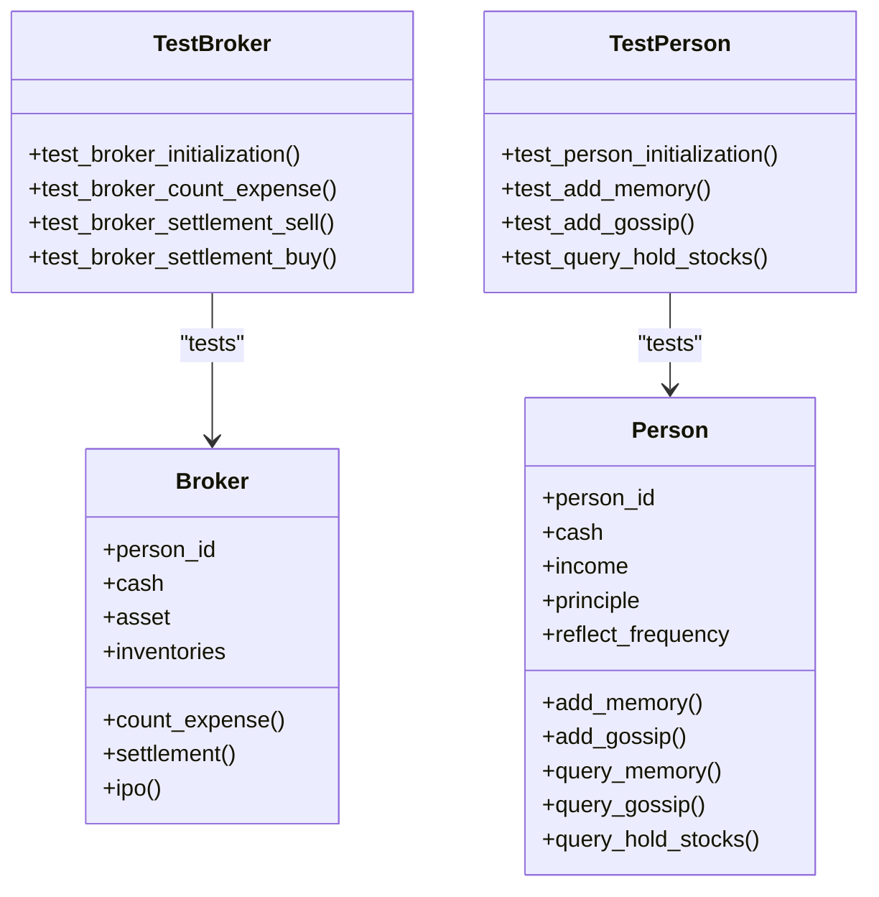
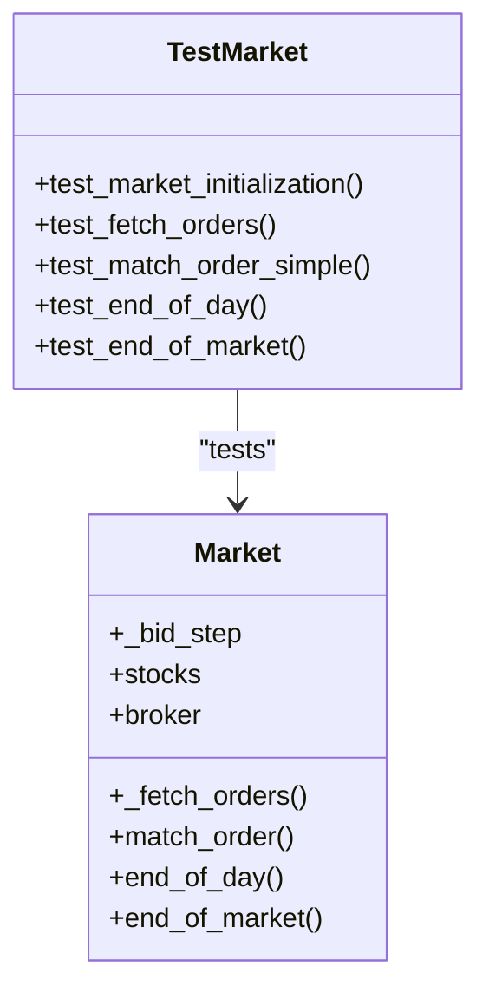
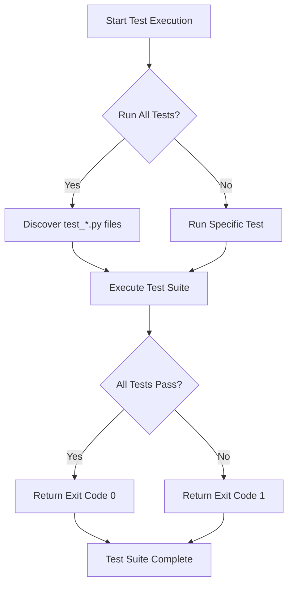
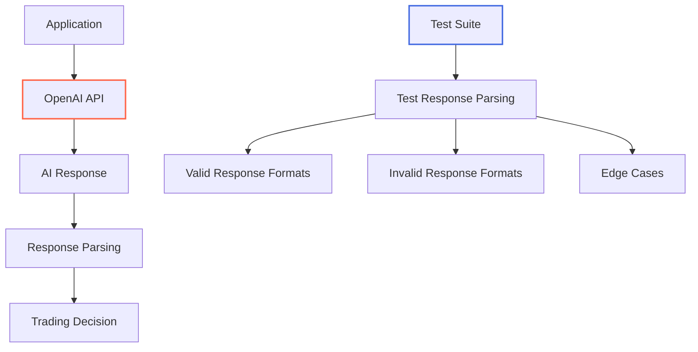

# Testing and Validation

<cite>
**Referenced Files in This Document**   
- [run_all_tests.py](file://unit_test/run_all_tests.py)
- [test_behavior.py](file://unit_test/test_behavior.py)
- [test_database_utils.py](file://unit_test/test_database_utils.py)
- [test_market.py](file://unit_test/test_market.py)
- [test_person.py](file://unit_test/test_person.py)
- [test_stock.py](file://unit_test/test_stock.py)
- [test_load_json.py](file://unit_test/test_load_json.py)
- [behavior.py](file://behavior.py)
- [database_utils.py](file://database_utils.py)
- [Market.py](file://Market.py)
- [Person.py](file://Person.py)
- [Stock.py](file://Stock.py)
- [load_json.py](file://load_json.py)
- [main.py](file://main.py)
- [gpt_structure.py](file://content/gpt_structure.py)
</cite>

## Table of Contents
1. [Introduction](#introduction)
2. [Unit Testing Framework Overview](#unit-testing-framework-overview)
3. [Test Coverage and Assertion Strategies](#test-coverage-and-assertion-strategies)
4. [Running and Interpreting Tests](#running-and-interpreting-tests)
5. [Critical Functionality Test Examples](#critical-functionality-test-examples)
6. [External Dependency Management](#external-dependency-management)
7. [Best Practices for Adding New Tests](#best-practices-for-adding-new-tests)
8. [Role of Testing in Simulation Reliability](#role-of-testing-in-simulation-reliability)

## Introduction
The Agent Trading Arena project implements a comprehensive unit testing framework to ensure the reliability and correctness of its simulation components. This documentation provides an in-depth analysis of the testing infrastructure, covering the purpose, structure, and execution of unit tests that validate the core functionality of the trading simulation system. The tests are designed to support safe refactoring while maintaining simulation integrity and reproducibility.

## Unit Testing Framework Overview

The unit testing framework is organized in the `unit_test` directory and follows Python's built-in `unittest` framework. The test suite is structured to provide comprehensive coverage of the system's core components, with specialized test files for different aspects of the simulation.

The framework includes several key test files, each focusing on specific functionality:

- **test_behavior.py**: Validates decision logic and text parsing functions that extract trading decisions from AI-generated responses
- **test_database_utils.py**: Tests persistence operations, database interactions, and utility functions for data manipulation
- **test_stock.py**: Verifies the Stock class functionality, including price queries, trade data updates, and market index calculations
- **test_person.py**: Tests the Person and Broker classes, covering agent behavior, memory management, and financial operations
- **test_market.py**: Validates market operations including order matching, end-of-day processing, and market dynamics
- **test_load_json.py**: Ensures proper loading and parsing of JSON configuration files for stocks and personas

The test framework uses temporary directories and databases to ensure isolation and prevent interference with production data. Each test class implements proper setup and teardown methods to create and clean up test fixtures, ensuring test independence and reliability.



**Diagram sources**
- [run_all_tests.py](file://unit_test/run_all_tests.py#L1-L25)
- [test_behavior.py](file://unit_test/test_behavior.py#L1-L107)
- [test_database_utils.py](file://unit_test/test_database_utils.py#L1-L134)
- [test_stock.py](file://unit_test/test_stock.py#L1-L153)
- [test_person.py](file://unit_test/test_person.py#L1-L205)
- [test_market.py](file://unit_test/test_market.py#L1-L149)
- [test_load_json.py](file://unit_test/test_load_json.py#L1-L95)

**Section sources**
- [unit_test/README.md](file://unit_test/README.md#L1-L119)

## Test Coverage and Assertion Strategies

The test suite provides comprehensive coverage of the system's critical functionality through targeted assertion strategies that validate both success and failure scenarios.

### Decision Logic Validation
The `test_behavior.py` file contains tests for the decision extraction functions that parse AI-generated trading decisions. These tests validate the parsing of buy and sell orders, reflection analysis, and strategy updates. The assertion strategy includes:

- Valid input parsing with exact value matching
- Edge case handling (e.g., "hold" decisions)
- Invalid input handling with boolean false returns
- String pattern matching for structured responses



**Diagram sources**
- [test_behavior.py](file://unit_test/test_behavior.py#L17-L107)
- [behavior.py](file://behavior.py#L15-L79)

### Persistence Operations Validation
The `test_database_utils.py` file validates database operations and utility functions with a focus on data integrity and transactional consistency. The assertion strategy includes:

- Precision validation for financial calculations (two decimal places)
- List transformation verification with percentage conversion
- Database initialization and connection validation
- SQL execution and result verification
- Order submission and persistence validation



**Diagram sources**
- [test_database_utils.py](file://unit_test/test_database_utils.py#L20-L134)
- [database_utils.py](file://database_utils.py#L138-L322)

### Component-Specific Testing
The class-specific test files (`test_stock.py`, `test_person.py`, `test_market.py`) implement targeted validation for each core component:

#### Stock Class Testing


**Diagram sources**
- [test_stock.py](file://unit_test/test_stock.py#L16-L153)
- [Stock.py](file://Stock.py)

#### Person and Broker Class Testing


**Diagram sources**
- [test_person.py](file://unit_test/test_person.py#L17-L205)
- [Person.py](file://Person.py)

#### Market Class Testing


**Diagram sources**
- [test_market.py](file://unit_test/test_market.py#L25-L149)
- [Market.py](file://Market.py)

**Section sources**
- [test_stock.py](file://unit_test/test_stock.py#L16-L153)
- [test_person.py](file://unit_test/test_person.py#L17-L205)
- [test_market.py](file://unit_test/test_market.py#L25-L149)

## Running and Interpreting Tests

The test suite can be executed using multiple methods, with the primary approach being the `run_all_tests.py` script that discovers and runs all test files matching the pattern `test_*.py`.

### Test Execution Methods
The framework supports both the built-in `unittest` framework and `pytest` for test execution:

```bash
# Using the dedicated test runner
python unit_test/run_all_tests.py

# Using unittest module
python -m unittest unit_test/run_all_tests.py

# Using pytest (recommended for better output)
python -m pytest unit_test/
```

### Running Specific Tests
The framework allows granular test execution for targeted validation:

```bash
# Run a specific test file
python -m pytest unit_test/test_stock.py -v

# Run a specific test class
python -m pytest unit_test/test_stock.py::TestStock -v

# Run a specific test method
python -m pytest unit_test/test_stock.py::TestStock::test_stock_initialization -v
```

### Test Result Interpretation
Test results provide detailed feedback on execution status:

- **Success**: All assertions pass, indicated by dots (.) in unittest or green output in pytest
- **Failure**: Assertions fail, with detailed error messages showing expected vs. actual values
- **Errors**: Exceptions occur during test execution, indicating potential implementation issues
- **Skipped**: Tests explicitly skipped, typically for incomplete functionality

The `run_all_tests.py` script returns an exit code of 0 for success and 1 for failure, making it suitable for integration into continuous integration pipelines.



**Diagram sources**
- [run_all_tests.py](file://unit_test/run_all_tests.py#L10-L25)
- [unit_test/README.md](file://unit_test/README.md#L61-L70)

**Section sources**
- [run_all_tests.py](file://unit_test/run_all_tests.py#L1-L25)
- [unit_test/README.md](file://unit_test/README.md#L61-L85)

## Critical Functionality Test Examples

The test suite includes specific test cases that validate critical functionality essential to the simulation's integrity.

### Order Matching Validation
The `test_match_order_simple` test in `test_market.py` verifies the core order matching functionality:

```python
def test_match_order_simple(self):
    """Test simple order matching"""
    market = Market(self.broker, self.persons, self.stocks, self.db)
    
    # Broker needs to IPO first to have inventory
    self.broker.ipo(0)
    
    # Submit matching buy order from person
    submit_order(self.db, "buy", 0, 0, 0, 0, 105.0, 10)
    
    initial_price = self.stocks[0].current_price
    
    # Match orders
    market.match_order(0, self.args)
    
    # Price should have changed
    self.assertNotEqual(self.stocks[0].current_price, initial_price)
```

This test validates that:
1. The broker has inventory after IPO
2. A buy order is properly submitted to the database
3. The market matching process executes successfully
4. The stock price changes as a result of the transaction

### Reflection Update Validation
The `test_add_memory` test in `test_person.py` verifies the reflection update functionality:

```python
def test_add_memory(self):
    """Test adding memory to person"""
    person = Person(0, self.broker, self.stocks, self.db, self.persona_path)
    
    # Need a market index for add_memory
    from Stock import Market_index
    market_index = Market_index(self.stocks, self.db)
    market_index.update_market_index(0)
    
    person.add_memory(
        virtual_date=0,
        iteration=0,
        stock_op="buy 10 shares of A",
        type="buy",
        gossip="Market is bullish",
        analysis_stocks="Stock A looks promising",
        analysis_strategy="None",
        market_index=market_index,
        stocks_list=self.stocks
    )
    
    memory = person.query_memory(0)
    self.assertIsNotNone(memory)
    self.assertGreater(len(memory), 0)
```

This test ensures that:
1. Memory entries are properly created with all required fields
2. The memory is persisted and can be retrieved
3. The reflection data structure maintains integrity
4. The temporal aspects (virtual_date, iteration) are correctly recorded

**Section sources**
- [test_market.py](file://unit_test/test_market.py#L95-L112)
- [test_person.py](file://unit_test/test_person.py#L160-L184)

## External Dependency Management

The testing framework addresses external dependencies, particularly the OpenAI API, through isolation and configuration strategies.

### OpenAI API Integration
The system integrates with the OpenAI API through the `gpt_structure.py` and `our_run_gpt_prompt.py` modules in the `content` directory. The main application components that use AI-generated decisions include:

- `behavior.py`: Contains functions that call AI prompts for trading decisions
- `gpt_structure.py`: Implements the OpenAI API client with configuration for API key and model
- `utils.py`: Manages environment variables for API key configuration

```python
# Example from gpt_structure.py
import openai
from openai import OpenAI

openai.api_key = openai_api_key

def run_gpt_prompt(prompt, openai_model):
    client = OpenAI(api_key=openai_api_key)
    completion = client.chat.completions.create(
        model=openai_model,
        messages=[{"role": "user", "content": prompt}]
    )
    return completion.choices[0].message.content
```

### Testing Strategy for External Dependencies
The unit tests do not directly test the OpenAI API integration but focus on the parsing and processing of AI-generated responses. This approach provides several benefits:

1. **Test Isolation**: Tests are not dependent on external service availability
2. **Deterministic Results**: Tests use predefined response strings rather than live API calls
3. **Performance**: Tests execute quickly without network latency
4. **Reliability**: Tests are not affected by API rate limits or service interruptions

The framework assumes that the AI response format is consistent and focuses on validating the extraction logic rather than the AI content generation itself. This separation of concerns allows the team to test the system's decision processing independently of the AI provider.



**Diagram sources**
- [gpt_structure.py](file://content/gpt_structure.py#L2-L94)
- [behavior.py](file://behavior.py#L15-L79)
- [utils.py](file://content/utils.py#L18-L24)

**Section sources**
- [gpt_structure.py](file://content/gpt_structure.py)
- [behavior.py](file://behavior.py)
- [utils.py](file://content/utils.py)

## Best Practices for Adding New Tests

When extending the codebase, new tests should follow established patterns to maintain consistency and effectiveness.

### Test Organization
New tests should be added to the appropriate test file based on functionality:

- **Core logic functions**: Add to existing test files or create new ones following the `test_<component>.py` pattern
- **New classes**: Create corresponding `test_<class>.py` files
- **Utility functions**: Add to relevant utility test files or create new ones

### Test Structure and Naming
Follow the established test structure and naming conventions:

```python
class TestComponentName(unittest.TestCase):
    """Test cases for ComponentName class"""
    
    def setUp(self):
        """Set up test fixtures"""
        # Create temporary directories and test data
        pass
        
    def tearDown(self):
        """Clean up test fixtures"""
        # Remove temporary directories and close connections
        pass
        
    def test_component_functionality_condition(self):
        """Test description explaining what is tested"""
        # Test implementation with clear assertions
        pass
```

### Key Best Practices
1. **Use descriptive test names**: `test_<what>_<condition>` pattern
2. **Include docstrings**: Explain the purpose of each test method
3. **Ensure proper cleanup**: Use `setUp` and `tearDown` methods for fixture management
4. **Test both success and failure cases**: Validate error handling and edge cases
5. **Use temporary resources**: Isolate tests from production data
6. **Maintain test independence**: Ensure tests can run in any order
7. **Validate with appropriate assertions**: Use the most specific assertion method available

### Example Test Addition
When adding a new feature, follow this process:

```python
# Example: Adding a new tax calculation feature
def test_person_apply_capital_gains_tax(self):
    """Test applying capital gains tax to investment profits"""
    person = Person(0, self.broker, self.stocks, self.db, self.persona_path)
    
    # Setup: Create a profitable position
    initial_cash = person.cash
    # ... transaction logic ...
    
    # Execute: Apply capital gains tax
    tax_rate = 0.15
    tax_amount = person.apply_capital_gains_tax(tax_rate)
    
    # Verify: Tax calculation is correct
    expected_tax = (person.cash - initial_cash) * tax_rate
    self.assertAlmostEqual(tax_amount, expected_tax, places=2)
    
    # Verify: Cash balance is reduced by tax amount
    self.assertAlmostEqual(person.cash, initial_cash + expected_tax, places=2)
```

**Section sources**
- [unit_test/README.md](file://unit_test/README.md#L111-L119)
- [test_behavior.py](file://unit_test/test_behavior.py)
- [test_database_utils.py](file://unit_test/test_database_utils.py)

## Role of Testing in Simulation Reliability

The comprehensive testing framework plays a critical role in ensuring the reliability and reproducibility of the Agent Trading Arena simulation.

### Ensuring Component Correctness
The unit tests validate that each component behaves as expected:

- **Stock class**: Ensures accurate price calculations, trade data updates, and historical queries
- **Person class**: Validates agent behavior, memory management, and financial calculations
- **Market class**: Confirms proper order matching, market dynamics, and end-of-day processing
- **Database utilities**: Guarantees data persistence, transactional integrity, and query accuracy

### Supporting Safe Refactoring
The test suite enables safe refactoring by providing a safety net that catches regressions:

- **Automated validation**: Tests automatically verify that existing functionality continues to work
- **Confidence in changes**: Developers can modify code with confidence that tests will catch unintended side effects
- **Documentation through tests**: Test cases serve as executable documentation of expected behavior

### Ensuring Reproducibility
The testing framework contributes to simulation reproducibility by:

- **Validating deterministic behavior**: Tests ensure that given the same inputs, the system produces the same outputs
- **Verifying state management**: Tests confirm that the simulation state is properly maintained across iterations
- **Checking data consistency**: Tests validate that financial calculations and market dynamics follow consistent rules

### Continuous Integration
The test framework is designed to integrate with continuous integration systems:

- **Fast execution**: Tests run quickly, enabling frequent execution
- **Clear pass/fail criteria**: The exit code provides a definitive success/failure indication
- **Comprehensive coverage**: The test suite provides broad coverage of critical functionality

The combination of comprehensive test coverage, clear assertion strategies, and proper test organization ensures that the Agent Trading Arena simulation remains reliable, maintainable, and scientifically valid.

**Section sources**
- [unit_test/README.md](file://unit_test/README.md#L103-L109)
- [main.py](file://main.py#L84-L136)
- [run_all_tests.py](file://unit_test/run_all_tests.py)