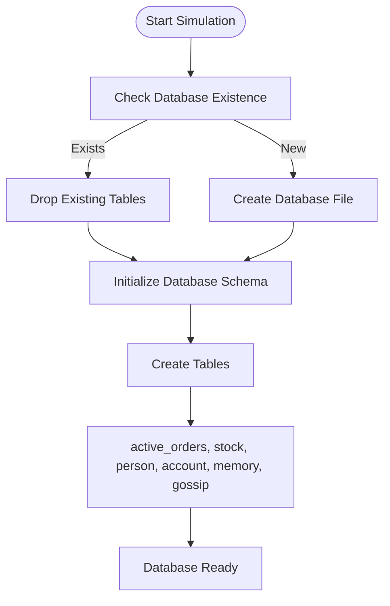
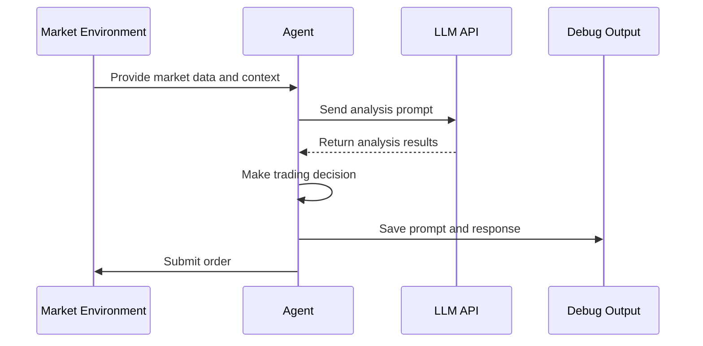
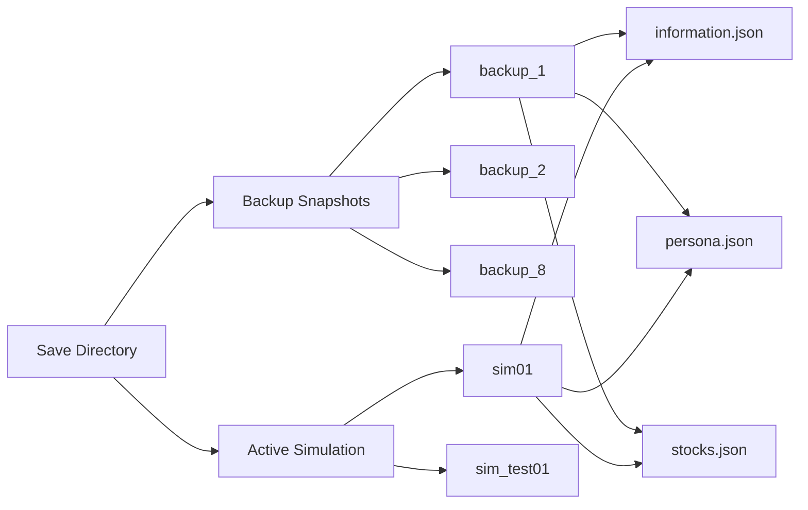

# Troubleshooting and Debugging

<cite>
**Referenced Files in This Document**   
- [main.py](file://Agent-Trading-Arena/Stock_Main/main.py)
- [database.py](file://Agent-Trading-Arena/Stock_Main/database.py)
- [database_utils.py](file://Agent-Trading-Arena/Stock_Main/database_utils.py)
- [load_json.py](file://Agent-Trading-Arena/Stock_Main/load_json.py)
- [utils.py](file://Agent-Trading-Arena/Stock_Main/content/utils.py)
- [sim_test01/debug_prompts/day0_iter0_market_analysis_prompt.txt](file://Agent-Trading-Arena/Stock_Main/save/sim_test01/debug_prompts/day0_iter0_market_analysis_prompt.txt)
- [sim_test01/information.json](file://Agent-Trading-Arena/Stock_Main/save/sim_test01/information.json)
- [sim_test01/persona.json](file://Agent-Trading-Arena/Stock_Main/save/sim_test01/persona.json)
- [sim_test01/stocks.json](file://Agent-Trading-Arena/Stock_Main/save/sim_test01/stocks.json)
</cite>

## Table of Contents
1. [Common Configuration Issues](#common-configuration-issues)
2. [API Connection and LLM Errors](#api-connection-and-llm-errors)
3. [Database Initialization Failures](#database-initialization-failures)
4. [Simulation Crashes and Stability Issues](#simulation-crashes-and-stability-issues)
5. [Debugging Agent Decision-Making](#debugging-agent-decision-making)
6. [Verbose Mode and Execution Logging](#verbose-mode-and-execution-logging)
7. [Unexpected Market Behavior](#unexpected-market-behavior)
8. [Agent Performance Degradation](#agent-performance-degradation)
9. [State Restoration Using Backup System](#state-restoration-using-backup-system)
10. [Performance Bottlenecks and Optimization](#performance-bottlenecks-and-optimization)

## Common Configuration Issues

This section addresses frequent configuration-related problems users may encounter when setting up and running the Agent Trading Arena simulation.

### Missing JSON Configuration Files
The simulation requires several JSON configuration files to initialize agent personas and stock data. If these files are missing or incorrectly named, the simulation will fail to start. The system expects `persona.json` and `stocks.json` files in the designated save directory (e.g., `save/sim01/`). Ensure these files exist and are properly formatted with valid JSON syntax. The file paths are derived from command-line arguments `--persona_name` and `--stock_name`, with default values of `persona.json` and `stocks.json` respectively.

### Incorrect API Key Configuration
The simulation relies on OpenAI API for agent decision-making. The API key must be correctly set in `Stock_Main/content/utils.py`. Users often encounter authentication failures when the key is missing, incorrectly formatted, or placed in the wrong file. The README specifies that the API key should be assigned to the `openai_api_key` variable in this file. Without a valid key, agents cannot generate trading decisions, leading to simulation failure.

**Section sources**
- [main.py](file://Agent-Trading-Arena/Stock_Main/main.py#L27-L31)
- [utils.py](file://Agent-Trading-Arena/Stock_Main/content/utils.py)

## API Connection and LLM Errors

Issues with API connectivity and LLM interactions are common in this agent-based trading simulation.

### OpenAI API Authentication Failures
When the OpenAI API key is invalid or missing, the LLM-based agents cannot generate responses for market analysis, reflection, or trading decisions. This typically manifests as empty or null responses when agents are expected to produce analysis. Check that the API key in `utils.py` is correctly formatted and has sufficient quota. Network connectivity issues can also prevent API calls from succeeding.

### LLM Response Parsing Errors
The system processes LLM-generated text to extract trading operations. If the LLM response format deviates from expected patterns (e.g., "Buy: Tesla, Quantity: 100, Quoted price: 468.12"), parsing failures occur. This can happen when the prompt structure is altered or when the LLM produces inconsistent output formats. The `operations.insert_op` method in `database.py` handles this parsing and may fail if input format expectations are not met.

**Section sources**
- [database.py](file://Agent-Trading-Arena/Stock_Main/database.py#L88-L104)
- [utils.py](file://Agent-Trading-Arena/Stock_Main/content/utils.py)

## Database Initialization Failures

The simulation uses SQLite databases to store market data, agent states, and transaction records.

### Database Creation and Table Initialization
The `Database_operate` class in `database_utils.py` is responsible for initializing the database structure. If database initialization fails, check file permissions in the save directory and ensure the path is writable. The system creates tables for `active_orders`, `stock`, `person`, `account`, `memory`, and `gossip`. Database operations are wrapped in try-except blocks, with errors printed to stdout, making them visible in the console output.

### Data Integrity and Schema Issues
Database schema mismatches can occur when loading saved states from incompatible versions. The system drops existing tables during initialization, which helps prevent schema conflicts. However, if the database file becomes corrupted, manual deletion of the `.db` file in the save directory may be necessary to allow clean reinitialization.

**Diagram sources**
- [database_utils.py](file://Agent-Trading-Arena/Stock_Main/database_utils.py#L254-L300)
- [main.py](file://Agent-Trading-Arena/Stock_Main/main.py#L63-L70)

**Section sources**
- [database_utils.py](file://Agent-Trading-Arena/Stock_Main/database_utils.py#L245-L322)

## Simulation Crashes and Stability Issues

Various factors can cause the simulation to terminate unexpectedly.

### Memory Management and Resource Exhaustion
Long-running simulations with many agents and iterations can consume significant memory, especially when storing historical data and agent memories. The pickling mechanism in `load_json.py` saves agent and market states, which can grow large over time. Monitor system resources and consider reducing the number of agents (`--Num_Person`) or trading days (`--No_Days`) for resource-constrained environments.

### Exception Handling in Critical Loops
The main simulation loop in `main.py` processes daily iterations and agent operations. Unhandled exceptions in this loop can crash the simulation. The code includes basic error handling in database operations, but other components may propagate exceptions upward. Wrapping critical sections in try-except blocks and implementing proper logging can help identify and isolate crash causes.

**Section sources**
- [main.py](file://Agent-Trading-Arena/Stock_Main/main.py#L95-L131)
- [load_json.py](file://Agent-Trading-Arena/Stock_Main/load_json.py#L25-L34)

## Debugging Agent Decision-Making

The debug_prompts directory provides valuable insights into agent reasoning processes.

### Analyzing Market Analysis Prompts
The `debug_prompts` directory contains prompt files like `day0_iter0_market_analysis_prompt.txt` that show exactly what information was provided to agents for decision-making. These prompts include stock information, market trends, gossip, and existing investments. By examining these files, users can trace why agents made specific decisions and identify potential flaws in information presentation.

### Tracing Reflection and Strategy Updates
Files such as `day0_long_reflection_prompt.txt` and `day0_strategy_update_prompt.txt` reveal how agents reflect on their performance and update their strategies. The reflection process is controlled by the `reflect_frequency` parameter in agent personas. Agents with higher frequencies reflect more often, potentially adapting faster to market conditions.

**Diagram sources**
- [sim_test01/debug_prompts/day0_iter0_market_analysis_prompt.txt](file://Agent-Trading-Arena/Stock_Main/save/sim_test01/debug_prompts/day0_iter0_market_analysis_prompt.txt)
- [main.py](file://Agent-Trading-Arena/Stock_Main/main.py#L103-L108)

**Section sources**
- [sim_test01/debug_prompts/day0_iter0_market_analysis_prompt.txt](file://Agent-Trading-Arena/Stock_Main/save/sim_test01/debug_prompts/day0_iter0_market_analysis_prompt.txt)
- [main.py](file://Agent-Trading-Arena/Stock_Main/main.py#L118)

## Verbose Mode and Execution Logging

The simulation provides diagnostic information through its verbose mode.

### Enabling Verbose Output
The `--verbose` command-line flag enables detailed logging of simulation execution. When activated, the system outputs additional information about market conditions, agent decisions, and internal state changes. This is invaluable for understanding the simulation flow and identifying where issues occur. The verbose flag is processed in `get_args()` in `main.py` and can be used alongside other parameters.

### Interpreting Debug Information
Verbose output includes details about daily iterations, market index updates, gossip generation, and order matching. This information helps users verify that the simulation is progressing as expected and allows for step-by-step validation of agent behavior against market dynamics.

**Section sources**
- [main.py](file://Agent-Trading-Arena/Stock_Main/main.py#L33)

## Unexpected Market Behavior

Anomalous market patterns can emerge from agent interactions.

### Price Volatility and Market Crashes
Extreme price movements may occur when multiple agents simultaneously buy or sell the same stock. The price fluctuation is influenced by the `--Fluctuation_Constant` parameter (default 20.0) and the `--Daily_Price_Limit` (default 0.7). Adjusting these parameters can stabilize market behavior. The `Market_index.update_market_index` method calculates overall market trends based on individual stock performance.

### Gossip Propagation Effects
Gossip generated by agents can create herd behavior, leading to irrational market movements. The `--gossip_num_max` parameter limits the number of gossip entries per round, helping control information spread. Review gossip content in the database to understand how rumors might be influencing agent decisions.

**Section sources**
- [main.py](file://Agent-Trading-Arena/Stock_Main/main.py#L30-L31)
- [behavior.py](file://Agent-Trading-Arena/Stock_Main/behavior.py#L4)

## Agent Performance Degradation

Over time, agents may exhibit declining performance due to various factors.

### Memory Overload and Information Processing
Agents accumulate memories of past operations, market conditions, and financial situations. If the memory system becomes overloaded with irrelevant information, decision quality may degrade. The reflection mechanism is designed to mitigate this by allowing agents to update their strategies based on experience.

### Strategy Ineffectiveness in Evolving Markets
An agent's initial strategy (defined in `principle` field of persona.json) may become ineffective as market conditions change. The reflection process should help agents adapt, but some may fail to recognize when their approach needs modification. Monitoring strategy updates in the debug output can reveal whether agents are appropriately evolving their behavior.

**Section sources**
- [persona.json](file://Agent-Trading-Arena/Stock_Main/save/sim_test01/persona.json)
- [behavior.py](file://Agent-Trading-Arena/Stock_Main/behavior.py#L4)

## State Restoration Using Backup System

The simulation provides mechanisms for saving and restoring state.

### Save Directory Structure
The `save/` directory contains subdirectories for different simulation runs (e.g., `sim01/`, `sim_test01/`) and backup snapshots (`backup_1/` through `backup_8/`). Each contains `information.json`, `persona.json`, and `stocks.json` files that capture the simulation state at specific points. The current state is determined by `information.json`, which records the virtual date and iteration.

### Loading Previous States
The `load_all` function in `load_json.py` restores the complete simulation state from saved files. To resume from a previous point, set the `--SAVE_NAME` parameter to the desired save directory and ensure `load=True` in the initialization. The system reconstructs agents, market conditions, and database connections from the serialized data.

**Diagram sources**
- [save/](file://Agent-Trading-Arena/Stock_Main/save/)
- [load_json.py](file://Agent-Trading-Arena/Stock_Main/load_json.py#L81-L122)

**Section sources**
- [load_json.py](file://Agent-Trading-Arena/Stock_Main/load_json.py#L81-L122)
- [sim_test01/information.json](file://Agent-Trading-Arena/Stock_Main/save/sim_test01/information.json)

## Performance Bottlenecks and Optimization

Several aspects of the simulation can impact performance.

### LLM API Call Latency
The most significant performance bottleneck is typically the round-trip time for LLM API calls. Each agent decision requires an API request, and with multiple agents and iterations, this can become time-consuming. Consider implementing request batching or caching of common analysis patterns to reduce API calls.

### Database Operation Efficiency
Frequent database queries and updates can slow simulation speed. The current implementation uses direct SQL execution without optimization. For large-scale simulations, consider adding indexes to frequently queried fields or implementing query caching.

### Optimization Recommendations
1. Reduce `--Iterations_Daily` and `--No_Days` for testing
2. Limit the number of active agents with `--Num_Person`
3. Implement local caching of frequent LLM responses
4. Optimize database queries with appropriate indexes
5. Use lower verbosity levels in production runs

**Section sources**
- [main.py](file://Agent-Trading-Arena/Stock_Main/main.py#L19-L23)
- [database_utils.py](file://Agent-Trading-Arena/Stock_Main/database_utils.py#L302-L310)