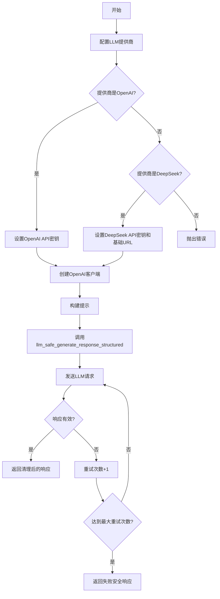
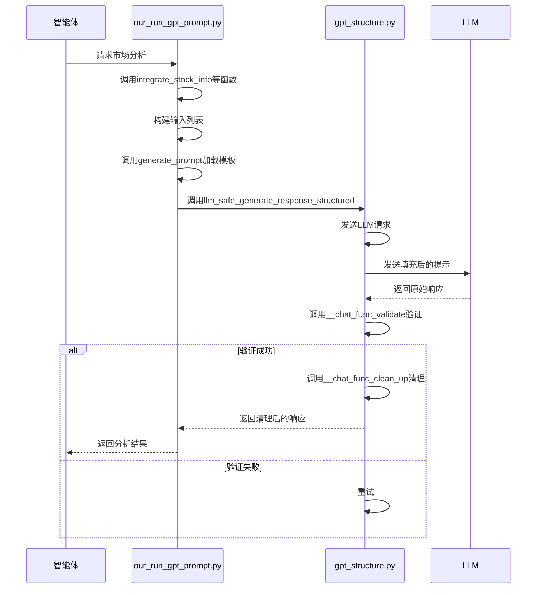
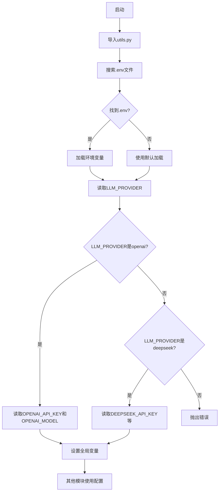

# GPT调用封装与API集成

<cite>
**本文档引用的文件**
- [gpt_structure.py](file://Agent-Trading-Arena/Stock_Main/content/gpt_structure.py)
- [our_run_gpt_prompt.py](file://Agent-Trading-Arena/Stock_Main/content/our_run_gpt_prompt.py)
- [utils.py](file://Agent-Trading-Arena/Stock_Main/content/utils.py)
- [database_utils.py](file://Agent-Trading-Arena/Stock_Main/database_utils.py)
- [analysis.txt](file://Agent-Trading-Arena/Stock_Main/content/our_prompt_template/analysis.txt)
- [buy_based_on_analysis.txt](file://Agent-Trading-Arena/Stock_Main/content/our_prompt_template/buy_based_on_analysis.txt)
- [sell_based_on_analysis.txt](file://Agent-Trading-Arena/Stock_Main/content/our_prompt_template/sell_based_on_analysis.txt)
</cite>

## 目录
1. [系统概述](#系统概述)
2. [GPT调用封装机制](#gpt调用封装机制)
3. [提示模板与流程协调](#提示模板与流程协调)
4. [环境变量与API密钥管理](#环境变量与api密钥管理)
5. [请求频率控制与错误处理](#请求频率控制与错误处理)
6. [辅助函数与文本处理](#辅助函数与文本处理)
7. [多LLM提供商扩展](#多llm提供商扩展)
8. [响应延迟与实时性优化](#响应延迟与实时性优化)

## 系统概述

该系统是一个模拟股票交易环境，其中智能体（agents）通过调用大型语言模型（LLM）来做出投资决策。系统的核心是通过封装OpenAI API调用，实现对LLM的安全、异步、可重试访问。智能体基于市场信息、个人投资组合、投资策略和他人八卦等信息，通过LLM进行市场分析、买卖决策和策略反思。整个流程由`our_run_gpt_prompt.py`协调，通过加载提示模板、填充变量、解析GPT响应和处理错误来完成。系统通过环境变量管理API密钥，控制请求频率，并处理超时与限流情况。`utils.py`中的辅助函数在文本预处理、结果清洗和日志记录中发挥重要作用。

**Section sources**
- [main.py](file://Agent-Trading-Arena/Stock_Main/main.py#L1-L151)
- [behavior.py](file://Agent-Trading-Arena/Stock_Main/behavior.py#L1-L210)

## GPT调用封装机制

系统通过`gpt_structure.py`文件中的多个函数实现了对LLM API的安全、异步、可重试访问。核心机制包括：

1.  **多提供商支持**：系统通过`llm_provider`环境变量配置LLM提供商（如OpenAI或DeepSeek）。代码根据提供商配置API密钥和客户端，DeepSeek使用与OpenAI兼容的API。
2.  **基础请求函数**：`llm_request`和`llm_chat_request`函数是基础的LLM请求函数，它们根据配置的提供商创建相应的客户端，并发送聊天完成请求。这些函数包含异常处理，捕获连接错误并返回错误信息。
3.  **安全生成函数**：`llm_safe_generate_response_structured`是核心的安全生成函数。它通过以下机制确保响应的可靠性：
    *   **结构化输出**：要求LLM以JSON格式输出响应，并提供示例输出格式。
    *   **可重试机制**：在循环中最多尝试`repeat`次（默认100次），直到获得有效响应。
    *   **验证与清理**：使用`func_validate`函数验证LLM的响应是否符合预期格式和内容，使用`func_clean_up`函数对响应进行清理和后处理。
    *   **失败安全**：如果所有重试都失败，则返回`fail_safe_response`。

**Diagram sources**
- [gpt_structure.py](file://Agent-Trading-Arena/Stock_Main/content/gpt_structure.py#L1-L372)

**Section sources**
- [gpt_structure.py](file://Agent-Trading-Arena/Stock_Main/content/gpt_structure.py#L1-L372)

## 提示模板与流程协调

`our_run_gpt_prompt.py`文件负责协调整个提示生成、发送和响应解析的完整流程。其核心机制如下：

1.  **提示模板加载**：系统使用`generate_prompt`函数从`our_prompt_template`目录下的文本文件（如`analysis.txt`）加载提示模板。模板中包含`!<INPUT 0>!`等占位符。
2.  **变量填充**：`integrate_*`系列函数（如`integrate_stock_info`、`integrate_hold_info`）负责从数据库和智能体状态中提取数据，并将其格式化为字符串。然后，`create_prompt_input`函数将这些字符串作为输入列表传递给`generate_prompt`函数，替换模板中的占位符。
3.  **GPT响应解析**：对于每个任务（如市场分析、买卖决策、策略反思），系统调用`llm_safe_generate_response_structured`函数。该函数使用特定的`example_output`和`special_instruction`来指导LLM生成符合预期格式的响应。
4.  **错误处理**：`__chat_func_validate`函数使用正则表达式验证LLM的响应是否符合预期的格式（例如，分析结果以"-"开头，买卖决策包含特定字段）。如果验证失败，将进行重试。

**Diagram sources**
- [our_run_gpt_prompt.py](file://Agent-Trading-Arena/Stock_Main/content/our_run_gpt_prompt.py#L1-L628)
- [gpt_structure.py](file://Agent-Trading-Arena/Stock_Main/content/gpt_structure.py#L1-L372)

**Section sources**
- [our_run_gpt_prompt.py](file://Agent-Trading-Arena/Stock_Main/content/our_run_gpt_prompt.py#L1-L628)

## 环境变量与API密钥管理

系统通过`utils.py`文件集中管理环境变量和API密钥，确保了安全性与配置的灵活性。

1.  **环境变量加载**：`utils.py`在文件顶部使用`python-dotenv`库加载`.env`文件。它会从当前文件路径向上搜索最多3个父目录来查找`.env`文件，如果未找到则使用默认行为。
2.  **LLM提供商选择**：`llm_provider`环境变量决定了使用哪个LLM提供商（如`openai`或`deepseek`）。系统根据此变量加载相应的API密钥和模型配置。
3.  **API密钥配置**：对于OpenAI，系统加载`OPENAI_API_KEY`和`OPENAI_MODEL`；对于DeepSeek，系统加载`DEEPSEEK_API_KEY`、`DEEPSEEK_MODEL`和`DEEPSEEK_BASE_URL`。如果未找到API密钥，系统会打印警告信息。
4.  **全局变量**：加载的配置（如`openai_api_key`、`llm_provider`）作为全局变量暴露给其他模块，使得`gpt_structure.py`等文件可以直接使用这些配置。

**Diagram sources**
- [utils.py](file://Agent-Trading-Arena/Stock_Main/content/utils.py#L1-L60)

**Section sources**
- [utils.py](file://Agent-Trading-Arena/Stock_Main/content/utils.py#L1-L60)

## 请求频率控制与错误处理

系统通过多种机制来控制请求频率、处理超时与限流情况，确保系统的稳定性和可靠性。

1.  **请求频率控制**：`temp_sleep(seconds=1)`函数在每次LLM请求前调用，强制休眠1秒。这是一种简单的速率限制机制，防止因请求过于频繁而被API限流。
2.  **超时处理**：代码中注释掉了`@timeout(150)`装饰器，表明系统曾考虑或计划使用超时机制。虽然当前未启用，但这是一个处理长时间无响应请求的有效方法。
3.  **错误处理与重试**：
    *   **基础错误处理**：`llm_request`和`llm_chat_request`等基础函数都包含`try-except`块，捕获所有异常并打印错误信息，避免程序因单个请求失败而崩溃。
    *   **高级重试机制**：`llm_safe_generate_response_structured`函数是错误处理的核心。它通过循环和`repeat`参数实现了可配置的重试次数。即使单次请求失败，函数也会继续尝试，直到成功或达到最大重试次数。
    *   **失败安全**：当所有重试都失败后，函数返回`fail_safe_response`（通常为`"error"`），确保调用者总能获得一个响应，避免程序逻辑中断。
4.  **限流应对**：虽然代码中没有显式的限流检测（如检查HTTP 429状态码），但重试机制本身可以应对短暂的限流。`temp_sleep`的休眠也降低了触发限流的可能性。

**Section sources**
- [gpt_structure.py](file://Agent-Trading-Arena/Stock_Main/content/gpt_structure.py#L1-L372)

## 辅助函数与文本处理

`utils.py`和`database_utils.py`文件中的辅助函数在文本预处理、结果清洗和日志记录中扮演着关键角色。

1.  **文本预处理**：
    *   `round_two_decimal`函数将浮点数四舍五入到两位小数，确保传递给LLM的数值数据格式一致和精确。
    *   `round_lists_two_decimals`函数对数值列表进行批量处理，常用于处理股票价格、百分比等数据。
2.  **结果清洗**：
    *   在`our_run_gpt_prompt.py`中，`__chat_func_clean_up`函数对LLM的原始响应进行清洗。例如，在`analysis`函数中，它会移除响应开头的"The analysis results: "前缀。
    *   正则表达式在`extract_*`函数（如`extract_for_choose_buy`）中被广泛用于从LLM的文本响应中精确提取结构化数据（如股票名称、数量、价格）。
3.  **日志记录**：
    *   系统在`utils.py`中通过`print`语句记录关键信息，如使用的LLM提供商和模型。
    *   在`gpt_structure.py`中，所有LLM相关的错误都会被捕获并打印，便于调试和监控。
    *   当`verbose=True`时，`llm_safe_generate_response_structured`会打印发送给LLM的完整提示和收到的响应，这对于调试提示模板非常有用。

**Section sources**
- [utils.py](file://Agent-Trading-Arena/Stock_Main/content/utils.py#L1-L60)
- [database_utils.py](file://Agent-Trading-Arena/Stock_Main/database_utils.py#L1-L322)
- [our_run_gpt_prompt.py](file://Agent-Trading-Arena/Stock_Main/content/our_run_gpt_prompt.py#L1-L628)

## 多LLM提供商扩展

系统已经设计为支持多LLM提供商，扩展支持其他提供商（如Anthropic或本地部署模型）是可行的。

1.  **现有扩展机制**：系统通过`llm_provider`环境变量和条件判断来支持OpenAI和DeepSeek。这种模式可以轻松扩展到其他提供商。
2.  **扩展Anthropic**：
    *   在`.env`文件中添加`ANTHROPIC_API_KEY`和`ANTHROPIC_MODEL`。
    *   在`utils.py`中，当`llm_provider == 'anthropic'`时，加载Anthropic的API密钥和模型。
    *   在`gpt_structure.py`中，修改`llm_single_request`等函数，当`llm_provider == 'anthropic'`时，使用Anthropic的Python SDK（如`import anthropic`）来创建客户端和发送请求。
3.  **扩展本地部署模型**：
    *   对于通过OpenAI兼容API暴露的本地模型（如通过`vLLM`或`text-generation-webui`），可以像DeepSeek一样处理，只需将`base_url`指向本地API端点。
    *   对于非兼容API的模型，需要创建一个新的分支，使用该模型特定的SDK或直接通过HTTP请求与模型的API交互。
4.  **统一接口**：关键是要在`gpt_structure.py`中保持`llm_chat_request`等函数的接口不变，无论底层使用哪个提供商，上层调用者（如`our_run_gpt_prompt.py`）都无需修改。

**Section sources**
- [utils.py](file://Agent-Trading-Arena/Stock_Main/content/utils.py#L1-L60)
- [gpt_structure.py](file://Agent-Trading-Arena/Stock_Main/content/gpt_structure.py#L1-L372)

## 响应延迟与实时性优化

LLM的响应延迟直接影响模拟的实时性，系统通过以下方式应对并优化：

1.  **延迟影响**：
    *   **模拟速度**：LLM的响应时间（可能从几百毫秒到几秒）是整个模拟循环中最耗时的环节，直接决定了模拟的迭代速度。
    *   **实时性感知**：高延迟会使智能体的决策显得“迟钝”，破坏模拟的实时感。
2.  **当前优化方案**：
    *   **串行处理**：目前系统是串行处理每个智能体的请求，一个请求的延迟会累积到总模拟时间。
    *   **重试机制**：虽然重试保证了可靠性，但失败后的重试会显著增加延迟。
3.  **潜在优化方案**：
    *   **并行化请求**：最有效的优化是将对多个智能体的LLM请求并行化。可以使用`asyncio`或线程池同时发送所有请求，总延迟将接近单个请求的延迟，而非总和。
    *   **缓存机制**：对于不经常变化的信息（如智能体的长期投资策略），可以引入缓存，避免重复调用LLM。
    *   **更小的模型**：在保证决策质量的前提下，使用响应更快的较小模型（如`gpt-3.5-turbo`而非`gpt-4`）可以显著降低延迟。
    *   **超时与降级**：实现超时机制，当请求超过一定时间后，使用一个简单的默认策略（如“持有”）作为降级方案，保证模拟不被卡住。

**Section sources**
- [gpt_structure.py](file://Agent-Trading-Arena/Stock_Main/content/gpt_structure.py#L1-L372)
- [main.py](file://Agent-Trading-Arena/Stock_Main/main.py#L1-L151)