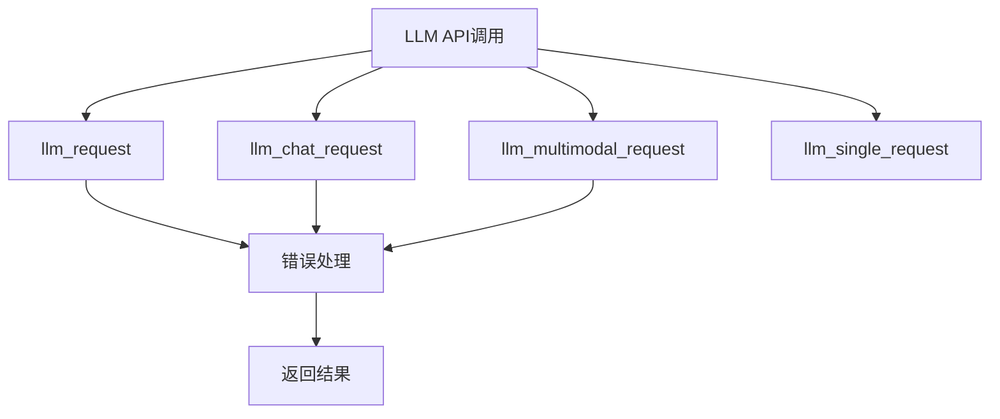
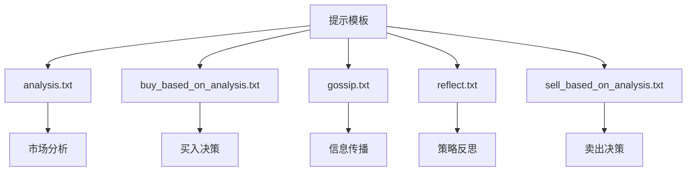
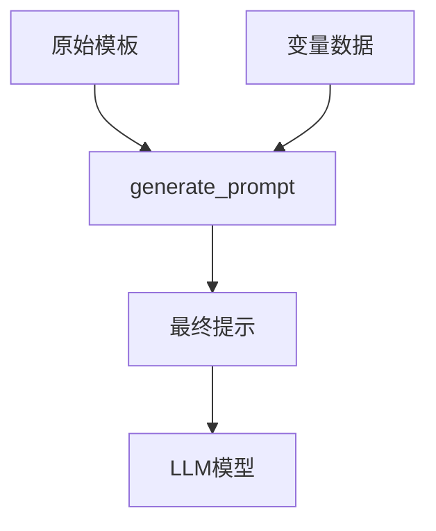
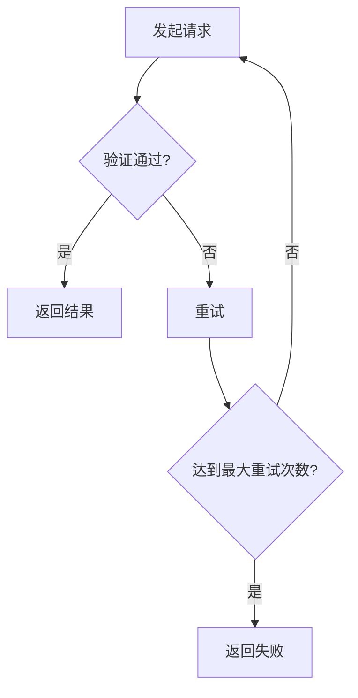
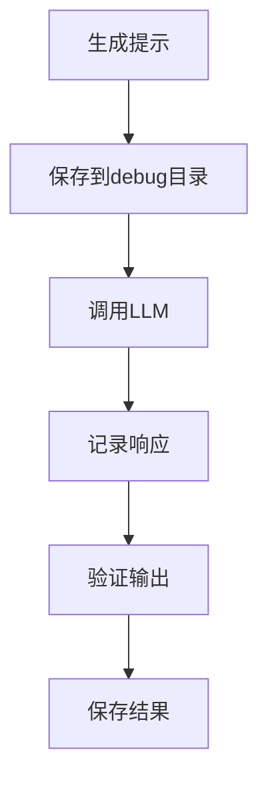
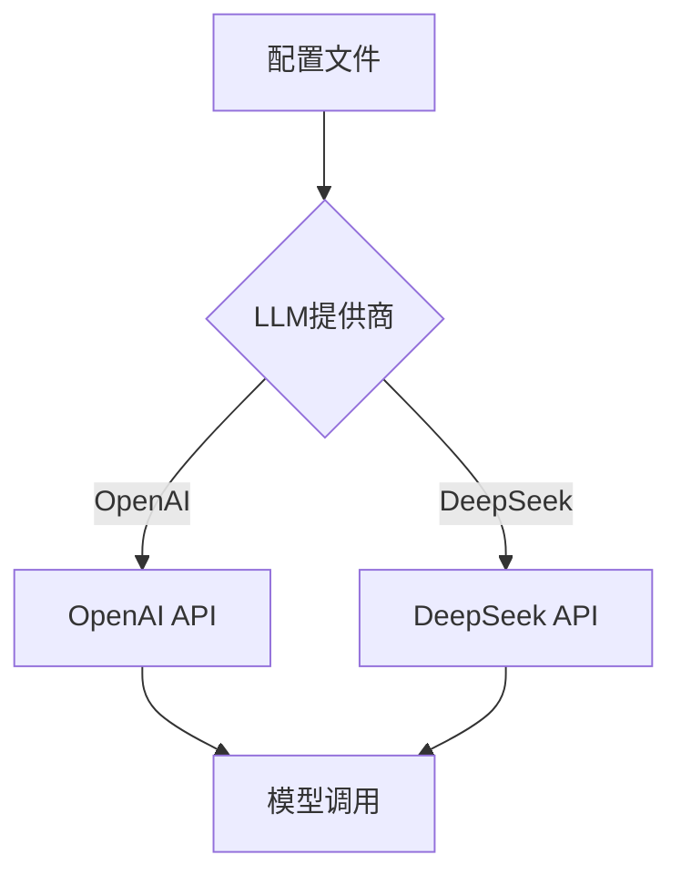
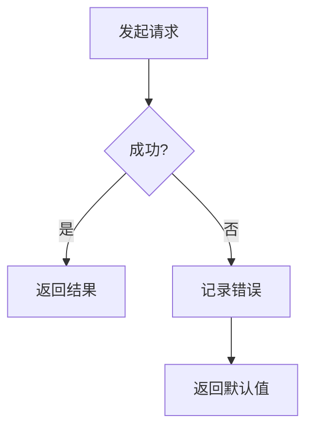

# LLM集成与提示工程

<cite>
**本文档引用文件**  
- [gpt_structure.py](file://Agent-Trading-Arena/Stock_Main/content/gpt_structure.py)
- [our_run_gpt_prompt.py](file://Agent-Trading-Arena/Stock_Main/content/our_run_gpt_prompt.py)
- [utils.py](file://Agent-Trading-Arena/Stock_Main/content/utils.py)
- [analysis.txt](file://Agent-Trading-Arena/Stock_Main/content/our_prompt_template/analysis.txt)
- [buy_based_on_analysis.txt](file://Agent-Trading-Arena/Stock_Main/content/our_prompt_template/buy_based_on_analysis.txt)
- [gossip.txt](file://Agent-Trading-Arena/Stock_Main/content/our_prompt_template/gossip.txt)
- [reflect.txt](file://Agent-Trading-Arena/Stock_Main/content/our_prompt_template/reflect.txt)
- [sell_based_on_analysis.txt](file://Agent-Trading-Arena/Stock_Main/content/our_prompt_template/sell_based_on_analysis.txt)
- [stock_information.txt](file://Agent-Trading-Arena/Stock_Main/content/our_prompt_template/stock_information.txt)
- [hold_information.txt](file://Agent-Trading-Arena/Stock_Main/content/our_prompt_template/hold_information.txt)
- [gossip_info.txt](file://Agent-Trading-Arena/Stock_Main/content/our_prompt_template/gossip_info.txt)
- [reflect_info.txt](file://Agent-Trading-Arena/Stock_Main/content/our_prompt_template/reflect_info.txt)
- [long_reflect_infor.txt](file://Agent-Trading-Arena/Stock_Main/content/our_prompt_template/long_reflect_infor.txt)
- [pre_reflect.txt](file://Agent-Trading-Arena/Stock_Main/content/our_prompt_template/pre_reflect.txt)
- [pre_long_reflection.txt](file://Agent-Trading-Arena/Stock_Main/content/our_prompt_template/pre_long_reflection.txt)
- [day0_iter0_market_analysis_prompt.txt](file://Agent-Trading-Arena/Stock_Main/save/sim_test01/debug_prompts/day0_iter0_market_analysis_prompt.txt)
</cite>

## 目录
1. [项目概述](#项目概述)
2. [LLM API封装机制](#llm-api封装机制)
3. [提示模板系统](#提示模板系统)
4. [动态变量填充机制](#动态变量填充机制)
5. [提示工程优化策略](#提示工程优化策略)
6. [调试与验证机制](#调试与验证机制)
7. [多模型支持架构](#多模型支持架构)
8. [安全调用与容错处理](#安全调用与容错处理)
9. [实际应用案例分析](#实际应用案例分析)
10. [最佳实践建议](#最佳实践建议)

## 项目概述

本项目构建了一个基于大语言模型的模拟股票交易系统，通过精心设计的提示工程实现智能投资决策。系统核心在于将金融数据与LLM能力相结合，利用结构化提示模板引导模型进行市场分析、买卖决策、信息传播和策略反思。整个架构支持OpenAI和DeepSeek等多种LLM提供商，具备良好的可扩展性和安全性。

**文档来源**
- [gpt_structure.py](file://Agent-Trading-Arena/Stock_Main/content/gpt_structure.py#L1-L372)
- [our_run_gpt_prompt.py](file://Agent-Trading-Arena/Stock_Main/content/our_run_gpt_prompt.py#L1-L628)

## LLM API封装机制

系统通过`gpt_structure.py`文件实现了对LLM API的统一封装，提供了多种调用方式以适应不同场景需求。核心函数包括基础请求、聊天请求、多模态请求等，确保了与不同LLM服务的兼容性。



**图示来源**
- [gpt_structure.py](file://Agent-Trading-Arena/Stock_Main/content/gpt_structure.py#L25-L115)

**文档来源**
- [gpt_structure.py](file://Agent-Trading-Arena/Stock_Main/content/gpt_structure.py#L25-L115)

## 提示模板系统

系统采用模块化的提示模板设计，每个模板针对特定任务进行优化，确保输出的一致性和准确性。主要模板包括：

### 市场分析模板 (analysis.txt)
用于生成市场分析报告，整合股票信息、市场趋势、八卦消息和个人持仓等多维度数据。

### 买入决策模板 (buy_based_on_analysis.txt)
基于分析结果生成具体的买入操作建议，包含股票名称、投资金额和最佳买入价格。

### 信息传播模板 (gossip.txt)
模拟信息传播行为，生成可能影响其他参与者决策的市场八卦。

### 自我反思模板 (reflect.txt)
对投资策略进行评估和优化，识别优势与劣势，并提出改进建议。



**图示来源**
- [analysis.txt](file://Agent-Trading-Arena/Stock_Main/content/our_prompt_template/analysis.txt#L1-L37)
- [buy_based_on_analysis.txt](file://Agent-Trading-Arena/Stock_Main/content/our_prompt_template/buy_based_on_analysis.txt#L1-L33)
- [gossip.txt](file://Agent-Trading-Arena/Stock_Main/content/our_prompt_template/gossip.txt#L1-L16)
- [reflect.txt](file://Agent-Trading-Arena/Stock_Main/content/our_prompt_template/reflect.txt#L1-L35)

**文档来源**
- [analysis.txt](file://Agent-Trading-Arena/Stock_Main/content/our_prompt_template/analysis.txt#L1-L37)
- [buy_based_on_analysis.txt](file://Agent-Trading-Arena/Stock_Main/content/our_prompt_template/buy_based_on_analysis.txt#L1-L33)
- [gossip.txt](file://Agent-Trading-Arena/Stock_Main/content/our_prompt_template/gossip.txt#L1-L16)
- [reflect.txt](file://Agent-Trading-Arena/Stock_Main/content/our_prompt_template/reflect.txt#L1-L35)

## 动态变量填充机制

系统采用`!<INPUT n>!`占位符语法实现动态变量填充，通过`generate_prompt`函数将实际数据注入模板。这种机制确保了提示的灵活性和可重用性。

### 变量映射规则
- `{{stock_info}}` → 股票基本信息
- `{{market_trend}}` → 市场趋势数据
- `{{gossip}}` → 八卦消息
- `{{hold_info}}` → 持仓信息
- `{{principle}}` → 投资原则

### 数据集成函数
- `integrate_stock_info`：整合股票市场数据
- `integrate_hold_info`：整合个人持仓信息
- `integrate_gossip`：整合八卦消息
- `integrate_reflect_info`：整合历史交易信息



**图示来源**
- [gpt_structure.py](file://Agent-Trading-Arena/Stock_Main/content/gpt_structure.py#L283-L308)
- [our_run_gpt_prompt.py](file://Agent-Trading-Arena/Stock_Main/content/our_run_gpt_prompt.py#L54-L78)

**文档来源**
- [gpt_structure.py](file://Agent-Trading-Arena/Stock_Main/content/gpt_structure.py#L283-L308)
- [our_run_gpt_prompt.py](file://Agent-Trading-Arena/Stock_Main/content/our_run_gpt_prompt.py#L54-L78)

## 提示工程优化策略

系统采用了多种提示工程优化技术，确保模型输出的质量和可靠性。

### 输出格式约束
通过提供示例输出和特殊指令，严格规定输出格式：
```json
{"output": "示例内容"}
```

### 验证与清洗机制
- `__chat_func_validate`：验证输出是否符合预期格式
- `__chat_func_clean_up`：清理和标准化输出内容

### 重试机制
`llm_safe_generate_response_structured`函数实现了最多100次的重试机制，确保在首次调用失败时能够自动重试。



**图示来源**
- [gpt_structure.py](file://Agent-Trading-Arena/Stock_Main/content/gpt_structure.py#L169-L224)
- [our_run_gpt_prompt.py](file://Agent-Trading-Arena/Stock_Main/content/our_run_gpt_prompt.py#L151-L212)

**文档来源**
- [gpt_structure.py](file://Agent-Trading-Arena/Stock_Main/content/gpt_structure.py#L169-L224)
- [our_run_gpt_prompt.py](file://Agent-Trading-Arena/Stock_Main/content/our_run_gpt_prompt.py#L151-L212)

## 调试与验证机制

系统内置了完善的调试和验证机制，便于开发和优化提示工程。

### 调试日志
- 保存生成的提示到`debug_prompts`目录
- 记录模型响应和处理结果
- 提供详细的错误信息

### 验证案例
通过`sim_test01`目录中的实际案例，可以分析模型在不同场景下的表现。



**图示来源**
- [our_run_gpt_prompt.py](file://Agent-Trading-Arena/Stock_Main/content/our_run_gpt_prompt.py#L182-L187)
- [our_run_gpt_prompt.py](file://Agent-Trading-Arena/Stock_Main/content/our_run_gpt_prompt.py#L275-L280)

**文档来源**
- [our_run_gpt_prompt.py](file://Agent-Trading-Arena/Stock_Main/content/our_run_gpt_prompt.py#L182-L187)
- [our_run_gpt_prompt.py](file://Agent-Trading-Arena/Stock_Main/content/our_run_gpt_prompt.py#L275-L280)

## 多模型支持架构

系统设计支持多种LLM提供商，通过配置文件灵活切换。

### 支持的模型
- OpenAI GPT系列
- DeepSeek 模型

### 配置管理
通过`.env`文件管理API密钥和模型配置，确保安全性。



**图示来源**
- [utils.py](file://Agent-Trading-Arena/Stock_Main/content/utils.py#L18-L45)
- [gpt_structure.py](file://Agent-Trading-Arena/Stock_Main/content/gpt_structure.py#L14-L18)

**文档来源**
- [utils.py](file://Agent-Trading-Arena/Stock_Main/content/utils.py#L18-L45)
- [gpt_structure.py](file://Agent-Trading-Arena/Stock_Main/content/gpt_structure.py#L14-L18)

## 安全调用与容错处理

系统实现了多层次的安全调用和容错机制。

### 错误处理
- 捕获异常并记录错误信息
- 提供失败安全响应
- 实现重试机制

### 速率限制
- `temp_sleep`函数防止请求过于频繁
- 优雅的错误恢复机制



**图示来源**
- [gpt_structure.py](file://Agent-Trading-Arena/Stock_Main/content/gpt_structure.py#L50-L68)
- [gpt_structure.py](file://Agent-Trading-Arena/Stock_Main/content/gpt_structure.py#L74-L91)

**文档来源**
- [gpt_structure.py](file://Agent-Trading-Arena/Stock_Main/content/gpt_structure.py#L50-L68)
- [gpt_structure.py](file://Agent-Trading-Arena/Stock_Main/content/gpt_structure.py#L74-L91)

## 实际应用案例分析

通过分析`debug_prompts`目录中的实际生成案例，可以深入了解系统的运行机制。

### 市场分析案例
`day0_iter0_market_analysis_prompt.txt`展示了完整的市场分析提示生成过程，包括：
- 股票信息整合
- 市场趋势分析
- 八卦消息处理
- 持仓情况评估

### 决策流程
1. 收集当前市场数据
2. 整合个人财务状况
3. 生成分析报告
4. 做出买卖决策
5. 更新投资策略

**文档来源**
- [day0_iter0_market_analysis_prompt.txt](file://Agent-Trading-Arena/Stock_Main/save/sim_test01/debug_prompts/day0_iter0_market_analysis_prompt.txt#L1-L100)

## 最佳实践建议

### 上下文长度控制
- 合理选择需要包含的信息
- 避免不必要的数据冗余
- 分批次处理大量数据

### 防止幻觉策略
- 提供准确的事实数据
- 限制输出格式
- 实施严格的验证机制

### 性能优化
- 缓存常用数据
- 批量处理请求
- 优化提示模板

### 安全性考虑
- 保护API密钥
- 验证输入数据
- 记录操作日志

**文档来源**
- [gpt_structure.py](file://Agent-Trading-Arena/Stock_Main/content/gpt_structure.py#L1-L372)
- [our_run_gpt_prompt.py](file://Agent-Trading-Arena/Stock_Main/content/our_run_gpt_prompt.py#L1-L628)