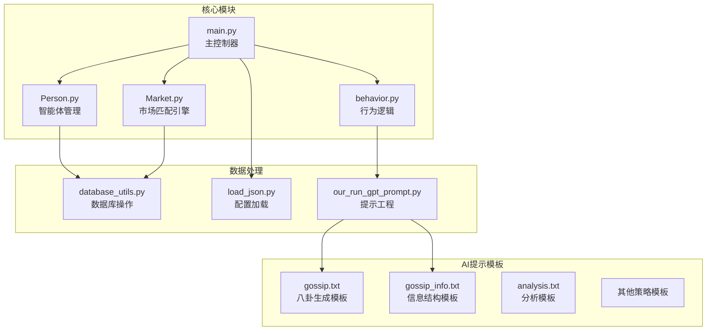
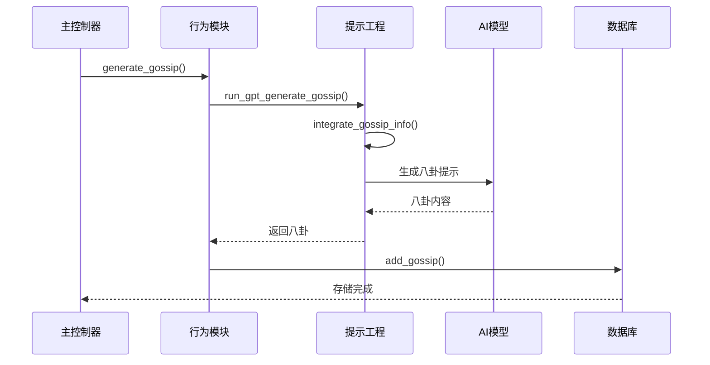
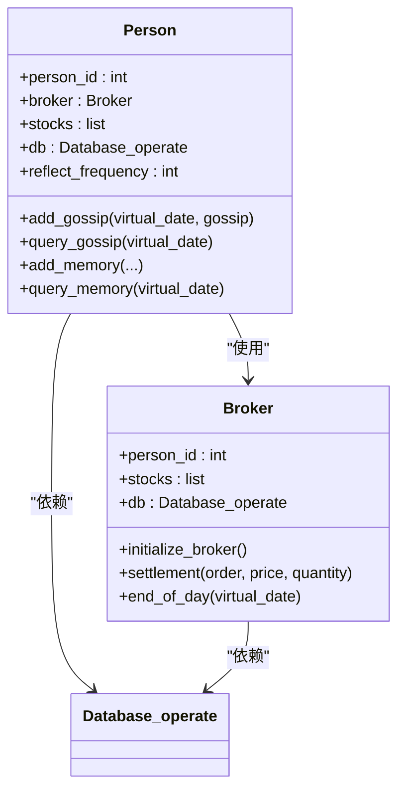
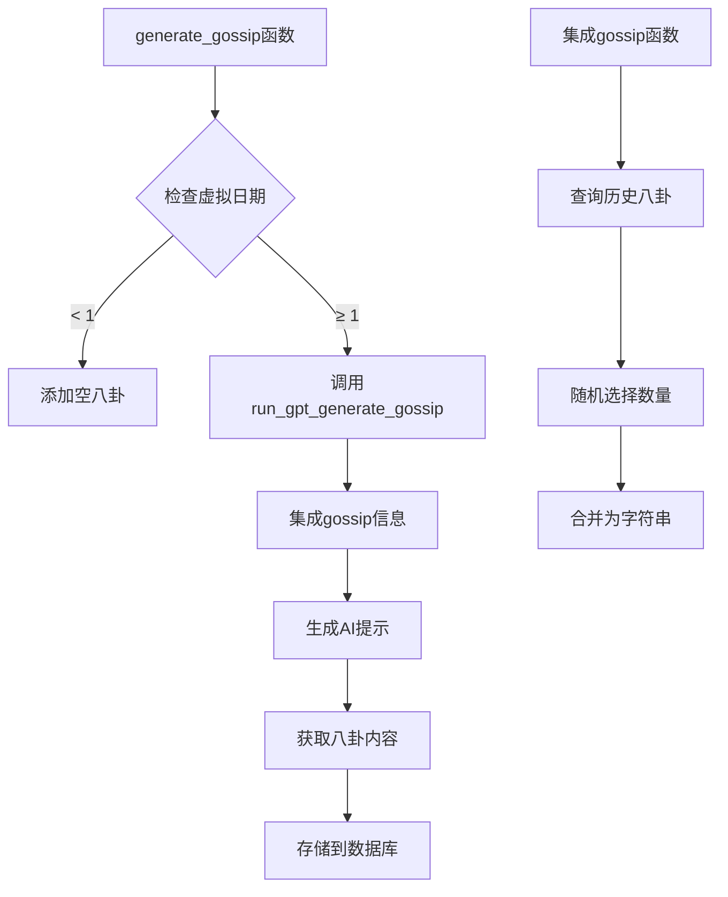
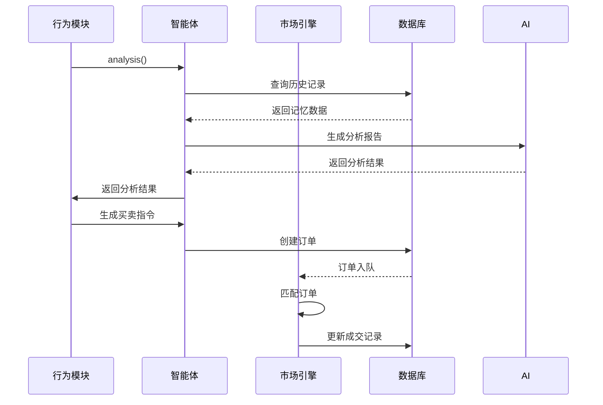
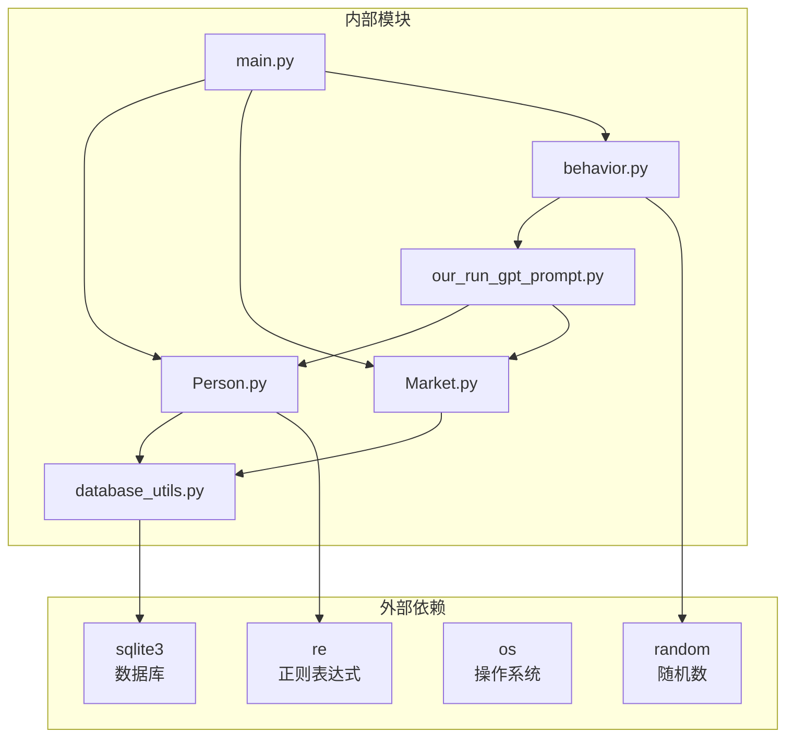

# 市场信息传播（八卦）机制

<cite>
**本文档引用的文件**
- [gossip.txt](file://Agent-Trading-Arena/Stock_Main/content/our_prompt_template/gossip.txt)
- [gossip_info.txt](file://Agent-Trading-Arena/Stock_Main/content/our_prompt_template/gossip_info.txt)
- [Person.py](file://Agent-Trading-Arena/Stock_Main/Person.py)
- [behavior.py](file://Agent-Trading-Arena/Stock_Main/behavior.py)
- [our_run_gpt_prompt.py](file://Agent-Trading-Arena/Stock_Main/content/our_run_gpt_prompt.py)
- [database_utils.py](file://Agent-Trading-Arena/Stock_Main/database_utils.py)
- [main.py](file://Agent-Trading-Arena/Stock_Main/main.py)
- [Market.py](file://Agent-Trading-Arena/Stock_Main/Market.py)
- [load_json.py](file://Agent-Trading-Arena/Stock_Main/load_json.py)
</cite>

## 目录
1. [引言](#引言)
2. [项目结构概览](#项目结构概览)
3. [核心组件分析](#核心组件分析)
4. [架构总览](#架构总览)
5. [详细组件分析](#详细组件分析)
6. [依赖关系分析](#依赖关系分析)
7. [性能考虑](#性能考虑)
8. [故障排除指南](#故障排除指南)
9. [结论](#结论)

## 引言

本项目实现了一个基于人工智能的股票交易仿真系统，其中包含独特的"八卦"（gossip）机制，用于模拟现实市场中非公开信息的传播。该机制通过AI提示模板驱动智能体生成和传播非理性因素（如谣言、内幕消息），从而影响市场价格波动和交易决策。

八卦机制的核心价值在于：
- 模拟现实市场的非理性因素
- 研究信息传播对市场稳定性的冲击
- 分析投机行为对价格发现过程的影响
- 提供市场微观结构研究的实验平台

## 项目结构概览

该项目采用模块化设计，主要包含以下核心模块：

**图表来源**
- [main.py](file://Agent-Trading-Arena/Stock_Main/main.py#L1-L151)
- [Person.py](file://Agent-Trading-Arena/Stock_Main/Person.py#L1-L629)
- [Market.py](file://Agent-Trading-Arena/Stock_Main/Market.py#L1-L278)

**章节来源**
- [main.py](file://Agent-Trading-Arena/Stock_Main/main.py#L1-L151)
- [Person.py](file://Agent-Trading-Arena/Stock_Main/Person.py#L1-L629)

## 核心组件分析

### 八卦生成模板系统

八卦机制的核心由两个模板文件构成：

#### gossip.txt 模板
该模板定义了AI如何生成八卦信息的指令框架：

```mermaid
flowchart TD
A[输入: 前一日相关信息] --> B[目标: 生成影响他人操作的八卦]
B --> C[类型: 可真可假]
C --> D[限制: 不得与已知信息冲突]
D --> E[输出: 八卦内容]
F[输入格式] --> G[!<INPUT 0>!]
G --> H[相关信息]
H --> I[!<INPUT 0>!]
I --> J[生成任务]
J --> K[基于信息生成八卦]
```

**图表来源**
- [gossip.txt](file://Agent-Trading-Arena/Stock_Main/content/our_prompt_template/gossip.txt#L1-L16)

#### gossip_info.txt 模板
该模板定义了八卦生成所需的信息结构：

| 输入参数 | 描述 | 示例 |
|---------|------|------|
| !<INPUT 0>! | 虚拟日期 | 0 |
| !<INPUT 1>! | 迭代次数 | 0 |
| !<INPUT 2>! | 股票操作 | "buy A shares of stock A at $100" |
| !<INPUT 3>! | 现有投资 | "holding stock A: 100 shares" |
| !<INPUT 4>! | 股票信息 | "Stock A: current price $100" |
| !<INPUT 5>! | 股票分析 | "Technical analysis: bullish" |
| !<INPUT 6>! | 投资策略 | "Conservative approach" |

**章节来源**
- [gossip.txt](file://Agent-Trading-Arena/Stock_Main/content/our_prompt_template/gossip.txt#L1-L16)
- [gossip_info.txt](file://Agent-Trading-Arena/Stock_Main/content/our_prompt_template/gossip_info.txt#L1-L28)

## 架构总览

系统采用分层架构设计，从底层的数据存储到顶层的AI推理形成完整的处理链路：

**图表来源**
- [main.py](file://Agent-Trading-Arena/Stock_Main/main.py#L110-L116)
- [behavior.py](file://Agent-Trading-Arena/Stock_Main/behavior.py#L201-L210)
- [our_run_gpt_prompt.py](file://Agent-Trading-Arena/Stock_Main/content/our_run_gpt_prompt.py#L364-L412)

## 详细组件分析

### 智能体交互逻辑（Person.py）

智能体类实现了完整的交易生命周期管理：

#### 八卦存储与查询机制

**图表来源**
- [Person.py](file://Agent-Trading-Arena/Stock_Main/Person.py#L143-L629)

#### 交易决策流程
智能体的交易决策遵循以下流程：

1. **信息收集**: 查询内存记录和当前市场状态
2. **分析生成**: 调用AI生成市场分析报告
3. **买卖决策**: 基于分析结果生成买卖指令
4. **订单执行**: 将指令转换为系统订单
5. **状态更新**: 更新个人资产和持仓情况

**章节来源**
- [Person.py](file://Agent-Trading-Arena/Stock_Main/Person.py#L212-L249)

### 信息处理流程（behavior.py）

行为模块协调各个智能体的活动：

#### 八卦生成流程

**图表来源**
- [behavior.py](file://Agent-Trading-Arena/Stock_Main/behavior.py#L201-L210)
- [our_run_gpt_prompt.py](file://Agent-Trading-Arena/Stock_Main/content/our_run_gpt_prompt.py#L9-L19)

#### 交易操作流程

**图表来源**
- [behavior.py](file://Agent-Trading-Arena/Stock_Main/behavior.py#L82-L171)

**章节来源**
- [behavior.py](file://Agent-Trading-Arena/Stock_Main/behavior.py#L1-L210)

### 数据库架构（database_utils.py）

系统使用SQLite作为数据存储后端，支持完整的ACID特性：

#### 核心数据表结构

| 表名 | 字段 | 类型 | 约束 | 描述 |
|------|------|------|------|------|
| gossip | person_id | Integer | NOT NULL | 八卦生成者ID |
| gossip | virtual_date | Integer | NOT NULL | 虚拟日期 |
| gossip | gossip | Text | NOT NULL | 八卦内容 |
| memory | person_id | Integer | NOT NULL | 智能体ID |
| memory | virtual_date | Integer | NOT NULL | 虚拟日期 |
| memory | iteration | Integer | NOT NULL | 迭代次数 |
| memory | stock_operations | Text | | 股票操作记录 |
| memory | strategy | Text | | 投资策略 |
| memory | gossip | Text | | 八卦信息 |
| memory | analysis_for_stocks | Text | | 股票分析 |
| memory | analysis_for_strategy | Text | | 策略分析 |
| memory | stock_prices | Text | | 股价信息 |
| memory | market_change | Text | | 市场变化 |
| memory | financial_situation | Text | | 财务状况 |

**章节来源**
- [database_utils.py](file://Agent-Trading-Arena/Stock_Main/database_utils.py#L297-L300)

## 依赖关系分析

系统各模块之间的依赖关系如下：

**图表来源**
- [main.py](file://Agent-Trading-Arena/Stock_Main/main.py#L1-L151)
- [Person.py](file://Agent-Trading-Arena/Stock_Main/Person.py#L1-L16)

**章节来源**
- [main.py](file://Agent-Trading-Arena/Stock_Main/main.py#L1-L151)
- [Person.py](file://Agent-Trading-Arena/Stock_Main/Person.py#L1-L16)

## 性能考虑

### 内存管理
- 智能体对象在保存时会移除数据库连接引用，避免序列化问题
- 所有数值计算都进行精度控制，确保结果的一致性

### 数据库优化
- 使用批量操作减少SQL执行次数
- 合理的索引设计支持快速查询
- 连接池管理避免频繁建立连接

### AI推理优化
- 提示模板预处理减少重复计算
- 结果验证机制避免无效输出
- 缓存机制提升重复查询效率

## 故障排除指南

### 常见问题及解决方案

#### 八卦生成失败
**症状**: 八卦字段为空或错误
**原因**: 
- AI模型输出格式不符合要求
- 数据库连接异常
- 提示模板配置错误

**解决方案**:
1. 检查AI模型输出格式验证函数
2. 验证数据库连接状态
3. 确认提示模板文件完整性

#### 交易订单异常
**症状**: 订单无法执行或执行失败
**原因**:
- 资金不足
- 持仓不足
- 价格超出限制

**解决方案**:
1. 检查智能体资金状况
2. 验证持仓数量
3. 调整价格限制参数

#### 数据库操作错误
**症状**: SQL执行失败或数据不一致
**原因**:
- 并发访问冲突
- 数据类型不匹配
- 约束违反

**解决方案**:
1. 实施事务管理
2. 类型转换验证
3. 约束检查前置

**章节来源**
- [database_utils.py](file://Agent-Trading-Arena/Stock_Main/database_utils.py#L302-L310)
- [Person.py](file://Agent-Trading-Arena/Stock_Main/Person.py#L212-L249)

## 结论

该八卦机制成功地模拟了现实市场中非理性因素对价格波动的影响。通过AI驱动的信息生成和传播，系统能够：

1. **真实模拟市场动态**: 八卦信息的传播直接影响智能体的交易决策，产生类似现实市场的价格波动

2. **提供研究平台**: 为金融学研究提供可控的实验环境，可以量化分析信息传播对市场稳定性的影响

3. **增强模型真实性**: 通过引入非理性因素，使模型更加贴近真实市场行为模式

4. **支持多种场景**: 可以模拟各种市场条件下的信息传播效果，包括恐慌、乐观、中性等不同情绪状态

该机制的创新之处在于将传统的AI提示工程与金融市场仿真有机结合，为行为金融学研究提供了新的工具和方法。通过调整八卦生成的强度和传播范围，研究人员可以深入探索信息不对称、羊群效应等复杂市场现象。