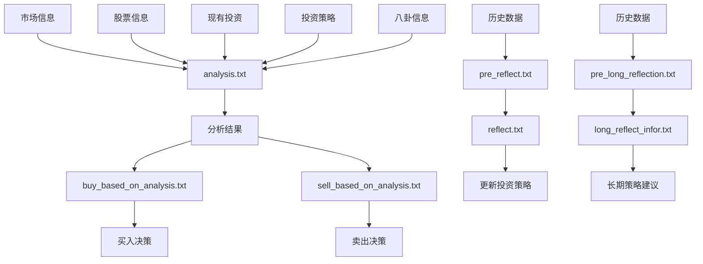

# 提示模板设计与管理

<cite>
**本文档引用文件**  
- [analysis.txt](file://Agent-Trading-Arena/Stock_Main/content/our_prompt_template/analysis.txt)
- [buy_based_on_analysis.txt](file://Agent-Trading-Arena/Stock_Main/content/our_prompt_template/buy_based_on_analysis.txt)
- [sell_based_on_analysis.txt](file://Agent-Trading-Arena/Stock_Main/content/our_prompt_template/sell_based_on_analysis.txt)
- [gossip.txt](file://Agent-Trading-Arena/Stock_Main/content/our_prompt_template/gossip.txt)
- [reflect.txt](file://Agent-Trading-Arena/Stock_Main/content/our_prompt_template/reflect.txt)
- [long_reflect_infor.txt](file://Agent-Trading-Arena/Stock_Main/content/our_prompt_template/long_reflect_infor.txt)
- [pre_reflect.txt](file://Agent-Trading-Arena/Stock_Main/content/our_prompt_template/pre_reflect.txt)
- [pre_long_reflection.txt](file://Agent-Trading-Arena/Stock_Main/content/our_prompt_template/pre_long_reflection.txt)
- [gossip_info.txt](file://Agent-Trading-Arena/Stock_Main/content/our_prompt_template/gossip_info.txt)
- [hold_information.txt](file://Agent-Trading-Arena/Stock_Main/content/our_prompt_template/hold_information.txt)
- [reflect_info.txt](file://Agent-Trading-Arena/Stock_Main/content/our_prompt_template/reflect_info.txt)
- [stock_information.txt](file://Agent-Trading-Arena/Stock_Main/content/our_prompt_template/stock_information.txt)
- [our_run_gpt_prompt.py](file://Agent-Trading-Arena/Stock_Main/content/our_run_gpt_prompt.py)
- [gpt_structure.py](file://Agent-Trading-Arena/Stock_Main/content/gpt_structure.py)
- [day0_iter0_market_analysis_prompt.txt](file://Agent-Trading-Arena/Stock_Main/save/sim_test01/debug_prompts/day0_iter0_market_analysis_prompt.txt)
- [day0_short_reflection_prompt.txt](file://Agent-Trading-Arena/Stock_Main/save/sim_test01/debug_prompts/day0_short_reflection_prompt.txt)
- [day0_long_reflection_prompt.txt](file://Agent-Trading-Arena/Stock_Main/save/sim_test01/debug_prompts/day0_long_reflection_prompt.txt)
</cite>

## 目录
1. [引言](#引言)
2. [提示模板架构概览](#提示模板架构概览)
3. [市场分析模板分析](#市场分析模板分析)
4. [交易决策模板分析](#交易决策模板分析)
5. [信息传播模板分析](#信息传播模板分析)
6. [反思机制模板分析](#反思机制模板分析)
7. [动态变量与数据填充机制](#动态变量与数据填充机制)
8. [模板优化实践建议](#模板优化实践建议)
9. [结论](#结论)

## 引言
本项目构建了一个基于大语言模型的模拟股票交易系统，其中提示模板（Prompt Template）是驱动智能体决策的核心组件。这些模板通过结构化的方式引导LLM进行市场分析、交易决策、信息传播和策略反思。本文档深入解析our_prompt_template目录中各类提示模板的设计理念与功能分工，结合实际运行生成的调试文件，展示模板的动态填充过程，并提供优化建议。

## 提示模板架构概览
系统中的提示模板按照功能划分为多个类别，形成一个完整的决策闭环：
- **市场分析类**：`analysis.txt` - 构建市场分析上下文
- **交易决策类**：`buy_based_on_analysis.txt` 和 `sell_based_on_analysis.txt` - 驱动买卖决策
- **信息传播类**：`gossip.txt` - 模拟信息传播行为
- **反思机制类**：`reflect.txt` 与 `long_reflect_infor.txt` - 支持短期与长期反思
- **辅助模板类**：`stock_information.txt`, `hold_information.txt` 等 - 提供标准化数据格式

**Diagram sources**
- [analysis.txt](file://Agent-Trading-Arena/Stock_Main/content/our_prompt_template/analysis.txt)
- [buy_based_on_analysis.txt](file://Agent-Trading-Arena/Stock_Main/content/our_prompt_template/buy_based_on_analysis.txt)
- [sell_based_on_analysis.txt](file://Agent-Trading-Arena/Stock_Main/content/our_prompt_template/sell_based_on_analysis.txt)
- [reflect.txt](file://Agent-Trading-Arena/Stock_Main/content/our_prompt_template/reflect.txt)
- [long_reflect_infor.txt](file://Agent-Trading-Arena/Stock_Main/content/our_prompt_template/long_reflect_infor.txt)

## 市场分析模板分析
`analysis.txt` 模板负责构建全面的市场分析上下文，为后续交易决策提供依据。

### 设计理念
该模板采用多源信息融合的设计理念，整合五类关键信息：
1. 股票信息（Stock information）
2. 市场信息（Market information）
3. 八卦信息（Gossip）
4. 现有投资（Existing Investments）
5. 投资策略（Investment strategy）

模板要求智能体基于这些信息总结出指定数量的最重要分析结果，且每个结果必须与投资策略相关联。

### 功能实现
通过`our_run_gpt_prompt.py`中的`analysis()`函数实现，该函数调用多个辅助函数来集成不同来源的信息：
- `integrate_stock_info()`：集成股票信息
- `integrate_hold_info()`：集成持有信息
- `integrate_gossip()`：集成八卦信息

**Section sources**
- [analysis.txt](file://Agent-Trading-Arena/Stock_Main/content/our_prompt_template/analysis.txt)
- [our_run_gpt_prompt.py](file://Agent-Trading-Arena/Stock_Main/content/our_run_gpt_prompt.py#L414-L484)

### 实际运行示例
从调试文件`day0_iter0_market_analysis_prompt.txt`可以看出，模板被成功填充：
- 股票信息包含A、B、C、D四只股票的详细数据
- 市场信息显示市场指数变化为0.00%
- 八卦信息为空
- 现有投资显示未持有任何股票
- 投资策略为"try to maximize profit"

**Diagram sources**
- [analysis.txt](file://Agent-Trading-Arena/Stock_Main/content/our_prompt_template/analysis.txt)
- [our_run_gpt_prompt.py](file://Agent-Trading-Arena/Stock_Main/content/our_run_gpt_prompt.py#L414-L484)
- [day0_iter0_market_analysis_prompt.txt](file://Agent-Trading-Arena/Stock_Main/save/sim_test01/debug_prompts/day0_iter0_market_analysis_prompt.txt)

## 交易决策模板分析
交易决策由`buy_based_on_analysis.txt`和`sell_based_on_analysis.txt`两个模板分别驱动，形成完整的买卖决策机制。

### 买入决策模板
`buy_based_on_analysis.txt`模板用于决定是否买入股票，其核心输入包括：
- 现金金额（Cash amount）
- 最低生活费用（Minimum living expense）
- 股票基本信息（Stock basic information）
- 分析结果（Analysis）
- 投资策略（Investment strategy）

模板要求智能体基于财务状况、股票信息、分析结果和投资策略来决定购买数量和出价。

### 卖出决策模板
`sell_based_on_analysis.txt`模板用于决定是否卖出股票，其核心输入包括：
- 现金金额
- 最低生活费用
- 现有投资（Existing Investments）
- 分析结果
- 投资策略

与买入模板不同，卖出模板重点关注现有投资组合的表现和变现需求。

### 决策流程对比

**Diagram sources**
- [buy_based_on_analysis.txt](file://Agent-Trading-Arena/Stock_Main/content/our_prompt_template/buy_based_on_analysis.txt)
- [sell_based_on_analysis.txt](file://Agent-Trading-Arena/Stock_Main/content/our_prompt_template/sell_based_on_analysis.txt)
- [our_run_gpt_prompt.py](file://Agent-Trading-Arena/Stock_Main/content/our_run_gpt_prompt.py#L486-L619)

**Section sources**
- [buy_based_on_analysis.txt](file://Agent-Trading-Arena/Stock_Main/content/our_prompt_template/buy_based_on_analysis.txt)
- [sell_based_on_analysis.txt](file://Agent-Trading-Arena/Stock_Main/content/our_prompt_template/sell_based_on_analysis.txt)
- [our_run_gpt_prompt.py](file://Agent-Trading-Arena/Stock_Main/content/our_run_gpt_prompt.py#L486-L619)

## 信息传播模板分析
`gossip.txt`模板模拟了金融市场中的信息传播行为，允许智能体生成真实或虚假的市场传闻。

### 设计理念
该模板的设计体现了金融市场中信息不对称和情绪传播的特点：
- 智能体可以生成关于特定股票或整个市场的八卦
- 允许生成虚假信息以误导其他参与者
- 要求虚假信息不能与已知的股票和市场信息冲突

这种设计模拟了现实世界中"市场谣言"的影响机制。

### 实现机制
通过`run_gpt_generate_gossip()`函数实现，该函数使用`gossip_info.txt`作为信息源模板来构建八卦生成的上下文。

模板的灵活性体现在：
- 可以针对特定股票生成信息
- 可以影响整个市场的投资情绪
- 为智能体提供了除直接交易外的另一种市场影响力

**Section sources**
- [gossip.txt](file://Agent-Trading-Arena/Stock_Main/content/our_prompt_template/gossip.txt)
- [gossip_info.txt](file://Agent-Trading-Arena/Stock_Main/content/our_prompt_template/gossip_info.txt)
- [our_run_gpt_prompt.py](file://Agent-Trading-Arena/Stock_Main/content/our_run_gpt_prompt.py#L364-L412)

## 反思机制模板分析
系统实现了短期和长期两种反思机制，分别由`reflect.txt`与`long_reflect_infor.txt`模板支持。

### 短期反思机制
短期反思由`pre_reflect.txt`和`reflect.txt`模板协同实现：
- `pre_reflect.txt`：评估最新投资策略的优缺点
- `reflect.txt`：基于评估结果更新投资策略

该机制在每次迭代后运行，实现策略的快速调整。

### 长期反思机制
长期反思由`pre_long_reflection.txt`和`long_reflect_infor.txt`模板实现：
- 分析过去几天的交易活动
- 提供长期投资策略建议
- 从更宏观的角度优化投资方法

### 反思流程

**Diagram sources**
- [reflect.txt](file://Agent-Trading-Arena/Stock_Main/content/our_prompt_template/reflect.txt)
- [long_reflect_infor.txt](file://Agent-Trading-Arena/Stock_Main/content/our_prompt_template/long_reflect_infor.txt)
- [pre_reflect.txt](file://Agent-Trading-Arena/Stock_Main/content/our_prompt_template/pre_reflect.txt)
- [pre_long_reflection.txt](file://Agent-Trading-Arena/Stock_Main/content/our_prompt_template/pre_long_reflection.txt)

**Section sources**
- [reflect.txt](file://Agent-Trading-Arena/Stock_Main/content/our_prompt_template/reflect.txt)
- [long_reflect_infor.txt](file://Agent-Trading-Arena/Stock_Main/content/our_prompt_template/long_reflect_infor.txt)
- [our_run_gpt_prompt.py](file://Agent-Trading-Arena/Stock_Main/content/our_run_gpt_prompt.py#L305-L362)

## 动态变量与数据填充机制
系统采用`!<INPUT n>!`格式的动态变量来实现模板的灵活填充。

### 变量来源
| 变量格式 | 数据来源 | 替换逻辑 |
|---------|---------|---------|
| `!<INPUT 0>!` | 多种 | 根据模板上下文确定具体数据源 |
| `!<INPUT 1>!` | 多种 | 依次替换为相应的输入参数 |
| `!<INPUT 2>!` | 多种 | 通过`generate_prompt()`函数批量替换 |

### 填充逻辑
核心填充逻辑在`gpt_structure.py`的`generate_prompt()`函数中实现：
1. 读取模板文件内容
2. 遍历输入参数列表
3. 将`!<INPUT n>!`替换为对应的参数值
4. 移除注释标记之间的内容
5. 返回填充后的完整提示

### 实际填充示例
从`day0_short_reflection_prompt.txt`可以看出，当没有历史数据时，模板中的变量被替换为空值，但仍保持了完整的提示结构。

**Section sources**
- [gpt_structure.py](file://Agent-Trading-Arena/Stock_Main/content/gpt_structure.py#L283-L308)
- [our_run_gpt_prompt.py](file://Agent-Trading-Arena/Stock_Main/content/our_run_gpt_prompt.py)
- [day0_short_reflection_prompt.txt](file://Agent-Trading-Arena/Stock_Main/save/sim_test01/debug_prompts/day0_short_reflection_prompt.txt)

## 模板优化实践建议
基于对现有模板系统的分析，提出以下优化建议：

### 结构化输出设计
1. **标准化输出格式**：在`example_output`中明确定义期望的输出结构
2. **增强验证函数**：改进`__chat_func_validate()`以更严格地验证输出格式
3. **使用JSON格式**：考虑将输出格式统一为JSON，便于程序解析

### 角色设定一致性
1. **统一角色描述**：确保所有模板中的角色描述保持一致
2. **明确目标导向**：强化"最大化利润"这一核心目标的表述
3. **避免角色冲突**：确保不同模板间的指令不会产生矛盾

### 防止LLM偏离目标的约束策略
1. **增加约束条件**：在任务描述中加入更多具体约束
2. **实施多轮验证**：通过`repeat`参数实现多次生成和验证
3. **设置安全机制**：利用`fail_safe_response`处理异常情况
4. **强化格式要求**：在`special_instruction`中明确格式规范

### 其他优化建议
1. **模板复用**：提取公共部分作为基础模板
2. **参数化设计**：将固定数值参数化，提高灵活性
3. **错误处理**：完善异常情况下的处理逻辑
4. **性能监控**：记录模板生成和LLM响应的时间

## 结论
our_prompt_template目录中的提示模板构成了一个完整的智能体决策系统。通过市场分析、交易决策、信息传播和反思机制四个核心模块的协同工作，系统实现了复杂的模拟股票交易功能。动态变量机制和数据填充逻辑确保了模板的灵活性和可重用性。未来可通过优化结构化输出、增强角色一致性、完善约束策略等方式进一步提升系统性能和稳定性。