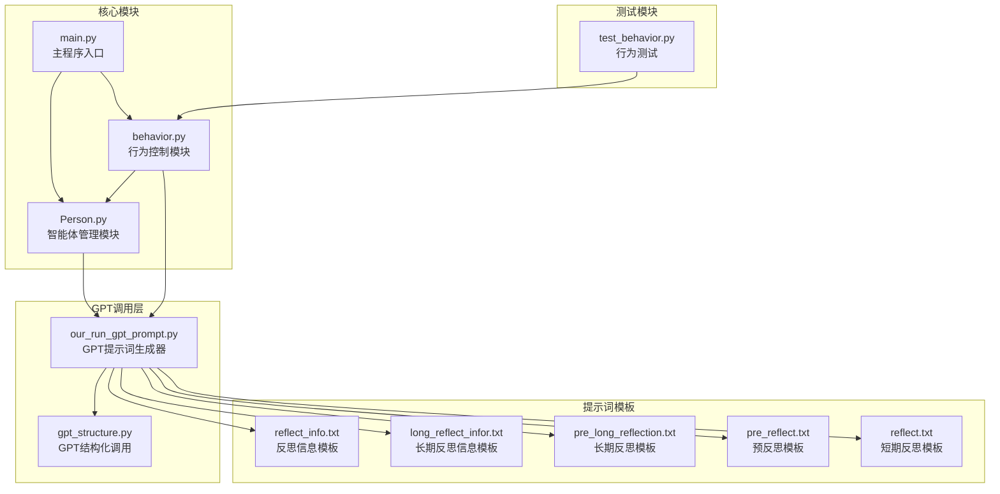
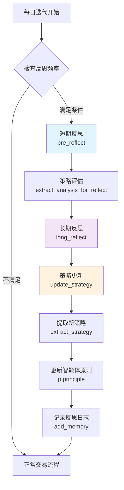
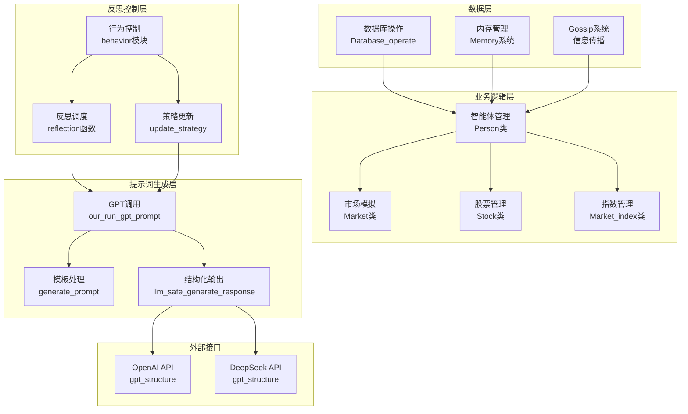
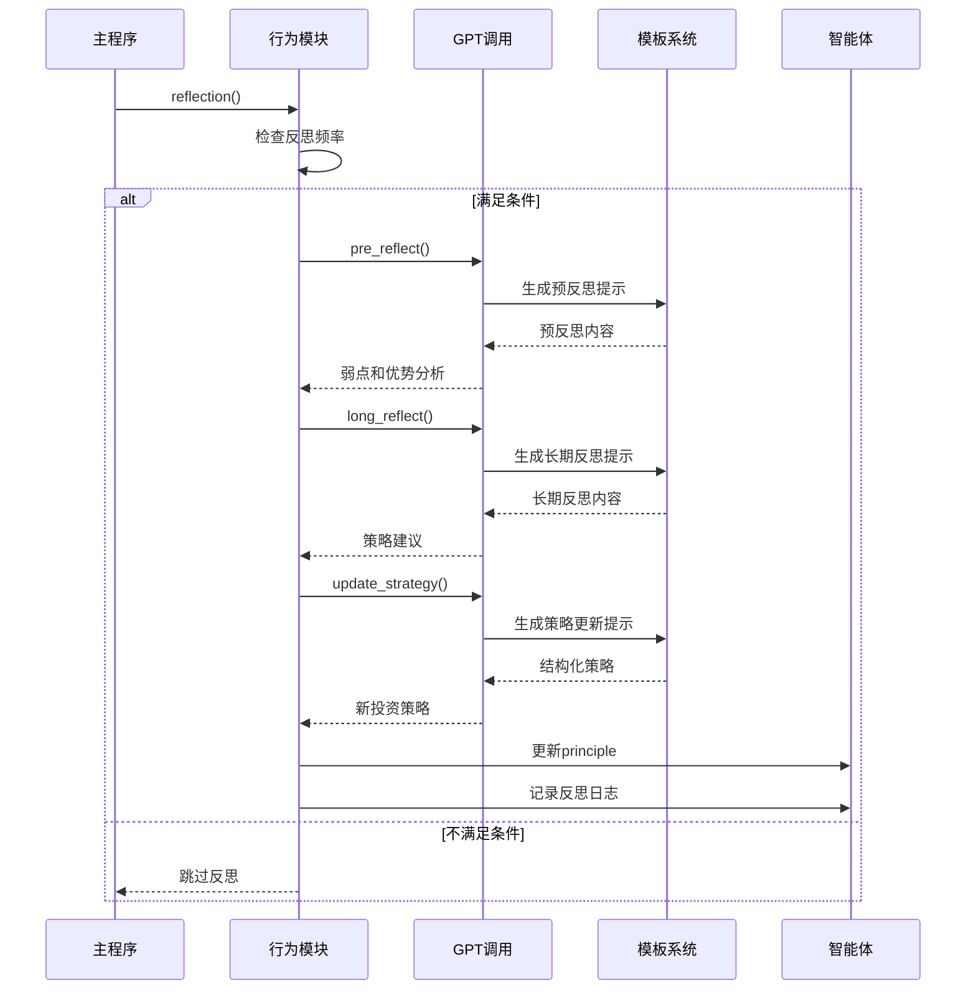
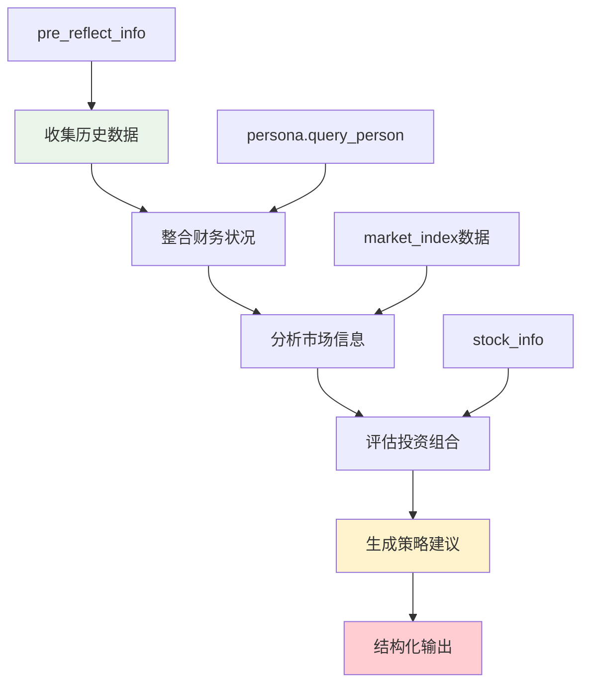
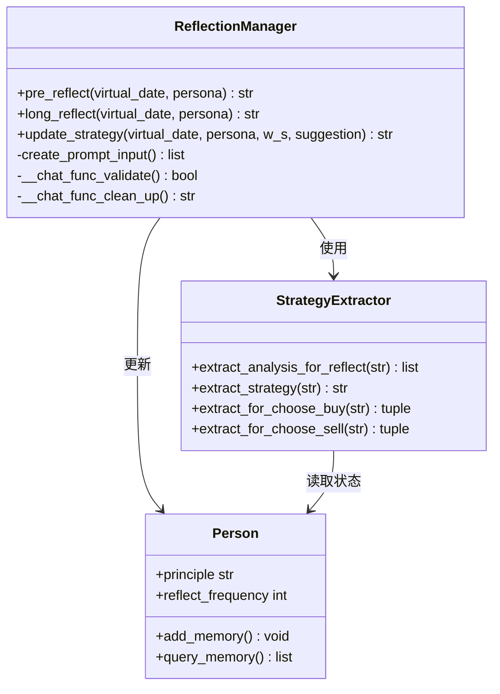
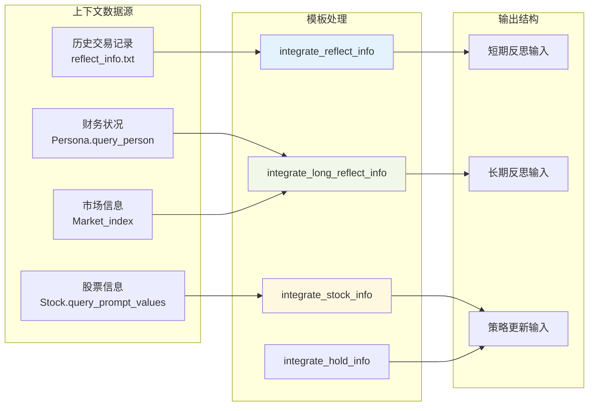
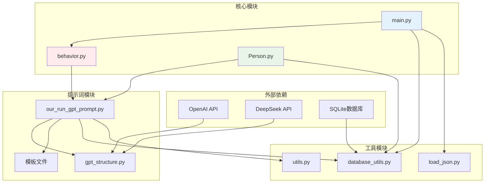
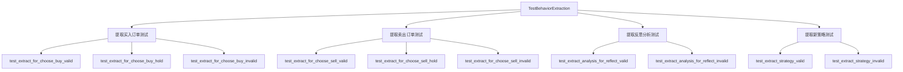

# 智能体反思与策略更新机制

<cite>
**本文档引用的文件**
- [reflect.txt](file://Agent-Trading-Arena/Stock_Main/content/our_prompt_template/reflect.txt)
- [long_reflect_infor.txt](file://Agent-Trading-Arena/Stock_Main/content/our_prompt_template/long_reflect_infor.txt)
- [pre_long_reflection.txt](file://Agent-Trading-Arena/Stock_Main/content/our_prompt_template/pre_long_reflection.txt)
- [pre_reflect.txt](file://Agent-Trading-Arena/Stock_Main/content/our_prompt_template/pre_reflect.txt)
- [reflect_info.txt](file://Agent-Trading-Arena/Stock_Main/content/our_prompt_template/reflect_info.txt)
- [our_run_gpt_prompt.py](file://Agent-Trading-Arena/Stock_Main/content/our_run_gpt_prompt.py)
- [behavior.py](file://Agent-Trading-Arena/Stock_Main/behavior.py)
- [Person.py](file://Agent-Trading-Arena/Stock_Main/Person.py)
- [main.py](file://Agent-Trading-Arena/Stock_Main/main.py)
- [gpt_structure.py](file://Agent-Trading-Arena/Stock_Main/content/gpt_structure.py)
- [test_behavior.py](file://Agent-Trading-Arena/Stock_Main/unit_test/test_behavior.py)
</cite>

## 目录
1. [简介](#简介)
2. [项目结构](#项目结构)
3. [核心组件](#核心组件)
4. [架构概览](#架构概览)
5. [详细组件分析](#详细组件分析)
6. [依赖关系分析](#依赖关系分析)
7. [性能考虑](#性能考虑)
8. [故障排除指南](#故障排除指南)
9. [结论](#结论)

## 简介

本项目实现了一个智能体反思与策略更新机制，通过多层级的反思模板和GPT调用来实现从短期反思到长期策略重构的完整闭环。该机制包含三个核心反思层次：短期反思（reflect.txt）、中期策略评估（pre_long_reflection.txt）和长期策略重构（long_reflect_infor.txt），并通过行为模块将反思结果转化为可执行的策略更新指令。

## 项目结构

项目采用模块化设计，主要包含以下核心目录和文件：



**图表来源**
- [behavior.py](file://Agent-Trading-Arena/Stock_Main/behavior.py#L1-L210)
- [Person.py](file://Agent-Trading-Arena/Stock_Main/Person.py#L1-L629)
- [main.py](file://Agent-Trading-Arena/Stock_Main/main.py#L1-L151)

**章节来源**
- [main.py](file://Agent-Trading-Arena/Stock_Main/main.py#L1-L151)
- [behavior.py](file://Agent-Trading-Arena/Stock_Main/behavior.py#L1-L210)

## 核心组件

### 反思机制架构

系统实现了三层反思机制，每层都有特定的触发条件和处理逻辑：



**图表来源**
- [behavior.py](file://Agent-Trading-Arena/Stock_Main/behavior.py#L174-L199)
- [our_run_gpt_prompt.py](file://Agent-Trading-Arena/Stock_Main/content/our_run_gpt_prompt.py#L151-L212)

### 提示词模板系统

系统使用模板驱动的方式生成反思内容，每个模板都有明确的变量定义和格式要求：

| 模板名称 | 触发条件 | 输入参数 | 输出格式 |
|---------|---------|---------|---------|
| reflect.txt | 短期反思 | 反思信息、弱点、优势、建议 | 新投资策略 |
| pre_reflect.txt | 预反思 | 历史数据 | 弱点和优势分析 |
| pre_long_reflection.txt | 长期反思 | 多日数据 | 策略建议 |
| long_reflect_infor.txt | 长期反思信息 | 财务状况、市场信息 | 结构化反思信息 |

**章节来源**
- [reflect.txt](file://Agent-Trading-Arena/Stock_Main/content/our_prompt_template/reflect.txt#L1-L35)
- [pre_reflect.txt](file://Agent-Trading-Arena/Stock_Main/content/our_prompt_template/pre_reflect.txt#L1-L22)
- [pre_long_reflection.txt](file://Agent-Trading-Arena/Stock_Main/content/our_prompt_template/pre_long_reflection.txt#L1-L21)
- [long_reflect_infor.txt](file://Agent-Trading-Arena/Stock_Main/content/our_prompt_template/long_reflect_infor.txt#L1-L25)

## 架构概览

系统采用分层架构设计，从底层的数据访问到上层的策略执行形成完整的处理链路：



**图表来源**
- [Person.py](file://Agent-Trading-Arena/Stock_Main/Person.py#L1-L629)
- [behavior.py](file://Agent-Trading-Arena/Stock_Main/behavior.py#L1-L210)
- [our_run_gpt_prompt.py](file://Agent-Trading-Arena/Stock_Main/content/our_run_gpt_prompt.py#L1-L628)
- [gpt_structure.py](file://Agent-Trading-Arena/Stock_Main/content/gpt_structure.py#L1-L372)

## 详细组件分析

### 短期反思机制（reflect.txt）

短期反思机制负责在每次满足反思频率条件时进行快速策略评估：



**图表来源**
- [behavior.py](file://Agent-Trading-Arena/Stock_Main/behavior.py#L174-L199)
- [our_run_gpt_prompt.py](file://Agent-Trading-Arena/Stock_Main/content/our_run_gpt_prompt.py#L151-L212)

短期反思的核心特点：
- **触发条件**：`(iter + 1) % p.reflect_frequency == 0`
- **输入数据**：最近3天的历史交易数据
- **输出结果**：结构化的投资策略建议

### 长期策略重构机制（long_reflect_infor.txt）

长期策略重构机制提供更宏观的视角，基于多日数据进行深度分析：



**图表来源**
- [our_run_gpt_prompt.py](file://Agent-Trading-Arena/Stock_Main/content/our_run_gpt_prompt.py#L213-L249)
- [Person.py](file://Agent-Trading-Arena/Stock_Main/Person.py#L582-L613)

长期反思的关键要素：
- **时间范围**：最近3天的数据
- **数据维度**：财务状况、市场指数、股票信息、投资策略
- **输出格式**：标准化的反思信息结构

### 策略更新执行流程

策略更新机制将反思结果转化为具体的行动指导：



**图表来源**
- [our_run_gpt_prompt.py](file://Agent-Trading-Arena/Stock_Main/content/our_run_gpt_prompt.py#L151-L361)
- [behavior.py](file://Agent-Trading-Arena/Stock_Main/behavior.py#L58-L80)
- [Person.py](file://Agent-Trading-Arena/Stock_Main/Person.py#L514-L545)

**章节来源**
- [our_run_gpt_prompt.py](file://Agent-Trading-Arena/Stock_Main/content/our_run_gpt_prompt.py#L151-L361)
- [behavior.py](file://Agent-Trading-Arena/Stock_Main/behavior.py#L58-L80)

### 数据流与上下文准备

系统通过多个模板协同工作，确保反思过程具备充分的上下文信息：



**图表来源**
- [our_run_gpt_prompt.py](file://Agent-Trading-Arena/Stock_Main/content/our_run_gpt_prompt.py#L114-L148)
- [our_run_gpt_prompt.py](file://Agent-Trading-Arena/Stock_Main/content/our_run_gpt_prompt.py#L213-L249)
- [reflect_info.txt](file://Agent-Trading-Arena/Stock_Main/content/our_prompt_template/reflect_info.txt#L1-L30)

## 依赖关系分析

系统各模块之间的依赖关系呈现清晰的分层结构：



**图表来源**
- [main.py](file://Agent-Trading-Arena/Stock_Main/main.py#L1-L151)
- [behavior.py](file://Agent-Trading-Arena/Stock_Main/behavior.py#L1-L210)
- [Person.py](file://Agent-Trading-Arena/Stock_Main/Person.py#L1-L629)
- [our_run_gpt_prompt.py](file://Agent-Trading-Arena/Stock_Main/content/our_run_gpt_prompt.py#L1-L628)
- [gpt_structure.py](file://Agent-Trading-Arena/Stock_Main/content/gpt_structure.py#L1-L372)

**章节来源**
- [main.py](file://Agent-Trading-Arena/Stock_Main/main.py#L1-L151)
- [gpt_structure.py](file://Agent-Trading-Arena/Stock_Main/content/gpt_structure.py#L1-L372)

## 性能考虑

### 计算成本优化

系统在性能方面采用了多项优化策略：

1. **条件反射机制**：通过`reflect_frequency`参数控制反思频率，避免不必要的计算开销
2. **数据缓存**：利用数据库存储历史数据，减少重复计算
3. **批量处理**：在单次迭代中处理多个智能体的反思请求

### 内存管理

```python
# 反思频率控制示例
if p.reflect_frequency == 0:
    pass  # 禁用反思
elif (iter + 1) % p.reflect_frequency == 0:
    # 执行反思逻辑
```

### 并发处理

系统支持多智能体并发处理，通过随机打乱顺序确保公平性：

```python
rand = random.sample(range(0, args.Num_Person), args.Num_Person)
for i in rand:
    for j in range(2): 
        op = ops[i][j]
        persons[i].create_order(i, op, virtual_date, iter)
```

## 故障排除指南

### 常见问题与解决方案

1. **GPT响应格式错误**
   - 检查`__chat_func_validate`函数的正则表达式匹配
   - 确保模板输出符合预期格式要求

2. **反思频率配置问题**
   - 验证`reflect_frequency`参数设置是否合理
   - 检查智能体初始化时的参数传递

3. **数据库连接异常**
   - 确认数据库表结构正确创建
   - 检查SQL语句的语法和参数绑定

### 测试验证

单元测试覆盖了关键功能的验证：



**图表来源**
- [test_behavior.py](file://Agent-Trading-Arena/Stock_Main/unit_test/test_behavior.py#L17-L103)

**章节来源**
- [test_behavior.py](file://Agent-Trading-Arena/Stock_Main/unit_test/test_behavior.py#L1-L107)

## 结论

本智能体反思与策略更新机制通过多层次的反思模板和结构化的GPT调用，实现了从短期策略微调到长期策略重构的完整闭环。系统的主要优势包括：

1. **模块化设计**：清晰的分层架构便于维护和扩展
2. **灵活的反思机制**：支持不同频率和深度的反思策略
3. **强健的错误处理**：完善的验证和清理机制确保系统稳定性
4. **可测试性**：完整的单元测试覆盖关键功能

通过合理配置反思频率和深度，可以在计算成本与策略优化收益之间找到最佳平衡点，为智能体的持续学习和适应提供了坚实基础。