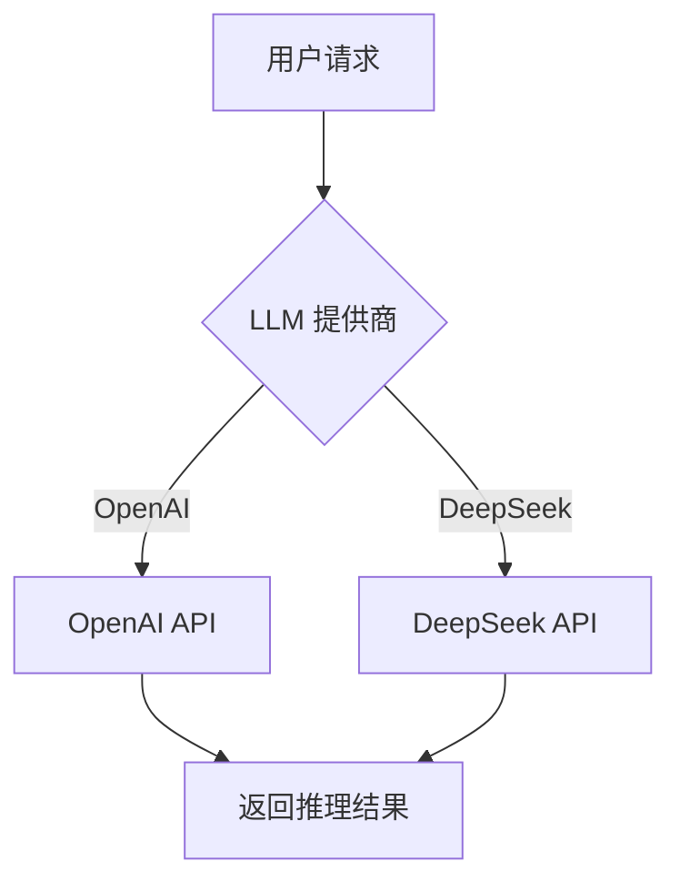
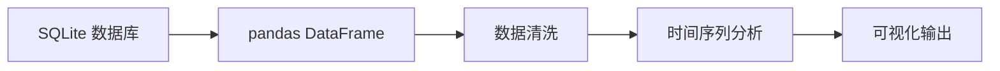
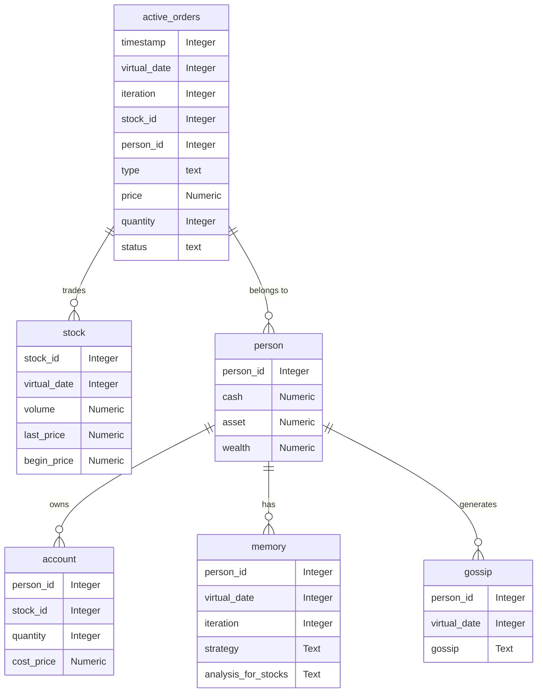

# 技术栈与依赖

<cite>
**本文档中引用的文件**  
- [requirement.txt](file://requirement.txt)
- [utils.py](file://Agent-Trading-Arena/Stock_Main/content/utils.py)
- [database_utils.py](file://Agent-Trading-Arena/Stock_Main/database_utils.py)
- [gpt_structure.py](file://Agent-Trading-Arena/Stock_Main/content/gpt_structure.py)
- [main.py](file://Agent-Trading-Arena/Stock_Main/main.py)
</cite>

## 目录
1. [项目概述](#项目概述)
2. [外部依赖库分析](#外部依赖库分析)
3. [内部工具模块](#内部工具模块)
4. [版本兼容性与替代方案](#版本兼容性与替代方案)
5. [依赖管理最佳实践](#依赖管理最佳实践)
6. [总结](#总结)

## 项目概述

Agent Trading Arena 是一个闭环、无先验知识的类人交易环境，旨在评估和推进具备自博弈能力的金融智能体。该项目通过大语言模型（LLM）驱动的代理进行股票交易模拟，结合数值计算、数据分析和可视化技术，构建了一个完整的交易生态系统。

系统通过 `requirement.txt` 文件管理所有外部依赖，核心功能包括：使用 OpenAI API 进行推理决策、通过环境变量管理配置、利用 numpy/pandas 进行数值计算与数据分析、使用 matplotlib/mplfinance 实现可视化，以及通过 sqlite3 进行本地数据持久化。

**Section sources**
- [README.md](file://README.md)

## 外部依赖库分析

### OpenAI（LLM 推理接口）
OpenAI 库是本项目的核心组件，用于连接大语言模型 API，实现智能体的决策推理功能。系统通过 `gpt_structure.py` 中的 `llm_request`、`llm_chat_request` 等函数封装了对 OpenAI API 的调用，支持文本生成、多模态请求和嵌入向量生成。

项目还支持通过环境变量切换至 DeepSeek 等其他 LLM 提供商，体现了良好的可扩展性。在 `utils.py` 中通过 `llm_provider` 配置项实现 LLM 提供商的动态选择。



**Diagram sources**
- [gpt_structure.py](file://Agent-Trading-Arena/Stock_Main/content/gpt_structure.py#L25-L115)
- [utils.py](file://Agent-Trading-Arena/Stock_Main/content/utils.py#L18-L45)

**Section sources**
- [gpt_structure.py](file://Agent-Trading-Arena/Stock_Main/content/gpt_structure.py)
- [utils.py](file://Agent-Trading-Arena/Stock_Main/content/utils.py)

### python-dotenv（环境变量管理）
python-dotenv 库用于加载和管理环境变量，确保敏感信息（如 API 密钥）与代码分离。在 `utils.py` 中，系统通过 `load_dotenv()` 函数从 `.env` 文件加载配置，并支持向上三级目录搜索该文件，提高了配置的灵活性。

环境变量包括 `OPENAI_API_KEY`、`LLM_PROVIDER`、`OPENAI_MODEL` 等，实现了关键参数的外部化配置。

**Section sources**
- [utils.py](file://Agent-Trading-Arena/Stock_Main/content/utils.py#L1-L17)

### numpy/pandas（数值计算与数据分析）
numpy 和 pandas 库在项目中承担着核心的数值计算和数据处理任务。在 `database_utils.py` 中，`stock_` 函数使用 pandas 将数据库查询结果转换为 DataFrame，并进行时间序列处理和数据清洗。

numpy 用于数值精度控制，如 `round_two_decimal` 函数中对浮点数的格式化处理，确保金融计算的准确性。



**Diagram sources**
- [database_utils.py](file://Agent-Trading-Arena/Stock_Main/database_utils.py#L196-L199)

**Section sources**
- [database_utils.py](file://Agent-Trading-Arena/Stock_Main/database_utils.py)

### matplotlib/mplfinance（可视化）
matplotlib 和 mplfinance 库用于生成股票价格的可视化图表。虽然相关代码被注释，但在 `database_utils.py` 中的 `save_plot_stocks` 函数（已注释）显示了使用 mplfinance 绘制 K 线图的意图。

系统计划生成每日股票的 K 线图，并保存为 JPEG 格式，为交易分析提供直观的视觉支持。

**Section sources**
- [database_utils.py](file://Agent-Trading-Arena/Stock_Main/database_utils.py#L203-L215)

### sqlite3（本地数据持久化）
sqlite3 作为轻量级数据库引擎，承担着系统的核心数据持久化功能。在 `database_utils.py` 中，`Database_operate` 类封装了数据库的初始化、表创建、SQL 执行和数据查询等操作。

系统创建了多个数据表，包括 `active_orders`（活跃订单）、`stock`（股票信息）、`person`（人物信息）、`account`（账户信息）、`memory`（记忆信息）和 `gossip`（流言信息），构建了完整的交易数据模型。



**Diagram sources**
- [database_utils.py](file://Agent-Trading-Arena/Stock_Main/database_utils.py#L245-L300)

**Section sources**
- [database_utils.py](file://Agent-Trading-Arena/Stock_Main/database_utils.py)

## 内部工具模块

### utils.py（通用功能封装）
`utils.py` 模块封装了环境变量加载、LLM 配置管理、路径处理等通用功能。它实现了：
- 环境变量的智能加载（向上搜索 .env 文件）
- LLM 提供商的动态配置与切换
- 全局常量定义（如调试模式、资源路径）

该模块作为系统的配置中心，为其他组件提供统一的配置访问接口。

**Section sources**
- [utils.py](file://Agent-Trading-Arena/Stock_Main/content/utils.py)

### database_utils.py（数据库操作封装）
`database_utils.py` 模块提供了完整的数据库操作封装，包括：
- `Database_operate` 类：数据库连接、SQL 执行、事务管理
- 多个 `parse_` 函数：将数据库查询结果解析为结构化字典列表
- `round_two_decimal`：浮点数精度控制
- `submit_order`：订单提交功能
- `trans_url`：图像转 Base64 URL

该模块通过面向对象的方式封装了数据库操作，提高了代码的可维护性和复用性。

**Section sources**
- [database_utils.py](file://Agent-Trading-Arena/Stock_Main/database_utils.py)

## 版本兼容性与替代方案

### 版本兼容性建议
- **Python**: 建议使用 3.10 版本，与项目开发环境保持一致
- **OpenAI**: 使用最新稳定版，确保支持 gpt-4 等模型
- **pandas/numpy**: 建议使用 1.x 系列版本，避免 API 变更带来的兼容性问题
- **sqlite3**: 使用 Python 标准库版本，无需额外安装

### 可选替代方案
#### 数据库后端替代
虽然当前使用 sqlite3，但系统架构支持其他数据库后端的替换：
- **PostgreSQL**: 适用于大规模并发场景，提供更好的事务支持
- **MySQL**: 适用于已有 MySQL 生态的企业环境
- **MongoDB**: 适用于需要存储非结构化记忆数据的场景

替换时需修改 `Database_operate` 类的连接字符串和 SQL 语法，但上层接口可保持不变。

#### LLM 提供商替代
系统已内置对 DeepSeek 的支持，可轻松切换至其他 OpenAI 兼容 API：
- **Anthropic Claude**
- **Google Gemini**
- **本地部署的 LLM**

通过修改 `.env` 文件中的 `LLM_PROVIDER` 变量即可实现切换。

**Section sources**
- [utils.py](file://Agent-Trading-Arena/Stock_Main/content/utils.py#L18-L45)
- [database_utils.py](file://Agent-Trading-Arena/Stock_Main/database_utils.py#L245-L300)

## 依赖管理最佳实践

### 虚拟环境配置
建议使用虚拟环境隔离项目依赖：
```bash
python -m venv venv
source venv/bin/activate  # Linux/Mac
# 或 venv\Scripts\activate  # Windows
pip install -r requirement.txt
```

### 依赖更新策略
1. **定期更新**: 使用 `pip list --outdated` 检查过期包
2. **测试验证**: 更新后运行单元测试确保功能正常
3. **锁定版本**: 在生产环境中使用 `pip freeze > requirement.txt` 锁定版本
4. **安全扫描**: 使用 `pip-audit` 检查依赖中的安全漏洞

### 环境变量管理
- 将 `.env` 文件加入 `.gitignore`，避免泄露敏感信息
- 提供 `.env.example` 文件作为模板
- 使用 `os.getenv()` 的默认值参数确保配置的健壮性

**Section sources**
- [requirement.txt](file://requirement.txt)
- [utils.py](file://Agent-Trading-Arena/Stock_Main/content/utils.py)

## 总结

Agent Trading Arena 项目构建了一个完整的技术栈，通过 OpenAI 实现智能决策，利用 numpy/pandas 进行数据分析，通过 matplotlib/mplfinance 实现可视化，并使用 sqlite3 进行数据持久化。内部工具模块 `utils.py` 和 `database_utils.py` 有效封装了通用功能，提高了代码的可维护性。

项目设计具有良好的扩展性，支持 LLM 提供商和数据库后端的替换。遵循虚拟环境和依赖管理的最佳实践，可确保项目的稳定运行和持续发展。