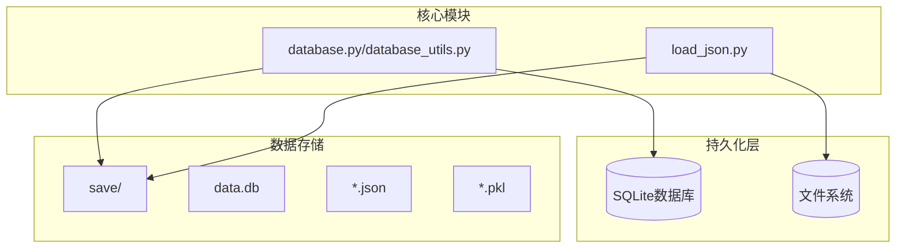
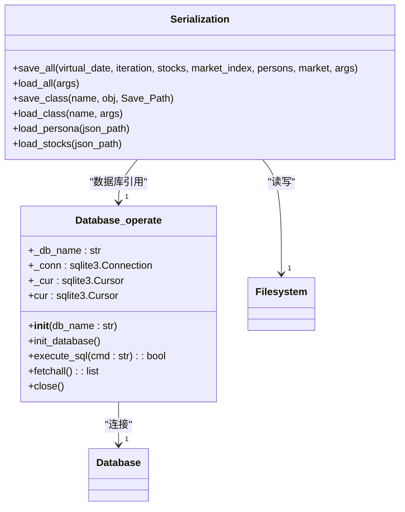
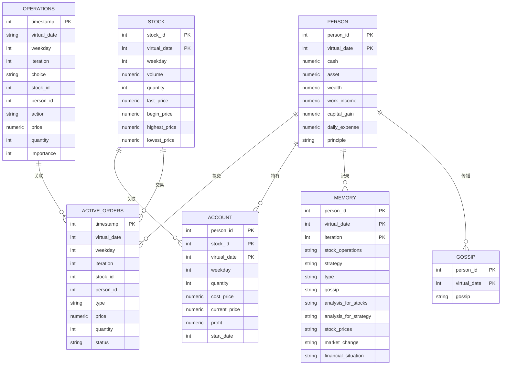
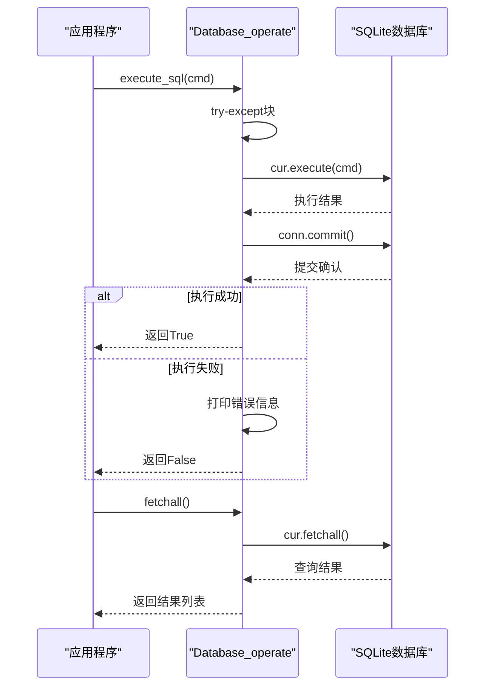
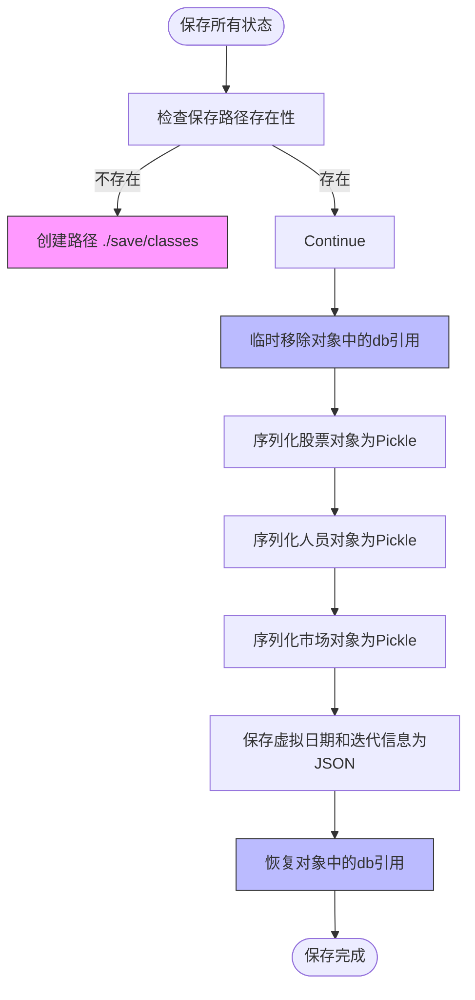
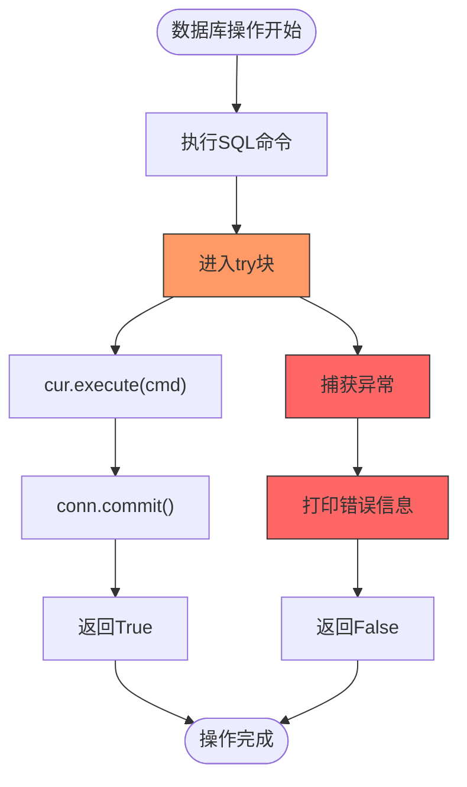
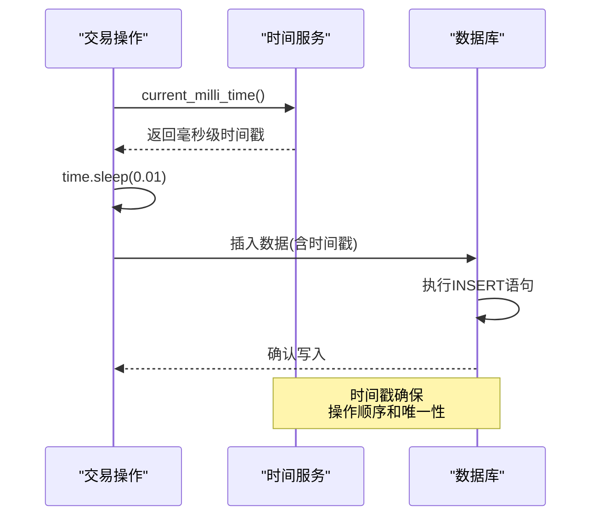

# 持久化机制

<cite>
**本文档中引用的文件**   
- [database.py](file://Agent-Trading-Arena/Stock_Main/database.py)
- [database_utils.py](file://Agent-Trading-Arena/Stock_Main/database_utils.py)
- [load_json.py](file://Agent-Trading-Arena/Stock_Main/load_json.py)
- [main.py](file://Agent-Trading-Arena/Stock_Main/main.py)
- [constant.py](file://Agent-Trading-Arena/Stock_Main/constant.py)
- [save/init/persona.json](file://Agent-Trading-Arena/Stock_Main/save/init/persona.json)
- [save/init/stocks.json](file://Agent-Trading-Arena/Stock_Main/save/init/stocks.json)
- [save/sim_test01/information.json](file://Agent-Trading-Arena/Stock_Main/save/sim_test01/information.json)
</cite>

## 目录
1. [项目结构](#项目结构)
2. [核心持久化组件](#核心持久化组件)
3. [数据库初始化与表结构](#数据库初始化与表结构)
4. [CRUD操作实现](#crud操作实现)
5. [序列化策略与文件存储](#序列化策略与文件存储)
6. [事务管理与异常处理](#事务管理与异常处理)
7. [数据写入与时间戳机制](#数据写入与时间戳机制)
8. [存储场景对比分析](#存储场景对比分析)

## 项目结构

项目采用混合持久化策略，结合SQLite数据库和文件系统实现状态持久化。核心持久化相关文件位于`Stock_Main`目录下，主要包含数据库操作模块和序列化工具。

**图示来源**
- [database_utils.py](file://Agent-Trading-Arena/Stock_Main/database_utils.py#L245-L322)
- [load_json.py](file://Agent-Trading-Arena/Stock_Main/load_json.py#L25-L77)
- [main.py](file://Agent-Trading-Arena/Stock_Main/main.py#L78-L85)

**本节来源**
- [database_utils.py](file://Agent-Trading-Arena/Stock_Main/database_utils.py#L1-L322)
- [load_json.py](file://Agent-Trading-Arena/Stock_Main/load_json.py#L1-L134)

## 核心持久化组件

系统通过`Database_operate`类和`save_all`/`load_all`函数实现双重持久化机制。`Database_operate`负责数据库层面的CRUD操作，而序列化函数则处理对象级别的状态保存。

**图示来源**
- [database_utils.py](file://Agent-Trading-Arena/Stock_Main/database_utils.py#L245-L322)
- [load_json.py](file://Agent-Trading-Arena/Stock_Main/load_json.py#L25-L77)

**本节来源**
- [database_utils.py](file://Agent-Trading-Arena/Stock_Main/database_utils.py#L245-L322)
- [load_json.py](file://Agent-Trading-Arena/Stock_Main/load_json.py#L25-L77)

## 数据库初始化与表结构

`Database_operate`类在初始化时自动创建多个数据表，涵盖交易操作、股票行情、用户信息等核心实体。表结构设计体现了系统的领域模型。

**图示来源**
- [database_utils.py](file://Agent-Trading-Arena/Stock_Main/database_utils.py#L253-L299)
- [database.py](file://Agent-Trading-Arena/Stock_Main/database.py#L52-L60)

**本节来源**
- [database_utils.py](file://Agent-Trading-Arena/Stock_Main/database_utils.py#L253-L299)
- [database.py](file://Agent-Trading-Arena/Stock_Main/database.py#L52-L60)

## CRUD操作实现

系统通过封装的SQL执行方法实现CRUD操作，确保数据操作的一致性和安全性。`execute_sql`方法包含完整的异常处理和事务提交机制。

**图示来源**
- [database_utils.py](file://Agent-Trading-Arena/Stock_Main/database_utils.py#L302-L310)
- [database.py](file://Agent-Trading-Arena/Stock_Main/database.py#L63-L70)

**本节来源**
- [database_utils.py](file://Agent-Trading-Arena/Stock_Main/database_utils.py#L302-L310)
- [database.py](file://Agent-Trading-Arena/Stock_Main/database.py#L63-L70)

## 序列化策略与文件存储

系统采用JSON和Pickle混合序列化策略，JSON用于基础配置数据，Pickle用于复杂对象的完整状态保存。`save/`目录下的运行结果按时间戳组织。

**图示来源**
- [load_json.py](file://Agent-Trading-Arena/Stock_Main/load_json.py#L45-L77)
- [main.py](file://Agent-Trading-Arena/Stock_Main/main.py#L134)

**本节来源**
- [load_json.py](file://Agent-Trading-Arena/Stock_Main/load_json.py#L45-L77)
- [main.py](file://Agent-Trading-Arena/Stock_Main/main.py#L134)

## 事务管理与异常处理

系统在数据库操作层面实现了完整的事务管理，每个SQL命令执行后立即提交，确保数据一致性。同时，通过try-catch机制捕获并处理可能的数据库异常。

**图示来源**
- [database_utils.py](file://Agent-Trading-Arena/Stock_Main/database_utils.py#L302-L310)
- [database.py](file://Agent-Trading-Arena/Stock_Main/database.py#L63-L70)

**本节来源**
- [database_utils.py](file://Agent-Trading-Arena/Stock_Main/database_utils.py#L302-L310)
- [database.py](file://Agent-Trading-Arena/Stock_Main/database.py#L63-L70)

## 数据写入与时间戳机制

系统在数据写入时生成精确到毫秒的时间戳，确保操作的时序性和唯一性。通过`current_milli_time`函数获取当前时间戳，并在写入前添加微小延迟以避免冲突。

**图示来源**
- [database.py](file://Agent-Trading-Arena/Stock_Main/database.py#L96)
- [database_utils.py](file://Agent-Trading-Arena/Stock_Main/database_utils.py#L10)
- [database.py](file://Agent-Trading-Arena/Stock_Main/database.py#L101-L103)

**本节来源**
- [database.py](file://Agent-Trading-Arena/Stock_Main/database.py#L96)
- [database_utils.py](file://Agent-Trading-Arena/Stock_Main/database_utils.py#L10)
- [database.py](file://Agent-Trading-Arena/Stock_Main/database.py#L101-L103)

## 存储场景对比分析

系统根据数据特性和访问模式选择合适的存储策略。结构化、高频访问的数据使用数据库存储，而复杂对象状态和配置数据则采用文件存储。

| 存储特性 | 数据库存储 | 文件存储 |
|---------|----------|---------|
| **数据类型** | 结构化交易数据、实时行情 | 对象状态、配置信息 |
| **访问频率** | 高频读写 | 低频读写 |
| **数据量** | 大量小记录 | 少量大对象 |
| **查询需求** | 复杂查询、关联查询 | 全量读取、简单查询 |
| **性能要求** | 低延迟、高吞吐 | 一次性读写 |
| **一致性要求** | 强一致性 | 最终一致性 |
| **典型表/文件** | operations, active_orders | persona.json, stocks.json |
| **序列化方式** | SQL记录 | JSON/Pickle |
| **优势** | ACID特性、索引优化 | 简单直接、对象完整保存 |
| **劣势** | 连接开销、复杂性 | 无查询能力、并发问题 |

**本节来源**
- [database_utils.py](file://Agent-Trading-Arena/Stock_Main/database_utils.py#L253-L299)
- [load_json.py](file://Agent-Trading-Arena/Stock_Main/load_json.py#L45-L77)
- [main.py](file://Agent-Trading-Arena/Stock_Main/main.py#L134)
- [save/init/persona.json](file://Agent-Trading-Arena/Stock_Main/save/init/persona.json)
- [save/init/stocks.json](file://Agent-Trading-Arena/Stock_Main/save/init/stocks.json)