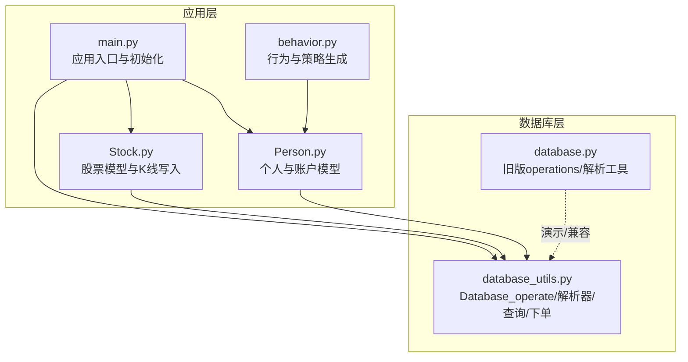
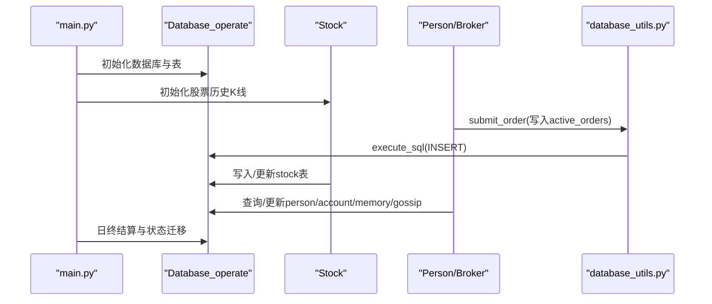
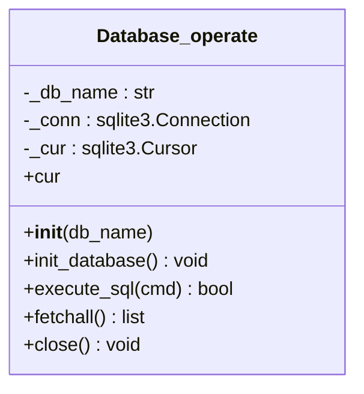
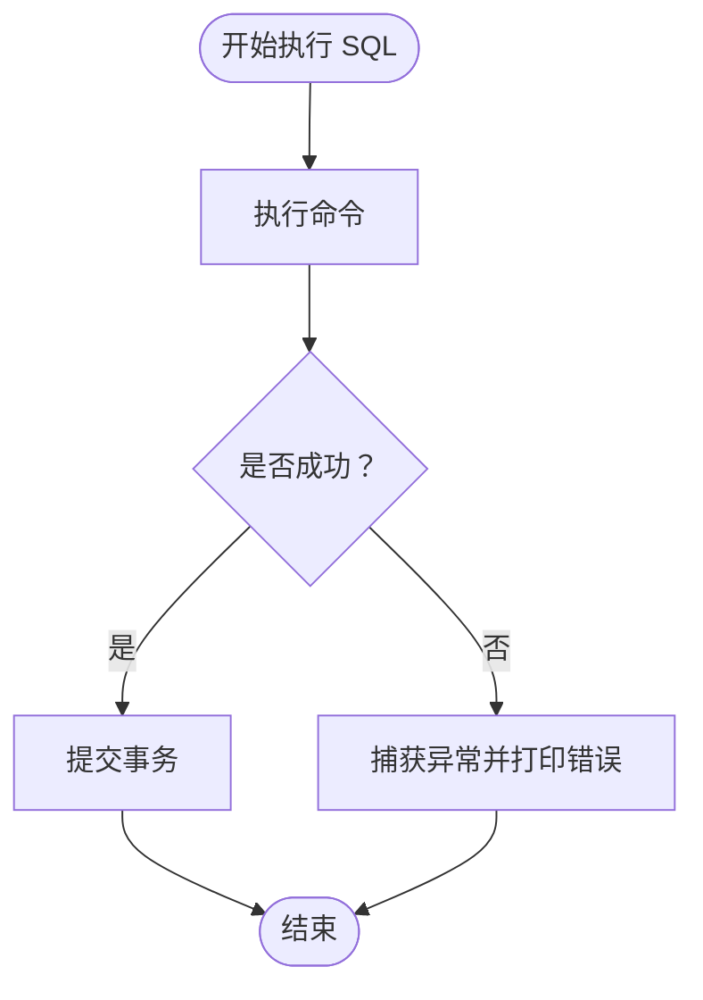
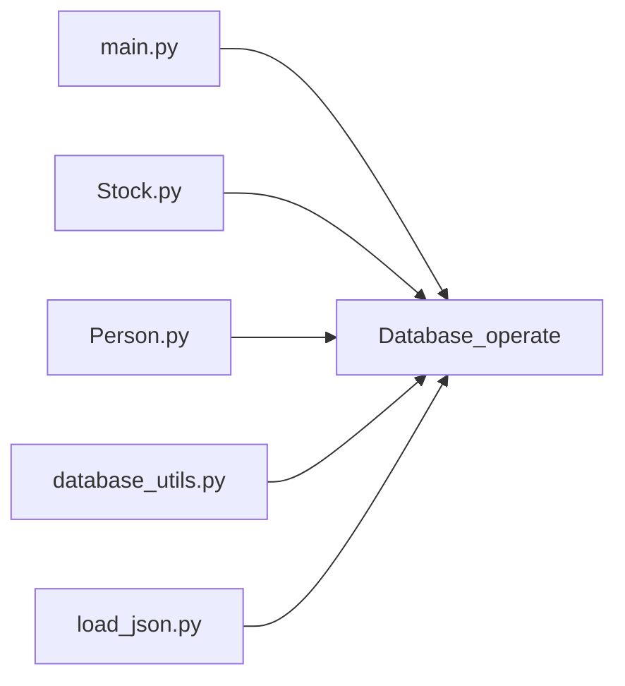

# 数据库持久化

<cite>
**本文引用的文件列表**
- [database.py](file://Agent-Trading-Arena/Stock_Main/database.py)
- [database_utils.py](file://Agent-Trading-Arena/Stock_Main/database_utils.py)
- [main.py](file://Agent-Trading-Arena/Stock_Main/main.py)
- [Stock.py](file://Agent-Trading-Arena/Stock_Main/Stock.py)
- [Person.py](file://Agent-Trading-Arena/Stock_Main/Person.py)
- [behavior.py](file://Agent-Trading-Arena/Stock_Main/behavior.py)
- [load_json.py](file://Agent-Trading-Arena/Stock_Main/load_json.py)
- [test_database_utils.py](file://Agent-Trading-Arena/Stock_Main/unit_test/test_database_utils.py)
</cite>

## 目录
1. [简介](#简介)
2. [项目结构](#项目结构)
3. [核心组件](#核心组件)
4. [架构总览](#架构总览)
5. [详细组件分析](#详细组件分析)
6. [依赖关系分析](#依赖关系分析)
7. [性能考量](#性能考量)
8. [故障排查指南](#故障排查指南)
9. [结论](#结论)
10. [附录](#附录)

## 简介
本文件聚焦于 Agent Trading Arena 的数据库持久化机制，系统性阐述 database.py 中 Database_operate 类的设计与实现，以及 database_utils.py 中的辅助函数如何协同完成市场交易数据、活跃订单、股票状态、账户资产、记忆与闲话等多维度数据的结构化存储。文档覆盖：
- 表初始化（operations、active_orders、stock、person、account、memory、gossip）
- CRUD 操作接口与事务管理
- 异常处理策略
- 时间戳生成、连接管理与线程安全考量
- 实际调用示例：订单记录插入、历史查询与状态同步
- 数据库模式设计的性能优化与一致性保障

## 项目结构
该项目采用“功能模块化 + 层次清晰”的组织方式，数据库相关代码主要分布在以下文件：
- database.py：包含旧版 operations 表与解析工具，以及演示用的 Database_operate 类
- database_utils.py：包含新版 Database_operate 类、时间戳生成器、各类解析器、订单提交函数与查询函数
- Stock.py、Person.py：业务层对数据库的读写调用
- main.py：应用入口，负责初始化数据库与表
- load_json.py：保存/加载运行状态时对数据库连接的临时断开与恢复
- unit_test/test_database_utils.py：数据库工具与类的单元测试

图表来源
- [main.py](file://Agent-Trading-Arena/Stock_Main/main.py#L66-L96)
- [Stock.py](file://Agent-Trading-Arena/Stock_Main/Stock.py#L14-L66)
- [Person.py](file://Agent-Trading-Arena/Stock_Main/Person.py#L143-L249)
- [database_utils.py](file://Agent-Trading-Arena/Stock_Main/database_utils.py#L245-L321)
- [database.py](file://Agent-Trading-Arena/Stock_Main/database.py#L44-L133)

章节来源
- [main.py](file://Agent-Trading-Arena/Stock_Main/main.py#L66-L96)
- [database_utils.py](file://Agent-Trading-Arena/Stock_Main/database_utils.py#L245-L321)
- [database.py](file://Agent-Trading-Arena/Stock_Main/database.py#L44-L133)

## 核心组件
- Database_operate：封装 SQLite 连接、表初始化、SQL 执行、结果获取与关闭
- 解析器函数：将查询结果映射为字典列表，统一字段命名
- 订单提交函数：标准化活跃订单写入
- 时间戳生成：毫秒级时间戳，用于唯一性与排序
- 查询函数：按日期/身份/类型等条件检索数据

章节来源
- [database_utils.py](file://Agent-Trading-Arena/Stock_Main/database_utils.py#L245-L321)
- [database_utils.py](file://Agent-Trading-Arena/Stock_Main/database_utils.py#L10-L154)
- [database_utils.py](file://Agent-Trading-Arena/Stock_Main/database_utils.py#L224-L243)
- [database_utils.py](file://Agent-Trading-Arena/Stock_Main/database_utils.py#L162-L172)

## 架构总览
数据库持久化贯穿交易流程：每日开盘前初始化表，随后在迭代中写入活跃订单、更新股票状态、维护账户资产与个人记忆，最终在日终进行结算与状态迁移。下图展示了关键交互：

图表来源
- [main.py](file://Agent-Trading-Arena/Stock_Main/main.py#L66-L96)
- [Stock.py](file://Agent-Trading-Arena/Stock_Main/Stock.py#L28-L66)
- [Person.py](file://Agent-Trading-Arena/Stock_Main/Person.py#L212-L249)
- [database_utils.py](file://Agent-Trading-Arena/Stock_Main/database_utils.py#L224-L243)

## 详细组件分析

### Database_operate 类设计与实现
- 职责
  - 维护 SQLite 连接与游标
  - 初始化多张业务表（active_orders、stock、person、account、memory、gossip）
  - 提供 execute_sql、fetchall、close 等通用接口
- 表初始化
  - active_orders：记录活跃买卖订单，含类型、价格、数量、状态等
  - stock：记录每日K线（开盘/最高/最低/收盘/成交量等）
  - person：记录个人财务与策略信息
  - account：记录持有股票的成本价、当前价、盈亏、起始日期等
  - memory：记录个人迭代内的操作、分析、闲话等
  - gossip：记录闲话传播
- 事务管理
  - execute_sql 在执行后立即 commit，确保每条语句的原子性
  - 关闭时也显式 commit 后 close，避免未提交数据丢失
- 异常处理
  - 捕获异常并打印错误信息与当前 SQL，返回 False；调用方据此判断是否继续
- 线程安全
  - 当前实现为单连接单游标，非线程安全；并发场景需引入连接池或串行化访问

图表来源
- [database_utils.py](file://Agent-Trading-Arena/Stock_Main/database_utils.py#L245-L321)

章节来源
- [database_utils.py](file://Agent-Trading-Arena/Stock_Main/database_utils.py#L245-L321)

### 表初始化与字段设计
- active_orders
  - 字段：timestamp、virtual_date、weekday、iteration、stock_id、person_id、type、price、quantity、status
  - 约束：type ∈ {'sell','buy'}，status ∈ {'active','closed','finished'}
- stock
  - 字段：stock_id、virtual_date、weekday、volume、quantity、last_price、begin_price、highest_price、lowest_price
- person
  - 字段：person_id、virtual_date、cash、asset、wealth、work_income、capital_gain、daily_expense、principle
- account
  - 字段：person_id、stock_id、virtual_date、weekday、quantity、cost_price、current_price、profit、start_date
- memory
  - 字段：person_id、virtual_date、iteration、stock_operations、strategy、type、gossip、analysis_for_stocks、analysis_for_strategy、stock_prices、market_change、financial_situation
- gossip
  - 字段：person_id、virtual_date、gossip

章节来源
- [database_utils.py](file://Agent-Trading-Arena/Stock_Main/database_utils.py#L256-L300)

### CRUD 接口与调用示例
- 插入活跃订单
  - 调用路径：Person.create_order → submit_order → Database_operate.execute_sql
  - 示例路径：[Person.create_order](file://Agent-Trading-Arena/Stock_Main/Person.py#L212-L249)，[submit_order](file://Agent-Trading-Arena/Stock_Main/database_utils.py#L224-L243)
- 写入/更新股票K线
  - 调用路径：Stock.initialize_stock/Stock.update_trade_data → Database_operate.execute_sql
  - 示例路径：[Stock.initialize_stock](file://Agent-Trading-Arena/Stock_Main/Stock.py#L28-L51)，[Stock.update_trade_data](file://Agent-Trading-Arena/Stock_Main/Stock.py#L67-L113)
- 查询个人资产与账户
  - 调用路径：Person.query_hold_stocks/query_single_stock → Database_operate.execute_sql + parse_accounts
  - 示例路径：[Person.query_hold_stocks](file://Agent-Trading-Arena/Stock_Main/Person.py#L429-L440)，[Person.query_single_stock](file://Agent-Trading-Arena/Stock_Main/Person.py#L441-L452)
- 查询市场指数与K线
  - 调用路径：Stock.query_price/query_daily_return → Database_operate.execute_sql + parse_stocks
  - 示例路径：[Stock.query_price](file://Agent-Trading-Arena/Stock_Main/Stock.py#L114-L127)，[Stock.query_daily_return](file://Agent-Trading-Arena/Stock_Main/Stock.py#L140-L171)
- 写入个人记忆与闲话
  - 调用路径：Person.add_memory/add_gossip → Database_operate.execute_sql
  - 示例路径：[Person.add_memory](file://Agent-Trading-Arena/Stock_Main/Person.py#L514-L546)，[Person.add_gossip](file://Agent-Trading-Arena/Stock_Main/Person.py#L615-L620)

章节来源
- [Person.py](file://Agent-Trading-Arena/Stock_Main/Person.py#L212-L249)
- [Stock.py](file://Agent-Trading-Arena/Stock_Main/Stock.py#L28-L51)
- [Stock.py](file://Agent-Trading-Arena/Stock_Main/Stock.py#L67-L113)
- [Person.py](file://Agent-Trading-Arena/Stock_Main/Person.py#L429-L452)
- [Stock.py](file://Agent-Trading-Arena/Stock_Main/Stock.py#L114-L127)
- [Stock.py](file://Agent-Trading-Arena/Stock_Main/Stock.py#L140-L171)
- [Person.py](file://Agent-Trading-Arena/Stock_Main/Person.py#L514-L546)
- [Person.py](file://Agent-Trading-Arena/Stock_Main/Person.py#L615-L620)

### 事务管理机制与异常处理
- 事务管理
  - execute_sql 每次执行后立即 commit，保证单条 SQL 的原子性
  - close 显式 commit 后关闭连接，避免数据丢失
- 异常处理
  - 捕获异常并打印错误与当前 SQL，返回 False，调用方可据此重试或回滚
- 并发与线程安全
  - 单连接单游标，非线程安全；建议在业务层加锁或使用连接池

图表来源
- [database_utils.py](file://Agent-Trading-Arena/Stock_Main/database_utils.py#L302-L310)

章节来源
- [database_utils.py](file://Agent-Trading-Arena/Stock_Main/database_utils.py#L302-L310)

### 辅助函数与数据解析
- 时间戳生成
  - current_milli_time 返回毫秒级时间戳，用于订单与K线的唯一性与排序
- 解析器
  - parse_stocks/parse_accounts/parse_persons/parse_memory/parse_gossip 将查询结果映射为字典列表，统一字段名
- 订单提交
  - submit_order 标准化写入 active_orders，包含类型、价格、数量、状态等
- 历史查询
  - query_all_stocks 按日期查询所有股票状态

章节来源
- [database_utils.py](file://Agent-Trading-Arena/Stock_Main/database_utils.py#L10-L154)
- [database_utils.py](file://Agent-Trading-Arena/Stock_Main/database_utils.py#L224-L243)
- [database_utils.py](file://Agent-Trading-Arena/Stock_Main/database_utils.py#L162-L172)

### 应用入口与生命周期
- 初始化阶段
  - main.init_all 创建数据库实例，删除现有表并重建，随后初始化股票、市场、经纪人与人员
- 运行阶段
  - 每日循环中，Person.create_order 调用 submit_order 写入活跃订单；Stock.update_trade_data 写入/更新K线；Person.end_of_iteration/end_of_day 更新账户与个人财务
- 结束阶段
  - load_json.save_all 在保存运行状态前临时断开数据库连接，恢复后再继续使用

章节来源
- [main.py](file://Agent-Trading-Arena/Stock_Main/main.py#L66-L96)
- [load_json.py](file://Agent-Trading-Arena/Stock_Main/load_json.py#L45-L77)

## 依赖关系分析
- 模块耦合
  - Stock、Person、Broker 直接依赖 Database_operate 与 database_utils 中的解析器与查询函数
  - main.py 作为入口，协调初始化与生命周期
- 外部依赖
  - sqlite3：本地轻量数据库
  - pandas/mplfinance/matplotlib：可视化（非核心持久化）
- 循环依赖
  - 无明显循环依赖；各模块职责清晰

图表来源
- [main.py](file://Agent-Trading-Arena/Stock_Main/main.py#L66-L96)
- [Stock.py](file://Agent-Trading-Arena/Stock_Main/Stock.py#L14-L66)
- [Person.py](file://Agent-Trading-Arena/Stock_Main/Person.py#L143-L249)
- [database_utils.py](file://Agent-Trading-Arena/Stock_Main/database_utils.py#L245-L321)
- [load_json.py](file://Agent-Trading-Arena/Stock_Main/load_json.py#L45-L77)

章节来源
- [main.py](file://Agent-Trading-Arena/Stock_Main/main.py#L66-L96)
- [Stock.py](file://Agent-Trading-Arena/Stock_Main/Stock.py#L14-L66)
- [Person.py](file://Agent-Trading-Arena/Stock_Main/Person.py#L143-L249)
- [database_utils.py](file://Agent-Trading-Arena/Stock_Main/database_utils.py#L245-L321)
- [load_json.py](file://Agent-Trading-Arena/Stock_Main/load_json.py#L45-L77)

## 性能考量
- 表设计与索引
  - 建议在高频查询字段上建立索引（如 stock_id/virtual_date、person_id/virtual_date、iteration 等），以提升查询效率
- 写入批量化
  - 对于大量 K 线写入，可考虑批量 INSERT 或使用事务包裹多次写入，减少 commit 次数
- 数据类型与精度
  - 使用 NUMERIC 存储价格与金额，配合解析器统一保留两位小数，避免浮点误差累积
- 并发控制
  - 单连接非线程安全，建议引入连接池或在业务层加锁，避免竞态条件
- 清理策略
  - 定期清理过期数据（如历史 memory/gossip），防止表膨胀

## 故障排查指南
- 常见问题
  - SQL 执行失败：检查约束（如 type/status）与字段类型是否匹配
  - 查询为空：确认 virtual_date/stock_id/person_id 是否正确传入
  - 数据不一致：确认是否遗漏 commit 或在并发场景下未加锁
- 调试建议
  - 在 execute_sql 中增加更详细的日志输出
  - 使用 fetchall 前先执行 SQL，再检查返回结果长度
  - 单元测试验证核心路径：[test_database_utils.py](file://Agent-Trading-Arena/Stock_Main/unit_test/test_database_utils.py#L103-L129)

章节来源
- [database_utils.py](file://Agent-Trading-Arena/Stock_Main/database_utils.py#L302-L310)
- [test_database_utils.py](file://Agent-Trading-Arena/Stock_Main/unit_test/test_database_utils.py#L103-L129)

## 结论
Database_operate 类以简洁的封装实现了多表结构化存储，配合解析器与查询函数，支撑了从活跃订单到股票K线、从个人资产到记忆与闲话的全链路数据持久化。通过毫秒级时间戳与严格的约束，系统在一致性方面具备良好基础。为进一步提升性能与可靠性，建议引入索引、批量化写入、连接池与更完善的异常处理与重试机制。

## 附录
- 代码示例路径（不含具体代码内容）
  - 订单记录插入：[Person.create_order](file://Agent-Trading-Arena/Stock_Main/Person.py#L212-L249)，[submit_order](file://Agent-Trading-Arena/Stock_Main/database_utils.py#L224-L243)
  - 历史查询：[Stock.query_daily_return](file://Agent-Trading-Arena/Stock_Main/Stock.py#L140-L171)，[Stock.query_price](file://Agent-Trading-Arena/Stock_Main/Stock.py#L114-L127)
  - 状态同步：[Person.end_of_iteration](file://Agent-Trading-Arena/Stock_Main/Person.py#L309-L362)，[Person.end_of_day](file://Agent-Trading-Arena/Stock_Main/Person.py#L364-L427)