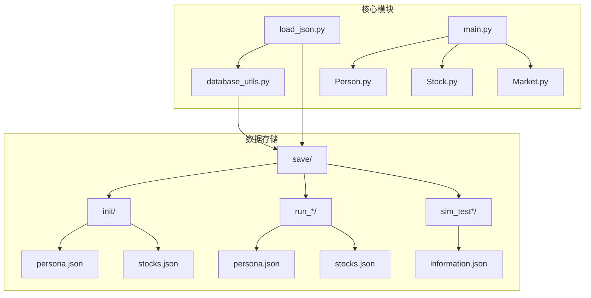
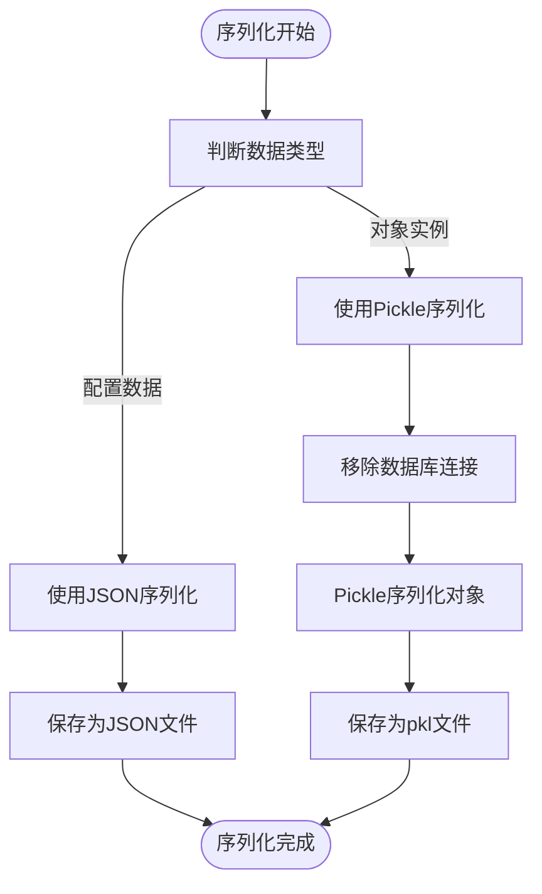
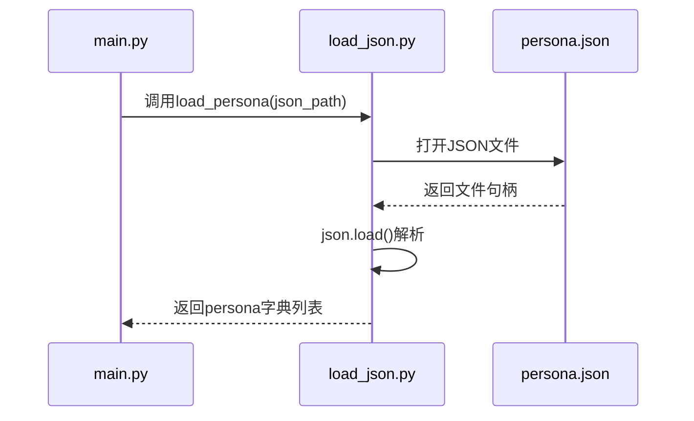
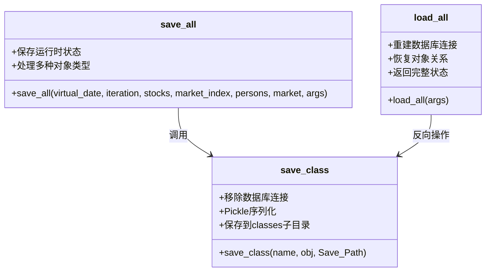
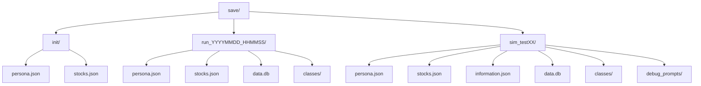
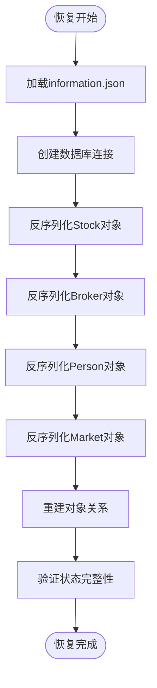
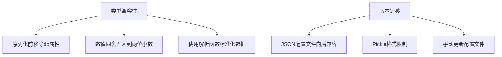
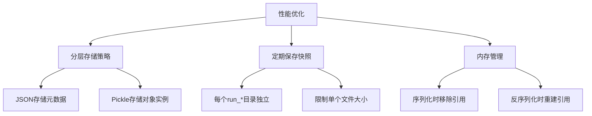

# 文件序列化

<cite>
**本文档中引用的文件**  
- [load_json.py](file://Agent-Trading-Arena/Stock_Main/load_json.py)
- [database_utils.py](file://Agent-Trading-Arena/Stock_Main/database_utils.py)
- [main.py](file://Agent-Trading-Arena/Stock_Main/main.py)
- [Person.py](file://Agent-Trading-Arena/Stock_Main/Person.py)
- [Stock.py](file://Agent-Trading-Arena/Stock_Main/Stock.py)
- [Market.py](file://Agent-Trading-Arena/Stock_Main/Market.py)
- [save/init/persona.json](file://Agent-Trading-Arena/Stock_Main/save/init/persona.json)
- [save/init/stocks.json](file://Agent-Trading-Arena/Stock_Main/save/init/stocks.json)
- [save/sim_test01/information.json](file://Agent-Trading-Arena/Stock_Main/save/sim_test01/information.json)
</cite>

## 目录
1. [项目结构](#项目结构)
2. [核心序列化机制](#核心序列化机制)
3. [JSON配置加载机制](#json配置加载机制)
4. [复杂对象序列化处理](#复杂对象序列化处理)
5. [文件组织结构](#文件组织结构)
6. [状态恢复流程](#状态恢复流程)
7. [类型兼容性与版本迁移](#类型兼容性与版本迁移)
8. [性能优化策略](#性能优化策略)

## 项目结构

项目采用模块化设计，核心文件位于`Stock_Main`目录下，通过`main.py`作为入口点启动模拟。序列化相关功能主要分布在`load_json.py`和`database_utils.py`中，而模拟状态的保存和恢复通过`save/`目录下的文件系统实现。

**图源**
- [main.py](file://Agent-Trading-Arena/Stock_Main/main.py#L1-L151)
- [load_json.py](file://Agent-Trading-Arena/Stock_Main/load_json.py#L1-L134)
- [database_utils.py](file://Agent-Trading-Arena/Stock_Main/database_utils.py#L1-L322)

**节源**
- [main.py](file://Agent-Trading-Arena/Stock_Main/main.py#L1-L151)
- [load_json.py](file://Agent-Trading-Arena/Stock_Main/load_json.py#L1-L134)

## 核心序列化机制

系统采用混合序列化策略，结合JSON和Pickle两种格式的优势。JSON用于存储结构化配置数据，如初始人物和股票信息；Pickle则用于序列化复杂的Python对象实例，如Person、Stock、Market等运行时对象。

**图源**
- [load_json.py](file://Agent-Trading-Arena/Stock_Main/load_json.py#L25-L77)
- [database_utils.py](file://Agent-Trading-Arena/Stock_Main/database_utils.py#L1-L322)

**节源**
- [load_json.py](file://Agent-Trading-Arena/Stock_Main/load_json.py#L1-L134)
- [database_utils.py](file://Agent-Trading-Arena/Stock_Main/database_utils.py#L1-L322)

## JSON配置加载机制

`load_json.py`中的`load_persona`和`load_stocks`函数负责加载初始配置。这些函数使用标准的JSON模块读取配置文件，将JSON数据反序列化为Python字典列表，供系统初始化使用。

**图源**
- [load_json.py](file://Agent-Trading-Arena/Stock_Main/load_json.py#L9-L23)
- [main.py](file://Agent-Trading-Arena/Stock_Main/main.py#L66-L97)

**节源**
- [load_json.py](file://Agent-Trading-Arena/Stock_Main/load_json.py#L9-L23)
- [main.py](file://Agent-Trading-Arena/Stock_Main/main.py#L66-L97)

## 复杂对象序列化处理

`database_utils.py`中的`save_all`和`load_all`函数处理复杂对象的序列化。系统通过`save_class`函数将对象实例序列化为Pickle格式，同时在序列化前移除数据库连接等不可序列化属性。

**图源**
- [load_json.py](file://Agent-Trading-Arena/Stock_Main/load_json.py#L45-L122)
- [database_utils.py](file://Agent-Trading-Arena/Stock_Main/database_utils.py#L245-L322)

**节源**
- [load_json.py](file://Agent-Trading-Arena/Stock_Main/load_json.py#L45-L122)
- [database_utils.py](file://Agent-Trading-Arena/Stock_Main/database_utils.py#L245-L322)

## 文件组织结构

`save/`目录采用分层命名规范，包含三种类型的子目录：`init/`用于存储初始配置，`run_*`用于存储运行时快照，`sim_test*`用于存储测试结果。这种结构清晰地区分了不同阶段的模拟数据。

**图源**
- [main.py](file://Agent-Trading-Arena/Stock_Main/main.py#L42-L63)
- [load_json.py](file://Agent-Trading-Arena/Stock_Main/load_json.py#L46-L49)
- [project_structure](file://project_structure)

**节源**
- [main.py](file://Agent-Trading-Arena/Stock_Main/main.py#L42-L63)
- [load_json.py](file://Agent-Trading-Arena/Stock_Main/load_json.py#L46-L49)

## 状态恢复流程

系统通过`load_all`函数从文件恢复模拟环境。该函数首先重建数据库连接，然后从Pickle文件中反序列化对象实例，最后重新建立对象间的关系，确保系统状态的完整性。

**图源**
- [load_json.py](file://Agent-Trading-Arena/Stock_Main/load_json.py#L81-L122)
- [main.py](file://Agent-Trading-Arena/Stock_Main/main.py#L67-L76)

**节源**
- [load_json.py](file://Agent-Trading-Arena/Stock_Main/load_json.py#L81-L122)
- [main.py](file://Agent-Trading-Arena/Stock_Main/main.py#L67-L76)

## 类型兼容性与版本迁移

系统在序列化过程中通过移除数据库连接等不可序列化属性来确保类型兼容性。版本迁移通过JSON配置文件的向后兼容设计实现，同时Pickle格式的使用限制了跨Python版本的兼容性。

**图源**
- [load_json.py](file://Agent-Trading-Arena/Stock_Main/load_json.py#L29-L30)
- [database_utils.py](file://Agent-Trading-Arena/Stock_Main/database_utils.py#L138-L146)
- [database_utils.py](file://Agent-Trading-Arena/Stock_Main/database_utils.py#L12-L70)

**节源**
- [load_json.py](file://Agent-Trading-Arena/Stock_Main/load_json.py#L29-L30)
- [database_utils.py](file://Agent-Trading-Arena/Stock_Main/database_utils.py#L138-L146)

## 性能优化策略

针对大文件性能瓶颈，系统采用分层存储策略，将元数据存储在JSON文件中，将大型对象实例存储在独立的Pickle文件中。同时，通过定期保存快照来避免单个文件过大。

**图源**
- [load_json.py](file://Agent-Trading-Arena/Stock_Main/load_json.py#L25-L35)
- [main.py](file://Agent-Trading-Arena/Stock_Main/main.py#L134)
- [load_json.py](file://Agent-Trading-Arena/Stock_Main/load_json.py#L45-L77)

**节源**
- [load_json.py](file://Agent-Trading-Arena/Stock_Main/load_json.py#L25-L35)
- [main.py](file://Agent-Trading-Arena/Stock_Main/main.py#L134)