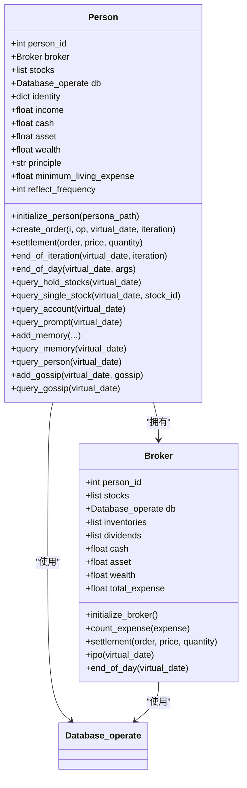
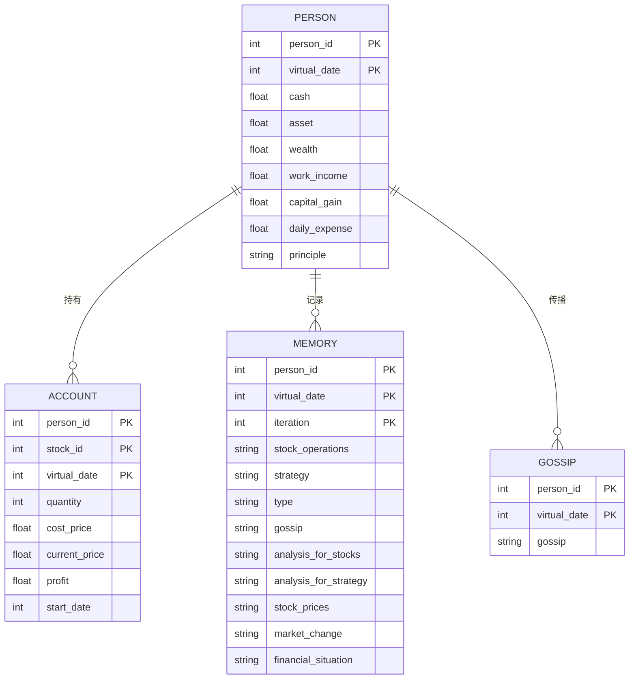

# 人员数据模型

<cite>
**本文档引用文件**  
- [Person.py](file://Agent-Trading-Arena/Stock_Main/Person.py)
- [database_utils.py](file://Agent-Trading-Arena/Stock_Main/database_utils.py)
- [load_json.py](file://Agent-Trading-Arena/Stock_Main/load_json.py)
- [constant.py](file://Agent-Trading-Arena/Stock_Main/constant.py)
- [persona.json](file://Agent-Trading-Arena/Stock_Main/save/init/persona.json)
- [stocks.json](file://Agent-Trading-Arena/Stock_Main/save/init/stocks.json)
</cite>

## 目录
1. [引言](#引言)
2. [核心类结构](#核心类结构)
3. [财务字段详解](#财务字段详解)
4. [复杂数据结构](#复杂数据结构)
5. [数据库映射关系](#数据库映射关系)
6. [数据模型动态更新](#数据模型动态更新)
7. [JSON示例](#json示例)
8. [结论](#结论)

## 引言
本项目构建了一个基于代理的交易模拟系统，其中`Person`类和`Broker`类构成了人员数据模型的核心。该模型通过多维度财务指标、身份信息、持仓记录、记忆与八卦等复杂结构，模拟真实投资者的行为与决策过程。系统通过SQLite数据库持久化存储所有状态变化，并在每日/每轮次交易结束后更新个人财务状况。

## 核心类结构



**图示来源**  
- [Person.py](file://Agent-Trading-Arena/Stock_Main/Person.py#L143-L629)

## 财务字段详解

### person_id
唯一标识每个代理人的整数ID，用于区分不同投资者并在数据库中建立关联关系。

### 现金 (cash)
表示个人当前持有的现金余额。初始值从`persona.json`加载，后续通过工资收入、股票买卖、分红和日常支出动态调整。

### 资产 (asset)
指当前持有的股票市值总和，计算方式为各持仓股票数量 × 当前股价之和。该值在每轮交易结束时通过`end_of_iteration`方法更新。

### 财富 (wealth)
个人总财富，等于现金 + 资产。反映代理人的整体财务状况，在每日结算时通过`end_of_day`方法更新。

### 投资原则 (principle)
存储在`identity`字典中的投资策略描述，如"try to maximize profit."，影响代理人的决策行为。

**本节来源**  
- [Person.py](file://Agent-Trading-Arena/Stock_Main/Person.py#L158-L162)
- [Person.py](file://Agent-Trading-Arena/Stock_Main/Person.py#L179-L181)

## 复杂数据结构

### 身份信息 (identity)
一个包含个人基本信息的字典，包括姓名、职业、投资期限、每日工作收入、初始现金、最低生活开支和反思频率等属性。

### 持仓 (hold_stocks)
通过`account`表维护的持仓记录，包含股票ID、数量、成本价、当前价、利润和起始日期等信息。使用`query_hold_stocks`方法查询。

### 记忆 (memory)
记录每轮交易决策的记忆系统，包含股票操作、投资策略、市场分析、财务状况等上下文信息，用于后续反思与学习。

### 八卦 (gossip)
模拟社交网络中的信息传播机制，允许代理人获取其他代理人的交易信息，影响其投资决策。

**本节来源**  
- [Person.py](file://Agent-Trading-Arena/Stock_Main/Person.py#L163-L168)
- [Person.py](file://Agent-Trading-Arena/Stock_Main/Person.py#L429-L439)
- [Person.py](file://Agent-Trading-Arena/Stock_Main/Person.py#L514-L546)
- [Person.py](file://Agent-Trading-Arena/Stock_Main/Person.py#L615-L628)

## 数据库映射关系



**图示来源**  
- [database_utils.py](file://Agent-Trading-Arena/Stock_Main/database_utils.py#L245-L322)

## 数据模型动态更新

### initialize_person
从`persona.json`文件加载初始配置，设置身份信息、初始现金、投资原则等属性，并向数据库插入初始记录。

### settlement
处理交易结算逻辑：买入时扣除现金并增加资产；卖出时增加现金并减少资产。同时更新持仓成本价和利润。

### end_of_day
每日结算流程：
1. 更新所有持仓股票的市场价格
2. 计算总资产和资本收益
3. 收取股息收入
4. 扣除日常开支
5. 更新财富总额
6. 向数据库插入新的个人状态记录

**本节来源**  
- [Person.py](file://Agent-Trading-Arena/Stock_Main/Person.py#L173-L200)
- [Person.py](file://Agent-Trading-Arena/Stock_Main/Person.py#L250-L308)
- [Person.py](file://Agent-Trading-Arena/Stock_Main/Person.py#L364-L428)

## JSON示例

### 初始人员配置 (persona.json)
```json
[
  {
    "person_id": 0,
    "name": "amy",
    "occupation": "AI researcher",
    "principle": "try to maximize profit.",
    "investment_duration": "one year",
    "daily_income_from_job": "500",
    "cash": 40000,
    "minimum_living_expense": 200,
    "reflect_frequency": 0
  }
]
```

### 持仓查询结果
```json
{
  "Stock_name": "A",
  "Share_number": 100,
  "total_value": 44560.00,
  "captital_gain": 2.34,
  "Price_change": [454.17, 446.64, ...],
  "Current_price_change": 0.85,
  "Current_price": 445.60,
  "Cost_price": 435.20
}
```

**本节来源**  
- [persona.json](file://Agent-Trading-Arena/Stock_Main/save/init/persona.json)
- [Person.py](file://Agent-Trading-Arena/Stock_Main/Person.py#L499-L512)

## 结论
本数据模型通过`Person`和`Broker`两个核心类构建了完整的投资者代理系统。财务字段（现金、资产、财富）动态反映经济状况，复杂结构（身份、持仓、记忆、八卦）支持高级行为模拟。所有状态变化通过数据库持久化，并在关键时间节点（每轮/每日结束）进行系统性更新。这种设计既保证了数据一致性，又为基于LLM的决策系统提供了丰富的上下文信息。