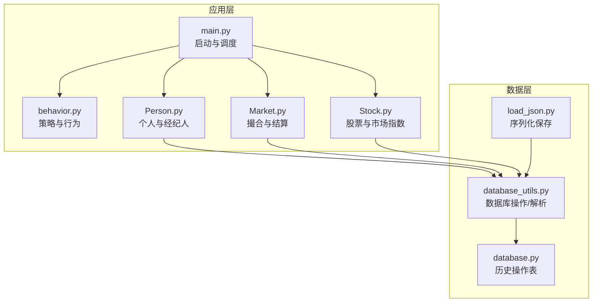
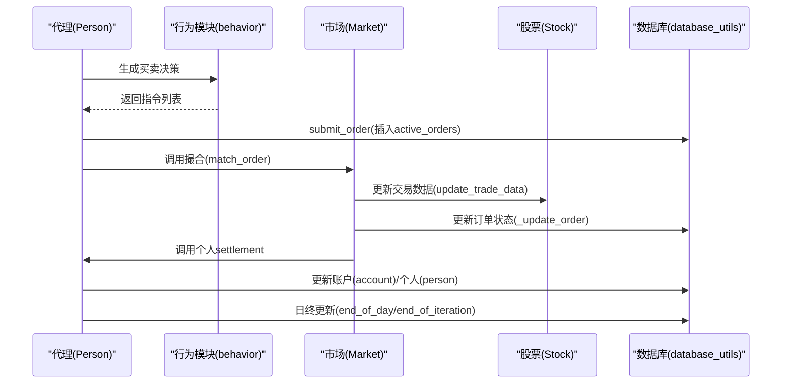
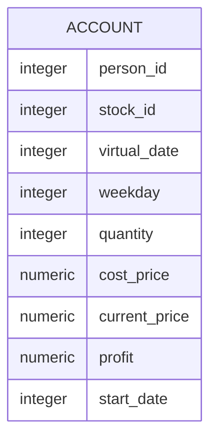
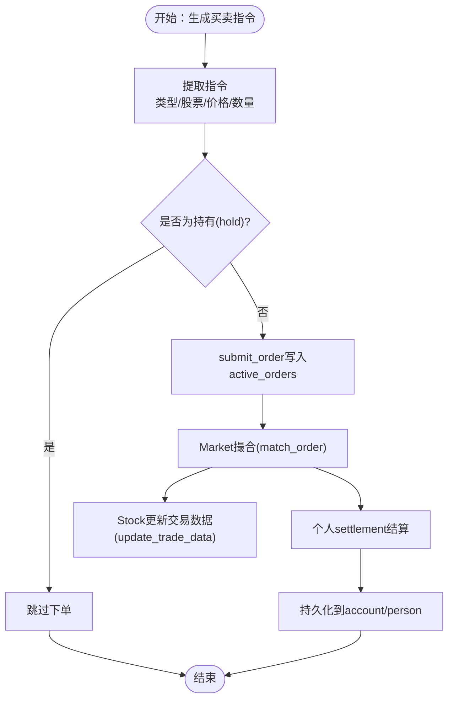
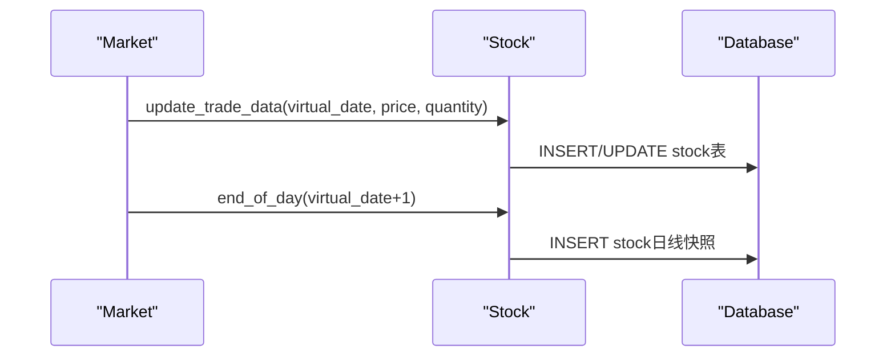
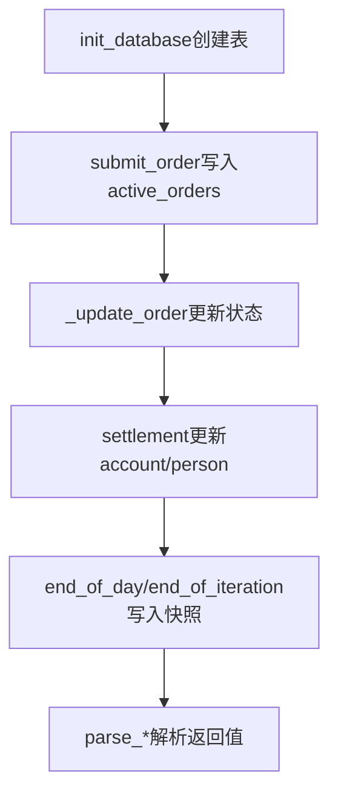
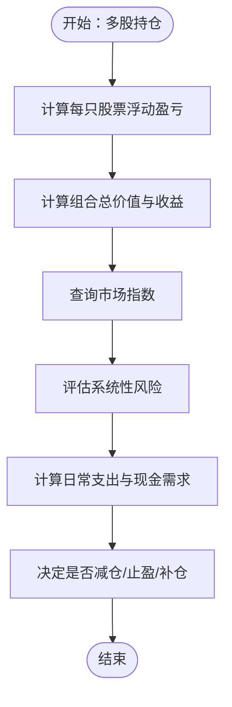
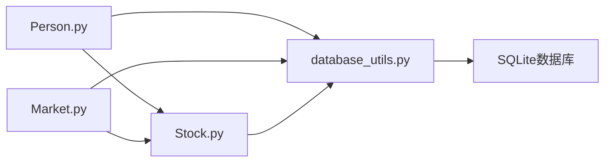

# 持仓与股票管理

<cite>
**本文档引用的文件**
- [Stock.py](file://Agent-Trading-Arena/Stock_Main/Stock.py)
- [Market.py](file://Agent-Trading-Arena/Stock_Main/Market.py)
- [Person.py](file://Agent-Trading-Arena/Stock_Main/Person.py)
- [database_utils.py](file://Agent-Trading-Arena/Stock_Main/database_utils.py)
- [database.py](file://Agent-Trading-Arena/Stock_Main/database.py)
- [load_json.py](file://Agent-Trading-Arena/Stock_Main/load_json.py)
- [main.py](file://Agent-Trading-Arena/Stock_Main/main.py)
- [behavior.py](file://Agent-Trading-Arena/Stock_Main/behavior.py)
- [stocks.json](file://Agent-Trading-Arena/Stock_Main/save/init/stocks.json)
- [persona.json](file://Agent-Trading-Arena/Stock_Main/save/init/persona.json)
</cite>

## 目录
1. [简介](#简介)
2. [项目结构](#项目结构)
3. [核心组件](#核心组件)
4. [架构总览](#架构总览)
5. [详细组件分析](#详细组件分析)
6. [依赖关系分析](#依赖关系分析)
7. [性能考虑](#性能考虑)
8. [故障排查指南](#故障排查指南)
9. [结论](#结论)
10. [附录](#附录)

## 简介
本文件聚焦于Agent Trading Arena中的“持仓与股票管理”子系统，系统性阐述以下内容：
- 持仓数据结构（以账户表为核心）的设计与用途，包括股票代码、持有数量、买入均价、当前价、浮动盈亏等字段的存储方式
- 代理（Person）如何通过行为模块生成买卖指令，并调用下单接口完成交易；以及与市场（Market）、股票（Stock）、数据库工具（database_utils）之间的交互
- 基于数据库工具的数据写入逻辑，解释持仓信息的持久化流程
- 提供典型持仓状态的JSON示例
- 分析多股持仓下的风险管理策略

## 项目结构
该系统围绕“人-市场-股票-数据库”四层进行组织，核心文件如下：
- 数据模型与市场：Stock.py（股票类与市场指数）、Market.py（撮合与结算）
- 人员与交易：Person.py（个人与经纪人）、behavior.py（行为与策略）
- 数据库与持久化：database_utils.py（数据库操作与解析）、database.py（历史操作表）、load_json.py（序列化保存）
- 启动与调度：main.py（主流程）



图表来源
- [main.py](file://Agent-Trading-Arena/Stock_Main/main.py#L99-L146)
- [Person.py](file://Agent-Trading-Arena/Stock_Main/Person.py#L143-L427)
- [Market.py](file://Agent-Trading-Arena/Stock_Main/Market.py#L12-L200)
- [Stock.py](file://Agent-Trading-Arena/Stock_Main/Stock.py#L14-L127)
- [database_utils.py](file://Agent-Trading-Arena/Stock_Main/database_utils.py#L245-L322)
- [database.py](file://Agent-Trading-Arena/Stock_Main/database.py#L44-L125)
- [load_json.py](file://Agent-Trading-Arena/Stock_Main/load_json.py#L45-L77)

章节来源
- [main.py](file://Agent-Trading-Arena/Stock_Main/main.py#L66-L96)
- [database_utils.py](file://Agent-Trading-Arena/Stock_Main/database_utils.py#L245-L322)

## 核心组件
- 股票（Stock）：负责单个股票的历史价格、日内波动、日终记录与查询
- 市场（Market）：负责订单撮合、价格动态调整、日终结算与数据库更新
- 个人（Person）：负责下单、结算、日终资产更新、查询持仓与账户
- 经纪人（Broker）：负责初始库存、资金与账户的初始化，以及日终资产汇总
- 数据库工具（Database_operate/parse_*）：负责数据库连接、建表、SQL执行、结果解析
- 行为模块（behavior）：负责生成买卖指令与记忆记录

章节来源
- [Stock.py](file://Agent-Trading-Arena/Stock_Main/Stock.py#L14-L127)
- [Market.py](file://Agent-Trading-Arena/Stock_Main/Market.py#L12-L200)
- [Person.py](file://Agent-Trading-Arena/Stock_Main/Person.py#L143-L427)
- [database_utils.py](file://Agent-Trading-Arena/Stock_Main/database_utils.py#L245-L322)
- [behavior.py](file://Agent-Trading-Arena/Stock_Main/behavior.py#L82-L171)

## 架构总览
下图展示了从策略到下单、撮合、结算再到持久化的完整流程。



图表来源
- [behavior.py](file://Agent-Trading-Arena/Stock_Main/behavior.py#L82-L171)
- [Person.py](file://Agent-Trading-Arena/Stock_Main/Person.py#L212-L249)
- [Market.py](file://Agent-Trading-Arena/Stock_Main/Market.py#L96-L200)
- [Stock.py](file://Agent-Trading-Arena/Stock_Main/Stock.py#L67-L113)
- [database_utils.py](file://Agent-Trading-Arena/Stock_Main/database_utils.py#L224-L243)

## 详细组件分析

### 持仓数据结构设计与用途
- 存储表：account（账户表）
- 关键字段
  - person_id：账户归属
  - stock_id：股票标识
  - virtual_date：虚拟日期（用于按日快照）
  - weekday：星期几
  - quantity：持有数量
  - cost_price：加权平均成本价
  - current_price：当前价
  - profit：浮动盈亏比例
  - start_date：首次买入日期
- 查询与更新
  - 查询某日某人的全部持仓：按virtual_date与person_id过滤，且quantity>0
  - 新购入：若当日无记录则插入新行；若有则更新quantity与cost_price（加权平均）
  - 新卖出：减少quantity，不删除记录
  - 日终：复制上一日持仓至次日，保持成本价与起始日期不变



图表来源
- [database_utils.py](file://Agent-Trading-Arena/Stock_Main/database_utils.py#L282-L287)

章节来源
- [Person.py](file://Agent-Trading-Arena/Stock_Main/Person.py#L429-L451)
- [Person.py](file://Agent-Trading-Arena/Stock_Main/Person.py#L250-L308)
- [Person.py](file://Agent-Trading-Arena/Stock_Main/Person.py#L364-L427)

### 代理如何通过行为模块生成买卖指令并下单
- 行为模块根据市场分析与消息生成“买入/卖出”指令，格式包含：操作类型、股票名称、价格、数量
- 代理提取指令后，调用下单接口submit_order，写入active_orders表
- 市场在撮合阶段读取active_orders，按规则匹配买卖订单，更新价格与成交量



图表来源
- [behavior.py](file://Agent-Trading-Arena/Stock_Main/behavior.py#L82-L171)
- [Person.py](file://Agent-Trading-Arena/Stock_Main/Person.py#L212-L249)
- [database_utils.py](file://Agent-Trading-Arena/Stock_Main/database_utils.py#L224-L243)
- [Market.py](file://Agent-Trading-Arena/Stock_Main/Market.py#L96-L200)
- [Stock.py](file://Agent-Trading-Arena/Stock_Main/Stock.py#L67-L113)

章节来源
- [behavior.py](file://Agent-Trading-Arena/Stock_Main/behavior.py#L15-L56)
- [Person.py](file://Agent-Trading-Arena/Stock_Main/Person.py#L212-L249)
- [database_utils.py](file://Agent-Trading-Arena/Stock_Main/database_utils.py#L224-L243)

### 与Stock.py和Market.py的交互
- 与Stock.py交互
  - 撮合完成后，Market调用对应Stock的update_trade_data，更新当日开盘/最高/最低/收盘与成交量
  - 日终时调用Stock的end_of_day，写入日线快照
- 与Market.py交互
  - 代理下单后，Market在撮合阶段读取active_orders，按价格优先与时间优先原则匹配
  - 完成撮合后，Market更新订单状态，并调用个人settlement进行资金与持仓结算



图表来源
- [Market.py](file://Agent-Trading-Arena/Stock_Main/Market.py#L96-L200)
- [Stock.py](file://Agent-Trading-Arena/Stock_Main/Stock.py#L52-L113)

章节来源
- [Market.py](file://Agent-Trading-Arena/Stock_Main/Market.py#L96-L200)
- [Stock.py](file://Agent-Trading-Arena/Stock_Main/Stock.py#L52-L113)

### database_utils.py的数据写入逻辑与持久化流程
- 数据库初始化
  - 初始化时创建多个表：active_orders、stock、person、account、memory、gossip
- 写入路径
  - 下单：submit_order写入active_orders
  - 撮合：_update_order更新订单状态，Market调用个人settlement
  - 结算：个人settlement更新account与person表
  - 日终：end_of_day/end_of_iteration写入下一日快照
- 解析与精度
  - parse_*系列函数统一将数据库结果转为字典列表，保留数值精度（保留两位小数）



图表来源
- [database_utils.py](file://Agent-Trading-Arena/Stock_Main/database_utils.py#L253-L301)
- [database_utils.py](file://Agent-Trading-Arena/Stock_Main/database_utils.py#L224-L243)
- [Person.py](file://Agent-Trading-Arena/Stock_Main/Person.py#L250-L308)

章节来源
- [database_utils.py](file://Agent-Trading-Arena/Stock_Main/database_utils.py#L245-L322)
- [Person.py](file://Agent-Trading-Arena/Stock_Main/Person.py#L364-L427)

### 典型持仓状态的JSON示例
以下示例展示某人在某日的持仓快照（基于account表字段），便于理解字段含义与结构：
- 字段说明
  - person_id：账户编号
  - stock_id：股票编号
  - virtual_date：虚拟日期
  - weekday：星期
  - quantity：持有数量
  - cost_price：加权平均成本价
  - current_price：当前价
  - profit：浮动盈亏比例
  - start_date：首次买入日期

```json
{
  "person_id": 0,
  "stock_id": 0,
  "virtual_date": 1,
  "weekday": 1,
  "quantity": 100,
  "cost_price": 437.53,
  "current_price": 445.60,
  "profit": 0.0184,
  "start_date": 0
}
```

章节来源
- [database_utils.py](file://Agent-Trading-Arena/Stock_Main/database_utils.py#L117-L135)
- [Person.py](file://Agent-Trading-Arena/Stock_Main/Person.py#L429-L451)

### 多股持仓下的风险管理策略
- 风险度量
  - 浮动盈亏：基于当前价与成本价计算，可作为单只风险指标
  - 日内波动：通过Stock的日内最高/最低价与开盘价计算百分比变化
  - 市场指数联动：Market_index按权重合成市场指数，辅助判断系统性风险
- 资产配置
  - 通过Market_index的权重分配，评估组合对市场的敏感度
- 收益与费用
  - 日终计算资本利得与日常支出，确保现金充足性
  - Dividend（派息）计入现金，提升长期回报



图表来源
- [Person.py](file://Agent-Trading-Arena/Stock_Main/Person.py#L319-L350)
- [Stock.py](file://Agent-Trading-Arena/Stock_Main/Stock.py#L212-L288)

章节来源
- [Person.py](file://Agent-Trading-Arena/Stock_Main/Person.py#L319-L427)
- [Stock.py](file://Agent-Trading-Arena/Stock_Main/Stock.py#L212-L288)

## 依赖关系分析
- 组件耦合
  - Person依赖database_utils（下单、查询、解析）、Stock（查询价格、日线）
  - Market依赖database_utils（订单查询与更新）、Stock（价格更新）
  - Stock依赖database_utils（数据库操作与解析）
- 外部依赖
  - SQLite数据库（通过Database_operate封装）
  - JSON文件（初始股票与人物信息）



图表来源
- [Person.py](file://Agent-Trading-Arena/Stock_Main/Person.py#L1-L20)
- [Market.py](file://Agent-Trading-Arena/Stock_Main/Market.py#L7-L9)
- [Stock.py](file://Agent-Trading-Arena/Stock_Main/Stock.py#L4-L10)
- [database_utils.py](file://Agent-Trading-Arena/Stock_Main/database_utils.py#L245-L322)

章节来源
- [Person.py](file://Agent-Trading-Arena/Stock_Main/Person.py#L1-L20)
- [Market.py](file://Agent-Trading-Arena/Stock_Main/Market.py#L7-L9)
- [Stock.py](file://Agent-Trading-Arena/Stock_Main/Stock.py#L4-L10)
- [database_utils.py](file://Agent-Trading-Arena/Stock_Main/database_utils.py#L245-L322)

## 性能考虑
- 数据库操作
  - 批量写入与事务提交：Database_operate在每次SQL执行后commit，建议在高频写入场景中合并多次提交
  - 索引建议：对active_orders的type/status/stock_id/priority字段建立索引可提升撮合效率
- 内存与序列化
  - load_json在保存/加载时临时断开db引用再恢复，避免pickle序列化数据库连接
- 计算复杂度
  - 撮合采用双指针遍历买卖队列，时间复杂度O(B+S)，其中B/S分别为买卖订单数
  - 日终遍历所有持仓更新，时间复杂度O(N)，N为持仓数

[本节为通用性能讨论，无需特定文件来源]

## 故障排查指南
- 常见问题
  - 订单未成交：检查active_orders状态是否为active，撮合是否超过日涨跌幅限制
  - 持仓数量异常：确认settlement逻辑中quantity更新是否正确
  - 数据库错误：查看Database_operate的错误输出，定位SQL语法或约束冲突
- 排查步骤
  - 核对下单参数（person_id、stock_id、price、quantity）
  - 核对撮合规则（价格限制、库存限制）
  - 核对日终更新逻辑（account复制、person更新）

章节来源
- [Market.py](file://Agent-Trading-Arena/Stock_Main/Market.py#L44-L53)
- [Person.py](file://Agent-Trading-Arena/Stock_Main/Person.py#L250-L308)
- [database_utils.py](file://Agent-Trading-Arena/Stock_Main/database_utils.py#L302-L310)

## 结论
本系统通过清晰的分层设计与严格的数据库持久化机制，实现了从策略生成、订单撮合、结算到日终快照的完整闭环。账户表（account）作为核心数据结构，承载了多维度的持仓信息，配合Market与Stock的协作，能够有效支持多股持仓的风险管理与收益追踪。建议在实际部署中关注数据库索引优化与批量提交策略，以进一步提升系统吞吐量与稳定性。

## 附录
- 初始数据样例
  - 股票样例：包含stock_id、stock_name、DPS、past_stock_last_prices、quantity
  - 人物样例：包含person_id、cash、minimum_living_expense等基础信息
- 运行入口
  - main.py提供命令行参数与运行流程控制，支持多日、多迭代模拟

章节来源
- [stocks.json](file://Agent-Trading-Arena/Stock_Main/save/init/stocks.json#L1-L31)
- [persona.json](file://Agent-Trading-Arena/Stock_Main/save/init/persona.json#L1-L131)
- [main.py](file://Agent-Trading-Arena/Stock_Main/main.py#L17-L63)