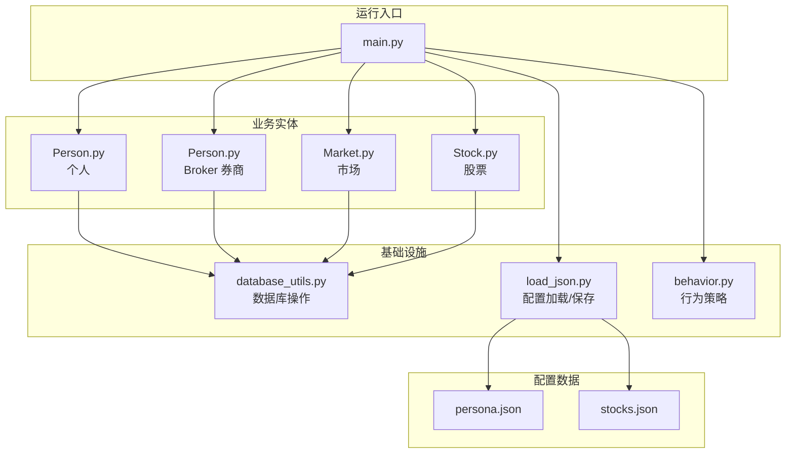
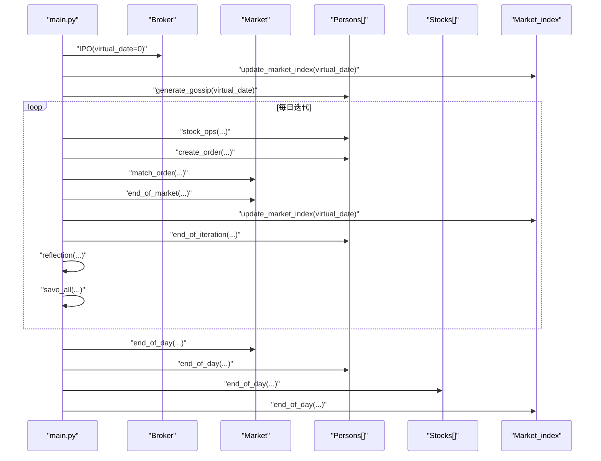
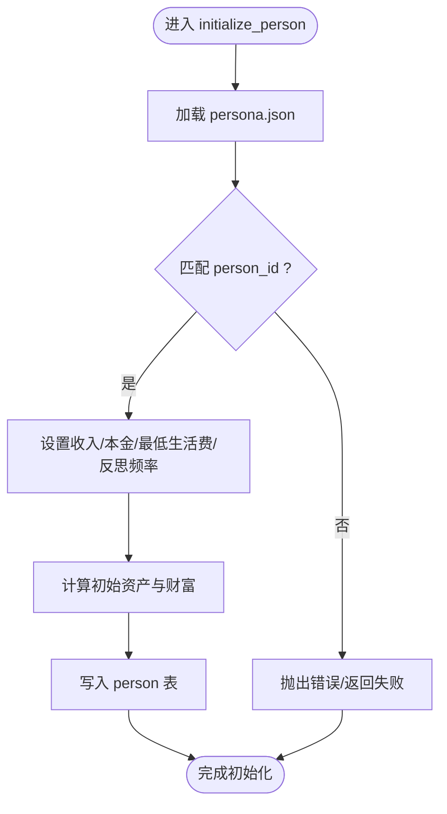
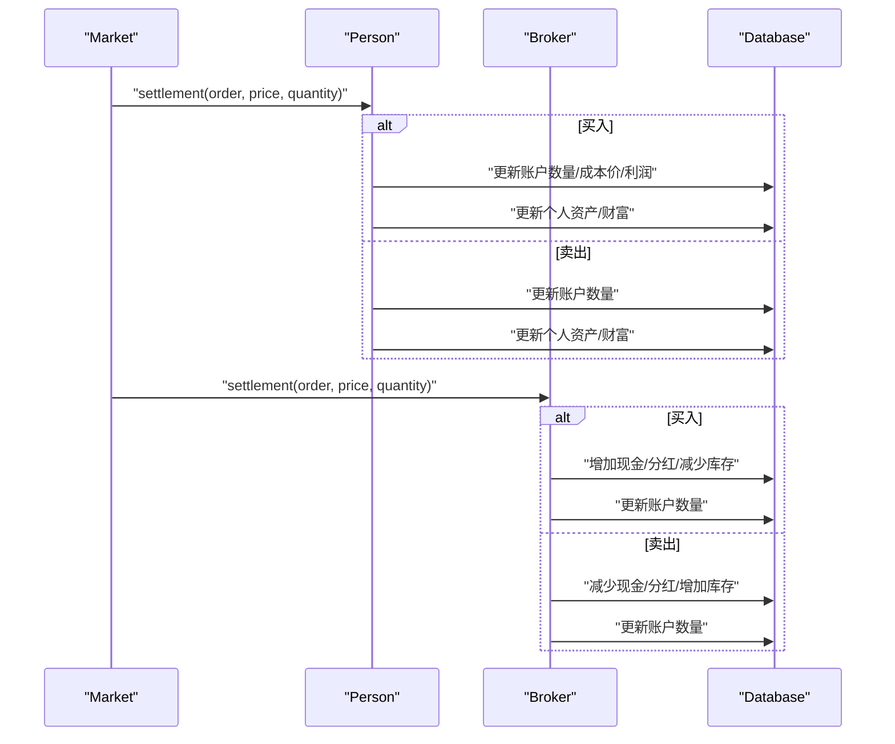
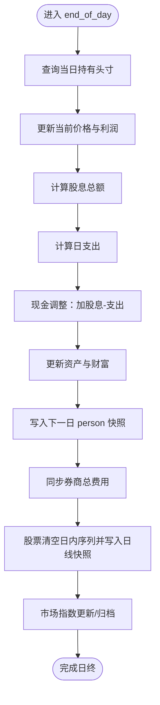

# 生命周期与核心方法

<cite>
**本文引用的文件列表**
- [main.py](file://Agent-Trading-Arena/Stock_Main/main.py)
- [Person.py](file://Agent-Trading-Arena/Stock_Main/Person.py)
- [Market.py](file://Agent-Trading-Arena/Stock_Main/Market.py)
- [Stock.py](file://Agent-Trading-Arena/Stock_Main/Stock.py)
- [database_utils.py](file://Agent-Trading-Arena/Stock_Main/database_utils.py)
- [load_json.py](file://Agent-Trading-Arena/Stock_Main/load_json.py)
- [behavior.py](file://Agent-Trading-Arena/Stock_Main/behavior.py)
- [persona.json](file://Agent-Trading-Arena/Stock_Main/save/sim_test01/persona.json)
- [stocks.json](file://Agent-Trading-Arena/Stock_Main/save/sim_test01/stocks.json)
</cite>

## 目录
1. [引言](#引言)
2. [项目结构](#项目结构)
3. [核心组件](#核心组件)
4. [架构总览](#架构总览)
5. [详细组件分析](#详细组件分析)
6. [依赖关系分析](#依赖关系分析)
7. [性能考量](#性能考量)
8. [故障排查指南](#故障排查指南)
9. [结论](#结论)

## 引言
本文件系统性梳理 Agent Trading Arena 中的关键生命周期方法：initialize_person、settlement、end_of_day 的执行流程与业务意义，并结合 main.py 的调用上下文，阐明它们在模拟周期中的时序关系。同时提供异常处理机制说明与性能优化建议，帮助读者快速理解并高效使用该仿真系统。

## 项目结构
该项目采用“模块化+分层”的组织方式：
- 核心运行入口位于 main.py，负责初始化、迭代调度与每日收尾。
- 业务实体分为三类：Person（个人）、Broker（券商）、Stock（股票）与 Market（市场），通过数据库工具类进行持久化与查询。
- 配置与数据来源由 JSON 文件提供，通过 load_json 模块加载；数据库结构由 database_utils 定义。



图表来源
- [main.py](file://Agent-Trading-Arena/Stock_Main/main.py#L99-L146)
- [Person.py](file://Agent-Trading-Arena/Stock_Main/Person.py#L143-L427)
- [Market.py](file://Agent-Trading-Arena/Stock_Main/Market.py#L12-L265)
- [Stock.py](file://Agent-Trading-Arena/Stock_Main/Stock.py#L14-L276)
- [database_utils.py](file://Agent-Trading-Arena/Stock_Main/database_utils.py#L245-L322)
- [load_json.py](file://Agent-Trading-Arena/Stock_Main/load_json.py#L9-L22)
- [behavior.py](file://Agent-Trading-Arena/Stock_Main/behavior.py#L82-L171)

章节来源
- [main.py](file://Agent-Trading-Arena/Stock_Main/main.py#L1-L151)
- [Person.py](file://Agent-Trading-Arena/Stock_Main/Person.py#L1-L629)
- [Market.py](file://Agent-Trading-Arena/Stock_Main/Market.py#L1-L278)
- [Stock.py](file://Agent-Trading-Arena/Stock_Main/Stock.py#L1-L307)
- [database_utils.py](file://Agent-Trading-Arena/Stock_Main/database_utils.py#L1-L322)
- [load_json.py](file://Agent-Trading-Arena/Stock_Main/load_json.py#L1-L134)
- [behavior.py](file://Agent-Trading-Arena/Stock_Main/behavior.py#L1-L210)

## 核心组件
- Person：代表交易者，负责下单、结算、日终更新与资产记录。
- Broker：代表券商，负责初始库存注入、交易结算与日终归档。
- Market：代表市场，负责撮合订单、日终收市与价格波动更新。
- Stock：代表单个股票，负责日线数据归档与日内价格序列维护。
- 数据库工具：封装 SQL 执行、表结构定义、解析器与辅助函数。
- 行为策略：生成买卖指令、反思与闲话传播。

章节来源
- [Person.py](file://Agent-Trading-Arena/Stock_Main/Person.py#L143-L427)
- [Market.py](file://Agent-Trading-Arena/Stock_Main/Market.py#L12-L265)
- [Stock.py](file://Agent-Trading-Arena/Stock_Main/Stock.py#L14-L276)
- [database_utils.py](file://Agent-Trading-Arena/Stock_Main/database_utils.py#L245-L322)

## 架构总览
下图展示一次完整交易日的时序：开盘前准备（IPO、闲话、市场指数更新）→ 多轮迭代（生成买卖指令、撮合、日终结算）→ 日终收尾（市场收市、个人日终、股票日线归档、市场指数日终）。



图表来源
- [main.py](file://Agent-Trading-Arena/Stock_Main/main.py#L110-L145)
- [Market.py](file://Agent-Trading-Arena/Stock_Main/Market.py#L21-L95)
- [Person.py](file://Agent-Trading-Arena/Stock_Main/Person.py#L364-L427)
- [Stock.py](file://Agent-Trading-Arena/Stock_Main/Stock.py#L52-L65)
- [behavior.py](file://Agent-Trading-Arena/Stock_Main/behavior.py#L201-L210)

## 详细组件分析

### initialize_person：从配置文件加载初始状态
- 责任边界
  - 读取 persona.json，提取指定 person_id 的基础信息（收入、本金、最低生活费、反思频率等）。
  - 初始化个人账户（虚拟日期=0），写入初始现金、资产、财富等字段。
  - 将初始状态持久化到 person 表。
- 关键步骤
  - 加载 persona.json 并匹配目标 person_id。
  - 计算初始资产与财富（初始资产为0）。
  - 写入 person 表，包含工作收入、资本收益、日支出、原则等字段。
- 业务意义
  - 为每个交易者建立统一的初始财务基线，确保后续结算与日终计算的可比性。
- 异常与健壮性
  - 若未找到匹配的 person_id，将无法完成初始化；应检查 persona.json 的 person_id 是否连续且唯一。
  - 数据库连接失败或 SQL 执行异常会中断初始化流程。
- 性能建议
  - 避免重复加载 persona.json；可在应用启动时缓存。
  - 单次插入，减少多次往返数据库的开销。



图表来源
- [Person.py](file://Agent-Trading-Arena/Stock_Main/Person.py#L173-L199)
- [load_json.py](file://Agent-Trading-Arena/Stock_Main/load_json.py#L9-L22)

章节来源
- [Person.py](file://Agent-Trading-Arena/Stock_Main/Person.py#L173-L199)
- [load_json.py](file://Agent-Trading-Arena/Stock_Main/load_json.py#L9-L22)
- [persona.json](file://Agent-Trading-Arena/Stock_Main/save/sim_test01/persona.json#L1-L131)

### settlement：日终财务清算
- 责任边界
  - 在撮合完成后，对每笔成交进行资金与持仓的最终确认。
  - 个人层面：更新账户余额、资产、成本价、利润与数量。
  - 券商层面：更新现金、资产、分红与库存。
- 个人结算流程
  - 查询当前持有头寸，若为空则按新购入路径处理。
  - 若为买入：扣减现金、增加资产、更新成本价与数量；若为卖出：增加现金、减少资产、更新数量并计算利润。
  - 更新账户表与个人表的资产与财富。
- 券商结算流程
  - 买入方向：收到卖出方的成交额，增加现金与分红，减少库存，更新账户数量。
  - 卖出方向：支付成交额给卖方，减少现金与分红，增加库存，更新账户数量。
- 业务意义
  - 确保交易结果在两个主体（个人与券商）之间达成一致，避免重复记账与头寸不平。
- 异常与健壮性
  - 数量必须非负，否则断言失败；需在上层保证订单有效性。
  - 数据库事务一致性依赖于 SQL 执行顺序与原子性，建议在批量结算时合并为更少的提交。
- 性能建议
  - 合并多条更新为批量更新，减少数据库往返。
  - 对频繁访问的查询结果进行缓存（如当日持有清单）。



图表来源
- [Market.py](file://Agent-Trading-Arena/Stock_Main/Market.py#L230-L258)
- [Person.py](file://Agent-Trading-Arena/Stock_Main/Person.py#L250-L307)
- [Person.py](file://Agent-Trading-Arena/Stock_Main/Person.py#L65-L96)

章节来源
- [Market.py](file://Agent-Trading-Arena/Stock_Main/Market.py#L230-L258)
- [Person.py](file://Agent-Trading-Arena/Stock_Main/Person.py#L250-L307)
- [Person.py](file://Agent-Trading-Arena/Stock_Main/Person.py#L65-L96)

### end_of_day：归档当日数据并准备下一交易日
- 责任边界
  - 市场层面：关闭当日所有活跃订单，结束市场交易。
  - 个人层面：更新当日持有头寸的当前价格与利润，计算当日股息，扣除日常支出，生成下一日快照。
  - 股票层面：清空日内价格序列，写入日线快照。
  - 市场指数层面：基于成分股权重更新指数值。
- 个人日终流程
  - 查询当日所有股票的最新价格，计算总资产与资本利得。
  - 计算股息：按持有数量乘以各股票 DPS。
  - 计算日支出：基于总资产与现金的比例与最低生活费。
  - 写入下一日的 person 快照，包含现金、资产、财富、资本利得、日支出等。
  - 同步更新券商的总费用。
- 股票日终流程
  - 清空 intraday_price_list。
  - 写入下一日的 stock 快照，开盘价、最高价、最低价、收盘价均为当日收盘价。
- 市场指数日终流程
  - 基于成分股权重与当前价格更新市场指数的开盘、最高、最低、收盘。
- 业务意义
  - 形成完整的日线数据链路，支撑回测与可视化；同时为下一交易日的报价与风险控制提供基础。
- 异常与健壮性
  - 若查询不到当日持有头寸，流程跳过；需确保 end_of_iteration 已正确更新。
  - 日价格限制与波动常数参数影响价格收敛，需根据场景调整。
- 性能建议
  - 使用批量插入/更新替代逐条执行，降低数据库压力。
  - 对查询结果进行缓存，减少重复查询。



图表来源
- [Person.py](file://Agent-Trading-Arena/Stock_Main/Person.py#L364-L427)
- [Stock.py](file://Agent-Trading-Arena/Stock_Main/Stock.py#L52-L65)
- [Stock.py](file://Agent-Trading-Arena/Stock_Main/Stock.py#L224-L276)
- [Market.py](file://Agent-Trading-Arena/Stock_Main/Market.py#L21-L28)

章节来源
- [Person.py](file://Agent-Trading-Arena/Stock_Main/Person.py#L364-L427)
- [Stock.py](file://Agent-Trading-Arena/Stock_Main/Stock.py#L52-L65)
- [Stock.py](file://Agent-Trading-Arena/Stock_Main/Stock.py#L224-L276)
- [Market.py](file://Agent-Trading-Arena/Stock_Main/Market.py#L21-L28)

### 主循环时序关系与调用上下文
- 初始化阶段
  - main 初始化数据库、创建 Stock、Market_index、Broker、Person 实例。
  - 第一天执行 Broker.ipo，向市场注入初始库存。
- 每日循环
  - 更新市场指数、生成闲话。
  - 进行多轮迭代：生成买卖指令、随机打乱后提交订单、撮合、市场收市、更新市场指数、个人日间结算、反思与保存。
- 日终收尾
  - 市场 end_of_day 关闭订单。
  - 个人 end_of_day 更新资产与财富，写入下一日快照。
  - 股票 end_of_day 写入日线快照。
  - 市场指数 end_of_day 更新。

章节来源
- [main.py](file://Agent-Trading-Arena/Stock_Main/main.py#L99-L146)
- [behavior.py](file://Agent-Trading-Arena/Stock_Main/behavior.py#L201-L210)

## 依赖关系分析
- 组件耦合
  - Person 与 Broker 共享 Database_operate，二者在结算环节直接交互。
  - Market 调用 Person 与 Broker 的结算接口，形成“外部驱动”的结算模式。
  - Stock 与 Market_index 依赖 Database_operate 进行日线归档与指数计算。
- 外部依赖
  - SQLite 数据库作为唯一持久化介质。
  - JSON 配置文件提供初始状态与参数。
- 循环依赖
  - 无直接循环依赖；Person、Broker、Market、Stock 通过数据库与行为策略间接协作。

```mermaid
graph LR
DB["Database_operate"] <- --> P["Person"]
DB <- --> B["Broker"]
DB <- --> M["Market"]
DB <- --> S["Stock"]
DB <- --> MI["Market_index"]
P --> BEH["behavior.py"]
M --> P
M --> B
S --> DB
MI --> S
```

图表来源
- [database_utils.py](file://Agent-Trading-Arena/Stock_Main/database_utils.py#L245-L322)
- [Person.py](file://Agent-Trading-Arena/Stock_Main/Person.py#L143-L427)
- [Market.py](file://Agent-Trading-Arena/Stock_Main/Market.py#L12-L265)
- [Stock.py](file://Agent-Trading-Arena/Stock_Main/Stock.py#L14-L276)
- [behavior.py](file://Agent-Trading-Arena/Stock_Main/behavior.py#L82-L171)

## 性能考量
- 数据库层
  - 批量插入/更新：将多条 SQL 合并为批量操作，减少事务提交次数。
  - 索引优化：为常用查询字段（如 person_id、virtual_date、stock_id）建立索引。
  - 事务粒度：将一组强关联的更新放在同一事务中，提升一致性与吞吐。
- 应用层
  - 缓存热点数据：如当日持有清单、市场指数、股票价格序列。
  - 减少字符串拼接：SQL 拼接可改为参数化，提升可读性与安全性。
  - 异步化：对非关键路径（如日志、可视化）异步执行。
- 参数调优
  - Fluctuation_Constant 与 Daily_Price_Limit 控制价格波动幅度与收敛速度，需结合实盘经验调整。
  - Iterations_Daily 与 Num_Person 影响并发订单数量，需平衡性能与仿真精度。

## 故障排查指南
- 初始化失败
  - 检查 persona.json 中是否存在目标 person_id；确保字段完整。
  - 确认数据库连接正常，表结构已初始化。
- 结算异常
  - 若出现数量为负，检查上层订单是否越界；确保卖出数量不超过持有数量。
  - 数据库执行失败时，查看打印的 SQL 语句与异常堆栈。
- 日终未更新
  - 确认 end_of_iteration 是否在每轮迭代后被调用。
  - 检查 Market_index.update_market_index 是否在合适时机被调用。
- 性能瓶颈
  - 使用批量操作替代逐条更新；监控数据库慢查询。
  - 适当降低 Iterations_Daily 或 Num_Person 以缓解压力。

章节来源
- [database_utils.py](file://Agent-Trading-Arena/Stock_Main/database_utils.py#L302-L310)
- [Person.py](file://Agent-Trading-Arena/Stock_Main/Person.py#L296-L297)
- [main.py](file://Agent-Trading-Arena/Stock_Main/main.py#L117-L145)

## 结论
- initialize_person 通过 persona.json 建立统一的初始财务基线，是整个生命周期的起点。
- settlement 在撮合完成后完成资金与头寸的最终确认，确保个人与券商的账目一致。
- end_of_day 完成日线归档与下一日准备，形成闭环的数据链路。
- main.py 的主循环清晰地串联了这些方法，提供了可扩展的仿真框架。通过合理的异常处理与性能优化，可稳定支持大规模并发与长期回测。