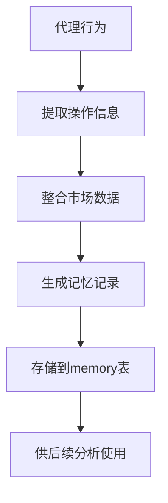
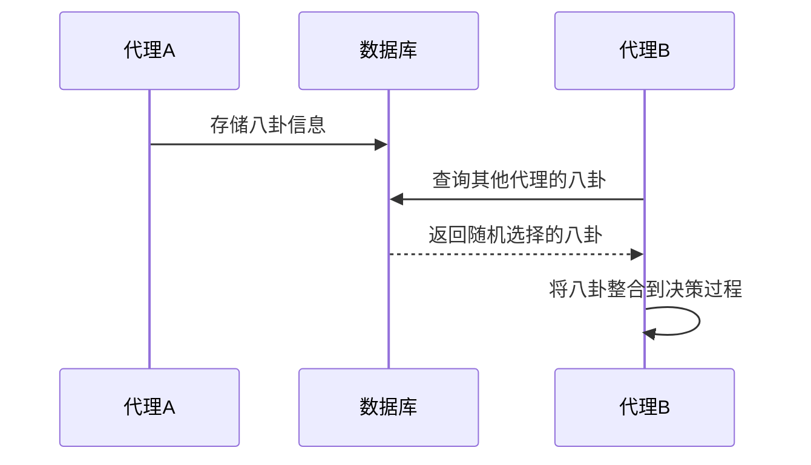
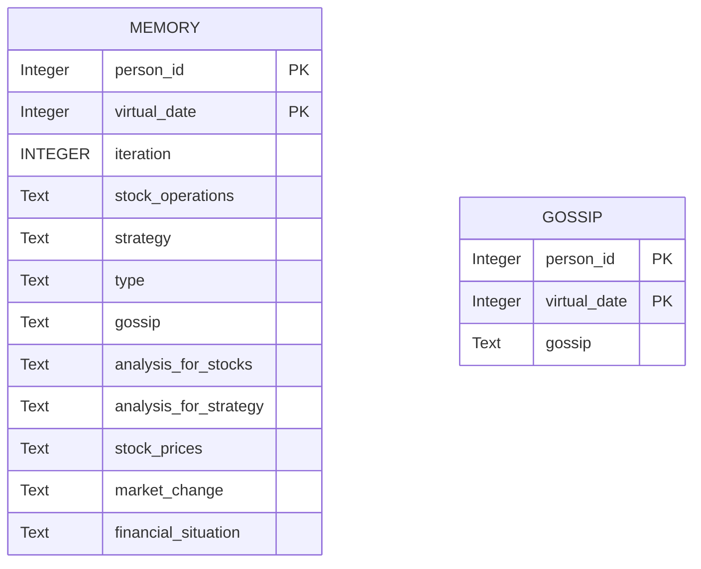
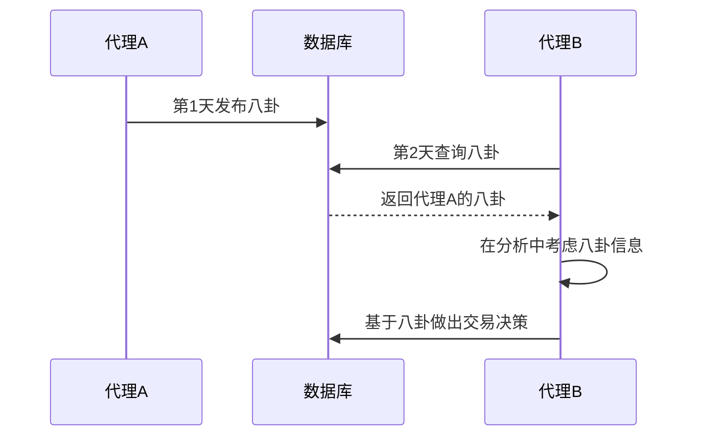
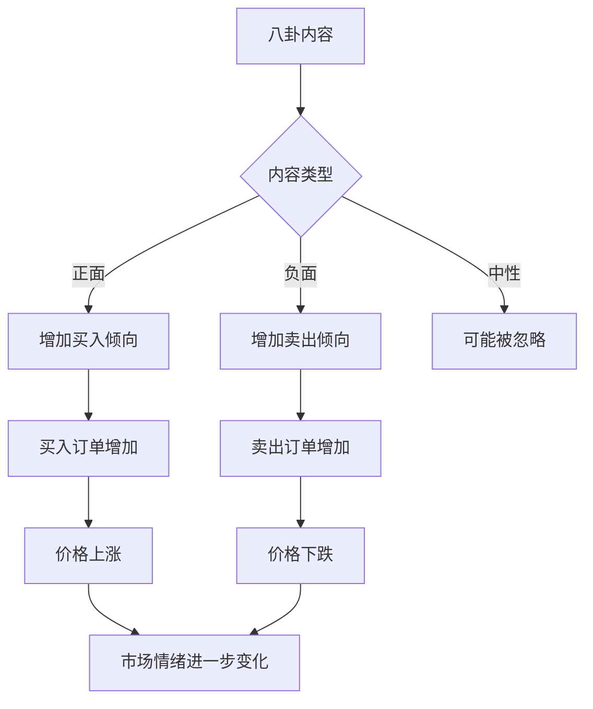

# 记忆与信息传播模型

<cite>
**本文档引用文件**  
- [database_utils.py](file://database_utils.py)
- [gossip.txt](file://content/our_prompt_template/gossip.txt)
- [gossip_info.txt](file://content/our_prompt_template/gossip_info.txt)
- [Person.py](file://Person.py)
- [our_run_gpt_prompt.py](file://content/our_run_gpt_prompt.py)
- [behavior.py](file://behavior.py)
</cite>

## 目录
1. [引言](#引言)
2. [记忆机制实现](#记忆机制实现)
3. [八卦传播机制](#八卦传播机制)
4. [信息生成与传播触发条件](#信息生成与传播触发条件)
5. [数据库存储结构](#数据库存储结构)
6. [八卦传播过程示例](#八卦传播过程示例)
7. [市场情绪影响分析](#市场情绪影响分析)
8. [结论](#结论)

## 引言
本系统通过记忆（memory）和八卦（gossip）机制模拟代理在股票交易环境中的行为学习与信息传播过程。记忆机制用于记录代理的历史行为与市场观察，而八卦机制则实现非公开信息在代理间的传播。这些机制共同构建了一个动态的、基于社会信息传播的交易模拟环境。

## 记忆机制实现

记忆机制通过`Person`类的`add_memory`方法实现，该方法将代理在每个虚拟日期和迭代周期中的行为、分析和决策记录到数据库中。记忆内容包括股票操作、投资策略、市场变化分析、财务状况等关键信息。



**图示来源**  
- [Person.py](file://Person.py#L514-L546)
- [database_utils.py](file://database_utils.py#L290-L294)

**本节来源**  
- [Person.py](file://Person.py#L514-L546)
- [database_utils.py](file://database_utils.py#L290-L294)

## 八卦传播机制

八卦传播机制通过`generate_gossip`函数和`run_gpt_generate_gossip`函数实现。代理基于前一日的记忆信息生成八卦内容，这些内容随后被其他代理获取并影响其决策。八卦信息的传播增强了代理间的交互性，模拟了真实市场中信息流动的复杂性。



**图示来源**  
- [behavior.py](file://behavior.py#L201-L210)
- [our_run_gpt_prompt.py](file://content/our_run_gpt_prompt.py#L364-L412)

**本节来源**  
- [behavior.py](file://behavior.py#L201-L210)
- [our_run_gpt_prompt.py](file://content/our_run_gpt_prompt.py#L364-L412)

## 信息生成与传播触发条件

八卦信息的生成与传播遵循特定的触发条件。根据`integrate_gossip`函数的实现，每个代理在每个时间步有随机概率传播0到`gossip_num_max`条八卦信息。信息生成基于`gossip_info.txt`模板，该模板整合了前一日的交易操作、财务状况、市场分析等信息。

```mermaid
flowchart TD
A[虚拟日期] --> B{是否为第一天?}
B --> |是| C[存储"None"]
B --> |否| D[查询前一日记忆]
D --> E[应用gossip_info.txt模板]
E --> F[生成八卦内容]
F --> G[调用LLM生成自然语言八卦]
G --> H[存储到gossip表]
```

**图示来源**  
- [our_run_gpt_prompt.py](file://content/our_run_gpt_prompt.py#L9-L19)
- [gossip_info.txt](file://content/our_prompt_template/gossip_info.txt)

**本节来源**  
- [our_run_gpt_prompt.py](file://content/our_run_gpt_prompt.py#L9-L52)
- [gossip_info.txt](file://content/our_prompt_template/gossip_info.txt)

## 数据库存储结构

系统的记忆与八卦信息通过SQLite数据库进行存储和管理。`database_utils.py`文件中的`Database_operate`类定义了`memory`和`gossip`两个数据表，分别用于存储代理的记忆和八卦信息。

### Memory表结构
| 字段名 | 数据类型 | 约束 | 说明 |
|-------|--------|-----|-----|
| person_id | Integer | NOT NULL | 代理ID |
| virtual_date | Integer | NOT NULL | 虚拟日期 |
| iteration | INTEGER | NOT NULL | 迭代次数 |
| stock_operations | Text | | 股票操作记录 |
| strategy | Text | | 投资策略 |
| type | Text | check(type IN ('sell','buy','hold','reflect')) | 操作类型 |
| gossip | Text | | 传播的八卦信息 |
| analysis_for_stocks | Text | | 股票分析 |
| analysis_for_strategy | Text | | 策略分析 |
| stock_prices | Text | | 股票价格信息 |
| market_change | Text | | 市场变化 |
| financial_situation | Text | | 财务状况 |

### Gossip表结构
| 字段名 | 数据类型 | 约束 | 说明 |
|-------|--------|-----|-----|
| person_id | Integer | NOT NULL | 发布八卦的代理ID |
| virtual_date | Integer | NOT NULL | 虚拟日期 |
| gossip | Text | | 八卦内容 |



**图示来源**  
- [database_utils.py](file://database_utils.py#L290-L300)

**本节来源**  
- [database_utils.py](file://database_utils.py#L290-L300)

## 八卦传播过程示例

以下是一个完整的八卦传播过程示例：

1. **第0天**：所有代理初始化，没有历史记忆，因此八卦内容为"None"
2. **第1天**：代理A基于第0天的市场分析和自身行为，通过`gossip.txt`模板生成八卦
3. **第2天**：代理B查询数据库，获取代理A在第1天发布的八卦信息
4. **决策影响**：代理B将获取的八卦信息整合到自己的市场分析中，影响其买卖决策

这个过程体现了信息在代理间的传播路径：代理生成→数据库存储→其他代理获取→影响决策→生成新的记忆和八卦。



**图示来源**  
- [Person.py](file://Person.py#L615-L628)
- [our_run_gpt_prompt.py](file://content/our_run_gpt_prompt.py#L364-L412)

**本节来源**  
- [Person.py](file://Person.py#L615-L628)
- [our_run_gpt_prompt.py](file://content/our_run_gpt_prompt.py#L364-L412)

## 市场情绪影响分析

八卦机制对市场情绪有着显著影响。当代理传播积极的市场预测时，会引发其他代理的跟风买入行为，导致股价上涨；反之，负面八卦可能导致恐慌性抛售。这种基于社会信息传播的市场情绪波动，模拟了真实金融市场中的羊群效应。

通过分析`analysis`函数的实现，可以看到八卦信息被直接整合到市场分析的输入中，与其他市场数据同等对待。这意味着即使八卦内容是虚假的，只要被足够多的代理传播和相信，就可能对市场价格产生实质性影响。



**图示来源**  
- [our_run_gpt_prompt.py](file://content/our_run_gpt_prompt.py#L414-L484)
- [behavior.py](file://behavior.py#L82-L171)

**本节来源**  
- [our_run_gpt_prompt.py](file://content/our_run_gpt_prompt.py#L414-L484)
- [behavior.py](file://behavior.py#L82-L171)

## 结论
记忆与八卦机制共同构建了一个复杂的代理交互系统。记忆机制使代理能够从历史经验中学习，而八卦机制则实现了信息在代理网络中的传播。这两个机制的结合不仅增强了代理决策的复杂性，也使得整个交易模拟环境更加接近真实的金融市场动态。通过数据库持久化存储，系统确保了信息的完整性和可追溯性，为后续的分析和研究提供了坚实的基础。