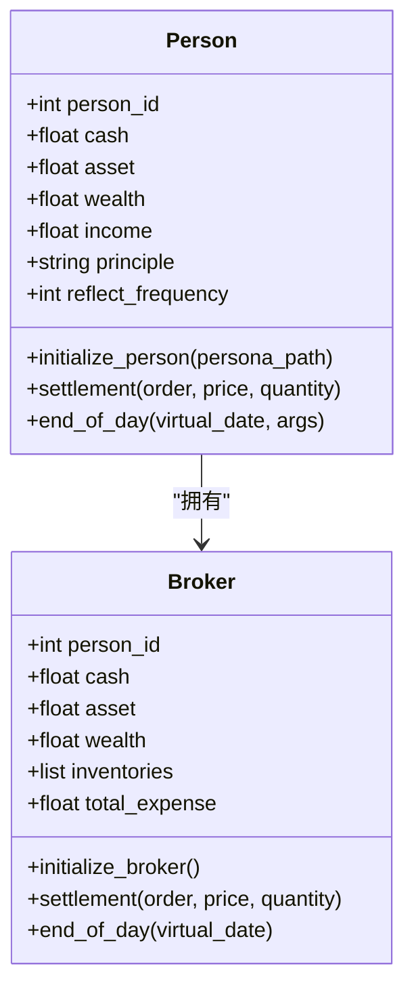
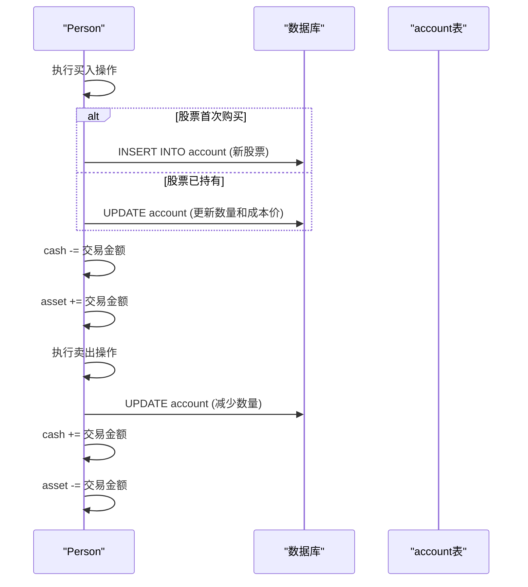
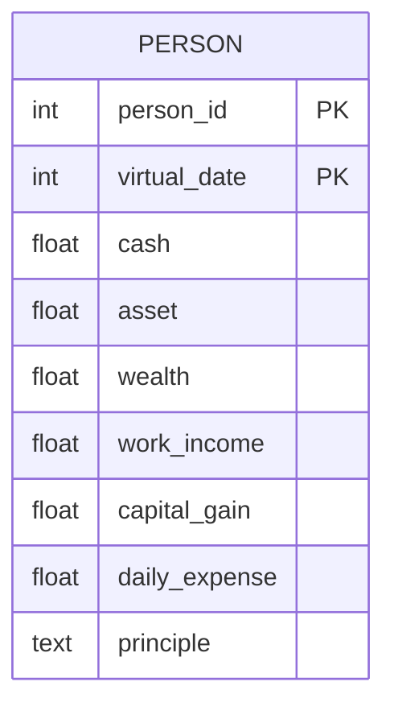
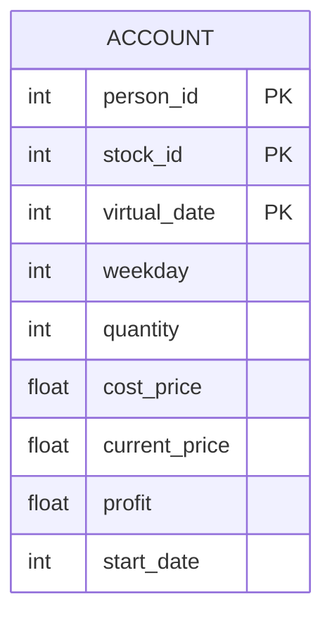

# 财务数据模型

<cite>
**本文档中引用的文件**  
- [Person.py](file://Agent-Trading-Arena/Stock_Main/Person.py)
- [database_utils.py](file://Agent-Trading-Arena/Stock_Main/database_utils.py)
- [Stock.py](file://Agent-Trading-Arena/Stock_Main/Stock.py)
- [load_json.py](file://Agent-Trading-Arena/Stock_Main/load_json.py)
- [constant.py](file://Agent-Trading-Arena/Stock_Main/constant.py)
</cite>

## 目录
1. [引言](#引言)
2. [财务字段定义与初始化](#财务字段定义与初始化)
3. [交易结算机制](#交易结算机制)
4. [每日结算与财富更新](#每日结算与财富更新)
5. [数据库持久化结构](#数据库持久化结构)
6. [交易前后财务状态变化示例](#交易前后财务状态变化示例)
7. [财富波动计算逻辑](#财富波动计算逻辑)
8. [总结](#总结)

## 引言
本文件深入解析人员财务相关核心字段：cash（现金）、assets（资产）和wealth（财富）的定义、初始化过程、动态更新机制及其在交易执行、每日结算和财富计算中的作用。结合`database_utils.py`中的account表结构，阐述财务数据的持久化方式。通过JSON示例说明交易前后财务状态的变化，并解释财富波动的计算逻辑。

## 财务字段定义与初始化
在系统中，`Person`类和`Broker`类均定义了`cash`、`asset`和`wealth`三个核心财务字段，用于跟踪个人和经纪人的财务状况。

- **cash（现金）**：表示个人或经纪人持有的可用现金。
- **asset（资产）**：表示个人或经纪人持有的股票等投资资产的当前市场价值。
- **wealth（财富）**：表示个人或经纪人的总财富，计算公式为 `wealth = cash + asset`。

这些字段在对象初始化时被设置。对于`Person`类，其初始现金值从`persona.json`配置文件中加载，而初始资产和财富则根据初始现金和零资产计算得出。



**图表来源**
- [Person.py](file://Agent-Trading-Arena/Stock_Main/Person.py#L158-L162)
- [Person.py](file://Agent-Trading-Arena/Stock_Main/Person.py#L173-L187)

## 交易结算机制
当发生交易（买入或卖出）时，系统通过`settlement`方法进行财务结算，动态更新`cash`、`asset`和`wealth`字段。

### 买入操作
当执行买入操作时：
1.  **现金减少**：`cash` 减去交易金额（`price * quantity`）。
2.  **资产增加**：`asset` 增加交易金额。
3.  **库存更新**：如果该股票是首次购买，则在`account`表中插入新记录；否则，更新现有记录的`quantity`和`cost_price`（加权平均成本）。

### 卖出操作
当执行卖出操作时：
1.  **现金增加**：`cash` 增加交易金额（`price * quantity`）。
2.  **资产减少**：`asset` 减去交易金额。
3.  **库存更新**：更新`account`表中对应股票的`quantity`。



**图表来源**
- [Person.py](file://Agent-Trading-Arena/Stock_Main/Person.py#L250-L307)
- [database_utils.py](file://Agent-Trading-Arena/Stock_Main/database_utils.py#L224-L243)

**本节来源**
- [Person.py](file://Agent-Trading-Arena/Stock_Main/Person.py#L250-L307)

## 每日结算与财富更新
在每个虚拟交易日结束时，系统会调用`end_of_day`方法进行每日结算，这是更新财务数据的关键环节。

1.  **更新股票价格**：从`stock`表中获取所有股票的最新收盘价。
2.  **重新计算资产**：遍历个人持有的所有股票，根据最新的市场价格重新计算总资产（`total_asset`）。
3.  **更新财富**：使用最新的`cash`和`total_asset`来更新`wealth`。
4.  **计算股息**：根据持有的股票数量和每股股息（DPS）计算当日股息收入，并增加到`cash`中。
5.  **扣除日常开销**：根据财富水平和最低生活开支计算当日总开销，并从`cash`中扣除。
6.  **持久化数据**：将更新后的`cash`、`asset`、`wealth`等财务数据插入到`person`表中，记录该日期的财务快照。

此过程确保了财务数据在每日结束时的准确性和一致性。

**本节来源**
- [Person.py](file://Agent-Trading-Arena/Stock_Main/Person.py#L364-L427)

## 数据库持久化结构
财务数据通过SQLite数据库进行持久化存储，主要涉及`person`和`account`两个表。

### person 表
该表记录了个人在每个虚拟日期的财务快照。



**图表来源**
- [database_utils.py](file://Agent-Trading-Arena/Stock_Main/database_utils.py#L273-L279)

### account 表
该表记录了个人持有的每只股票的详细信息。



**图表来源**
- [database_utils.py](file://Agent-Trading-Arena/Stock_Main/database_utils.py#L282-L287)

## 交易前后财务状态变化示例
以下JSON示例展示了一个人在进行一笔交易前后的财务状态变化。

**交易前状态 (虚拟日期: 0)**
```json
{
  "person_id": 0,
  "virtual_date": 0,
  "cash": 10000.00,
  "asset": 0.00,
  "wealth": 10000.00,
  "holdings": []
}
```

**交易操作**
- **类型**: 买入
- **股票**: A
- **价格**: $100.00
- **数量**: 50

**交易后状态 (虚拟日期: 0)**
```json
{
  "person_id": 0,
  "virtual_date": 0,
  "cash": 9500.00,
  "asset": 5000.00,
  "wealth": 14500.00,
  "holdings": [
    {
      "stock_id": 0,
      "stock_name": "A",
      "quantity": 50,
      "cost_price": 100.00,
      "current_price": 100.00
    }
  ]
}
```

**本节来源**
- [Person.py](file://Agent-Trading-Arena/Stock_Main/Person.py#L250-L307)
- [Person.py](file://Agent-Trading-Arena/Stock_Main/Person.py#L364-L427)

## 财富波动计算逻辑
财富的波动主要由以下几个因素驱动：

1.  **交易盈亏**：当股票的`current_price`（当前价格）与`cost_price`（成本价）不同时，会产生未实现盈亏（`profit`字段），直接影响`asset`和`wealth`。
2.  **市场波动**：每日结算时，系统会根据股票的最新市场价格更新`current_price`。市场价格的上涨或下跌会直接导致`asset`和`wealth`的波动。
3.  **股息收入**：持有的股票会定期支付股息（DPS），这部分收入会增加`cash`，从而增加`wealth`。
4.  **日常开销**：每日的开销会从`cash`中扣除，减少`wealth`。

财富波动的计算逻辑体现在`end_of_day`方法中，通过重新评估所有持仓的市场价值来实现。`capital_gain`（资本收益）字段记录了当日因价格变动而产生的收益或损失。

**本节来源**
- [Person.py](file://Agent-Trading-Arena/Stock_Main/Person.py#L364-L427)
- [Person.py](file://Agent-Trading-Arena/Stock_Main/Person.py#L318-L350)

## 总结
`cash`、`assets`和`wealth`是系统中衡量个人财务状况的核心指标。它们在初始化时从配置文件加载，并在每次交易和每日结算时动态更新。`cash`和`asset`的变动直接驱动`wealth`的变化。通过`person`和`account`数据库表，这些财务数据被持久化存储，确保了系统状态的可追溯性和一致性。财富的波动是市场动态、交易决策和日常收支共同作用的结果。