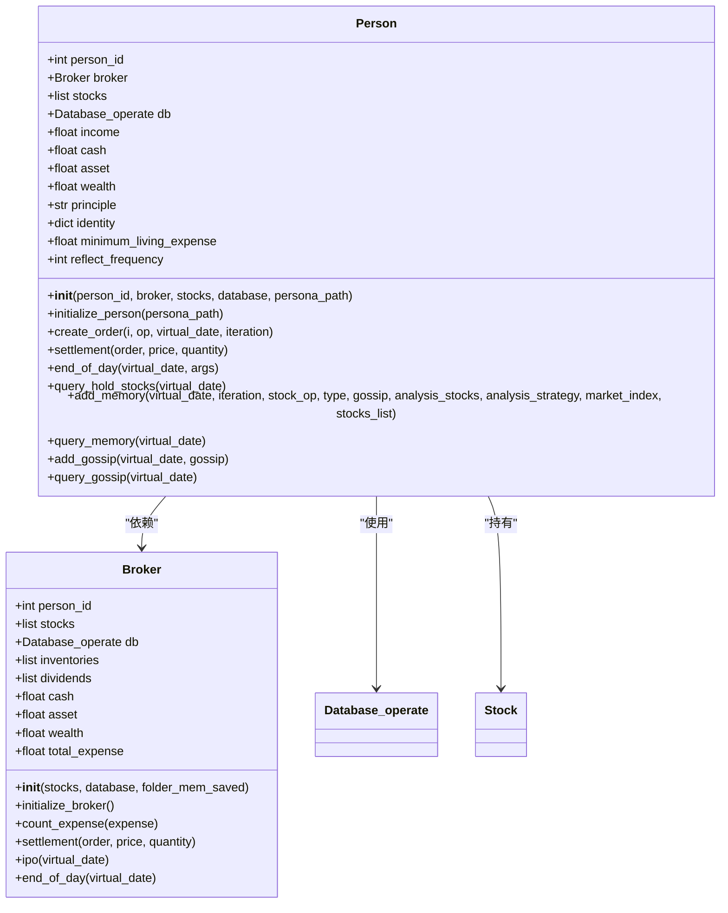
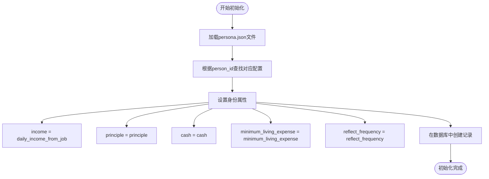
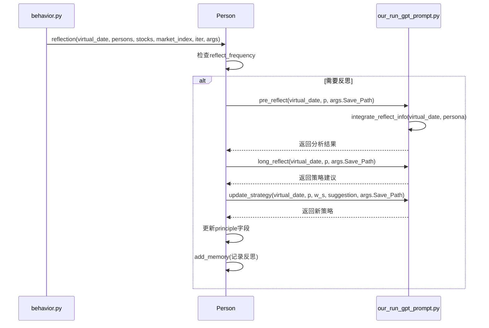
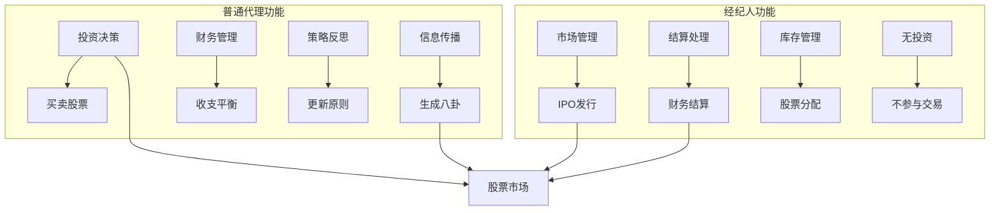
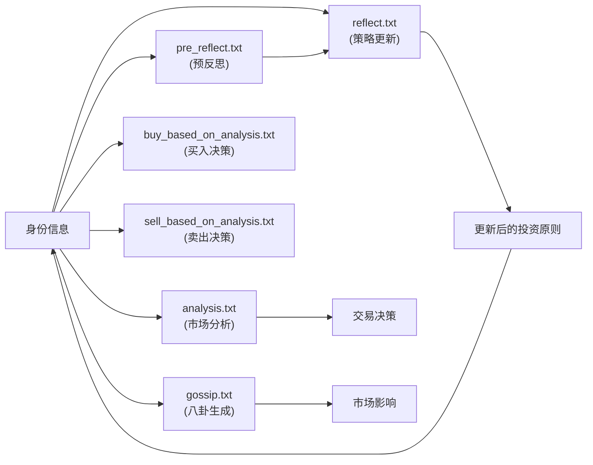
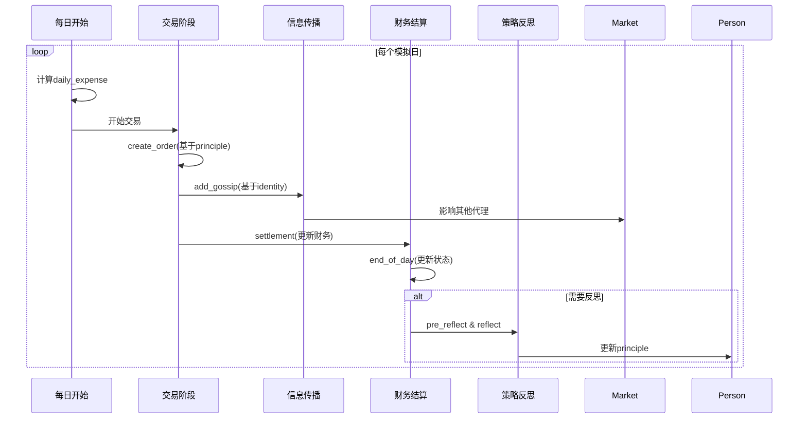

# 身份与角色模型

<cite>
**本文档引用文件**  
- [Person.py](file://Agent-Trading-Arena/Stock_Main/Person.py)
- [load_json.py](file://Agent-Trading-Arena/Stock_Main/load_json.py)
- [constant.py](file://Agent-Trading-Arena/Stock_Main/constant.py)
- [persona.json](file://Agent-Trading-Arena/Stock_Main/save/sim_test01/persona.json)
- [analysis.txt](file://Agent-Trading-Arena/Stock_Main/content/our_prompt_template/analysis.txt)
- [gossip.txt](file://Agent-Trading-Arena/Stock_Main/content/our_prompt_template/gossip.txt)
- [pre_reflect.txt](file://Agent-Trading-Arena/Stock_Main/content/our_prompt_template/pre_reflect.txt)
- [reflect.txt](file://Agent-Trading-Arena/Stock_Main/content/our_prompt_template/reflect.txt)
- [buy_based_on_analysis.txt](file://Agent-Trading-Arena/Stock_Main/content/our_prompt_template/buy_based_on_analysis.txt)
- [sell_based_on_analysis.txt](file://Agent-Trading-Arena/Stock_Main/content/our_prompt_template/sell_based_on_analysis.txt)
- [behavior.py](file://Agent-Trading-Arena/Stock_Main/behavior.py)
- [our_run_gpt_prompt.py](file://Agent-Trading-Arena/Stock_Main/content/our_run_gpt_prompt.py)
</cite>

## 目录
1. [引言](#引言)
2. [身份属性与角色类型](#身份属性与角色类型)
3. [身份初始化过程](#身份初始化过程)
4. [身份对行为模式的影响](#身份对行为模式的影响)
5. [角色权限与功能差异](#角色权限与功能差异)
6. [身份信息与提示模板的联动机制](#身份信息与提示模板的联动机制)
7. [模拟周期中的身份作用](#模拟周期中的身份作用)
8. [结论](#结论)

## 引言
在Agent-Trading-Arena系统中，每个交易代理（Person）都具备独特的身份属性和角色类型，这些属性共同决定了代理在股票市场中的行为模式、决策逻辑和交互方式。本文件详细描述Person类中的身份属性（identity）和角色类型（如普通代理、经纪人），分析identity字段如何影响代理的行为模式和决策逻辑，以及不同角色在市场中的权限和功能差异。同时，结合代码示例说明身份初始化过程及其在模拟周期中的作用，并分析身份信息如何与提示模板（如gossip.txt、analysis.txt）联动，驱动个性化行为输出。

## 身份属性与角色类型
在系统中，身份属性（identity）是Person类的核心组成部分，存储了代理的基本信息和行为准则。通过`identity`字段，每个代理都具备独特的个人特征，包括职业、投资原则、每日收入、初始现金、最低生活开支和反思频率等。

角色类型主要分为两类：普通代理（Person）和经纪人（Broker）。普通代理代表市场中的个体投资者，具有完整的身份属性和投资策略；而经纪人则作为市场基础设施的一部分，负责股票的首次公开发行（IPO）和市场结算，不具有个人身份属性。



**图示来源**
- [Person.py](file://Agent-Trading-Arena/Stock_Main/Person.py#L143-L629)

**本节来源**
- [Person.py](file://Agent-Trading-Arena/Stock_Main/Person.py#L143-L629)
- [persona.json](file://Agent-Trading-Arena/Stock_Main/save/sim_test01/persona.json#L1-L131)

## 身份初始化过程
身份初始化是Person对象创建过程中的关键步骤，通过`initialize_person`方法从JSON配置文件中加载代理的个性化信息。该过程确保了每个代理在进入市场时都具备独特的身份特征和初始状态。

初始化流程如下：
1. 从指定路径加载persona.json文件
2. 根据person_id匹配对应的代理配置
3. 将配置中的属性值赋给Person对象的相应字段
4. 在数据库中创建代理的初始记录



**图示来源**
- [Person.py](file://Agent-Trading-Arena/Stock_Main/Person.py#L173-L183)
- [load_json.py](file://Agent-Trading-Arena/Stock_Main/load_json.py#L9-L14)

**本节来源**
- [Person.py](file://Agent-Trading-Arena/Stock_Main/Person.py#L173-L183)
- [load_json.py](file://Agent-Trading-Arena/Stock_Main/load_json.py#L9-L14)
- [persona.json](file://Agent-Trading-Arena/Stock_Main/save/sim_test01/persona.json#L1-L131)

## 身份对行为模式的影响
身份属性中的`principle`字段（投资原则）直接决定了代理的投资策略和决策逻辑。所有代理的初始原则均为"try to maximize profit"（尝试最大化利润），但通过反思机制可以动态调整。

`reflect_frequency`字段控制着代理的自我反思频率，不同值代表不同的角色类型：
- reflect_frequency = 0：普通代理，不进行策略反思
- reflect_frequency = 2, 4, 6：高级代理，定期进行策略反思和调整

反思机制通过以下流程实现：
1. 在指定迭代周期触发反思
2. 调用pre_reflect函数分析历史投资表现
3. 生成策略弱点和优势分析
4. 调用reflect函数生成新的投资策略
5. 更新代理的principle字段



**图示来源**
- [behavior.py](file://Agent-Trading-Arena/Stock_Main/behavior.py#L174-L198)
- [our_run_gpt_prompt.py](file://Agent-Trading-Arena/Stock_Main/content/our_run_gpt_prompt.py#L114-L327)
- [Person.py](file://Agent-Trading-Arena/Stock_Main/Person.py#L514-L546)

**本节来源**
- [behavior.py](file://Agent-Trading-Arena/Stock_Main/behavior.py#L174-L198)
- [our_run_gpt_prompt.py](file://Agent-Trading-Arena/Stock_Main/content/our_run_gpt_prompt.py#L114-L327)
- [Person.py](file://Agent-Trading-Arena/Stock_Main/Person.py#L514-L546)

## 角色权限与功能差异
系统中的不同角色具有明确的权限和功能划分：

### 普通代理（Person）
- **投资决策权**：根据市场信息和个人策略进行买卖决策
- **信息传播权**：生成和传播市场八卦（gossip）
- **财务自主权**：管理个人现金、资产和日常开支
- **策略反思权**：定期反思并调整投资策略

### 经纪人（Broker）
- **市场管理权**：负责股票的首次公开发行（IPO）
- **结算权**：处理所有交易的财务结算
- **库存管理权**：管理市场初始股票库存
- **无投资权**：不参与市场投资决策



**图示来源**
- [Person.py](file://Agent-Trading-Arena/Stock_Main/Person.py#L143-L629)

**本节来源**
- [Person.py](file://Agent-Trading-Arena/Stock_Main/Person.py#L18-L142)
- [Person.py](file://Agent-Trading-Arena/Stock_Main/Person.py#L143-L629)

## 身份信息与提示模板的联动机制
身份信息通过与多个提示模板的联动，驱动代理的个性化行为输出。系统使用不同的提示模板来引导代理在不同场景下的行为：

### 分析模板（analysis.txt）
用于市场分析，整合以下信息：
- 股票信息
- 市场信息
- 其他代理的八卦
- 现有投资组合
- 投资策略（来自identity.principle）

### 交易决策模板
- **买入决策**（buy_based_on_analysis.txt）：基于分析结果决定买入操作
- **卖出决策**（sell_based_on_analysis.txt）：基于分析结果决定卖出操作

### 反思模板
- **预反思**（pre_reflect.txt）：评估投资策略的优缺点
- **反思**（reflect.txt）：根据评估结果更新投资策略



**图示来源**
- [analysis.txt](file://Agent-Trading-Arena/Stock_Main/content/our_prompt_template/analysis.txt#L1-L37)
- [gossip.txt](file://Agent-Trading-Arena/Stock_Main/content/our_prompt_template/gossip.txt#L1-L16)
- [buy_based_on_analysis.txt](file://Agent-Trading-Arena/Stock_Main/content/our_prompt_template/buy_based_on_analysis.txt#L1-L33)
- [sell_based_on_analysis.txt](file://Agent-Trading-Arena/Stock_Main/content/our_prompt_template/sell_based_on_analysis.txt#L1-L31)
- [pre_reflect.txt](file://Agent-Trading-Arena/Stock_Main/content/our_prompt_template/pre_reflect.txt#L1-L22)
- [reflect.txt](file://Agent-Trading-Arena/Stock_Main/content/our_prompt_template/reflect.txt#L1-L35)

**本节来源**
- [analysis.txt](file://Agent-Trading-Arena/Stock_Main/content/our_prompt_template/analysis.txt#L1-L37)
- [gossip.txt](file://Agent-Trading-Arena/Stock_Main/content/our_prompt_template/gossip.txt#L1-L16)
- [buy_based_on_analysis.txt](file://Agent-Trading-Arena/Stock_Main/content/our_prompt_template/buy_based_on_analysis.txt#L1-L33)
- [sell_based_on_analysis.txt](file://Agent-Trading-Arena/Stock_Main/content/our_prompt_template/sell_based_on_analysis.txt#L1-L31)
- [pre_reflect.txt](file://Agent-Trading-Arena/Stock_Main/content/our_prompt_template/pre_reflect.txt#L1-L22)
- [reflect.txt](file://Agent-Trading-Arena/Stock_Main/content/our_prompt_template/reflect.txt#L1-L35)

## 模拟周期中的身份作用
在模拟周期中，身份信息贯穿于代理的整个生命周期，发挥着关键作用：

1. **每日开始**：根据身份属性计算日常开支
2. **交易决策**：基于投资原则进行买卖决策
3. **信息传播**：利用身份特征生成个性化八卦
4. **财务结算**：根据收入和开支更新财务状况
5. **策略反思**：按频率进行投资策略反思和更新

每日开支的计算公式体现了身份属性的综合影响：
```
daily_expense = (total_asset * 1.0 + cash) * args.expense_ratio + minimum_living_expense
```

其中，minimum_living_expense直接来自身份配置，确保了不同代理在生活成本上的差异性。



**图示来源**
- [Person.py](file://Agent-Trading-Arena/Stock_Main/Person.py#L364-L428)
- [Person.py](file://Agent-Trading-Arena/Stock_Main/Person.py#L514-L546)
- [behavior.py](file://Agent-Trading-Arena/Stock_Main/behavior.py#L174-L198)

**本节来源**
- [Person.py](file://Agent-Trading-Arena/Stock_Main/Person.py#L364-L428)
- [Person.py](file://Agent-Trading-Arena/Stock_Main/Person.py#L514-L546)
- [behavior.py](file://Agent-Trading-Arena/Stock_Main/behavior.py#L174-L198)

## 结论
在Agent-Trading-Arena系统中，身份属性和角色类型构成了代理行为模型的核心。通过`identity`字段，每个代理都具备独特的个人特征和投资原则，这些属性直接影响其行为模式和决策逻辑。

普通代理和经纪人之间的角色分工清晰，权限和功能差异明显。普通代理具有完整的投资决策权和策略反思能力，而经纪人则专注于市场基础设施的维护。

身份信息与多个提示模板的联动机制，实现了从静态配置到动态行为的转化。通过分析、交易、八卦和反思等模板，代理能够基于其身份特征生成个性化的行为输出。

在模拟周期中，身份信息贯穿于代理的整个生命周期，从初始化、日常决策到策略更新，发挥着持续的作用。特别是反思机制，使得代理能够根据市场表现动态调整投资策略，实现了自适应的学习过程。

这种基于身份的代理模型不仅增强了模拟的真实性，也为研究不同投资策略和市场行为提供了灵活的实验平台。