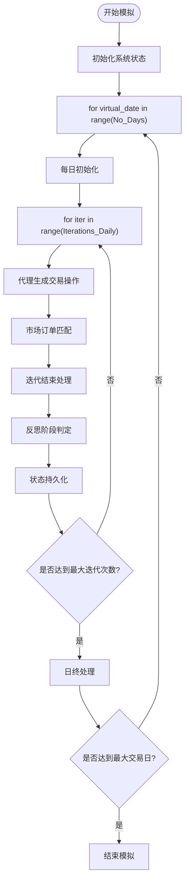
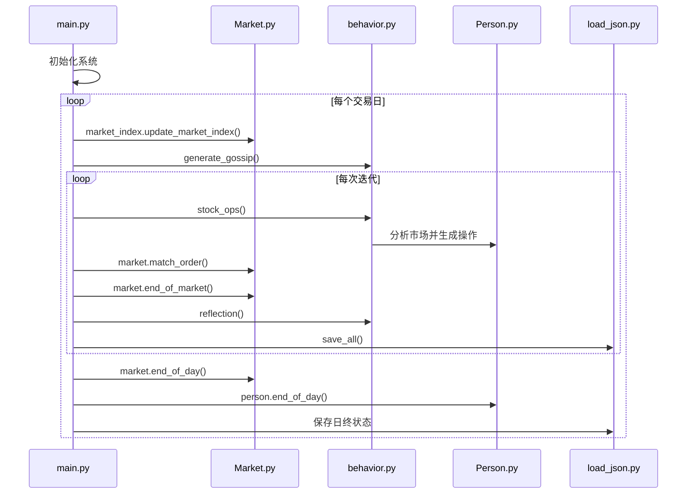
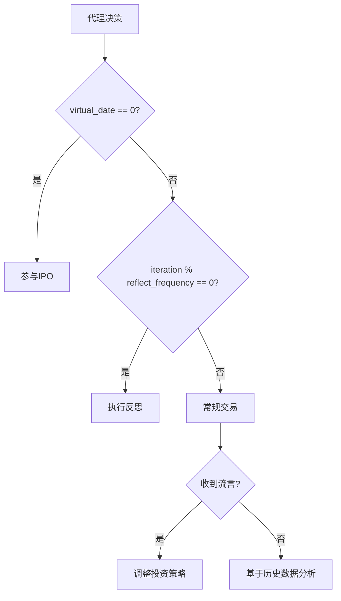

# 全局市场状态管理

<cite>
**本文档引用的文件**  
- [Market.py](file://Agent-Trading-Arena/Stock_Main/Market.py)
- [main.py](file://Agent-Trading-Arena/Stock_Main/main.py)
- [behavior.py](file://Agent-Trading-Arena/Stock_Main/behavior.py)
- [Person.py](file://Agent-Trading-Arena/Stock_Main/Person.py)
- [load_json.py](file://Agent-Trading-Arena/Stock_Main/load_json.py)
- [save/sim_test01/information.json](file://Agent-Trading-Arena/Stock_Main/save/sim_test01/information.json)
- [save/sim_test01/debug_prompts/day0_iter0_market_analysis_prompt.txt](file://Agent-Trading-Arena/Stock_Main/save/sim_test01/debug_prompts/day0_iter0_market_analysis_prompt.txt)
- [save/sim_test01/debug_prompts/day0_iter2_market_analysis_prompt.txt](file://Agent-Trading-Arena/Stock_Main/save/sim_test01/debug_prompts/day0_iter2_market_analysis_prompt.txt)
</cite>

## 目录
1. [引言](#引言)
2. [核心状态变量设计](#核心状态变量设计)
3. [时间推进机制](#时间推进机制)
4. [主循环交互关系](#主循环交互关系)
5. [多日模拟持久化](#多日模拟持久化)
6. [状态变量对代理行为的影响](#状态变量对代理行为的影响)
7. [实例分析：sim_test01](#实例分析sim_test01)
8. [结论](#结论)

## 引言
本项目是一个基于代理的股票交易模拟器，通过多个智能体在虚拟市场中进行交易决策来模拟真实股市行为。系统通过一系列全局状态变量来控制模拟的时间推进和阶段切换，确保所有组件在一致的时间框架下运行。这些状态变量不仅驱动着市场的演化，还影响着每个代理的决策时机和行为模式。

**状态变量作用概述**  
`virtual_date`、`iteration` 和 `current_day` 等全局状态变量构成了模拟器的时间坐标系，它们协同工作以实现：
- 精确的时间推进控制
- 交易阶段的有序切换
- 代理行为的同步触发
- 反思周期的判定与执行
- 跨日状态的持久化管理

## 核心状态变量设计

### virtual_date（虚拟日期）
`virtual_date` 是模拟器中的核心时间单位，表示当前所处的交易日序号。该变量从0开始递增，每完成一个完整的交易日循环后自动加1。

**设计目的**  
- 作为市场演化的主时间轴
- 控制每日初始化和收盘流程
- 为数据库记录提供时间索引
- 触发跨日事件（如分红、价格重置）

**运行机制**  
该变量由主循环驱动，在每个交易日结束时递增。它被传递给所有需要感知日期变化的组件，包括市场、股票、代理等。

### iteration（迭代次数）
`iteration` 表示在单个交易日内进行的交易轮次。每个交易日包含多个迭代周期，允许代理在一天内多次提交订单并观察市场反应。

**设计目的**  
- 实现日内多次交易机制
- 模拟连续竞价过程
- 提供反思和调整策略的机会
- 控制信息传播节奏

**运行机制**  
在每个交易日内，`iteration` 从0开始，每完成一轮交易匹配后递增。当达到预设的最大迭代次数后，进入日终处理流程。

### current_day（当前日）
`current_day` 实际上是 `virtual_date` 的别名或衍生表示，用于强调当前正在处理的交易日。在代码中，这两个变量通常指向同一逻辑概念。

**设计目的**  
- 增强代码可读性
- 在不同上下文中提供语义更明确的变量名
- 便于调试和日志输出

**运行机制**  
`current_day` 与 `virtual_date` 保持同步更新，确保时间一致性。

**节来源**  
- [main.py](file://Agent-Trading-Arena/Stock_Main/main.py#L110-L138)
- [Market.py](file://Agent-Trading-Arena/Stock_Main/Market.py#L21-L30)

## 时间推进机制

### 阶段切换控制
系统通过嵌套循环结构实现时间推进：



**图来源**  
- [main.py](file://Agent-Trading-Arena/Stock_Main/main.py#L110-L138)

### 时间推进流程
1. **日初阶段**：设置 `virtual_date`，初始化市场指数，生成流言
2. **日内循环**：`iteration` 从0递增至预设值，每轮执行：
   - 代理生成买卖决策
   - 市场撮合订单
   - 更新账户和资产
   - 执行反思逻辑
3. **日终阶段**：处理未成交订单，更新持仓，保存状态

## 主循环交互关系

### 主循环结构
主循环位于 `main.py` 文件的 `overall_test` 函数中，是整个模拟器的控制中枢。



**图来源**  
- [main.py](file://Agent-Trading-Arena/Stock_Main/main.py#L110-L138)
- [behavior.py](file://Agent-Trading-Arena/Stock_Main/behavior.py#L82-L200)

### 关键交互点
- **订单撮合**：主循环调用 `market.match_order(virtual_date, args)`，将当前日期作为参数传递
- **反思触发**：基于 `iteration` 值判断是否执行反思逻辑
- **状态保存**：每次迭代后调用 `save_all(virtual_date, iter, ...)` 持久化当前状态

**节来源**  
- [main.py](file://Agent-Trading-Arena/Stock_Main/main.py#L117-L134)

## 多日连续模拟中的递增与持久化行为

### 递增机制
状态变量的递增遵循严格的时序规则：

| 变量 | 递增时机 | 递增条件 | 重置时机 |
|------|----------|----------|----------|
| iteration | 每次交易匹配后 | 总是递增 | 进入新交易日时重置为0 |
| virtual_date | 完成一个交易日后 | 达到预设迭代次数 | 不重置，持续递增 |

### 持久化机制
系统通过 `load_json.py` 模块实现状态持久化：

```python
def save_all(virtual_date, iteration, stocks, market_index, persons, market, args):
    infor_dic = {"virtual_date": virtual_date, "iteration": iteration}
    infor_json = json.dumps(infor_dic, indent=4)
    with open(osp.join(args.Save_Path, "information.json"), "w") as file:
        file.write(infor_json)
    # ... 其他对象序列化
```

**持久化特点**  
- 每次迭代后保存最新状态
- `information.json` 文件记录最新的 `virtual_date` 和 `iteration`
- 使用 pickle 序列化复杂对象
- 支持从任意状态点恢复模拟

**节来源**  
- [load_json.py](file://Agent-Trading-Arena/Stock_Main/load_json.py#L45-L77)
- [save/sim_test01/information.json](file://Agent-Trading-Arena/Stock_Main/save/sim_test01/information.json)

## 状态变量对代理行为的影响

### 行为触发条件
状态变量直接影响代理的行为决策：



**图来源**  
- [behavior.py](file://Agent-Trading-Arena/Stock_Main/behavior.py#L174-L199)
- [Person.py](file://Agent-Trading-Arena/Stock_Main/Person.py#L169-L182)

### 信息传播时机
- **流言生成**：在每日开始时调用 `generate_gossip(virtual_date, ...)`，确保所有代理在同一时间接收新信息
- **信息可见性**：代理只能访问 `virtual_date` 及之前的历史数据，不能预知未来信息

### 反思周期判定
反思周期由 `reflect_frequency` 参数和 `iteration` 共同决定：

```python
if p.reflect_frequency == 0:
    pass
elif (iter + 1) % p.reflect_frequency == 0:
    # 执行反思
    analysis_for_reflect = pre_reflect(virtual_date, p, args.Save_Path)
```

不同代理可以设置不同的反思频率，形成异步反思模式。

**节来源**  
- [behavior.py](file://Agent-Trading-Arena/Stock_Main/behavior.py#L174-L199)
- [Person.py](file://Agent-Trading-Arena/Stock_Main/Person.py#L182)

## 实例分析：sim_test01

### 状态变化轨迹
通过分析 `sim_test01` 目录下的运行实例，可以观察到状态变量的实际变化：

#### 初始状态
```json
// information.json
{
    "virtual_date": 0,
    "iteration": 1
}
```

#### 迭代过程
从调试提示文件可以看出：
- `day0_iter0_market_analysis_prompt.txt`：初始市场分析，所有股票价格不变
- `day0_iter2_market_analysis_prompt.txt`：C股价格上涨3.22%，D股上涨2.41%

这表明在前两次迭代中，市场已经发生了显著变化。

### 文件命名模式
系统使用 `day{virtual_date}_iter{iteration}` 的命名模式来组织调试文件：
- `day0_iter0_*.txt`：第0日第0次迭代
- `day0_iter2_*.txt`：第0日第2次迭代
- `day0_long_reflection_*`：第0日的长反思过程

这种命名方式清晰地反映了状态变量的变化轨迹。

### 状态演进验证
通过比较不同迭代阶段的市场分析提示文件，可以验证：
1. 市场价格随迭代次数递增而动态变化
2. 代理的决策依据随着 `iteration` 增加而更新
3. `virtual_date` 保持不变，直到完成所有日内迭代

**节来源**  
- [save/sim_test01/information.json](file://Agent-Trading-Arena/Stock_Main/save/sim_test01/information.json)
- [save/sim_test01/debug_prompts/day0_iter0_market_analysis_prompt.txt](file://Agent-Trading-Arena/Stock_Main/save/sim_test01/debug_prompts/day0_iter0_market_analysis_prompt.txt)
- [save/sim_test01/debug_prompts/day0_iter2_market_analysis_prompt.txt](file://Agent-Trading-Arena/Stock_Main/save/sim_test01/debug_prompts/day0_iter2_market_analysis_prompt.txt)

## 结论
`virtual_date`、`iteration` 和相关状态变量构成了Agent-Trading-Arena模拟器的核心时间管理系统。这些变量通过精心设计的协同机制，实现了：

1. **精确的时间控制**：通过嵌套循环结构精确控制日间和日内时间推进
2. **灵活的阶段切换**：支持多阶段交易流程和异步代理行为
3. **可靠的持久化**：确保模拟状态可恢复、可复现
4. **动态的行为触发**：基于时间条件触发反思、流言传播等高级行为

这种设计使得模拟器既能保持时间一致性，又能支持复杂的代理交互模式，为研究金融市场中的群体行为提供了强大的工具。