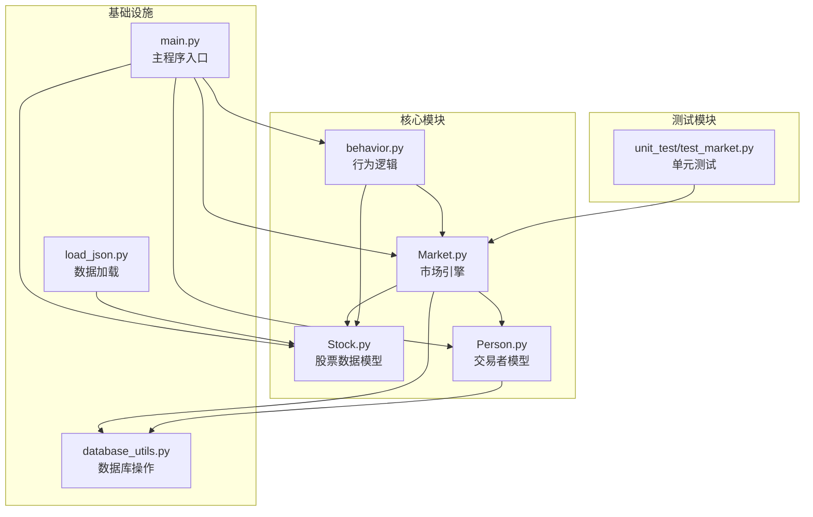
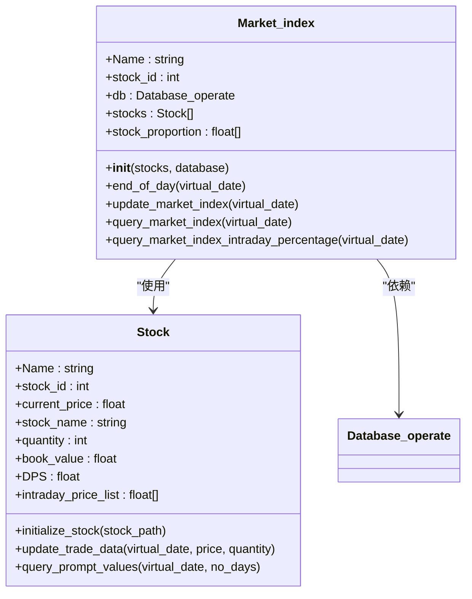
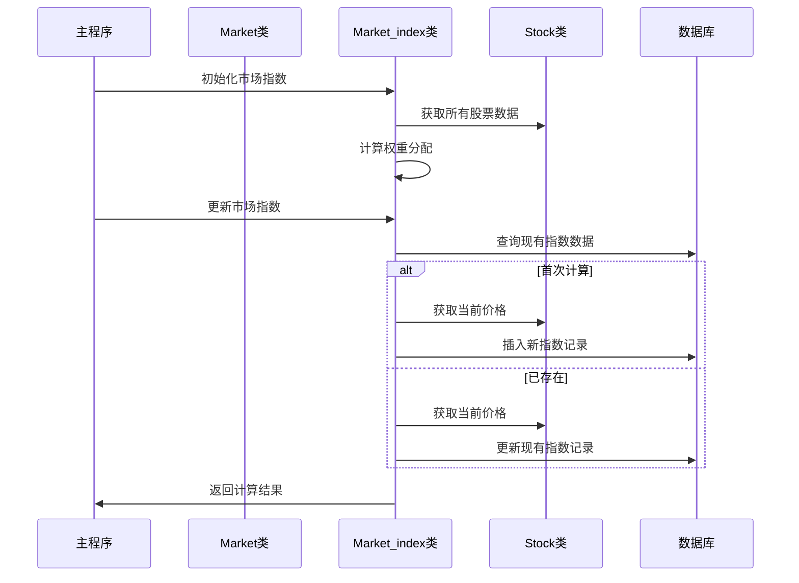
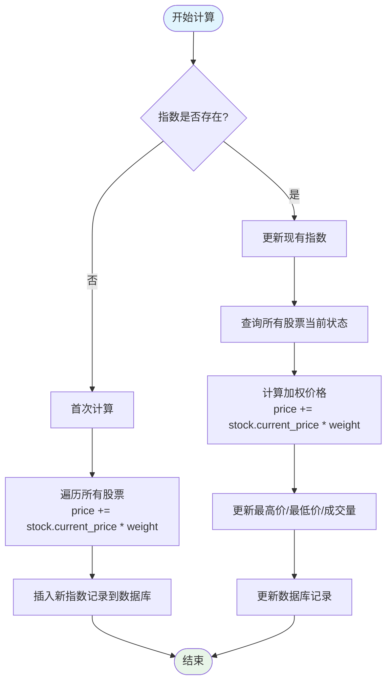
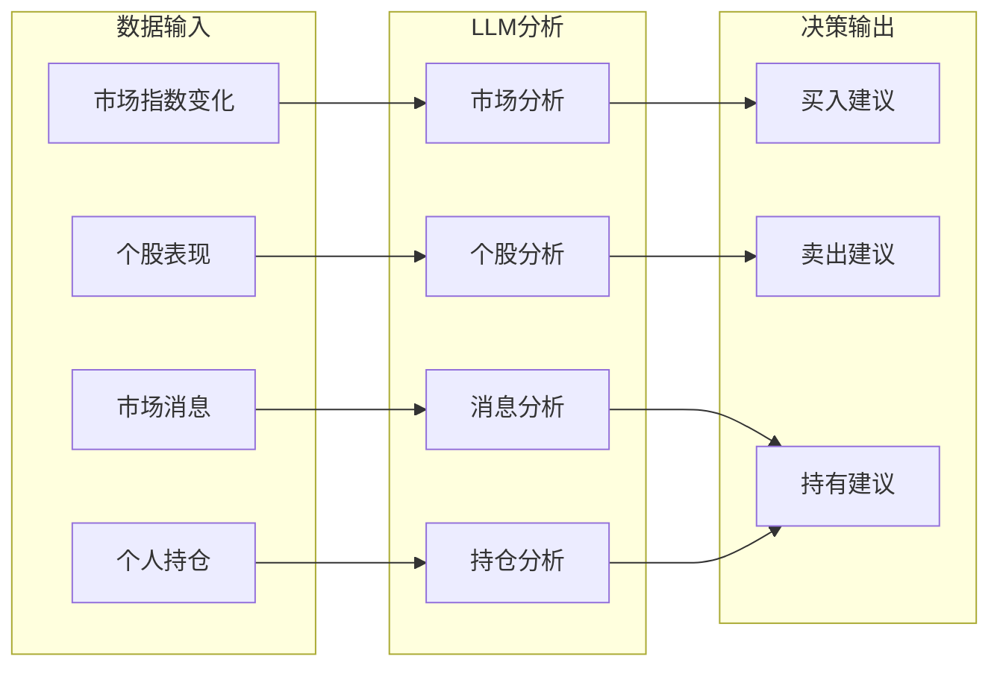
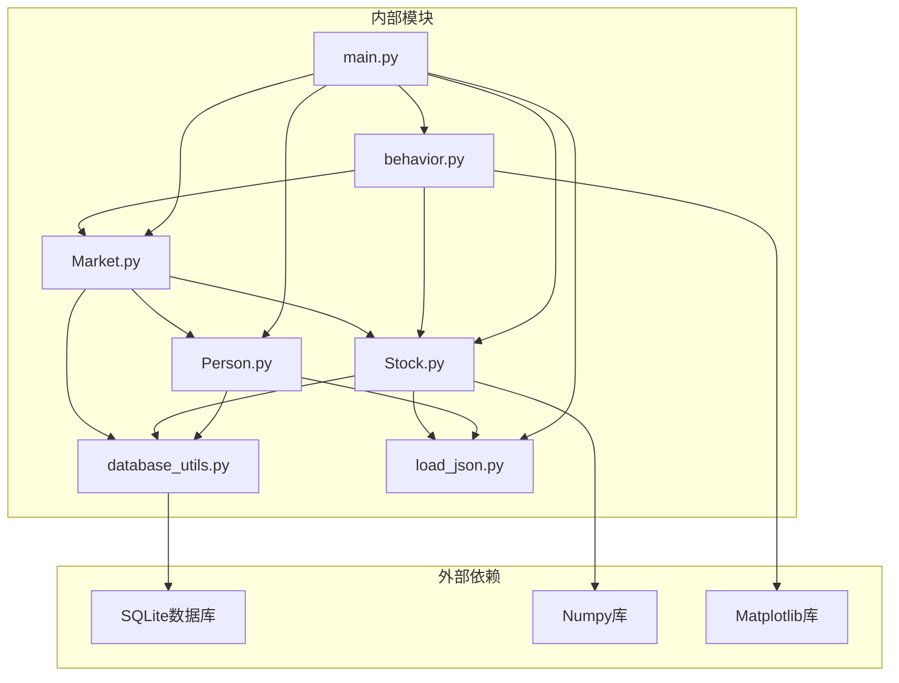

# 市场指数计算逻辑

<cite>
**本文档引用的文件**
- [Market.py](file://Agent-Trading-Arena/Stock_Main/Market.py)
- [Stock.py](file://Agent-Trading-Arena/Stock_Main/Stock.py)
- [main.py](file://Agent-Trading-Arena/Stock_Main/main.py)
- [database_utils.py](file://Agent-Trading-Arena/Stock_Main/database_utils.py)
- [Person.py](file://Agent-Trading-Arena/Stock_Main/Person.py)
- [behavior.py](file://Agent-Trading-Arena/Stock_Main/behavior.py)
- [load_json.py](file://Agent-Trading-Arena/Stock_Main/load_json.py)
- [unit_test/test_market.py](file://Agent-Trading-Arena/Stock_Main/unit_test/test_market.py)
</cite>

## 目录
1. [简介](#简介)
2. [项目结构](#项目结构)
3. [核心组件](#核心组件)
4. [架构概览](#架构概览)
5. [详细组件分析](#详细组件分析)
6. [依赖关系分析](#依赖关系分析)
7. [性能考虑](#性能考虑)
8. [故障排除指南](#故障排除指南)
9. [结论](#结论)

## 简介

本文档深入解析了Agent-Trading-Arena项目中的市场指数计算逻辑，特别是基于各股票账面价值（book_value）加权平均的算法实现。该系统通过Market_index类实现了完整的市场指数计算功能，包括权重分配机制、数据归一化处理以及异常值过滤策略。文档详细说明了如何从Stock.py中的股票数据结构获取并整合多只股票的价格与市值信息，提供了calculate_market_index函数的调用流程，并分析了其在每日开盘前的执行时机与性能影响。

## 项目结构

该项目采用模块化的架构设计，主要包含以下核心模块：



**图表来源**
- [Market.py](file://Agent-Trading-Arena/Stock_Main/Market.py#L1-L278)
- [Stock.py](file://Agent-Trading-Arena/Stock_Main/Stock.py#L1-L307)
- [main.py](file://Agent-Trading-Arena/Stock_Main/main.py#L1-L151)

**章节来源**
- [main.py](file://Agent-Trading-Arena/Stock_Main/main.py#L1-L151)
- [Market.py](file://Agent-Trading-Arena/Stock_Main/Market.py#L1-L278)
- [Stock.py](file://Agent-Trading-Arena/Stock_Main/Stock.py#L1-L307)

## 核心组件

### Market_index类详解

Market_index类是市场指数计算的核心组件，实现了基于账面价值加权的市场指数计算算法：



**图表来源**
- [Stock.py](file://Agent-Trading-Arena/Stock_Main/Stock.py#L212-L306)
- [Stock.py](file://Agent-Trading-Arena/Stock_Main/Stock.py#L14-L307)

### 权重分配机制

Market_index类的核心算法基于账面价值进行权重分配：

1. **账面价值计算**：每个股票的账面价值 = 当前价格 × 发行数量
2. **总权重计算**：所有股票账面价值的总和
3. **权重分配**：每只股票的权重 = 该股票账面价值 / 总账面价值

**章节来源**
- [Stock.py](file://Agent-Trading-Arena/Stock_Main/Stock.py#L219-L222)

## 架构概览

系统采用分层架构设计，各组件职责明确：



**图表来源**
- [main.py](file://Agent-Trading-Arena/Stock_Main/main.py#L110-L127)
- [Stock.py](file://Agent-Trading-Arena/Stock_Main/Stock.py#L227-L276)

## 详细组件分析

### Market_index.update_market_index方法

这是市场指数计算的核心方法，实现了完整的加权平均算法：



**图表来源**
- [Stock.py](file://Agent-Trading-Arena/Stock_Main/Stock.py#L227-L276)

#### 权重分配算法实现

Market_index类的权重分配机制：

1. **初始化阶段**：
   ```python
   total_book_value = sum([stock.book_value for stock in self.stocks])
   self.stock_proportion = [
       stock.book_value / total_book_value for stock in self.stocks
   ]
   ```

2. **计算阶段**：
   ```python
   price = 0
   for index, stock in enumerate(self.stocks):
       price += stock.current_price * self.stock_proportion[index]
   ```

#### 数据归一化处理

系统通过以下方式确保数据的一致性和准确性：

1. **价格四舍五入**：使用`round_two_decimal`函数确保价格精度
2. **百分比计算**：使用`round_lists_two_decimals`函数处理百分比数据
3. **时间戳标准化**：通过`Virtual_date`类统一时间格式

**章节来源**
- [Stock.py](file://Agent-Trading-Arena/Stock_Main/Stock.py#L212-L306)
- [database_utils.py](file://Agent-Trading-Arena/Stock_Main/database_utils.py#L138-L153)

### 异常值过滤策略

系统通过多重机制防止异常值影响市场指数计算：

1. **价格限制检查**：在订单匹配过程中使用`Daily_Price_Limit`参数限制价格波动幅度
2. **库存验证**：确保经纪人有足够的股票进行交易
3. **订单状态验证**：过滤无效或已完成的订单

**章节来源**
- [Market.py](file://Agent-Trading-Arena/Stock_Main/Market.py#L44-L53)
- [Market.py](file://Agent-Trading-Arena/Stock_Main/Market.py#L113-L117)

### LLM代理决策支持

市场指数为LLM代理提供了重要的决策输入：



**图表来源**
- [behavior.py](file://Agent-Trading-Arena/Stock_Main/behavior.py#L414-L483)

**章节来源**
- [behavior.py](file://Agent-Trading-Arena/Stock_Main/behavior.py#L414-L483)
- [Person.py](file://Agent-Trading-Arena/Stock_Main/Person.py#L514-L545)

## 依赖关系分析

系统组件间的依赖关系如下：



**图表来源**
- [database_utils.py](file://Agent-Trading-Arena/Stock_Main/database_utils.py#L1-L322)
- [main.py](file://Agent-Trading-Arena/Stock_Main/main.py#L1-L151)

**章节来源**
- [database_utils.py](file://Agent-Trading-Arena/Stock_Main/database_utils.py#L1-L322)
- [main.py](file://Agent-Trading-Arena/Stock_Main/main.py#L1-L151)

## 性能考虑

### 计算复杂度分析

1. **权重计算复杂度**：O(n)，其中n为股票数量
2. **指数更新复杂度**：O(n)，需要遍历所有股票
3. **内存使用**：主要消耗在存储股票数据和中间计算结果

### 优化策略

1. **批量数据库操作**：减少数据库往返次数
2. **缓存机制**：缓存常用的统计数据
3. **异步处理**：对于非关键路径的操作使用异步处理

### 执行时机分析

市场指数计算在以下时机执行：

1. **每日开盘前**：`market_index.update_market_index(virtual_date)`调用
2. **交易时段内**：根据市场活动动态调整
3. **收盘后**：`market_index.end_of_day()`完成当日统计

**章节来源**
- [main.py](file://Agent-Trading-Arena/Stock_Main/main.py#L114-L127)
- [Stock.py](file://Agent-Trading-Arena/Stock_Main/Stock.py#L224-L225)

## 故障排除指南

### 常见问题及解决方案

1. **数据库连接问题**
   - 检查数据库文件路径
   - 确认数据库表结构正确
   - 验证权限设置

2. **股票数据不一致**
   - 检查`book_value`计算是否正确
   - 验证权重总和是否为1.0
   - 确认价格数据的时效性

3. **LLM响应异常**
   - 检查prompt模板文件完整性
   - 验证输入数据格式
   - 确认模型配置正确

**章节来源**
- [database_utils.py](file://Agent-Trading-Arena/Stock_Main/database_utils.py#L302-L310)
- [unit_test/test_market.py](file://Agent-Trading-Arena/Stock_Main/unit_test/test_market.py#L1-L149)

## 结论

本系统通过Market_index类实现了基于账面价值加权的市场指数计算，具有以下特点：

1. **准确性**：使用真实的账面价值作为权重基础，确保指数反映市场真实状况
2. **实时性**：支持动态更新，能够及时反映市场变化
3. **可扩展性**：模块化设计便于添加新的股票或修改计算规则
4. **智能化**：为LLM代理提供决策支持，增强系统的智能决策能力

该实现为Agent-Trading-Arena项目提供了坚实的数据基础，支持复杂的交易策略制定和风险控制。