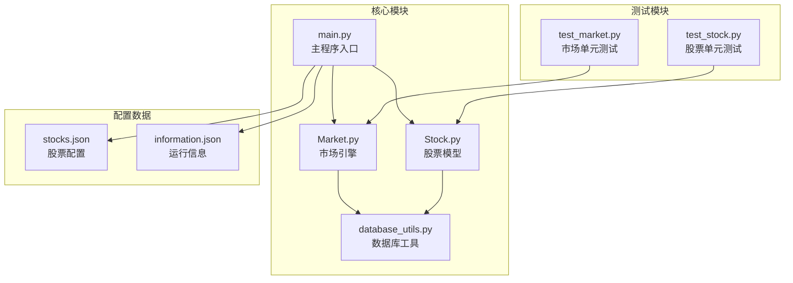
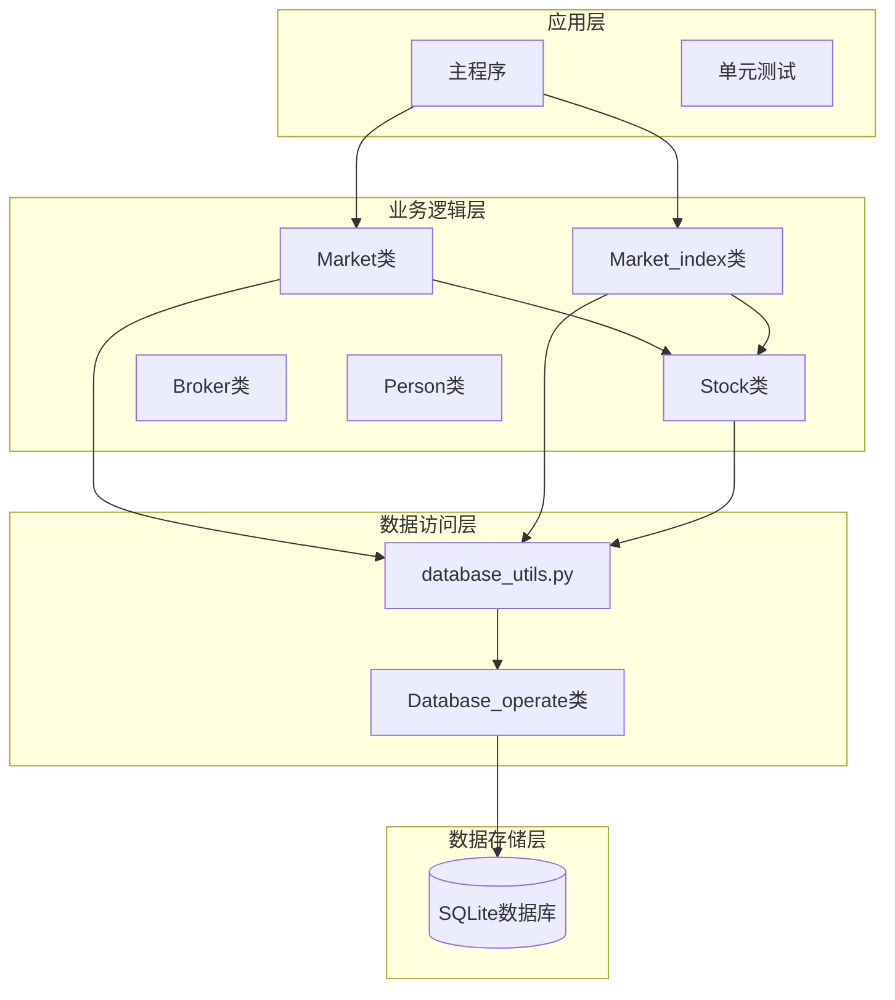
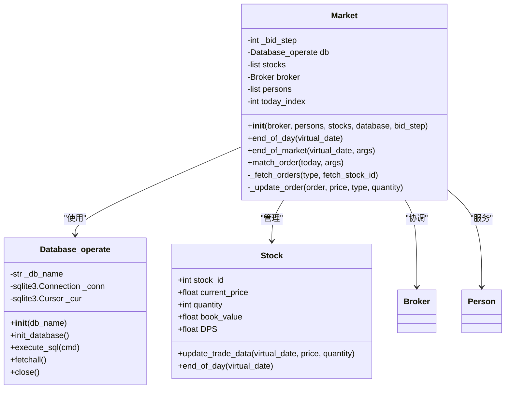
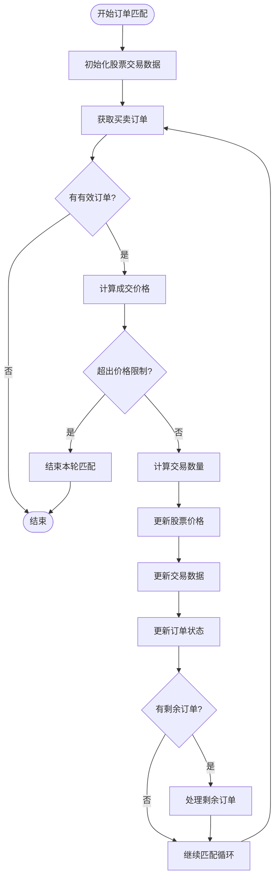
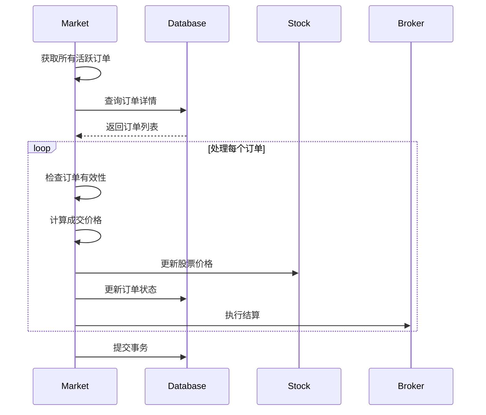
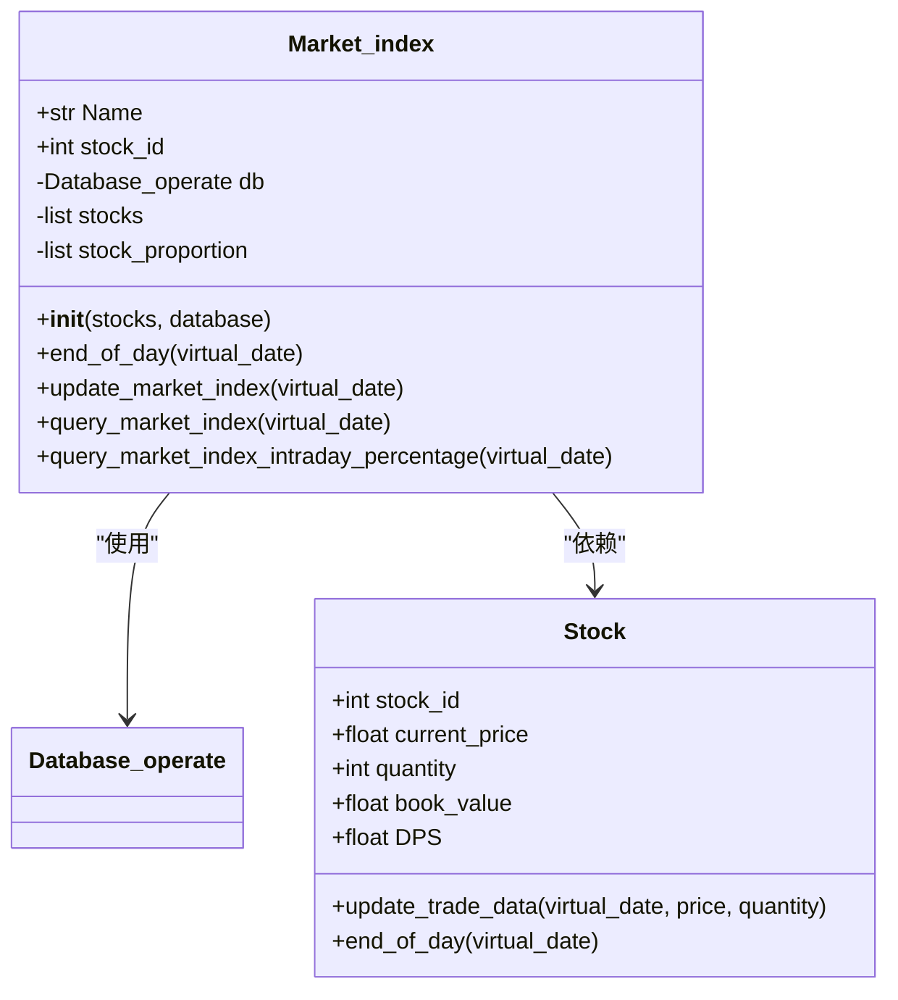
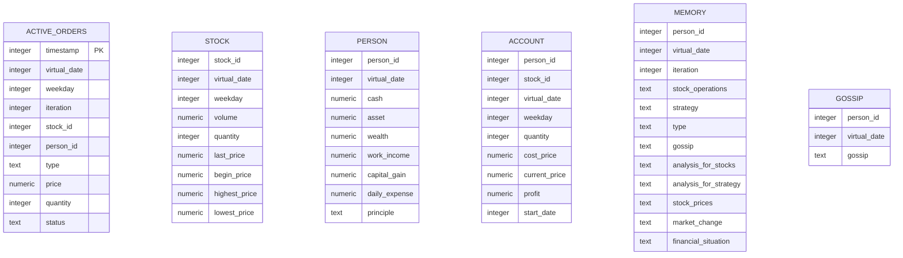
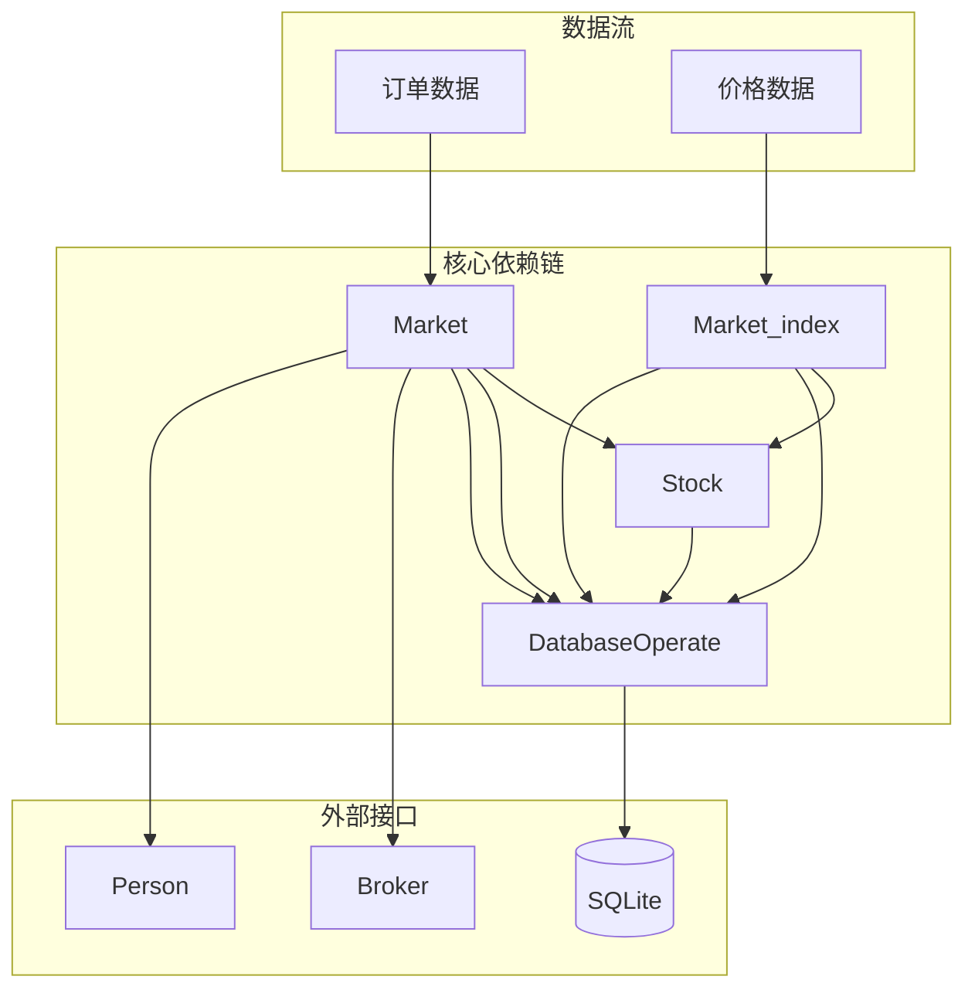

# 市场数据模型

<cite>
**本文档引用的文件**
- [Market.py](file://Agent-Trading-Arena/Stock_Main/Market.py)
- [Stock.py](file://Agent-Trading-Arena/Stock_Main/Stock.py)
- [database_utils.py](file://Agent-Trading-Arena/Stock_Main/database_utils.py)
- [main.py](file://Agent-Trading-Arena/Stock_Main/main.py)
- [test_market.py](file://Agent-Trading-Arena/Stock_Main/unit_test/test_market.py)
- [test_stock.py](file://Agent-Trading-Arena/Stock_Main/unit_test/test_stock.py)
- [information.json](file://Agent-Trading-Arena/Stock_Main/save/sim_test01/information.json)
- [stocks.json](file://Agent-Trading-Arena/Stock_Main/save/sim_test01/stocks.json)
</cite>

## 目录
1. [简介](#简介)
2. [项目结构](#项目结构)
3. [核心组件](#核心组件)
4. [架构概览](#架构概览)
5. [详细组件分析](#详细组件分析)
6. [依赖关系分析](#依赖关系分析)
7. [性能考虑](#性能考虑)
8. [故障排除指南](#故障排除指南)
9. [结论](#结论)

## 简介

本文档详细说明了Agent Trading Arena项目中的市场数据模型，重点分析Market类和Market_index类的设计与实现。该系统采用基于SQLite的数据库存储，实现了完整的股票市场模拟环境，包括订单匹配、价格发现、市场指数计算等功能。

系统的核心创新在于使用基于股票账面价值的加权平均算法来计算市场指数，这种设计能够更好地反映市场的整体健康状况和权重分配。

## 项目结构

该项目采用模块化的Python架构，主要包含以下核心模块：



**图表来源**
- [main.py](file://Agent-Trading-Arena/Stock_Main/main.py#L1-L151)
- [Market.py](file://Agent-Trading-Arena/Stock_Main/Market.py#L1-L278)
- [Stock.py](file://Agent-Trading-Arena/Stock_Main/Stock.py#L1-L307)

**章节来源**
- [main.py](file://Agent-Trading-Arena/Stock_Main/main.py#L1-L151)
- [Market.py](file://Agent-Trading-Arena/Stock_Main/Market.py#L1-L278)
- [Stock.py](file://Agent-Trading-Arena/Stock_Main/Stock.py#L1-L307)

## 核心组件

### Market类概述

Market类是整个交易系统的协调器，负责管理订单匹配、价格更新和市场状态维护。其核心职责包括：

- 订单收集与排序
- 价格匹配算法
- 市场状态更新
- 数据库持久化

### Market_index类概述

Market_index类专门负责市场指数的计算与维护，采用基于账面价值的加权平均方法，确保指数能够准确反映市场的整体表现。

**章节来源**
- [Market.py](file://Agent-Trading-Arena/Stock_Main/Market.py#L12-L278)
- [Stock.py](file://Agent-Trading-Arena/Stock_Main/Stock.py#L212-L296)

## 架构概览

系统采用分层架构设计，各层职责明确：



**图表来源**
- [main.py](file://Agent-Trading-Arena/Stock_Main/main.py#L98-L146)
- [Market.py](file://Agent-Trading-Arena/Stock_Main/Market.py#L12-L278)
- [Stock.py](file://Agent-Trading-Arena/Stock_Main/Stock.py#L212-L296)
- [database_utils.py](file://Agent-Trading-Arena/Stock_Main/database_utils.py#L245-L322)

## 详细组件分析

### Market类详细分析

#### 类结构图



**图表来源**
- [Market.py](file://Agent-Trading-Arena/Stock_Main/Market.py#L12-L278)
- [database_utils.py](file://Agent-Trading-Arena/Stock_Main/database_utils.py#L245-L322)
- [Stock.py](file://Agent-Trading-Arena/Stock_Main/Stock.py#L14-L127)

#### 关键方法分析

##### 订单匹配算法 (`match_order`)

Market类的核心功能是实现高效的订单匹配算法：



**图表来源**
- [Market.py](file://Agent-Trading-Arena/Stock_Main/Market.py#L96-L199)

##### 结束市场处理 (`end_of_market`)

该方法处理市场收盘时的未完成订单：



**图表来源**
- [Market.py](file://Agent-Trading-Arena/Stock_Main/Market.py#L30-L95)

**章节来源**
- [Market.py](file://Agent-Trading-Arena/Stock_Main/Market.py#L96-L265)

### Market_index类详细分析

#### 类结构图



**图表来源**
- [Stock.py](file://Agent-Trading-Arena/Stock_Main/Stock.py#L212-L296)
- [database_utils.py](file://Agent-Trading-Arena/Stock_Main/database_utils.py#L245-L322)

#### 市场指数计算算法

Market_index类采用基于账面价值的加权平均算法：

**算法原理：**
1. 计算所有股票的总账面价值
2. 确定每只股票的权重比例（账面价值/总账面价值）
3. 使用加权平均公式计算市场指数：`指数 = Σ(股票价格 × 权重)`

**加权平均公式：**
```
Market_Index = Σ(Pi × Wi)
Where:
- Pi = 第i只股票的价格
- Wi = 第i只股票的权重 = (Pi × Qi) / Total_Book_Value
- Total_Book_Value = Σ(Pi × Qi)
```

**章节来源**
- [Stock.py](file://Agent-Trading-Arena/Stock_Main/Stock.py#L212-L296)

### 全局状态变量分析

#### 虚拟日期（virtual_date）

虚拟日期是系统的时间概念，用于模拟真实市场的交易时间线：

- **作用**：标识当前交易日
- **范围**：从0开始递增
- **持久化**：通过数据库存储在各个表中
- **影响**：影响订单的有效性、价格查询和历史数据存储

#### 迭代次数（iteration）

迭代次数代表一天内的交易轮次：

- **作用**：区分同一天内的不同交易时段
- **范围**：0 到 Iterations_Daily-1
- **计算**：`virtual_date_index = first_day + days + iteration_hours`
- **影响**：影响订单的执行顺序和价格发现过程

**章节来源**
- [main.py](file://Agent-Trading-Arena/Stock_Main/main.py#L110-L146)
- [Stock.py](file://Agent-Trading-Arena/Stock_Main/Stock.py#L298-L306)

## 依赖关系分析

### 数据库表结构

系统使用SQLite数据库存储所有市场数据，核心表结构如下：



**图表来源**
- [database_utils.py](file://Agent-Trading-Arena/Stock_Main/database_utils.py#L256-L300)

### 组件间依赖关系



**图表来源**
- [Market.py](file://Agent-Trading-Arena/Stock_Main/Market.py#L7-L8)
- [Stock.py](file://Agent-Trading-Arena/Stock_Main/Stock.py#L4-L10)
- [database_utils.py](file://Agent-Trading-Arena/Stock_Main/database_utils.py#L245-L322)

**章节来源**
- [database_utils.py](file://Agent-Trading-Arena/Stock_Main/database_utils.py#L245-L322)

## 性能考虑

### 订单匹配优化

1. **索引策略**：建议在数据库中为以下字段创建索引：
   - `active_orders(stock_id, type, status, price)`
   - `stock(stock_id, virtual_date)`

2. **批量操作**：使用批量插入和更新减少数据库往返

3. **内存管理**：合理控制订单缓存大小，避免内存溢出

### 数据库性能优化

1. **连接池**：复用数据库连接减少开销
2. **事务批处理**：将多个操作合并到单个事务中
3. **查询优化**：使用参数化查询防止SQL注入

## 故障排除指南

### 常见问题及解决方案

#### 订单匹配异常

**问题**：订单无法匹配或价格异常波动
**原因**：
- 价格限制设置过严
- 订单量过大导致库存不足
- 价格发现算法参数不当

**解决方法**：
1. 检查 `Daily_Price_Limit` 参数设置
2. 验证 `Fluctuation_Constant` 参数合理性
3. 确认股票库存充足

#### 数据库连接问题

**问题**：数据库操作失败或连接超时
**原因**：
- 数据库文件损坏
- 并发访问冲突
- 磁盘空间不足

**解决方法**：
1. 检查数据库文件完整性
2. 实施适当的锁机制
3. 监控磁盘使用情况

**章节来源**
- [test_market.py](file://Agent-Trading-Arena/Stock_Main/unit_test/test_market.py#L128-L145)

## 结论

本市场数据模型通过精心设计的架构实现了高效、可扩展的股票市场模拟系统。Market类提供了强大的订单匹配能力，而Market_index类则通过基于账面价值的加权平均算法确保了市场指数的准确性。

系统的主要优势包括：

1. **模块化设计**：清晰的职责分离便于维护和扩展
2. **数据持久化**：完整的数据库支持保证了数据的可靠性和可追溯性
3. **算法创新**：基于账面价值的市场指数计算提供了更真实的市场指标
4. **性能优化**：合理的数据库设计和算法实现确保了系统的高效运行

该模型为金融市场的研究和教育提供了宝贵的工具，能够帮助用户深入理解市场运作机制和投资策略的影响。