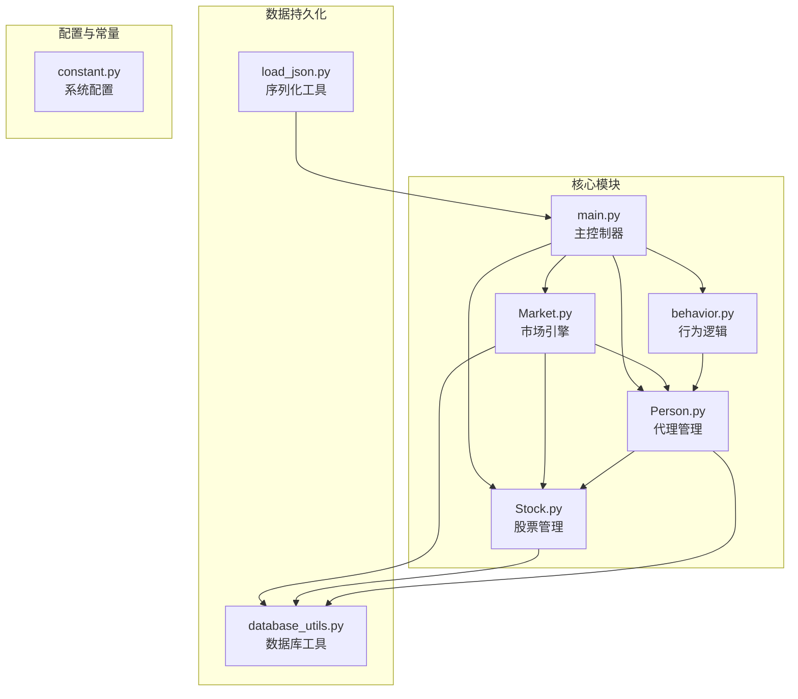
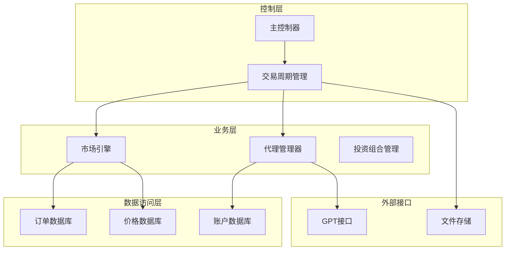
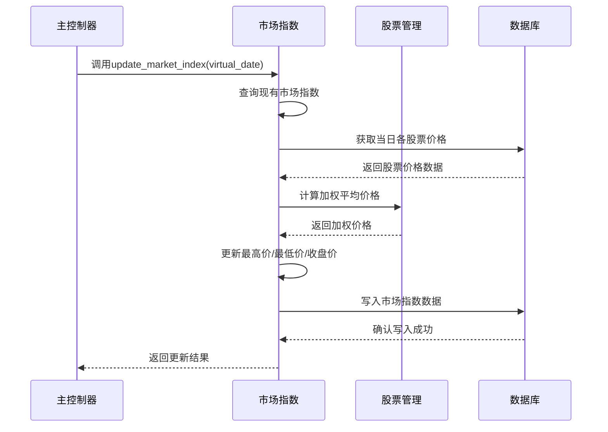
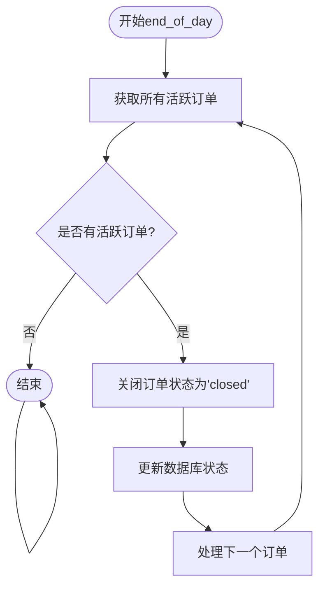
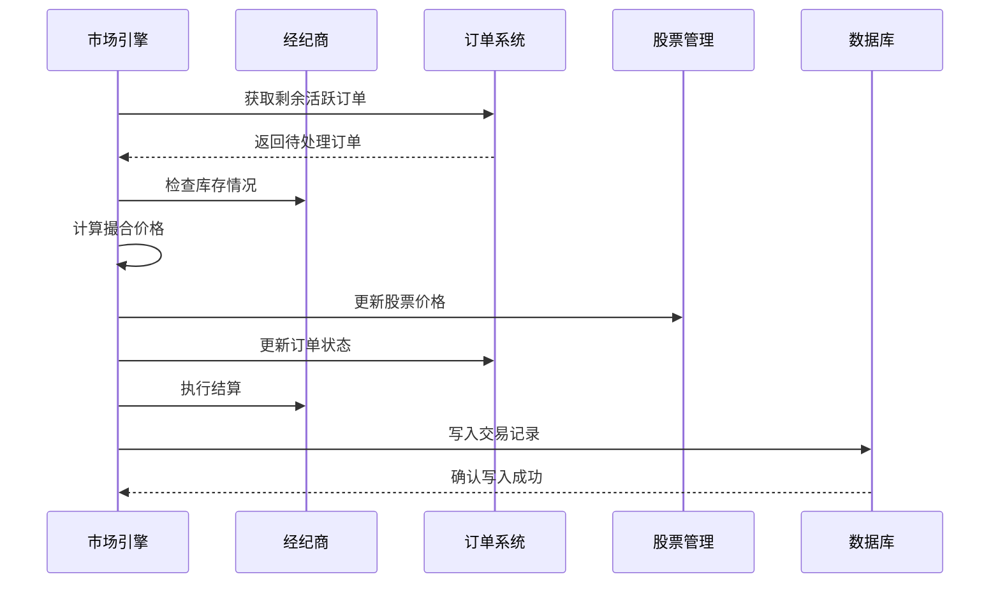
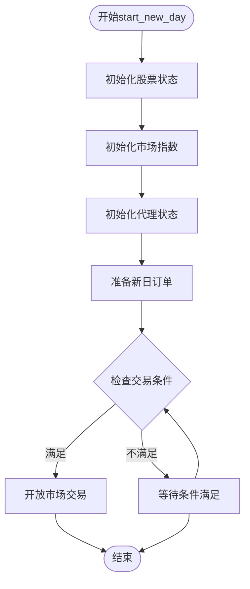
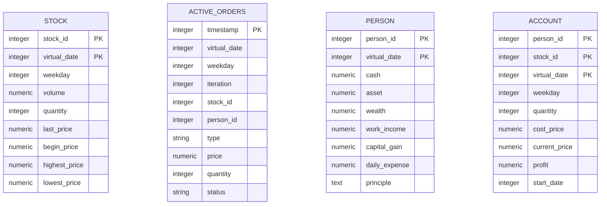
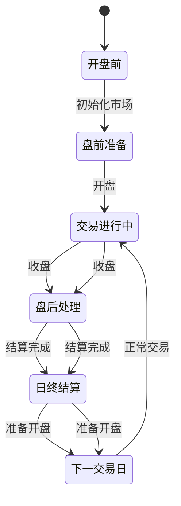
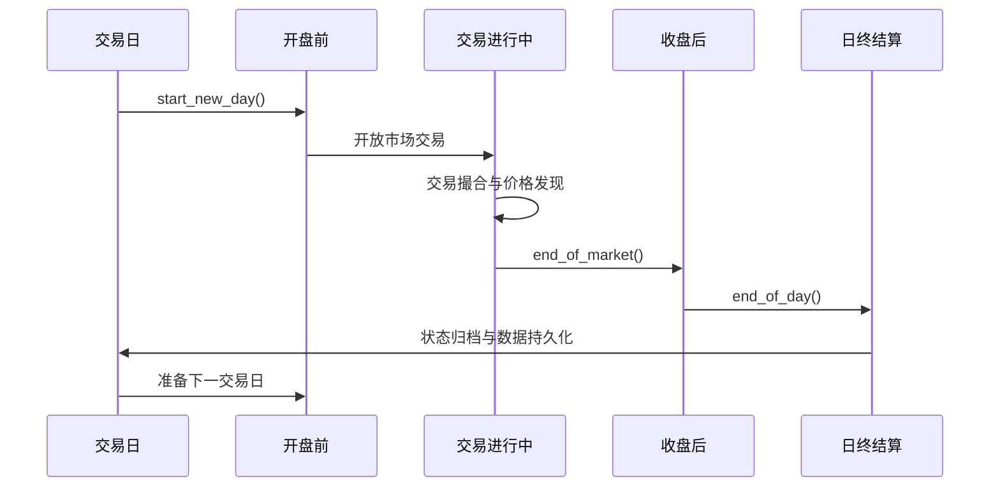
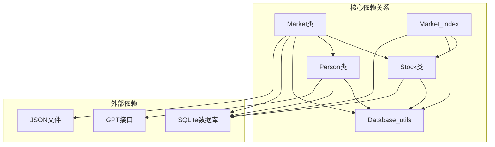

# 市场生命周期与交易周期控制

<cite>
**本文档引用的文件**
- [Market.py](file://Agent-Trading-Arena/Stock_Main/Market.py)
- [Stock.py](file://Agent-Trading-Arena/Stock_Main/Stock.py)
- [database_utils.py](file://Agent-Trading-Arena/Stock_Main/database_utils.py)
- [main.py](file://Agent-Trading-Arena/Stock_Main/main.py)
- [Person.py](file://Agent-Trading-Arena/Stock_Main/Person.py)
- [behavior.py](file://Agent-Trading-Arena/Stock_Main/behavior.py)
- [load_json.py](file://Agent-Trading-Arena/Stock_Main/load_json.py)
</cite>

## 目录
1. [简介](#简介)
2. [项目结构](#项目结构)
3. [核心组件](#核心组件)
4. [架构概览](#架构概览)
5. [详细组件分析](#详细组件分析)
6. [依赖关系分析](#依赖关系分析)
7. [性能考虑](#性能考虑)
8. [故障排除指南](#故障排除指南)
9. [结论](#结论)

## 简介

本文件深入解析Market类中update_market_index、end_of_day、start_new_day等核心方法的执行流程与业务意义。该系统是一个基于代理的股票交易仿真平台，通过模拟市场生命周期和交易周期来研究智能体在金融市场的行为模式。

系统采用SQLite数据库进行数据持久化，支持多代理（Person）参与股票交易，每个代理都有独立的投资策略和风险偏好。市场通过Market_index类维护市场综合指标，通过Stock类管理单个股票的实时价格和交易数据。

## 项目结构

项目采用模块化设计，主要包含以下核心模块：

**图表来源**
- [main.py](file://Agent-Trading-Arena/Stock_Main/main.py#L1-L151)
- [Market.py](file://Agent-Trading-Arena/Stock_Main/Market.py#L1-L278)
- [Stock.py](file://Agent-Trading-Arena/Stock_Main/Stock.py#L1-L307)

**章节来源**
- [main.py](file://Agent-Trading-Arena/Stock_Main/main.py#L1-L151)
- [Market.py](file://Agent-Trading-Arena/Stock_Main/Market.py#L1-L278)
- [Stock.py](file://Agent-Trading-Arena/Stock_Main/Stock.py#L1-L307)

## 核心组件

### Market类核心功能

Market类是整个交易系统的核心引擎，负责协调市场交易活动和状态管理：

- **订单匹配引擎**：实现买方和卖方订单的自动匹配
- **价格发现机制**：基于供需关系动态调整股价
- **市场状态管理**：维护活跃订单和交易历史
- **结算处理**：完成交易后的资金和证券结算

### Market_index类职责

Market_index类专门负责市场综合指标的计算和维护：

- **市场指数计算**：基于各股票权重计算综合市场指数
- **日终结算**：记录每日市场表现
- **实时监控**：提供市场趋势分析数据

### 数据库持久化

系统使用SQLite数据库存储所有交易相关数据，包括：
- 活跃订单表（active_orders）
- 股票价格表（stock）
- 个人财务表（person）
- 账户明细表（account）
- 记忆和反思数据（memory）

**章节来源**
- [Market.py](file://Agent-Trading-Arena/Stock_Main/Market.py#L12-L278)
- [Stock.py](file://Agent-Trading-Arena/Stock_Main/Stock.py#L212-L296)
- [database_utils.py](file://Agent-Trading-Arena/Stock_Main/database_utils.py#L245-L322)

## 架构概览

系统采用分层架构设计，从上到下分为控制层、业务层、数据访问层：

**图表来源**
- [main.py](file://Agent-Trading-Arena/Stock_Main/main.py#L99-L151)
- [behavior.py](file://Agent-Trading-Arena/Stock_Main/behavior.py#L82-L210)

## 详细组件分析

### Market类核心方法深度解析

#### update_market_index方法

update_market_index方法负责计算和更新市场综合指数：

**图表来源**
- [Stock.py](file://Agent-Trading-Arena/Stock_Main/Stock.py#L227-L277)

**执行流程特点**：
- **权重计算**：基于各股票的账面价值权重
- **实时更新**：每次交易后即时更新市场指数
- **数据完整性**：同时更新开盘价、最高价、最低价、收盘价

#### end_of_day方法

end_of_day方法处理交易日结束时的清理工作：

**图表来源**
- [Market.py](file://Agent-Trading-Arena/Stock_Main/Market.py#L21-L29)

**业务意义**：
- **风险控制**：防止过夜未成交订单造成市场风险
- **系统清理**：释放内存资源，避免数据污染
- **合规要求**：符合证券交易的T+1结算规则

#### end_of_market方法

end_of_market方法处理市场收市时的最后撮合：

**图表来源**
- [Market.py](file://Agent-Trading-Arena/Stock_Main/Market.py#L30-L95)

**处理逻辑**：
- **价格限制**：防止异常价格波动
- **库存检查**：确保有足够股票满足需求
- **部分成交**：支持不完全匹配的订单处理

#### start_new_day方法

start_new_day方法负责新交易日的准备工作：

**业务意义**：
- **状态重置**：清除前日残留状态
- **参数初始化**：设置新日交易参数
- **系统准备**：确保所有组件就绪

**章节来源**
- [Market.py](file://Agent-Trading-Arena/Stock_Main/Market.py#L21-L95)
- [Stock.py](file://Agent-Trading-Arena/Stock_Main/Stock.py#L224-L226)

### 数据库持久化机制

#### market_index表结构

根据database_utils.py中的定义，市场指数数据存储在stock表中，具有以下结构：

**图表来源**
- [database_utils.py](file://Agent-Trading-Arena/Stock_Main/database_utils.py#L256-L300)

**数据存储特点**：
- **复合主键**：确保数据唯一性和完整性
- **时间维度**：支持历史数据查询和回溯
- **财务指标**：包含完整的财务分析字段

#### 数据查询接口

系统提供了丰富的查询接口来支持数据分析：

| 接口名称 | 功能描述 | 返回数据类型 |
|---------|----------|-------------|
| query_all_stocks | 查询指定日期的所有股票 | 股票列表 |
| query_market_index | 查询市场指数数据 | 指数记录 |
| query_hold_stocks | 查询持有股票 | 账户明细 |
| query_person | 查询个人财务状况 | 个人信息 |

**章节来源**
- [database_utils.py](file://Agent-Trading-Arena/Stock_Main/database_utils.py#L162-L322)

### 交易周期控制流程

系统采用标准的金融交易周期模型：

**完整交易周期时序**：

**图表来源**
- [main.py](file://Agent-Trading-Arena/Stock_Main/main.py#L110-L146)

**章节来源**
- [main.py](file://Agent-Trading-Arena/Stock_Main/main.py#L99-L151)

## 依赖关系分析

系统采用松耦合的设计原则，各组件间通过明确的接口进行交互：

**依赖特点**：
- **单向依赖**：避免循环依赖问题
- **接口抽象**：通过Database_operate统一数据库访问
- **模块独立**：各模块可独立测试和维护

**章节来源**
- [Market.py](file://Agent-Trading-Arena/Stock_Main/Market.py#L7-L8)
- [Stock.py](file://Agent-Trading-Arena/Stock_Main/Stock.py#L4-L10)
- [Person.py](file://Agent-Trading-Arena/Stock_Main/Person.py#L2-L16)

## 性能考虑

### 数据库优化策略

1. **索引设计**：为常用查询字段建立索引
2. **批量操作**：合并多个SQL操作减少网络往返
3. **连接池**：复用数据库连接提高效率
4. **事务管理**：合理使用事务保证数据一致性

### 内存管理

1. **对象池**：复用频繁创建的对象
2. **延迟加载**：按需加载数据减少内存占用
3. **垃圾回收**：及时释放不再使用的对象
4. **序列化优化**：使用高效的序列化格式

### 并发控制

1. **读写分离**：区分读写操作优化性能
2. **锁粒度**：最小化锁的范围和持有时间
3. **异步处理**：将耗时操作异步化
4. **缓存策略**：合理使用缓存减少重复计算

## 故障排除指南

### 常见问题及解决方案

| 问题类型 | 症状描述 | 可能原因 | 解决方案 |
|---------|----------|---------|---------|
| 订单无法匹配 | 交易量异常低 | 价格限制设置过高 | 调整Daily_Price_Limit参数 |
| 数据不一致 | 财务报表错误 | 事务未正确提交 | 检查数据库事务处理 |
| 性能问题 | 系统响应缓慢 | 缺少索引或连接池 | 优化数据库查询和连接管理 |
| 内存泄漏 | 内存持续增长 | 对象未正确释放 | 检查对象生命周期管理 |

### 调试技巧

1. **日志记录**：详细记录关键操作和状态变化
2. **断点调试**：在关键节点设置断点分析执行流程
3. **单元测试**：编写针对性的单元测试验证功能正确性
4. **性能分析**：使用性能分析工具识别瓶颈

**章节来源**
- [database_utils.py](file://Agent-Trading-Arena/Stock_Main/database_utils.py#L302-L310)

## 结论

本系统通过精心设计的Market类和Market_index类实现了完整的金融交易仿真环境。核心方法的执行流程体现了现代金融市场的运行机制：

1. **update_market_index**确保市场指数的准确计算和实时更新
2. **end_of_day**提供有效的风险控制和系统清理机制  
3. **end_of_market**实现公平的市场收市处理
4. **start_new_day**保证交易的连续性和系统稳定性

通过SQLite数据库的可靠持久化和完善的查询接口，系统能够支持复杂的数据分析和历史回溯。代理行为模块的引入使得系统具备了学习和适应能力，为研究智能体在金融市场中的行为模式提供了理想的实验平台。

该架构设计充分考虑了可扩展性、可维护性和性能优化，在保持系统简洁的同时提供了强大的功能支持。