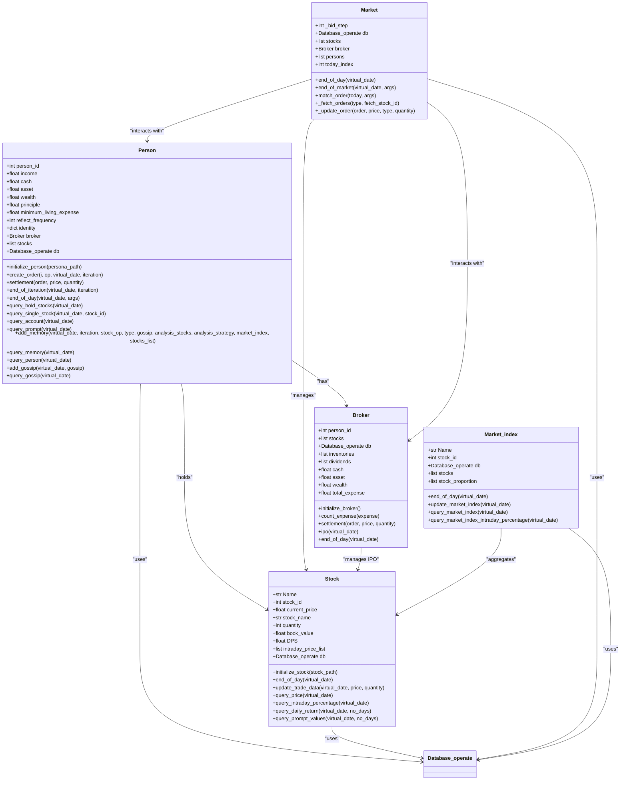
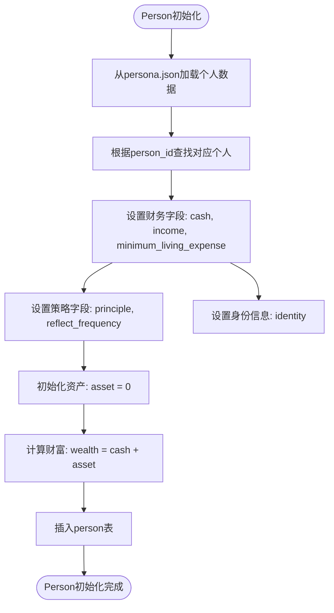
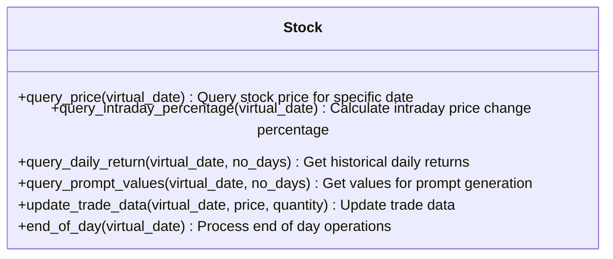
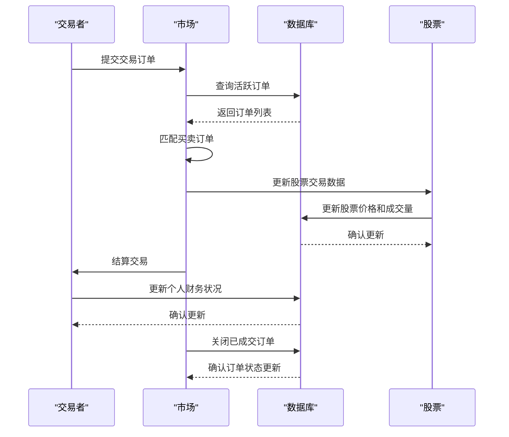
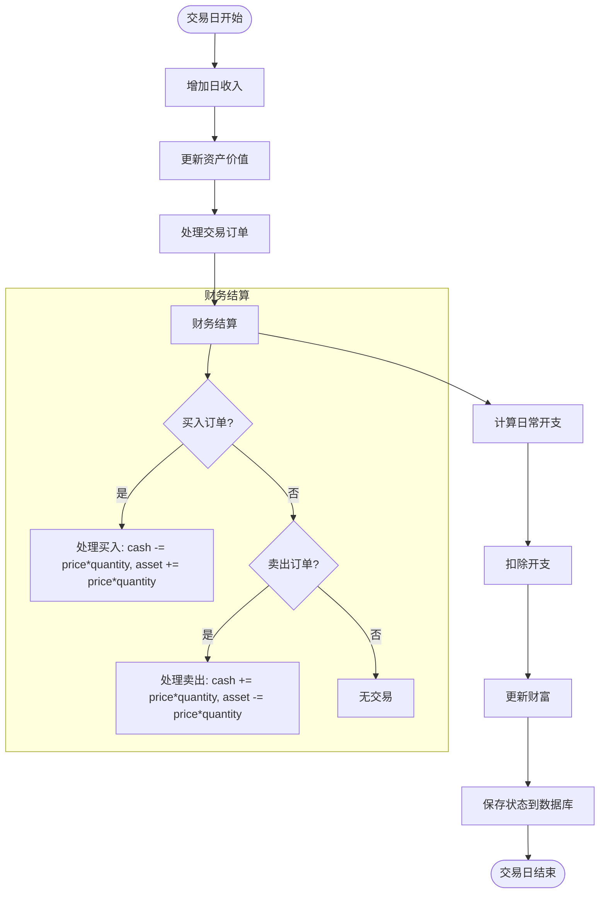

# 数据模型定义

<cite>
**本文档中引用的文件**  
- [Person.py](file://Agent-Trading-Arena/Stock_Main/Person.py)
- [Stock.py](file://Agent-Trading-Arena/Stock_Main/Stock.py)
- [Market.py](file://Agent-Trading-Arena/Stock_Main/Market.py)
- [database_utils.py](file://Agent-Trading-Arena/Stock_Main/database_utils.py)
- [database.py](file://Agent-Trading-Arena/Stock_Main/database.py)
- [load_json.py](file://Agent-Trading-Arena/Stock_Main/load_json.py)
- [save/init/persona.json](file://Agent-Trading-Arena/Stock_Main/save/init/persona.json)
- [save/init/stocks.json](file://Agent-Trading-Arena/Stock_Main/save/init/stocks.json)
</cite>

## 目录
1. [引言](#引言)
2. [核心实体数据结构](#核心实体数据结构)
3. [Person类财务字段详解](#person类财务字段详解)
4. [Stock类市场数据字段详解](#stock类市场数据字段详解)
5. [Market类与数据库交互](#market类与数据库交互)
6. [对象属性与数据库字段映射关系](#对象属性与数据库字段映射关系)
7. [数据结构实例化示例](#数据结构实例化示例)
8. [动态变化逻辑说明](#动态变化逻辑说明)

## 引言
本文档详细说明Agent-Trading-Arena系统中核心实体（Person、Stock、Market）的数据结构和属性。重点解释Person类中person_id、现金、资产、财富等财务字段的含义，以及Stock类中股票价格、成交量、历史价格等市场数据字段。描述Market类如何聚合市场状态，并与数据库交互。结合database_utils.py中的数据库表结构（如person、stock、account表），说明对象属性与数据库字段的映射关系。提供类图或JSON示例展示实例化数据结构，并解释各字段在模拟过程中的动态变化逻辑。

## 核心实体数据结构
系统中的核心实体包括Person（交易者）、Stock（股票）和Market（市场）。这些实体通过数据库进行状态持久化和交互。



**图源**
- [Person.py](file://Agent-Trading-Arena/Stock_Main/Person.py#L143-L629)
- [Stock.py](file://Agent-Trading-Arena/Stock_Main/Stock.py#L14-L307)
- [Market.py](file://Agent-Trading-Arena/Stock_Main/Market.py#L12-L278)
- [database_utils.py](file://Agent-Trading-Arena/Stock_Main/database_utils.py#L245-L322)

## Person类财务字段详解
Person类代表系统中的交易者个体，包含多个财务相关字段，用于跟踪其财务状况和投资行为。

### 核心财务字段
- **person_id**: 交易者的唯一标识符，用于在数据库中区分不同交易者
- **cash**: 现金余额，表示交易者当前持有的现金数量
- **asset**: 资产总额，表示交易者持有的股票等资产的当前市值
- **wealth**: 财富总额，等于现金加上资产的总和
- **income**: 日收入，来自工作的固定收入
- **principle**: 投资原则，指导交易决策的策略原则
- **minimum_living_expense**: 最低生活开支，每日必须支出的固定费用
- **reflect_frequency**: 反思频率，决定交易者进行策略反思的频率

### 财务字段初始化
Person对象的财务字段在`initialize_person`方法中初始化，从persona.json文件中读取初始值：



**图源**
- [Person.py](file://Agent-Trading-Arena/Stock_Main/Person.py#L173-L200)
- [load_json.py](file://Agent-Trading-Arena/Stock_Main/load_json.py#L9-L14)

**节源**
- [Person.py](file://Agent-Trading-Arena/Stock_Main/Person.py#L158-L168)
- [save/init/persona.json](file://Agent-Trading-Arena/Stock_Main/save/init/persona.json)

## Stock类市场数据字段详解
Stock类代表系统中的股票实体，包含股票的市场数据和交易信息。

### 核心市场数据字段
- **current_price**: 当前价格，股票在当前交易时段的最新成交价
- **stock_name**: 股票名称，股票的标识名称
- **quantity**: 数量，市场上可供交易的股票总数量
- **DPS**: 每股分红(Dividend Per Share)，每股股票的分红金额
- **intraday_price_list**: 盘中价格列表，记录当天所有成交价格
- **book_value**: 账面价值，股票的初始市值
- **stock_id**: 股票ID，股票的唯一标识符

### 市场数据查询方法
Stock类提供多种方法查询市场数据：



**图源**
- [Stock.py](file://Agent-Trading-Arena/Stock_Main/Stock.py#L114-L209)
- [database_utils.py](file://Agent-Trading-Arena/Stock_Main/database_utils.py#L52-L70)

**节源**
- [Stock.py](file://Agent-Trading-Arena/Stock_Main/Stock.py#L18-L23)
- [save/init/stocks.json](file://Agent-Trading-Arena/Stock_Main/save/init/stocks.json)

## Market类与数据库交互
Market类负责管理市场交易过程，与数据库进行频繁交互以记录交易状态和更新市场数据。

### 市场交易流程


### 核心交互方法
- **match_order**: 匹配买卖订单，执行交易
- **end_of_day**: 日终处理，关闭所有活跃订单
- **end_of_market**: 市场收盘处理，由经纪人完成剩余交易
- **_fetch_orders**: 从数据库获取订单
- **_update_order**: 更新订单状态并同步到数据库

**图源**
- [Market.py](file://Agent-Trading-Arena/Stock_Main/Market.py#L96-L199)
- [database_utils.py](file://Agent-Trading-Arena/Stock_Main/database_utils.py#L224-L243)

**节源**
- [Market.py](file://Agent-Trading-Arena/Stock_Main/Market.py#L12-L278)
- [database_utils.py](file://Agent-Trading-Arena/Stock_Main/database_utils.py#L245-L322)

## 对象属性与数据库字段映射关系
系统中的对象属性与数据库表字段存在明确的映射关系，通过database_utils.py中的解析函数实现对象-关系映射。

### Person对象与person表映射
| Person对象属性 | person表字段 | 数据类型 | 说明 |
|----------------|--------------|----------|------|
| person_id | person_id | Integer | 交易者ID |
| virtual_date | virtual_date | Integer | 虚拟日期 |
| cash | cash | Numeric | 现金余额 |
| asset | asset | Numeric | 资产总额 |
| wealth | wealth | Numeric | 财富总额 |
| income | work_income | Numeric | 工作收入 |
| capital_gain | capital_gain | Numeric | 资本收益 |
| daily_expense | daily_expense | Numeric | 日常开支 |
| principle | principle | Text | 投资原则 |

### Account对象与account表映射
| Account对象属性 | account表字段 | 数据类型 | 说明 |
|-----------------|---------------|----------|------|
| person_id | person_id | Integer | 交易者ID |
| stock_id | stock_id | Integer | 股票ID |
| virtual_date | virtual_date | Integer | 虚拟日期 |
| quantity | quantity | Integer | 持有数量 |
| cost_price | cost_price | Numeric | 成本价格 |
| current_price | current_price | Numeric | 当前价格 |
| profit | profit | Numeric | 收益率 |
| start_date | start_date | Integer | 持有开始日期 |

### Stock对象与stock表映射
| Stock对象属性 | stock表字段 | 数据类型 | 说明 |
|---------------|-------------|----------|------|
| stock_id | stock_id | Integer | 股票ID |
| virtual_date | virtual_date | Integer | 虚拟日期 |
| volume | volume | Numeric | 成交量 |
| quantity | quantity | Integer | 成交数量 |
| last_price | last_price | Numeric | 最新价格 |
| begin_price | begin_price | Numeric | 开盘价格 |
| highest_price | highest_price | Numeric | 最高价格 |
| lowest_price | lowest_price | Numeric | 最低价格 |

**节源**
- [database_utils.py](file://Agent-Trading-Arena/Stock_Main/database_utils.py#L96-L135)
- [Person.py](file://Agent-Trading-Arena/Stock_Main/Person.py#L153-L168)
- [Stock.py](file://Agent-Trading-Arena/Stock_Main/Stock.py#L17-L23)

## 数据结构实例化示例
以下展示核心实体的实例化数据结构示例。

### Person实例JSON示例
```json
{
  "person_id": 0,
  "name": "amy",
  "occupation": "AI researcher",
  "principle": "try to maximize profit.",
  "investment_duration": "one year",
  "daily_income_from_job": "500",
  "cash": 40000,
  "minimum_living_expense": 200,
  "reflect_frequency": 0,
  "identity": {
    "person_id": 0,
    "name": "amy",
    "occupation": "AI researcher",
    "principle": "try to maximize profit.",
    "investment_duration": "one year",
    "daily_income_from_job": "500",
    "cash": 40000,
    "minimum_living_expense": 200,
    "reflect_frequency": 0
  },
  "income": 500,
  "cash": 40000,
  "asset": 0,
  "wealth": 40000,
  "principle": "try to maximize profit.",
  "minimum_living_expense": 200,
  "reflect_frequency": 0
}
```

### Stock实例JSON示例
```json
{
  "stock_id": 0,
  "stock_name": "A",
  "DPS": 22,
  "past_stock_last_prices": [454.17, 446.64, 425.54, 423.88, 408.55, 437.53, 439.40, 441.20, 437.80, 445.60],
  "quantity": 300,
  "current_price": 445.60,
  "book_value": 133680.0,
  "intraday_price_list": [445.60]
}
```

### Market状态示例
```json
{
  "_bid_step": 1,
  "stocks": [
    {
      "stock_id": 0,
      "current_price": 445.60
    },
    {
      "stock_id": 1,
      "current_price": 465.80
    }
  ],
  "today_index": 7,
  "active_orders": 5,
  "total_volume": 125000
}
```

**节源**
- [save/init/persona.json](file://Agent-Trading-Arena/Stock_Main/save/init/persona.json)
- [save/init/stocks.json](file://Agent-Trading-Arena/Stock_Main/save/init/stocks.json)

## 动态变化逻辑说明
各实体的字段在模拟过程中会根据交易活动和时间推移动态变化。

### Person财务字段动态变化


### Stock价格动态变化
股票价格在交易过程中根据供需关系动态调整：

1. 当有买入订单时，成交价为(买方报价 + 卖方报价) / 2
2. 新价格根据成交量加权计算：`新价格 = (成交价×成交量×波动常数 + 原价格×总数量) / (成交量×波动常数 + 总数量)`
3. 价格变动受日价格限制约束，不能超过设定的涨跌幅限制

### Market状态动态更新
市场状态在每个交易时段动态更新：

1. **订单匹配阶段**: 匹配买卖订单，更新股票价格和成交量
2. **结算阶段**: 为交易者和经纪人进行财务结算
3. **日终处理阶段**: 关闭所有活跃订单，准备下一交易日
4. **市场收盘阶段**: 经纪人完成剩余交易，确保市场流动性

**节源**
- [Person.py](file://Agent-Trading-Arena/Stock_Main/Person.py#L309-L428)
- [Stock.py](file://Agent-Trading-Arena/Stock_Main/Stock.py#L67-L112)
- [Market.py](file://Agent-Trading-Arena/Stock_Main/Market.py#L96-L199)