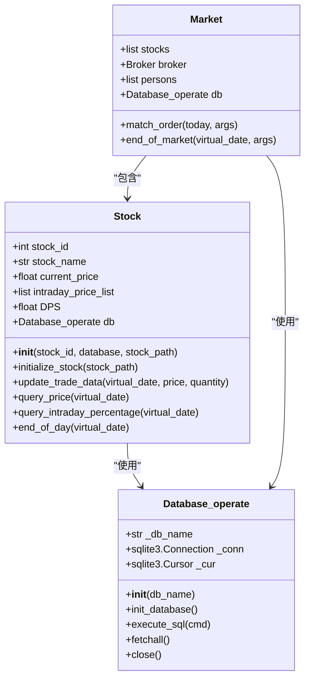
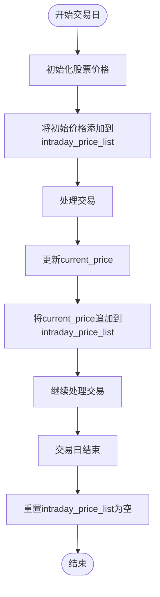
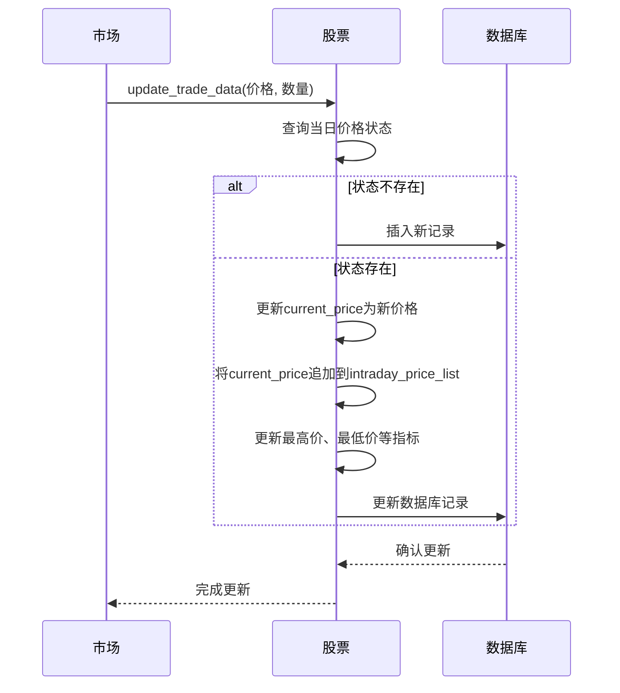
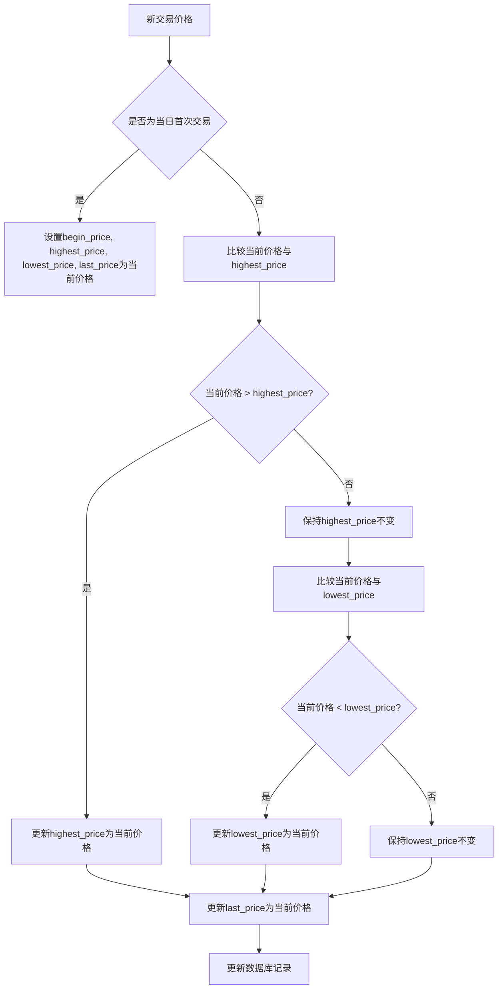
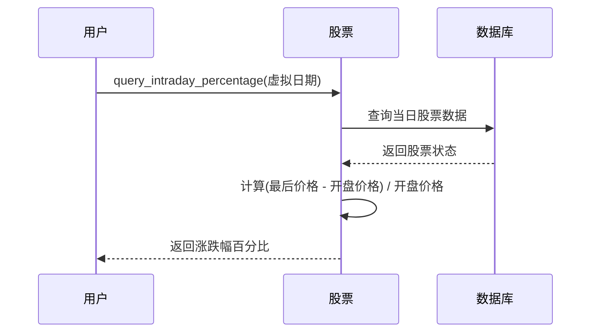
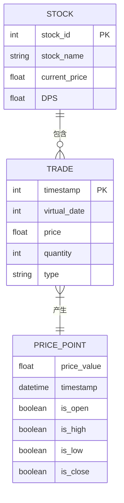
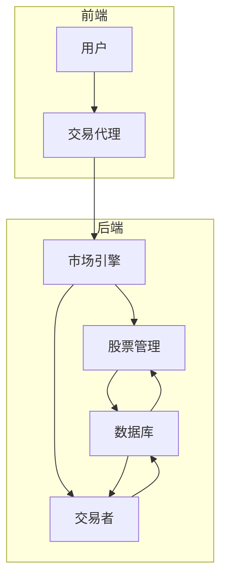

# 价格动态与日内数据

<cite>
**本文档引用的文件**   
- [Stock.py](file://Agent-Trading-Arena/Stock_Main/Stock.py)
- [database_utils.py](file://Agent-Trading-Arena/Stock_Main/database_utils.py)
- [Market.py](file://Agent-Trading-Arena/Stock_Main/Market.py)
- [main.py](file://Agent-Trading-Arena/Stock_Main/main.py)
- [test_stock.py](file://Agent-Trading-Arena/Stock_Main/unit_test/test_stock.py)
</cite>

## 目录
1. [引言](#引言)
2. [核心价格管理机制](#核心价格管理机制)
3. [intraday_price_list 与日内价格序列](#intraday_price_list-与日内价格序列)
4. [current_price 与最新成交价](#current_price-与最新成交价)
5. [OHLC 数据计算逻辑](#ohlc-数据计算逻辑)
6. [query_intraday_percentage 方法](#query_intraday_percentage-方法)
7. [交易更新流程示例](#交易更新流程示例)
8. [系统架构与数据流](#系统架构与数据流)
9. [结论](#结论)

## 引言
本文档详细解释股票价格动态管理机制，重点描述单个交易日内的价格变动记录与计算逻辑。系统通过 `intraday_price_list` 列表记录日内价格序列，利用 `current_price` 属性表示最新成交价，并通过 `update_trade_data` 方法进行更新。文档将阐述 `begin_price`、`highest_price`、`lowest_price` 和 `last_price` 等数据库字段如何共同构成OHLC（开盘、最高、最低、收盘）数据，并结合 `query_intraday_percentage` 方法说明日内价格涨跌幅的计算方式。

**Section sources**
- [Stock.py](file://Agent-Trading-Arena/Stock_Main/Stock.py#L1-L50)

## 核心价格管理机制
股票价格管理由 `Stock` 类实现，该类负责维护单个股票的价格状态和交易数据。系统在每个交易日通过 `update_trade_data` 方法处理交易，更新价格指标，并在每日结束时通过 `end_of_day` 方法重置日内数据。价格数据存储在SQLite数据库中，通过 `Database_operate` 类进行持久化操作。

**Diagram sources**
- [Stock.py](file://Agent-Trading-Arena/Stock_Main/Stock.py#L14-L209)
- [database_utils.py](file://Agent-Trading-Arena/Stock_Main/database_utils.py#L245-L322)
- [Market.py](file://Agent-Trading-Arena/Stock_Main/Market.py#L12-L278)

**Section sources**
- [Stock.py](file://Agent-Trading-Arena/Stock_Main/Stock.py#L14-L209)
- [database_utils.py](file://Agent-Trading-Arena/Stock_Main/database_utils.py#L245-L322)

## intraday_price_list 与日内价格序列
`intraday_price_list` 是 `Stock` 类中的一个列表属性，用于记录单个交易日内的所有价格变动序列。该列表在股票初始化时被赋予初始价格，并在每次交易更新时追加最新价格。

在交易日开始时，系统通过 `initialize_stock` 方法将股票的初始价格添加到 `intraday_price_list` 中。在交易过程中，每当有新的交易发生，`update_trade_data` 方法会将最新的 `current_price` 追加到该列表中，从而形成完整的日内价格变动序列。

**Diagram sources**
- [Stock.py](file://Agent-Trading-Arena/Stock_Main/Stock.py#L35)
- [Stock.py](file://Agent-Trading-Arena/Stock_Main/Stock.py#L86)
- [Stock.py](file://Agent-Trading-Arena/Stock_Main/Stock.py#L53)

**Section sources**
- [Stock.py](file://Agent-Trading-Arena/Stock_Main/Stock.py#L23)
- [Stock.py](file://Agent-Trading-Arena/Stock_Main/Stock.py#L34-L36)
- [Stock.py](file://Agent-Trading-Arena/Stock_Main/Stock.py#L85-L87)

## current_price 与最新成交价
`current_price` 是 `Stock` 类中的一个核心属性，代表股票的最新成交价。该属性在股票初始化时被设置为历史最后一个价格，并在每次交易更新时被更新为最新的交易价格。

`current_price` 的更新发生在 `update_trade_data` 方法中。当有新的交易数据传入时，系统首先查询当天的股票状态，如果存在则更新 `current_price` 为传入的 `price` 参数值。这个最新价格不仅用于后续交易计算，还被追加到 `intraday_price_list` 中以记录价格变动序列。

**Diagram sources**
- [Stock.py](file://Agent-Trading-Arena/Stock_Main/Stock.py#L18)
- [Stock.py](file://Agent-Trading-Arena/Stock_Main/Stock.py#L34)
- [Stock.py](file://Agent-Trading-Arena/Stock_Main/Stock.py#L85-L86)

**Section sources**
- [Stock.py](file://Agent-Trading-Arena/Stock_Main/Stock.py#L18)
- [Stock.py](file://Agent-Trading-Arena/Stock_Main/Stock.py#L85-L87)

## OHLC 数据计算逻辑
系统通过数据库中的 `begin_price`、`highest_price`、`lowest_price` 和 `last_price` 字段共同构成OHLC（开盘、最高、最低、收盘）数据。这些字段在 `update_trade_data` 方法中被计算和更新。

- `begin_price`：在交易日开始时设置，通常为前一日的收盘价或当日初始价格
- `highest_price`：在每次交易更新时，与当前交易价格比较，取较大值
- `lowest_price`：在每次交易更新时，与当前交易价格比较，取较小值
- `last_price`：在每次交易更新时，直接设置为当前交易价格

这些字段的计算逻辑确保了OHLC数据的准确性和实时性，为技术分析提供了基础数据支持。

**Diagram sources**
- [Stock.py](file://Agent-Trading-Arena/Stock_Main/Stock.py#L79-L82)
- [Stock.py](file://Agent-Trading-Arena/Stock_Main/Stock.py#L89-L98)
- [database_utils.py](file://Agent-Trading-Arena/Stock_Main/database_utils.py#L266-L270)

**Section sources**
- [Stock.py](file://Agent-Trading-Arena/Stock_Main/Stock.py#L79-L108)
- [database_utils.py](file://Agent-Trading-Arena/Stock_Main/database_utils.py#L266-L270)

## query_intraday_percentage 方法
`query_intraday_percentage` 方法用于计算日内价格涨跌幅，返回当日价格相对于开盘价的变化百分比。该方法通过查询数据库获取当日的 `last_price` 和 `begin_price`，然后应用标准的百分比变化公式进行计算。

计算公式为：(当日收盘价 - 当日开盘价) / 当日开盘价。该方法为交易决策提供了重要的日内价格变动指标，帮助分析股票在单个交易日内的表现。

**Diagram sources**
- [Stock.py](file://Agent-Trading-Arena/Stock_Main/Stock.py#L128-L138)

**Section sources**
- [Stock.py](file://Agent-Trading-Arena/Stock_Main/Stock.py#L128-L138)

## 交易更新流程示例
以下示例展示了单笔或多笔交易如何影响价格指标的更新过程。当交易发生时，系统会更新 `current_price`、`intraday_price_list` 以及OHLC数据，确保所有价格指标保持同步和准确。

**Diagram sources**
- [Stock.py](file://Agent-Trading-Arena/Stock_Main/Stock.py#L67-L112)
- [Market.py](file://Agent-Trading-Arena/Stock_Main/Market.py#L64-L73)

**Section sources**
- [Stock.py](file://Agent-Trading-Arena/Stock_Main/Stock.py#L67-L112)
- [test_stock.py](file://Agent-Trading-Arena/Stock_Main/unit_test/test_stock.py#L70-L75)

## 系统架构与数据流
系统采用模块化架构，由 `Stock`、`Market`、`Person` 和 `Database_operate` 等核心组件构成。`Market` 类负责协调交易流程，`Stock` 类管理价格数据，`Person` 类代表交易参与者，而 `Database_operate` 类提供数据持久化支持。

数据流从交易请求开始，经过市场匹配引擎，更新股票价格状态，最终持久化到数据库中。这种架构确保了价格动态管理的高效性和可靠性。

**Diagram sources**
- [main.py](file://Agent-Trading-Arena/Stock_Main/main.py#L108-L145)
- [Market.py](file://Agent-Trading-Arena/Stock_Main/Market.py#L12-L278)

**Section sources**
- [main.py](file://Agent-Trading-Arena/Stock_Main/main.py#L94-L95)
- [Market.py](file://Agent-Trading-Arena/Stock_Main/Market.py#L12-L278)

## 结论
本文档详细阐述了股票价格动态管理机制，包括 `intraday_price_list` 如何记录日内价格序列，`current_price` 如何代表并更新最新成交价，以及 `begin_price`、`highest_price`、`lowest_price` 和 `last_price` 等字段如何共同构成OHLC数据。通过 `query_intraday_percentage` 方法，系统能够计算日内价格涨跌幅，为交易决策提供重要参考。整个价格管理体系设计合理，确保了数据的准确性和实时性。